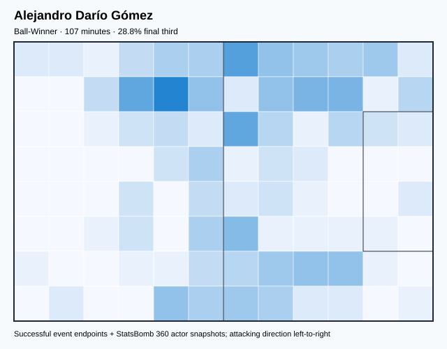
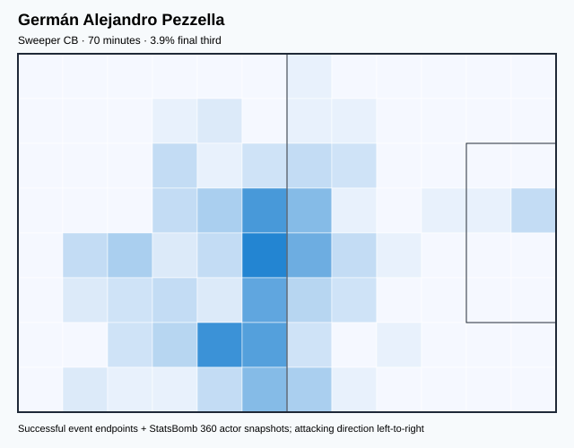
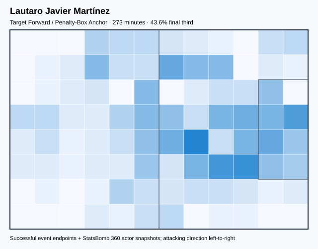
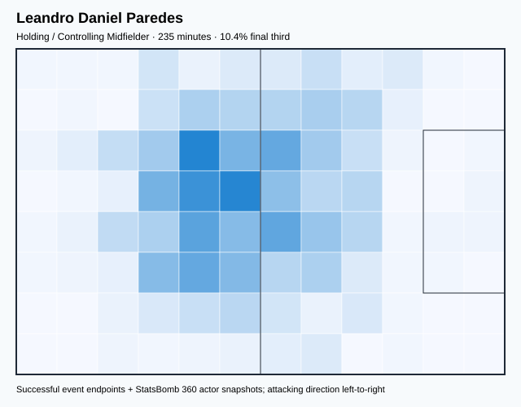
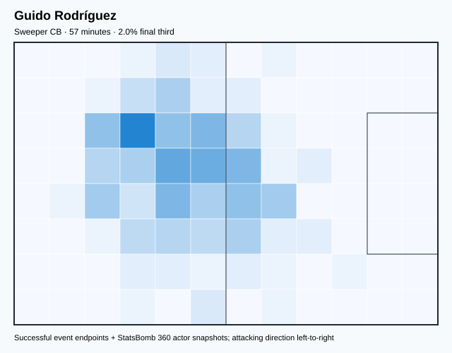
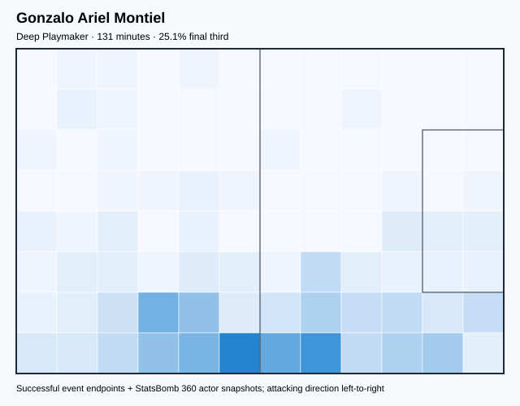
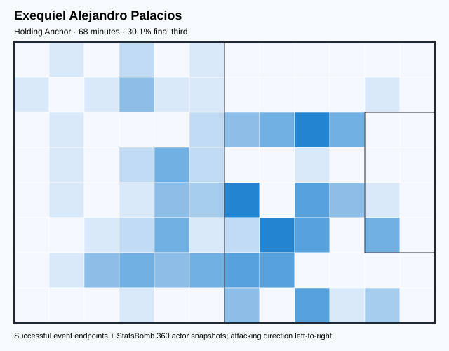

# ARG — V4 Player Evaluation Collection

<!-- V5_CANONICAL_NOTICE -->
> **Historical V4 player-rating packet.** Player ratings, ranks, role-challenger decisions, and rating uncertainty below are superseded by `results/reports/player_rankings.csv`, `results/reports/player_profiles/`, and `results/reports/model_summary.md`. Possession, tactical, and match-bootstrap material remains a historical V4 result.

- Included eligible players: 20
- Rankings use the role-aware, development-gated VAEP/xT/xD model.
- Heatmaps combine successful on-ball endpoints and SB360 actor snapshots.

---

<!-- PLAYER_REPORT 1: 2995_starter_report.md -->

# Ángel Fabián Di María Hernández — Starter Report

- Team: Argentina (ARG)
- Position: Right Midfield
- Functional role: Progressive Winger
- VAEP offense per 90: 0.7181
- VAEP defense per 90: 0.0150
- VAEP total per 90: 0.7331
- VAEP per touch: 0.00417
- Spatial xT per 90: 0.1997
- Final-third spatial share: 61.5%
- Unified final player rating: 0.2290
- Team rank: #4

## Physical profile

| Metric | Score |
|---|---:|
| Aerial dominance | 0.000 |
| Pressing intensity per 90 | 10.92 |
| Recovery index per 90 | 2.95 |

## Top chemistry partners

- Nicolás Hernán Otamendi — synergy 0.640, 305 shared minutes
- Lionel Andrés Messi Cuccittini — synergy 0.598, 305 shared minutes
- Rodrigo Javier De Paul — synergy 0.572, 295 shared minutes

## Tactical recommendations

- Lead the first pressing trigger and protect the inside passing lane.
- Avoid isolating this player in high-volume aerial matchups.
- Use recovery capacity to support higher attacking positions.

_The heatmap combines successful event endpoints with StatsBomb 360 actor
snapshots. StatsBomb 360 is freeze-frame context, not continuous player
tracking. Ratings include eligible outfield players from 45 minutes and
goalkeepers from 90 minutes; ranking status communicates sample reliability._

---

<!-- PLAYER_REPORT 2: 3090_starter_report.md -->

# Nicolás Hernán Otamendi — Starter Report

- Team: Argentina (ARG)
- Position: Left Center Back
- Functional role: Sweeper CB
- VAEP offense per 90: 0.0320
- VAEP defense per 90: -0.0465
- VAEP total per 90: -0.0144
- VAEP per touch: -0.00008
- Spatial xT per 90: 0.0040
- Final-third spatial share: 3.2%
- Unified final player rating: -0.0075
- Team rank: #17

## Physical profile

| Metric | Score |
|---|---:|
| Aerial dominance | 0.614 |
| Pressing intensity per 90 | 7.85 |
| Recovery index per 90 | 3.31 |

## Top chemistry partners

- Damián Emiliano Martínez — synergy 0.927, 734 shared minutes
- Enzo Fernandez — synergy 0.882, 601 shared minutes
- Cristian Gabriel Romero — synergy 0.878, 576 shared minutes

## Tactical recommendations

- Use a compact pressing trigger rather than sustained solo pressure.
- Target this player on direct restarts and back-post deliveries.
- Use recovery capacity to support higher attacking positions.

_The heatmap combines successful event endpoints with StatsBomb 360 actor
snapshots. StatsBomb 360 is freeze-frame context, not continuous player
tracking. Ratings include eligible outfield players from 45 minutes and
goalkeepers from 90 minutes; ranking status communicates sample reliability._

---

<!-- PLAYER_REPORT 3: 5503_starter_report.md -->

# Lionel Andrés Messi Cuccittini — Starter Report

- Team: Argentina (ARG)
- Position: Right Wing
- Functional role: Progressive Winger
- VAEP offense per 90: 0.5820
- VAEP defense per 90: 0.0497
- VAEP total per 90: 0.6317
- VAEP per touch: 0.00378
- Spatial xT per 90: 0.1579
- Final-third spatial share: 45.2%
- Unified final player rating: 0.2832
- Team rank: #2

## Physical profile

| Metric | Score |
|---|---:|
| Aerial dominance | 0.333 |
| Pressing intensity per 90 | 10.91 |
| Recovery index per 90 | 3.68 |

## Top chemistry partners

- Enzo Fernandez — synergy 0.794, 601 shared minutes
- Nicolás Hernán Otamendi — synergy 0.789, 734 shared minutes
- Rodrigo Javier De Paul — synergy 0.776, 635 shared minutes

## Tactical recommendations

- Lead the first pressing trigger and protect the inside passing lane.
- Use recovery capacity to support higher attacking positions.

_The heatmap combines successful event endpoints with StatsBomb 360 actor
snapshots. StatsBomb 360 is freeze-frame context, not continuous player
tracking. Ratings include eligible outfield players from 45 minutes and
goalkeepers from 90 minutes; ranking status communicates sample reliability._

---

<!-- PLAYER_REPORT 4: 5507_starter_report.md -->

# Nicolás Alejandro Tagliafico — Starter Report

- Team: Argentina (ARG)
- Position: Left Back
- Functional role: Wide Creator
- VAEP offense per 90: 0.2347
- VAEP defense per 90: 0.0293
- VAEP total per 90: 0.2640
- VAEP per touch: 0.00255
- Spatial xT per 90: 0.0210
- Final-third spatial share: 27.6%
- Unified final player rating: 0.0925
- Team rank: #9

## Physical profile

| Metric | Score |
|---|---:|
| Aerial dominance | 0.889 |
| Pressing intensity per 90 | 13.73 |
| Recovery index per 90 | 2.97 |

## Top chemistry partners

- Nicolás Hernán Otamendi — synergy 0.752, 393 shared minutes
- Enzo Fernandez — synergy 0.664, 317 shared minutes
- Cristian Gabriel Romero — synergy 0.655, 338 shared minutes

## Tactical recommendations

- Lead the first pressing trigger and protect the inside passing lane.
- Target this player on direct restarts and back-post deliveries.
- Use recovery capacity to support higher attacking positions.

_The heatmap combines successful event endpoints with StatsBomb 360 actor
snapshots. StatsBomb 360 is freeze-frame context, not continuous player
tracking. Ratings include eligible outfield players from 45 minutes and
goalkeepers from 90 minutes; ranking status communicates sample reliability._

---

<!-- PLAYER_REPORT 5: 6909_starter_report.md -->

# Damián Emiliano Martínez — Starter Report

- Team: Argentina (ARG)
- Position: Goalkeeper
- Functional role: Goalkeeper
- VAEP offense per 90: 0.0382
- VAEP defense per 90: 0.1576
- VAEP total per 90: 0.1958
- VAEP per touch: 0.00431
- Spatial xT per 90: 0.0025
- Final-third spatial share: 1.1%
- Unified final player rating: 0.0385
- Team rank: #12

## Physical profile

| Metric | Score |
|---|---:|
| Aerial dominance | 0.000 |
| Pressing intensity per 90 | 0.00 |
| Recovery index per 90 | 3.68 |

## Top chemistry partners

- Nicolás Hernán Otamendi — synergy 0.927, 734 shared minutes
- Cristian Gabriel Romero — synergy 0.871, 576 shared minutes
- Rodrigo Javier De Paul — synergy 0.852, 635 shared minutes

## Tactical recommendations

- Use a compact pressing trigger rather than sustained solo pressure.
- Avoid isolating this player in high-volume aerial matchups.
- Use recovery capacity to support higher attacking positions.

_The heatmap combines successful event endpoints with StatsBomb 360 actor
snapshots. StatsBomb 360 is freeze-frame context, not continuous player
tracking. Ratings include eligible outfield players from 45 minutes and
goalkeepers from 90 minutes; ranking status communicates sample reliability._

---

<!-- PLAYER_REPORT 6: 7006_starter_report.md -->

# Alejandro Darío Gómez — Starter Report

- Team: Argentina (ARG)
- Position: Left Midfield
- Functional role: Ball-Winner
- VAEP offense per 90: 0.2994
- VAEP defense per 90: -0.0133
- VAEP total per 90: 0.2861
- VAEP per touch: 0.00173
- Spatial xT per 90: 0.0295
- Final-third spatial share: 28.8%
- Unified final player rating: 0.1159
- Team rank: #7

## Physical profile

| Metric | Score |
|---|---:|
| Aerial dominance | 0.500 |
| Pressing intensity per 90 | 10.90 |
| Recovery index per 90 | 4.19 |

## Top chemistry partners

- Nicolás Hernán Otamendi — synergy 0.315, 107 shared minutes
- Cristian Gabriel Romero — synergy 0.312, 107 shared minutes
- Nahuel Molina Lucero — synergy 0.298, 107 shared minutes

## Tactical recommendations

- Lead the first pressing trigger and protect the inside passing lane.
- Use recovery capacity to support higher attacking positions.

_The heatmap combines successful event endpoints with StatsBomb 360 actor
snapshots. StatsBomb 360 is freeze-frame context, not continuous player
tracking. Ratings include eligible outfield players from 45 minutes and
goalkeepers from 90 minutes; ranking status communicates sample reliability._

---

<!-- PLAYER_REPORT 7: 7161_starter_report.md -->

# Germán Alejandro Pezzella — Starter Report

- Team: Argentina (ARG)
- Position: Right Center Back
- Functional role: Sweeper CB
- VAEP offense per 90: -0.0029
- VAEP defense per 90: -0.0020
- VAEP total per 90: -0.0049
- VAEP per touch: -0.00003
- Spatial xT per 90: 0.0119
- Final-third spatial share: 3.9%
- Unified final player rating: -0.0079
- Team rank: #18

## Physical profile

| Metric | Score |
|---|---:|
| Aerial dominance | 0.143 |
| Pressing intensity per 90 | 2.57 |
| Recovery index per 90 | 2.57 |

## Top chemistry partners

- Nicolás Hernán Otamendi — synergy 0.223, 70 shared minutes
- Leandro Daniel Paredes — synergy 0.223, 70 shared minutes
- Damián Emiliano Martínez — synergy 0.216, 70 shared minutes

## Tactical recommendations

- Use a compact pressing trigger rather than sustained solo pressure.
- Avoid isolating this player in high-volume aerial matchups.
- Use recovery capacity to support higher attacking positions.

_The heatmap combines successful event endpoints with StatsBomb 360 actor
snapshots. StatsBomb 360 is freeze-frame context, not continuous player
tracking. Ratings include eligible outfield players from 45 minutes and
goalkeepers from 90 minutes; ranking status communicates sample reliability._

---

<!-- PLAYER_REPORT 8: 7797_starter_report.md -->

# Rodrigo Javier De Paul — Starter Report

- Team: Argentina (ARG)
- Position: Right Defensive Midfield
- Functional role: Deep Playmaker
- VAEP offense per 90: 0.2237
- VAEP defense per 90: 0.0205
- VAEP total per 90: 0.2442
- VAEP per touch: 0.00108
- Spatial xT per 90: 0.0524
- Final-third spatial share: 27.7%
- Unified final player rating: 0.0868
- Team rank: #10

## Physical profile

| Metric | Score |
|---|---:|
| Aerial dominance | 0.333 |
| Pressing intensity per 90 | 18.01 |
| Recovery index per 90 | 4.82 |

## Top chemistry partners

- Damián Emiliano Martínez — synergy 0.852, 635 shared minutes
- Nicolás Hernán Otamendi — synergy 0.844, 635 shared minutes
- Cristian Gabriel Romero — synergy 0.838, 520 shared minutes

## Tactical recommendations

- Lead the first pressing trigger and protect the inside passing lane.
- Use recovery capacity to support higher attacking positions.

_The heatmap combines successful event endpoints with StatsBomb 360 actor
snapshots. StatsBomb 360 is freeze-frame context, not continuous player
tracking. Ratings include eligible outfield players from 45 minutes and
goalkeepers from 90 minutes; ranking status communicates sample reliability._

---

<!-- PLAYER_REPORT 9: 11456_starter_report.md -->

# Lautaro Javier Martínez — Starter Report

- Team: Argentina (ARG)
- Position: Left Center Forward
- Functional role: Target Forward / Penalty-Box Anchor
- VAEP offense per 90: 0.7623
- VAEP defense per 90: 0.0019
- VAEP total per 90: 0.7643
- VAEP per touch: 0.00783
- Spatial xT per 90: 0.0205
- Final-third spatial share: 43.6%
- Unified final player rating: 0.2956
- Team rank: #1

## Physical profile

| Metric | Score |
|---|---:|
| Aerial dominance | 0.545 |
| Pressing intensity per 90 | 6.92 |
| Recovery index per 90 | 1.65 |

## Top chemistry partners

- Lionel Andrés Messi Cuccittini — synergy 0.432, 273 shared minutes
- Damián Emiliano Martínez — synergy 0.429, 273 shared minutes
- Nahuel Molina Lucero — synergy 0.414, 154 shared minutes

## Tactical recommendations

- Use a compact pressing trigger rather than sustained solo pressure.
- Pair with a faster recovery defender after aggressive rotations.

_The heatmap combines successful event endpoints with StatsBomb 360 actor
snapshots. StatsBomb 360 is freeze-frame context, not continuous player
tracking. Ratings include eligible outfield players from 45 minutes and
goalkeepers from 90 minutes; ranking status communicates sample reliability._

---

<!-- PLAYER_REPORT 10: 16308_starter_report.md -->

# Leandro Daniel Paredes — Starter Report

- Team: Argentina (ARG)
- Position: Right Defensive Midfield
- Functional role: Holding / Controlling Midfielder
- VAEP offense per 90: -0.3663
- VAEP defense per 90: -0.0395
- VAEP total per 90: -0.4058
- VAEP per touch: -0.00167
- Spatial xT per 90: 0.0436
- Final-third spatial share: 10.4%
- Unified final player rating: -0.0526
- Team rank: #20

## Physical profile

| Metric | Score |
|---|---:|
| Aerial dominance | 1.000 |
| Pressing intensity per 90 | 20.27 |
| Recovery index per 90 | 3.82 |

## Top chemistry partners

- Nicolás Hernán Otamendi — synergy 0.578, 235 shared minutes
- Nicolás Alejandro Tagliafico — synergy 0.549, 220 shared minutes
- Damián Emiliano Martínez — synergy 0.544, 235 shared minutes

## Tactical recommendations

- Lead the first pressing trigger and protect the inside passing lane.
- Target this player on direct restarts and back-post deliveries.
- Use recovery capacity to support higher attacking positions.

_The heatmap combines successful event endpoints with StatsBomb 360 actor
snapshots. StatsBomb 360 is freeze-frame context, not continuous player
tracking. Ratings include eligible outfield players from 45 minutes and
goalkeepers from 90 minutes; ranking status communicates sample reliability._

---

<!-- PLAYER_REPORT 11: 19597_starter_report.md -->

# Marcos Javier Acuña — Starter Report

- Team: Argentina (ARG)
- Position: Left Back
- Functional role: Attacking Wingback
- VAEP offense per 90: 0.4113
- VAEP defense per 90: 0.0112
- VAEP total per 90: 0.4224
- VAEP per touch: 0.00314
- Spatial xT per 90: 0.0682
- Final-third spatial share: 36.0%
- Unified final player rating: 0.1344
- Team rank: #6

## Physical profile

| Metric | Score |
|---|---:|
| Aerial dominance | 0.556 |
| Pressing intensity per 90 | 12.45 |
| Recovery index per 90 | 4.08 |

## Top chemistry partners

- Nicolás Hernán Otamendi — synergy 0.742, 397 shared minutes
- Lionel Andrés Messi Cuccittini — synergy 0.706, 397 shared minutes
- Enzo Fernandez — synergy 0.668, 341 shared minutes

## Tactical recommendations

- Lead the first pressing trigger and protect the inside passing lane.
- Use recovery capacity to support higher attacking positions.

_The heatmap combines successful event endpoints with StatsBomb 360 actor
snapshots. StatsBomb 360 is freeze-frame context, not continuous player
tracking. Ratings include eligible outfield players from 45 minutes and
goalkeepers from 90 minutes; ranking status communicates sample reliability._

---

<!-- PLAYER_REPORT 12: 20572_starter_report.md -->

# Cristian Gabriel Romero — Starter Report

- Team: Argentina (ARG)
- Position: Right Center Back
- Functional role: Ball-Playing Centre-Back
- VAEP offense per 90: 0.0197
- VAEP defense per 90: -0.1490
- VAEP total per 90: -0.1293
- VAEP per touch: -0.00086
- Spatial xT per 90: 0.0054
- Final-third spatial share: 4.7%
- Unified final player rating: -0.0398
- Team rank: #19

## Physical profile

| Metric | Score |
|---|---:|
| Aerial dominance | 0.640 |
| Pressing intensity per 90 | 10.47 |
| Recovery index per 90 | 2.50 |

## Top chemistry partners

- Nicolás Hernán Otamendi — synergy 0.878, 576 shared minutes
- Damián Emiliano Martínez — synergy 0.871, 576 shared minutes
- Rodrigo Javier De Paul — synergy 0.838, 520 shared minutes

## Tactical recommendations

- Use a compact pressing trigger rather than sustained solo pressure.
- Target this player on direct restarts and back-post deliveries.
- Pair with a faster recovery defender after aggressive rotations.

_The heatmap combines successful event endpoints with StatsBomb 360 actor
snapshots. StatsBomb 360 is freeze-frame context, not continuous player
tracking. Ratings include eligible outfield players from 45 minutes and
goalkeepers from 90 minutes; ranking status communicates sample reliability._

---

<!-- PLAYER_REPORT 13: 26404_starter_report.md -->

# Guido Rodríguez — Starter Report

- Team: Argentina (ARG)
- Position: Left Defensive Midfield
- Functional role: Sweeper CB
- VAEP offense per 90: 0.0077
- VAEP defense per 90: -0.0016
- VAEP total per 90: 0.0060
- VAEP per touch: 0.00002
- Spatial xT per 90: 0.0093
- Final-third spatial share: 2.0%
- Unified final player rating: 0.0198
- Team rank: #14

## Physical profile

| Metric | Score |
|---|---:|
| Aerial dominance | 1.000 |
| Pressing intensity per 90 | 9.51 |
| Recovery index per 90 | 1.59 |

## Top chemistry partners

- Nicolás Hernán Otamendi — synergy 0.186, 57 shared minutes
- Alexis Mac Allister — synergy 0.183, 57 shared minutes
- Marcos Javier Acuña — synergy 0.180, 57 shared minutes

## Tactical recommendations

- Use a compact pressing trigger rather than sustained solo pressure.
- Target this player on direct restarts and back-post deliveries.
- Pair with a faster recovery defender after aggressive rotations.

_The heatmap combines successful event endpoints with StatsBomb 360 actor
snapshots. StatsBomb 360 is freeze-frame context, not continuous player
tracking. Ratings include eligible outfield players from 45 minutes and
goalkeepers from 90 minutes; ranking status communicates sample reliability._

---

<!-- PLAYER_REPORT 14: 27768_starter_report.md -->

# Lisandro Martínez — Starter Report

- Team: Argentina (ARG)
- Position: Left Center Back
- Functional role: Sweeper CB
- VAEP offense per 90: 0.0225
- VAEP defense per 90: 0.0076
- VAEP total per 90: 0.0301
- VAEP per touch: 0.00028
- Spatial xT per 90: 0.0136
- Final-third spatial share: 8.0%
- Unified final player rating: 0.0024
- Team rank: #16

## Physical profile

| Metric | Score |
|---|---:|
| Aerial dominance | 0.500 |
| Pressing intensity per 90 | 6.99 |
| Recovery index per 90 | 1.61 |

## Top chemistry partners

- Nicolás Hernán Otamendi — synergy 0.705, 335 shared minutes
- Damián Emiliano Martínez — synergy 0.688, 335 shared minutes
- Lionel Andrés Messi Cuccittini — synergy 0.676, 335 shared minutes

## Tactical recommendations

- Use a compact pressing trigger rather than sustained solo pressure.
- Pair with a faster recovery defender after aggressive rotations.

_The heatmap combines successful event endpoints with StatsBomb 360 actor
snapshots. StatsBomb 360 is freeze-frame context, not continuous player
tracking. Ratings include eligible outfield players from 45 minutes and
goalkeepers from 90 minutes; ranking status communicates sample reliability._

---

<!-- PLAYER_REPORT 15: 27886_starter_report.md -->

# Alexis Mac Allister — Starter Report

- Team: Argentina (ARG)
- Position: Left Center Midfield
- Functional role: Ball-Winner
- VAEP offense per 90: 0.3174
- VAEP defense per 90: 0.0059
- VAEP total per 90: 0.3233
- VAEP per touch: 0.00231
- Spatial xT per 90: 0.0067
- Final-third spatial share: 38.9%
- Unified final player rating: 0.1387
- Team rank: #5

## Physical profile

| Metric | Score |
|---|---:|
| Aerial dominance | 0.312 |
| Pressing intensity per 90 | 12.38 |
| Recovery index per 90 | 4.40 |

## Top chemistry partners

- Nicolás Hernán Otamendi — synergy 0.848, 552 shared minutes
- Enzo Fernandez — synergy 0.787, 491 shared minutes
- Nahuel Molina Lucero — synergy 0.784, 448 shared minutes

## Tactical recommendations

- Lead the first pressing trigger and protect the inside passing lane.
- Use recovery capacity to support higher attacking positions.

_The heatmap combines successful event endpoints with StatsBomb 360 actor
snapshots. StatsBomb 360 is freeze-frame context, not continuous player
tracking. Ratings include eligible outfield players from 45 minutes and
goalkeepers from 90 minutes; ranking status communicates sample reliability._

---

<!-- PLAYER_REPORT 16: 28263_starter_report.md -->

# Gonzalo Ariel Montiel — Starter Report

- Team: Argentina (ARG)
- Position: Right Back
- Functional role: Deep Playmaker
- VAEP offense per 90: -0.0937
- VAEP defense per 90: -0.0168
- VAEP total per 90: -0.1106
- VAEP per touch: -0.00070
- Spatial xT per 90: 0.0448
- Final-third spatial share: 25.1%
- Unified final player rating: 0.0311
- Team rank: #13

## Physical profile

| Metric | Score |
|---|---:|
| Aerial dominance | 0.667 |
| Pressing intensity per 90 | 13.08 |
| Recovery index per 90 | 2.06 |

## Top chemistry partners

- Nicolás Hernán Otamendi — synergy 0.368, 131 shared minutes
- Damián Emiliano Martínez — synergy 0.364, 131 shared minutes
- Lionel Andrés Messi Cuccittini — synergy 0.341, 131 shared minutes

## Tactical recommendations

- Lead the first pressing trigger and protect the inside passing lane.
- Target this player on direct restarts and back-post deliveries.
- Pair with a faster recovery defender after aggressive rotations.

_The heatmap combines successful event endpoints with StatsBomb 360 actor
snapshots. StatsBomb 360 is freeze-frame context, not continuous player
tracking. Ratings include eligible outfield players from 45 minutes and
goalkeepers from 90 minutes; ranking status communicates sample reliability._

---

<!-- PLAYER_REPORT 17: 28268_starter_report.md -->

# Exequiel Alejandro Palacios — Starter Report

- Team: Argentina (ARG)
- Position: Left Center Midfield
- Functional role: Holding Anchor
- VAEP offense per 90: 0.1206
- VAEP defense per 90: -0.0952
- VAEP total per 90: 0.0254
- VAEP per touch: 0.00023
- Spatial xT per 90: 0.0302
- Final-third spatial share: 30.1%
- Unified final player rating: 0.0963
- Team rank: #8

## Physical profile

| Metric | Score |
|---|---:|
| Aerial dominance | 0.000 |
| Pressing intensity per 90 | 26.57 |
| Recovery index per 90 | 5.31 |

## Top chemistry partners

- Enzo Fernandez — synergy 0.214, 68 shared minutes
- Nicolás Hernán Otamendi — synergy 0.200, 68 shared minutes
- Lisandro Martínez — synergy 0.200, 68 shared minutes

## Tactical recommendations

- Lead the first pressing trigger and protect the inside passing lane.
- Avoid isolating this player in high-volume aerial matchups.
- Use recovery capacity to support higher attacking positions.

_The heatmap combines successful event endpoints with StatsBomb 360 actor
snapshots. StatsBomb 360 is freeze-frame context, not continuous player
tracking. Ratings include eligible outfield players from 45 minutes and
goalkeepers from 90 minutes; ranking status communicates sample reliability._

---

<!-- PLAYER_REPORT 18: 29201_starter_report.md -->

# Nahuel Molina Lucero — Starter Report

- Team: Argentina (ARG)
- Position: Right Wing Back
- Functional role: Deep Playmaker
- VAEP offense per 90: 0.1532
- VAEP defense per 90: -0.0599
- VAEP total per 90: 0.0933
- VAEP per touch: 0.00069
- Spatial xT per 90: 0.0220
- Final-third spatial share: 24.9%
- Unified final player rating: 0.0523
- Team rank: #11

## Physical profile

| Metric | Score |
|---|---:|
| Aerial dominance | 0.000 |
| Pressing intensity per 90 | 12.88 |
| Recovery index per 90 | 2.58 |

## Top chemistry partners

- Cristian Gabriel Romero — synergy 0.835, 515 shared minutes
- Nicolás Hernán Otamendi — synergy 0.827, 594 shared minutes
- Enzo Fernandez — synergy 0.796, 518 shared minutes

## Tactical recommendations

- Lead the first pressing trigger and protect the inside passing lane.
- Avoid isolating this player in high-volume aerial matchups.
- Use recovery capacity to support higher attacking positions.

_The heatmap combines successful event endpoints with StatsBomb 360 actor
snapshots. StatsBomb 360 is freeze-frame context, not continuous player
tracking. Ratings include eligible outfield players from 45 minutes and
goalkeepers from 90 minutes; ranking status communicates sample reliability._

---

<!-- PLAYER_REPORT 19: 29560_starter_report.md -->

# Julián Álvarez — Starter Report

- Team: Argentina (ARG)
- Position: Center Forward
- Functional role: Ball-Winner
- VAEP offense per 90: 0.4752
- VAEP defense per 90: 0.0332
- VAEP total per 90: 0.5084
- VAEP per touch: 0.00599
- Spatial xT per 90: 0.0323
- Final-third spatial share: 49.0%
- Unified final player rating: 0.2513
- Team rank: #3

## Physical profile

| Metric | Score |
|---|---:|
| Aerial dominance | 0.250 |
| Pressing intensity per 90 | 22.26 |
| Recovery index per 90 | 2.60 |

## Top chemistry partners

- Nicolás Hernán Otamendi — synergy 0.733, 485 shared minutes
- Enzo Fernandez — synergy 0.682, 485 shared minutes
- Rodrigo Javier De Paul — synergy 0.668, 470 shared minutes

## Tactical recommendations

- Lead the first pressing trigger and protect the inside passing lane.
- Use recovery capacity to support higher attacking positions.

_The heatmap combines successful event endpoints with StatsBomb 360 actor
snapshots. StatsBomb 360 is freeze-frame context, not continuous player
tracking. Ratings include eligible outfield players from 45 minutes and
goalkeepers from 90 minutes; ranking status communicates sample reliability._

---

<!-- PLAYER_REPORT 20: 38718_starter_report.md -->

# Enzo Fernandez — Starter Report

- Team: Argentina (ARG)
- Position: Center Defensive Midfield
- Functional role: Holding Anchor
- VAEP offense per 90: 0.0521
- VAEP defense per 90: -0.0420
- VAEP total per 90: 0.0101
- VAEP per touch: 0.00005
- Spatial xT per 90: 0.0597
- Final-third spatial share: 16.1%
- Unified final player rating: 0.0190
- Team rank: #15

## Physical profile

| Metric | Score |
|---|---:|
| Aerial dominance | 0.421 |
| Pressing intensity per 90 | 17.52 |
| Recovery index per 90 | 3.74 |

## Top chemistry partners

- Nicolás Hernán Otamendi — synergy 0.882, 601 shared minutes
- Damián Emiliano Martínez — synergy 0.849, 601 shared minutes
- Cristian Gabriel Romero — synergy 0.818, 500 shared minutes

## Tactical recommendations

- Lead the first pressing trigger and protect the inside passing lane.
- Use recovery capacity to support higher attacking positions.

_The heatmap combines successful event endpoints with StatsBomb 360 actor
snapshots. StatsBomb 360 is freeze-frame context, not continuous player
tracking. Ratings include eligible outfield players from 45 minutes and
goalkeepers from 90 minutes; ranking status communicates sample reliability._
