# ARG — V4 Player Evaluation Collection

<!-- V5_CANONICAL_NOTICE -->
> **Historical V4 player-rating packet.** Player ratings, ranks, role-challenger decisions, and rating uncertainty below are superseded by `results/reports/player_rankings.csv`, `results/reports/player_profiles/`, and `results/reports/model_summary.md`. Possession, tactical, and match-bootstrap material remains a historical V4 result.

- Included 300+ minute players: 13
- Rankings use one cross-role 360-VAEP plus xT formula.
- Heatmaps combine successful on-ball endpoints and SB360 actor snapshots.

---

<!-- PLAYER_REPORT 1: 2995_starter_report.md -->

# Ángel Fabián Di María Hernández — Starter Report

- Team: Argentina (ARG)
- Position: Right Midfield
- Functional role: Progressive Winger
- VAEP offense per 90: 0.7666
- VAEP defense per 90: 0.0193
- VAEP total per 90: 0.7859
- VAEP per touch: 0.00447
- Spatial xT per 90: 0.1997
- Final-third spatial share: 61.5%
- Unified final player rating: 0.2879
- Team rank: #3
- Rating 95% CI: [0.1297, 0.3794] (bootstrap SE 0.0605)
- Rank stability: bootstrap mean rank 2.4; P(team #1) 20%, P(top 3) 90%

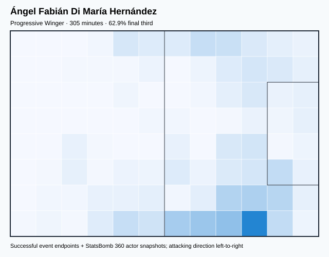

## Physical profile

| Metric | Score |
|---|---:|
| Aerial dominance | 0.000 |
| Pressing intensity per 90 | 10.92 |
| Recovery index per 90 | 2.95 |

## Top chemistry partners

- Nicolás Hernán Otamendi — synergy 0.640, 305 shared minutes
- Lionel Andrés Messi Cuccittini — synergy 0.598, 305 shared minutes
- Rodrigo Javier De Paul — synergy 0.572, 295 shared minutes

## Tactical recommendations

- Lead the first pressing trigger and protect the inside passing lane.
- Avoid isolating this player in high-volume aerial matchups.
- Use recovery capacity to support higher attacking positions.

_The heatmap combines successful event endpoints with StatsBomb 360 actor
snapshots. StatsBomb 360 is freeze-frame context, not continuous player
tracking. Scores exclude players below 300 tournament minutes._

---

<!-- PLAYER_REPORT 2: 3090_starter_report.md -->

# Nicolás Hernán Otamendi — Starter Report

- Team: Argentina (ARG)
- Position: Left Center Back
- Functional role: Deep Playmaker
- VAEP offense per 90: 0.0271
- VAEP defense per 90: -0.0438
- VAEP total per 90: -0.0166
- VAEP per touch: -0.00009
- Spatial xT per 90: 0.0040
- Final-third spatial share: 3.2%
- Unified final player rating: -0.0078
- Team rank: #12
- Rating 95% CI: [-0.0244, 0.0123] (bootstrap SE 0.0095)
- Rank stability: bootstrap mean rank 11.5; P(team #1) 0%, P(top 3) 0%

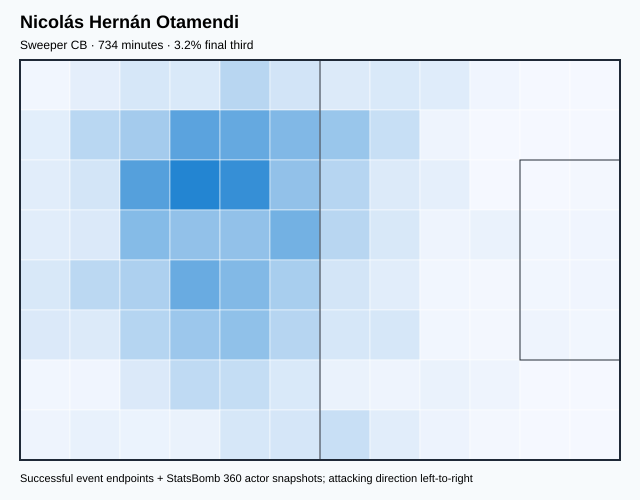

## Physical profile

| Metric | Score |
|---|---:|
| Aerial dominance | 0.614 |
| Pressing intensity per 90 | 7.85 |
| Recovery index per 90 | 3.31 |

## Top chemistry partners

- Damián Emiliano Martínez — synergy 0.927, 734 shared minutes
- Enzo Fernandez — synergy 0.882, 601 shared minutes
- Cristian Gabriel Romero — synergy 0.878, 576 shared minutes

## Tactical recommendations

- Use a compact pressing trigger rather than sustained solo pressure.
- Target this player on direct restarts and back-post deliveries.
- Use recovery capacity to support higher attacking positions.

_The heatmap combines successful event endpoints with StatsBomb 360 actor
snapshots. StatsBomb 360 is freeze-frame context, not continuous player
tracking. Scores exclude players below 300 tournament minutes._

---

<!-- PLAYER_REPORT 3: 5503_starter_report.md -->

# Lionel Andrés Messi Cuccittini — Starter Report

- Team: Argentina (ARG)
- Position: Right Wing
- Functional role: Progressive Winger
- VAEP offense per 90: 0.6499
- VAEP defense per 90: 0.0442
- VAEP total per 90: 0.6941
- VAEP per touch: 0.00416
- Spatial xT per 90: 0.1579
- Final-third spatial share: 45.2%
- Unified final player rating: 0.3297
- Team rank: #1
- Rating 95% CI: [0.2111, 0.4524] (bootstrap SE 0.0608)
- Rank stability: bootstrap mean rank 1.5; P(team #1) 63%, P(top 3) 100%

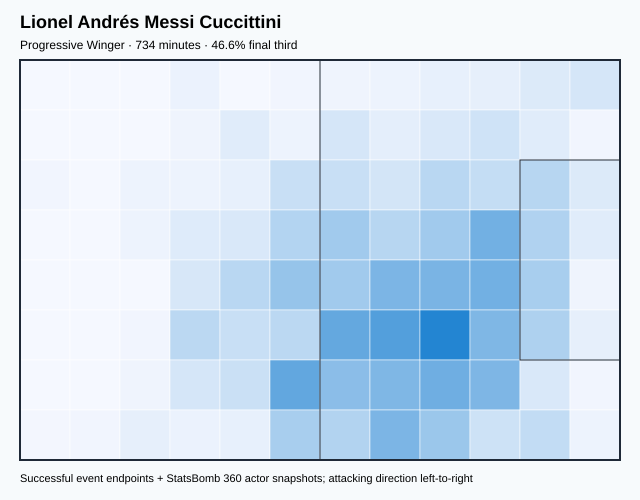

## Physical profile

| Metric | Score |
|---|---:|
| Aerial dominance | 0.333 |
| Pressing intensity per 90 | 10.91 |
| Recovery index per 90 | 3.68 |

## Top chemistry partners

- Enzo Fernandez — synergy 0.794, 601 shared minutes
- Nicolás Hernán Otamendi — synergy 0.789, 734 shared minutes
- Rodrigo Javier De Paul — synergy 0.776, 635 shared minutes

## Tactical recommendations

- Lead the first pressing trigger and protect the inside passing lane.
- Use recovery capacity to support higher attacking positions.

_The heatmap combines successful event endpoints with StatsBomb 360 actor
snapshots. StatsBomb 360 is freeze-frame context, not continuous player
tracking. Scores exclude players below 300 tournament minutes._

---

<!-- PLAYER_REPORT 4: 5507_starter_report.md -->

# Nicolás Alejandro Tagliafico — Starter Report

- Team: Argentina (ARG)
- Position: Left Back
- Functional role: Wide Creator
- VAEP offense per 90: 0.2089
- VAEP defense per 90: 0.0235
- VAEP total per 90: 0.2323
- VAEP per touch: 0.00224
- Spatial xT per 90: 0.0210
- Final-third spatial share: 27.6%
- Unified final player rating: 0.1020
- Team rank: #6
- Rating 95% CI: [0.0420, 0.1894] (bootstrap SE 0.0388)
- Rank stability: bootstrap mean rank 6.6; P(team #1) 0%, P(top 3) 0%

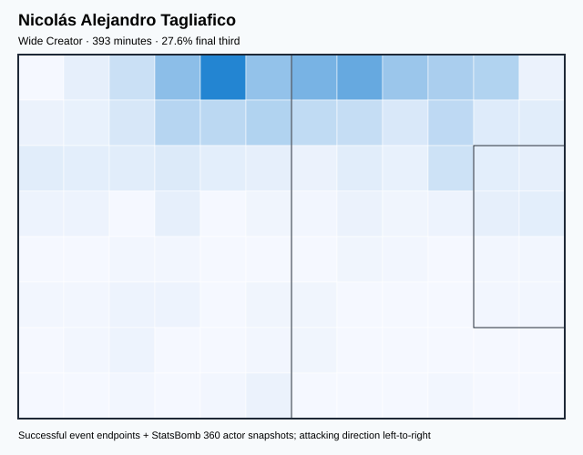

## Physical profile

| Metric | Score |
|---|---:|
| Aerial dominance | 0.889 |
| Pressing intensity per 90 | 13.73 |
| Recovery index per 90 | 2.97 |

## Top chemistry partners

- Nicolás Hernán Otamendi — synergy 0.752, 393 shared minutes
- Enzo Fernandez — synergy 0.664, 317 shared minutes
- Cristian Gabriel Romero — synergy 0.655, 338 shared minutes

## Tactical recommendations

- Lead the first pressing trigger and protect the inside passing lane.
- Target this player on direct restarts and back-post deliveries.
- Use recovery capacity to support higher attacking positions.

_The heatmap combines successful event endpoints with StatsBomb 360 actor
snapshots. StatsBomb 360 is freeze-frame context, not continuous player
tracking. Scores exclude players below 300 tournament minutes._

---

<!-- PLAYER_REPORT 5: 6909_starter_report.md -->

# Damián Emiliano Martínez — Starter Report

- Team: Argentina (ARG)
- Position: Goalkeeper
- Functional role: Goalkeeper
- VAEP offense per 90: 0.0326
- VAEP defense per 90: 0.2239
- VAEP total per 90: 0.2565
- VAEP per touch: 0.00565
- Spatial xT per 90: 0.0025
- Final-third spatial share: 1.1%
- Unified final player rating: 0.0776
- Team rank: #8
- Rating 95% CI: [-0.0478, 0.2128] (bootstrap SE 0.0697)
- Rank stability: bootstrap mean rank 7.8; P(team #1) 0%, P(top 3) 2%

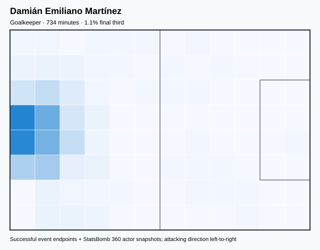

## Physical profile

| Metric | Score |
|---|---:|
| Aerial dominance | 0.000 |
| Pressing intensity per 90 | 0.00 |
| Recovery index per 90 | 3.68 |

## Top chemistry partners

- Nicolás Hernán Otamendi — synergy 0.927, 734 shared minutes
- Cristian Gabriel Romero — synergy 0.871, 576 shared minutes
- Rodrigo Javier De Paul — synergy 0.852, 635 shared minutes

## Tactical recommendations

- Use a compact pressing trigger rather than sustained solo pressure.
- Avoid isolating this player in high-volume aerial matchups.
- Use recovery capacity to support higher attacking positions.

_The heatmap combines successful event endpoints with StatsBomb 360 actor
snapshots. StatsBomb 360 is freeze-frame context, not continuous player
tracking. Scores exclude players below 300 tournament minutes._

---

<!-- PLAYER_REPORT 6: 7797_starter_report.md -->

# Rodrigo Javier De Paul — Starter Report

- Team: Argentina (ARG)
- Position: Right Defensive Midfield
- Functional role: Box-to-Box / Engine Midfielder
- VAEP offense per 90: 0.2109
- VAEP defense per 90: 0.0159
- VAEP total per 90: 0.2268
- VAEP per touch: 0.00100
- Spatial xT per 90: 0.0524
- Final-third spatial share: 27.7%
- Unified final player rating: 0.0940
- Team rank: #7
- Rating 95% CI: [0.0532, 0.1421] (bootstrap SE 0.0229)
- Rank stability: bootstrap mean rank 7.0; P(team #1) 0%, P(top 3) 0%

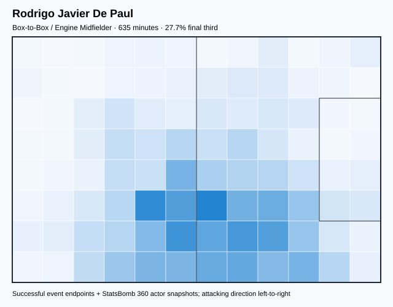

## Physical profile

| Metric | Score |
|---|---:|
| Aerial dominance | 0.333 |
| Pressing intensity per 90 | 18.01 |
| Recovery index per 90 | 4.82 |

## Top chemistry partners

- Damián Emiliano Martínez — synergy 0.852, 635 shared minutes
- Nicolás Hernán Otamendi — synergy 0.844, 635 shared minutes
- Cristian Gabriel Romero — synergy 0.838, 520 shared minutes

## Tactical recommendations

- Lead the first pressing trigger and protect the inside passing lane.
- Use recovery capacity to support higher attacking positions.

_The heatmap combines successful event endpoints with StatsBomb 360 actor
snapshots. StatsBomb 360 is freeze-frame context, not continuous player
tracking. Scores exclude players below 300 tournament minutes._

---

<!-- PLAYER_REPORT 7: 19597_starter_report.md -->

# Marcos Javier Acuña — Starter Report

- Team: Argentina (ARG)
- Position: Left Back
- Functional role: Attacking Wingback
- VAEP offense per 90: 0.4390
- VAEP defense per 90: 0.0074
- VAEP total per 90: 0.4464
- VAEP per touch: 0.00332
- Spatial xT per 90: 0.0682
- Final-third spatial share: 36.0%
- Unified final player rating: 0.1687
- Team rank: #4
- Rating 95% CI: [0.0615, 0.3653] (bootstrap SE 0.0859)
- Rank stability: bootstrap mean rank 4.8; P(team #1) 0%, P(top 3) 8%

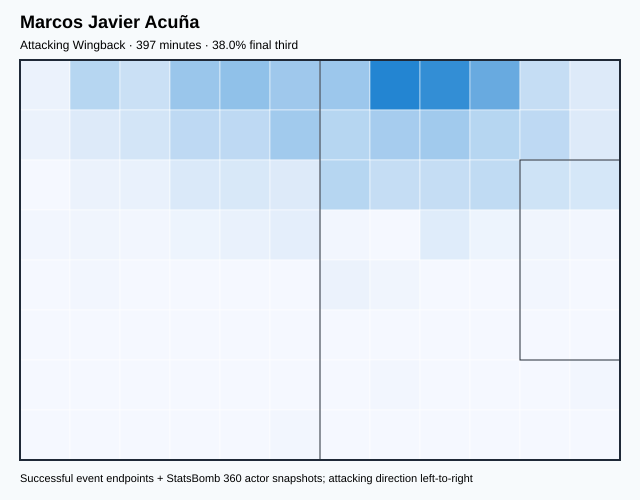

## Physical profile

| Metric | Score |
|---|---:|
| Aerial dominance | 0.556 |
| Pressing intensity per 90 | 12.45 |
| Recovery index per 90 | 4.08 |

## Top chemistry partners

- Nicolás Hernán Otamendi — synergy 0.742, 397 shared minutes
- Lionel Andrés Messi Cuccittini — synergy 0.706, 397 shared minutes
- Enzo Fernandez — synergy 0.668, 341 shared minutes

## Tactical recommendations

- Lead the first pressing trigger and protect the inside passing lane.
- Use recovery capacity to support higher attacking positions.

_The heatmap combines successful event endpoints with StatsBomb 360 actor
snapshots. StatsBomb 360 is freeze-frame context, not continuous player
tracking. Scores exclude players below 300 tournament minutes._

---

<!-- PLAYER_REPORT 8: 20572_starter_report.md -->

# Cristian Gabriel Romero — Starter Report

- Team: Argentina (ARG)
- Position: Right Center Back
- Functional role: Deep Playmaker
- VAEP offense per 90: 0.0176
- VAEP defense per 90: -0.1230
- VAEP total per 90: -0.1054
- VAEP per touch: -0.00070
- Spatial xT per 90: 0.0054
- Final-third spatial share: 4.7%
- Unified final player rating: -0.0369
- Team rank: #13
- Rating 95% CI: [-0.0780, -0.0051] (bootstrap SE 0.0192)
- Rank stability: bootstrap mean rank 12.7; P(team #1) 0%, P(top 3) 0%

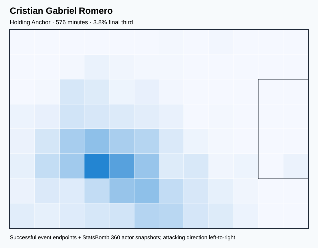

## Physical profile

| Metric | Score |
|---|---:|
| Aerial dominance | 0.640 |
| Pressing intensity per 90 | 10.47 |
| Recovery index per 90 | 2.50 |

## Top chemistry partners

- Nicolás Hernán Otamendi — synergy 0.878, 576 shared minutes
- Damián Emiliano Martínez — synergy 0.871, 576 shared minutes
- Rodrigo Javier De Paul — synergy 0.838, 520 shared minutes

## Tactical recommendations

- Use a compact pressing trigger rather than sustained solo pressure.
- Target this player on direct restarts and back-post deliveries.
- Pair with a faster recovery defender after aggressive rotations.

_The heatmap combines successful event endpoints with StatsBomb 360 actor
snapshots. StatsBomb 360 is freeze-frame context, not continuous player
tracking. Scores exclude players below 300 tournament minutes._

---

<!-- PLAYER_REPORT 9: 27768_starter_report.md -->

# Lisandro Martínez — Starter Report

- Team: Argentina (ARG)
- Position: Left Center Back
- Functional role: Sweeper CB
- VAEP offense per 90: 0.0259
- VAEP defense per 90: -0.0385
- VAEP total per 90: -0.0126
- VAEP per touch: -0.00012
- Spatial xT per 90: 0.0136
- Final-third spatial share: 8.0%
- Unified final player rating: -0.0058
- Team rank: #11
- Rating 95% CI: [-0.0585, 0.0266] (bootstrap SE 0.0218)
- Rank stability: bootstrap mean rank 11.4; P(team #1) 0%, P(top 3) 0%

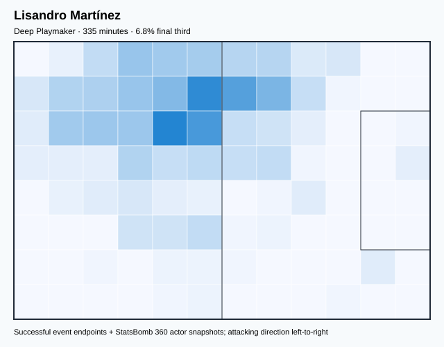

## Physical profile

| Metric | Score |
|---|---:|
| Aerial dominance | 0.500 |
| Pressing intensity per 90 | 6.99 |
| Recovery index per 90 | 1.61 |

## Top chemistry partners

- Nicolás Hernán Otamendi — synergy 0.705, 335 shared minutes
- Damián Emiliano Martínez — synergy 0.688, 335 shared minutes
- Lionel Andrés Messi Cuccittini — synergy 0.676, 335 shared minutes

## Tactical recommendations

- Use a compact pressing trigger rather than sustained solo pressure.
- Pair with a faster recovery defender after aggressive rotations.

_The heatmap combines successful event endpoints with StatsBomb 360 actor
snapshots. StatsBomb 360 is freeze-frame context, not continuous player
tracking. Scores exclude players below 300 tournament minutes._

---

<!-- PLAYER_REPORT 10: 27886_starter_report.md -->

# Alexis Mac Allister — Starter Report

- Team: Argentina (ARG)
- Position: Left Center Midfield
- Functional role: Ball-Winner
- VAEP offense per 90: 0.2799
- VAEP defense per 90: 0.0039
- VAEP total per 90: 0.2838
- VAEP per touch: 0.00203
- Spatial xT per 90: 0.0067
- Final-third spatial share: 38.9%
- Unified final player rating: 0.1423
- Team rank: #5
- Rating 95% CI: [0.0992, 0.1812] (bootstrap SE 0.0208)
- Rank stability: bootstrap mean rank 5.0; P(team #1) 0%, P(top 3) 2%

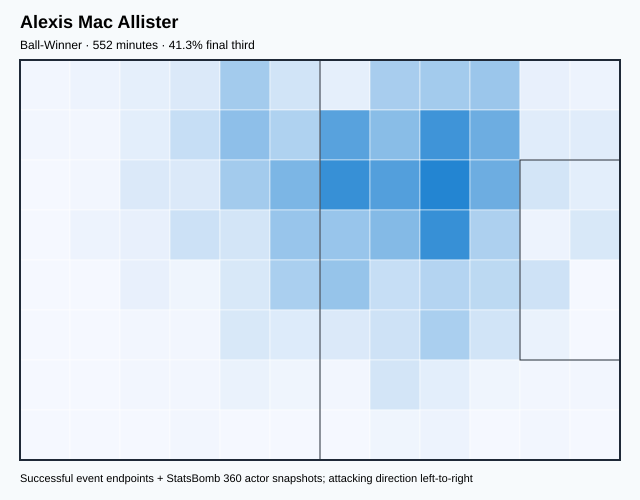

## Physical profile

| Metric | Score |
|---|---:|
| Aerial dominance | 0.312 |
| Pressing intensity per 90 | 12.38 |
| Recovery index per 90 | 4.40 |

## Top chemistry partners

- Nicolás Hernán Otamendi — synergy 0.848, 552 shared minutes
- Enzo Fernandez — synergy 0.787, 491 shared minutes
- Nahuel Molina Lucero — synergy 0.784, 448 shared minutes

## Tactical recommendations

- Lead the first pressing trigger and protect the inside passing lane.
- Use recovery capacity to support higher attacking positions.

_The heatmap combines successful event endpoints with StatsBomb 360 actor
snapshots. StatsBomb 360 is freeze-frame context, not continuous player
tracking. Scores exclude players below 300 tournament minutes._

---

<!-- PLAYER_REPORT 11: 29201_starter_report.md -->

# Nahuel Molina Lucero — Starter Report

- Team: Argentina (ARG)
- Position: Right Wing Back
- Functional role: Box-to-Box Runner
- VAEP offense per 90: 0.1627
- VAEP defense per 90: -0.0486
- VAEP total per 90: 0.1141
- VAEP per touch: 0.00084
- Spatial xT per 90: 0.0220
- Final-third spatial share: 24.9%
- Unified final player rating: 0.0668
- Team rank: #9
- Rating 95% CI: [0.0190, 0.1217] (bootstrap SE 0.0269)
- Rank stability: bootstrap mean rank 8.3; P(team #1) 0%, P(top 3) 0%

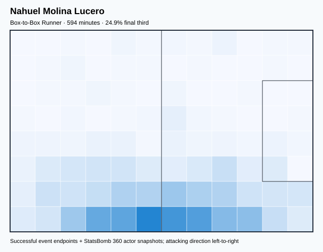

## Physical profile

| Metric | Score |
|---|---:|
| Aerial dominance | 0.000 |
| Pressing intensity per 90 | 12.88 |
| Recovery index per 90 | 2.58 |

## Top chemistry partners

- Cristian Gabriel Romero — synergy 0.835, 515 shared minutes
- Nicolás Hernán Otamendi — synergy 0.827, 594 shared minutes
- Enzo Fernandez — synergy 0.796, 518 shared minutes

## Tactical recommendations

- Lead the first pressing trigger and protect the inside passing lane.
- Avoid isolating this player in high-volume aerial matchups.
- Use recovery capacity to support higher attacking positions.

_The heatmap combines successful event endpoints with StatsBomb 360 actor
snapshots. StatsBomb 360 is freeze-frame context, not continuous player
tracking. Scores exclude players below 300 tournament minutes._

---

<!-- PLAYER_REPORT 12: 29560_starter_report.md -->

# Julián Álvarez — Starter Report

- Team: Argentina (ARG)
- Position: Center Forward
- Functional role: Target Forward
- VAEP offense per 90: 0.6055
- VAEP defense per 90: 0.0306
- VAEP total per 90: 0.6361
- VAEP per touch: 0.00749
- Spatial xT per 90: 0.0323
- Final-third spatial share: 49.0%
- Unified final player rating: 0.2905
- Team rank: #2
- Rating 95% CI: [0.1847, 0.4221] (bootstrap SE 0.0634)
- Rank stability: bootstrap mean rank 2.3; P(team #1) 16%, P(top 3) 98%

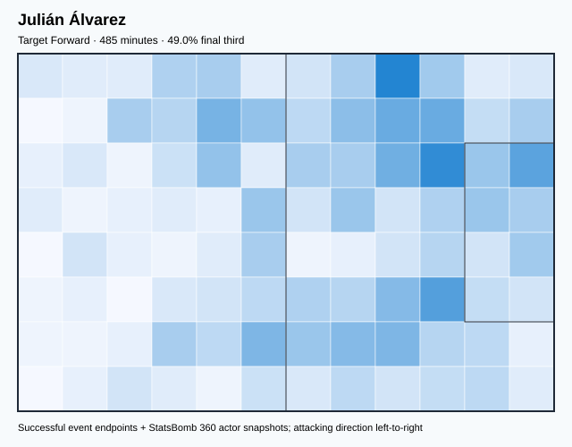

## Physical profile

| Metric | Score |
|---|---:|
| Aerial dominance | 0.250 |
| Pressing intensity per 90 | 22.26 |
| Recovery index per 90 | 2.60 |

## Top chemistry partners

- Nicolás Hernán Otamendi — synergy 0.733, 485 shared minutes
- Enzo Fernandez — synergy 0.682, 485 shared minutes
- Rodrigo Javier De Paul — synergy 0.668, 470 shared minutes

## Tactical recommendations

- Lead the first pressing trigger and protect the inside passing lane.
- Use recovery capacity to support higher attacking positions.

_The heatmap combines successful event endpoints with StatsBomb 360 actor
snapshots. StatsBomb 360 is freeze-frame context, not continuous player
tracking. Scores exclude players below 300 tournament minutes._

---

<!-- PLAYER_REPORT 13: 38718_starter_report.md -->

# Enzo Fernandez — Starter Report

- Team: Argentina (ARG)
- Position: Center Defensive Midfield
- Functional role: Ball-Winner
- VAEP offense per 90: 0.0715
- VAEP defense per 90: -0.0628
- VAEP total per 90: 0.0088
- VAEP per touch: 0.00004
- Spatial xT per 90: 0.0597
- Final-third spatial share: 16.1%
- Unified final player rating: 0.0209
- Team rank: #10
- Rating 95% CI: [-0.0037, 0.0560] (bootstrap SE 0.0151)
- Rank stability: bootstrap mean rank 9.8; P(team #1) 0%, P(top 3) 0%

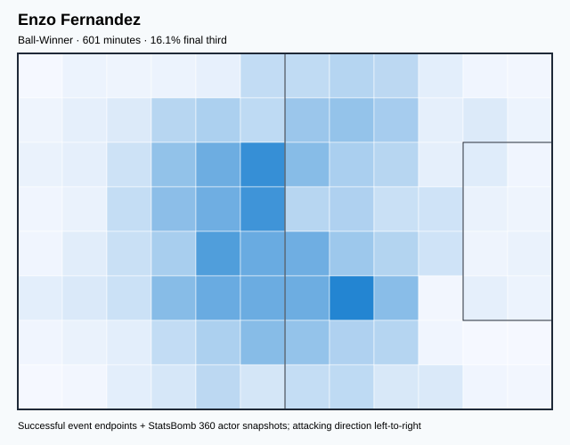

## Physical profile

| Metric | Score |
|---|---:|
| Aerial dominance | 0.421 |
| Pressing intensity per 90 | 17.52 |
| Recovery index per 90 | 3.74 |

## Top chemistry partners

- Nicolás Hernán Otamendi — synergy 0.882, 601 shared minutes
- Damián Emiliano Martínez — synergy 0.849, 601 shared minutes
- Cristian Gabriel Romero — synergy 0.818, 500 shared minutes

## Tactical recommendations

- Lead the first pressing trigger and protect the inside passing lane.
- Use recovery capacity to support higher attacking positions.

_The heatmap combines successful event endpoints with StatsBomb 360 actor
snapshots. StatsBomb 360 is freeze-frame context, not continuous player
tracking. Scores exclude players below 300 tournament minutes._

<!-- PROSPECTIVE_VALIDATION_START -->
## Prospective possession-model validation

**Overall status: `PARTIAL_PASS_ROLLBACK`.** Box-entry prediction passed every discrimination, calibration, and paired match-bootstrap gate. The shot challenger improved numerically but its confidence interval crossed zero, so it was rejected. The combined prospective artifact was not deployed and the stable production state was preserved.

| Target | Status | Baseline ROC-AUC | Challenger ROC-AUC | PR-AUC | Brier | ECE | Paired ROC gain (90% interval) |
|---|---|---:|---:|---:|---:|---:|---:|
| Box entry | **PASSED** | 0.6888 | 0.7268 | 0.6131 | 0.1722 | 0.0309 | +0.0155 [+0.0106, +0.0205] |
| Shot | **REJECTED** | 0.6642 | 0.6841 | 0.2686 | 0.0960 | 0.0118 | +0.0038 [-0.0030, +0.0120] |

_This challenger is isolated from 360-VAEP/xT player ratings, transition risk, retrospective possession models, and tactical clustering. Player and team descriptive metrics therefore remain unchanged._
<!-- PROSPECTIVE_VALIDATION_END -->

<!-- PLAYER_ROLE_VALIDATION_START -->
## Player-role and valuation validation status

**Production state retained.** The probabilistic role matrix and learned valuation were evaluated as challengers but were not promoted because they missed their predeclared statistical gates.

| Component | Decision | Validation evidence |
|---|---|---|
| Probabilistic GMM roles | **REJECTED** | K=9; silhouette 0.3159; median 500-bootstrap ARI 0.6961 vs required 0.70 |
| Learned Ridge valuation | **REJECTED** | OOF Spearman 0.7095 → 0.7150; gain 95% CI [-0.0053, +0.0165] crosses zero |

The active calibrated 360-VAEP model therefore remains unchanged: OOF ROC-AUC 0.948994, PR-AUC 0.084827, Brier 0.001123. Messi remains Argentina rank #1 and Mbappé remains France rank #1; no player-name override was used.
<!-- PLAYER_ROLE_VALIDATION_END -->

<!-- ROLE_AWARE_VALUATION_START -->
## Continuous role-aware valuation A/B test

**Decision: `REJECTED_RETAIN_INCUMBENT`.** The challenger was not promoted. Its Spearman correlation with the incumbent ranking was 0.9854, above the predeclared 0.90 ceiling, so it did not change the overall ordering enough to qualify as the intended systemic correction.

| Benchmark | Incumbent | Challenger diagnostic |
|---|---:|---:|
| Messi global rank | 1 | 1 |
| Mbappé global rank | 2 | 2 |
| Griezmann global rank | 21 | 6 |

The diagnostic Griezmann movement came from creation (0.799), pressing (0.711), and completeness (0.862), with no player-name rule. Nevertheless, all published player/team rankings retain the incumbent 360-VAEP+xT rating.

Foundational model performance remains unchanged: OOF ROC-AUC 0.948994, PR-AUC 0.084827, Brier 0.001123, ECE 0.000336.
<!-- ROLE_AWARE_VALUATION_END -->

<!-- CONTINUOUS_ROLE_REFINEMENT_START -->
## Accepted continuous role refinement

**34 of 142 players (23.9%) received an evidence-backed post-K-Means role refinement; 108 retained their original role.** The original cluster label remains available as `kmeans_functional_role`. Ratings, team ranks, VAEP and xT were not changed by this role-only promotion.

France refinements:

- Olivier Giroud: Target Forward → **Target Forward / Penalty-Box Anchor**
- Antoine Griezmann: Ball-Winner → **Hybrid Playmaker / Roaming Creator**
- Theo Bernard François Hernández: Wide Creator → **Attacking Wingback**
- Ibrahima Konaté: Deep Playmaker → **Ball-Playing Centre-Back**
- Aurélien Djani Tchouaméni: Ball-Winner → **Holding / Controlling Midfielder**

Refinements use continuous progression, creation, finishing, pressing, defensive, security, aerial and completeness scores with broad-position safeguards. No player-name condition is used.
<!-- CONTINUOUS_ROLE_REFINEMENT_END -->
