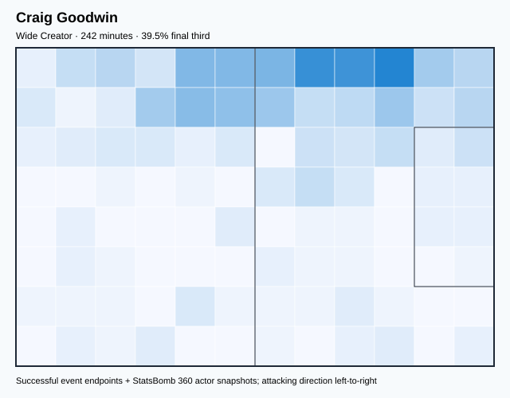
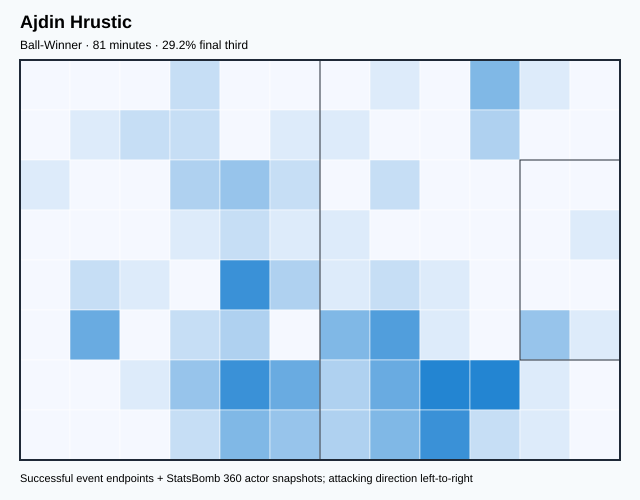
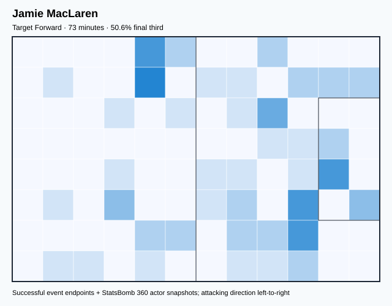
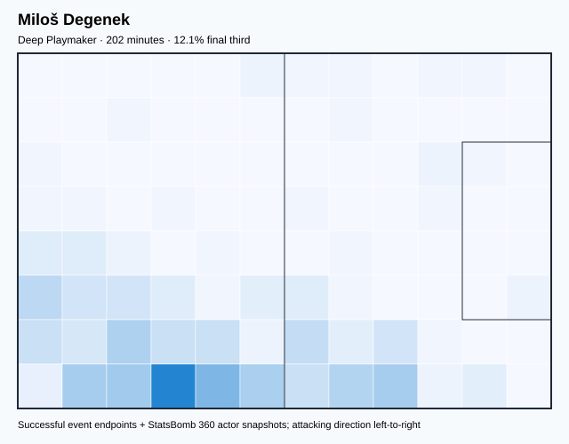
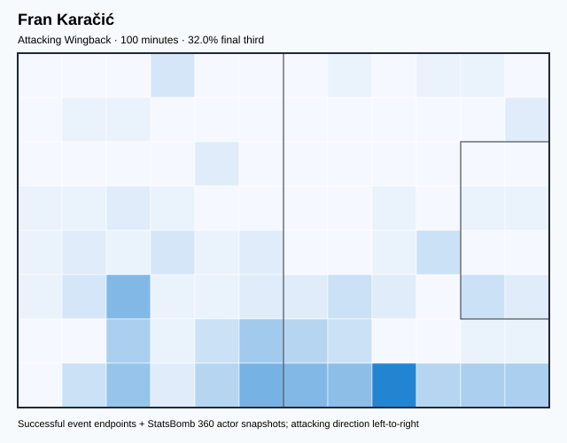
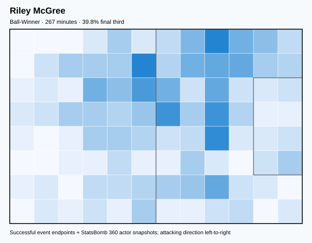
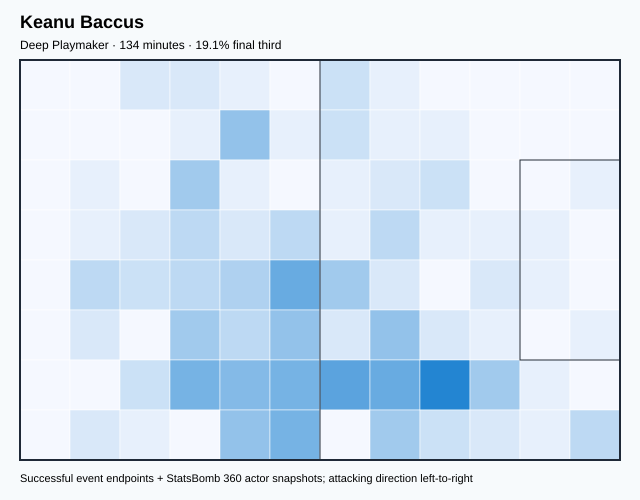
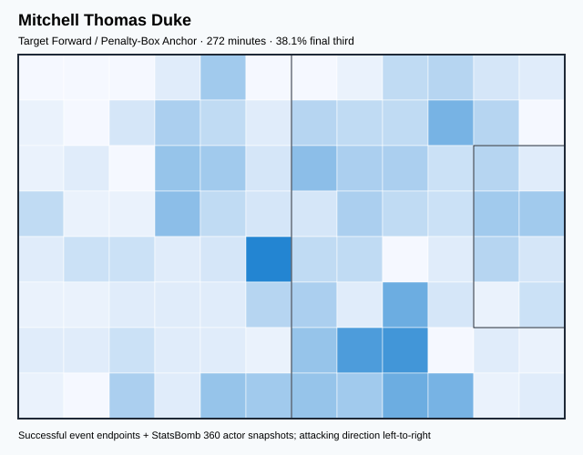
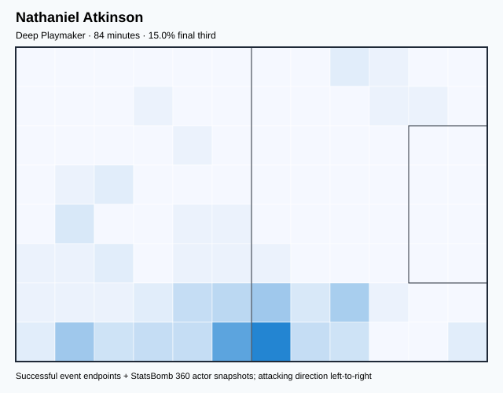
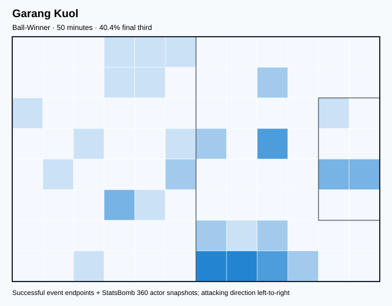

# AUS — V4 Player Evaluation Collection

<!-- V5_CANONICAL_NOTICE -->
> **Historical V4 player-rating packet.** Player ratings, ranks, role-challenger decisions, and rating uncertainty below are superseded by `results/reports/player_rankings.csv`, `results/reports/player_profiles/`, and `results/reports/model_summary.md`. Possession, tactical, and match-bootstrap material remains a historical V4 result.

- Included eligible players: 17
- Rankings use the role-aware, development-gated VAEP/xT/xD model.
- Heatmaps combine successful on-ball endpoints and SB360 actor snapshots.

---

<!-- PLAYER_REPORT 1: 3240_starter_report.md -->

# Mathew Ryan — Starter Report

- Team: Australia (AUS)
- Position: Goalkeeper
- Functional role: Goalkeeper
- VAEP offense per 90: -0.0117
- VAEP defense per 90: -0.1434
- VAEP total per 90: -0.1551
- VAEP per touch: -0.00203
- Spatial xT per 90: 0.0019
- Final-third spatial share: 2.3%
- Unified final player rating: -0.0689
- Team rank: #17

## Physical profile

| Metric | Score |
|---|---:|
| Aerial dominance | 0.000 |
| Pressing intensity per 90 | 0.00 |
| Recovery index per 90 | 4.65 |

## Top chemistry partners

- Kye Rowles — synergy 0.754, 387 shared minutes
- Aaron Mooy — synergy 0.738, 387 shared minutes
- Aziz Eraltay Behich — synergy 0.724, 387 shared minutes

## Tactical recommendations

- Use a compact pressing trigger rather than sustained solo pressure.
- Avoid isolating this player in high-volume aerial matchups.
- Use recovery capacity to support higher attacking positions.

_The heatmap combines successful event endpoints with StatsBomb 360 actor
snapshots. StatsBomb 360 is freeze-frame context, not continuous player
tracking. Ratings include eligible outfield players from 45 minutes and
goalkeepers from 90 minutes; ranking status communicates sample reliability._

---

<!-- PLAYER_REPORT 2: 3281_starter_report.md -->

# Aaron Mooy — Starter Report

- Team: Australia (AUS)
- Position: Left Defensive Midfield
- Functional role: Holding Anchor
- VAEP offense per 90: 0.0153
- VAEP defense per 90: -0.0175
- VAEP total per 90: -0.0022
- VAEP per touch: -0.00002
- Spatial xT per 90: 0.0294
- Final-third spatial share: 15.8%
- Unified final player rating: 0.0139
- Team rank: #13

## Physical profile

| Metric | Score |
|---|---:|
| Aerial dominance | 0.556 |
| Pressing intensity per 90 | 10.93 |
| Recovery index per 90 | 6.75 |

## Top chemistry partners

- Kye Rowles — synergy 0.752, 387 shared minutes
- Mathew Ryan — synergy 0.738, 387 shared minutes
- Aziz Eraltay Behich — synergy 0.732, 387 shared minutes

## Tactical recommendations

- Lead the first pressing trigger and protect the inside passing lane.
- Use recovery capacity to support higher attacking positions.

_The heatmap combines successful event endpoints with StatsBomb 360 actor
snapshots. StatsBomb 360 is freeze-frame context, not continuous player
tracking. Ratings include eligible outfield players from 45 minutes and
goalkeepers from 90 minutes; ranking status communicates sample reliability._

---

<!-- PLAYER_REPORT 3: 5479_starter_report.md -->

# Aziz Eraltay Behich — Starter Report

- Team: Australia (AUS)
- Position: Left Back
- Functional role: Wide Creator
- VAEP offense per 90: 0.1238
- VAEP defense per 90: -0.0044
- VAEP total per 90: 0.1193
- VAEP per touch: 0.00097
- Spatial xT per 90: 0.0435
- Final-third spatial share: 23.6%
- Unified final player rating: 0.0606
- Team rank: #9

## Physical profile

| Metric | Score |
|---|---:|
| Aerial dominance | 0.750 |
| Pressing intensity per 90 | 9.07 |
| Recovery index per 90 | 3.49 |

## Top chemistry partners

- Kye Rowles — synergy 0.748, 387 shared minutes
- Aaron Mooy — synergy 0.732, 387 shared minutes
- Harry Souttar — synergy 0.730, 387 shared minutes

## Tactical recommendations

- Use a compact pressing trigger rather than sustained solo pressure.
- Target this player on direct restarts and back-post deliveries.
- Use recovery capacity to support higher attacking positions.

_The heatmap combines successful event endpoints with StatsBomb 360 actor
snapshots. StatsBomb 360 is freeze-frame context, not continuous player
tracking. Ratings include eligible outfield players from 45 minutes and
goalkeepers from 90 minutes; ranking status communicates sample reliability._

---

<!-- PLAYER_REPORT 4: 5481_starter_report.md -->

# Mathew Leckie — Starter Report

- Team: Australia (AUS)
- Position: Right Midfield
- Functional role: Target Forward
- VAEP offense per 90: 0.1928
- VAEP defense per 90: 0.0341
- VAEP total per 90: 0.2269
- VAEP per touch: 0.00217
- Spatial xT per 90: 0.0211
- Final-third spatial share: 40.8%
- Unified final player rating: 0.1124
- Team rank: #7

## Physical profile

| Metric | Score |
|---|---:|
| Aerial dominance | 0.567 |
| Pressing intensity per 90 | 18.44 |
| Recovery index per 90 | 4.22 |

## Top chemistry partners

- Harry Souttar — synergy 0.651, 342 shared minutes
- Aziz Eraltay Behich — synergy 0.631, 342 shared minutes
- Jackson Irvine — synergy 0.617, 328 shared minutes

## Tactical recommendations

- Lead the first pressing trigger and protect the inside passing lane.
- Target this player on direct restarts and back-post deliveries.
- Use recovery capacity to support higher attacking positions.

_The heatmap combines successful event endpoints with StatsBomb 360 actor
snapshots. StatsBomb 360 is freeze-frame context, not continuous player
tracking. Ratings include eligible outfield players from 45 minutes and
goalkeepers from 90 minutes; ranking status communicates sample reliability._

---

<!-- PLAYER_REPORT 5: 5490_starter_report.md -->

# Jackson Irvine — Starter Report

- Team: Australia (AUS)
- Position: Left Center Forward
- Functional role: Holding Anchor
- VAEP offense per 90: 0.0530
- VAEP defense per 90: -0.0438
- VAEP total per 90: 0.0092
- VAEP per touch: 0.00011
- Spatial xT per 90: 0.0285
- Final-third spatial share: 22.3%
- Unified final player rating: 0.1353
- Team rank: #5

## Physical profile

| Metric | Score |
|---|---:|
| Aerial dominance | 0.600 |
| Pressing intensity per 90 | 18.06 |
| Recovery index per 90 | 2.17 |

## Top chemistry partners

- Harry Souttar — synergy 0.735, 374 shared minutes
- Aaron Mooy — synergy 0.684, 374 shared minutes
- Kye Rowles — synergy 0.660, 374 shared minutes

## Tactical recommendations

- Lead the first pressing trigger and protect the inside passing lane.
- Target this player on direct restarts and back-post deliveries.
- Pair with a faster recovery defender after aggressive rotations.

_The heatmap combines successful event endpoints with StatsBomb 360 actor
snapshots. StatsBomb 360 is freeze-frame context, not continuous player
tracking. Ratings include eligible outfield players from 45 minutes and
goalkeepers from 90 minutes; ranking status communicates sample reliability._

---

<!-- PLAYER_REPORT 6: 8346_starter_report.md -->

# Craig Goodwin — Starter Report

- Team: Australia (AUS)
- Position: Left Midfield
- Functional role: Wide Creator
- VAEP offense per 90: 0.2631
- VAEP defense per 90: 0.0053
- VAEP total per 90: 0.2684
- VAEP per touch: 0.00266
- Spatial xT per 90: 0.0577
- Final-third spatial share: 39.5%
- Unified final player rating: 0.1214
- Team rank: #6

## Physical profile

| Metric | Score |
|---|---:|
| Aerial dominance | 0.375 |
| Pressing intensity per 90 | 8.94 |
| Recovery index per 90 | 2.23 |

## Top chemistry partners

- Kye Rowles — synergy 0.515, 242 shared minutes
- Aziz Eraltay Behich — synergy 0.513, 242 shared minutes
- Mathew Ryan — synergy 0.498, 242 shared minutes

## Tactical recommendations

- Use a compact pressing trigger rather than sustained solo pressure.
- Pair with a faster recovery defender after aggressive rotations.

_The heatmap combines successful event endpoints with StatsBomb 360 actor
snapshots. StatsBomb 360 is freeze-frame context, not continuous player
tracking. Ratings include eligible outfield players from 45 minutes and
goalkeepers from 90 minutes; ranking status communicates sample reliability._

---

<!-- PLAYER_REPORT 7: 8859_starter_report.md -->

# Ajdin Hrustic — Starter Report

- Team: Australia (AUS)
- Position: Right Midfield
- Functional role: Ball-Winner
- VAEP offense per 90: 0.0732
- VAEP defense per 90: 0.0064
- VAEP total per 90: 0.0796
- VAEP per touch: 0.00074
- Spatial xT per 90: 0.0077
- Final-third spatial share: 29.2%
- Unified final player rating: 0.0979
- Team rank: #8

## Physical profile

| Metric | Score |
|---|---:|
| Aerial dominance | 0.000 |
| Pressing intensity per 90 | 25.68 |
| Recovery index per 90 | 4.47 |

## Top chemistry partners

- Harry Souttar — synergy 0.242, 81 shared minutes
- Kye Rowles — synergy 0.213, 81 shared minutes
- Aaron Mooy — synergy 0.211, 81 shared minutes

## Tactical recommendations

- Lead the first pressing trigger and protect the inside passing lane.
- Avoid isolating this player in high-volume aerial matchups.
- Use recovery capacity to support higher attacking positions.

_The heatmap combines successful event endpoints with StatsBomb 360 actor
snapshots. StatsBomb 360 is freeze-frame context, not continuous player
tracking. Ratings include eligible outfield players from 45 minutes and
goalkeepers from 90 minutes; ranking status communicates sample reliability._

---

<!-- PLAYER_REPORT 8: 9980_starter_report.md -->

# Jamie MacLaren — Starter Report

- Team: Australia (AUS)
- Position: Left Center Forward
- Functional role: Target Forward
- VAEP offense per 90: 0.2685
- VAEP defense per 90: -0.0079
- VAEP total per 90: 0.2605
- VAEP per touch: 0.00391
- Spatial xT per 90: -0.0335
- Final-third spatial share: 50.6%
- Unified final player rating: 0.2232
- Team rank: #2

## Physical profile

| Metric | Score |
|---|---:|
| Aerial dominance | 0.429 |
| Pressing intensity per 90 | 14.79 |
| Recovery index per 90 | 0.00 |

## Top chemistry partners

- Kye Rowles — synergy 0.209, 73 shared minutes
- Ajdin Hrustic — synergy 0.198, 67 shared minutes
- Aaron Mooy — synergy 0.195, 73 shared minutes

## Tactical recommendations

- Lead the first pressing trigger and protect the inside passing lane.
- Pair with a faster recovery defender after aggressive rotations.

_The heatmap combines successful event endpoints with StatsBomb 360 actor
snapshots. StatsBomb 360 is freeze-frame context, not continuous player
tracking. Ratings include eligible outfield players from 45 minutes and
goalkeepers from 90 minutes; ranking status communicates sample reliability._

---

<!-- PLAYER_REPORT 9: 15957_starter_report.md -->

# Miloš Degenek — Starter Report

- Team: Australia (AUS)
- Position: Right Back
- Functional role: Deep Playmaker
- VAEP offense per 90: 0.0114
- VAEP defense per 90: -0.0485
- VAEP total per 90: -0.0371
- VAEP per touch: -0.00039
- Spatial xT per 90: 0.0401
- Final-third spatial share: 12.1%
- Unified final player rating: 0.0337
- Team rank: #12

## Physical profile

| Metric | Score |
|---|---:|
| Aerial dominance | 0.429 |
| Pressing intensity per 90 | 8.89 |
| Recovery index per 90 | 2.67 |

## Top chemistry partners

- Mathew Ryan — synergy 0.514, 202 shared minutes
- Aaron Mooy — synergy 0.511, 202 shared minutes
- Harry Souttar — synergy 0.508, 202 shared minutes

## Tactical recommendations

- Use a compact pressing trigger rather than sustained solo pressure.
- Use recovery capacity to support higher attacking positions.

_The heatmap combines successful event endpoints with StatsBomb 360 actor
snapshots. StatsBomb 360 is freeze-frame context, not continuous player
tracking. Ratings include eligible outfield players from 45 minutes and
goalkeepers from 90 minutes; ranking status communicates sample reliability._

---

<!-- PLAYER_REPORT 10: 22293_starter_report.md -->

# Harry Souttar — Starter Report

- Team: Australia (AUS)
- Position: Right Center Back
- Functional role: Sweeper CB
- VAEP offense per 90: 0.0077
- VAEP defense per 90: -0.1806
- VAEP total per 90: -0.1730
- VAEP per touch: -0.00183
- Spatial xT per 90: 0.0056
- Final-third spatial share: 4.0%
- Unified final player rating: -0.0446
- Team rank: #16

## Physical profile

| Metric | Score |
|---|---:|
| Aerial dominance | 0.680 |
| Pressing intensity per 90 | 7.21 |
| Recovery index per 90 | 2.33 |

## Top chemistry partners

- Kye Rowles — synergy 0.755, 387 shared minutes
- Jackson Irvine — synergy 0.735, 374 shared minutes
- Aziz Eraltay Behich — synergy 0.730, 387 shared minutes

## Tactical recommendations

- Use a compact pressing trigger rather than sustained solo pressure.
- Target this player on direct restarts and back-post deliveries.
- Pair with a faster recovery defender after aggressive rotations.

_The heatmap combines successful event endpoints with StatsBomb 360 actor
snapshots. StatsBomb 360 is freeze-frame context, not continuous player
tracking. Ratings include eligible outfield players from 45 minutes and
goalkeepers from 90 minutes; ranking status communicates sample reliability._

---

<!-- PLAYER_REPORT 11: 28370_starter_report.md -->

# Fran Karačić — Starter Report

- Team: Australia (AUS)
- Position: Right Back
- Functional role: Attacking Wingback
- VAEP offense per 90: 0.0755
- VAEP defense per 90: -0.0401
- VAEP total per 90: 0.0354
- VAEP per touch: 0.00034
- Spatial xT per 90: 0.1388
- Final-third spatial share: 32.0%
- Unified final player rating: 0.0522
- Team rank: #10

## Physical profile

| Metric | Score |
|---|---:|
| Aerial dominance | 0.545 |
| Pressing intensity per 90 | 14.35 |
| Recovery index per 90 | 8.07 |

## Top chemistry partners

- Kye Rowles — synergy 0.294, 100 shared minutes
- Jackson Irvine — synergy 0.278, 100 shared minutes
- Aziz Eraltay Behich — synergy 0.274, 100 shared minutes

## Tactical recommendations

- Lead the first pressing trigger and protect the inside passing lane.
- Use recovery capacity to support higher attacking positions.

_The heatmap combines successful event endpoints with StatsBomb 360 actor
snapshots. StatsBomb 360 is freeze-frame context, not continuous player
tracking. Ratings include eligible outfield players from 45 minutes and
goalkeepers from 90 minutes; ranking status communicates sample reliability._

---

<!-- PLAYER_REPORT 12: 33477_starter_report.md -->

# Riley McGree — Starter Report

- Team: Australia (AUS)
- Position: Right Center Forward
- Functional role: Ball-Winner
- VAEP offense per 90: 0.1228
- VAEP defense per 90: 0.0111
- VAEP total per 90: 0.1339
- VAEP per touch: 0.00156
- Spatial xT per 90: 0.0312
- Final-third spatial share: 39.8%
- Unified final player rating: 0.1776
- Team rank: #4

## Physical profile

| Metric | Score |
|---|---:|
| Aerial dominance | 0.400 |
| Pressing intensity per 90 | 19.24 |
| Recovery index per 90 | 3.38 |

## Top chemistry partners

- Jackson Irvine — synergy 0.565, 267 shared minutes
- Kye Rowles — synergy 0.557, 267 shared minutes
- Aaron Mooy — synergy 0.510, 267 shared minutes

## Tactical recommendations

- Lead the first pressing trigger and protect the inside passing lane.
- Use recovery capacity to support higher attacking positions.

_The heatmap combines successful event endpoints with StatsBomb 360 actor
snapshots. StatsBomb 360 is freeze-frame context, not continuous player
tracking. Ratings include eligible outfield players from 45 minutes and
goalkeepers from 90 minutes; ranking status communicates sample reliability._

---

<!-- PLAYER_REPORT 13: 33488_starter_report.md -->

# Keanu Baccus — Starter Report

- Team: Australia (AUS)
- Position: Right Defensive Midfield
- Functional role: Deep Playmaker
- VAEP offense per 90: 0.0304
- VAEP defense per 90: -0.2747
- VAEP total per 90: -0.2444
- VAEP per touch: -0.00300
- Spatial xT per 90: 0.0194
- Final-third spatial share: 19.1%
- Unified final player rating: -0.0106
- Team rank: #14

## Physical profile

| Metric | Score |
|---|---:|
| Aerial dominance | 0.250 |
| Pressing intensity per 90 | 28.23 |
| Recovery index per 90 | 3.36 |

## Top chemistry partners

- Harry Souttar — synergy 0.372, 134 shared minutes
- Aaron Mooy — synergy 0.358, 134 shared minutes
- Kye Rowles — synergy 0.335, 134 shared minutes

## Tactical recommendations

- Lead the first pressing trigger and protect the inside passing lane.
- Use recovery capacity to support higher attacking positions.

_The heatmap combines successful event endpoints with StatsBomb 360 actor
snapshots. StatsBomb 360 is freeze-frame context, not continuous player
tracking. Ratings include eligible outfield players from 45 minutes and
goalkeepers from 90 minutes; ranking status communicates sample reliability._

---

<!-- PLAYER_REPORT 14: 33492_starter_report.md -->

# Mitchell Thomas Duke — Starter Report

- Team: Australia (AUS)
- Position: Left Center Forward
- Functional role: Target Forward / Penalty-Box Anchor
- VAEP offense per 90: 0.2592
- VAEP defense per 90: 0.0289
- VAEP total per 90: 0.2881
- VAEP per touch: 0.00333
- Spatial xT per 90: 0.0004
- Final-third spatial share: 38.1%
- Unified final player rating: 0.2037
- Team rank: #3

## Physical profile

| Metric | Score |
|---|---:|
| Aerial dominance | 0.484 |
| Pressing intensity per 90 | 20.16 |
| Recovery index per 90 | 3.31 |

## Top chemistry partners

- Aaron Mooy — synergy 0.549, 272 shared minutes
- Jackson Irvine — synergy 0.501, 272 shared minutes
- Mathew Leckie — synergy 0.431, 272 shared minutes

## Tactical recommendations

- Lead the first pressing trigger and protect the inside passing lane.
- Use recovery capacity to support higher attacking positions.

_The heatmap combines successful event endpoints with StatsBomb 360 actor
snapshots. StatsBomb 360 is freeze-frame context, not continuous player
tracking. Ratings include eligible outfield players from 45 minutes and
goalkeepers from 90 minutes; ranking status communicates sample reliability._

---

<!-- PLAYER_REPORT 15: 33495_starter_report.md -->

# Kye Rowles — Starter Report

- Team: Australia (AUS)
- Position: Left Center Back
- Functional role: Sweeper CB
- VAEP offense per 90: -0.0097
- VAEP defense per 90: -0.0945
- VAEP total per 90: -0.1041
- VAEP per touch: -0.00095
- Spatial xT per 90: 0.0020
- Final-third spatial share: 2.5%
- Unified final player rating: -0.0289
- Team rank: #15

## Physical profile

| Metric | Score |
|---|---:|
| Aerial dominance | 0.667 |
| Pressing intensity per 90 | 9.30 |
| Recovery index per 90 | 0.70 |

## Top chemistry partners

- Harry Souttar — synergy 0.755, 387 shared minutes
- Mathew Ryan — synergy 0.754, 387 shared minutes
- Aaron Mooy — synergy 0.752, 387 shared minutes

## Tactical recommendations

- Use a compact pressing trigger rather than sustained solo pressure.
- Target this player on direct restarts and back-post deliveries.
- Pair with a faster recovery defender after aggressive rotations.

_The heatmap combines successful event endpoints with StatsBomb 360 actor
snapshots. StatsBomb 360 is freeze-frame context, not continuous player
tracking. Ratings include eligible outfield players from 45 minutes and
goalkeepers from 90 minutes; ranking status communicates sample reliability._

---

<!-- PLAYER_REPORT 16: 33572_starter_report.md -->

# Nathaniel Atkinson — Starter Report

- Team: Australia (AUS)
- Position: Right Back
- Functional role: Deep Playmaker
- VAEP offense per 90: 0.0258
- VAEP defense per 90: -0.0281
- VAEP total per 90: -0.0023
- VAEP per touch: -0.00003
- Spatial xT per 90: 0.0083
- Final-third spatial share: 15.0%
- Unified final player rating: 0.0453
- Team rank: #11

## Physical profile

| Metric | Score |
|---|---:|
| Aerial dominance | 0.000 |
| Pressing intensity per 90 | 14.98 |
| Recovery index per 90 | 3.21 |

## Top chemistry partners

- Jackson Irvine — synergy 0.257, 84 shared minutes
- Aaron Mooy — synergy 0.257, 84 shared minutes
- Harry Souttar — synergy 0.257, 84 shared minutes

## Tactical recommendations

- Lead the first pressing trigger and protect the inside passing lane.
- Avoid isolating this player in high-volume aerial matchups.
- Use recovery capacity to support higher attacking positions.

_The heatmap combines successful event endpoints with StatsBomb 360 actor
snapshots. StatsBomb 360 is freeze-frame context, not continuous player
tracking. Ratings include eligible outfield players from 45 minutes and
goalkeepers from 90 minutes; ranking status communicates sample reliability._

---

<!-- PLAYER_REPORT 17: 227697_starter_report.md -->

# Garang Kuol — Starter Report

- Team: Australia (AUS)
- Position: Left Center Forward
- Functional role: Ball-Winner
- VAEP offense per 90: 0.3619
- VAEP defense per 90: 0.0042
- VAEP total per 90: 0.3661
- VAEP per touch: 0.00600
- Spatial xT per 90: 0.0035
- Final-third spatial share: 40.4%
- Unified final player rating: 0.2338
- Team rank: #1

## Physical profile

| Metric | Score |
|---|---:|
| Aerial dominance | 0.000 |
| Pressing intensity per 90 | 16.16 |
| Recovery index per 90 | 0.00 |

## Top chemistry partners

- Mathew Ryan — synergy 0.150, 50 shared minutes
- Harry Souttar — synergy 0.150, 50 shared minutes
- Kye Rowles — synergy 0.150, 50 shared minutes

## Tactical recommendations

- Lead the first pressing trigger and protect the inside passing lane.
- Avoid isolating this player in high-volume aerial matchups.
- Pair with a faster recovery defender after aggressive rotations.

_The heatmap combines successful event endpoints with StatsBomb 360 actor
snapshots. StatsBomb 360 is freeze-frame context, not continuous player
tracking. Ratings include eligible outfield players from 45 minutes and
goalkeepers from 90 minutes; ranking status communicates sample reliability._
