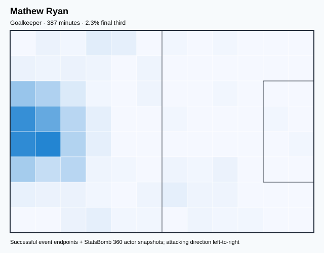
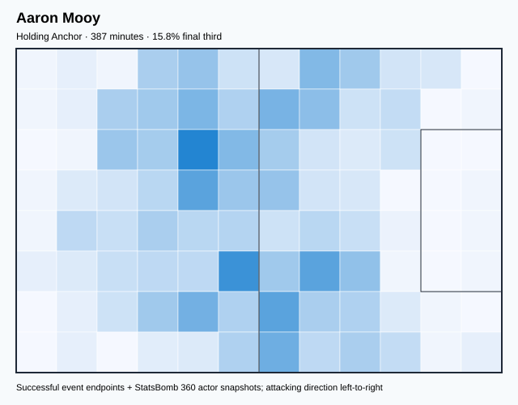
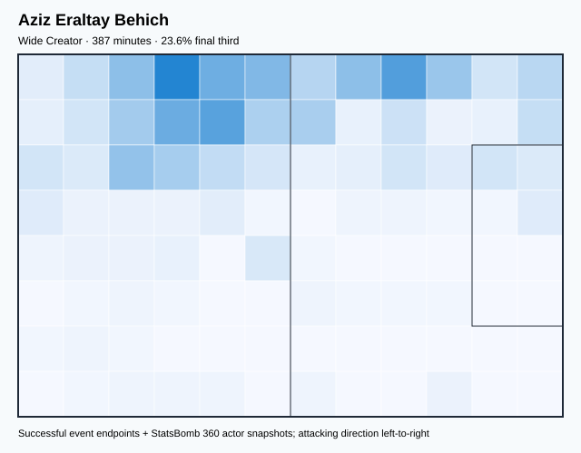
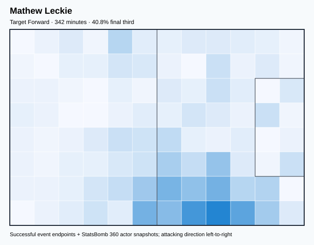
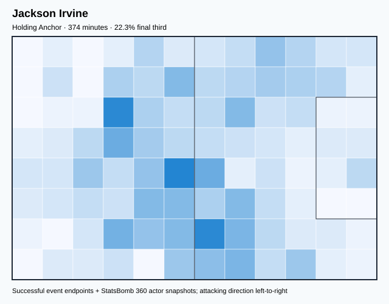
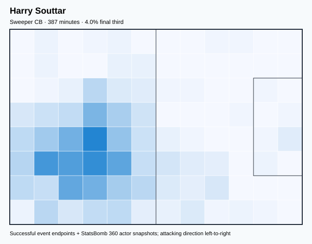
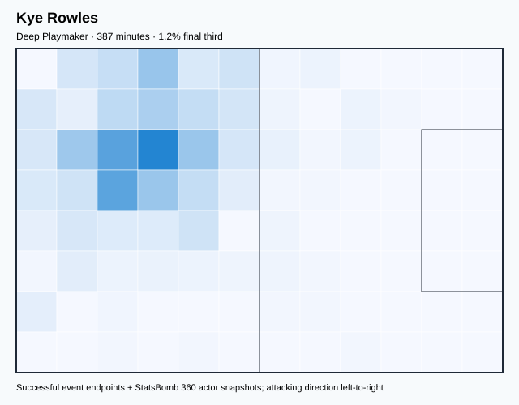

# AUS — V4 Player Evaluation Collection

- Included 300+ minute players: 7
- Rankings use one cross-role 360-VAEP plus xT formula.
- Heatmaps combine successful on-ball endpoints and SB360 actor snapshots.

---

<!-- PLAYER_REPORT 1: 3240_starter_report.md -->

# Mathew Ryan — Starter Report

- Team: Australia (AUS)
- Position: Goalkeeper
- Functional role: Goalkeeper
- VAEP offense per 90: -0.0204
- VAEP defense per 90: -0.3052
- VAEP total per 90: -0.3256
- VAEP per touch: -0.00427
- Spatial xT per 90: 0.0013
- Final-third spatial share: 2.3%
- Unified final player rating: -0.1638
- Team rank: #7

## Physical profile

| Metric | Score |
|---|---:|
| Aerial dominance | 0.000 |
| Pressing intensity per 90 | 0.00 |
| Recovery index per 90 | 4.65 |

## Top chemistry partners

- Kye Rowles — synergy 0.754, 387 shared minutes
- Aaron Mooy — synergy 0.738, 387 shared minutes
- Aziz Eraltay Behich — synergy 0.724, 387 shared minutes

## Tactical recommendations

- Use a compact pressing trigger rather than sustained solo pressure.
- Avoid isolating this player in high-volume aerial matchups.
- Use recovery capacity to support higher attacking positions.

_The heatmap combines successful event endpoints with StatsBomb 360 actor
snapshots. StatsBomb 360 is freeze-frame context, not continuous player
tracking. Scores exclude players below 300 tournament minutes._

---

<!-- PLAYER_REPORT 2: 3281_starter_report.md -->

# Aaron Mooy — Starter Report

- Team: Australia (AUS)
- Position: Left Defensive Midfield
- Functional role: Box-to-Box Runner
- VAEP offense per 90: 0.1181
- VAEP defense per 90: -0.0349
- VAEP total per 90: 0.0833
- VAEP per touch: 0.00065
- Spatial xT per 90: 0.0248
- Final-third spatial share: 15.8%
- Unified final player rating: 0.0468
- Team rank: #4

## Physical profile

| Metric | Score |
|---|---:|
| Aerial dominance | 0.556 |
| Pressing intensity per 90 | 10.93 |
| Recovery index per 90 | 6.75 |

## Top chemistry partners

- Kye Rowles — synergy 0.752, 387 shared minutes
- Mathew Ryan — synergy 0.738, 387 shared minutes
- Aziz Eraltay Behich — synergy 0.732, 387 shared minutes

## Tactical recommendations

- Lead the first pressing trigger and protect the inside passing lane.
- Use recovery capacity to support higher attacking positions.

_The heatmap combines successful event endpoints with StatsBomb 360 actor
snapshots. StatsBomb 360 is freeze-frame context, not continuous player
tracking. Scores exclude players below 300 tournament minutes._

---

<!-- PLAYER_REPORT 3: 5479_starter_report.md -->

# Aziz Eraltay Behich — Starter Report

- Team: Australia (AUS)
- Position: Left Back
- Functional role: Wide Creator
- VAEP offense per 90: 0.1055
- VAEP defense per 90: -0.0206
- VAEP total per 90: 0.0849
- VAEP per touch: 0.00069
- Spatial xT per 90: 0.0391
- Final-third spatial share: 23.6%
- Unified final player rating: 0.0505
- Team rank: #3

## Physical profile

| Metric | Score |
|---|---:|
| Aerial dominance | 0.750 |
| Pressing intensity per 90 | 9.07 |
| Recovery index per 90 | 3.49 |

## Top chemistry partners

- Kye Rowles — synergy 0.748, 387 shared minutes
- Aaron Mooy — synergy 0.732, 387 shared minutes
- Harry Souttar — synergy 0.730, 387 shared minutes

## Tactical recommendations

- Use a compact pressing trigger rather than sustained solo pressure.
- Target this player on direct restarts and back-post deliveries.
- Use recovery capacity to support higher attacking positions.

_The heatmap combines successful event endpoints with StatsBomb 360 actor
snapshots. StatsBomb 360 is freeze-frame context, not continuous player
tracking. Scores exclude players below 300 tournament minutes._

---

<!-- PLAYER_REPORT 4: 5481_starter_report.md -->

# Mathew Leckie — Starter Report

- Team: Australia (AUS)
- Position: Right Midfield
- Functional role: Target Forward
- VAEP offense per 90: 0.4059
- VAEP defense per 90: -0.0102
- VAEP total per 90: 0.3957
- VAEP per touch: 0.00378
- Spatial xT per 90: 0.0154
- Final-third spatial share: 40.8%
- Unified final player rating: 0.2020
- Team rank: #1

## Physical profile

| Metric | Score |
|---|---:|
| Aerial dominance | 0.567 |
| Pressing intensity per 90 | 18.44 |
| Recovery index per 90 | 4.22 |

## Top chemistry partners

- Harry Souttar — synergy 0.651, 342 shared minutes
- Aziz Eraltay Behich — synergy 0.631, 342 shared minutes
- Jackson Irvine — synergy 0.617, 328 shared minutes

## Tactical recommendations

- Lead the first pressing trigger and protect the inside passing lane.
- Target this player on direct restarts and back-post deliveries.
- Use recovery capacity to support higher attacking positions.

_The heatmap combines successful event endpoints with StatsBomb 360 actor
snapshots. StatsBomb 360 is freeze-frame context, not continuous player
tracking. Scores exclude players below 300 tournament minutes._

---

<!-- PLAYER_REPORT 5: 5490_starter_report.md -->

# Jackson Irvine — Starter Report

- Team: Australia (AUS)
- Position: Left Center Forward
- Functional role: Ball-Winner
- VAEP offense per 90: 0.3813
- VAEP defense per 90: -0.0432
- VAEP total per 90: 0.3380
- VAEP per touch: 0.00418
- Spatial xT per 90: 0.0202
- Final-third spatial share: 22.3%
- Unified final player rating: 0.1743
- Team rank: #2

## Physical profile

| Metric | Score |
|---|---:|
| Aerial dominance | 0.600 |
| Pressing intensity per 90 | 18.06 |
| Recovery index per 90 | 2.17 |

## Top chemistry partners

- Harry Souttar — synergy 0.735, 374 shared minutes
- Aaron Mooy — synergy 0.684, 374 shared minutes
- Kye Rowles — synergy 0.660, 374 shared minutes

## Tactical recommendations

- Lead the first pressing trigger and protect the inside passing lane.
- Target this player on direct restarts and back-post deliveries.
- Pair with a faster recovery defender after aggressive rotations.

_The heatmap combines successful event endpoints with StatsBomb 360 actor
snapshots. StatsBomb 360 is freeze-frame context, not continuous player
tracking. Scores exclude players below 300 tournament minutes._

---

<!-- PLAYER_REPORT 6: 22293_starter_report.md -->

# Harry Souttar — Starter Report

- Team: Australia (AUS)
- Position: Right Center Back
- Functional role: Sweeper CB
- VAEP offense per 90: 0.0232
- VAEP defense per 90: -0.1494
- VAEP total per 90: -0.1262
- VAEP per touch: -0.00133
- Spatial xT per 90: 0.0029
- Final-third spatial share: 4.0%
- Unified final player rating: -0.0629
- Team rank: #5

## Physical profile

| Metric | Score |
|---|---:|
| Aerial dominance | 0.680 |
| Pressing intensity per 90 | 7.21 |
| Recovery index per 90 | 2.33 |

## Top chemistry partners

- Kye Rowles — synergy 0.755, 387 shared minutes
- Jackson Irvine — synergy 0.735, 374 shared minutes
- Aziz Eraltay Behich — synergy 0.730, 387 shared minutes

## Tactical recommendations

- Use a compact pressing trigger rather than sustained solo pressure.
- Target this player on direct restarts and back-post deliveries.
- Pair with a faster recovery defender after aggressive rotations.

_The heatmap combines successful event endpoints with StatsBomb 360 actor
snapshots. StatsBomb 360 is freeze-frame context, not continuous player
tracking. Scores exclude players below 300 tournament minutes._

---

<!-- PLAYER_REPORT 7: 33495_starter_report.md -->

# Kye Rowles — Starter Report

- Team: Australia (AUS)
- Position: Left Center Back
- Functional role: Sweeper CB
- VAEP offense per 90: -0.0150
- VAEP defense per 90: -0.1276
- VAEP total per 90: -0.1427
- VAEP per touch: -0.00131
- Spatial xT per 90: 0.0001
- Final-third spatial share: 2.5%
- Unified final player rating: -0.0717
- Team rank: #6

## Physical profile

| Metric | Score |
|---|---:|
| Aerial dominance | 0.667 |
| Pressing intensity per 90 | 9.30 |
| Recovery index per 90 | 0.70 |

## Top chemistry partners

- Harry Souttar — synergy 0.755, 387 shared minutes
- Mathew Ryan — synergy 0.754, 387 shared minutes
- Aaron Mooy — synergy 0.752, 387 shared minutes

## Tactical recommendations

- Use a compact pressing trigger rather than sustained solo pressure.
- Target this player on direct restarts and back-post deliveries.
- Pair with a faster recovery defender after aggressive rotations.

_The heatmap combines successful event endpoints with StatsBomb 360 actor
snapshots. StatsBomb 360 is freeze-frame context, not continuous player
tracking. Scores exclude players below 300 tournament minutes._
