# BEL — V4 Player Evaluation Collection

<!-- V5_CANONICAL_NOTICE -->
> **Historical V4 player-rating packet.** Player ratings, ranks, role-challenger decisions, and rating uncertainty below are superseded by `results/reports/player_rankings.csv`, `results/reports/player_profiles/`, and `results/reports/model_summary.md`. Possession, tactical, and match-bootstrap material remains a historical V4 result.

- Included eligible players: 17
- Rankings use the role-aware, development-gated VAEP/xT/xD model.
- Heatmaps combine successful on-ball endpoints and SB360 actor snapshots.

---

<!-- PLAYER_REPORT 1: 2954_starter_report.md -->

# Youri Tielemans — Starter Report

- Team: Belgium (BEL)
- Position: Right Defensive Midfield
- Functional role: Holding Anchor
- VAEP offense per 90: 0.0549
- VAEP defense per 90: -0.0499
- VAEP total per 90: 0.0050
- VAEP per touch: 0.00003
- Spatial xT per 90: 0.0107
- Final-third spatial share: 15.1%
- Unified final player rating: 0.0185
- Team rank: #12

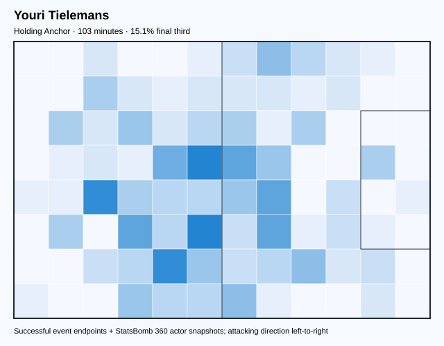

## Physical profile

| Metric | Score |
|---|---:|
| Aerial dominance | 0.667 |
| Pressing intensity per 90 | 18.36 |
| Recovery index per 90 | 1.75 |

## Top chemistry partners

- Toby Alderweireld — synergy 0.308, 103 shared minutes
- Jan Vertonghen — synergy 0.304, 103 shared minutes
- Thibaut Courtois — synergy 0.291, 103 shared minutes

## Tactical recommendations

- Lead the first pressing trigger and protect the inside passing lane.
- Target this player on direct restarts and back-post deliveries.
- Pair with a faster recovery defender after aggressive rotations.

_The heatmap combines successful event endpoints with StatsBomb 360 actor
snapshots. StatsBomb 360 is freeze-frame context, not continuous player
tracking. Ratings include eligible outfield players from 45 minutes and
goalkeepers from 90 minutes; ranking status communicates sample reliability._

---

<!-- PLAYER_REPORT 2: 3077_starter_report.md -->

# Jan Vertonghen — Starter Report

- Team: Belgium (BEL)
- Position: Left Center Back
- Functional role: Sweeper CB
- VAEP offense per 90: 0.0741
- VAEP defense per 90: -0.0672
- VAEP total per 90: 0.0069
- VAEP per touch: 0.00003
- Spatial xT per 90: 0.0012
- Final-third spatial share: 2.2%
- Unified final player rating: -0.0042
- Team rank: #14

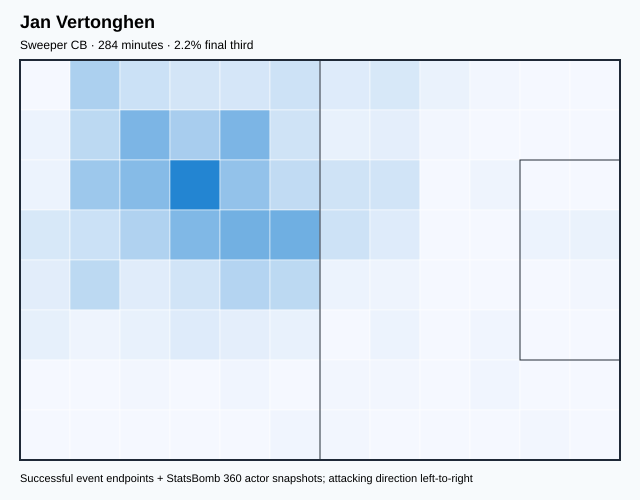

## Physical profile

| Metric | Score |
|---|---:|
| Aerial dominance | 0.733 |
| Pressing intensity per 90 | 5.70 |
| Recovery index per 90 | 3.17 |

## Top chemistry partners

- Thibaut Courtois — synergy 0.645, 284 shared minutes
- Toby Alderweireld — synergy 0.645, 284 shared minutes
- Timothy Castagne — synergy 0.639, 284 shared minutes

## Tactical recommendations

- Use a compact pressing trigger rather than sustained solo pressure.
- Target this player on direct restarts and back-post deliveries.
- Use recovery capacity to support higher attacking positions.

_The heatmap combines successful event endpoints with StatsBomb 360 actor
snapshots. StatsBomb 360 is freeze-frame context, not continuous player
tracking. Ratings include eligible outfield players from 45 minutes and
goalkeepers from 90 minutes; ranking status communicates sample reliability._

---

<!-- PLAYER_REPORT 3: 3089_starter_report.md -->

# Kevin De Bruyne — Starter Report

- Team: Belgium (BEL)
- Position: Right Wing
- Functional role: Progressive Winger
- VAEP offense per 90: 0.2436
- VAEP defense per 90: 0.0193
- VAEP total per 90: 0.2629
- VAEP per touch: 0.00202
- Spatial xT per 90: 0.1601
- Final-third spatial share: 42.9%
- Unified final player rating: 0.1717
- Team rank: #6

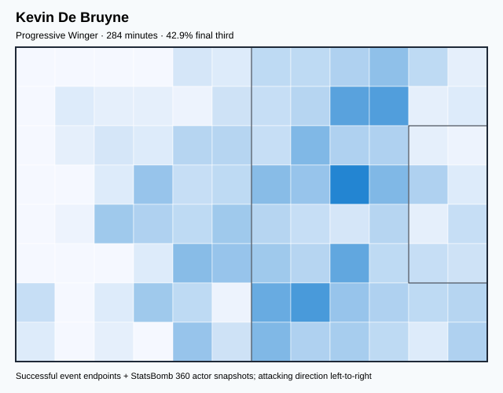

## Physical profile

| Metric | Score |
|---|---:|
| Aerial dominance | 0.500 |
| Pressing intensity per 90 | 8.23 |
| Recovery index per 90 | 4.43 |

## Top chemistry partners

- Axel Witsel — synergy 0.638, 284 shared minutes
- Toby Alderweireld — synergy 0.635, 284 shared minutes
- Thibaut Courtois — synergy 0.613, 284 shared minutes

## Tactical recommendations

- Use a compact pressing trigger rather than sustained solo pressure.
- Use recovery capacity to support higher attacking positions.

_The heatmap combines successful event endpoints with StatsBomb 360 actor
snapshots. StatsBomb 360 is freeze-frame context, not continuous player
tracking. Ratings include eligible outfield players from 45 minutes and
goalkeepers from 90 minutes; ranking status communicates sample reliability._

---

<!-- PLAYER_REPORT 4: 3176_starter_report.md -->

# Thomas Meunier — Starter Report

- Team: Belgium (BEL)
- Position: Right Back
- Functional role: Attacking Wingback
- VAEP offense per 90: 0.0986
- VAEP defense per 90: -0.0592
- VAEP total per 90: 0.0393
- VAEP per touch: 0.00025
- Spatial xT per 90: 0.0559
- Final-third spatial share: 24.8%
- Unified final player rating: 0.0463
- Team rank: #9

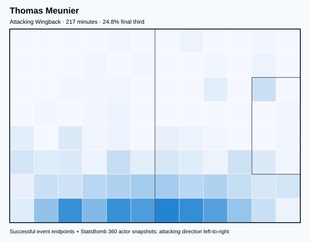

## Physical profile

| Metric | Score |
|---|---:|
| Aerial dominance | 0.333 |
| Pressing intensity per 90 | 13.66 |
| Recovery index per 90 | 3.31 |

## Top chemistry partners

- Toby Alderweireld — synergy 0.542, 217 shared minutes
- Jan Vertonghen — synergy 0.528, 217 shared minutes
- Thibaut Courtois — synergy 0.526, 217 shared minutes

## Tactical recommendations

- Lead the first pressing trigger and protect the inside passing lane.
- Use recovery capacity to support higher attacking positions.

_The heatmap combines successful event endpoints with StatsBomb 360 actor
snapshots. StatsBomb 360 is freeze-frame context, not continuous player
tracking. Ratings include eligible outfield players from 45 minutes and
goalkeepers from 90 minutes; ranking status communicates sample reliability._

---

<!-- PLAYER_REPORT 5: 3289_starter_report.md -->

# Romelu Lukaku Menama — Starter Report

- Team: Belgium (BEL)
- Position: Center Forward
- Functional role: Target Forward / Penalty-Box Anchor
- VAEP offense per 90: 1.2003
- VAEP defense per 90: 0.1742
- VAEP total per 90: 1.3745
- VAEP per touch: 0.02156
- Spatial xT per 90: -0.0221
- Final-third spatial share: 50.0%
- Unified final player rating: 0.2949
- Team rank: #1

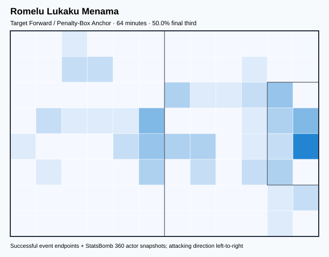

## Physical profile

| Metric | Score |
|---|---:|
| Aerial dominance | 1.000 |
| Pressing intensity per 90 | 11.34 |
| Recovery index per 90 | 2.83 |

## Top chemistry partners

- Thibaut Courtois — synergy 0.192, 64 shared minutes
- Axel Witsel — synergy 0.192, 64 shared minutes
- Jan Vertonghen — synergy 0.185, 64 shared minutes

## Tactical recommendations

- Lead the first pressing trigger and protect the inside passing lane.
- Target this player on direct restarts and back-post deliveries.
- Use recovery capacity to support higher attacking positions.

_The heatmap combines successful event endpoints with StatsBomb 360 actor
snapshots. StatsBomb 360 is freeze-frame context, not continuous player
tracking. Ratings include eligible outfield players from 45 minutes and
goalkeepers from 90 minutes; ranking status communicates sample reliability._

---

<!-- PLAYER_REPORT 6: 3457_starter_report.md -->

# Michy Batshuayi Tunga — Starter Report

- Team: Belgium (BEL)
- Position: Center Forward
- Functional role: Target Forward
- VAEP offense per 90: 0.6364
- VAEP defense per 90: 0.0438
- VAEP total per 90: 0.6802
- VAEP per touch: 0.00814
- Spatial xT per 90: 0.0307
- Final-third spatial share: 39.5%
- Unified final player rating: 0.2668
- Team rank: #2

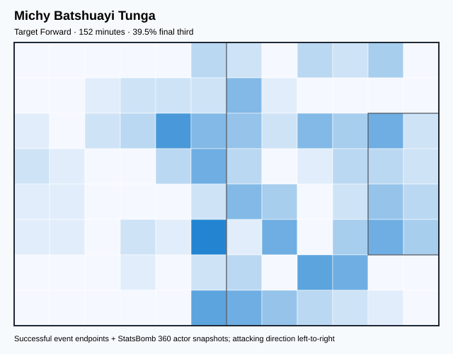

## Physical profile

| Metric | Score |
|---|---:|
| Aerial dominance | 0.250 |
| Pressing intensity per 90 | 9.48 |
| Recovery index per 90 | 2.37 |

## Top chemistry partners

- Axel Witsel — synergy 0.403, 152 shared minutes
- Timothy Castagne — synergy 0.320, 152 shared minutes
- Kevin De Bruyne — synergy 0.310, 152 shared minutes

## Tactical recommendations

- Use a compact pressing trigger rather than sustained solo pressure.
- Pair with a faster recovery defender after aggressive rotations.

_The heatmap combines successful event endpoints with StatsBomb 360 actor
snapshots. StatsBomb 360 is freeze-frame context, not continuous player
tracking. Ratings include eligible outfield players from 45 minutes and
goalkeepers from 90 minutes; ranking status communicates sample reliability._

---

<!-- PLAYER_REPORT 7: 3509_starter_report.md -->

# Thibaut Courtois — Starter Report

- Team: Belgium (BEL)
- Position: Goalkeeper
- Functional role: Goalkeeper
- VAEP offense per 90: -0.0175
- VAEP defense per 90: -0.1490
- VAEP total per 90: -0.1665
- VAEP per touch: -0.00205
- Spatial xT per 90: 0.0025
- Final-third spatial share: 0.2%
- Unified final player rating: -0.0698
- Team rank: #17

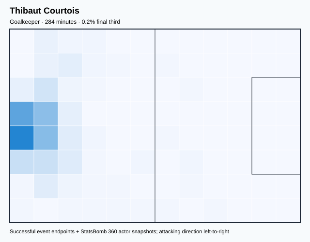

## Physical profile

| Metric | Score |
|---|---:|
| Aerial dominance | 0.000 |
| Pressing intensity per 90 | 0.00 |
| Recovery index per 90 | 3.80 |

## Top chemistry partners

- Jan Vertonghen — synergy 0.645, 284 shared minutes
- Toby Alderweireld — synergy 0.643, 284 shared minutes
- Timothy Castagne — synergy 0.635, 284 shared minutes

## Tactical recommendations

- Use a compact pressing trigger rather than sustained solo pressure.
- Avoid isolating this player in high-volume aerial matchups.
- Use recovery capacity to support higher attacking positions.

_The heatmap combines successful event endpoints with StatsBomb 360 actor
snapshots. StatsBomb 360 is freeze-frame context, not continuous player
tracking. Ratings include eligible outfield players from 45 minutes and
goalkeepers from 90 minutes; ranking status communicates sample reliability._

---

<!-- PLAYER_REPORT 8: 3621_starter_report.md -->

# Eden Hazard — Starter Report

- Team: Belgium (BEL)
- Position: Left Attacking Midfield
- Functional role: Progressive Winger
- VAEP offense per 90: 0.2343
- VAEP defense per 90: 0.0084
- VAEP total per 90: 0.2426
- VAEP per touch: 0.00165
- Spatial xT per 90: 0.0303
- Final-third spatial share: 31.8%
- Unified final player rating: 0.1657
- Team rank: #7

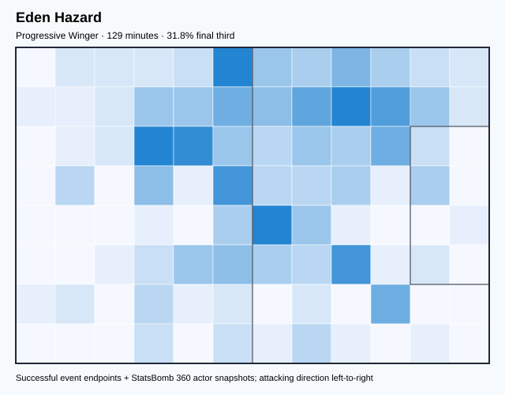

## Physical profile

| Metric | Score |
|---|---:|
| Aerial dominance | 0.500 |
| Pressing intensity per 90 | 4.19 |
| Recovery index per 90 | 8.38 |

## Top chemistry partners

- Axel Witsel — synergy 0.369, 129 shared minutes
- Timothy Castagne — synergy 0.344, 129 shared minutes
- Thibaut Courtois — synergy 0.343, 129 shared minutes

## Tactical recommendations

- Use a compact pressing trigger rather than sustained solo pressure.
- Use recovery capacity to support higher attacking positions.

_The heatmap combines successful event endpoints with StatsBomb 360 actor
snapshots. StatsBomb 360 is freeze-frame context, not continuous player
tracking. Ratings include eligible outfield players from 45 minutes and
goalkeepers from 90 minutes; ranking status communicates sample reliability._

---

<!-- PLAYER_REPORT 9: 5630_starter_report.md -->

# Dries Mertens — Starter Report

- Team: Belgium (BEL)
- Position: Center Attacking Midfield
- Functional role: Target Forward
- VAEP offense per 90: 0.6097
- VAEP defense per 90: 0.0000
- VAEP total per 90: 0.6097
- VAEP per touch: 0.00515
- Spatial xT per 90: 0.0877
- Final-third spatial share: 43.3%
- Unified final player rating: 0.1990
- Team rank: #4

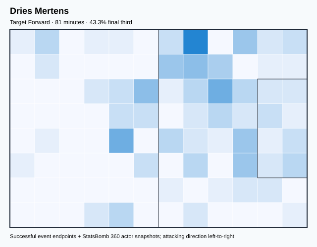

## Physical profile

| Metric | Score |
|---|---:|
| Aerial dominance | 0.500 |
| Pressing intensity per 90 | 13.40 |
| Recovery index per 90 | 0.00 |

## Top chemistry partners

- Timothy Castagne — synergy 0.244, 81 shared minutes
- Axel Witsel — synergy 0.243, 81 shared minutes
- Thibaut Courtois — synergy 0.228, 81 shared minutes

## Tactical recommendations

- Lead the first pressing trigger and protect the inside passing lane.
- Pair with a faster recovery defender after aggressive rotations.

_The heatmap combines successful event endpoints with StatsBomb 360 actor
snapshots. StatsBomb 360 is freeze-frame context, not continuous player
tracking. Ratings include eligible outfield players from 45 minutes and
goalkeepers from 90 minutes; ranking status communicates sample reliability._

---

<!-- PLAYER_REPORT 10: 5632_starter_report.md -->

# Thorgan Hazard — Starter Report

- Team: Belgium (BEL)
- Position: Left Wing
- Functional role: Progressive Winger
- VAEP offense per 90: 0.2214
- VAEP defense per 90: -0.0570
- VAEP total per 90: 0.1643
- VAEP per touch: 0.00131
- Spatial xT per 90: 0.1272
- Final-third spatial share: 34.1%
- Unified final player rating: 0.1631
- Team rank: #8

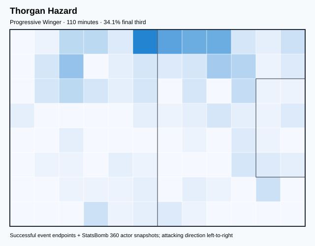

## Physical profile

| Metric | Score |
|---|---:|
| Aerial dominance | 0.000 |
| Pressing intensity per 90 | 27.01 |
| Recovery index per 90 | 2.46 |

## Top chemistry partners

- Thibaut Courtois — synergy 0.307, 110 shared minutes
- Timothy Castagne — synergy 0.303, 110 shared minutes
- Jan Vertonghen — synergy 0.290, 110 shared minutes

## Tactical recommendations

- Lead the first pressing trigger and protect the inside passing lane.
- Avoid isolating this player in high-volume aerial matchups.
- Pair with a faster recovery defender after aggressive rotations.

_The heatmap combines successful event endpoints with StatsBomb 360 actor
snapshots. StatsBomb 360 is freeze-frame context, not continuous player
tracking. Ratings include eligible outfield players from 45 minutes and
goalkeepers from 90 minutes; ranking status communicates sample reliability._

---

<!-- PLAYER_REPORT 11: 5633_starter_report.md -->

# Yannick Ferreira Carrasco — Starter Report

- Team: Belgium (BEL)
- Position: Left Wing
- Functional role: Ball-Winner
- VAEP offense per 90: 0.4876
- VAEP defense per 90: -0.1565
- VAEP total per 90: 0.3311
- VAEP per touch: 0.00277
- Spatial xT per 90: 0.0722
- Final-third spatial share: 38.2%
- Unified final player rating: 0.1775
- Team rank: #5

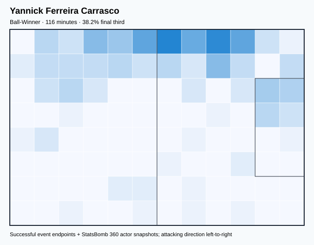

## Physical profile

| Metric | Score |
|---|---:|
| Aerial dominance | 0.000 |
| Pressing intensity per 90 | 10.04 |
| Recovery index per 90 | 3.86 |

## Top chemistry partners

- Timothy Castagne — synergy 0.334, 116 shared minutes
- Axel Witsel — synergy 0.328, 116 shared minutes
- Toby Alderweireld — synergy 0.328, 116 shared minutes

## Tactical recommendations

- Use a compact pressing trigger rather than sustained solo pressure.
- Avoid isolating this player in high-volume aerial matchups.
- Use recovery capacity to support higher attacking positions.

_The heatmap combines successful event endpoints with StatsBomb 360 actor
snapshots. StatsBomb 360 is freeze-frame context, not continuous player
tracking. Ratings include eligible outfield players from 45 minutes and
goalkeepers from 90 minutes; ranking status communicates sample reliability._

---

<!-- PLAYER_REPORT 12: 5642_starter_report.md -->

# Axel Witsel — Starter Report

- Team: Belgium (BEL)
- Position: Left Defensive Midfield
- Functional role: Holding Anchor
- VAEP offense per 90: 0.0284
- VAEP defense per 90: -0.0691
- VAEP total per 90: -0.0407
- VAEP per touch: -0.00028
- Spatial xT per 90: 0.0170
- Final-third spatial share: 11.4%
- Unified final player rating: 0.0067
- Team rank: #13

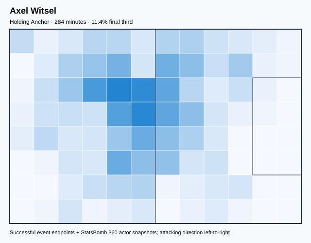

## Physical profile

| Metric | Score |
|---|---:|
| Aerial dominance | 0.667 |
| Pressing intensity per 90 | 14.56 |
| Recovery index per 90 | 2.85 |

## Top chemistry partners

- Toby Alderweireld — synergy 0.643, 284 shared minutes
- Kevin De Bruyne — synergy 0.638, 284 shared minutes
- Jan Vertonghen — synergy 0.633, 284 shared minutes

## Tactical recommendations

- Lead the first pressing trigger and protect the inside passing lane.
- Target this player on direct restarts and back-post deliveries.
- Use recovery capacity to support higher attacking positions.

_The heatmap combines successful event endpoints with StatsBomb 360 actor
snapshots. StatsBomb 360 is freeze-frame context, not continuous player
tracking. Ratings include eligible outfield players from 45 minutes and
goalkeepers from 90 minutes; ranking status communicates sample reliability._

---

<!-- PLAYER_REPORT 13: 6331_starter_report.md -->

# Leander Dendoncker — Starter Report

- Team: Belgium (BEL)
- Position: Right Center Back
- Functional role: Sweeper CB
- VAEP offense per 90: 0.0880
- VAEP defense per 90: -0.1793
- VAEP total per 90: -0.0914
- VAEP per touch: -0.00052
- Spatial xT per 90: 0.0140
- Final-third spatial share: 5.9%
- Unified final player rating: -0.0183
- Team rank: #16

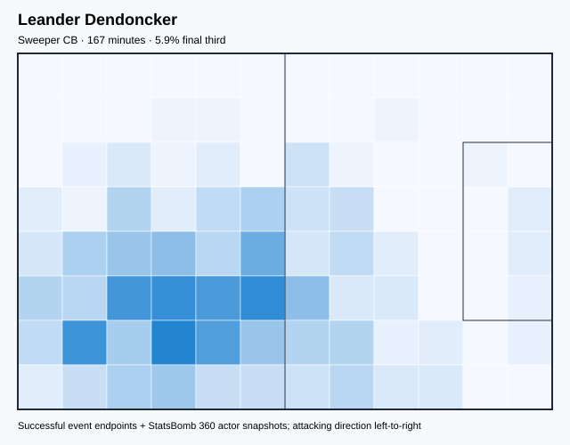

## Physical profile

| Metric | Score |
|---|---:|
| Aerial dominance | 0.400 |
| Pressing intensity per 90 | 10.26 |
| Recovery index per 90 | 2.16 |

## Top chemistry partners

- Toby Alderweireld — synergy 0.457, 167 shared minutes
- Thibaut Courtois — synergy 0.453, 167 shared minutes
- Jan Vertonghen — synergy 0.452, 167 shared minutes

## Tactical recommendations

- Use a compact pressing trigger rather than sustained solo pressure.
- Pair with a faster recovery defender after aggressive rotations.

_The heatmap combines successful event endpoints with StatsBomb 360 actor
snapshots. StatsBomb 360 is freeze-frame context, not continuous player
tracking. Ratings include eligible outfield players from 45 minutes and
goalkeepers from 90 minutes; ranking status communicates sample reliability._

---

<!-- PLAYER_REPORT 14: 6989_starter_report.md -->

# Timothy Castagne — Starter Report

- Team: Belgium (BEL)
- Position: Left Back
- Functional role: Sweeper CB
- VAEP offense per 90: 0.0501
- VAEP defense per 90: -0.0124
- VAEP total per 90: 0.0377
- VAEP per touch: 0.00022
- Spatial xT per 90: 0.0166
- Final-third spatial share: 13.2%
- Unified final player rating: 0.0415
- Team rank: #10

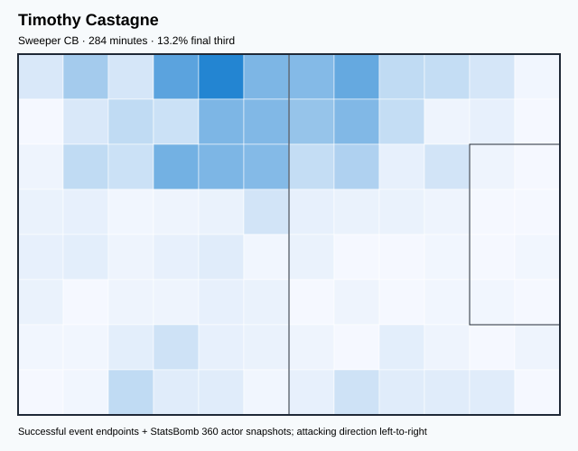

## Physical profile

| Metric | Score |
|---|---:|
| Aerial dominance | 0.571 |
| Pressing intensity per 90 | 10.13 |
| Recovery index per 90 | 1.58 |

## Top chemistry partners

- Jan Vertonghen — synergy 0.639, 284 shared minutes
- Thibaut Courtois — synergy 0.635, 284 shared minutes
- Axel Witsel — synergy 0.624, 284 shared minutes

## Tactical recommendations

- Use a compact pressing trigger rather than sustained solo pressure.
- Target this player on direct restarts and back-post deliveries.
- Pair with a faster recovery defender after aggressive rotations.

_The heatmap combines successful event endpoints with StatsBomb 360 actor
snapshots. StatsBomb 360 is freeze-frame context, not continuous player
tracking. Ratings include eligible outfield players from 45 minutes and
goalkeepers from 90 minutes; ranking status communicates sample reliability._

---

<!-- PLAYER_REPORT 15: 16559_starter_report.md -->

# Leandro Trossard — Starter Report

- Team: Belgium (BEL)
- Position: Center Forward
- Functional role: Progressive Winger
- VAEP offense per 90: 0.2051
- VAEP defense per 90: -0.0140
- VAEP total per 90: 0.1911
- VAEP per touch: 0.00123
- Spatial xT per 90: 0.0418
- Final-third spatial share: 30.2%
- Unified final player rating: 0.2122
- Team rank: #3

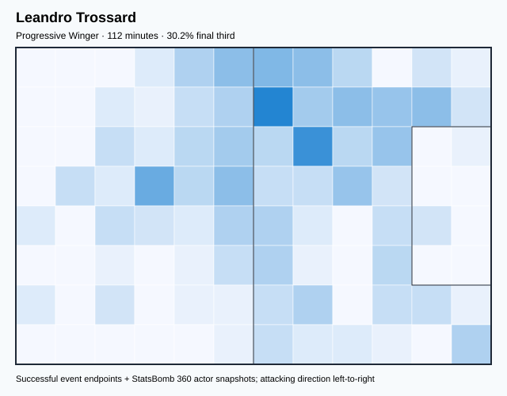

## Physical profile

| Metric | Score |
|---|---:|
| Aerial dominance | 0.000 |
| Pressing intensity per 90 | 13.60 |
| Recovery index per 90 | 5.60 |

## Top chemistry partners

- Axel Witsel — synergy 0.314, 112 shared minutes
- Thibaut Courtois — synergy 0.308, 112 shared minutes
- Jan Vertonghen — synergy 0.302, 112 shared minutes

## Tactical recommendations

- Lead the first pressing trigger and protect the inside passing lane.
- Avoid isolating this player in high-volume aerial matchups.
- Use recovery capacity to support higher attacking positions.

_The heatmap combines successful event endpoints with StatsBomb 360 actor
snapshots. StatsBomb 360 is freeze-frame context, not continuous player
tracking. Ratings include eligible outfield players from 45 minutes and
goalkeepers from 90 minutes; ranking status communicates sample reliability._

---

<!-- PLAYER_REPORT 16: 20005_starter_report.md -->

# Toby Alderweireld — Starter Report

- Team: Belgium (BEL)
- Position: Right Center Back
- Functional role: Ball-Playing Centre-Back
- VAEP offense per 90: 0.0130
- VAEP defense per 90: -0.0809
- VAEP total per 90: -0.0679
- VAEP per touch: -0.00029
- Spatial xT per 90: 0.0243
- Final-third spatial share: 3.8%
- Unified final player rating: -0.0169
- Team rank: #15

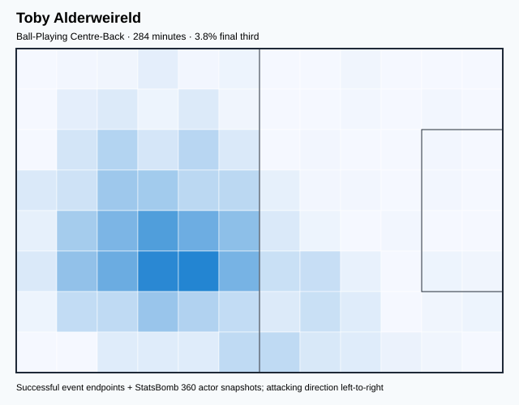

## Physical profile

| Metric | Score |
|---|---:|
| Aerial dominance | 0.286 |
| Pressing intensity per 90 | 4.75 |
| Recovery index per 90 | 2.53 |

## Top chemistry partners

- Jan Vertonghen — synergy 0.645, 284 shared minutes
- Axel Witsel — synergy 0.643, 284 shared minutes
- Thibaut Courtois — synergy 0.643, 284 shared minutes

## Tactical recommendations

- Use a compact pressing trigger rather than sustained solo pressure.
- Pair with a faster recovery defender after aggressive rotations.

_The heatmap combines successful event endpoints with StatsBomb 360 actor
snapshots. StatsBomb 360 is freeze-frame context, not continuous player
tracking. Ratings include eligible outfield players from 45 minutes and
goalkeepers from 90 minutes; ranking status communicates sample reliability._

---

<!-- PLAYER_REPORT 17: 48347_starter_report.md -->

# Amadou Onana — Starter Report

- Team: Belgium (BEL)
- Position: Right Defensive Midfield
- Functional role: Holding Anchor
- VAEP offense per 90: 0.0443
- VAEP defense per 90: -0.0197
- VAEP total per 90: 0.0246
- VAEP per touch: 0.00015
- Spatial xT per 90: 0.0303
- Final-third spatial share: 9.6%
- Unified final player rating: 0.0210
- Team rank: #11

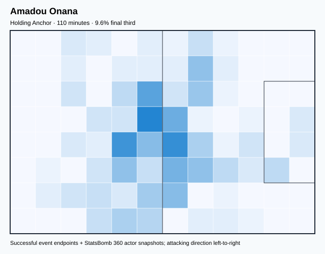

## Physical profile

| Metric | Score |
|---|---:|
| Aerial dominance | 1.000 |
| Pressing intensity per 90 | 18.05 |
| Recovery index per 90 | 0.82 |

## Top chemistry partners

- Toby Alderweireld — synergy 0.324, 110 shared minutes
- Timothy Castagne — synergy 0.323, 110 shared minutes
- Jan Vertonghen — synergy 0.321, 110 shared minutes

## Tactical recommendations

- Lead the first pressing trigger and protect the inside passing lane.
- Target this player on direct restarts and back-post deliveries.
- Pair with a faster recovery defender after aggressive rotations.

_The heatmap combines successful event endpoints with StatsBomb 360 actor
snapshots. StatsBomb 360 is freeze-frame context, not continuous player
tracking. Ratings include eligible outfield players from 45 minutes and
goalkeepers from 90 minutes; ranking status communicates sample reliability._
