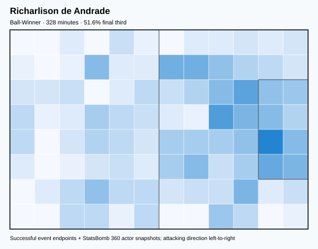
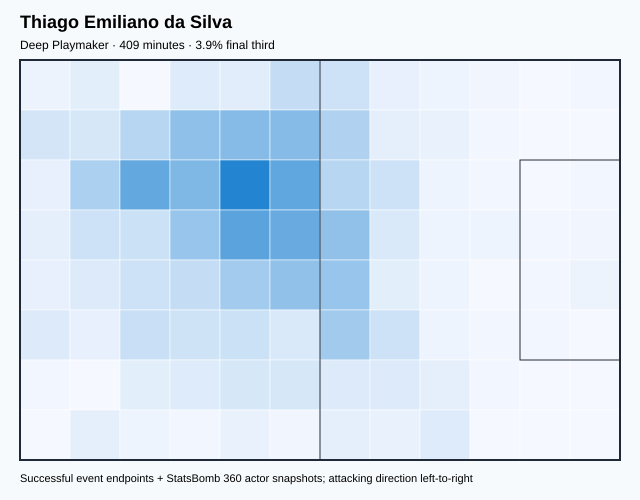
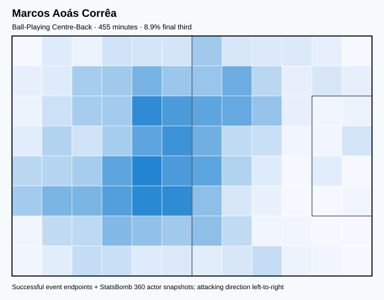
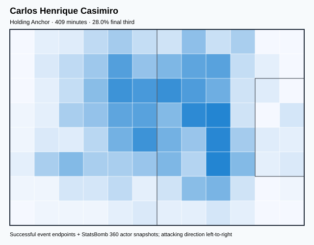
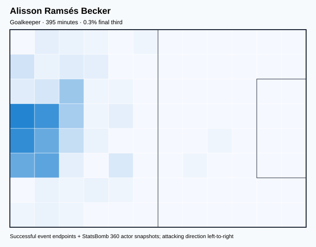
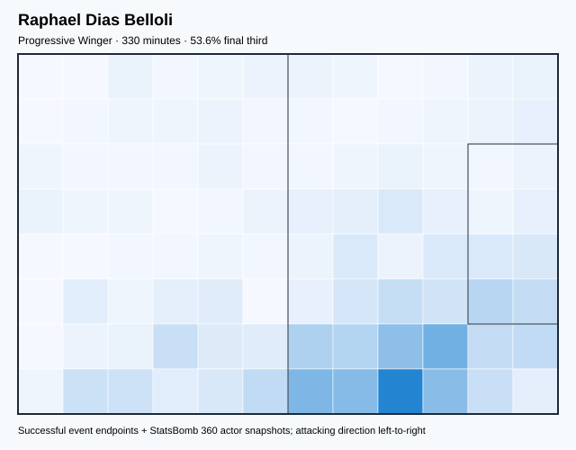
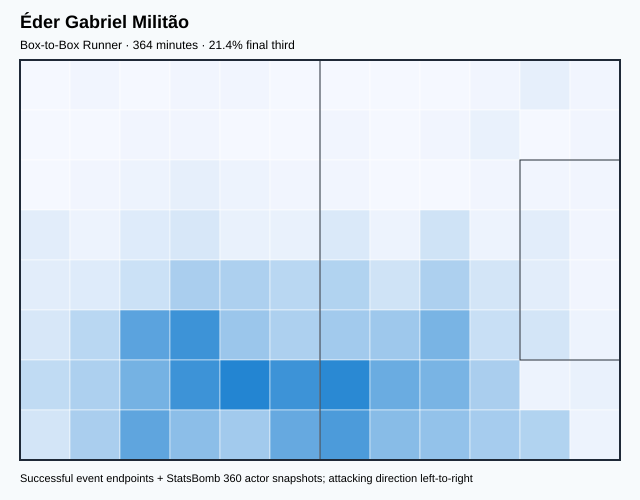
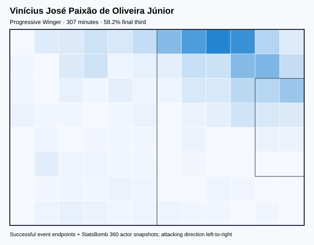
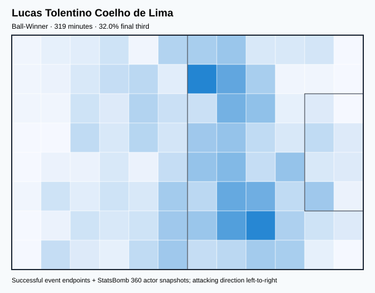

# BRA — V4 Player Evaluation Collection

- Included 300+ minute players: 9
- Rankings use one cross-role 360-VAEP plus xT formula.
- Heatmaps combine successful on-ball endpoints and SB360 actor snapshots.

---

<!-- PLAYER_REPORT 1: 3280_starter_report.md -->

# Richarlison de Andrade — Starter Report

- Team: Brazil (BRA)
- Position: Center Forward
- Functional role: Target Forward
- VAEP offense per 90: 1.2497
- VAEP defense per 90: 0.1331
- VAEP total per 90: 1.3828
- VAEP per touch: 0.01940
- Spatial xT per 90: 0.0140
- Final-third spatial share: 51.6%
- Unified final player rating: 0.7000
- Team rank: #1

## Physical profile

| Metric | Score |
|---|---:|
| Aerial dominance | 0.231 |
| Pressing intensity per 90 | 16.45 |
| Recovery index per 90 | 4.39 |

## Top chemistry partners

- Thiago Emiliano da Silva — synergy 0.653, 328 shared minutes
- Marcos Aoás Corrêa — synergy 0.645, 328 shared minutes
- Carlos Henrique Casimiro — synergy 0.589, 328 shared minutes

## Tactical recommendations

- Lead the first pressing trigger and protect the inside passing lane.
- Use recovery capacity to support higher attacking positions.

_The heatmap combines successful event endpoints with StatsBomb 360 actor
snapshots. StatsBomb 360 is freeze-frame context, not continuous player
tracking. Scores exclude players below 300 tournament minutes._

---

<!-- PLAYER_REPORT 2: 3295_starter_report.md -->

# Thiago Emiliano da Silva — Starter Report

- Team: Brazil (BRA)
- Position: Right Center Back
- Functional role: Deep Playmaker
- VAEP offense per 90: 0.0731
- VAEP defense per 90: -0.0329
- VAEP total per 90: 0.0402
- VAEP per touch: 0.00020
- Spatial xT per 90: 0.0233
- Final-third spatial share: 3.9%
- Unified final player rating: 0.0248
- Team rank: #9

## Physical profile

| Metric | Score |
|---|---:|
| Aerial dominance | 0.583 |
| Pressing intensity per 90 | 6.60 |
| Recovery index per 90 | 2.20 |

## Top chemistry partners

- Marcos Aoás Corrêa — synergy 0.778, 409 shared minutes
- Carlos Henrique Casimiro — synergy 0.771, 409 shared minutes
- Alisson Ramsés Becker — synergy 0.757, 395 shared minutes

## Tactical recommendations

- Use a compact pressing trigger rather than sustained solo pressure.
- Target this player on direct restarts and back-post deliveries.
- Pair with a faster recovery defender after aggressive rotations.

_The heatmap combines successful event endpoints with StatsBomb 360 actor
snapshots. StatsBomb 360 is freeze-frame context, not continuous player
tracking. Scores exclude players below 300 tournament minutes._

---

<!-- PLAYER_REPORT 3: 4372_starter_report.md -->

# Marcos Aoás Corrêa — Starter Report

- Team: Brazil (BRA)
- Position: Left Center Back
- Functional role: Deep Playmaker
- VAEP offense per 90: 0.0762
- VAEP defense per 90: -0.0249
- VAEP total per 90: 0.0513
- VAEP per touch: 0.00027
- Spatial xT per 90: 0.0244
- Final-third spatial share: 8.9%
- Unified final player rating: 0.0306
- Team rank: #8

## Physical profile

| Metric | Score |
|---|---:|
| Aerial dominance | 0.533 |
| Pressing intensity per 90 | 4.75 |
| Recovery index per 90 | 2.57 |

## Top chemistry partners

- Thiago Emiliano da Silva — synergy 0.778, 409 shared minutes
- Alisson Ramsés Becker — synergy 0.759, 395 shared minutes
- Carlos Henrique Casimiro — synergy 0.749, 409 shared minutes

## Tactical recommendations

- Use a compact pressing trigger rather than sustained solo pressure.
- Use recovery capacity to support higher attacking positions.

_The heatmap combines successful event endpoints with StatsBomb 360 actor
snapshots. StatsBomb 360 is freeze-frame context, not continuous player
tracking. Scores exclude players below 300 tournament minutes._

---

<!-- PLAYER_REPORT 4: 5539_starter_report.md -->

# Carlos Henrique Casimiro — Starter Report

- Team: Brazil (BRA)
- Position: Left Defensive Midfield
- Functional role: Ball-Winner
- VAEP offense per 90: 0.4746
- VAEP defense per 90: -0.0423
- VAEP total per 90: 0.4323
- VAEP per touch: 0.00295
- Spatial xT per 90: 0.0353
- Final-third spatial share: 28.0%
- Unified final player rating: 0.2241
- Team rank: #4

## Physical profile

| Metric | Score |
|---|---:|
| Aerial dominance | 0.500 |
| Pressing intensity per 90 | 13.20 |
| Recovery index per 90 | 3.30 |

## Top chemistry partners

- Thiago Emiliano da Silva — synergy 0.771, 409 shared minutes
- Marcos Aoás Corrêa — synergy 0.749, 409 shared minutes
- Alisson Ramsés Becker — synergy 0.634, 395 shared minutes

## Tactical recommendations

- Lead the first pressing trigger and protect the inside passing lane.
- Use recovery capacity to support higher attacking positions.

_The heatmap combines successful event endpoints with StatsBomb 360 actor
snapshots. StatsBomb 360 is freeze-frame context, not continuous player
tracking. Scores exclude players below 300 tournament minutes._

---

<!-- PLAYER_REPORT 5: 5547_starter_report.md -->

# Alisson Ramsés Becker — Starter Report

- Team: Brazil (BRA)
- Position: Goalkeeper
- Functional role: Goalkeeper
- VAEP offense per 90: -0.0160
- VAEP defense per 90: 0.4358
- VAEP total per 90: 0.4198
- VAEP per touch: 0.00985
- Spatial xT per 90: 0.0009
- Final-third spatial share: 0.3%
- Unified final player rating: 0.2130
- Team rank: #6

## Physical profile

| Metric | Score |
|---|---:|
| Aerial dominance | 0.000 |
| Pressing intensity per 90 | 0.00 |
| Recovery index per 90 | 5.01 |

## Top chemistry partners

- Marcos Aoás Corrêa — synergy 0.759, 395 shared minutes
- Thiago Emiliano da Silva — synergy 0.757, 395 shared minutes
- Carlos Henrique Casimiro — synergy 0.634, 395 shared minutes

## Tactical recommendations

- Use a compact pressing trigger rather than sustained solo pressure.
- Avoid isolating this player in high-volume aerial matchups.
- Use recovery capacity to support higher attacking positions.

_The heatmap combines successful event endpoints with StatsBomb 360 actor
snapshots. StatsBomb 360 is freeze-frame context, not continuous player
tracking. Scores exclude players below 300 tournament minutes._

---

<!-- PLAYER_REPORT 6: 10595_starter_report.md -->

# Raphael Dias Belloli — Starter Report

- Team: Brazil (BRA)
- Position: Right Wing
- Functional role: Progressive Winger
- VAEP offense per 90: 0.6036
- VAEP defense per 90: -0.0040
- VAEP total per 90: 0.5996
- VAEP per touch: 0.00434
- Spatial xT per 90: 0.1793
- Final-third spatial share: 53.6%
- Unified final player rating: 0.3370
- Team rank: #2

## Physical profile

| Metric | Score |
|---|---:|
| Aerial dominance | 0.000 |
| Pressing intensity per 90 | 15.52 |
| Recovery index per 90 | 4.36 |

## Top chemistry partners

- Thiago Emiliano da Silva — synergy 0.605, 309 shared minutes
- Marcos Aoás Corrêa — synergy 0.542, 330 shared minutes
- Lucas Tolentino Coelho de Lima — synergy 0.536, 269 shared minutes

## Tactical recommendations

- Lead the first pressing trigger and protect the inside passing lane.
- Avoid isolating this player in high-volume aerial matchups.
- Use recovery capacity to support higher attacking positions.

_The heatmap combines successful event endpoints with StatsBomb 360 actor
snapshots. StatsBomb 360 is freeze-frame context, not continuous player
tracking. Scores exclude players below 300 tournament minutes._

---

<!-- PLAYER_REPORT 7: 13620_starter_report.md -->

# Éder Gabriel Militão — Starter Report

- Team: Brazil (BRA)
- Position: Right Back
- Functional role: Box-to-Box Runner
- VAEP offense per 90: 0.1202
- VAEP defense per 90: -0.0253
- VAEP total per 90: 0.0949
- VAEP per touch: 0.00052
- Spatial xT per 90: 0.0164
- Final-third spatial share: 21.4%
- Unified final player rating: 0.0509
- Team rank: #7

## Physical profile

| Metric | Score |
|---|---:|
| Aerial dominance | 0.400 |
| Pressing intensity per 90 | 13.86 |
| Recovery index per 90 | 4.95 |

## Top chemistry partners

- Marcos Aoás Corrêa — synergy 0.677, 309 shared minutes
- Thiago Emiliano da Silva — synergy 0.608, 263 shared minutes
- Alisson Ramsés Becker — synergy 0.547, 263 shared minutes

## Tactical recommendations

- Lead the first pressing trigger and protect the inside passing lane.
- Use recovery capacity to support higher attacking positions.

_The heatmap combines successful event endpoints with StatsBomb 360 actor
snapshots. StatsBomb 360 is freeze-frame context, not continuous player
tracking. Scores exclude players below 300 tournament minutes._

---

<!-- PLAYER_REPORT 8: 18395_starter_report.md -->

# Vinícius José Paixão de Oliveira Júnior — Starter Report

- Team: Brazil (BRA)
- Position: Left Midfield
- Functional role: Progressive Winger
- VAEP offense per 90: 0.6542
- VAEP defense per 90: -0.0564
- VAEP total per 90: 0.5978
- VAEP per touch: 0.00487
- Spatial xT per 90: 0.1152
- Final-third spatial share: 58.2%
- Unified final player rating: 0.3234
- Team rank: #3

## Physical profile

| Metric | Score |
|---|---:|
| Aerial dominance | 0.000 |
| Pressing intensity per 90 | 12.04 |
| Recovery index per 90 | 4.40 |

## Top chemistry partners

- Thiago Emiliano da Silva — synergy 0.625, 307 shared minutes
- Alisson Ramsés Becker — synergy 0.600, 307 shared minutes
- Marcos Aoás Corrêa — synergy 0.562, 307 shared minutes

## Tactical recommendations

- Lead the first pressing trigger and protect the inside passing lane.
- Avoid isolating this player in high-volume aerial matchups.
- Use recovery capacity to support higher attacking positions.

_The heatmap combines successful event endpoints with StatsBomb 360 actor
snapshots. StatsBomb 360 is freeze-frame context, not continuous player
tracking. Scores exclude players below 300 tournament minutes._

---

<!-- PLAYER_REPORT 9: 22600_starter_report.md -->

# Lucas Tolentino Coelho de Lima — Starter Report

- Team: Brazil (BRA)
- Position: Right Defensive Midfield
- Functional role: Ball-Winner
- VAEP offense per 90: 0.3949
- VAEP defense per 90: 0.0315
- VAEP total per 90: 0.4264
- VAEP per touch: 0.00265
- Spatial xT per 90: 0.0332
- Final-third spatial share: 32.0%
- Unified final player rating: 0.2206
- Team rank: #5

## Physical profile

| Metric | Score |
|---|---:|
| Aerial dominance | 0.500 |
| Pressing intensity per 90 | 17.79 |
| Recovery index per 90 | 2.54 |

## Top chemistry partners

- Marcos Aoás Corrêa — synergy 0.638, 319 shared minutes
- Thiago Emiliano da Silva — synergy 0.620, 319 shared minutes
- Alisson Ramsés Becker — synergy 0.611, 305 shared minutes

## Tactical recommendations

- Lead the first pressing trigger and protect the inside passing lane.
- Use recovery capacity to support higher attacking positions.

_The heatmap combines successful event endpoints with StatsBomb 360 actor
snapshots. StatsBomb 360 is freeze-frame context, not continuous player
tracking. Scores exclude players below 300 tournament minutes._
