# BRA — V4 Player Evaluation Collection

<!-- V5_CANONICAL_NOTICE -->
> **Historical V4 player-rating packet.** Player ratings, ranks, role-challenger decisions, and rating uncertainty below are superseded by `results/reports/player_rankings.csv`, `results/reports/player_profiles/`, and `results/reports/model_summary.md`. Possession, tactical, and match-bootstrap material remains a historical V4 result.

- Included eligible players: 25
- Rankings use the role-aware, development-gated VAEP/xT/xD model.
- Heatmaps combine successful on-ball endpoints and SB360 actor snapshots.

---

<!-- PLAYER_REPORT 1: 3063_starter_report.md -->

# Danilo Luiz da Silva — Starter Report

- Team: Brazil (BRA)
- Position: Left Back
- Functional role: Sweeper CB
- VAEP offense per 90: 0.0992
- VAEP defense per 90: -0.0284
- VAEP total per 90: 0.0708
- VAEP per touch: 0.00033
- Spatial xT per 90: 0.0364
- Final-third spatial share: 19.3%
- Unified final player rating: 0.0494
- Team rank: #16

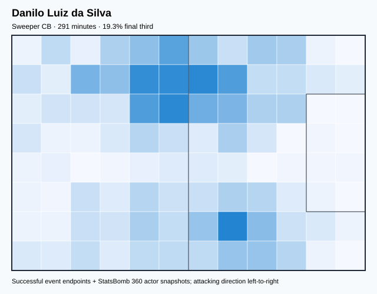

## Physical profile

| Metric | Score |
|---|---:|
| Aerial dominance | 0.750 |
| Pressing intensity per 90 | 4.64 |
| Recovery index per 90 | 2.78 |

## Top chemistry partners

- Marcos Aoás Corrêa — synergy 0.656, 291 shared minutes
- Thiago Emiliano da Silva — synergy 0.649, 291 shared minutes
- Carlos Henrique Casimiro — synergy 0.644, 291 shared minutes

## Tactical recommendations

- Use a compact pressing trigger rather than sustained solo pressure.
- Target this player on direct restarts and back-post deliveries.
- Use recovery capacity to support higher attacking positions.

_The heatmap combines successful event endpoints with StatsBomb 360 actor
snapshots. StatsBomb 360 is freeze-frame context, not continuous player
tracking. Ratings include eligible outfield players from 45 minutes and
goalkeepers from 90 minutes; ranking status communicates sample reliability._

---

<!-- PLAYER_REPORT 2: 3067_starter_report.md -->

# Ederson Santana de Moraes — Starter Report

- Team: Brazil (BRA)
- Position: Goalkeeper
- Functional role: Goalkeeper
- VAEP offense per 90: -0.0082
- VAEP defense per 90: -0.0838
- VAEP total per 90: -0.0920
- VAEP per touch: -0.00162
- Spatial xT per 90: 0.0085
- Final-third spatial share: 0.9%
- Unified final player rating: -0.0582
- Team rank: #25

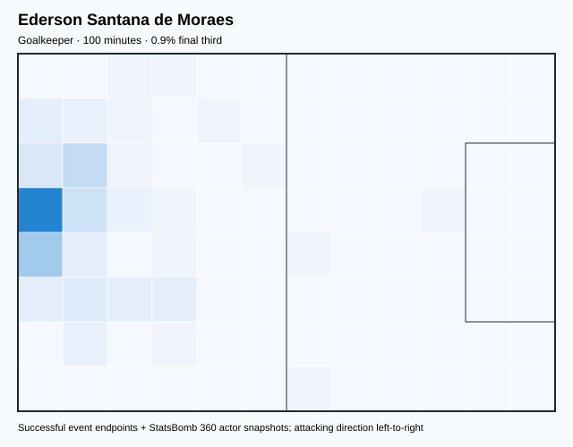

## Physical profile

| Metric | Score |
|---|---:|
| Aerial dominance | 0.000 |
| Pressing intensity per 90 | 0.00 |
| Recovery index per 90 | 8.99 |

## Top chemistry partners

- Gleison Bremer Silva Nascimento — synergy 0.299, 100 shared minutes
- Éder Gabriel Militão — synergy 0.298, 100 shared minutes
- Fábio Henrique Tavares — synergy 0.280, 100 shared minutes

## Tactical recommendations

- Use a compact pressing trigger rather than sustained solo pressure.
- Avoid isolating this player in high-volume aerial matchups.
- Use recovery capacity to support higher attacking positions.

_The heatmap combines successful event endpoints with StatsBomb 360 actor
snapshots. StatsBomb 360 is freeze-frame context, not continuous player
tracking. Ratings include eligible outfield players from 45 minutes and
goalkeepers from 90 minutes; ranking status communicates sample reliability._

---

<!-- PLAYER_REPORT 3: 3202_starter_report.md -->

# Gabriel Fernando de Jesus — Starter Report

- Team: Brazil (BRA)
- Position: Center Forward
- Functional role: Ball-Winner
- VAEP offense per 90: 0.4789
- VAEP defense per 90: 0.3599
- VAEP total per 90: 0.8388
- VAEP per touch: 0.00895
- Spatial xT per 90: -0.0107
- Final-third spatial share: 57.0%
- Unified final player rating: 0.2735
- Team rank: #2

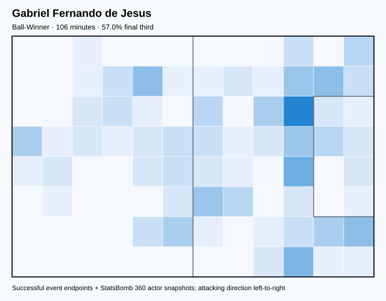

## Physical profile

| Metric | Score |
|---|---:|
| Aerial dominance | 0.000 |
| Pressing intensity per 90 | 15.34 |
| Recovery index per 90 | 5.96 |

## Top chemistry partners

- Rodrygo Silva de Goes — synergy 0.264, 96 shared minutes
- Antony Matheus dos Santos — synergy 0.239, 104 shared minutes
- Ederson Santana de Moraes — synergy 0.189, 64 shared minutes

## Tactical recommendations

- Lead the first pressing trigger and protect the inside passing lane.
- Avoid isolating this player in high-volume aerial matchups.
- Use recovery capacity to support higher attacking positions.

_The heatmap combines successful event endpoints with StatsBomb 360 actor
snapshots. StatsBomb 360 is freeze-frame context, not continuous player
tracking. Ratings include eligible outfield players from 45 minutes and
goalkeepers from 90 minutes; ranking status communicates sample reliability._

---

<!-- PLAYER_REPORT 4: 3247_starter_report.md -->

# Fábio Henrique Tavares — Starter Report

- Team: Brazil (BRA)
- Position: Left Defensive Midfield
- Functional role: Sweeper CB
- VAEP offense per 90: 0.0987
- VAEP defense per 90: -0.0304
- VAEP total per 90: 0.0683
- VAEP per touch: 0.00055
- Spatial xT per 90: 0.0162
- Final-third spatial share: 16.9%
- Unified final player rating: 0.0246
- Team rank: #20

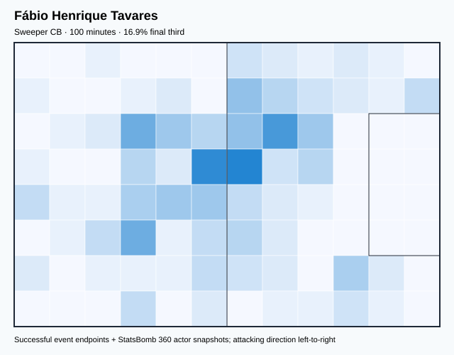

## Physical profile

| Metric | Score |
|---|---:|
| Aerial dominance | 0.250 |
| Pressing intensity per 90 | 17.08 |
| Recovery index per 90 | 1.80 |

## Top chemistry partners

- Éder Gabriel Militão — synergy 0.299, 100 shared minutes
- Daniel Alves da Silva — synergy 0.298, 100 shared minutes
- Gleison Bremer Silva Nascimento — synergy 0.296, 100 shared minutes

## Tactical recommendations

- Lead the first pressing trigger and protect the inside passing lane.
- Pair with a faster recovery defender after aggressive rotations.

_The heatmap combines successful event endpoints with StatsBomb 360 actor
snapshots. StatsBomb 360 is freeze-frame context, not continuous player
tracking. Ratings include eligible outfield players from 45 minutes and
goalkeepers from 90 minutes; ranking status communicates sample reliability._

---

<!-- PLAYER_REPORT 5: 3280_starter_report.md -->

# Richarlison de Andrade — Starter Report

- Team: Brazil (BRA)
- Position: Center Forward
- Functional role: Ball-Winner
- VAEP offense per 90: 0.5537
- VAEP defense per 90: 0.0894
- VAEP total per 90: 0.6431
- VAEP per touch: 0.00902
- Spatial xT per 90: 0.0119
- Final-third spatial share: 51.6%
- Unified final player rating: 0.2761
- Team rank: #1

## Physical profile

| Metric | Score |
|---|---:|
| Aerial dominance | 0.231 |
| Pressing intensity per 90 | 16.45 |
| Recovery index per 90 | 4.39 |

## Top chemistry partners

- Thiago Emiliano da Silva — synergy 0.653, 328 shared minutes
- Marcos Aoás Corrêa — synergy 0.645, 328 shared minutes
- Carlos Henrique Casimiro — synergy 0.589, 328 shared minutes

## Tactical recommendations

- Lead the first pressing trigger and protect the inside passing lane.
- Use recovery capacity to support higher attacking positions.

_The heatmap combines successful event endpoints with StatsBomb 360 actor
snapshots. StatsBomb 360 is freeze-frame context, not continuous player
tracking. Ratings include eligible outfield players from 45 minutes and
goalkeepers from 90 minutes; ranking status communicates sample reliability._

---

<!-- PLAYER_REPORT 6: 3295_starter_report.md -->

# Thiago Emiliano da Silva — Starter Report

- Team: Brazil (BRA)
- Position: Right Center Back
- Functional role: Ball-Playing Centre-Back
- VAEP offense per 90: 0.0365
- VAEP defense per 90: -0.0279
- VAEP total per 90: 0.0086
- VAEP per touch: 0.00004
- Spatial xT per 90: 0.0281
- Final-third spatial share: 3.9%
- Unified final player rating: -0.0000
- Team rank: #22

## Physical profile

| Metric | Score |
|---|---:|
| Aerial dominance | 0.583 |
| Pressing intensity per 90 | 6.60 |
| Recovery index per 90 | 2.20 |

## Top chemistry partners

- Marcos Aoás Corrêa — synergy 0.778, 409 shared minutes
- Carlos Henrique Casimiro — synergy 0.771, 409 shared minutes
- Alisson Ramsés Becker — synergy 0.757, 395 shared minutes

## Tactical recommendations

- Use a compact pressing trigger rather than sustained solo pressure.
- Target this player on direct restarts and back-post deliveries.
- Pair with a faster recovery defender after aggressive rotations.

_The heatmap combines successful event endpoints with StatsBomb 360 actor
snapshots. StatsBomb 360 is freeze-frame context, not continuous player
tracking. Ratings include eligible outfield players from 45 minutes and
goalkeepers from 90 minutes; ranking status communicates sample reliability._

---

<!-- PLAYER_REPORT 7: 4320_starter_report.md -->

# Neymar da Silva Santos Junior — Starter Report

- Team: Brazil (BRA)
- Position: Center Attacking Midfield
- Functional role: Progressive Winger
- VAEP offense per 90: 0.6072
- VAEP defense per 90: 0.0381
- VAEP total per 90: 0.6453
- VAEP per touch: 0.00355
- Spatial xT per 90: 0.1504
- Final-third spatial share: 43.3%
- Unified final player rating: 0.2448
- Team rank: #3

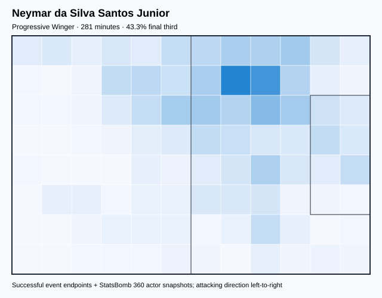

## Physical profile

| Metric | Score |
|---|---:|
| Aerial dominance | 0.200 |
| Pressing intensity per 90 | 7.67 |
| Recovery index per 90 | 4.16 |

## Top chemistry partners

- Thiago Emiliano da Silva — synergy 0.636, 281 shared minutes
- Carlos Henrique Casimiro — synergy 0.621, 281 shared minutes
- Danilo Luiz da Silva — synergy 0.591, 273 shared minutes

## Tactical recommendations

- Use a compact pressing trigger rather than sustained solo pressure.
- Use recovery capacity to support higher attacking positions.

_The heatmap combines successful event endpoints with StatsBomb 360 actor
snapshots. StatsBomb 360 is freeze-frame context, not continuous player
tracking. Ratings include eligible outfield players from 45 minutes and
goalkeepers from 90 minutes; ranking status communicates sample reliability._

---

<!-- PLAYER_REPORT 8: 4324_starter_report.md -->

# Daniel Alves da Silva — Starter Report

- Team: Brazil (BRA)
- Position: Right Back
- Functional role: Deep Playmaker
- VAEP offense per 90: 0.0784
- VAEP defense per 90: -0.0191
- VAEP total per 90: 0.0592
- VAEP per touch: 0.00034
- Spatial xT per 90: 0.1009
- Final-third spatial share: 30.9%
- Unified final player rating: 0.0528
- Team rank: #13

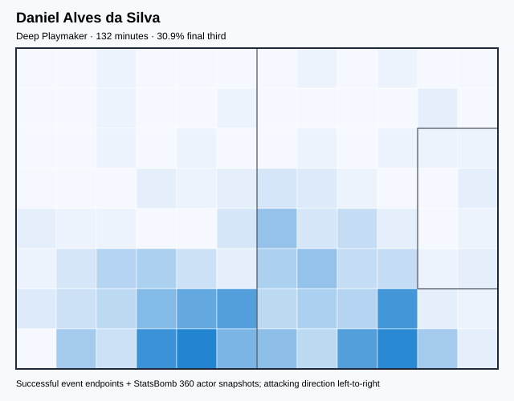

## Physical profile

| Metric | Score |
|---|---:|
| Aerial dominance | 0.667 |
| Pressing intensity per 90 | 12.32 |
| Recovery index per 90 | 4.11 |

## Top chemistry partners

- Gleison Bremer Silva Nascimento — synergy 0.347, 122 shared minutes
- Fábio Henrique Tavares — synergy 0.298, 100 shared minutes
- Éder Gabriel Militão — synergy 0.297, 100 shared minutes

## Tactical recommendations

- Lead the first pressing trigger and protect the inside passing lane.
- Target this player on direct restarts and back-post deliveries.
- Use recovery capacity to support higher attacking positions.

_The heatmap combines successful event endpoints with StatsBomb 360 actor
snapshots. StatsBomb 360 is freeze-frame context, not continuous player
tracking. Ratings include eligible outfield players from 45 minutes and
goalkeepers from 90 minutes; ranking status communicates sample reliability._

---

<!-- PLAYER_REPORT 9: 4372_starter_report.md -->

# Marcos Aoás Corrêa — Starter Report

- Team: Brazil (BRA)
- Position: Left Center Back
- Functional role: Ball-Playing Centre-Back
- VAEP offense per 90: 0.0006
- VAEP defense per 90: -0.0089
- VAEP total per 90: -0.0082
- VAEP per touch: -0.00004
- Spatial xT per 90: 0.0340
- Final-third spatial share: 8.9%
- Unified final player rating: -0.0032
- Team rank: #23

## Physical profile

| Metric | Score |
|---|---:|
| Aerial dominance | 0.533 |
| Pressing intensity per 90 | 4.75 |
| Recovery index per 90 | 2.57 |

## Top chemistry partners

- Thiago Emiliano da Silva — synergy 0.778, 409 shared minutes
- Alisson Ramsés Becker — synergy 0.759, 395 shared minutes
- Carlos Henrique Casimiro — synergy 0.749, 409 shared minutes

## Tactical recommendations

- Use a compact pressing trigger rather than sustained solo pressure.
- Use recovery capacity to support higher attacking positions.

_The heatmap combines successful event endpoints with StatsBomb 360 actor
snapshots. StatsBomb 360 is freeze-frame context, not continuous player
tracking. Ratings include eligible outfield players from 45 minutes and
goalkeepers from 90 minutes; ranking status communicates sample reliability._

---

<!-- PLAYER_REPORT 10: 5539_starter_report.md -->

# Carlos Henrique Casimiro — Starter Report

- Team: Brazil (BRA)
- Position: Left Defensive Midfield
- Functional role: Holding Anchor
- VAEP offense per 90: 0.0263
- VAEP defense per 90: -0.0339
- VAEP total per 90: -0.0075
- VAEP per touch: -0.00005
- Spatial xT per 90: 0.0460
- Final-third spatial share: 28.0%
- Unified final player rating: 0.0139
- Team rank: #21

## Physical profile

| Metric | Score |
|---|---:|
| Aerial dominance | 0.500 |
| Pressing intensity per 90 | 13.20 |
| Recovery index per 90 | 3.30 |

## Top chemistry partners

- Thiago Emiliano da Silva — synergy 0.771, 409 shared minutes
- Marcos Aoás Corrêa — synergy 0.749, 409 shared minutes
- Danilo Luiz da Silva — synergy 0.644, 291 shared minutes

## Tactical recommendations

- Lead the first pressing trigger and protect the inside passing lane.
- Use recovery capacity to support higher attacking positions.

_The heatmap combines successful event endpoints with StatsBomb 360 actor
snapshots. StatsBomb 360 is freeze-frame context, not continuous player
tracking. Ratings include eligible outfield players from 45 minutes and
goalkeepers from 90 minutes; ranking status communicates sample reliability._

---

<!-- PLAYER_REPORT 11: 5547_starter_report.md -->

# Alisson Ramsés Becker — Starter Report

- Team: Brazil (BRA)
- Position: Goalkeeper
- Functional role: Goalkeeper
- VAEP offense per 90: -0.0028
- VAEP defense per 90: -0.0351
- VAEP total per 90: -0.0378
- VAEP per touch: -0.00089
- Spatial xT per 90: 0.0013
- Final-third spatial share: 0.3%
- Unified final player rating: -0.0414
- Team rank: #24

## Physical profile

| Metric | Score |
|---|---:|
| Aerial dominance | 0.000 |
| Pressing intensity per 90 | 0.00 |
| Recovery index per 90 | 5.01 |

## Top chemistry partners

- Marcos Aoás Corrêa — synergy 0.759, 395 shared minutes
- Thiago Emiliano da Silva — synergy 0.757, 395 shared minutes
- Danilo Luiz da Silva — synergy 0.640, 291 shared minutes

## Tactical recommendations

- Use a compact pressing trigger rather than sustained solo pressure.
- Avoid isolating this player in high-volume aerial matchups.
- Use recovery capacity to support higher attacking positions.

_The heatmap combines successful event endpoints with StatsBomb 360 actor
snapshots. StatsBomb 360 is freeze-frame context, not continuous player
tracking. Ratings include eligible outfield players from 45 minutes and
goalkeepers from 90 minutes; ranking status communicates sample reliability._

---

<!-- PLAYER_REPORT 12: 6945_starter_report.md -->

# Alex Sandro Lobo Silva — Starter Report

- Team: Brazil (BRA)
- Position: Left Back
- Functional role: Attacking Wingback
- VAEP offense per 90: 0.1147
- VAEP defense per 90: 0.0028
- VAEP total per 90: 0.1175
- VAEP per touch: 0.00060
- Spatial xT per 90: 0.0640
- Final-third spatial share: 25.8%
- Unified final player rating: 0.0592
- Team rank: #11

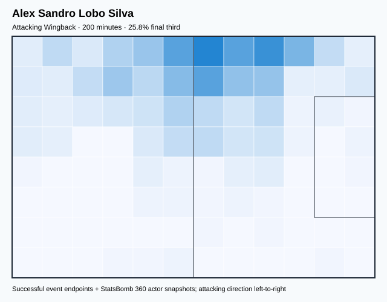

## Physical profile

| Metric | Score |
|---|---:|
| Aerial dominance | 0.833 |
| Pressing intensity per 90 | 11.73 |
| Recovery index per 90 | 5.41 |

## Top chemistry partners

- Marcos Aoás Corrêa — synergy 0.515, 200 shared minutes
- Thiago Emiliano da Silva — synergy 0.511, 200 shared minutes
- Carlos Henrique Casimiro — synergy 0.501, 200 shared minutes

## Tactical recommendations

- Lead the first pressing trigger and protect the inside passing lane.
- Target this player on direct restarts and back-post deliveries.
- Use recovery capacity to support higher attacking positions.

_The heatmap combines successful event endpoints with StatsBomb 360 actor
snapshots. StatsBomb 360 is freeze-frame context, not continuous player
tracking. Ratings include eligible outfield players from 45 minutes and
goalkeepers from 90 minutes; ranking status communicates sample reliability._

---

<!-- PLAYER_REPORT 13: 9904_starter_report.md -->

# Frederico Rodrigues Santos — Starter Report

- Team: Brazil (BRA)
- Position: Right Defensive Midfield
- Functional role: Ball-Winner
- VAEP offense per 90: 0.1378
- VAEP defense per 90: -0.0139
- VAEP total per 90: 0.1239
- VAEP per touch: 0.00087
- Spatial xT per 90: 0.0398
- Final-third spatial share: 35.3%
- Unified final player rating: 0.0339
- Team rank: #18

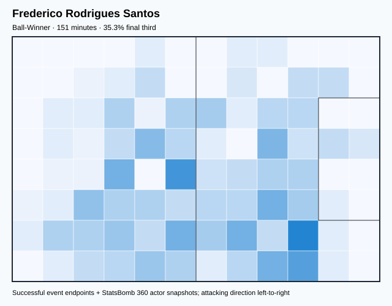

## Physical profile

| Metric | Score |
|---|---:|
| Aerial dominance | 0.000 |
| Pressing intensity per 90 | 19.01 |
| Recovery index per 90 | 3.57 |

## Top chemistry partners

- Éder Gabriel Militão — synergy 0.305, 112 shared minutes
- Carlos Henrique Casimiro — synergy 0.289, 97 shared minutes
- Marcos Aoás Corrêa — synergy 0.288, 97 shared minutes

## Tactical recommendations

- Lead the first pressing trigger and protect the inside passing lane.
- Avoid isolating this player in high-volume aerial matchups.
- Use recovery capacity to support higher attacking positions.

_The heatmap combines successful event endpoints with StatsBomb 360 actor
snapshots. StatsBomb 360 is freeze-frame context, not continuous player
tracking. Ratings include eligible outfield players from 45 minutes and
goalkeepers from 90 minutes; ranking status communicates sample reliability._

---

<!-- PLAYER_REPORT 14: 10595_starter_report.md -->

# Raphael Dias Belloli — Starter Report

- Team: Brazil (BRA)
- Position: Right Wing
- Functional role: Progressive Winger
- VAEP offense per 90: 0.4294
- VAEP defense per 90: 0.0061
- VAEP total per 90: 0.4355
- VAEP per touch: 0.00315
- Spatial xT per 90: 0.1698
- Final-third spatial share: 53.6%
- Unified final player rating: 0.2088
- Team rank: #6

## Physical profile

| Metric | Score |
|---|---:|
| Aerial dominance | 0.000 |
| Pressing intensity per 90 | 15.52 |
| Recovery index per 90 | 4.36 |

## Top chemistry partners

- Thiago Emiliano da Silva — synergy 0.605, 309 shared minutes
- Marcos Aoás Corrêa — synergy 0.542, 330 shared minutes
- Lucas Tolentino Coelho de Lima — synergy 0.536, 269 shared minutes

## Tactical recommendations

- Lead the first pressing trigger and protect the inside passing lane.
- Avoid isolating this player in high-volume aerial matchups.
- Use recovery capacity to support higher attacking positions.

_The heatmap combines successful event endpoints with StatsBomb 360 actor
snapshots. StatsBomb 360 is freeze-frame context, not continuous player
tracking. Ratings include eligible outfield players from 45 minutes and
goalkeepers from 90 minutes; ranking status communicates sample reliability._

---

<!-- PLAYER_REPORT 15: 11183_starter_report.md -->

# Alex Nicolao Telles — Starter Report

- Team: Brazil (BRA)
- Position: Left Back
- Functional role: Wide Creator
- VAEP offense per 90: 0.0425
- VAEP defense per 90: 0.0007
- VAEP total per 90: 0.0433
- VAEP per touch: 0.00030
- Spatial xT per 90: 0.0322
- Final-third spatial share: 33.5%
- Unified final player rating: 0.0505
- Team rank: #15

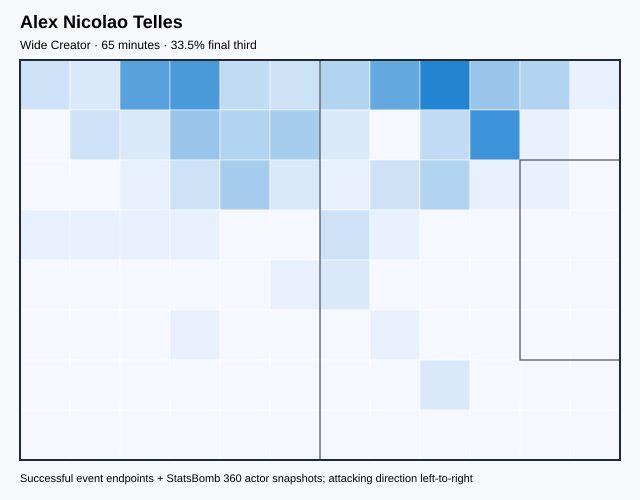

## Physical profile

| Metric | Score |
|---|---:|
| Aerial dominance | 0.500 |
| Pressing intensity per 90 | 8.35 |
| Recovery index per 90 | 1.39 |

## Top chemistry partners

- Antony Matheus dos Santos — synergy 0.195, 65 shared minutes
- Gleison Bremer Silva Nascimento — synergy 0.178, 54 shared minutes
- Rodrygo Silva de Goes — synergy 0.174, 65 shared minutes

## Tactical recommendations

- Use a compact pressing trigger rather than sustained solo pressure.
- Pair with a faster recovery defender after aggressive rotations.

_The heatmap combines successful event endpoints with StatsBomb 360 actor
snapshots. StatsBomb 360 is freeze-frame context, not continuous player
tracking. Ratings include eligible outfield players from 45 minutes and
goalkeepers from 90 minutes; ranking status communicates sample reliability._

---

<!-- PLAYER_REPORT 16: 11493_starter_report.md -->

# Gleison Bremer Silva Nascimento — Starter Report

- Team: Brazil (BRA)
- Position: Left Center Back
- Functional role: Sweeper CB
- VAEP offense per 90: 0.1429
- VAEP defense per 90: 0.2126
- VAEP total per 90: 0.3555
- VAEP per touch: 0.00216
- Spatial xT per 90: -0.0060
- Final-third spatial share: 3.8%
- Unified final player rating: 0.0307
- Team rank: #19

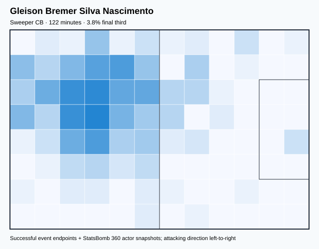

## Physical profile

| Metric | Score |
|---|---:|
| Aerial dominance | 1.000 |
| Pressing intensity per 90 | 7.36 |
| Recovery index per 90 | 5.15 |

## Top chemistry partners

- Daniel Alves da Silva — synergy 0.347, 122 shared minutes
- Éder Gabriel Militão — synergy 0.307, 100 shared minutes
- Ederson Santana de Moraes — synergy 0.299, 100 shared minutes

## Tactical recommendations

- Use a compact pressing trigger rather than sustained solo pressure.
- Target this player on direct restarts and back-post deliveries.
- Use recovery capacity to support higher attacking positions.

_The heatmap combines successful event endpoints with StatsBomb 360 actor
snapshots. StatsBomb 360 is freeze-frame context, not continuous player
tracking. Ratings include eligible outfield players from 45 minutes and
goalkeepers from 90 minutes; ranking status communicates sample reliability._

---

<!-- PLAYER_REPORT 17: 13620_starter_report.md -->

# Éder Gabriel Militão — Starter Report

- Team: Brazil (BRA)
- Position: Right Back
- Functional role: Two-Way Fullback
- VAEP offense per 90: 0.1390
- VAEP defense per 90: -0.0407
- VAEP total per 90: 0.0984
- VAEP per touch: 0.00054
- Spatial xT per 90: 0.0324
- Final-third spatial share: 21.4%
- Unified final player rating: 0.0546
- Team rank: #12

## Physical profile

| Metric | Score |
|---|---:|
| Aerial dominance | 0.400 |
| Pressing intensity per 90 | 13.86 |
| Recovery index per 90 | 4.95 |

## Top chemistry partners

- Marcos Aoás Corrêa — synergy 0.677, 309 shared minutes
- Thiago Emiliano da Silva — synergy 0.608, 263 shared minutes
- Alisson Ramsés Becker — synergy 0.547, 263 shared minutes

## Tactical recommendations

- Lead the first pressing trigger and protect the inside passing lane.
- Use recovery capacity to support higher attacking positions.

_The heatmap combines successful event endpoints with StatsBomb 360 actor
snapshots. StatsBomb 360 is freeze-frame context, not continuous player
tracking. Ratings include eligible outfield players from 45 minutes and
goalkeepers from 90 minutes; ranking status communicates sample reliability._

---

<!-- PLAYER_REPORT 18: 18395_starter_report.md -->

# Vinícius José Paixão de Oliveira Júnior — Starter Report

- Team: Brazil (BRA)
- Position: Left Midfield
- Functional role: Progressive Winger
- VAEP offense per 90: 0.4839
- VAEP defense per 90: 0.0460
- VAEP total per 90: 0.5299
- VAEP per touch: 0.00432
- Spatial xT per 90: 0.1238
- Final-third spatial share: 58.2%
- Unified final player rating: 0.1821
- Team rank: #9

## Physical profile

| Metric | Score |
|---|---:|
| Aerial dominance | 0.000 |
| Pressing intensity per 90 | 12.04 |
| Recovery index per 90 | 4.40 |

## Top chemistry partners

- Thiago Emiliano da Silva — synergy 0.625, 307 shared minutes
- Alisson Ramsés Becker — synergy 0.600, 307 shared minutes
- Marcos Aoás Corrêa — synergy 0.562, 307 shared minutes

## Tactical recommendations

- Lead the first pressing trigger and protect the inside passing lane.
- Avoid isolating this player in high-volume aerial matchups.
- Use recovery capacity to support higher attacking positions.

_The heatmap combines successful event endpoints with StatsBomb 360 actor
snapshots. StatsBomb 360 is freeze-frame context, not continuous player
tracking. Ratings include eligible outfield players from 45 minutes and
goalkeepers from 90 minutes; ranking status communicates sample reliability._

---

<!-- PLAYER_REPORT 19: 22600_starter_report.md -->

# Lucas Tolentino Coelho de Lima — Starter Report

- Team: Brazil (BRA)
- Position: Right Defensive Midfield
- Functional role: Holding Anchor
- VAEP offense per 90: 0.1390
- VAEP defense per 90: 0.0294
- VAEP total per 90: 0.1684
- VAEP per touch: 0.00105
- Spatial xT per 90: 0.0425
- Final-third spatial share: 32.0%
- Unified final player rating: 0.0513
- Team rank: #14

## Physical profile

| Metric | Score |
|---|---:|
| Aerial dominance | 0.500 |
| Pressing intensity per 90 | 17.79 |
| Recovery index per 90 | 2.54 |

## Top chemistry partners

- Marcos Aoás Corrêa — synergy 0.638, 319 shared minutes
- Thiago Emiliano da Silva — synergy 0.620, 319 shared minutes
- Alisson Ramsés Becker — synergy 0.611, 305 shared minutes

## Tactical recommendations

- Lead the first pressing trigger and protect the inside passing lane.
- Use recovery capacity to support higher attacking positions.

_The heatmap combines successful event endpoints with StatsBomb 360 actor
snapshots. StatsBomb 360 is freeze-frame context, not continuous player
tracking. Ratings include eligible outfield players from 45 minutes and
goalkeepers from 90 minutes; ranking status communicates sample reliability._

---

<!-- PLAYER_REPORT 20: 25104_starter_report.md -->

# Rodrygo Silva de Goes — Starter Report

- Team: Brazil (BRA)
- Position: Left Midfield
- Functional role: Progressive Winger
- VAEP offense per 90: 0.4647
- VAEP defense per 90: 0.1667
- VAEP total per 90: 0.6314
- VAEP per touch: 0.00377
- Spatial xT per 90: 0.0905
- Final-third spatial share: 49.6%
- Unified final player rating: 0.1776
- Team rank: #10

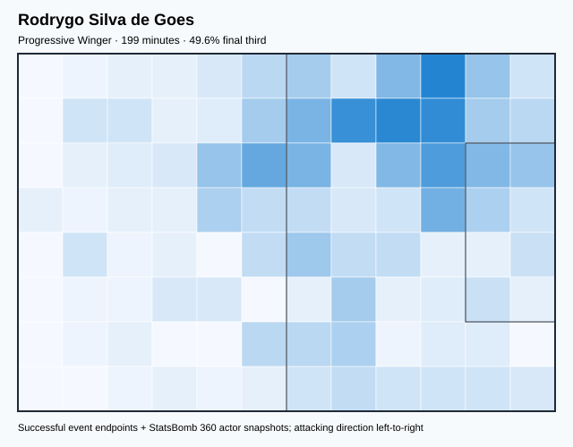

## Physical profile

| Metric | Score |
|---|---:|
| Aerial dominance | 0.600 |
| Pressing intensity per 90 | 18.51 |
| Recovery index per 90 | 4.06 |

## Top chemistry partners

- Marcos Aoás Corrêa — synergy 0.399, 145 shared minutes
- Thiago Emiliano da Silva — synergy 0.395, 145 shared minutes
- Carlos Henrique Casimiro — synergy 0.377, 145 shared minutes

## Tactical recommendations

- Lead the first pressing trigger and protect the inside passing lane.
- Target this player on direct restarts and back-post deliveries.
- Use recovery capacity to support higher attacking positions.

_The heatmap combines successful event endpoints with StatsBomb 360 actor
snapshots. StatsBomb 360 is freeze-frame context, not continuous player
tracking. Ratings include eligible outfield players from 45 minutes and
goalkeepers from 90 minutes; ranking status communicates sample reliability._

---

<!-- PLAYER_REPORT 21: 25142_starter_report.md -->

# Bruno Guimarães Rodriguez Moura — Starter Report

- Team: Brazil (BRA)
- Position: Right Defensive Midfield
- Functional role: Progressive Winger
- VAEP offense per 90: 0.3341
- VAEP defense per 90: 0.0043
- VAEP total per 90: 0.3384
- VAEP per touch: 0.00186
- Spatial xT per 90: 0.1364
- Final-third spatial share: 39.9%
- Unified final player rating: 0.0492
- Team rank: #17

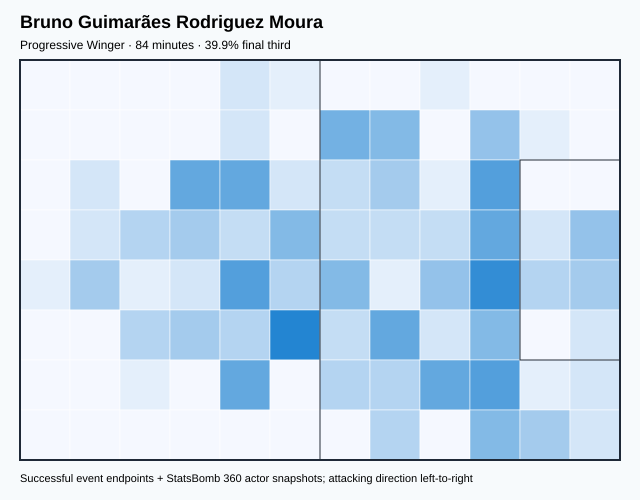

## Physical profile

| Metric | Score |
|---|---:|
| Aerial dominance | 0.000 |
| Pressing intensity per 90 | 10.72 |
| Recovery index per 90 | 7.51 |

## Top chemistry partners

- Marcos Aoás Corrêa — synergy 0.258, 84 shared minutes
- Éder Gabriel Militão — synergy 0.255, 84 shared minutes
- Fábio Henrique Tavares — synergy 0.147, 46 shared minutes

## Tactical recommendations

- Use a compact pressing trigger rather than sustained solo pressure.
- Avoid isolating this player in high-volume aerial matchups.
- Use recovery capacity to support higher attacking positions.

_The heatmap combines successful event endpoints with StatsBomb 360 actor
snapshots. StatsBomb 360 is freeze-frame context, not continuous player
tracking. Ratings include eligible outfield players from 45 minutes and
goalkeepers from 90 minutes; ranking status communicates sample reliability._

---

<!-- PLAYER_REPORT 22: 25154_starter_report.md -->

# Éverton Augusto de Barros Ribeiro — Starter Report

- Team: Brazil (BRA)
- Position: Center Attacking Midfield
- Functional role: Progressive Winger
- VAEP offense per 90: 0.5247
- VAEP defense per 90: 0.0111
- VAEP total per 90: 0.5358
- VAEP per touch: 0.00461
- Spatial xT per 90: 0.1431
- Final-third spatial share: 56.0%
- Unified final player rating: 0.1878
- Team rank: #8

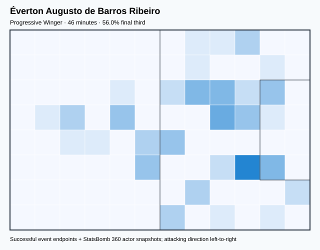

## Physical profile

| Metric | Score |
|---|---:|
| Aerial dominance | 0.000 |
| Pressing intensity per 90 | 9.85 |
| Recovery index per 90 | 1.97 |

## Top chemistry partners

- Marcos Aoás Corrêa — synergy 0.147, 46 shared minutes
- Daniel Alves da Silva — synergy 0.146, 46 shared minutes
- Éder Gabriel Militão — synergy 0.144, 46 shared minutes

## Tactical recommendations

- Use a compact pressing trigger rather than sustained solo pressure.
- Avoid isolating this player in high-volume aerial matchups.
- Pair with a faster recovery defender after aggressive rotations.

_The heatmap combines successful event endpoints with StatsBomb 360 actor
snapshots. StatsBomb 360 is freeze-frame context, not continuous player
tracking. Ratings include eligible outfield players from 45 minutes and
goalkeepers from 90 minutes; ranking status communicates sample reliability._

---

<!-- PLAYER_REPORT 23: 25305_starter_report.md -->

# Pedro Guilherme Abreu dos Santos — Starter Report

- Team: Brazil (BRA)
- Position: Center Forward
- Functional role: Target Forward
- VAEP offense per 90: 0.1715
- VAEP defense per 90: 0.0031
- VAEP total per 90: 0.1746
- VAEP per touch: 0.00197
- Spatial xT per 90: -0.0189
- Final-third spatial share: 43.6%
- Unified final player rating: 0.2170
- Team rank: #5

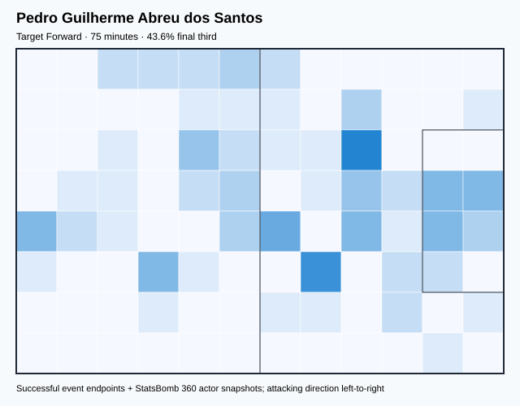

## Physical profile

| Metric | Score |
|---|---:|
| Aerial dominance | 0.000 |
| Pressing intensity per 90 | 14.34 |
| Recovery index per 90 | 1.20 |

## Top chemistry partners

- Marcos Aoás Corrêa — synergy 0.223, 75 shared minutes
- Éder Gabriel Militão — synergy 0.175, 58 shared minutes
- Antony Matheus dos Santos — synergy 0.166, 54 shared minutes

## Tactical recommendations

- Lead the first pressing trigger and protect the inside passing lane.
- Avoid isolating this player in high-volume aerial matchups.
- Pair with a faster recovery defender after aggressive rotations.

_The heatmap combines successful event endpoints with StatsBomb 360 actor
snapshots. StatsBomb 360 is freeze-frame context, not continuous player
tracking. Ratings include eligible outfield players from 45 minutes and
goalkeepers from 90 minutes; ranking status communicates sample reliability._

---

<!-- PLAYER_REPORT 24: 25363_starter_report.md -->

# Antony Matheus dos Santos — Starter Report

- Team: Brazil (BRA)
- Position: Right Wing
- Functional role: Progressive Winger
- VAEP offense per 90: 0.4081
- VAEP defense per 90: -0.0087
- VAEP total per 90: 0.3993
- VAEP per touch: 0.00214
- Spatial xT per 90: 0.1280
- Final-third spatial share: 55.6%
- Unified final player rating: 0.1910
- Team rank: #7

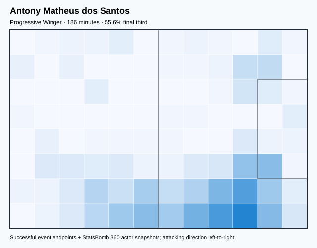

## Physical profile

| Metric | Score |
|---|---:|
| Aerial dominance | 0.250 |
| Pressing intensity per 90 | 13.51 |
| Recovery index per 90 | 5.31 |

## Top chemistry partners

- Éder Gabriel Militão — synergy 0.415, 151 shared minutes
- Marcos Aoás Corrêa — synergy 0.372, 132 shared minutes
- Rodrygo Silva de Goes — synergy 0.363, 154 shared minutes

## Tactical recommendations

- Lead the first pressing trigger and protect the inside passing lane.
- Use recovery capacity to support higher attacking positions.

_The heatmap combines successful event endpoints with StatsBomb 360 actor
snapshots. StatsBomb 360 is freeze-frame context, not continuous player
tracking. Ratings include eligible outfield players from 45 minutes and
goalkeepers from 90 minutes; ranking status communicates sample reliability._

---

<!-- PLAYER_REPORT 25: 29976_starter_report.md -->

# Gabriel Teodoro Martinelli Silva — Starter Report

- Team: Brazil (BRA)
- Position: Left Wing
- Functional role: Progressive Winger
- VAEP offense per 90: 0.7581
- VAEP defense per 90: 0.0634
- VAEP total per 90: 0.8215
- VAEP per touch: 0.00650
- Spatial xT per 90: 0.2035
- Final-third spatial share: 58.7%
- Unified final player rating: 0.2396
- Team rank: #4

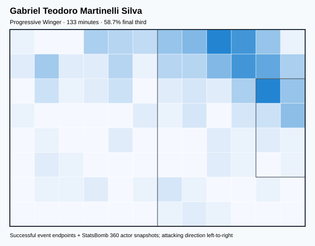

## Physical profile

| Metric | Score |
|---|---:|
| Aerial dominance | 0.000 |
| Pressing intensity per 90 | 10.19 |
| Recovery index per 90 | 3.40 |

## Top chemistry partners

- Fábio Henrique Tavares — synergy 0.296, 100 shared minutes
- Daniel Alves da Silva — synergy 0.292, 122 shared minutes
- Éder Gabriel Militão — synergy 0.280, 100 shared minutes

## Tactical recommendations

- Use a compact pressing trigger rather than sustained solo pressure.
- Avoid isolating this player in high-volume aerial matchups.
- Use recovery capacity to support higher attacking positions.

_The heatmap combines successful event endpoints with StatsBomb 360 actor
snapshots. StatsBomb 360 is freeze-frame context, not continuous player
tracking. Ratings include eligible outfield players from 45 minutes and
goalkeepers from 90 minutes; ranking status communicates sample reliability._
