# CAN — V4 Player Evaluation Collection

<!-- V5_CANONICAL_NOTICE -->
> **Historical V4 player-rating packet.** Player ratings, ranks, role-challenger decisions, and rating uncertainty below are superseded by `results/reports/player_rankings.csv`, `results/reports/player_profiles/`, and `results/reports/model_summary.md`. Possession, tactical, and match-bootstrap material remains a historical V4 result.

- Included eligible players: 16
- Rankings use the role-aware, development-gated VAEP/xT/xD model.
- Heatmaps combine successful on-ball endpoints and SB360 actor snapshots.

---

<!-- PLAYER_REPORT 1: 9922_starter_report.md -->

# David Junior Hoilett — Starter Report

- Team: Canada (CAN)
- Position: Right Midfield
- Functional role: Progressive Winger
- VAEP offense per 90: 0.1373
- VAEP defense per 90: 0.0302
- VAEP total per 90: 0.1674
- VAEP per touch: 0.00156
- Spatial xT per 90: 0.1430
- Final-third spatial share: 49.0%
- Unified final player rating: 0.1093
- Team rank: #5

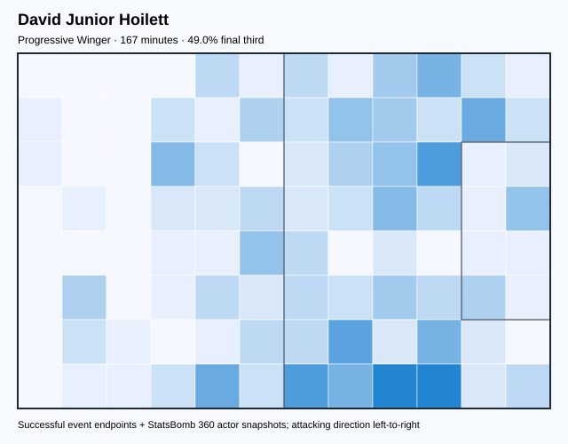

## Physical profile

| Metric | Score |
|---|---:|
| Aerial dominance | 0.000 |
| Pressing intensity per 90 | 12.37 |
| Recovery index per 90 | 6.45 |

## Top chemistry partners

- Steven de Sousa Vitoria — synergy 0.440, 167 shared minutes
- Alistair Johnston — synergy 0.419, 167 shared minutes
- Kamal Miller — synergy 0.392, 167 shared minutes

## Tactical recommendations

- Lead the first pressing trigger and protect the inside passing lane.
- Avoid isolating this player in high-volume aerial matchups.
- Use recovery capacity to support higher attacking positions.

_The heatmap combines successful event endpoints with StatsBomb 360 actor
snapshots. StatsBomb 360 is freeze-frame context, not continuous player
tracking. Ratings include eligible outfield players from 45 minutes and
goalkeepers from 90 minutes; ranking status communicates sample reliability._

---

<!-- PLAYER_REPORT 2: 11187_starter_report.md -->

# Stephen Antunes Eustáquio — Starter Report

- Team: Canada (CAN)
- Position: Left Defensive Midfield
- Functional role: Holding / Controlling Midfielder
- VAEP offense per 90: 0.0551
- VAEP defense per 90: -0.0255
- VAEP total per 90: 0.0296
- VAEP per touch: 0.00016
- Spatial xT per 90: 0.0999
- Final-third spatial share: 26.0%
- Unified final player rating: 0.0245
- Team rank: #10

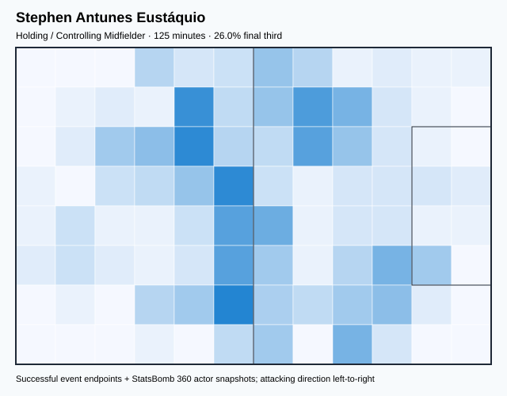

## Physical profile

| Metric | Score |
|---|---:|
| Aerial dominance | 0.500 |
| Pressing intensity per 90 | 17.23 |
| Recovery index per 90 | 3.59 |

## Top chemistry partners

- Steven de Sousa Vitoria — synergy 0.363, 125 shared minutes
- Kamal Miller — synergy 0.363, 125 shared minutes
- Alphonso Davies — synergy 0.341, 125 shared minutes

## Tactical recommendations

- Lead the first pressing trigger and protect the inside passing lane.
- Use recovery capacity to support higher attacking positions.

_The heatmap combines successful event endpoints with StatsBomb 360 actor
snapshots. StatsBomb 360 is freeze-frame context, not continuous player
tracking. Ratings include eligible outfield players from 45 minutes and
goalkeepers from 90 minutes; ranking status communicates sample reliability._

---

<!-- PLAYER_REPORT 3: 11846_starter_report.md -->

# Steven de Sousa Vitoria — Starter Report

- Team: Canada (CAN)
- Position: Center Back
- Functional role: Sweeper CB
- VAEP offense per 90: -0.0020
- VAEP defense per 90: -0.0946
- VAEP total per 90: -0.0965
- VAEP per touch: -0.00066
- Spatial xT per 90: 0.0115
- Final-third spatial share: 2.3%
- Unified final player rating: -0.0235
- Team rank: #14

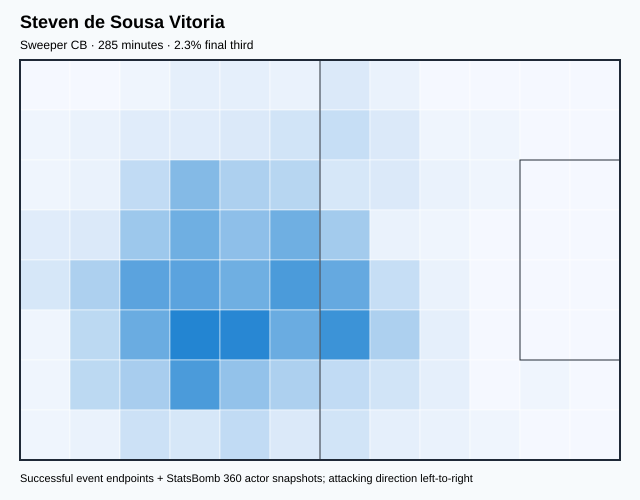

## Physical profile

| Metric | Score |
|---|---:|
| Aerial dominance | 0.800 |
| Pressing intensity per 90 | 8.21 |
| Recovery index per 90 | 3.47 |

## Top chemistry partners

- Kamal Miller — synergy 0.647, 285 shared minutes
- Milan Borjan — synergy 0.641, 285 shared minutes
- Alistair Johnston — synergy 0.628, 285 shared minutes

## Tactical recommendations

- Use a compact pressing trigger rather than sustained solo pressure.
- Target this player on direct restarts and back-post deliveries.
- Use recovery capacity to support higher attacking positions.

_The heatmap combines successful event endpoints with StatsBomb 360 actor
snapshots. StatsBomb 360 is freeze-frame context, not continuous player
tracking. Ratings include eligible outfield players from 45 minutes and
goalkeepers from 90 minutes; ranking status communicates sample reliability._

---

<!-- PLAYER_REPORT 4: 12365_starter_report.md -->

# Alphonso Davies — Starter Report

- Team: Canada (CAN)
- Position: Left Midfield
- Functional role: Box-to-Box / Engine Midfielder
- VAEP offense per 90: 0.3849
- VAEP defense per 90: 0.0334
- VAEP total per 90: 0.4183
- VAEP per touch: 0.00340
- Spatial xT per 90: 0.0686
- Final-third spatial share: 49.3%
- Unified final player rating: 0.1529
- Team rank: #3

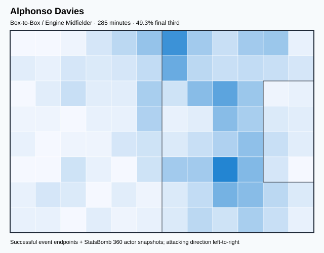

## Physical profile

| Metric | Score |
|---|---:|
| Aerial dominance | 0.556 |
| Pressing intensity per 90 | 16.74 |
| Recovery index per 90 | 5.68 |

## Top chemistry partners

- Kamal Miller — synergy 0.601, 285 shared minutes
- Steven de Sousa Vitoria — synergy 0.595, 285 shared minutes
- Tajon Buchanan — synergy 0.551, 270 shared minutes

## Tactical recommendations

- Lead the first pressing trigger and protect the inside passing lane.
- Use recovery capacity to support higher attacking positions.

_The heatmap combines successful event endpoints with StatsBomb 360 actor
snapshots. StatsBomb 360 is freeze-frame context, not continuous player
tracking. Ratings include eligible outfield players from 45 minutes and
goalkeepers from 90 minutes; ranking status communicates sample reliability._

---

<!-- PLAYER_REPORT 5: 12770_starter_report.md -->

# Jonathan Osorio — Starter Report

- Team: Canada (CAN)
- Position: Right Defensive Midfield
- Functional role: Ball-Winner
- VAEP offense per 90: 0.1299
- VAEP defense per 90: 0.0109
- VAEP total per 90: 0.1408
- VAEP per touch: 0.00107
- Spatial xT per 90: -0.0030
- Final-third spatial share: 25.5%
- Unified final player rating: 0.0326
- Team rank: #9

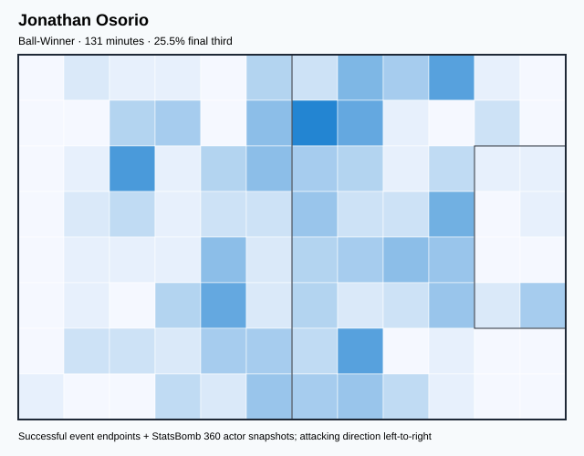

## Physical profile

| Metric | Score |
|---|---:|
| Aerial dominance | 0.000 |
| Pressing intensity per 90 | 21.33 |
| Recovery index per 90 | 3.44 |

## Top chemistry partners

- Alistair Johnston — synergy 0.373, 131 shared minutes
- Alphonso Davies — synergy 0.364, 131 shared minutes
- Kamal Miller — synergy 0.354, 131 shared minutes

## Tactical recommendations

- Lead the first pressing trigger and protect the inside passing lane.
- Avoid isolating this player in high-volume aerial matchups.
- Use recovery capacity to support higher attacking positions.

_The heatmap combines successful event endpoints with StatsBomb 360 actor
snapshots. StatsBomb 360 is freeze-frame context, not continuous player
tracking. Ratings include eligible outfield players from 45 minutes and
goalkeepers from 90 minutes; ranking status communicates sample reliability._

---

<!-- PLAYER_REPORT 6: 15958_starter_report.md -->

# Milan Borjan — Starter Report

- Team: Canada (CAN)
- Position: Goalkeeper
- Functional role: Goalkeeper
- VAEP offense per 90: -0.0126
- VAEP defense per 90: -0.0925
- VAEP total per 90: -0.1050
- VAEP per touch: -0.00171
- Spatial xT per 90: -0.0000
- Final-third spatial share: 0.6%
- Unified final player rating: -0.0580
- Team rank: #16

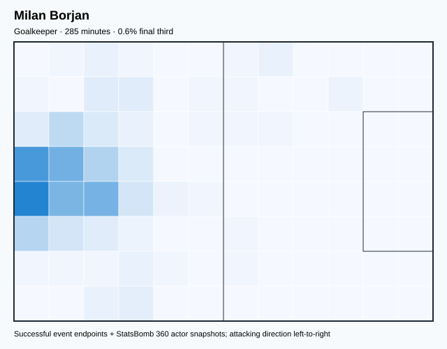

## Physical profile

| Metric | Score |
|---|---:|
| Aerial dominance | 0.000 |
| Pressing intensity per 90 | 0.00 |
| Recovery index per 90 | 6.00 |

## Top chemistry partners

- Kamal Miller — synergy 0.642, 285 shared minutes
- Steven de Sousa Vitoria — synergy 0.641, 285 shared minutes
- Alistair Johnston — synergy 0.631, 285 shared minutes

## Tactical recommendations

- Use a compact pressing trigger rather than sustained solo pressure.
- Avoid isolating this player in high-volume aerial matchups.
- Use recovery capacity to support higher attacking positions.

_The heatmap combines successful event endpoints with StatsBomb 360 actor
snapshots. StatsBomb 360 is freeze-frame context, not continuous player
tracking. Ratings include eligible outfield players from 45 minutes and
goalkeepers from 90 minutes; ranking status communicates sample reliability._

---

<!-- PLAYER_REPORT 7: 16120_starter_report.md -->

# Richie Laryea — Starter Report

- Team: Canada (CAN)
- Position: Right Wing Back
- Functional role: Attacking Wingback
- VAEP offense per 90: 0.2440
- VAEP defense per 90: -0.0129
- VAEP total per 90: 0.2311
- VAEP per touch: 0.00259
- Spatial xT per 90: 0.0924
- Final-third spatial share: 42.5%
- Unified final player rating: 0.0753
- Team rank: #7

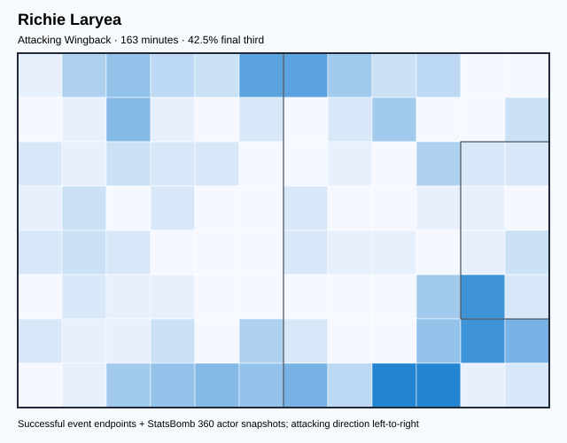

## Physical profile

| Metric | Score |
|---|---:|
| Aerial dominance | 0.000 |
| Pressing intensity per 90 | 15.42 |
| Recovery index per 90 | 5.51 |

## Top chemistry partners

- Alistair Johnston — synergy 0.420, 163 shared minutes
- Jonathan David — synergy 0.406, 163 shared minutes
- Kamal Miller — synergy 0.403, 163 shared minutes

## Tactical recommendations

- Lead the first pressing trigger and protect the inside passing lane.
- Avoid isolating this player in high-volume aerial matchups.
- Use recovery capacity to support higher attacking positions.

_The heatmap combines successful event endpoints with StatsBomb 360 actor
snapshots. StatsBomb 360 is freeze-frame context, not continuous player
tracking. Ratings include eligible outfield players from 45 minutes and
goalkeepers from 90 minutes; ranking status communicates sample reliability._

---

<!-- PLAYER_REPORT 8: 16252_starter_report.md -->

# Mark Anthony Kaye — Starter Report

- Team: Canada (CAN)
- Position: Left Defensive Midfield
- Functional role: Box-to-Box / Engine Midfielder
- VAEP offense per 90: 0.0319
- VAEP defense per 90: 0.0039
- VAEP total per 90: 0.0358
- VAEP per touch: 0.00015
- Spatial xT per 90: 0.0250
- Final-third spatial share: 14.0%
- Unified final player rating: 0.0218
- Team rank: #12

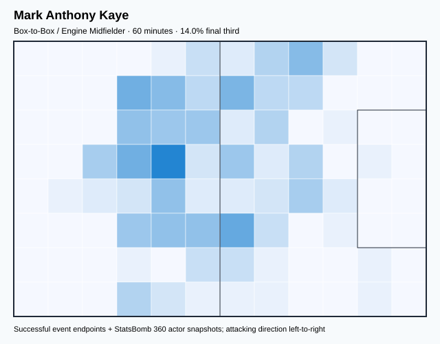

## Physical profile

| Metric | Score |
|---|---:|
| Aerial dominance | 0.000 |
| Pressing intensity per 90 | 22.56 |
| Recovery index per 90 | 6.02 |

## Top chemistry partners

- Kamal Miller — synergy 0.196, 60 shared minutes
- Steven de Sousa Vitoria — synergy 0.195, 60 shared minutes
- Sam Adekugbe — synergy 0.193, 60 shared minutes

## Tactical recommendations

- Lead the first pressing trigger and protect the inside passing lane.
- Avoid isolating this player in high-volume aerial matchups.
- Use recovery capacity to support higher attacking positions.

_The heatmap combines successful event endpoints with StatsBomb 360 actor
snapshots. StatsBomb 360 is freeze-frame context, not continuous player
tracking. Ratings include eligible outfield players from 45 minutes and
goalkeepers from 90 minutes; ranking status communicates sample reliability._

---

<!-- PLAYER_REPORT 9: 16459_starter_report.md -->

# Cyle Larin — Starter Report

- Team: Canada (CAN)
- Position: Center Forward
- Functional role: Target Forward / Penalty-Box Anchor
- VAEP offense per 90: 0.3726
- VAEP defense per 90: -0.0021
- VAEP total per 90: 0.3705
- VAEP per touch: 0.00455
- Spatial xT per 90: 0.0381
- Final-third spatial share: 49.2%
- Unified final player rating: 0.2284
- Team rank: #2

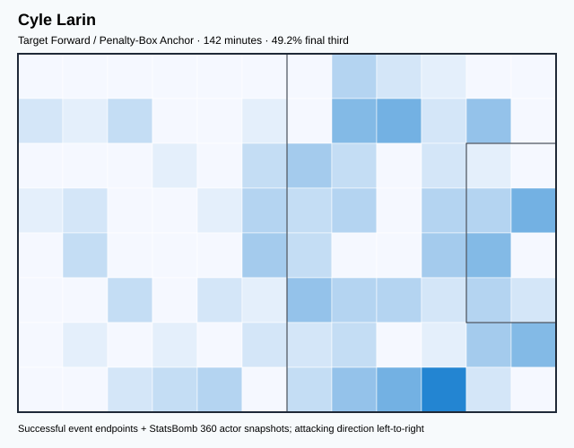

## Physical profile

| Metric | Score |
|---|---:|
| Aerial dominance | 0.600 |
| Pressing intensity per 90 | 13.27 |
| Recovery index per 90 | 2.53 |

## Top chemistry partners

- Alistair Johnston — synergy 0.354, 142 shared minutes
- Kamal Miller — synergy 0.292, 142 shared minutes
- Steven de Sousa Vitoria — synergy 0.278, 142 shared minutes

## Tactical recommendations

- Lead the first pressing trigger and protect the inside passing lane.
- Target this player on direct restarts and back-post deliveries.
- Pair with a faster recovery defender after aggressive rotations.

_The heatmap combines successful event endpoints with StatsBomb 360 actor
snapshots. StatsBomb 360 is freeze-frame context, not continuous player
tracking. Ratings include eligible outfield players from 45 minutes and
goalkeepers from 90 minutes; ranking status communicates sample reliability._

---

<!-- PLAYER_REPORT 10: 23640_starter_report.md -->

# Jonathan David — Starter Report

- Team: Canada (CAN)
- Position: Center Forward
- Functional role: Target Forward
- VAEP offense per 90: 0.9377
- VAEP defense per 90: 0.0442
- VAEP total per 90: 0.9819
- VAEP per touch: 0.00969
- Spatial xT per 90: 0.0098
- Final-third spatial share: 39.9%
- Unified final player rating: 0.3186
- Team rank: #1

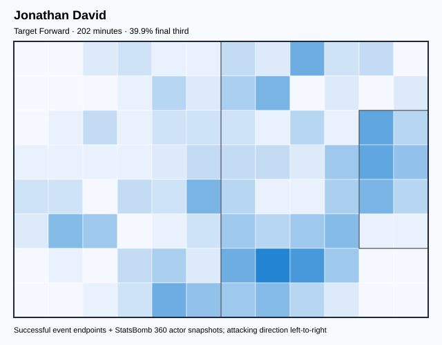

## Physical profile

| Metric | Score |
|---|---:|
| Aerial dominance | 0.600 |
| Pressing intensity per 90 | 12.50 |
| Recovery index per 90 | 4.02 |

## Top chemistry partners

- Steven de Sousa Vitoria — synergy 0.498, 202 shared minutes
- Kamal Miller — synergy 0.496, 202 shared minutes
- Alistair Johnston — synergy 0.487, 202 shared minutes

## Tactical recommendations

- Lead the first pressing trigger and protect the inside passing lane.
- Target this player on direct restarts and back-post deliveries.
- Use recovery capacity to support higher attacking positions.

_The heatmap combines successful event endpoints with StatsBomb 360 actor
snapshots. StatsBomb 360 is freeze-frame context, not continuous player
tracking. Ratings include eligible outfield players from 45 minutes and
goalkeepers from 90 minutes; ranking status communicates sample reliability._

---

<!-- PLAYER_REPORT 11: 23828_starter_report.md -->

# Kamal Miller — Starter Report

- Team: Canada (CAN)
- Position: Left Center Back
- Functional role: Ball-Playing Centre-Back
- VAEP offense per 90: -0.0003
- VAEP defense per 90: -0.1306
- VAEP total per 90: -0.1309
- VAEP per touch: -0.00077
- Spatial xT per 90: 0.0311
- Final-third spatial share: 5.0%
- Unified final player rating: -0.0286
- Team rank: #15

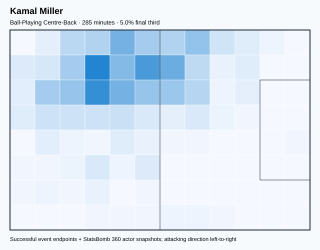

## Physical profile

| Metric | Score |
|---|---:|
| Aerial dominance | 0.538 |
| Pressing intensity per 90 | 7.26 |
| Recovery index per 90 | 3.16 |

## Top chemistry partners

- Steven de Sousa Vitoria — synergy 0.647, 285 shared minutes
- Milan Borjan — synergy 0.642, 285 shared minutes
- Alphonso Davies — synergy 0.601, 285 shared minutes

## Tactical recommendations

- Use a compact pressing trigger rather than sustained solo pressure.
- Use recovery capacity to support higher attacking positions.

_The heatmap combines successful event endpoints with StatsBomb 360 actor
snapshots. StatsBomb 360 is freeze-frame context, not continuous player
tracking. Ratings include eligible outfield players from 45 minutes and
goalkeepers from 90 minutes; ranking status communicates sample reliability._

---

<!-- PLAYER_REPORT 12: 24024_starter_report.md -->

# Tajon Buchanan — Starter Report

- Team: Canada (CAN)
- Position: Right Midfield
- Functional role: Progressive Winger
- VAEP offense per 90: 0.3269
- VAEP defense per 90: -0.0279
- VAEP total per 90: 0.2990
- VAEP per touch: 0.00243
- Spatial xT per 90: 0.0966
- Final-third spatial share: 50.7%
- Unified final player rating: 0.1311
- Team rank: #4

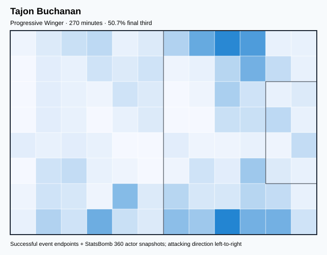

## Physical profile

| Metric | Score |
|---|---:|
| Aerial dominance | 0.250 |
| Pressing intensity per 90 | 15.66 |
| Recovery index per 90 | 4.00 |

## Top chemistry partners

- Kamal Miller — synergy 0.594, 270 shared minutes
- Steven de Sousa Vitoria — synergy 0.566, 270 shared minutes
- Alphonso Davies — synergy 0.551, 270 shared minutes

## Tactical recommendations

- Lead the first pressing trigger and protect the inside passing lane.
- Use recovery capacity to support higher attacking positions.

_The heatmap combines successful event endpoints with StatsBomb 360 actor
snapshots. StatsBomb 360 is freeze-frame context, not continuous player
tracking. Ratings include eligible outfield players from 45 minutes and
goalkeepers from 90 minutes; ranking status communicates sample reliability._

---

<!-- PLAYER_REPORT 13: 29758_starter_report.md -->

# Sam Adekugbe — Starter Report

- Team: Canada (CAN)
- Position: Left Back
- Functional role: Attacking Wingback
- VAEP offense per 90: 0.1103
- VAEP defense per 90: -0.0142
- VAEP total per 90: 0.0960
- VAEP per touch: 0.00059
- Spatial xT per 90: 0.0862
- Final-third spatial share: 25.4%
- Unified final player rating: 0.0559
- Team rank: #8

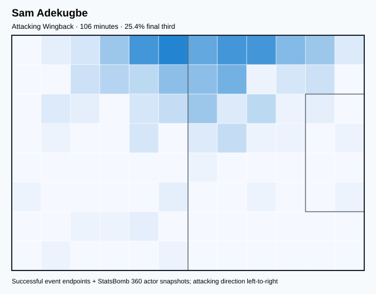

## Physical profile

| Metric | Score |
|---|---:|
| Aerial dominance | 1.000 |
| Pressing intensity per 90 | 14.49 |
| Recovery index per 90 | 4.26 |

## Top chemistry partners

- Kamal Miller — synergy 0.319, 106 shared minutes
- Milan Borjan — synergy 0.303, 106 shared minutes
- Jonathan Osorio — synergy 0.298, 98 shared minutes

## Tactical recommendations

- Lead the first pressing trigger and protect the inside passing lane.
- Target this player on direct restarts and back-post deliveries.
- Use recovery capacity to support higher attacking positions.

_The heatmap combines successful event endpoints with StatsBomb 360 actor
snapshots. StatsBomb 360 is freeze-frame context, not continuous player
tracking. Ratings include eligible outfield players from 45 minutes and
goalkeepers from 90 minutes; ranking status communicates sample reliability._

---

<!-- PLAYER_REPORT 14: 31684_starter_report.md -->

# Atiba Hutchinson — Starter Report

- Team: Canada (CAN)
- Position: Right Defensive Midfield
- Functional role: Holding Anchor
- VAEP offense per 90: 0.0492
- VAEP defense per 90: -0.0178
- VAEP total per 90: 0.0314
- VAEP per touch: 0.00019
- Spatial xT per 90: 0.0344
- Final-third spatial share: 19.7%
- Unified final player rating: 0.0219
- Team rank: #11

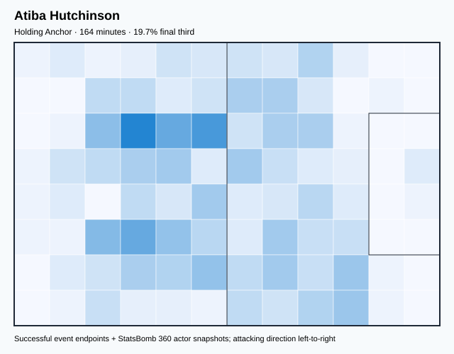

## Physical profile

| Metric | Score |
|---|---:|
| Aerial dominance | 0.750 |
| Pressing intensity per 90 | 10.96 |
| Recovery index per 90 | 2.74 |

## Top chemistry partners

- Milan Borjan — synergy 0.438, 164 shared minutes
- Kamal Miller — synergy 0.436, 164 shared minutes
- Steven de Sousa Vitoria — synergy 0.430, 164 shared minutes

## Tactical recommendations

- Lead the first pressing trigger and protect the inside passing lane.
- Target this player on direct restarts and back-post deliveries.
- Use recovery capacity to support higher attacking positions.

_The heatmap combines successful event endpoints with StatsBomb 360 actor
snapshots. StatsBomb 360 is freeze-frame context, not continuous player
tracking. Ratings include eligible outfield players from 45 minutes and
goalkeepers from 90 minutes; ranking status communicates sample reliability._

---

<!-- PLAYER_REPORT 15: 44703_starter_report.md -->

# Alistair Johnston — Starter Report

- Team: Canada (CAN)
- Position: Right Back
- Functional role: Attacking Wingback
- VAEP offense per 90: 0.2344
- VAEP defense per 90: -0.0182
- VAEP total per 90: 0.2162
- VAEP per touch: 0.00154
- Spatial xT per 90: 0.0671
- Final-third spatial share: 25.8%
- Unified final player rating: 0.0802
- Team rank: #6

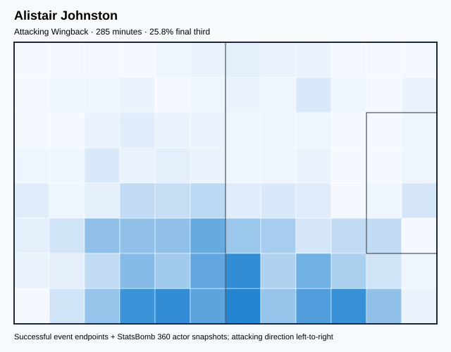

## Physical profile

| Metric | Score |
|---|---:|
| Aerial dominance | 0.727 |
| Pressing intensity per 90 | 12.63 |
| Recovery index per 90 | 4.42 |

## Top chemistry partners

- Milan Borjan — synergy 0.631, 285 shared minutes
- Steven de Sousa Vitoria — synergy 0.628, 285 shared minutes
- Kamal Miller — synergy 0.566, 285 shared minutes

## Tactical recommendations

- Lead the first pressing trigger and protect the inside passing lane.
- Target this player on direct restarts and back-post deliveries.
- Use recovery capacity to support higher attacking positions.

_The heatmap combines successful event endpoints with StatsBomb 360 actor
snapshots. StatsBomb 360 is freeze-frame context, not continuous player
tracking. Ratings include eligible outfield players from 45 minutes and
goalkeepers from 90 minutes; ranking status communicates sample reliability._

---

<!-- PLAYER_REPORT 16: 133229_starter_report.md -->

# Ismael Koné — Starter Report

- Team: Canada (CAN)
- Position: Right Defensive Midfield
- Functional role: Holding Anchor
- VAEP offense per 90: 0.0261
- VAEP defense per 90: 0.0023
- VAEP total per 90: 0.0284
- VAEP per touch: 0.00013
- Spatial xT per 90: 0.0252
- Final-third spatial share: 19.1%
- Unified final player rating: 0.0212
- Team rank: #13

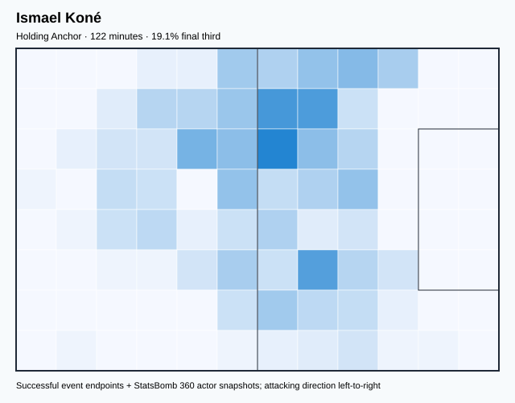

## Physical profile

| Metric | Score |
|---|---:|
| Aerial dominance | 0.000 |
| Pressing intensity per 90 | 13.27 |
| Recovery index per 90 | 5.16 |

## Top chemistry partners

- Alistair Johnston — synergy 0.355, 122 shared minutes
- Alphonso Davies — synergy 0.353, 122 shared minutes
- Milan Borjan — synergy 0.351, 122 shared minutes

## Tactical recommendations

- Lead the first pressing trigger and protect the inside passing lane.
- Avoid isolating this player in high-volume aerial matchups.
- Use recovery capacity to support higher attacking positions.

_The heatmap combines successful event endpoints with StatsBomb 360 actor
snapshots. StatsBomb 360 is freeze-frame context, not continuous player
tracking. Ratings include eligible outfield players from 45 minutes and
goalkeepers from 90 minutes; ranking status communicates sample reliability._
