# CMR — V4 Player Evaluation Collection

<!-- V5_CANONICAL_NOTICE -->
> **Historical V4 player-rating packet.** Player ratings, ranks, role-challenger decisions, and rating uncertainty below are superseded by `results/reports/player_rankings.csv`, `results/reports/player_profiles/`, and `results/reports/model_summary.md`. Possession, tactical, and match-bootstrap material remains a historical V4 result.

- Included eligible players: 18
- Rankings use the role-aware, development-gated VAEP/xT/xD model.
- Heatmaps combine successful on-ball endpoints and SB360 actor snapshots.

---

<!-- PLAYER_REPORT 1: 3141_starter_report.md -->

# André-Frank Zambo Anguissa — Starter Report

- Team: Cameroon (CMR)
- Position: Left Defensive Midfield
- Functional role: Box-to-Box / Engine Midfielder
- VAEP offense per 90: 0.1111
- VAEP defense per 90: -0.0110
- VAEP total per 90: 0.1001
- VAEP per touch: 0.00082
- Spatial xT per 90: 0.0189
- Final-third spatial share: 27.0%
- Unified final player rating: 0.0340
- Team rank: #9

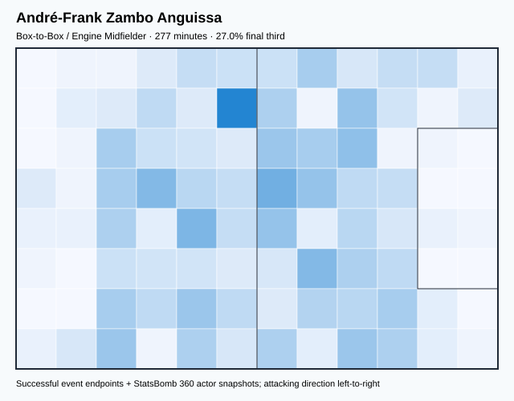

## Physical profile

| Metric | Score |
|---|---:|
| Aerial dominance | 0.571 |
| Pressing intensity per 90 | 20.50 |
| Recovery index per 90 | 3.25 |

## Top chemistry partners

- Nouhou Tolo — synergy 0.627, 277 shared minutes
- Ngoran Suiru Fai Collins — synergy 0.610, 277 shared minutes
- Bryan Mbeumo — synergy 0.552, 224 shared minutes

## Tactical recommendations

- Lead the first pressing trigger and protect the inside passing lane.
- Target this player on direct restarts and back-post deliveries.
- Use recovery capacity to support higher attacking positions.

_The heatmap combines successful event endpoints with StatsBomb 360 actor
snapshots. StatsBomb 360 is freeze-frame context, not continuous player
tracking. Ratings include eligible outfield players from 45 minutes and
goalkeepers from 90 minutes; ranking status communicates sample reliability._

---

<!-- PLAYER_REPORT 2: 3499_starter_report.md -->

# Jean-Eric Maxim Choupo-Moting — Starter Report

- Team: Cameroon (CMR)
- Position: Left Center Forward
- Functional role: Target Forward
- VAEP offense per 90: 0.1713
- VAEP defense per 90: 0.0032
- VAEP total per 90: 0.1745
- VAEP per touch: 0.00229
- Spatial xT per 90: 0.0466
- Final-third spatial share: 39.9%
- Unified final player rating: 0.1860
- Team rank: #2

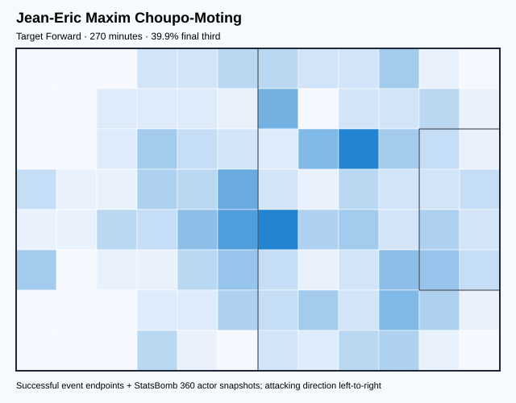

## Physical profile

| Metric | Score |
|---|---:|
| Aerial dominance | 0.565 |
| Pressing intensity per 90 | 11.00 |
| Recovery index per 90 | 2.67 |

## Top chemistry partners

- Nouhou Tolo — synergy 0.536, 270 shared minutes
- André-Frank Zambo Anguissa — synergy 0.511, 254 shared minutes
- Ngoran Suiru Fai Collins — synergy 0.456, 270 shared minutes

## Tactical recommendations

- Lead the first pressing trigger and protect the inside passing lane.
- Use recovery capacity to support higher attacking positions.

_The heatmap combines successful event endpoints with StatsBomb 360 actor
snapshots. StatsBomb 360 is freeze-frame context, not continuous player
tracking. Ratings include eligible outfield players from 45 minutes and
goalkeepers from 90 minutes; ranking status communicates sample reliability._

---

<!-- PLAYER_REPORT 3: 3551_starter_report.md -->

# Karl Brillant Toko Ekambi — Starter Report

- Team: Cameroon (CMR)
- Position: Left Wing
- Functional role: Ball-Winner
- VAEP offense per 90: 0.2075
- VAEP defense per 90: 0.1097
- VAEP total per 90: 0.3172
- VAEP per touch: 0.00359
- Spatial xT per 90: 0.0394
- Final-third spatial share: 36.2%
- Unified final player rating: 0.1740
- Team rank: #3

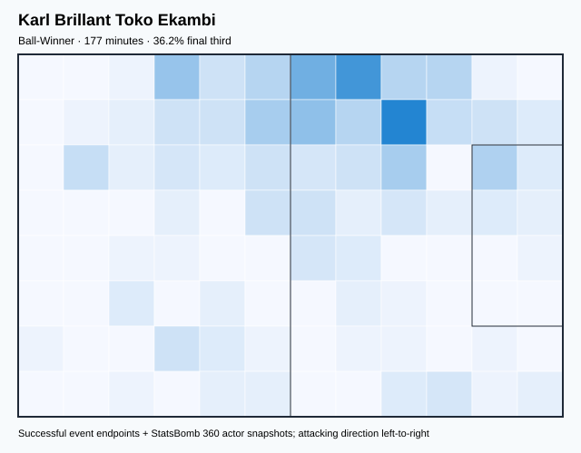

## Physical profile

| Metric | Score |
|---|---:|
| Aerial dominance | 0.125 |
| Pressing intensity per 90 | 11.67 |
| Recovery index per 90 | 6.09 |

## Top chemistry partners

- André-Frank Zambo Anguissa — synergy 0.445, 177 shared minutes
- Ngoran Suiru Fai Collins — synergy 0.426, 177 shared minutes
- Nouhou Tolo — synergy 0.364, 177 shared minutes

## Tactical recommendations

- Lead the first pressing trigger and protect the inside passing lane.
- Avoid isolating this player in high-volume aerial matchups.
- Use recovery capacity to support higher attacking positions.

_The heatmap combines successful event endpoints with StatsBomb 360 actor
snapshots. StatsBomb 360 is freeze-frame context, not continuous player
tracking. Ratings include eligible outfield players from 45 minutes and
goalkeepers from 90 minutes; ranking status communicates sample reliability._

---

<!-- PLAYER_REPORT 4: 4935_starter_report.md -->

# Bryan Mbeumo — Starter Report

- Team: Cameroon (CMR)
- Position: Right Wing
- Functional role: Progressive Winger
- VAEP offense per 90: 0.1793
- VAEP defense per 90: -0.0253
- VAEP total per 90: 0.1541
- VAEP per touch: 0.00150
- Spatial xT per 90: 0.0509
- Final-third spatial share: 47.6%
- Unified final player rating: 0.1470
- Team rank: #4

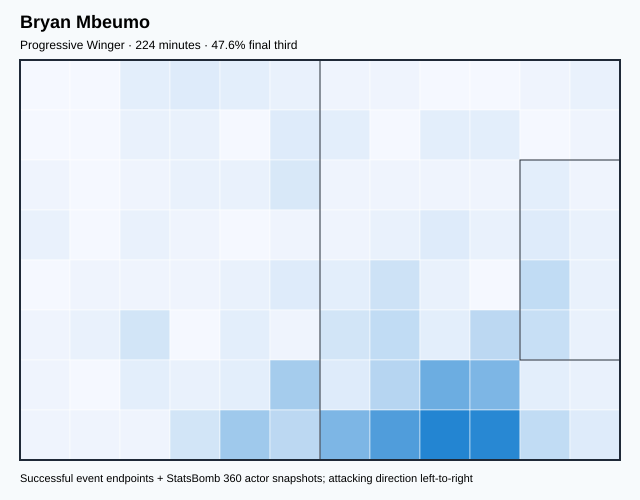

## Physical profile

| Metric | Score |
|---|---:|
| Aerial dominance | 0.235 |
| Pressing intensity per 90 | 11.64 |
| Recovery index per 90 | 3.61 |

## Top chemistry partners

- André-Frank Zambo Anguissa — synergy 0.552, 224 shared minutes
- Ngoran Suiru Fai Collins — synergy 0.514, 224 shared minutes
- Nouhou Tolo — synergy 0.475, 224 shared minutes

## Tactical recommendations

- Lead the first pressing trigger and protect the inside passing lane.
- Use recovery capacity to support higher attacking positions.

_The heatmap combines successful event endpoints with StatsBomb 360 actor
snapshots. StatsBomb 360 is freeze-frame context, not continuous player
tracking. Ratings include eligible outfield players from 45 minutes and
goalkeepers from 90 minutes; ranking status communicates sample reliability._

---

<!-- PLAYER_REPORT 5: 7426_starter_report.md -->

# Jean-Charles Castelletto — Starter Report

- Team: Cameroon (CMR)
- Position: Right Center Back
- Functional role: Sweeper CB
- VAEP offense per 90: 0.0350
- VAEP defense per 90: -0.1077
- VAEP total per 90: -0.0726
- VAEP per touch: -0.00075
- Spatial xT per 90: 0.0021
- Final-third spatial share: 7.3%
- Unified final player rating: -0.0172
- Team rank: #14

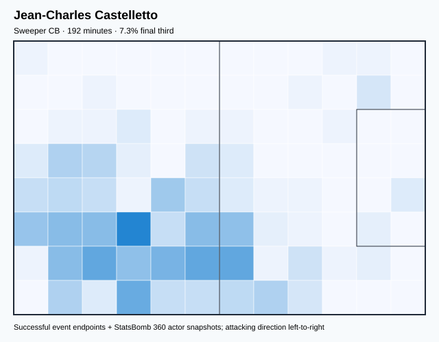

## Physical profile

| Metric | Score |
|---|---:|
| Aerial dominance | 1.000 |
| Pressing intensity per 90 | 12.16 |
| Recovery index per 90 | 3.74 |

## Top chemistry partners

- Ngoran Suiru Fai Collins — synergy 0.499, 192 shared minutes
- Nicolas Alexis Julio N'Koulou Ndoubena — synergy 0.496, 192 shared minutes
- André-Frank Zambo Anguissa — synergy 0.459, 177 shared minutes

## Tactical recommendations

- Lead the first pressing trigger and protect the inside passing lane.
- Target this player on direct restarts and back-post deliveries.
- Use recovery capacity to support higher attacking positions.

_The heatmap combines successful event endpoints with StatsBomb 360 actor
snapshots. StatsBomb 360 is freeze-frame context, not continuous player
tracking. Ratings include eligible outfield players from 45 minutes and
goalkeepers from 90 minutes; ranking status communicates sample reliability._

---

<!-- PLAYER_REPORT 6: 7472_starter_report.md -->

# Nicolas Alexis Julio N'Koulou Ndoubena — Starter Report

- Team: Cameroon (CMR)
- Position: Left Center Back
- Functional role: Sweeper CB
- VAEP offense per 90: 0.0998
- VAEP defense per 90: -0.1195
- VAEP total per 90: -0.0197
- VAEP per touch: -0.00017
- Spatial xT per 90: 0.0066
- Final-third spatial share: 4.2%
- Unified final player rating: -0.0090
- Team rank: #13

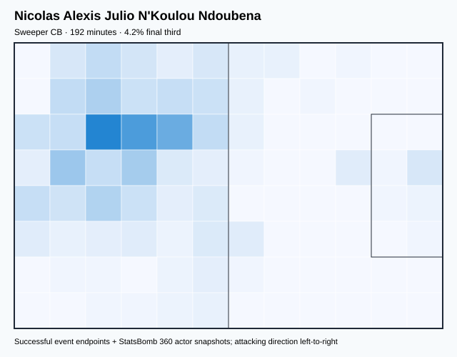

## Physical profile

| Metric | Score |
|---|---:|
| Aerial dominance | 0.500 |
| Pressing intensity per 90 | 9.35 |
| Recovery index per 90 | 5.14 |

## Top chemistry partners

- Nouhou Tolo — synergy 0.502, 192 shared minutes
- Jean-Charles Castelletto — synergy 0.496, 192 shared minutes
- Ngoran Suiru Fai Collins — synergy 0.473, 192 shared minutes

## Tactical recommendations

- Use a compact pressing trigger rather than sustained solo pressure.
- Use recovery capacity to support higher attacking positions.

_The heatmap combines successful event endpoints with StatsBomb 360 actor
snapshots. StatsBomb 360 is freeze-frame context, not continuous player
tracking. Ratings include eligible outfield players from 45 minutes and
goalkeepers from 90 minutes; ranking status communicates sample reliability._

---

<!-- PLAYER_REPORT 7: 7551_starter_report.md -->

# Enzo Ebosse — Starter Report

- Team: Cameroon (CMR)
- Position: Left Center Back
- Functional role: Sweeper CB
- VAEP offense per 90: -0.0005
- VAEP defense per 90: -0.1980
- VAEP total per 90: -0.1985
- VAEP per touch: -0.00235
- Spatial xT per 90: 0.0005
- Final-third spatial share: 2.5%
- Unified final player rating: -0.0256
- Team rank: #16

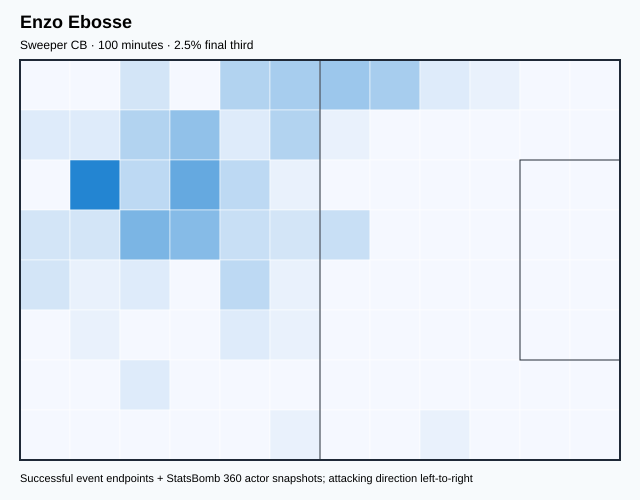

## Physical profile

| Metric | Score |
|---|---:|
| Aerial dominance | 1.000 |
| Pressing intensity per 90 | 14.39 |
| Recovery index per 90 | 0.90 |

## Top chemistry partners

- Christopher Wooh — synergy 0.301, 100 shared minutes
- Devis Rogers Epassy Mboka — synergy 0.301, 100 shared minutes
- André-Frank Zambo Anguissa — synergy 0.299, 100 shared minutes

## Tactical recommendations

- Lead the first pressing trigger and protect the inside passing lane.
- Target this player on direct restarts and back-post deliveries.
- Pair with a faster recovery defender after aggressive rotations.

_The heatmap combines successful event endpoints with StatsBomb 360 actor
snapshots. StatsBomb 360 is freeze-frame context, not continuous player
tracking. Ratings include eligible outfield players from 45 minutes and
goalkeepers from 90 minutes; ranking status communicates sample reliability._

---

<!-- PLAYER_REPORT 8: 8064_starter_report.md -->

# André Onana — Starter Report

- Team: Cameroon (CMR)
- Position: Goalkeeper
- Functional role: Goalkeeper
- VAEP offense per 90: -0.0236
- VAEP defense per 90: -0.0417
- VAEP total per 90: -0.0653
- VAEP per touch: -0.00051
- Spatial xT per 90: 0.0015
- Final-third spatial share: 0.5%
- Unified final player rating: -0.0562
- Team rank: #17

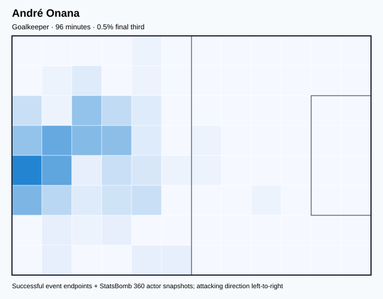

## Physical profile

| Metric | Score |
|---|---:|
| Aerial dominance | 0.000 |
| Pressing intensity per 90 | 0.00 |
| Recovery index per 90 | 2.81 |

## Top chemistry partners

- Nicolas Alexis Julio N'Koulou Ndoubena — synergy 0.296, 96 shared minutes
- Jean-Charles Castelletto — synergy 0.291, 96 shared minutes
- Samuel Yves Oum Gwet — synergy 0.286, 96 shared minutes

## Tactical recommendations

- Use a compact pressing trigger rather than sustained solo pressure.
- Avoid isolating this player in high-volume aerial matchups.
- Use recovery capacity to support higher attacking positions.

_The heatmap combines successful event endpoints with StatsBomb 360 actor
snapshots. StatsBomb 360 is freeze-frame context, not continuous player
tracking. Ratings include eligible outfield players from 45 minutes and
goalkeepers from 90 minutes; ranking status communicates sample reliability._

---

<!-- PLAYER_REPORT 9: 8591_starter_report.md -->

# Samuel Yves Oum Gwet — Starter Report

- Team: Cameroon (CMR)
- Position: Center Defensive Midfield
- Functional role: Holding Anchor
- VAEP offense per 90: 0.0014
- VAEP defense per 90: -0.0112
- VAEP total per 90: -0.0099
- VAEP per touch: -0.00009
- Spatial xT per 90: 0.0318
- Final-third spatial share: 13.7%
- Unified final player rating: 0.0176
- Team rank: #11

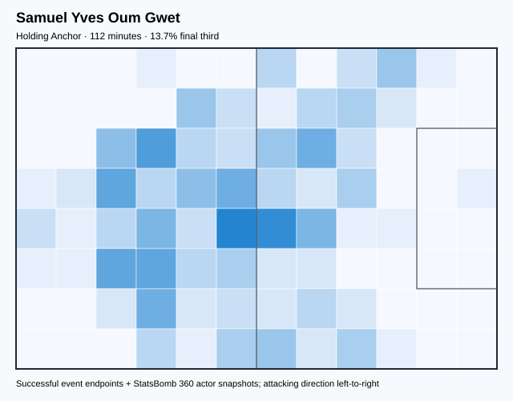

## Physical profile

| Metric | Score |
|---|---:|
| Aerial dominance | 0.333 |
| Pressing intensity per 90 | 9.63 |
| Recovery index per 90 | 8.03 |

## Top chemistry partners

- Jean-Charles Castelletto — synergy 0.327, 112 shared minutes
- Nicolas Alexis Julio N'Koulou Ndoubena — synergy 0.327, 112 shared minutes
- Ngoran Suiru Fai Collins — synergy 0.323, 112 shared minutes

## Tactical recommendations

- Use a compact pressing trigger rather than sustained solo pressure.
- Use recovery capacity to support higher attacking positions.

_The heatmap combines successful event endpoints with StatsBomb 360 actor
snapshots. StatsBomb 360 is freeze-frame context, not continuous player
tracking. Ratings include eligible outfield players from 45 minutes and
goalkeepers from 90 minutes; ranking status communicates sample reliability._

---

<!-- PLAYER_REPORT 10: 11174_starter_report.md -->

# Vincent Paté Aboubakar — Starter Report

- Team: Cameroon (CMR)
- Position: Right Center Forward
- Functional role: Target Forward
- VAEP offense per 90: 0.3752
- VAEP defense per 90: -0.0123
- VAEP total per 90: 0.3629
- VAEP per touch: 0.00450
- Spatial xT per 90: 0.0138
- Final-third spatial share: 48.7%
- Unified final player rating: 0.2249
- Team rank: #1

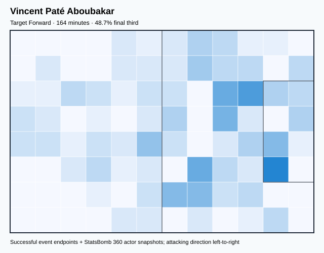

## Physical profile

| Metric | Score |
|---|---:|
| Aerial dominance | 0.286 |
| Pressing intensity per 90 | 5.48 |
| Recovery index per 90 | 3.29 |

## Top chemistry partners

- Ngoran Suiru Fai Collins — synergy 0.354, 164 shared minutes
- André-Frank Zambo Anguissa — synergy 0.339, 148 shared minutes
- Nouhou Tolo — synergy 0.317, 164 shared minutes

## Tactical recommendations

- Use a compact pressing trigger rather than sustained solo pressure.
- Use recovery capacity to support higher attacking positions.

_The heatmap combines successful event endpoints with StatsBomb 360 actor
snapshots. StatsBomb 360 is freeze-frame context, not continuous player
tracking. Ratings include eligible outfield players from 45 minutes and
goalkeepers from 90 minutes; ranking status communicates sample reliability._

---

<!-- PLAYER_REPORT 11: 12623_starter_report.md -->

# Pierre Kunde Malong — Starter Report

- Team: Cameroon (CMR)
- Position: Right Defensive Midfield
- Functional role: Box-to-Box / Engine Midfielder
- VAEP offense per 90: 0.0613
- VAEP defense per 90: -0.0325
- VAEP total per 90: 0.0288
- VAEP per touch: 0.00031
- Spatial xT per 90: 0.0709
- Final-third spatial share: 20.6%
- Unified final player rating: 0.0233
- Team rank: #10

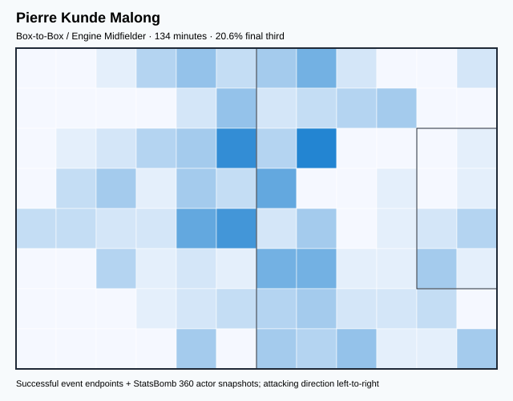

## Physical profile

| Metric | Score |
|---|---:|
| Aerial dominance | 0.500 |
| Pressing intensity per 90 | 16.07 |
| Recovery index per 90 | 4.69 |

## Top chemistry partners

- Jean-Eric Maxim Choupo-Moting — synergy 0.369, 134 shared minutes
- Nouhou Tolo — synergy 0.367, 134 shared minutes
- Ngoran Suiru Fai Collins — synergy 0.344, 134 shared minutes

## Tactical recommendations

- Lead the first pressing trigger and protect the inside passing lane.
- Use recovery capacity to support higher attacking positions.

_The heatmap combines successful event endpoints with StatsBomb 360 actor
snapshots. StatsBomb 360 is freeze-frame context, not continuous player
tracking. Ratings include eligible outfield players from 45 minutes and
goalkeepers from 90 minutes; ranking status communicates sample reliability._

---

<!-- PLAYER_REPORT 12: 13454_starter_report.md -->

# Nouhou Tolo — Starter Report

- Team: Cameroon (CMR)
- Position: Left Back
- Functional role: Wide Creator
- VAEP offense per 90: 0.0526
- VAEP defense per 90: -0.0302
- VAEP total per 90: 0.0224
- VAEP per touch: 0.00030
- Spatial xT per 90: 0.0082
- Final-third spatial share: 23.5%
- Unified final player rating: 0.0376
- Team rank: #7

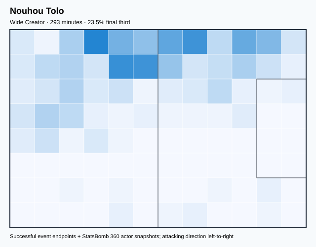

## Physical profile

| Metric | Score |
|---|---:|
| Aerial dominance | 0.600 |
| Pressing intensity per 90 | 14.46 |
| Recovery index per 90 | 1.54 |

## Top chemistry partners

- André-Frank Zambo Anguissa — synergy 0.627, 277 shared minutes
- Ngoran Suiru Fai Collins — synergy 0.598, 293 shared minutes
- Jean-Eric Maxim Choupo-Moting — synergy 0.536, 270 shared minutes

## Tactical recommendations

- Lead the first pressing trigger and protect the inside passing lane.
- Target this player on direct restarts and back-post deliveries.
- Pair with a faster recovery defender after aggressive rotations.

_The heatmap combines successful event endpoints with StatsBomb 360 actor
snapshots. StatsBomb 360 is freeze-frame context, not continuous player
tracking. Ratings include eligible outfield players from 45 minutes and
goalkeepers from 90 minutes; ranking status communicates sample reliability._

---

<!-- PLAYER_REPORT 13: 15326_starter_report.md -->

# Devis Rogers Epassy Mboka — Starter Report

- Team: Cameroon (CMR)
- Position: Goalkeeper
- Functional role: Goalkeeper
- VAEP offense per 90: -0.0177
- VAEP defense per 90: -0.1702
- VAEP total per 90: -0.1879
- VAEP per touch: -0.00272
- Spatial xT per 90: 0.0019
- Final-third spatial share: 1.3%
- Unified final player rating: -0.0713
- Team rank: #18

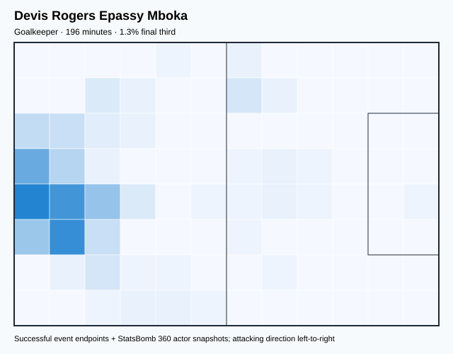

## Physical profile

| Metric | Score |
|---|---:|
| Aerial dominance | 0.000 |
| Pressing intensity per 90 | 0.00 |
| Recovery index per 90 | 5.96 |

## Top chemistry partners

- Nouhou Tolo — synergy 0.489, 196 shared minutes
- Ngoran Suiru Fai Collins — synergy 0.489, 196 shared minutes
- André-Frank Zambo Anguissa — synergy 0.440, 180 shared minutes

## Tactical recommendations

- Use a compact pressing trigger rather than sustained solo pressure.
- Avoid isolating this player in high-volume aerial matchups.
- Use recovery capacity to support higher attacking positions.

_The heatmap combines successful event endpoints with StatsBomb 360 actor
snapshots. StatsBomb 360 is freeze-frame context, not continuous player
tracking. Ratings include eligible outfield players from 45 minutes and
goalkeepers from 90 minutes; ranking status communicates sample reliability._

---

<!-- PLAYER_REPORT 14: 16015_starter_report.md -->

# Nicolas Moumi Ngamaleu — Starter Report

- Team: Cameroon (CMR)
- Position: Left Midfield
- Functional role: Ball-Winner
- VAEP offense per 90: 0.1501
- VAEP defense per 90: 0.0255
- VAEP total per 90: 0.1755
- VAEP per touch: 0.00204
- Spatial xT per 90: 0.1088
- Final-third spatial share: 45.1%
- Unified final player rating: 0.1083
- Team rank: #5

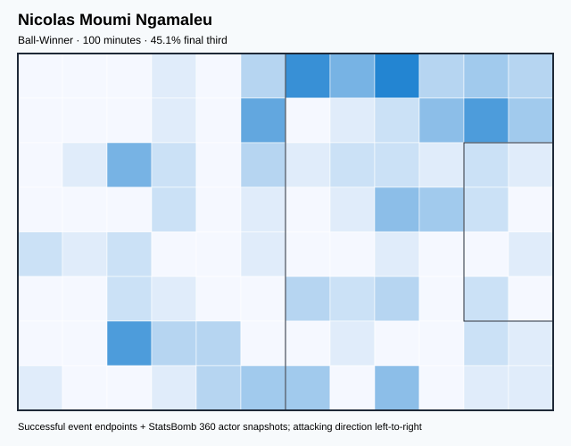

## Physical profile

| Metric | Score |
|---|---:|
| Aerial dominance | 0.500 |
| Pressing intensity per 90 | 21.50 |
| Recovery index per 90 | 4.48 |

## Top chemistry partners

- Nouhou Tolo — synergy 0.266, 100 shared minutes
- Ngoran Suiru Fai Collins — synergy 0.262, 100 shared minutes
- Vincent Paté Aboubakar — synergy 0.256, 100 shared minutes

## Tactical recommendations

- Lead the first pressing trigger and protect the inside passing lane.
- Use recovery capacity to support higher attacking positions.

_The heatmap combines successful event endpoints with StatsBomb 360 actor
snapshots. StatsBomb 360 is freeze-frame context, not continuous player
tracking. Ratings include eligible outfield players from 45 minutes and
goalkeepers from 90 minutes; ranking status communicates sample reliability._

---

<!-- PLAYER_REPORT 15: 16346_starter_report.md -->

# Ngoran Suiru Fai Collins — Starter Report

- Team: Cameroon (CMR)
- Position: Right Back
- Functional role: Deep Playmaker
- VAEP offense per 90: 0.0653
- VAEP defense per 90: -0.0727
- VAEP total per 90: -0.0074
- VAEP per touch: -0.00007
- Spatial xT per 90: 0.0383
- Final-third spatial share: 29.9%
- Unified final player rating: 0.0341
- Team rank: #8

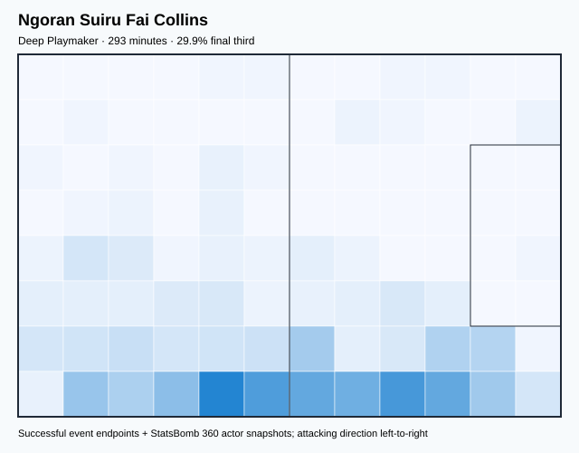

## Physical profile

| Metric | Score |
|---|---:|
| Aerial dominance | 0.500 |
| Pressing intensity per 90 | 13.23 |
| Recovery index per 90 | 3.08 |

## Top chemistry partners

- André-Frank Zambo Anguissa — synergy 0.610, 277 shared minutes
- Nouhou Tolo — synergy 0.598, 293 shared minutes
- Bryan Mbeumo — synergy 0.514, 224 shared minutes

## Tactical recommendations

- Lead the first pressing trigger and protect the inside passing lane.
- Use recovery capacity to support higher attacking positions.

_The heatmap combines successful event endpoints with StatsBomb 360 actor
snapshots. StatsBomb 360 is freeze-frame context, not continuous player
tracking. Ratings include eligible outfield players from 45 minutes and
goalkeepers from 90 minutes; ranking status communicates sample reliability._

---

<!-- PLAYER_REPORT 16: 28966_starter_report.md -->

# Gaël Ondoua — Starter Report

- Team: Cameroon (CMR)
- Position: Right Defensive Midfield
- Functional role: Holding Anchor
- VAEP offense per 90: 0.0555
- VAEP defense per 90: -0.1136
- VAEP total per 90: -0.0581
- VAEP per touch: -0.00084
- Spatial xT per 90: 0.0289
- Final-third spatial share: 26.9%
- Unified final player rating: 0.0165
- Team rank: #12

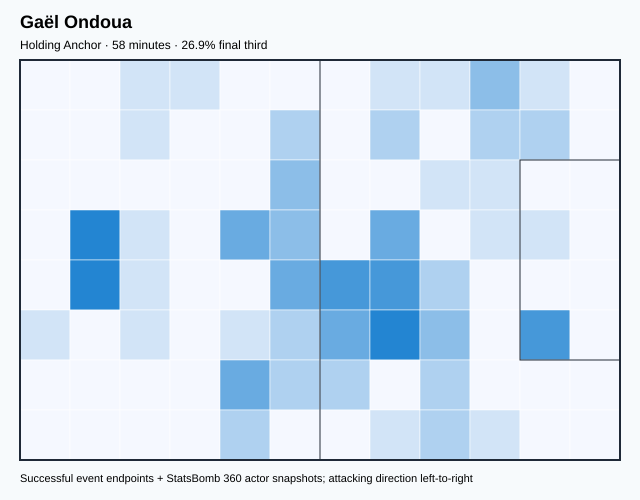

## Physical profile

| Metric | Score |
|---|---:|
| Aerial dominance | 0.333 |
| Pressing intensity per 90 | 25.02 |
| Recovery index per 90 | 10.95 |

## Top chemistry partners

- Ngoran Suiru Fai Collins — synergy 0.181, 58 shared minutes
- Jean-Charles Castelletto — synergy 0.176, 58 shared minutes
- Nicolas Alexis Julio N'Koulou Ndoubena — synergy 0.176, 58 shared minutes

## Tactical recommendations

- Lead the first pressing trigger and protect the inside passing lane.
- Use recovery capacity to support higher attacking positions.

_The heatmap combines successful event endpoints with StatsBomb 360 actor
snapshots. StatsBomb 360 is freeze-frame context, not continuous player
tracking. Ratings include eligible outfield players from 45 minutes and
goalkeepers from 90 minutes; ranking status communicates sample reliability._

---

<!-- PLAYER_REPORT 17: 30016_starter_report.md -->

# Martin Hongla Yma II — Starter Report

- Team: Cameroon (CMR)
- Position: Left Center Midfield
- Functional role: Holding Anchor
- VAEP offense per 90: 0.0890
- VAEP defense per 90: -0.0267
- VAEP total per 90: 0.0624
- VAEP per touch: 0.00049
- Spatial xT per 90: 0.0301
- Final-third spatial share: 17.8%
- Unified final player rating: 0.0928
- Team rank: #6

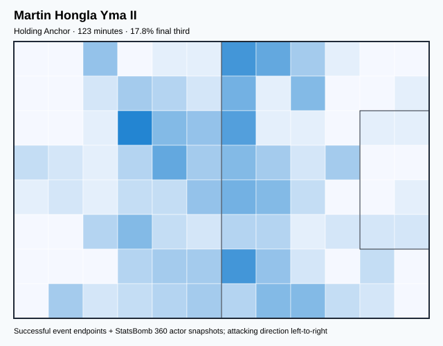

## Physical profile

| Metric | Score |
|---|---:|
| Aerial dominance | 1.000 |
| Pressing intensity per 90 | 16.89 |
| Recovery index per 90 | 2.20 |

## Top chemistry partners

- Jean-Charles Castelletto — synergy 0.351, 123 shared minutes
- Jean-Eric Maxim Choupo-Moting — synergy 0.350, 123 shared minutes
- Nicolas Alexis Julio N'Koulou Ndoubena — synergy 0.346, 123 shared minutes

## Tactical recommendations

- Lead the first pressing trigger and protect the inside passing lane.
- Target this player on direct restarts and back-post deliveries.
- Pair with a faster recovery defender after aggressive rotations.

_The heatmap combines successful event endpoints with StatsBomb 360 actor
snapshots. StatsBomb 360 is freeze-frame context, not continuous player
tracking. Ratings include eligible outfield players from 45 minutes and
goalkeepers from 90 minutes; ranking status communicates sample reliability._

---

<!-- PLAYER_REPORT 18: 74588_starter_report.md -->

# Christopher Wooh — Starter Report

- Team: Cameroon (CMR)
- Position: Right Center Back
- Functional role: Sweeper CB
- VAEP offense per 90: 0.0948
- VAEP defense per 90: -0.2903
- VAEP total per 90: -0.1955
- VAEP per touch: -0.00244
- Spatial xT per 90: 0.0008
- Final-third spatial share: 4.8%
- Unified final player rating: -0.0254
- Team rank: #15

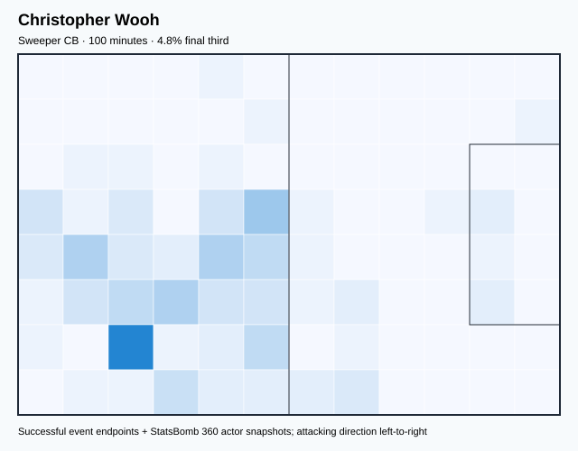

## Physical profile

| Metric | Score |
|---|---:|
| Aerial dominance | 1.000 |
| Pressing intensity per 90 | 11.69 |
| Recovery index per 90 | 0.00 |

## Top chemistry partners

- Enzo Ebosse — synergy 0.301, 100 shared minutes
- Devis Rogers Epassy Mboka — synergy 0.300, 100 shared minutes
- André-Frank Zambo Anguissa — synergy 0.295, 100 shared minutes

## Tactical recommendations

- Lead the first pressing trigger and protect the inside passing lane.
- Target this player on direct restarts and back-post deliveries.
- Pair with a faster recovery defender after aggressive rotations.

_The heatmap combines successful event endpoints with StatsBomb 360 actor
snapshots. StatsBomb 360 is freeze-frame context, not continuous player
tracking. Ratings include eligible outfield players from 45 minutes and
goalkeepers from 90 minutes; ranking status communicates sample reliability._
