# CRC — V4 Player Evaluation Collection

<!-- V5_CANONICAL_NOTICE -->
> **Historical V4 player-rating packet.** Player ratings, ranks, role-challenger decisions, and rating uncertainty below are superseded by `results/reports/player_rankings.csv`, `results/reports/player_profiles/`, and `results/reports/model_summary.md`. Possession, tactical, and match-bootstrap material remains a historical V4 result.

- Included eligible players: 17
- Rankings use the role-aware, development-gated VAEP/xT/xD model.
- Heatmaps combine successful on-ball endpoints and SB360 actor snapshots.

---

<!-- PLAYER_REPORT 1: 5581_starter_report.md -->

# Joel Nathaniel Campbell Samuels — Starter Report

- Team: Costa Rica (CRC)
- Position: Center Forward
- Functional role: Progressive Winger
- VAEP offense per 90: 0.0961
- VAEP defense per 90: -0.0121
- VAEP total per 90: 0.0839
- VAEP per touch: 0.00059
- Spatial xT per 90: 0.0459
- Final-third spatial share: 22.3%
- Unified final player rating: 0.1652
- Team rank: #3

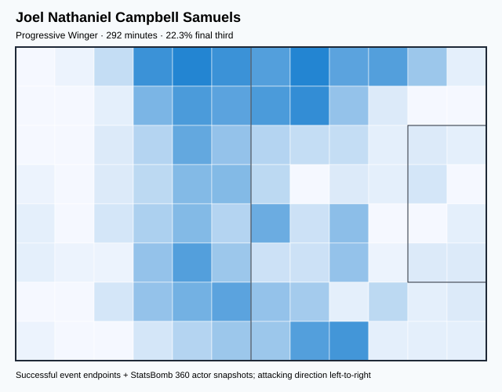

## Physical profile

| Metric | Score |
|---|---:|
| Aerial dominance | 0.444 |
| Pressing intensity per 90 | 14.16 |
| Recovery index per 90 | 4.62 |

## Top chemistry partners

- Yeltsin Ignacio Tejeda Valverde — synergy 0.594, 285 shared minutes
- Celso Borges Mora — synergy 0.578, 260 shared minutes
- Óscar Esau Duarte Gaitán — synergy 0.557, 292 shared minutes

## Tactical recommendations

- Lead the first pressing trigger and protect the inside passing lane.
- Use recovery capacity to support higher attacking positions.

_The heatmap combines successful event endpoints with StatsBomb 360 actor
snapshots. StatsBomb 360 is freeze-frame context, not continuous player
tracking. Ratings include eligible outfield players from 45 minutes and
goalkeepers from 90 minutes; ranking status communicates sample reliability._

---

<!-- PLAYER_REPORT 2: 5582_starter_report.md -->

# Celso Borges Mora — Starter Report

- Team: Costa Rica (CRC)
- Position: Right Defensive Midfield
- Functional role: Holding Anchor
- VAEP offense per 90: -0.0163
- VAEP defense per 90: -0.0604
- VAEP total per 90: -0.0767
- VAEP per touch: -0.00080
- Spatial xT per 90: 0.0089
- Final-third spatial share: 9.7%
- Unified final player rating: 0.0002
- Team rank: #12

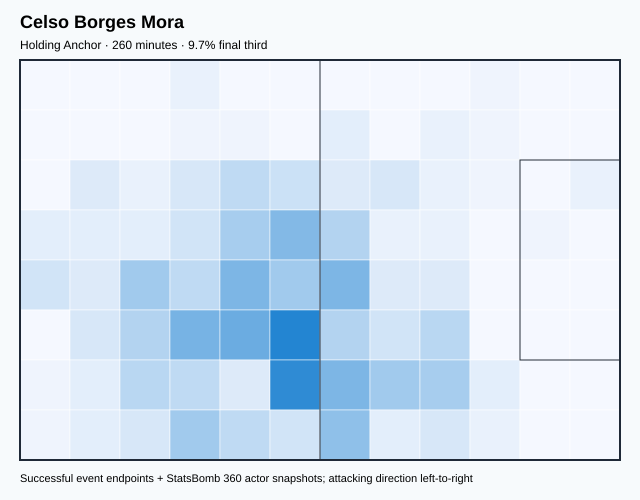

## Physical profile

| Metric | Score |
|---|---:|
| Aerial dominance | 0.800 |
| Pressing intensity per 90 | 12.46 |
| Recovery index per 90 | 3.46 |

## Top chemistry partners

- Óscar Esau Duarte Gaitán — synergy 0.603, 260 shared minutes
- Keylor Navas Gamboa — synergy 0.586, 260 shared minutes
- Joel Nathaniel Campbell Samuels — synergy 0.578, 260 shared minutes

## Tactical recommendations

- Lead the first pressing trigger and protect the inside passing lane.
- Target this player on direct restarts and back-post deliveries.
- Use recovery capacity to support higher attacking positions.

_The heatmap combines successful event endpoints with StatsBomb 360 actor
snapshots. StatsBomb 360 is freeze-frame context, not continuous player
tracking. Ratings include eligible outfield players from 45 minutes and
goalkeepers from 90 minutes; ranking status communicates sample reliability._

---

<!-- PLAYER_REPORT 3: 5595_starter_report.md -->

# Johan Alberto Venegas Ulloa — Starter Report

- Team: Costa Rica (CRC)
- Position: Center Forward
- Functional role: Ball-Winner
- VAEP offense per 90: 0.1300
- VAEP defense per 90: -0.0096
- VAEP total per 90: 0.1204
- VAEP per touch: 0.00169
- Spatial xT per 90: 0.0012
- Final-third spatial share: 35.0%
- Unified final player rating: 0.2142
- Team rank: #1

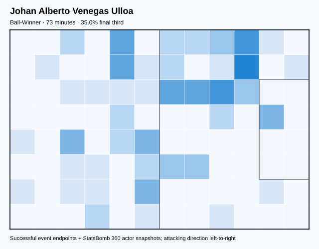

## Physical profile

| Metric | Score |
|---|---:|
| Aerial dominance | 0.000 |
| Pressing intensity per 90 | 19.66 |
| Recovery index per 90 | 2.46 |

## Top chemistry partners

- Kendall Jamaal Waston Manley — synergy 0.218, 73 shared minutes
- Celso Borges Mora — synergy 0.215, 73 shared minutes
- Bryan Oviedo — synergy 0.206, 73 shared minutes

## Tactical recommendations

- Lead the first pressing trigger and protect the inside passing lane.
- Avoid isolating this player in high-volume aerial matchups.
- Pair with a faster recovery defender after aggressive rotations.

_The heatmap combines successful event endpoints with StatsBomb 360 actor
snapshots. StatsBomb 360 is freeze-frame context, not continuous player
tracking. Ratings include eligible outfield players from 45 minutes and
goalkeepers from 90 minutes; ranking status communicates sample reliability._

---

<!-- PLAYER_REPORT 4: 5597_starter_report.md -->

# Keylor Navas Gamboa — Starter Report

- Team: Costa Rica (CRC)
- Position: Goalkeeper
- Functional role: Goalkeeper
- VAEP offense per 90: -0.0191
- VAEP defense per 90: -0.1993
- VAEP total per 90: -0.2184
- VAEP per touch: -0.00418
- Spatial xT per 90: 0.0019
- Final-third spatial share: 0.8%
- Unified final player rating: -0.0805
- Team rank: #17

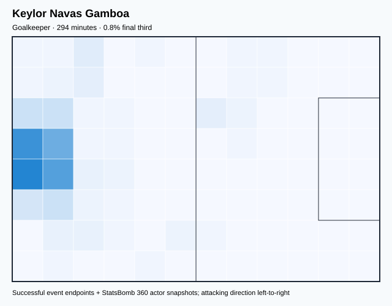

## Physical profile

| Metric | Score |
|---|---:|
| Aerial dominance | 0.000 |
| Pressing intensity per 90 | 0.31 |
| Recovery index per 90 | 5.81 |

## Top chemistry partners

- Óscar Esau Duarte Gaitán — synergy 0.649, 294 shared minutes
- Bryan Oviedo — synergy 0.586, 270 shared minutes
- Celso Borges Mora — synergy 0.586, 260 shared minutes

## Tactical recommendations

- Use a compact pressing trigger rather than sustained solo pressure.
- Avoid isolating this player in high-volume aerial matchups.
- Use recovery capacity to support higher attacking positions.

_The heatmap combines successful event endpoints with StatsBomb 360 actor
snapshots. StatsBomb 360 is freeze-frame context, not continuous player
tracking. Ratings include eligible outfield players from 45 minutes and
goalkeepers from 90 minutes; ranking status communicates sample reliability._

---

<!-- PLAYER_REPORT 5: 5598_starter_report.md -->

# Óscar Esau Duarte Gaitán — Starter Report

- Team: Costa Rica (CRC)
- Position: Center Back
- Functional role: Sweeper CB
- VAEP offense per 90: 0.0024
- VAEP defense per 90: -0.0782
- VAEP total per 90: -0.0759
- VAEP per touch: -0.00108
- Spatial xT per 90: 0.0055
- Final-third spatial share: 3.4%
- Unified final player rating: -0.0202
- Team rank: #16

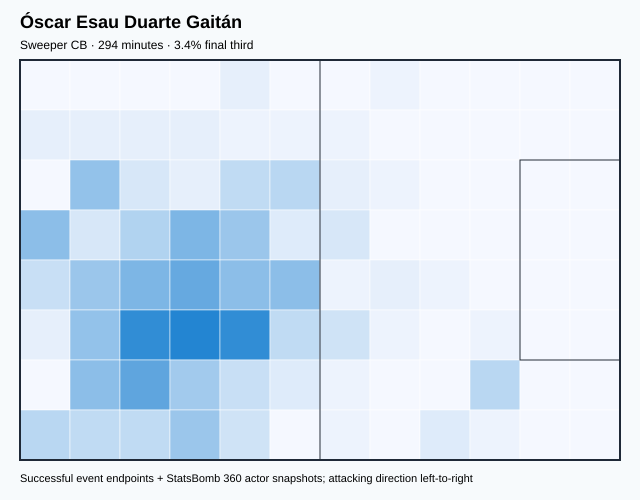

## Physical profile

| Metric | Score |
|---|---:|
| Aerial dominance | 0.500 |
| Pressing intensity per 90 | 9.78 |
| Recovery index per 90 | 2.75 |

## Top chemistry partners

- Keylor Navas Gamboa — synergy 0.649, 294 shared minutes
- Yeltsin Ignacio Tejeda Valverde — synergy 0.610, 287 shared minutes
- Celso Borges Mora — synergy 0.603, 260 shared minutes

## Tactical recommendations

- Use a compact pressing trigger rather than sustained solo pressure.
- Use recovery capacity to support higher attacking positions.

_The heatmap combines successful event endpoints with StatsBomb 360 actor
snapshots. StatsBomb 360 is freeze-frame context, not continuous player
tracking. Ratings include eligible outfield players from 45 minutes and
goalkeepers from 90 minutes; ranking status communicates sample reliability._

---

<!-- PLAYER_REPORT 6: 5600_starter_report.md -->

# Francisco Javier Calvo Quesada — Starter Report

- Team: Costa Rica (CRC)
- Position: Left Center Back
- Functional role: Sweeper CB
- VAEP offense per 90: 0.0037
- VAEP defense per 90: -0.0451
- VAEP total per 90: -0.0414
- VAEP per touch: -0.00034
- Spatial xT per 90: 0.0057
- Final-third spatial share: 3.3%
- Unified final player rating: -0.0123
- Team rank: #14

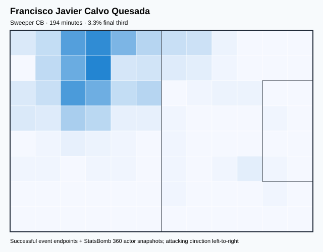

## Physical profile

| Metric | Score |
|---|---:|
| Aerial dominance | 0.667 |
| Pressing intensity per 90 | 14.35 |
| Recovery index per 90 | 3.70 |

## Top chemistry partners

- Keylor Navas Gamboa — synergy 0.503, 194 shared minutes
- Óscar Esau Duarte Gaitán — synergy 0.497, 194 shared minutes
- Yeltsin Ignacio Tejeda Valverde — synergy 0.473, 194 shared minutes

## Tactical recommendations

- Lead the first pressing trigger and protect the inside passing lane.
- Target this player on direct restarts and back-post deliveries.
- Use recovery capacity to support higher attacking positions.

_The heatmap combines successful event endpoints with StatsBomb 360 actor
snapshots. StatsBomb 360 is freeze-frame context, not continuous player
tracking. Ratings include eligible outfield players from 45 minutes and
goalkeepers from 90 minutes; ranking status communicates sample reliability._

---

<!-- PLAYER_REPORT 7: 5836_starter_report.md -->

# Bryan Oviedo — Starter Report

- Team: Costa Rica (CRC)
- Position: Left Wing Back
- Functional role: Wide Creator
- VAEP offense per 90: 0.0155
- VAEP defense per 90: -0.0685
- VAEP total per 90: -0.0530
- VAEP per touch: -0.00071
- Spatial xT per 90: 0.0136
- Final-third spatial share: 19.1%
- Unified final player rating: 0.0246
- Team rank: #11

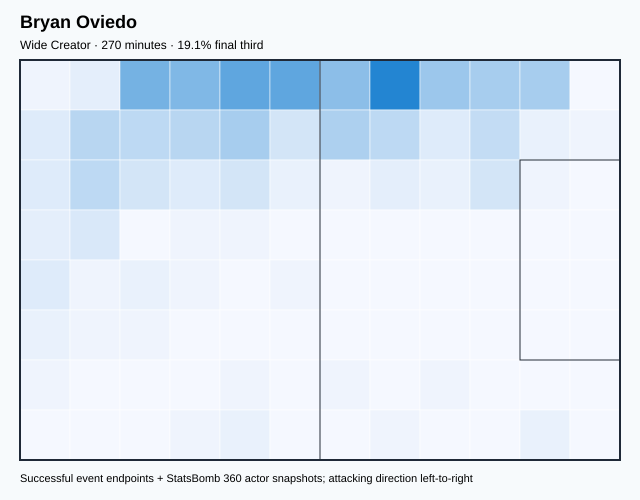

## Physical profile

| Metric | Score |
|---|---:|
| Aerial dominance | 0.667 |
| Pressing intensity per 90 | 10.34 |
| Recovery index per 90 | 2.00 |

## Top chemistry partners

- Yeltsin Ignacio Tejeda Valverde — synergy 0.604, 270 shared minutes
- Keylor Navas Gamboa — synergy 0.586, 270 shared minutes
- Celso Borges Mora — synergy 0.557, 252 shared minutes

## Tactical recommendations

- Use a compact pressing trigger rather than sustained solo pressure.
- Target this player on direct restarts and back-post deliveries.
- Pair with a faster recovery defender after aggressive rotations.

_The heatmap combines successful event endpoints with StatsBomb 360 actor
snapshots. StatsBomb 360 is freeze-frame context, not continuous player
tracking. Ratings include eligible outfield players from 45 minutes and
goalkeepers from 90 minutes; ranking status communicates sample reliability._

---

<!-- PLAYER_REPORT 8: 5839_starter_report.md -->

# Yeltsin Ignacio Tejeda Valverde — Starter Report

- Team: Costa Rica (CRC)
- Position: Left Center Midfield
- Functional role: Holding Anchor
- VAEP offense per 90: 0.0100
- VAEP defense per 90: -0.0546
- VAEP total per 90: -0.0447
- VAEP per touch: -0.00057
- Spatial xT per 90: 0.0136
- Final-third spatial share: 9.8%
- Unified final player rating: 0.0582
- Team rank: #7

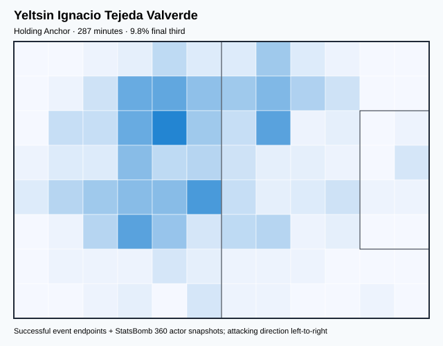

## Physical profile

| Metric | Score |
|---|---:|
| Aerial dominance | 0.444 |
| Pressing intensity per 90 | 13.49 |
| Recovery index per 90 | 2.82 |

## Top chemistry partners

- Óscar Esau Duarte Gaitán — synergy 0.610, 287 shared minutes
- Bryan Oviedo — synergy 0.604, 270 shared minutes
- Keysher Fuller Spence — synergy 0.596, 268 shared minutes

## Tactical recommendations

- Lead the first pressing trigger and protect the inside passing lane.
- Use recovery capacity to support higher attacking positions.

_The heatmap combines successful event endpoints with StatsBomb 360 actor
snapshots. StatsBomb 360 is freeze-frame context, not continuous player
tracking. Ratings include eligible outfield players from 45 minutes and
goalkeepers from 90 minutes; ranking status communicates sample reliability._

---

<!-- PLAYER_REPORT 9: 6328_starter_report.md -->

# Kendall Jamaal Waston Manley — Starter Report

- Team: Costa Rica (CRC)
- Position: Right Center Back
- Functional role: Sweeper CB
- VAEP offense per 90: 0.1139
- VAEP defense per 90: -0.0812
- VAEP total per 90: 0.0327
- VAEP per touch: 0.00048
- Spatial xT per 90: -0.0004
- Final-third spatial share: 3.8%
- Unified final player rating: -0.0000
- Team rank: #13

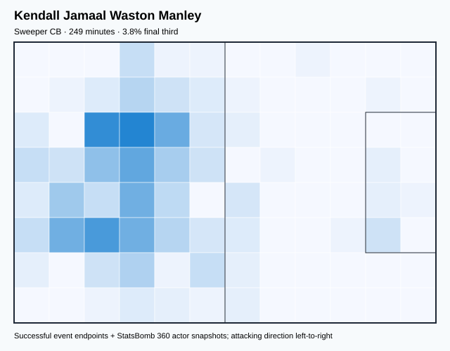

## Physical profile

| Metric | Score |
|---|---:|
| Aerial dominance | 0.556 |
| Pressing intensity per 90 | 9.02 |
| Recovery index per 90 | 0.36 |

## Top chemistry partners

- Óscar Esau Duarte Gaitán — synergy 0.591, 249 shared minutes
- Yeltsin Ignacio Tejeda Valverde — synergy 0.565, 242 shared minutes
- Keysher Fuller Spence — synergy 0.542, 223 shared minutes

## Tactical recommendations

- Use a compact pressing trigger rather than sustained solo pressure.
- Pair with a faster recovery defender after aggressive rotations.

_The heatmap combines successful event endpoints with StatsBomb 360 actor
snapshots. StatsBomb 360 is freeze-frame context, not continuous player
tracking. Ratings include eligible outfield players from 45 minutes and
goalkeepers from 90 minutes; ranking status communicates sample reliability._

---

<!-- PLAYER_REPORT 10: 27163_starter_report.md -->

# Juan Pablo Vargas Campos — Starter Report

- Team: Costa Rica (CRC)
- Position: Left Center Back
- Functional role: Sweeper CB
- VAEP offense per 90: 0.0236
- VAEP defense per 90: -0.1019
- VAEP total per 90: -0.0783
- VAEP per touch: -0.00136
- Spatial xT per 90: 0.0002
- Final-third spatial share: 4.0%
- Unified final player rating: -0.0147
- Team rank: #15

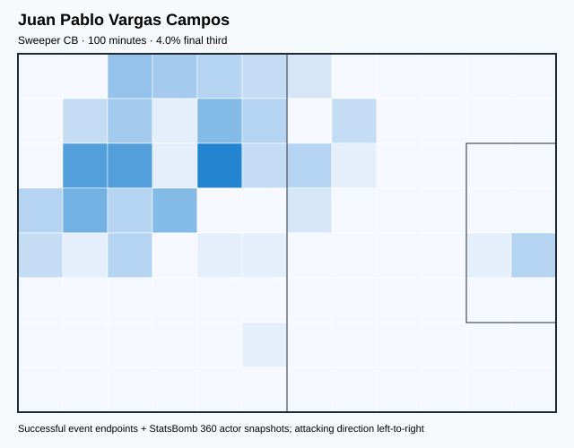

## Physical profile

| Metric | Score |
|---|---:|
| Aerial dominance | 1.000 |
| Pressing intensity per 90 | 17.09 |
| Recovery index per 90 | 3.60 |

## Top chemistry partners

- Joel Nathaniel Campbell Samuels — synergy 0.300, 100 shared minutes
- Óscar Esau Duarte Gaitán — synergy 0.292, 100 shared minutes
- Keylor Navas Gamboa — synergy 0.287, 100 shared minutes

## Tactical recommendations

- Lead the first pressing trigger and protect the inside passing lane.
- Target this player on direct restarts and back-post deliveries.
- Use recovery capacity to support higher attacking positions.

_The heatmap combines successful event endpoints with StatsBomb 360 actor
snapshots. StatsBomb 360 is freeze-frame context, not continuous player
tracking. Ratings include eligible outfield players from 45 minutes and
goalkeepers from 90 minutes; ranking status communicates sample reliability._

---

<!-- PLAYER_REPORT 11: 108340_starter_report.md -->

# Brandon Aguilera Zamora — Starter Report

- Team: Costa Rica (CRC)
- Position: Left Wing
- Functional role: Holding Anchor
- VAEP offense per 90: 0.0016
- VAEP defense per 90: -0.0163
- VAEP total per 90: -0.0147
- VAEP per touch: -0.00015
- Spatial xT per 90: 0.0012
- Final-third spatial share: 6.7%
- Unified final player rating: 0.1421
- Team rank: #6

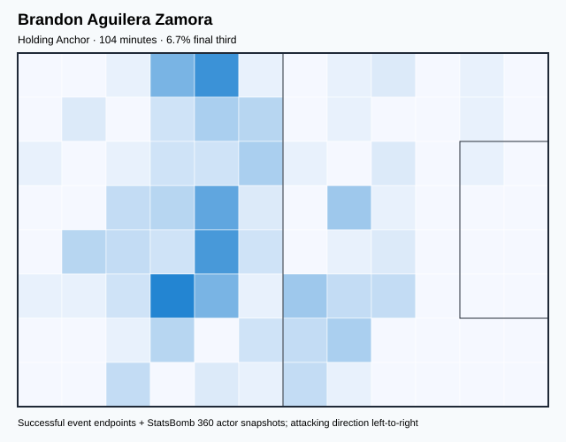

## Physical profile

| Metric | Score |
|---|---:|
| Aerial dominance | 0.667 |
| Pressing intensity per 90 | 21.60 |
| Recovery index per 90 | 6.91 |

## Top chemistry partners

- Yeltsin Ignacio Tejeda Valverde — synergy 0.302, 104 shared minutes
- Keylor Navas Gamboa — synergy 0.299, 104 shared minutes
- Óscar Esau Duarte Gaitán — synergy 0.297, 104 shared minutes

## Tactical recommendations

- Lead the first pressing trigger and protect the inside passing lane.
- Target this player on direct restarts and back-post deliveries.
- Use recovery capacity to support higher attacking positions.

_The heatmap combines successful event endpoints with StatsBomb 360 actor
snapshots. StatsBomb 360 is freeze-frame context, not continuous player
tracking. Ratings include eligible outfield players from 45 minutes and
goalkeepers from 90 minutes; ranking status communicates sample reliability._

---

<!-- PLAYER_REPORT 12: 130185_starter_report.md -->

# Keysher Fuller Spence — Starter Report

- Team: Costa Rica (CRC)
- Position: Right Wing Back
- Functional role: Deep Playmaker
- VAEP offense per 90: 0.0912
- VAEP defense per 90: -0.0601
- VAEP total per 90: 0.0311
- VAEP per touch: 0.00051
- Spatial xT per 90: 0.0068
- Final-third spatial share: 24.6%
- Unified final player rating: 0.0400
- Team rank: #9

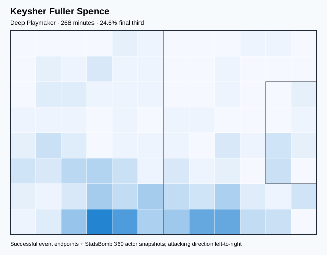

## Physical profile

| Metric | Score |
|---|---:|
| Aerial dominance | 0.500 |
| Pressing intensity per 90 | 15.45 |
| Recovery index per 90 | 1.68 |

## Top chemistry partners

- Yeltsin Ignacio Tejeda Valverde — synergy 0.596, 268 shared minutes
- Keylor Navas Gamboa — synergy 0.577, 268 shared minutes
- Bryan Oviedo — synergy 0.547, 251 shared minutes

## Tactical recommendations

- Lead the first pressing trigger and protect the inside passing lane.
- Pair with a faster recovery defender after aggressive rotations.

_The heatmap combines successful event endpoints with StatsBomb 360 actor
snapshots. StatsBomb 360 is freeze-frame context, not continuous player
tracking. Ratings include eligible outfield players from 45 minutes and
goalkeepers from 90 minutes; ranking status communicates sample reliability._

---

<!-- PLAYER_REPORT 13: 132271_starter_report.md -->

# Carlos Manuel Martínez Castro — Starter Report

- Team: Costa Rica (CRC)
- Position: Right Back
- Functional role: Deep Playmaker
- VAEP offense per 90: 0.0090
- VAEP defense per 90: -0.0145
- VAEP total per 90: -0.0055
- VAEP per touch: -0.00010
- Spatial xT per 90: -0.0008
- Final-third spatial share: 29.4%
- Unified final player rating: 0.0485
- Team rank: #8

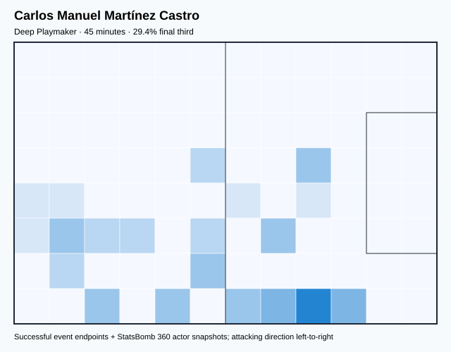

## Physical profile

| Metric | Score |
|---|---:|
| Aerial dominance | 0.500 |
| Pressing intensity per 90 | 24.00 |
| Recovery index per 90 | 4.00 |

## Top chemistry partners

- Óscar Esau Duarte Gaitán — synergy 0.145, 45 shared minutes
- Celso Borges Mora — synergy 0.141, 45 shared minutes
- Anthony Daniel Contreras Enríquez — synergy 0.141, 45 shared minutes

## Tactical recommendations

- Lead the first pressing trigger and protect the inside passing lane.
- Use recovery capacity to support higher attacking positions.

_The heatmap combines successful event endpoints with StatsBomb 360 actor
snapshots. StatsBomb 360 is freeze-frame context, not continuous player
tracking. Ratings include eligible outfield players from 45 minutes and
goalkeepers from 90 minutes; ranking status communicates sample reliability._

---

<!-- PLAYER_REPORT 14: 132296_starter_report.md -->

# Anthony Daniel Contreras Enríquez — Starter Report

- Team: Costa Rica (CRC)
- Position: Center Forward
- Functional role: Target Forward
- VAEP offense per 90: 0.0900
- VAEP defense per 90: 0.0089
- VAEP total per 90: 0.0989
- VAEP per touch: 0.00150
- Spatial xT per 90: -0.0067
- Final-third spatial share: 20.5%
- Unified final player rating: 0.1958
- Team rank: #2

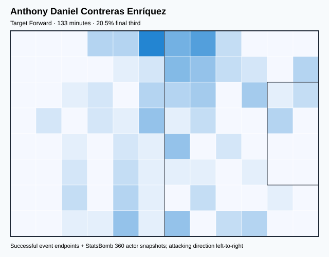

## Physical profile

| Metric | Score |
|---|---:|
| Aerial dominance | 0.364 |
| Pressing intensity per 90 | 19.66 |
| Recovery index per 90 | 3.39 |

## Top chemistry partners

- Óscar Esau Duarte Gaitán — synergy 0.351, 133 shared minutes
- Joel Nathaniel Campbell Samuels — synergy 0.311, 133 shared minutes
- Bryan Oviedo — synergy 0.303, 125 shared minutes

## Tactical recommendations

- Lead the first pressing trigger and protect the inside passing lane.
- Use recovery capacity to support higher attacking positions.

_The heatmap combines successful event endpoints with StatsBomb 360 actor
snapshots. StatsBomb 360 is freeze-frame context, not continuous player
tracking. Ratings include eligible outfield players from 45 minutes and
goalkeepers from 90 minutes; ranking status communicates sample reliability._

---

<!-- PLAYER_REPORT 15: 132497_starter_report.md -->

# Gerson Torres Barrantes — Starter Report

- Team: Costa Rica (CRC)
- Position: Right Wing
- Functional role: Ball-Winner
- VAEP offense per 90: 0.0000
- VAEP defense per 90: -0.0157
- VAEP total per 90: -0.0157
- VAEP per touch: -0.00016
- Spatial xT per 90: 0.0015
- Final-third spatial share: 13.1%
- Unified final player rating: 0.1536
- Team rank: #4

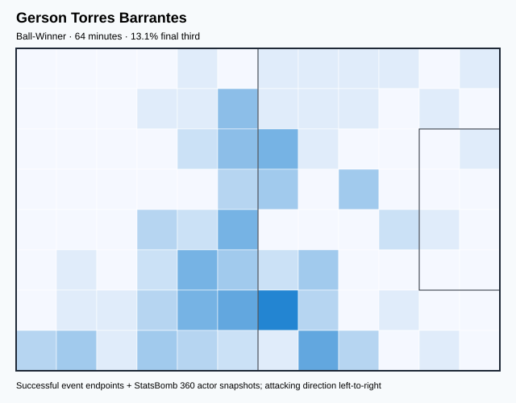

## Physical profile

| Metric | Score |
|---|---:|
| Aerial dominance | 0.000 |
| Pressing intensity per 90 | 22.48 |
| Recovery index per 90 | 5.62 |

## Top chemistry partners

- Celso Borges Mora — synergy 0.206, 64 shared minutes
- Keysher Fuller Spence — synergy 0.199, 64 shared minutes
- Joel Nathaniel Campbell Samuels — synergy 0.196, 64 shared minutes

## Tactical recommendations

- Lead the first pressing trigger and protect the inside passing lane.
- Avoid isolating this player in high-volume aerial matchups.
- Use recovery capacity to support higher attacking positions.

_The heatmap combines successful event endpoints with StatsBomb 360 actor
snapshots. StatsBomb 360 is freeze-frame context, not continuous player
tracking. Ratings include eligible outfield players from 45 minutes and
goalkeepers from 90 minutes; ranking status communicates sample reliability._

---

<!-- PLAYER_REPORT 16: 132728_starter_report.md -->

# Jewison Bennette — Starter Report

- Team: Costa Rica (CRC)
- Position: Left Wing
- Functional role: Ball-Winner
- VAEP offense per 90: 0.0900
- VAEP defense per 90: -0.0060
- VAEP total per 90: 0.0840
- VAEP per touch: 0.00122
- Spatial xT per 90: 0.0377
- Final-third spatial share: 30.1%
- Unified final player rating: 0.1500
- Team rank: #5

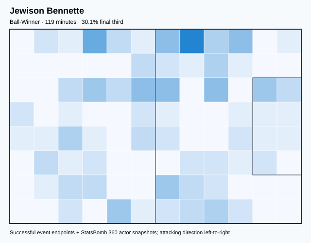

## Physical profile

| Metric | Score |
|---|---:|
| Aerial dominance | 0.000 |
| Pressing intensity per 90 | 29.42 |
| Recovery index per 90 | 4.53 |

## Top chemistry partners

- Celso Borges Mora — synergy 0.323, 112 shared minutes
- Joel Nathaniel Campbell Samuels — synergy 0.306, 117 shared minutes
- Yeltsin Ignacio Tejeda Valverde — synergy 0.290, 112 shared minutes

## Tactical recommendations

- Lead the first pressing trigger and protect the inside passing lane.
- Avoid isolating this player in high-volume aerial matchups.
- Use recovery capacity to support higher attacking positions.

_The heatmap combines successful event endpoints with StatsBomb 360 actor
snapshots. StatsBomb 360 is freeze-frame context, not continuous player
tracking. Ratings include eligible outfield players from 45 minutes and
goalkeepers from 90 minutes; ranking status communicates sample reliability._

---

<!-- PLAYER_REPORT 17: 132756_starter_report.md -->

# Youstin Delfin Salas Gómez — Starter Report

- Team: Costa Rica (CRC)
- Position: Right Wing Back
- Functional role: Two-Way Fullback
- VAEP offense per 90: 0.0337
- VAEP defense per 90: -0.1755
- VAEP total per 90: -0.1418
- VAEP per touch: -0.00246
- Spatial xT per 90: 0.0303
- Final-third spatial share: 15.2%
- Unified final player rating: 0.0391
- Team rank: #10

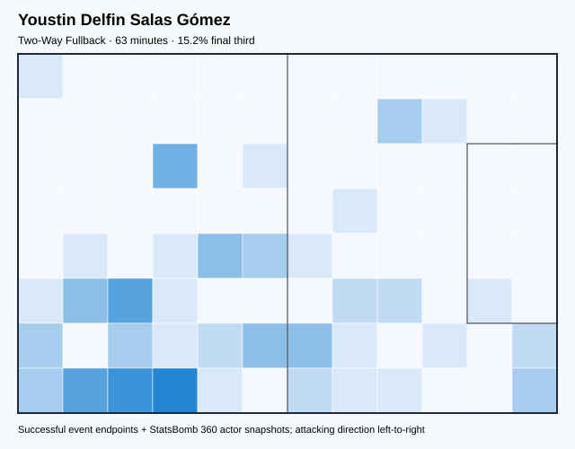

## Physical profile

| Metric | Score |
|---|---:|
| Aerial dominance | 1.000 |
| Pressing intensity per 90 | 25.89 |
| Recovery index per 90 | 4.32 |

## Top chemistry partners

- Joel Nathaniel Campbell Samuels — synergy 0.191, 61 shared minutes
- Óscar Esau Duarte Gaitán — synergy 0.190, 63 shared minutes
- Kendall Jamaal Waston Manley — synergy 0.190, 63 shared minutes

## Tactical recommendations

- Lead the first pressing trigger and protect the inside passing lane.
- Target this player on direct restarts and back-post deliveries.
- Use recovery capacity to support higher attacking positions.

_The heatmap combines successful event endpoints with StatsBomb 360 actor
snapshots. StatsBomb 360 is freeze-frame context, not continuous player
tracking. Ratings include eligible outfield players from 45 minutes and
goalkeepers from 90 minutes; ranking status communicates sample reliability._
