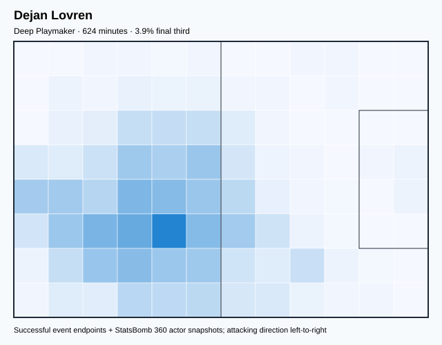
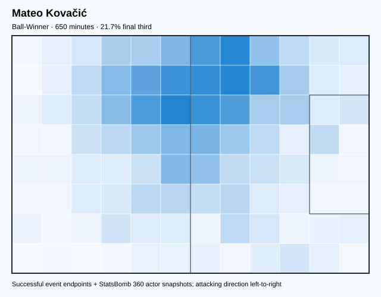
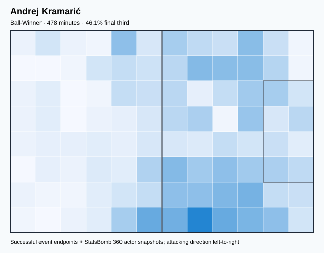
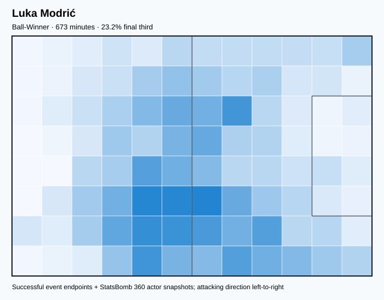
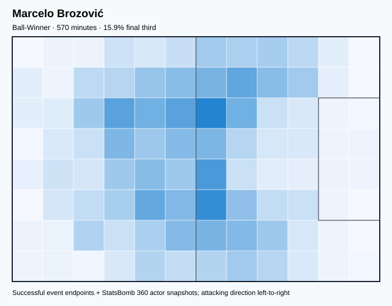
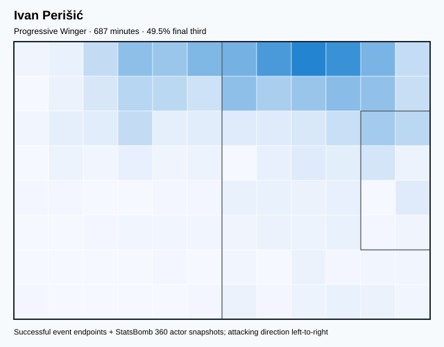
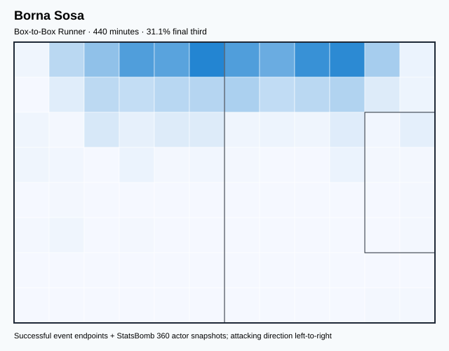
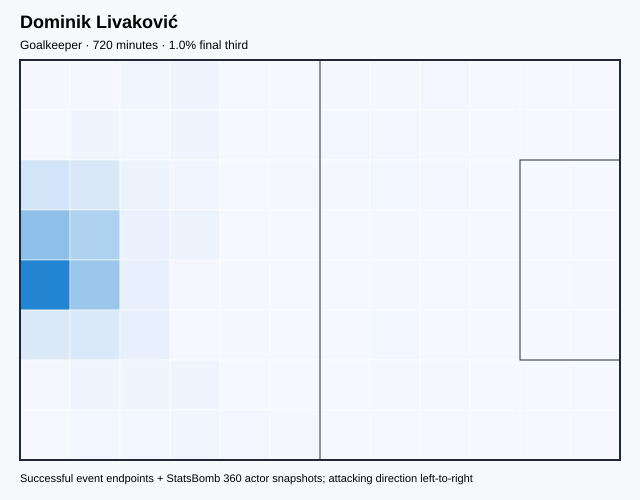
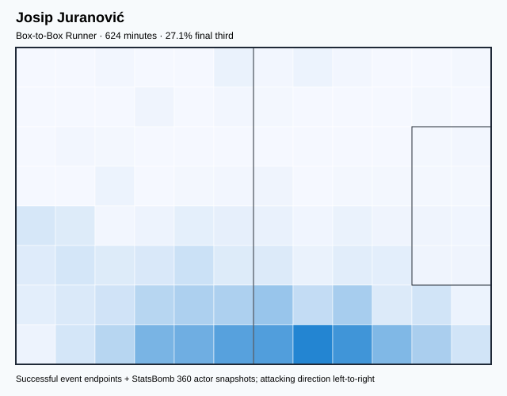
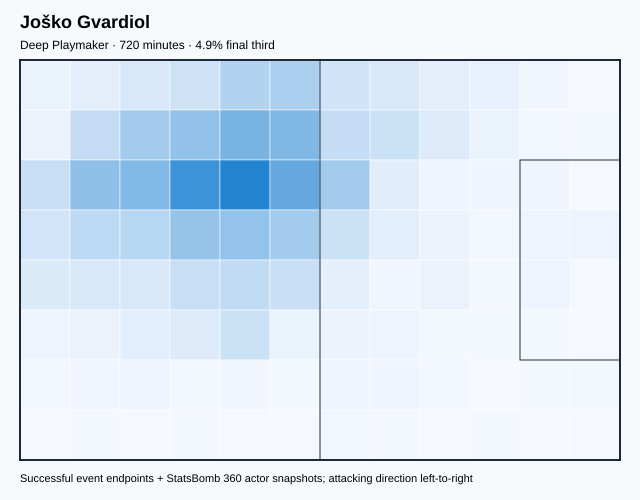

# CRO — V4 Player Evaluation Collection

- Included 300+ minute players: 10
- Rankings are role-relative; cross-role score comparisons are invalid.
- Heatmaps combine successful on-ball endpoints and SB360 actor snapshots.

---

<!-- PLAYER_REPORT 1: 3471_starter_report.md -->

# Dejan Lovren — Starter Report

- Team: Croatia (CRO)
- Position: Right Center Back
- Functional role: Holding Anchor
- Risk-adjusted OBV per 90: 0.3132
- OBV source: `open_event_value_fallback`
- Final-third spatial share: 3.3%
- Role-relative z-score: -0.592
- V4 evaluation score: 44.1

## Physical profile

| Metric | Score |
|---|---:|
| Aerial dominance | 0.781 |
| Pressing intensity per 90 | 6.34 |
| Recovery index per 90 | 1.59 |

## Top chemistry partners

- Dominik Livaković — synergy 0.896, 624 shared minutes
- Joško Gvardiol — synergy 0.890, 624 shared minutes
- Josip Juranović — synergy 0.867, 624 shared minutes

## Tactical recommendations

- Use a compact pressing trigger rather than sustained solo pressure.
- Target this player on direct restarts and back-post deliveries.
- Pair with a faster recovery defender after aggressive rotations.

_The heatmap combines successful event endpoints with StatsBomb 360 actor
snapshots. StatsBomb 360 is freeze-frame context, not continuous player
tracking. Scores exclude players below 300 tournament minutes._

---

<!-- PLAYER_REPORT 2: 5456_starter_report.md -->

# Mateo Kovačić — Starter Report

- Team: Croatia (CRO)
- Position: Left Center Midfield
- Functional role: Ball-Winner
- Risk-adjusted OBV per 90: 0.0810
- OBV source: `open_event_value_fallback`
- Final-third spatial share: 20.7%
- Role-relative z-score: +0.554
- V4 evaluation score: 55.5

## Physical profile

| Metric | Score |
|---|---:|
| Aerial dominance | 0.750 |
| Pressing intensity per 90 | 21.19 |
| Recovery index per 90 | 3.88 |

## Top chemistry partners

- Joško Gvardiol — synergy 0.881, 650 shared minutes
- Luka Modrić — synergy 0.879, 635 shared minutes
- Dejan Lovren — synergy 0.847, 554 shared minutes

## Tactical recommendations

- Lead the first pressing trigger and protect the inside passing lane.
- Target this player on direct restarts and back-post deliveries.
- Use recovery capacity to support higher attacking positions.

_The heatmap combines successful event endpoints with StatsBomb 360 actor
snapshots. StatsBomb 360 is freeze-frame context, not continuous player
tracking. Scores exclude players below 300 tournament minutes._

---

<!-- PLAYER_REPORT 3: 5460_starter_report.md -->

# Andrej Kramarić — Starter Report

- Team: Croatia (CRO)
- Position: Right Wing
- Functional role: Target Forward
- Risk-adjusted OBV per 90: -0.4364
- OBV source: `open_event_value_fallback`
- Final-third spatial share: 48.4%
- Role-relative z-score: -0.378
- V4 evaluation score: 46.2

## Physical profile

| Metric | Score |
|---|---:|
| Aerial dominance | 0.200 |
| Pressing intensity per 90 | 7.15 |
| Recovery index per 90 | 2.26 |

## Top chemistry partners

- Mateo Kovačić — synergy 0.744, 478 shared minutes
- Josip Juranović — synergy 0.708, 417 shared minutes
- Joško Gvardiol — synergy 0.706, 478 shared minutes

## Tactical recommendations

- Use a compact pressing trigger rather than sustained solo pressure.
- Pair with a faster recovery defender after aggressive rotations.

_The heatmap combines successful event endpoints with StatsBomb 360 actor
snapshots. StatsBomb 360 is freeze-frame context, not continuous player
tracking. Scores exclude players below 300 tournament minutes._

---

<!-- PLAYER_REPORT 4: 5463_starter_report.md -->

# Luka Modrić — Starter Report

- Team: Croatia (CRO)
- Position: Right Center Midfield
- Functional role: Ball-Winner
- Risk-adjusted OBV per 90: 0.1814
- OBV source: `open_event_value_fallback`
- Final-third spatial share: 21.7%
- Role-relative z-score: +0.990
- V4 evaluation score: 59.9

## Physical profile

| Metric | Score |
|---|---:|
| Aerial dominance | 0.500 |
| Pressing intensity per 90 | 17.93 |
| Recovery index per 90 | 4.95 |

## Top chemistry partners

- Joško Gvardiol — synergy 0.886, 673 shared minutes
- Mateo Kovačić — synergy 0.879, 635 shared minutes
- Marcelo Brozović — synergy 0.829, 537 shared minutes

## Tactical recommendations

- Lead the first pressing trigger and protect the inside passing lane.
- Use recovery capacity to support higher attacking positions.

_The heatmap combines successful event endpoints with StatsBomb 360 actor
snapshots. StatsBomb 360 is freeze-frame context, not continuous player
tracking. Scores exclude players below 300 tournament minutes._

---

<!-- PLAYER_REPORT 5: 5469_starter_report.md -->

# Marcelo Brozović — Starter Report

- Team: Croatia (CRO)
- Position: Center Defensive Midfield
- Functional role: Ball-Winner
- Risk-adjusted OBV per 90: 0.0412
- OBV source: `open_event_value_fallback`
- Final-third spatial share: 15.1%
- Role-relative z-score: +0.190
- V4 evaluation score: 51.9

## Physical profile

| Metric | Score |
|---|---:|
| Aerial dominance | 0.625 |
| Pressing intensity per 90 | 16.74 |
| Recovery index per 90 | 5.05 |

## Top chemistry partners

- Joško Gvardiol — synergy 0.875, 570 shared minutes
- Dejan Lovren — synergy 0.866, 570 shared minutes
- Dominik Livaković — synergy 0.859, 570 shared minutes

## Tactical recommendations

- Lead the first pressing trigger and protect the inside passing lane.
- Target this player on direct restarts and back-post deliveries.
- Use recovery capacity to support higher attacking positions.

_The heatmap combines successful event endpoints with StatsBomb 360 actor
snapshots. StatsBomb 360 is freeze-frame context, not continuous player
tracking. Scores exclude players below 300 tournament minutes._

---

<!-- PLAYER_REPORT 6: 5474_starter_report.md -->

# Ivan Perišić — Starter Report

- Team: Croatia (CRO)
- Position: Left Wing
- Functional role: Progressive Winger
- Risk-adjusted OBV per 90: -0.3027
- OBV source: `open_event_value_fallback`
- Final-third spatial share: 49.5%
- Role-relative z-score: -1.378
- V4 evaluation score: 36.2

## Physical profile

| Metric | Score |
|---|---:|
| Aerial dominance | 0.500 |
| Pressing intensity per 90 | 14.28 |
| Recovery index per 90 | 2.75 |

## Top chemistry partners

- Joško Gvardiol — synergy 0.837, 687 shared minutes
- Mateo Kovačić — synergy 0.836, 650 shared minutes
- Dominik Livaković — synergy 0.778, 687 shared minutes

## Tactical recommendations

- Lead the first pressing trigger and protect the inside passing lane.
- Use recovery capacity to support higher attacking positions.

_The heatmap combines successful event endpoints with StatsBomb 360 actor
snapshots. StatsBomb 360 is freeze-frame context, not continuous player
tracking. Scores exclude players below 300 tournament minutes._

---

<!-- PLAYER_REPORT 7: 12625_starter_report.md -->

# Borna Sosa — Starter Report

- Team: Croatia (CRO)
- Position: Left Back
- Functional role: Box-to-Box Runner
- Risk-adjusted OBV per 90: 0.0706
- OBV source: `open_event_value_fallback`
- Final-third spatial share: 31.1%
- Role-relative z-score: +2.189
- V4 evaluation score: 71.9

## Physical profile

| Metric | Score |
|---|---:|
| Aerial dominance | 0.273 |
| Pressing intensity per 90 | 10.63 |
| Recovery index per 90 | 2.45 |

## Top chemistry partners

- Luka Modrić — synergy 0.782, 430 shared minutes
- Joško Gvardiol — synergy 0.779, 440 shared minutes
- Dejan Lovren — synergy 0.777, 440 shared minutes

## Tactical recommendations

- Use a compact pressing trigger rather than sustained solo pressure.
- Pair with a faster recovery defender after aggressive rotations.

_The heatmap combines successful event endpoints with StatsBomb 360 actor
snapshots. StatsBomb 360 is freeze-frame context, not continuous player
tracking. Scores exclude players below 300 tournament minutes._

---

<!-- PLAYER_REPORT 8: 16531_starter_report.md -->

# Dominik Livaković — Starter Report

- Team: Croatia (CRO)
- Position: Goalkeeper
- Functional role: Goalkeeper
- Risk-adjusted OBV per 90: 0.2431
- OBV source: `open_event_value_fallback`
- Final-third spatial share: 0.8%
- Role-relative z-score: +0.830
- V4 evaluation score: 58.3

## Physical profile

| Metric | Score |
|---|---:|
| Aerial dominance | 0.000 |
| Pressing intensity per 90 | 0.25 |
| Recovery index per 90 | 4.12 |

## Top chemistry partners

- Joško Gvardiol — synergy 0.925, 720 shared minutes
- Dejan Lovren — synergy 0.896, 624 shared minutes
- Josip Juranović — synergy 0.880, 624 shared minutes

## Tactical recommendations

- Use a compact pressing trigger rather than sustained solo pressure.
- Avoid isolating this player in high-volume aerial matchups.
- Use recovery capacity to support higher attacking positions.

_The heatmap combines successful event endpoints with StatsBomb 360 actor
snapshots. StatsBomb 360 is freeze-frame context, not continuous player
tracking. Scores exclude players below 300 tournament minutes._

---

<!-- PLAYER_REPORT 9: 29163_starter_report.md -->

# Josip Juranović — Starter Report

- Team: Croatia (CRO)
- Position: Right Back
- Functional role: Wide Creator
- Risk-adjusted OBV per 90: 0.0373
- OBV source: `open_event_value_fallback`
- Final-third spatial share: 27.8%
- Role-relative z-score: +0.920
- V4 evaluation score: 59.2

## Physical profile

| Metric | Score |
|---|---:|
| Aerial dominance | 0.400 |
| Pressing intensity per 90 | 8.51 |
| Recovery index per 90 | 4.47 |

## Top chemistry partners

- Dominik Livaković — synergy 0.880, 624 shared minutes
- Joško Gvardiol — synergy 0.875, 624 shared minutes
- Dejan Lovren — synergy 0.867, 624 shared minutes

## Tactical recommendations

- Use a compact pressing trigger rather than sustained solo pressure.
- Use recovery capacity to support higher attacking positions.

_The heatmap combines successful event endpoints with StatsBomb 360 actor
snapshots. StatsBomb 360 is freeze-frame context, not continuous player
tracking. Scores exclude players below 300 tournament minutes._

---

<!-- PLAYER_REPORT 10: 33018_starter_report.md -->

# Joško Gvardiol — Starter Report

- Team: Croatia (CRO)
- Position: Left Center Back
- Functional role: Holding Anchor
- Risk-adjusted OBV per 90: 0.3642
- OBV source: `open_event_value_fallback`
- Final-third spatial share: 3.7%
- Role-relative z-score: -0.157
- V4 evaluation score: 48.4

## Physical profile

| Metric | Score |
|---|---:|
| Aerial dominance | 0.467 |
| Pressing intensity per 90 | 11.87 |
| Recovery index per 90 | 4.37 |

## Top chemistry partners

- Dominik Livaković — synergy 0.925, 720 shared minutes
- Dejan Lovren — synergy 0.890, 624 shared minutes
- Luka Modrić — synergy 0.886, 673 shared minutes

## Tactical recommendations

- Lead the first pressing trigger and protect the inside passing lane.
- Use recovery capacity to support higher attacking positions.

_The heatmap combines successful event endpoints with StatsBomb 360 actor
snapshots. StatsBomb 360 is freeze-frame context, not continuous player
tracking. Scores exclude players below 300 tournament minutes._
