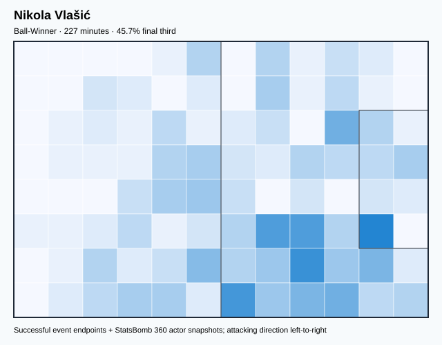
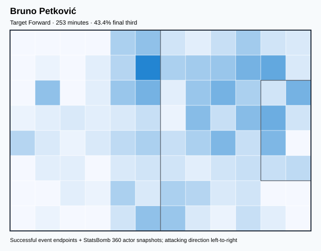
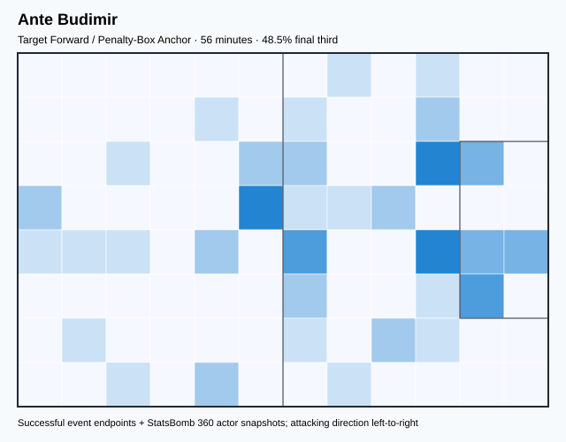
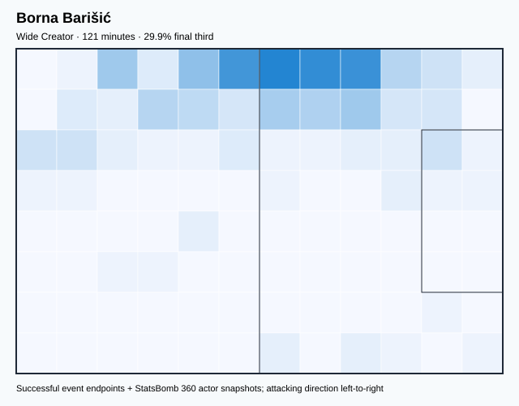
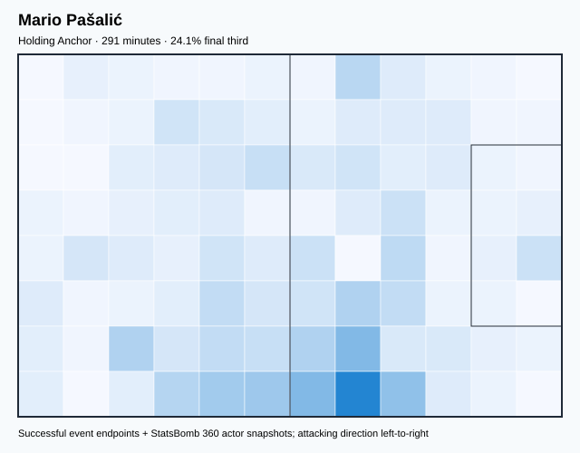
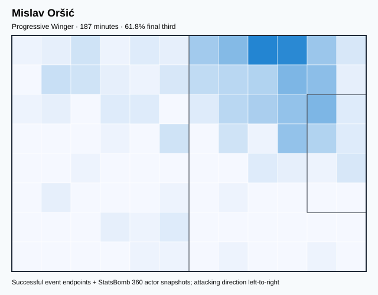
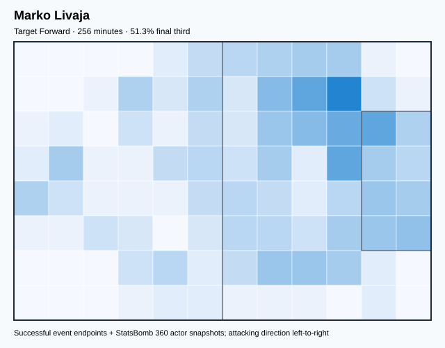
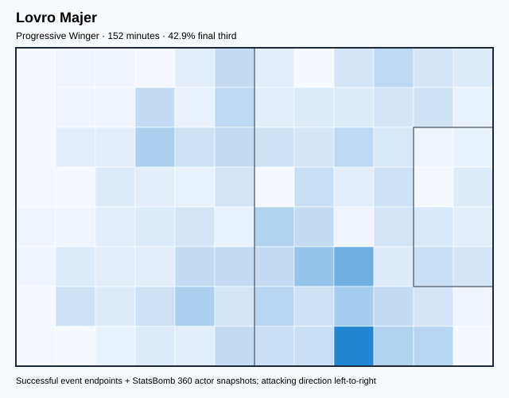
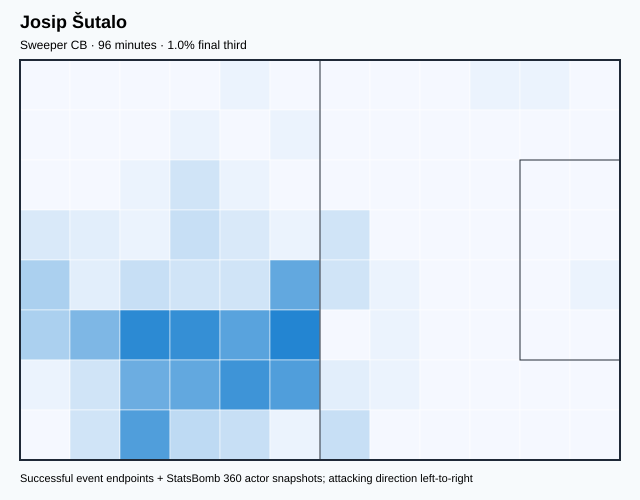
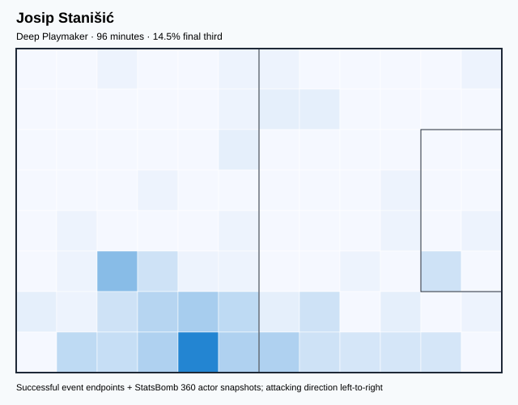

# CRO — V4 Player Evaluation Collection

<!-- V5_CANONICAL_NOTICE -->
> **Historical V4 player-rating packet.** Player ratings, ranks, role-challenger decisions, and rating uncertainty below are superseded by `results/reports/player_rankings.csv`, `results/reports/player_profiles/`, and `results/reports/model_summary.md`. Possession, tactical, and match-bootstrap material remains a historical V4 result.

- Included eligible players: 20
- Rankings use the role-aware, development-gated VAEP/xT/xD model.
- Heatmaps combine successful on-ball endpoints and SB360 actor snapshots.

---

<!-- PLAYER_REPORT 1: 3441_starter_report.md -->

# Nikola Vlašić — Starter Report

- Team: Croatia (CRO)
- Position: Right Wing
- Functional role: Ball-Winner
- VAEP offense per 90: -0.1252
- VAEP defense per 90: 0.0290
- VAEP total per 90: -0.0961
- VAEP per touch: -0.00106
- Spatial xT per 90: 0.0314
- Final-third spatial share: 45.7%
- Unified final player rating: 0.1033
- Team rank: #10

## Physical profile

| Metric | Score |
|---|---:|
| Aerial dominance | 0.333 |
| Pressing intensity per 90 | 13.50 |
| Recovery index per 90 | 3.18 |

## Top chemistry partners

- Dejan Lovren — synergy 0.487, 192 shared minutes
- Joško Gvardiol — synergy 0.478, 227 shared minutes
- Mateo Kovačić — synergy 0.455, 177 shared minutes

## Tactical recommendations

- Lead the first pressing trigger and protect the inside passing lane.
- Use recovery capacity to support higher attacking positions.

_The heatmap combines successful event endpoints with StatsBomb 360 actor
snapshots. StatsBomb 360 is freeze-frame context, not continuous player
tracking. Ratings include eligible outfield players from 45 minutes and
goalkeepers from 90 minutes; ranking status communicates sample reliability._

---

<!-- PLAYER_REPORT 2: 3471_starter_report.md -->

# Dejan Lovren — Starter Report

- Team: Croatia (CRO)
- Position: Right Center Back
- Functional role: Sweeper CB
- VAEP offense per 90: 0.0467
- VAEP defense per 90: -0.0619
- VAEP total per 90: -0.0153
- VAEP per touch: -0.00009
- Spatial xT per 90: 0.0123
- Final-third spatial share: 3.9%
- Unified final player rating: -0.0068
- Team rank: #18

## Physical profile

| Metric | Score |
|---|---:|
| Aerial dominance | 0.781 |
| Pressing intensity per 90 | 6.34 |
| Recovery index per 90 | 1.59 |

## Top chemistry partners

- Dominik Livaković — synergy 0.896, 624 shared minutes
- Joško Gvardiol — synergy 0.890, 624 shared minutes
- Josip Juranović — synergy 0.867, 624 shared minutes

## Tactical recommendations

- Use a compact pressing trigger rather than sustained solo pressure.
- Target this player on direct restarts and back-post deliveries.
- Pair with a faster recovery defender after aggressive rotations.

_The heatmap combines successful event endpoints with StatsBomb 360 actor
snapshots. StatsBomb 360 is freeze-frame context, not continuous player
tracking. Ratings include eligible outfield players from 45 minutes and
goalkeepers from 90 minutes; ranking status communicates sample reliability._

---

<!-- PLAYER_REPORT 3: 5456_starter_report.md -->

# Mateo Kovačić — Starter Report

- Team: Croatia (CRO)
- Position: Left Center Midfield
- Functional role: Deep Playmaker / Metronome
- VAEP offense per 90: 0.2231
- VAEP defense per 90: -0.0065
- VAEP total per 90: 0.2166
- VAEP per touch: 0.00118
- Spatial xT per 90: 0.0645
- Final-third spatial share: 21.7%
- Unified final player rating: 0.1160
- Team rank: #9

## Physical profile

| Metric | Score |
|---|---:|
| Aerial dominance | 0.750 |
| Pressing intensity per 90 | 21.19 |
| Recovery index per 90 | 3.88 |

## Top chemistry partners

- Joško Gvardiol — synergy 0.881, 650 shared minutes
- Luka Modrić — synergy 0.879, 635 shared minutes
- Dejan Lovren — synergy 0.847, 554 shared minutes

## Tactical recommendations

- Lead the first pressing trigger and protect the inside passing lane.
- Target this player on direct restarts and back-post deliveries.
- Use recovery capacity to support higher attacking positions.

_The heatmap combines successful event endpoints with StatsBomb 360 actor
snapshots. StatsBomb 360 is freeze-frame context, not continuous player
tracking. Ratings include eligible outfield players from 45 minutes and
goalkeepers from 90 minutes; ranking status communicates sample reliability._

---

<!-- PLAYER_REPORT 4: 5460_starter_report.md -->

# Andrej Kramarić — Starter Report

- Team: Croatia (CRO)
- Position: Right Wing
- Functional role: Ball-Winner
- VAEP offense per 90: 0.3292
- VAEP defense per 90: 0.0205
- VAEP total per 90: 0.3497
- VAEP per touch: 0.00308
- Spatial xT per 90: 0.0102
- Final-third spatial share: 46.1%
- Unified final player rating: 0.1772
- Team rank: #5

## Physical profile

| Metric | Score |
|---|---:|
| Aerial dominance | 0.200 |
| Pressing intensity per 90 | 7.15 |
| Recovery index per 90 | 2.26 |

## Top chemistry partners

- Mateo Kovačić — synergy 0.744, 478 shared minutes
- Josip Juranović — synergy 0.708, 417 shared minutes
- Joško Gvardiol — synergy 0.706, 478 shared minutes

## Tactical recommendations

- Use a compact pressing trigger rather than sustained solo pressure.
- Pair with a faster recovery defender after aggressive rotations.

_The heatmap combines successful event endpoints with StatsBomb 360 actor
snapshots. StatsBomb 360 is freeze-frame context, not continuous player
tracking. Ratings include eligible outfield players from 45 minutes and
goalkeepers from 90 minutes; ranking status communicates sample reliability._

---

<!-- PLAYER_REPORT 5: 5463_starter_report.md -->

# Luka Modrić — Starter Report

- Team: Croatia (CRO)
- Position: Right Center Midfield
- Functional role: Deep Playmaker / Metronome
- VAEP offense per 90: 0.1147
- VAEP defense per 90: -0.0136
- VAEP total per 90: 0.1011
- VAEP per touch: 0.00049
- Spatial xT per 90: 0.0921
- Final-third spatial share: 23.2%
- Unified final player rating: 0.0847
- Team rank: #11

## Physical profile

| Metric | Score |
|---|---:|
| Aerial dominance | 0.500 |
| Pressing intensity per 90 | 17.93 |
| Recovery index per 90 | 4.95 |

## Top chemistry partners

- Joško Gvardiol — synergy 0.886, 673 shared minutes
- Mateo Kovačić — synergy 0.879, 635 shared minutes
- Marcelo Brozović — synergy 0.829, 537 shared minutes

## Tactical recommendations

- Lead the first pressing trigger and protect the inside passing lane.
- Use recovery capacity to support higher attacking positions.

_The heatmap combines successful event endpoints with StatsBomb 360 actor
snapshots. StatsBomb 360 is freeze-frame context, not continuous player
tracking. Ratings include eligible outfield players from 45 minutes and
goalkeepers from 90 minutes; ranking status communicates sample reliability._

---

<!-- PLAYER_REPORT 6: 5469_starter_report.md -->

# Marcelo Brozović — Starter Report

- Team: Croatia (CRO)
- Position: Center Defensive Midfield
- Functional role: Box-to-Box / Engine Midfielder
- VAEP offense per 90: 0.0253
- VAEP defense per 90: -0.0439
- VAEP total per 90: -0.0186
- VAEP per touch: -0.00008
- Spatial xT per 90: 0.0245
- Final-third spatial share: 15.9%
- Unified final player rating: 0.0071
- Team rank: #16

## Physical profile

| Metric | Score |
|---|---:|
| Aerial dominance | 0.625 |
| Pressing intensity per 90 | 16.74 |
| Recovery index per 90 | 5.05 |

## Top chemistry partners

- Joško Gvardiol — synergy 0.875, 570 shared minutes
- Dejan Lovren — synergy 0.866, 570 shared minutes
- Dominik Livaković — synergy 0.859, 570 shared minutes

## Tactical recommendations

- Lead the first pressing trigger and protect the inside passing lane.
- Target this player on direct restarts and back-post deliveries.
- Use recovery capacity to support higher attacking positions.

_The heatmap combines successful event endpoints with StatsBomb 360 actor
snapshots. StatsBomb 360 is freeze-frame context, not continuous player
tracking. Ratings include eligible outfield players from 45 minutes and
goalkeepers from 90 minutes; ranking status communicates sample reliability._

---

<!-- PLAYER_REPORT 7: 5474_starter_report.md -->

# Ivan Perišić — Starter Report

- Team: Croatia (CRO)
- Position: Left Wing
- Functional role: Wide Creator
- VAEP offense per 90: 0.4187
- VAEP defense per 90: 0.0130
- VAEP total per 90: 0.4316
- VAEP per touch: 0.00362
- Spatial xT per 90: 0.0652
- Final-third spatial share: 46.4%
- Unified final player rating: 0.2088
- Team rank: #4

## Physical profile

| Metric | Score |
|---|---:|
| Aerial dominance | 0.500 |
| Pressing intensity per 90 | 14.28 |
| Recovery index per 90 | 2.75 |

## Top chemistry partners

- Joško Gvardiol — synergy 0.837, 687 shared minutes
- Mateo Kovačić — synergy 0.836, 650 shared minutes
- Dominik Livaković — synergy 0.778, 687 shared minutes

## Tactical recommendations

- Lead the first pressing trigger and protect the inside passing lane.
- Use recovery capacity to support higher attacking positions.

_The heatmap combines successful event endpoints with StatsBomb 360 actor
snapshots. StatsBomb 360 is freeze-frame context, not continuous player
tracking. Ratings include eligible outfield players from 45 minutes and
goalkeepers from 90 minutes; ranking status communicates sample reliability._

---

<!-- PLAYER_REPORT 8: 7693_starter_report.md -->

# Bruno Petković — Starter Report

- Team: Croatia (CRO)
- Position: Center Forward
- Functional role: Target Forward
- VAEP offense per 90: 0.6791
- VAEP defense per 90: -0.0014
- VAEP total per 90: 0.6777
- VAEP per touch: 0.00622
- Spatial xT per 90: 0.0198
- Final-third spatial share: 43.4%
- Unified final player rating: 0.2771
- Team rank: #1

## Physical profile

| Metric | Score |
|---|---:|
| Aerial dominance | 0.462 |
| Pressing intensity per 90 | 10.68 |
| Recovery index per 90 | 3.20 |

## Top chemistry partners

- Luka Modrić — synergy 0.527, 228 shared minutes
- Joško Gvardiol — synergy 0.472, 253 shared minutes
- Dejan Lovren — synergy 0.464, 224 shared minutes

## Tactical recommendations

- Use a compact pressing trigger rather than sustained solo pressure.
- Use recovery capacity to support higher attacking positions.

_The heatmap combines successful event endpoints with StatsBomb 360 actor
snapshots. StatsBomb 360 is freeze-frame context, not continuous player
tracking. Ratings include eligible outfield players from 45 minutes and
goalkeepers from 90 minutes; ranking status communicates sample reliability._

---

<!-- PLAYER_REPORT 9: 8654_starter_report.md -->

# Ante Budimir — Starter Report

- Team: Croatia (CRO)
- Position: Center Forward
- Functional role: Target Forward / Penalty-Box Anchor
- VAEP offense per 90: 0.4429
- VAEP defense per 90: 0.2496
- VAEP total per 90: 0.6925
- VAEP per touch: 0.01354
- Spatial xT per 90: -0.0031
- Final-third spatial share: 48.5%
- Unified final player rating: 0.2515
- Team rank: #2

## Physical profile

| Metric | Score |
|---|---:|
| Aerial dominance | 0.429 |
| Pressing intensity per 90 | 15.98 |
| Recovery index per 90 | 1.60 |

## Top chemistry partners

- Joško Gvardiol — synergy 0.166, 56 shared minutes
- Luka Modrić — synergy 0.154, 50 shared minutes
- Josip Juranović — synergy 0.134, 56 shared minutes

## Tactical recommendations

- Lead the first pressing trigger and protect the inside passing lane.
- Pair with a faster recovery defender after aggressive rotations.

_The heatmap combines successful event endpoints with StatsBomb 360 actor
snapshots. StatsBomb 360 is freeze-frame context, not continuous player
tracking. Ratings include eligible outfield players from 45 minutes and
goalkeepers from 90 minutes; ranking status communicates sample reliability._

---

<!-- PLAYER_REPORT 10: 11127_starter_report.md -->

# Borna Barišić — Starter Report

- Team: Croatia (CRO)
- Position: Left Back
- Functional role: Wide Creator
- VAEP offense per 90: 0.0589
- VAEP defense per 90: 0.0245
- VAEP total per 90: 0.0834
- VAEP per touch: 0.00073
- Spatial xT per 90: 0.0466
- Final-third spatial share: 29.9%
- Unified final player rating: 0.0531
- Team rank: #13

## Physical profile

| Metric | Score |
|---|---:|
| Aerial dominance | 0.625 |
| Pressing intensity per 90 | 14.88 |
| Recovery index per 90 | 1.49 |

## Top chemistry partners

- Marcelo Brozović — synergy 0.354, 121 shared minutes
- Dejan Lovren — synergy 0.335, 121 shared minutes
- Joško Gvardiol — synergy 0.335, 121 shared minutes

## Tactical recommendations

- Lead the first pressing trigger and protect the inside passing lane.
- Target this player on direct restarts and back-post deliveries.
- Pair with a faster recovery defender after aggressive rotations.

_The heatmap combines successful event endpoints with StatsBomb 360 actor
snapshots. StatsBomb 360 is freeze-frame context, not continuous player
tracking. Ratings include eligible outfield players from 45 minutes and
goalkeepers from 90 minutes; ranking status communicates sample reliability._

---

<!-- PLAYER_REPORT 11: 11603_starter_report.md -->

# Mario Pašalić — Starter Report

- Team: Croatia (CRO)
- Position: Right Wing
- Functional role: Holding Anchor
- VAEP offense per 90: 0.0016
- VAEP defense per 90: 0.0437
- VAEP total per 90: 0.0453
- VAEP per touch: 0.00046
- Spatial xT per 90: 0.0200
- Final-third spatial share: 24.1%
- Unified final player rating: 0.1177
- Team rank: #8

## Physical profile

| Metric | Score |
|---|---:|
| Aerial dominance | 0.438 |
| Pressing intensity per 90 | 17.62 |
| Recovery index per 90 | 3.09 |

## Top chemistry partners

- Luka Modrić — synergy 0.578, 258 shared minutes
- Dominik Livaković — synergy 0.544, 291 shared minutes
- Mateo Kovačić — synergy 0.537, 238 shared minutes

## Tactical recommendations

- Lead the first pressing trigger and protect the inside passing lane.
- Use recovery capacity to support higher attacking positions.

_The heatmap combines successful event endpoints with StatsBomb 360 actor
snapshots. StatsBomb 360 is freeze-frame context, not continuous player
tracking. Ratings include eligible outfield players from 45 minutes and
goalkeepers from 90 minutes; ranking status communicates sample reliability._

---

<!-- PLAYER_REPORT 12: 12625_starter_report.md -->

# Borna Sosa — Starter Report

- Team: Croatia (CRO)
- Position: Left Back
- Functional role: Attacking Wingback
- VAEP offense per 90: 0.1392
- VAEP defense per 90: -0.0103
- VAEP total per 90: 0.1289
- VAEP per touch: 0.00086
- Spatial xT per 90: 0.0682
- Final-third spatial share: 31.2%
- Unified final player rating: 0.0659
- Team rank: #12

## Physical profile

| Metric | Score |
|---|---:|
| Aerial dominance | 0.273 |
| Pressing intensity per 90 | 10.63 |
| Recovery index per 90 | 2.45 |

## Top chemistry partners

- Luka Modrić — synergy 0.782, 430 shared minutes
- Joško Gvardiol — synergy 0.779, 440 shared minutes
- Dejan Lovren — synergy 0.777, 440 shared minutes

## Tactical recommendations

- Use a compact pressing trigger rather than sustained solo pressure.
- Pair with a faster recovery defender after aggressive rotations.

_The heatmap combines successful event endpoints with StatsBomb 360 actor
snapshots. StatsBomb 360 is freeze-frame context, not continuous player
tracking. Ratings include eligible outfield players from 45 minutes and
goalkeepers from 90 minutes; ranking status communicates sample reliability._

---

<!-- PLAYER_REPORT 13: 16527_starter_report.md -->

# Mislav Oršić — Starter Report

- Team: Croatia (CRO)
- Position: Left Wing
- Functional role: Progressive Winger
- VAEP offense per 90: 0.1009
- VAEP defense per 90: -0.0146
- VAEP total per 90: 0.0862
- VAEP per touch: 0.00091
- Spatial xT per 90: 0.1218
- Final-third spatial share: 61.8%
- Unified final player rating: 0.1446
- Team rank: #7

## Physical profile

| Metric | Score |
|---|---:|
| Aerial dominance | 0.000 |
| Pressing intensity per 90 | 14.89 |
| Recovery index per 90 | 1.92 |

## Top chemistry partners

- Dominik Livaković — synergy 0.459, 187 shared minutes
- Joško Gvardiol — synergy 0.424, 187 shared minutes
- Mateo Kovačić — synergy 0.400, 145 shared minutes

## Tactical recommendations

- Lead the first pressing trigger and protect the inside passing lane.
- Avoid isolating this player in high-volume aerial matchups.
- Pair with a faster recovery defender after aggressive rotations.

_The heatmap combines successful event endpoints with StatsBomb 360 actor
snapshots. StatsBomb 360 is freeze-frame context, not continuous player
tracking. Ratings include eligible outfield players from 45 minutes and
goalkeepers from 90 minutes; ranking status communicates sample reliability._

---

<!-- PLAYER_REPORT 14: 16531_starter_report.md -->

# Dominik Livaković — Starter Report

- Team: Croatia (CRO)
- Position: Goalkeeper
- Functional role: Goalkeeper
- VAEP offense per 90: 0.0049
- VAEP defense per 90: -0.1350
- VAEP total per 90: -0.1301
- VAEP per touch: -0.00225
- Spatial xT per 90: 0.0029
- Final-third spatial share: 1.0%
- Unified final player rating: -0.0636
- Team rank: #20

## Physical profile

| Metric | Score |
|---|---:|
| Aerial dominance | 0.000 |
| Pressing intensity per 90 | 0.25 |
| Recovery index per 90 | 4.12 |

## Top chemistry partners

- Joško Gvardiol — synergy 0.925, 720 shared minutes
- Dejan Lovren — synergy 0.896, 624 shared minutes
- Josip Juranović — synergy 0.880, 624 shared minutes

## Tactical recommendations

- Use a compact pressing trigger rather than sustained solo pressure.
- Avoid isolating this player in high-volume aerial matchups.
- Use recovery capacity to support higher attacking positions.

_The heatmap combines successful event endpoints with StatsBomb 360 actor
snapshots. StatsBomb 360 is freeze-frame context, not continuous player
tracking. Ratings include eligible outfield players from 45 minutes and
goalkeepers from 90 minutes; ranking status communicates sample reliability._

---

<!-- PLAYER_REPORT 15: 22041_starter_report.md -->

# Marko Livaja — Starter Report

- Team: Croatia (CRO)
- Position: Center Forward
- Functional role: Target Forward
- VAEP offense per 90: 0.3027
- VAEP defense per 90: 0.0085
- VAEP total per 90: 0.3111
- VAEP per touch: 0.00351
- Spatial xT per 90: 0.0486
- Final-third spatial share: 51.3%
- Unified final player rating: 0.2128
- Team rank: #3

## Physical profile

| Metric | Score |
|---|---:|
| Aerial dominance | 0.308 |
| Pressing intensity per 90 | 17.26 |
| Recovery index per 90 | 2.47 |

## Top chemistry partners

- Mateo Kovačić — synergy 0.462, 222 shared minutes
- Joško Gvardiol — synergy 0.411, 256 shared minutes
- Dejan Lovren — synergy 0.403, 189 shared minutes

## Tactical recommendations

- Lead the first pressing trigger and protect the inside passing lane.
- Pair with a faster recovery defender after aggressive rotations.

_The heatmap combines successful event endpoints with StatsBomb 360 actor
snapshots. StatsBomb 360 is freeze-frame context, not continuous player
tracking. Ratings include eligible outfield players from 45 minutes and
goalkeepers from 90 minutes; ranking status communicates sample reliability._

---

<!-- PLAYER_REPORT 16: 28914_starter_report.md -->

# Lovro Majer — Starter Report

- Team: Croatia (CRO)
- Position: Right Wing
- Functional role: Progressive Winger
- VAEP offense per 90: 0.0858
- VAEP defense per 90: 0.0705
- VAEP total per 90: 0.1564
- VAEP per touch: 0.00082
- Spatial xT per 90: 0.0758
- Final-third spatial share: 42.9%
- Unified final player rating: 0.1557
- Team rank: #6

## Physical profile

| Metric | Score |
|---|---:|
| Aerial dominance | 0.000 |
| Pressing intensity per 90 | 14.24 |
| Recovery index per 90 | 7.12 |

## Top chemistry partners

- Dominik Livaković — synergy 0.399, 152 shared minutes
- Joško Gvardiol — synergy 0.368, 152 shared minutes
- Mislav Oršić — synergy 0.352, 123 shared minutes

## Tactical recommendations

- Lead the first pressing trigger and protect the inside passing lane.
- Avoid isolating this player in high-volume aerial matchups.
- Use recovery capacity to support higher attacking positions.

_The heatmap combines successful event endpoints with StatsBomb 360 actor
snapshots. StatsBomb 360 is freeze-frame context, not continuous player
tracking. Ratings include eligible outfield players from 45 minutes and
goalkeepers from 90 minutes; ranking status communicates sample reliability._

---

<!-- PLAYER_REPORT 17: 29163_starter_report.md -->

# Josip Juranović — Starter Report

- Team: Croatia (CRO)
- Position: Right Back
- Functional role: Attacking Wingback
- VAEP offense per 90: 0.1137
- VAEP defense per 90: -0.1099
- VAEP total per 90: 0.0038
- VAEP per touch: 0.00003
- Spatial xT per 90: 0.0695
- Final-third spatial share: 27.1%
- Unified final player rating: 0.0317
- Team rank: #15

## Physical profile

| Metric | Score |
|---|---:|
| Aerial dominance | 0.400 |
| Pressing intensity per 90 | 8.51 |
| Recovery index per 90 | 4.47 |

## Top chemistry partners

- Dominik Livaković — synergy 0.880, 624 shared minutes
- Joško Gvardiol — synergy 0.875, 624 shared minutes
- Dejan Lovren — synergy 0.867, 624 shared minutes

## Tactical recommendations

- Use a compact pressing trigger rather than sustained solo pressure.
- Use recovery capacity to support higher attacking positions.

_The heatmap combines successful event endpoints with StatsBomb 360 actor
snapshots. StatsBomb 360 is freeze-frame context, not continuous player
tracking. Ratings include eligible outfield players from 45 minutes and
goalkeepers from 90 minutes; ranking status communicates sample reliability._

---

<!-- PLAYER_REPORT 18: 33018_starter_report.md -->

# Joško Gvardiol — Starter Report

- Team: Croatia (CRO)
- Position: Left Center Back
- Functional role: Ball-Playing Centre-Back
- VAEP offense per 90: 0.0513
- VAEP defense per 90: -0.0477
- VAEP total per 90: 0.0036
- VAEP per touch: 0.00002
- Spatial xT per 90: 0.0193
- Final-third spatial share: 4.9%
- Unified final player rating: -0.0000
- Team rank: #17

## Physical profile

| Metric | Score |
|---|---:|
| Aerial dominance | 0.467 |
| Pressing intensity per 90 | 11.87 |
| Recovery index per 90 | 4.37 |

## Top chemistry partners

- Dominik Livaković — synergy 0.925, 720 shared minutes
- Dejan Lovren — synergy 0.890, 624 shared minutes
- Luka Modrić — synergy 0.886, 673 shared minutes

## Tactical recommendations

- Lead the first pressing trigger and protect the inside passing lane.
- Use recovery capacity to support higher attacking positions.

_The heatmap combines successful event endpoints with StatsBomb 360 actor
snapshots. StatsBomb 360 is freeze-frame context, not continuous player
tracking. Ratings include eligible outfield players from 45 minutes and
goalkeepers from 90 minutes; ranking status communicates sample reliability._

---

<!-- PLAYER_REPORT 19: 37148_starter_report.md -->

# Josip Šutalo — Starter Report

- Team: Croatia (CRO)
- Position: Right Center Back
- Functional role: Sweeper CB
- VAEP offense per 90: -0.0327
- VAEP defense per 90: -0.0685
- VAEP total per 90: -0.1013
- VAEP per touch: -0.00059
- Spatial xT per 90: 0.0018
- Final-third spatial share: 1.0%
- Unified final player rating: -0.0164
- Team rank: #19

## Physical profile

| Metric | Score |
|---|---:|
| Aerial dominance | 0.333 |
| Pressing intensity per 90 | 0.94 |
| Recovery index per 90 | 3.74 |

## Top chemistry partners

- Joško Gvardiol — synergy 0.295, 96 shared minutes
- Luka Modrić — synergy 0.294, 96 shared minutes
- Dominik Livaković — synergy 0.290, 96 shared minutes

## Tactical recommendations

- Use a compact pressing trigger rather than sustained solo pressure.
- Use recovery capacity to support higher attacking positions.

_The heatmap combines successful event endpoints with StatsBomb 360 actor
snapshots. StatsBomb 360 is freeze-frame context, not continuous player
tracking. Ratings include eligible outfield players from 45 minutes and
goalkeepers from 90 minutes; ranking status communicates sample reliability._

---

<!-- PLAYER_REPORT 20: 49337_starter_report.md -->

# Josip Stanišić — Starter Report

- Team: Croatia (CRO)
- Position: Right Back
- Functional role: Deep Playmaker
- VAEP offense per 90: 0.0805
- VAEP defense per 90: -0.0068
- VAEP total per 90: 0.0737
- VAEP per touch: 0.00067
- Spatial xT per 90: -0.0053
- Final-third spatial share: 14.5%
- Unified final player rating: 0.0506
- Team rank: #14

## Physical profile

| Metric | Score |
|---|---:|
| Aerial dominance | 0.500 |
| Pressing intensity per 90 | 10.30 |
| Recovery index per 90 | 2.81 |

## Top chemistry partners

- Josip Šutalo — synergy 0.283, 96 shared minutes
- Mateo Kovačić — synergy 0.280, 96 shared minutes
- Joško Gvardiol — synergy 0.278, 96 shared minutes

## Tactical recommendations

- Use a compact pressing trigger rather than sustained solo pressure.
- Use recovery capacity to support higher attacking positions.

_The heatmap combines successful event endpoints with StatsBomb 360 actor
snapshots. StatsBomb 360 is freeze-frame context, not continuous player
tracking. Ratings include eligible outfield players from 45 minutes and
goalkeepers from 90 minutes; ranking status communicates sample reliability._
