# DEN — V4 Player Evaluation Collection

<!-- V5_CANONICAL_NOTICE -->
> **Historical V4 player-rating packet.** Player ratings, ranks, role-challenger decisions, and rating uncertainty below are superseded by `results/reports/player_rankings.csv`, `results/reports/player_profiles/`, and `results/reports/model_summary.md`. Possession, tactical, and match-bootstrap material remains a historical V4 result.

- Included eligible players: 18
- Rankings use the role-aware, development-gated VAEP/xT/xD model.
- Heatmaps combine successful on-ball endpoints and SB360 actor snapshots.

---

<!-- PLAYER_REPORT 1: 3043_starter_report.md -->

# Christian Dannemann Eriksen — Starter Report

- Team: Denmark (DEN)
- Position: Left Center Midfield
- Functional role: Progressive Winger
- VAEP offense per 90: 0.2827
- VAEP defense per 90: -0.0479
- VAEP total per 90: 0.2348
- VAEP per touch: 0.00119
- Spatial xT per 90: 0.1217
- Final-third spatial share: 30.3%
- Unified final player rating: 0.1214
- Team rank: #8

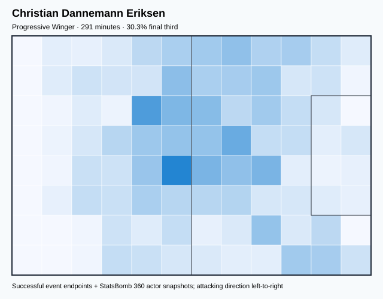

## Physical profile

| Metric | Score |
|---|---:|
| Aerial dominance | 0.250 |
| Pressing intensity per 90 | 10.83 |
| Recovery index per 90 | 4.95 |

## Top chemistry partners

- Andreas Christensen — synergy 0.624, 291 shared minutes
- Pierre-Emile Højbjerg — synergy 0.619, 291 shared minutes
- Joakim Mæhle — synergy 0.593, 264 shared minutes

## Tactical recommendations

- Lead the first pressing trigger and protect the inside passing lane.
- Use recovery capacity to support higher attacking positions.

_The heatmap combines successful event endpoints with StatsBomb 360 actor
snapshots. StatsBomb 360 is freeze-frame context, not continuous player
tracking. Ratings include eligible outfield players from 45 minutes and
goalkeepers from 90 minutes; ranking status communicates sample reliability._

---

<!-- PLAYER_REPORT 2: 3570_starter_report.md -->

# Pierre-Emile Højbjerg — Starter Report

- Team: Denmark (DEN)
- Position: Right Center Midfield
- Functional role: Holding Anchor
- VAEP offense per 90: 0.0435
- VAEP defense per 90: -0.0518
- VAEP total per 90: -0.0084
- VAEP per touch: -0.00004
- Spatial xT per 90: 0.0548
- Final-third spatial share: 14.4%
- Unified final player rating: 0.0682
- Team rank: #11

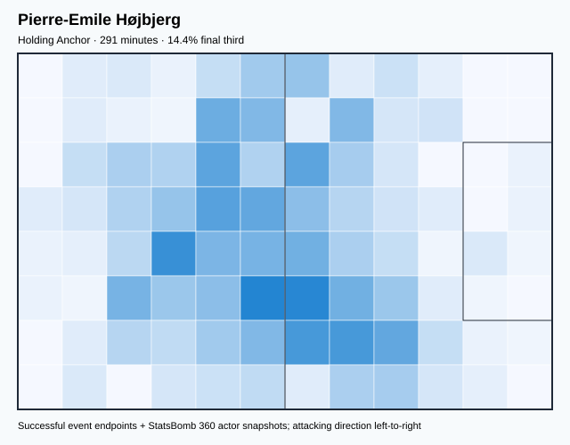

## Physical profile

| Metric | Score |
|---|---:|
| Aerial dominance | 0.000 |
| Pressing intensity per 90 | 11.45 |
| Recovery index per 90 | 5.57 |

## Top chemistry partners

- Andreas Christensen — synergy 0.646, 291 shared minutes
- Joachim Andersen — synergy 0.640, 291 shared minutes
- Christian Dannemann Eriksen — synergy 0.619, 291 shared minutes

## Tactical recommendations

- Lead the first pressing trigger and protect the inside passing lane.
- Avoid isolating this player in high-volume aerial matchups.
- Use recovery capacity to support higher attacking positions.

_The heatmap combines successful event endpoints with StatsBomb 360 actor
snapshots. StatsBomb 360 is freeze-frame context, not continuous player
tracking. Ratings include eligible outfield players from 45 minutes and
goalkeepers from 90 minutes; ranking status communicates sample reliability._

---

<!-- PLAYER_REPORT 3: 3815_starter_report.md -->

# Kasper Schmeichel — Starter Report

- Team: Denmark (DEN)
- Position: Goalkeeper
- Functional role: Goalkeeper
- VAEP offense per 90: -0.0036
- VAEP defense per 90: -0.1227
- VAEP total per 90: -0.1263
- VAEP per touch: -0.00221
- Spatial xT per 90: 0.0245
- Final-third spatial share: 2.0%
- Unified final player rating: -0.0603
- Team rank: #18

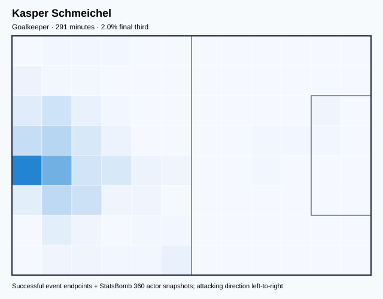

## Physical profile

| Metric | Score |
|---|---:|
| Aerial dominance | 0.000 |
| Pressing intensity per 90 | 0.00 |
| Recovery index per 90 | 4.64 |

## Top chemistry partners

- Joachim Andersen — synergy 0.650, 291 shared minutes
- Andreas Christensen — synergy 0.649, 291 shared minutes
- Pierre-Emile Højbjerg — synergy 0.585, 291 shared minutes

## Tactical recommendations

- Use a compact pressing trigger rather than sustained solo pressure.
- Avoid isolating this player in high-volume aerial matchups.
- Use recovery capacity to support higher attacking positions.

_The heatmap combines successful event endpoints with StatsBomb 360 actor
snapshots. StatsBomb 360 is freeze-frame context, not continuous player
tracking. Ratings include eligible outfield players from 45 minutes and
goalkeepers from 90 minutes; ranking status communicates sample reliability._

---

<!-- PLAYER_REPORT 4: 3959_starter_report.md -->

# Andreas Christensen — Starter Report

- Team: Denmark (DEN)
- Position: Left Center Back
- Functional role: Ball-Playing Centre-Back
- VAEP offense per 90: 0.1167
- VAEP defense per 90: 0.0053
- VAEP total per 90: 0.1221
- VAEP per touch: 0.00057
- Spatial xT per 90: 0.0153
- Final-third spatial share: 3.4%
- Unified final player rating: 0.0197
- Team rank: #14

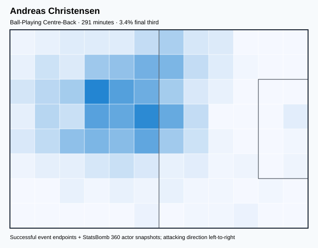

## Physical profile

| Metric | Score |
|---|---:|
| Aerial dominance | 0.615 |
| Pressing intensity per 90 | 5.26 |
| Recovery index per 90 | 3.40 |

## Top chemistry partners

- Kasper Schmeichel — synergy 0.649, 291 shared minutes
- Pierre-Emile Højbjerg — synergy 0.646, 291 shared minutes
- Joachim Andersen — synergy 0.643, 291 shared minutes

## Tactical recommendations

- Use a compact pressing trigger rather than sustained solo pressure.
- Target this player on direct restarts and back-post deliveries.
- Use recovery capacity to support higher attacking positions.

_The heatmap combines successful event endpoints with StatsBomb 360 actor
snapshots. StatsBomb 360 is freeze-frame context, not continuous player
tracking. Ratings include eligible outfield players from 45 minutes and
goalkeepers from 90 minutes; ranking status communicates sample reliability._

---

<!-- PLAYER_REPORT 5: 4447_starter_report.md -->

# Martin Braithwaite Christensen — Starter Report

- Team: Denmark (DEN)
- Position: Center Forward
- Functional role: Target Forward
- VAEP offense per 90: 0.2998
- VAEP defense per 90: 0.0075
- VAEP total per 90: 0.3073
- VAEP per touch: 0.00410
- Spatial xT per 90: -0.0010
- Final-third spatial share: 48.6%
- Unified final player rating: 0.2225
- Team rank: #3

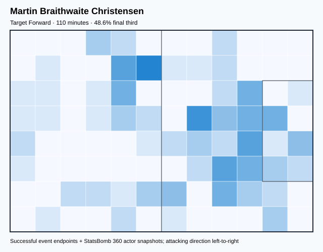

## Physical profile

| Metric | Score |
|---|---:|
| Aerial dominance | 0.200 |
| Pressing intensity per 90 | 12.23 |
| Recovery index per 90 | 0.82 |

## Top chemistry partners

- Pierre-Emile Højbjerg — synergy 0.277, 110 shared minutes
- Rasmus Nissen Kristensen — synergy 0.269, 92 shared minutes
- Andreas Christensen — synergy 0.260, 110 shared minutes

## Tactical recommendations

- Lead the first pressing trigger and protect the inside passing lane.
- Pair with a faster recovery defender after aggressive rotations.

_The heatmap combines successful event endpoints with StatsBomb 360 actor
snapshots. StatsBomb 360 is freeze-frame context, not continuous player
tracking. Ratings include eligible outfield players from 45 minutes and
goalkeepers from 90 minutes; ranking status communicates sample reliability._

---

<!-- PLAYER_REPORT 6: 5527_starter_report.md -->

# Thomas Delaney — Starter Report

- Team: Denmark (DEN)
- Position: Center Defensive Midfield
- Functional role: Holding Anchor
- VAEP offense per 90: 0.2231
- VAEP defense per 90: 0.0098
- VAEP total per 90: 0.2329
- VAEP per touch: 0.00134
- Spatial xT per 90: 0.0261
- Final-third spatial share: 22.8%
- Unified final player rating: 0.0309
- Team rank: #13

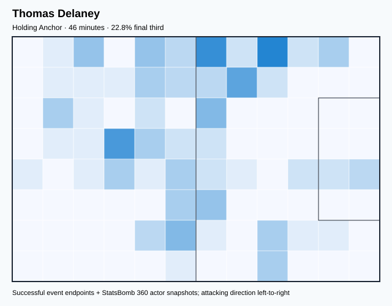

## Physical profile

| Metric | Score |
|---|---:|
| Aerial dominance | 1.000 |
| Pressing intensity per 90 | 21.74 |
| Recovery index per 90 | 5.93 |

## Top chemistry partners

- Andreas Christensen — synergy 0.150, 46 shared minutes
- Simon Thorup Kjær — synergy 0.149, 46 shared minutes
- Pierre-Emile Højbjerg — synergy 0.146, 46 shared minutes

## Tactical recommendations

- Lead the first pressing trigger and protect the inside passing lane.
- Target this player on direct restarts and back-post deliveries.
- Use recovery capacity to support higher attacking positions.

_The heatmap combines successful event endpoints with StatsBomb 360 actor
snapshots. StatsBomb 360 is freeze-frame context, not continuous player
tracking. Ratings include eligible outfield players from 45 minutes and
goalkeepers from 90 minutes; ranking status communicates sample reliability._

---

<!-- PLAYER_REPORT 7: 5534_starter_report.md -->

# Simon Thorup Kjær — Starter Report

- Team: Denmark (DEN)
- Position: Center Back
- Functional role: Ball-Playing Centre-Back
- VAEP offense per 90: 0.0039
- VAEP defense per 90: -0.0540
- VAEP total per 90: -0.0501
- VAEP per touch: -0.00024
- Spatial xT per 90: 0.0644
- Final-third spatial share: 2.3%
- Unified final player rating: -0.0095
- Team rank: #16

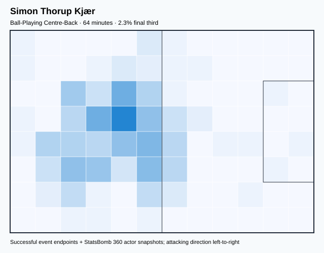

## Physical profile

| Metric | Score |
|---|---:|
| Aerial dominance | 0.750 |
| Pressing intensity per 90 | 8.44 |
| Recovery index per 90 | 4.22 |

## Top chemistry partners

- Christian Dannemann Eriksen — synergy 0.206, 64 shared minutes
- Pierre-Emile Højbjerg — synergy 0.205, 64 shared minutes
- Joachim Andersen — synergy 0.205, 64 shared minutes

## Tactical recommendations

- Use a compact pressing trigger rather than sustained solo pressure.
- Target this player on direct restarts and back-post deliveries.
- Use recovery capacity to support higher attacking positions.

_The heatmap combines successful event endpoints with StatsBomb 360 actor
snapshots. StatsBomb 360 is freeze-frame context, not continuous player
tracking. Ratings include eligible outfield players from 45 minutes and
goalkeepers from 90 minutes; ranking status communicates sample reliability._

---

<!-- PLAYER_REPORT 8: 5732_starter_report.md -->

# Andreas Evald Cornelius — Starter Report

- Team: Denmark (DEN)
- Position: Center Forward
- Functional role: Target Forward / Penalty-Box Anchor
- VAEP offense per 90: 1.1014
- VAEP defense per 90: 0.2938
- VAEP total per 90: 1.3952
- VAEP per touch: 0.01280
- Spatial xT per 90: -0.0847
- Final-third spatial share: 53.5%
- Unified final player rating: 0.3233
- Team rank: #1

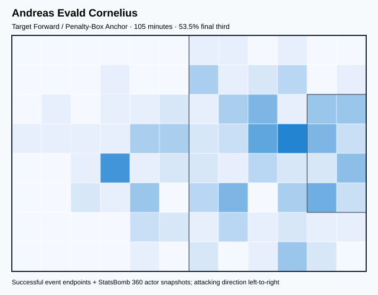

## Physical profile

| Metric | Score |
|---|---:|
| Aerial dominance | 0.550 |
| Pressing intensity per 90 | 15.45 |
| Recovery index per 90 | 2.58 |

## Top chemistry partners

- Mikkel Damsgaard — synergy 0.306, 105 shared minutes
- Christian Dannemann Eriksen — synergy 0.290, 105 shared minutes
- Pierre-Emile Højbjerg — synergy 0.285, 105 shared minutes

## Tactical recommendations

- Lead the first pressing trigger and protect the inside passing lane.
- Use recovery capacity to support higher attacking positions.

_The heatmap combines successful event endpoints with StatsBomb 360 actor
snapshots. StatsBomb 360 is freeze-frame context, not continuous player
tracking. Ratings include eligible outfield players from 45 minutes and
goalkeepers from 90 minutes; ranking status communicates sample reliability._

---

<!-- PLAYER_REPORT 9: 6302_starter_report.md -->

# Kasper Dolberg — Starter Report

- Team: Denmark (DEN)
- Position: Left Center Forward
- Functional role: Ball-Winner
- VAEP offense per 90: 0.5692
- VAEP defense per 90: 0.0237
- VAEP total per 90: 0.5929
- VAEP per touch: 0.00779
- Spatial xT per 90: 0.0440
- Final-third spatial share: 55.4%
- Unified final player rating: 0.2542
- Team rank: #2

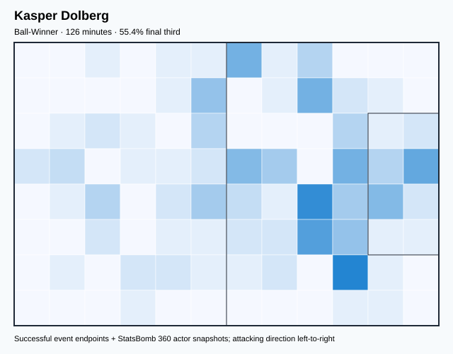

## Physical profile

| Metric | Score |
|---|---:|
| Aerial dominance | 0.333 |
| Pressing intensity per 90 | 17.08 |
| Recovery index per 90 | 2.13 |

## Top chemistry partners

- Pierre-Emile Højbjerg — synergy 0.354, 126 shared minutes
- Andreas Christensen — synergy 0.343, 126 shared minutes
- Christian Dannemann Eriksen — synergy 0.304, 126 shared minutes

## Tactical recommendations

- Lead the first pressing trigger and protect the inside passing lane.
- Pair with a faster recovery defender after aggressive rotations.

_The heatmap combines successful event endpoints with StatsBomb 360 actor
snapshots. StatsBomb 360 is freeze-frame context, not continuous player
tracking. Ratings include eligible outfield players from 45 minutes and
goalkeepers from 90 minutes; ranking status communicates sample reliability._

---

<!-- PLAYER_REPORT 10: 8247_starter_report.md -->

# Joachim Andersen — Starter Report

- Team: Denmark (DEN)
- Position: Right Center Back
- Functional role: Sweeper CB
- VAEP offense per 90: 0.1083
- VAEP defense per 90: -0.0730
- VAEP total per 90: 0.0353
- VAEP per touch: 0.00018
- Spatial xT per 90: 0.0429
- Final-third spatial share: 8.5%
- Unified final player rating: 0.0048
- Team rank: #15

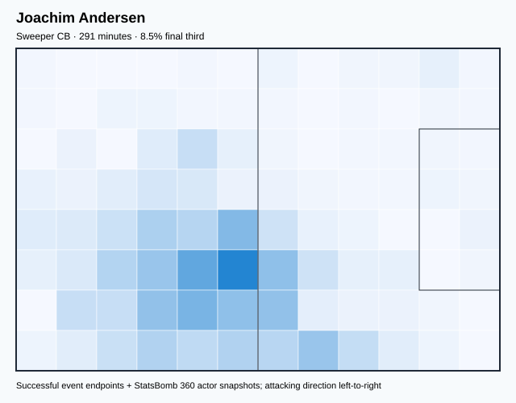

## Physical profile

| Metric | Score |
|---|---:|
| Aerial dominance | 0.667 |
| Pressing intensity per 90 | 8.98 |
| Recovery index per 90 | 4.02 |

## Top chemistry partners

- Kasper Schmeichel — synergy 0.650, 291 shared minutes
- Andreas Christensen — synergy 0.643, 291 shared minutes
- Pierre-Emile Højbjerg — synergy 0.640, 291 shared minutes

## Tactical recommendations

- Use a compact pressing trigger rather than sustained solo pressure.
- Target this player on direct restarts and back-post deliveries.
- Use recovery capacity to support higher attacking positions.

_The heatmap combines successful event endpoints with StatsBomb 360 actor
snapshots. StatsBomb 360 is freeze-frame context, not continuous player
tracking. Ratings include eligible outfield players from 45 minutes and
goalkeepers from 90 minutes; ranking status communicates sample reliability._

---

<!-- PLAYER_REPORT 11: 16190_starter_report.md -->

# Rasmus Nissen Kristensen — Starter Report

- Team: Denmark (DEN)
- Position: Right Wing Back
- Functional role: Attacking Wingback
- VAEP offense per 90: 0.1805
- VAEP defense per 90: 0.0058
- VAEP total per 90: 0.1863
- VAEP per touch: 0.00104
- Spatial xT per 90: 0.0737
- Final-third spatial share: 36.5%
- Unified final player rating: 0.0723
- Team rank: #10

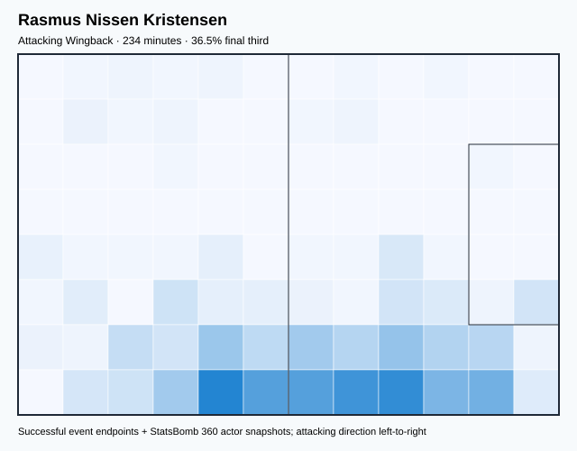

## Physical profile

| Metric | Score |
|---|---:|
| Aerial dominance | 0.500 |
| Pressing intensity per 90 | 10.38 |
| Recovery index per 90 | 1.15 |

## Top chemistry partners

- Joachim Andersen — synergy 0.550, 234 shared minutes
- Kasper Schmeichel — synergy 0.543, 234 shared minutes
- Christian Dannemann Eriksen — synergy 0.528, 234 shared minutes

## Tactical recommendations

- Use a compact pressing trigger rather than sustained solo pressure.
- Pair with a faster recovery defender after aggressive rotations.

_The heatmap combines successful event endpoints with StatsBomb 360 actor
snapshots. StatsBomb 360 is freeze-frame context, not continuous player
tracking. Ratings include eligible outfield players from 45 minutes and
goalkeepers from 90 minutes; ranking status communicates sample reliability._

---

<!-- PLAYER_REPORT 12: 16554_starter_report.md -->

# Joakim Mæhle — Starter Report

- Team: Denmark (DEN)
- Position: Left Wing Back
- Functional role: Attacking Wingback
- VAEP offense per 90: 0.2517
- VAEP defense per 90: -0.0489
- VAEP total per 90: 0.2028
- VAEP per touch: 0.00145
- Spatial xT per 90: 0.0558
- Final-third spatial share: 40.2%
- Unified final player rating: 0.0756
- Team rank: #9

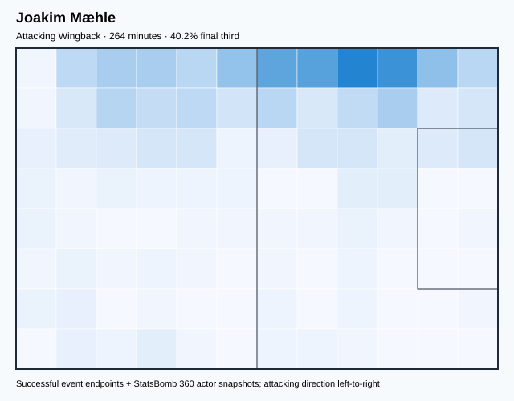

## Physical profile

| Metric | Score |
|---|---:|
| Aerial dominance | 0.182 |
| Pressing intensity per 90 | 11.59 |
| Recovery index per 90 | 3.41 |

## Top chemistry partners

- Joachim Andersen — synergy 0.594, 264 shared minutes
- Christian Dannemann Eriksen — synergy 0.593, 264 shared minutes
- Andreas Christensen — synergy 0.593, 264 shared minutes

## Tactical recommendations

- Lead the first pressing trigger and protect the inside passing lane.
- Avoid isolating this player in high-volume aerial matchups.
- Use recovery capacity to support higher attacking positions.

_The heatmap combines successful event endpoints with StatsBomb 360 actor
snapshots. StatsBomb 360 is freeze-frame context, not continuous player
tracking. Ratings include eligible outfield players from 45 minutes and
goalkeepers from 90 minutes; ranking status communicates sample reliability._

---

<!-- PLAYER_REPORT 13: 17042_starter_report.md -->

# Andreas Skov Olsen — Starter Report

- Team: Denmark (DEN)
- Position: Right Wing
- Functional role: Progressive Winger
- VAEP offense per 90: 0.5692
- VAEP defense per 90: -0.0469
- VAEP total per 90: 0.5223
- VAEP per touch: 0.00367
- Spatial xT per 90: 0.0298
- Final-third spatial share: 61.3%
- Unified final player rating: 0.1975
- Team rank: #4

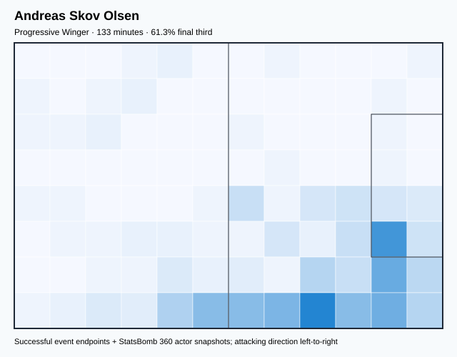

## Physical profile

| Metric | Score |
|---|---:|
| Aerial dominance | 0.167 |
| Pressing intensity per 90 | 12.82 |
| Recovery index per 90 | 1.35 |

## Top chemistry partners

- Joakim Mæhle — synergy 0.358, 133 shared minutes
- Andreas Christensen — synergy 0.352, 133 shared minutes
- Pierre-Emile Højbjerg — synergy 0.326, 133 shared minutes

## Tactical recommendations

- Lead the first pressing trigger and protect the inside passing lane.
- Avoid isolating this player in high-volume aerial matchups.
- Pair with a faster recovery defender after aggressive rotations.

_The heatmap combines successful event endpoints with StatsBomb 360 actor
snapshots. StatsBomb 360 is freeze-frame context, not continuous player
tracking. Ratings include eligible outfield players from 45 minutes and
goalkeepers from 90 minutes; ranking status communicates sample reliability._

---

<!-- PLAYER_REPORT 14: 17043_starter_report.md -->

# Victor Nelsson — Starter Report

- Team: Denmark (DEN)
- Position: Left Center Back
- Functional role: Sweeper CB
- VAEP offense per 90: 0.0059
- VAEP defense per 90: -0.0384
- VAEP total per 90: -0.0324
- VAEP per touch: -0.00019
- Spatial xT per 90: 0.0119
- Final-third spatial share: 10.2%
- Unified final player rating: -0.0100
- Team rank: #17

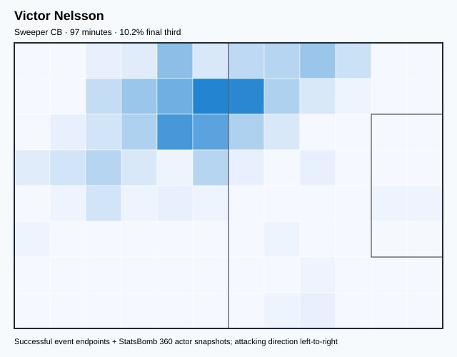

## Physical profile

| Metric | Score |
|---|---:|
| Aerial dominance | 0.600 |
| Pressing intensity per 90 | 7.41 |
| Recovery index per 90 | 3.71 |

## Top chemistry partners

- Andreas Christensen — synergy 0.299, 97 shared minutes
- Joakim Mæhle — synergy 0.295, 97 shared minutes
- Christian Dannemann Eriksen — synergy 0.294, 97 shared minutes

## Tactical recommendations

- Use a compact pressing trigger rather than sustained solo pressure.
- Target this player on direct restarts and back-post deliveries.
- Use recovery capacity to support higher attacking positions.

_The heatmap combines successful event endpoints with StatsBomb 360 actor
snapshots. StatsBomb 360 is freeze-frame context, not continuous player
tracking. Ratings include eligible outfield players from 45 minutes and
goalkeepers from 90 minutes; ranking status communicates sample reliability._

---

<!-- PLAYER_REPORT 15: 18722_starter_report.md -->

# Mathias Jensen — Starter Report

- Team: Denmark (DEN)
- Position: Right Center Midfield
- Functional role: Progressive Winger
- VAEP offense per 90: 0.4742
- VAEP defense per 90: 0.0995
- VAEP total per 90: 0.5738
- VAEP per touch: 0.00285
- Spatial xT per 90: 0.0838
- Final-third spatial share: 27.2%
- Unified final player rating: 0.1413
- Team rank: #6

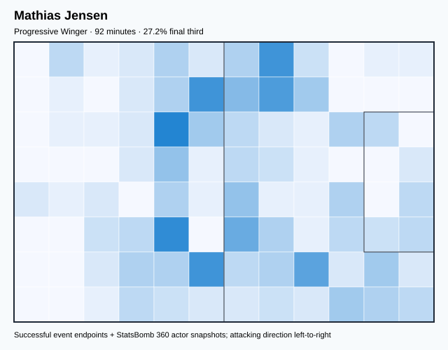

## Physical profile

| Metric | Score |
|---|---:|
| Aerial dominance | 0.000 |
| Pressing intensity per 90 | 10.75 |
| Recovery index per 90 | 0.00 |

## Top chemistry partners

- Pierre-Emile Højbjerg — synergy 0.281, 92 shared minutes
- Kasper Schmeichel — synergy 0.272, 92 shared minutes
- Andreas Christensen — synergy 0.271, 92 shared minutes

## Tactical recommendations

- Use a compact pressing trigger rather than sustained solo pressure.
- Avoid isolating this player in high-volume aerial matchups.
- Pair with a faster recovery defender after aggressive rotations.

_The heatmap combines successful event endpoints with StatsBomb 360 actor
snapshots. StatsBomb 360 is freeze-frame context, not continuous player
tracking. Ratings include eligible outfield players from 45 minutes and
goalkeepers from 90 minutes; ranking status communicates sample reliability._

---

<!-- PLAYER_REPORT 16: 24443_starter_report.md -->

# Mikkel Damsgaard — Starter Report

- Team: Denmark (DEN)
- Position: Left Wing
- Functional role: Wide Creator
- VAEP offense per 90: 0.0952
- VAEP defense per 90: -0.1286
- VAEP total per 90: -0.0334
- VAEP per touch: -0.00028
- Spatial xT per 90: 0.0725
- Final-third spatial share: 32.2%
- Unified final player rating: 0.1291
- Team rank: #7

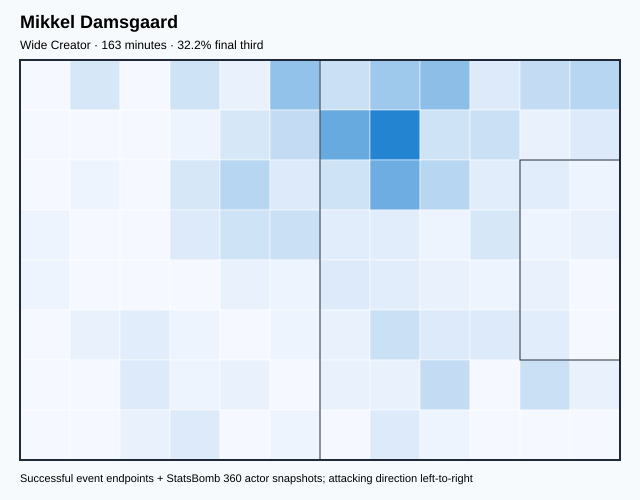

## Physical profile

| Metric | Score |
|---|---:|
| Aerial dominance | 0.000 |
| Pressing intensity per 90 | 19.38 |
| Recovery index per 90 | 3.88 |

## Top chemistry partners

- Pierre-Emile Højbjerg — synergy 0.439, 163 shared minutes
- Andreas Christensen — synergy 0.437, 163 shared minutes
- Joachim Andersen — synergy 0.420, 163 shared minutes

## Tactical recommendations

- Lead the first pressing trigger and protect the inside passing lane.
- Avoid isolating this player in high-volume aerial matchups.
- Use recovery capacity to support higher attacking positions.

_The heatmap combines successful event endpoints with StatsBomb 360 actor
snapshots. StatsBomb 360 is freeze-frame context, not continuous player
tracking. Ratings include eligible outfield players from 45 minutes and
goalkeepers from 90 minutes; ranking status communicates sample reliability._

---

<!-- PLAYER_REPORT 17: 24547_starter_report.md -->

# Alexander Hartmann Bah — Starter Report

- Team: Denmark (DEN)
- Position: Right Back
- Functional role: Attacking Wingback
- VAEP offense per 90: 0.2758
- VAEP defense per 90: -0.0246
- VAEP total per 90: 0.2513
- VAEP per touch: 0.00116
- Spatial xT per 90: 0.1632
- Final-third spatial share: 42.2%
- Unified final player rating: 0.0654
- Team rank: #12

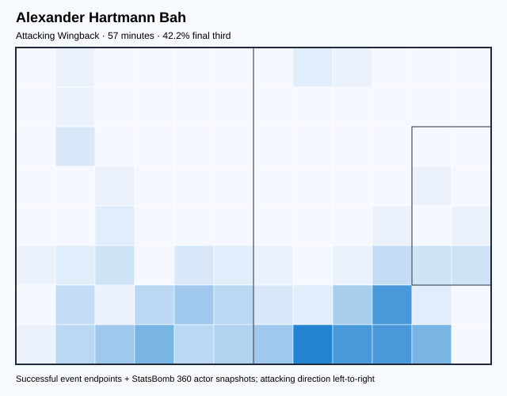

## Physical profile

| Metric | Score |
|---|---:|
| Aerial dominance | 1.000 |
| Pressing intensity per 90 | 15.91 |
| Recovery index per 90 | 4.77 |

## Top chemistry partners

- Joachim Andersen — synergy 0.181, 57 shared minutes
- Pierre-Emile Højbjerg — synergy 0.181, 57 shared minutes
- Andreas Christensen — synergy 0.177, 57 shared minutes

## Tactical recommendations

- Lead the first pressing trigger and protect the inside passing lane.
- Target this player on direct restarts and back-post deliveries.
- Use recovery capacity to support higher attacking positions.

_The heatmap combines successful event endpoints with StatsBomb 360 actor
snapshots. StatsBomb 360 is freeze-frame context, not continuous player
tracking. Ratings include eligible outfield players from 45 minutes and
goalkeepers from 90 minutes; ranking status communicates sample reliability._

---

<!-- PLAYER_REPORT 18: 27569_starter_report.md -->

# Jesper Lindstrøm — Starter Report

- Team: Denmark (DEN)
- Position: Left Wing
- Functional role: Progressive Winger
- VAEP offense per 90: 0.2736
- VAEP defense per 90: -0.0659
- VAEP total per 90: 0.2078
- VAEP per touch: 0.00210
- Spatial xT per 90: 0.0545
- Final-third spatial share: 55.8%
- Unified final player rating: 0.1569
- Team rank: #5

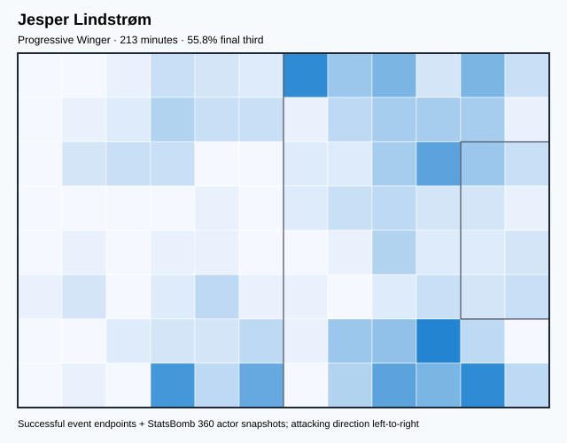

## Physical profile

| Metric | Score |
|---|---:|
| Aerial dominance | 0.167 |
| Pressing intensity per 90 | 17.71 |
| Recovery index per 90 | 0.84 |

## Top chemistry partners

- Christian Dannemann Eriksen — synergy 0.485, 213 shared minutes
- Kasper Schmeichel — synergy 0.483, 213 shared minutes
- Pierre-Emile Højbjerg — synergy 0.438, 213 shared minutes

## Tactical recommendations

- Lead the first pressing trigger and protect the inside passing lane.
- Avoid isolating this player in high-volume aerial matchups.
- Pair with a faster recovery defender after aggressive rotations.

_The heatmap combines successful event endpoints with StatsBomb 360 actor
snapshots. StatsBomb 360 is freeze-frame context, not continuous player
tracking. Ratings include eligible outfield players from 45 minutes and
goalkeepers from 90 minutes; ranking status communicates sample reliability._
