# ECU — V4 Player Evaluation Collection

<!-- V5_CANONICAL_NOTICE -->
> **Historical V4 player-rating packet.** Player ratings, ranks, role-challenger decisions, and rating uncertainty below are superseded by `results/reports/player_rankings.csv`, `results/reports/player_profiles/`, and `results/reports/model_summary.md`. Possession, tactical, and match-bootstrap material remains a historical V4 result.

- Included eligible players: 16
- Rankings use the role-aware, development-gated VAEP/xT/xD model.
- Heatmaps combine successful on-ball endpoints and SB360 actor snapshots.

---

<!-- PLAYER_REPORT 1: 12583_starter_report.md -->

# Carlos Armando Gruezo Arboleda — Starter Report

- Team: Ecuador (ECU)
- Position: Center Defensive Midfield
- Functional role: Holding Anchor
- VAEP offense per 90: 0.0029
- VAEP defense per 90: -0.0033
- VAEP total per 90: -0.0004
- VAEP per touch: -0.00001
- Spatial xT per 90: 0.0113
- Final-third spatial share: 5.3%
- Unified final player rating: 0.0199
- Team rank: #11

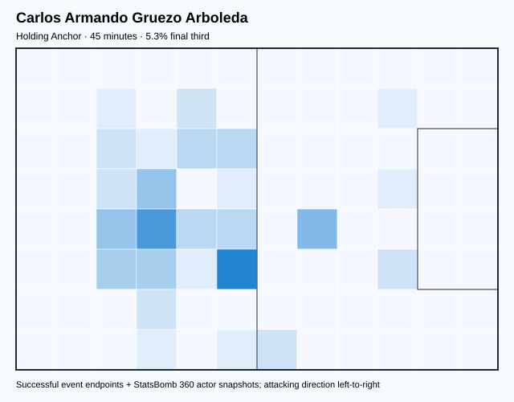

## Physical profile

| Metric | Score |
|---|---:|
| Aerial dominance | 0.000 |
| Pressing intensity per 90 | 20.00 |
| Recovery index per 90 | 0.00 |

## Top chemistry partners

- Gonzalo Jordy Plata Jiménez — synergy 0.145, 45 shared minutes
- Piero Martín Hincapié Reyna — synergy 0.145, 45 shared minutes
- Felix Eduardo Torres Caicedo — synergy 0.145, 45 shared minutes

## Tactical recommendations

- Lead the first pressing trigger and protect the inside passing lane.
- Avoid isolating this player in high-volume aerial matchups.
- Pair with a faster recovery defender after aggressive rotations.

_The heatmap combines successful event endpoints with StatsBomb 360 actor
snapshots. StatsBomb 360 is freeze-frame context, not continuous player
tracking. Ratings include eligible outfield players from 45 minutes and
goalkeepers from 90 minutes; ranking status communicates sample reliability._

---

<!-- PLAYER_REPORT 2: 12803_starter_report.md -->

# Romario Andrés Ibarra Mina — Starter Report

- Team: Ecuador (ECU)
- Position: Left Midfield
- Functional role: Wide Creator
- VAEP offense per 90: 0.2310
- VAEP defense per 90: 0.0060
- VAEP total per 90: 0.2370
- VAEP per touch: 0.00315
- Spatial xT per 90: 0.0522
- Final-third spatial share: 36.9%
- Unified final player rating: 0.1110
- Team rank: #5

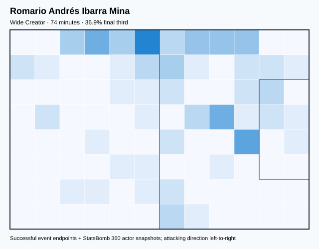

## Physical profile

| Metric | Score |
|---|---:|
| Aerial dominance | 0.000 |
| Pressing intensity per 90 | 14.58 |
| Recovery index per 90 | 6.07 |

## Top chemistry partners

- Angelo Smit Preciado Quiñónez — synergy 0.223, 74 shared minutes
- Piero Martín Hincapié Reyna — synergy 0.220, 74 shared minutes
- Felix Eduardo Torres Caicedo — synergy 0.212, 74 shared minutes

## Tactical recommendations

- Lead the first pressing trigger and protect the inside passing lane.
- Avoid isolating this player in high-volume aerial matchups.
- Use recovery capacity to support higher attacking positions.

_The heatmap combines successful event endpoints with StatsBomb 360 actor
snapshots. StatsBomb 360 is freeze-frame context, not continuous player
tracking. Ratings include eligible outfield players from 45 minutes and
goalkeepers from 90 minutes; ranking status communicates sample reliability._

---

<!-- PLAYER_REPORT 3: 23830_starter_report.md -->

# Jhegson Sebastián Méndez Carabalí — Starter Report

- Team: Ecuador (ECU)
- Position: Right Defensive Midfield
- Functional role: Holding Anchor
- VAEP offense per 90: 0.0128
- VAEP defense per 90: -0.1098
- VAEP total per 90: -0.0969
- VAEP per touch: -0.00056
- Spatial xT per 90: 0.0113
- Final-third spatial share: 5.1%
- Unified final player rating: 0.0014
- Team rank: #13

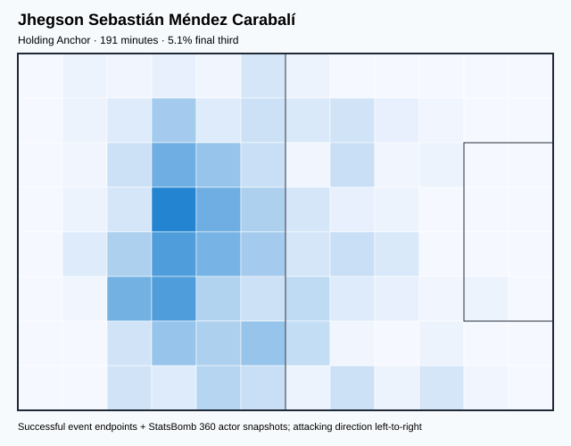

## Physical profile

| Metric | Score |
|---|---:|
| Aerial dominance | 0.500 |
| Pressing intensity per 90 | 14.10 |
| Recovery index per 90 | 6.11 |

## Top chemistry partners

- Felix Eduardo Torres Caicedo — synergy 0.503, 191 shared minutes
- Piero Martín Hincapié Reyna — synergy 0.486, 191 shared minutes
- Angelo Smit Preciado Quiñónez — synergy 0.473, 191 shared minutes

## Tactical recommendations

- Lead the first pressing trigger and protect the inside passing lane.
- Use recovery capacity to support higher attacking positions.

_The heatmap combines successful event endpoints with StatsBomb 360 actor
snapshots. StatsBomb 360 is freeze-frame context, not continuous player
tracking. Ratings include eligible outfield players from 45 minutes and
goalkeepers from 90 minutes; ranking status communicates sample reliability._

---

<!-- PLAYER_REPORT 4: 24085_starter_report.md -->

# Pervis Josué Estupiñán Tenorio — Starter Report

- Team: Ecuador (ECU)
- Position: Left Back
- Functional role: Attacking Wingback
- VAEP offense per 90: 0.2198
- VAEP defense per 90: 0.0299
- VAEP total per 90: 0.2496
- VAEP per touch: 0.00165
- Spatial xT per 90: 0.0881
- Final-third spatial share: 24.1%
- Unified final player rating: 0.0885
- Team rank: #7

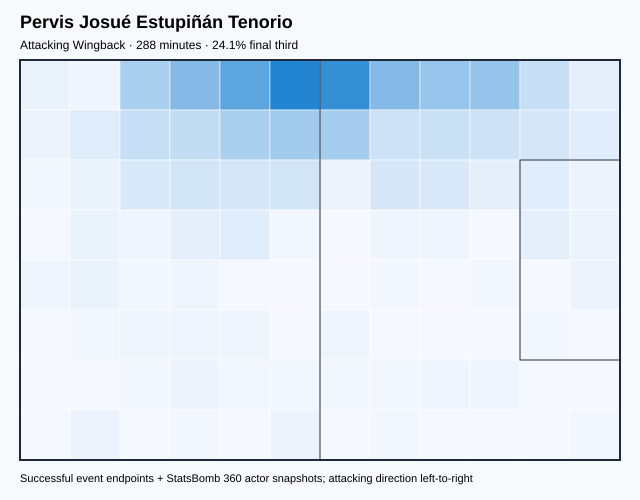

## Physical profile

| Metric | Score |
|---|---:|
| Aerial dominance | 0.571 |
| Pressing intensity per 90 | 12.80 |
| Recovery index per 90 | 5.31 |

## Top chemistry partners

- Piero Martín Hincapié Reyna — synergy 0.620, 288 shared minutes
- Hernán Ismael Galíndez — synergy 0.614, 288 shared minutes
- Moisés Isaac Caicedo Corozo — synergy 0.599, 283 shared minutes

## Tactical recommendations

- Lead the first pressing trigger and protect the inside passing lane.
- Target this player on direct restarts and back-post deliveries.
- Use recovery capacity to support higher attacking positions.

_The heatmap combines successful event endpoints with StatsBomb 360 actor
snapshots. StatsBomb 360 is freeze-frame context, not continuous player
tracking. Ratings include eligible outfield players from 45 minutes and
goalkeepers from 90 minutes; ranking status communicates sample reliability._

---

<!-- PLAYER_REPORT 5: 28559_starter_report.md -->

# Enner Remberto Valencia Lastra — Starter Report

- Team: Ecuador (ECU)
- Position: Left Wing
- Functional role: Target Forward
- VAEP offense per 90: 0.3739
- VAEP defense per 90: 0.2254
- VAEP total per 90: 0.5993
- VAEP per touch: 0.00621
- Spatial xT per 90: 0.0279
- Final-third spatial share: 48.1%
- Unified final player rating: 0.2246
- Team rank: #1

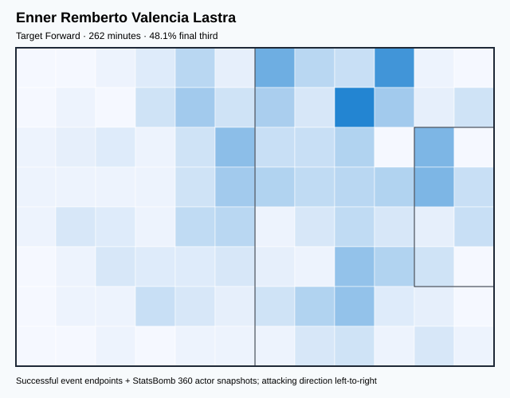

## Physical profile

| Metric | Score |
|---|---:|
| Aerial dominance | 0.176 |
| Pressing intensity per 90 | 13.40 |
| Recovery index per 90 | 3.44 |

## Top chemistry partners

- Moisés Isaac Caicedo Corozo — synergy 0.527, 262 shared minutes
- Pervis Josué Estupiñán Tenorio — synergy 0.468, 262 shared minutes
- Angelo Smit Preciado Quiñónez — synergy 0.465, 250 shared minutes

## Tactical recommendations

- Lead the first pressing trigger and protect the inside passing lane.
- Avoid isolating this player in high-volume aerial matchups.
- Use recovery capacity to support higher attacking positions.

_The heatmap combines successful event endpoints with StatsBomb 360 actor
snapshots. StatsBomb 360 is freeze-frame context, not continuous player
tracking. Ratings include eligible outfield players from 45 minutes and
goalkeepers from 90 minutes; ranking status communicates sample reliability._

---

<!-- PLAYER_REPORT 6: 30111_starter_report.md -->

# Felix Eduardo Torres Caicedo — Starter Report

- Team: Ecuador (ECU)
- Position: Right Center Back
- Functional role: Sweeper CB
- VAEP offense per 90: 0.0799
- VAEP defense per 90: -0.0303
- VAEP total per 90: 0.0496
- VAEP per touch: 0.00032
- Spatial xT per 90: 0.0026
- Final-third spatial share: 2.8%
- Unified final player rating: 0.0044
- Team rank: #12

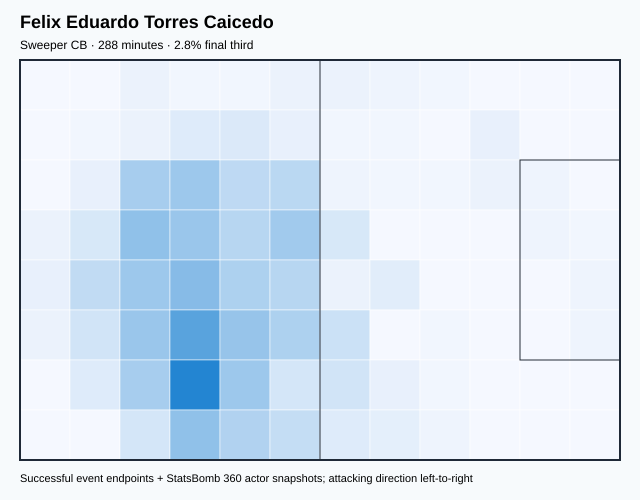

## Physical profile

| Metric | Score |
|---|---:|
| Aerial dominance | 0.800 |
| Pressing intensity per 90 | 4.68 |
| Recovery index per 90 | 1.87 |

## Top chemistry partners

- Piero Martín Hincapié Reyna — synergy 0.652, 288 shared minutes
- Hernán Ismael Galíndez — synergy 0.641, 288 shared minutes
- Angelo Smit Preciado Quiñónez — synergy 0.622, 276 shared minutes

## Tactical recommendations

- Use a compact pressing trigger rather than sustained solo pressure.
- Target this player on direct restarts and back-post deliveries.
- Pair with a faster recovery defender after aggressive rotations.

_The heatmap combines successful event endpoints with StatsBomb 360 actor
snapshots. StatsBomb 360 is freeze-frame context, not continuous player
tracking. Ratings include eligible outfield players from 45 minutes and
goalkeepers from 90 minutes; ranking status communicates sample reliability._

---

<!-- PLAYER_REPORT 7: 31152_starter_report.md -->

# Gonzalo Jordy Plata Jiménez — Starter Report

- Team: Ecuador (ECU)
- Position: Right Midfield
- Functional role: Box-to-Box / Engine Midfielder
- VAEP offense per 90: 0.2226
- VAEP defense per 90: 0.0228
- VAEP total per 90: 0.2455
- VAEP per touch: 0.00228
- Spatial xT per 90: 0.0597
- Final-third spatial share: 34.6%
- Unified final player rating: 0.1185
- Team rank: #3

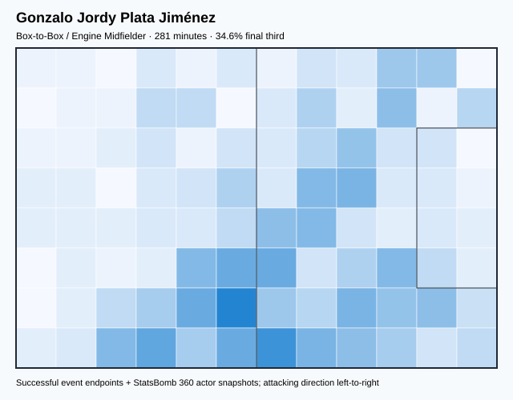

## Physical profile

| Metric | Score |
|---|---:|
| Aerial dominance | 0.417 |
| Pressing intensity per 90 | 23.99 |
| Recovery index per 90 | 2.56 |

## Top chemistry partners

- Angelo Smit Preciado Quiñónez — synergy 0.561, 269 shared minutes
- Felix Eduardo Torres Caicedo — synergy 0.552, 281 shared minutes
- Pervis Josué Estupiñán Tenorio — synergy 0.508, 281 shared minutes

## Tactical recommendations

- Lead the first pressing trigger and protect the inside passing lane.
- Use recovery capacity to support higher attacking positions.

_The heatmap combines successful event endpoints with StatsBomb 360 actor
snapshots. StatsBomb 360 is freeze-frame context, not continuous player
tracking. Ratings include eligible outfield players from 45 minutes and
goalkeepers from 90 minutes; ranking status communicates sample reliability._

---

<!-- PLAYER_REPORT 8: 34396_starter_report.md -->

# Michael Steveen Estrada Martínez — Starter Report

- Team: Ecuador (ECU)
- Position: Left Center Forward
- Functional role: Target Forward
- VAEP offense per 90: 0.2306
- VAEP defense per 90: 0.0379
- VAEP total per 90: 0.2685
- VAEP per touch: 0.00349
- Spatial xT per 90: 0.0007
- Final-third spatial share: 29.3%
- Unified final player rating: 0.2045
- Team rank: #2

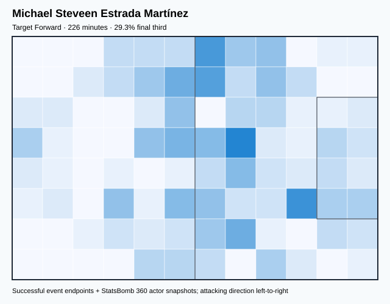

## Physical profile

| Metric | Score |
|---|---:|
| Aerial dominance | 0.321 |
| Pressing intensity per 90 | 14.35 |
| Recovery index per 90 | 1.59 |

## Top chemistry partners

- Piero Martín Hincapié Reyna — synergy 0.454, 226 shared minutes
- Moisés Isaac Caicedo Corozo — synergy 0.454, 226 shared minutes
- Felix Eduardo Torres Caicedo — synergy 0.447, 226 shared minutes

## Tactical recommendations

- Lead the first pressing trigger and protect the inside passing lane.
- Pair with a faster recovery defender after aggressive rotations.

_The heatmap combines successful event endpoints with StatsBomb 360 actor
snapshots. StatsBomb 360 is freeze-frame context, not continuous player
tracking. Ratings include eligible outfield players from 45 minutes and
goalkeepers from 90 minutes; ranking status communicates sample reliability._

---

<!-- PLAYER_REPORT 9: 36148_starter_report.md -->

# José Adoni Cifuentes Charcopa — Starter Report

- Team: Ecuador (ECU)
- Position: Right Defensive Midfield
- Functional role: Deep Playmaker
- VAEP offense per 90: 0.0790
- VAEP defense per 90: -0.0402
- VAEP total per 90: 0.0388
- VAEP per touch: 0.00025
- Spatial xT per 90: 0.0022
- Final-third spatial share: 22.2%
- Unified final player rating: 0.0214
- Team rank: #10

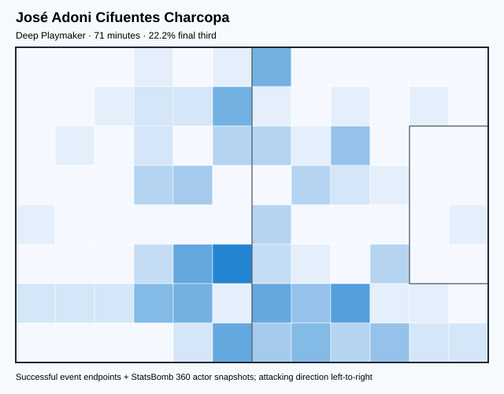

## Physical profile

| Metric | Score |
|---|---:|
| Aerial dominance | 0.000 |
| Pressing intensity per 90 | 18.93 |
| Recovery index per 90 | 2.52 |

## Top chemistry partners

- Pervis Josué Estupiñán Tenorio — synergy 0.219, 71 shared minutes
- Moisés Isaac Caicedo Corozo — synergy 0.211, 66 shared minutes
- Jeremy Leonel Sarmiento Morante — synergy 0.210, 71 shared minutes

## Tactical recommendations

- Lead the first pressing trigger and protect the inside passing lane.
- Avoid isolating this player in high-volume aerial matchups.
- Pair with a faster recovery defender after aggressive rotations.

_The heatmap combines successful event endpoints with StatsBomb 360 actor
snapshots. StatsBomb 360 is freeze-frame context, not continuous player
tracking. Ratings include eligible outfield players from 45 minutes and
goalkeepers from 90 minutes; ranking status communicates sample reliability._

---

<!-- PLAYER_REPORT 10: 37522_starter_report.md -->

# Hernán Ismael Galíndez — Starter Report

- Team: Ecuador (ECU)
- Position: Goalkeeper
- Functional role: Goalkeeper
- VAEP offense per 90: -0.0175
- VAEP defense per 90: -0.0900
- VAEP total per 90: -0.1075
- VAEP per touch: -0.00246
- Spatial xT per 90: 0.0018
- Final-third spatial share: 0.5%
- Unified final player rating: -0.0584
- Team rank: #16

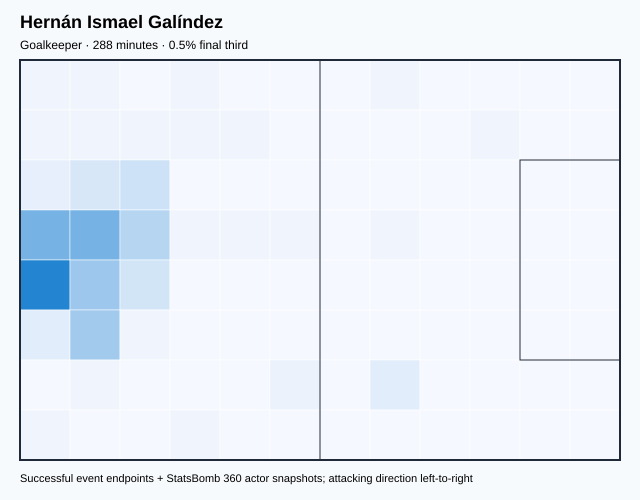

## Physical profile

| Metric | Score |
|---|---:|
| Aerial dominance | 0.000 |
| Pressing intensity per 90 | 0.00 |
| Recovery index per 90 | 4.06 |

## Top chemistry partners

- Felix Eduardo Torres Caicedo — synergy 0.641, 288 shared minutes
- Piero Martín Hincapié Reyna — synergy 0.628, 288 shared minutes
- Pervis Josué Estupiñán Tenorio — synergy 0.614, 288 shared minutes

## Tactical recommendations

- Use a compact pressing trigger rather than sustained solo pressure.
- Avoid isolating this player in high-volume aerial matchups.
- Use recovery capacity to support higher attacking positions.

_The heatmap combines successful event endpoints with StatsBomb 360 actor
snapshots. StatsBomb 360 is freeze-frame context, not continuous player
tracking. Ratings include eligible outfield players from 45 minutes and
goalkeepers from 90 minutes; ranking status communicates sample reliability._

---

<!-- PLAYER_REPORT 11: 37726_starter_report.md -->

# Moisés Isaac Caicedo Corozo — Starter Report

- Team: Ecuador (ECU)
- Position: Left Defensive Midfield
- Functional role: Holding Anchor
- VAEP offense per 90: 0.0808
- VAEP defense per 90: 0.0772
- VAEP total per 90: 0.1580
- VAEP per touch: 0.00124
- Spatial xT per 90: 0.0101
- Final-third spatial share: 18.1%
- Unified final player rating: 0.0447
- Team rank: #9

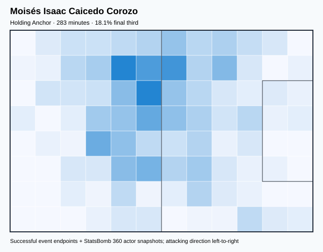

## Physical profile

| Metric | Score |
|---|---:|
| Aerial dominance | 0.800 |
| Pressing intensity per 90 | 14.95 |
| Recovery index per 90 | 4.77 |

## Top chemistry partners

- Piero Martín Hincapié Reyna — synergy 0.625, 283 shared minutes
- Felix Eduardo Torres Caicedo — synergy 0.610, 283 shared minutes
- Pervis Josué Estupiñán Tenorio — synergy 0.599, 283 shared minutes

## Tactical recommendations

- Lead the first pressing trigger and protect the inside passing lane.
- Target this player on direct restarts and back-post deliveries.
- Use recovery capacity to support higher attacking positions.

_The heatmap combines successful event endpoints with StatsBomb 360 actor
snapshots. StatsBomb 360 is freeze-frame context, not continuous player
tracking. Ratings include eligible outfield players from 45 minutes and
goalkeepers from 90 minutes; ranking status communicates sample reliability._

---

<!-- PLAYER_REPORT 12: 37737_starter_report.md -->

# Angelo Smit Preciado Quiñónez — Starter Report

- Team: Ecuador (ECU)
- Position: Right Wing Back
- Functional role: Deep Playmaker
- VAEP offense per 90: 0.0937
- VAEP defense per 90: 0.0174
- VAEP total per 90: 0.1111
- VAEP per touch: 0.00110
- Spatial xT per 90: 0.0685
- Final-third spatial share: 29.8%
- Unified final player rating: 0.0597
- Team rank: #8

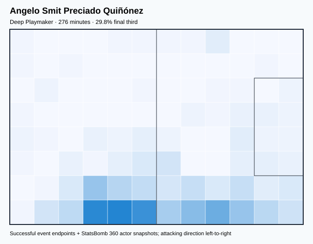

## Physical profile

| Metric | Score |
|---|---:|
| Aerial dominance | 0.429 |
| Pressing intensity per 90 | 15.31 |
| Recovery index per 90 | 5.21 |

## Top chemistry partners

- Felix Eduardo Torres Caicedo — synergy 0.622, 276 shared minutes
- Moisés Isaac Caicedo Corozo — synergy 0.565, 271 shared minutes
- Gonzalo Jordy Plata Jiménez — synergy 0.561, 269 shared minutes

## Tactical recommendations

- Lead the first pressing trigger and protect the inside passing lane.
- Use recovery capacity to support higher attacking positions.

_The heatmap combines successful event endpoints with StatsBomb 360 actor
snapshots. StatsBomb 360 is freeze-frame context, not continuous player
tracking. Ratings include eligible outfield players from 45 minutes and
goalkeepers from 90 minutes; ranking status communicates sample reliability._

---

<!-- PLAYER_REPORT 13: 37945_starter_report.md -->

# Alan Steven Franco Palma — Starter Report

- Team: Ecuador (ECU)
- Position: Right Center Midfield
- Functional role: Ball-Winner
- VAEP offense per 90: 0.0023
- VAEP defense per 90: -0.0065
- VAEP total per 90: -0.0042
- VAEP per touch: -0.00007
- Spatial xT per 90: -0.0000
- Final-third spatial share: 6.7%
- Unified final player rating: 0.0969
- Team rank: #6

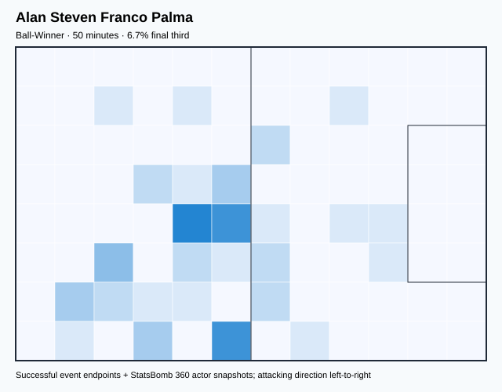

## Physical profile

| Metric | Score |
|---|---:|
| Aerial dominance | 0.000 |
| Pressing intensity per 90 | 21.42 |
| Recovery index per 90 | 1.79 |

## Top chemistry partners

- Angelo Smit Preciado Quiñónez — synergy 0.161, 50 shared minutes
- Gonzalo Jordy Plata Jiménez — synergy 0.159, 50 shared minutes
- Pervis Josué Estupiñán Tenorio — synergy 0.151, 50 shared minutes

## Tactical recommendations

- Lead the first pressing trigger and protect the inside passing lane.
- Avoid isolating this player in high-volume aerial matchups.
- Pair with a faster recovery defender after aggressive rotations.

_The heatmap combines successful event endpoints with StatsBomb 360 actor
snapshots. StatsBomb 360 is freeze-frame context, not continuous player
tracking. Ratings include eligible outfield players from 45 minutes and
goalkeepers from 90 minutes; ranking status communicates sample reliability._

---

<!-- PLAYER_REPORT 14: 38004_starter_report.md -->

# Piero Martín Hincapié Reyna — Starter Report

- Team: Ecuador (ECU)
- Position: Left Center Back
- Functional role: Sweeper CB
- VAEP offense per 90: 0.0071
- VAEP defense per 90: -0.0266
- VAEP total per 90: -0.0195
- VAEP per touch: -0.00012
- Spatial xT per 90: 0.0149
- Final-third spatial share: 3.3%
- Unified final player rating: -0.0082
- Team rank: #14

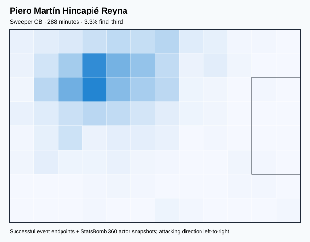

## Physical profile

| Metric | Score |
|---|---:|
| Aerial dominance | 0.818 |
| Pressing intensity per 90 | 11.86 |
| Recovery index per 90 | 2.18 |

## Top chemistry partners

- Felix Eduardo Torres Caicedo — synergy 0.652, 288 shared minutes
- Hernán Ismael Galíndez — synergy 0.628, 288 shared minutes
- Moisés Isaac Caicedo Corozo — synergy 0.625, 283 shared minutes

## Tactical recommendations

- Lead the first pressing trigger and protect the inside passing lane.
- Target this player on direct restarts and back-post deliveries.
- Pair with a faster recovery defender after aggressive rotations.

_The heatmap combines successful event endpoints with StatsBomb 360 actor
snapshots. StatsBomb 360 is freeze-frame context, not continuous player
tracking. Ratings include eligible outfield players from 45 minutes and
goalkeepers from 90 minutes; ranking status communicates sample reliability._

---

<!-- PLAYER_REPORT 15: 40211_starter_report.md -->

# Jeremy Leonel Sarmiento Morante — Starter Report

- Team: Ecuador (ECU)
- Position: Left Midfield
- Functional role: Progressive Winger
- VAEP offense per 90: 0.2212
- VAEP defense per 90: 0.0057
- VAEP total per 90: 0.2269
- VAEP per touch: 0.00242
- Spatial xT per 90: 0.0702
- Final-third spatial share: 37.9%
- Unified final player rating: 0.1117
- Team rank: #4

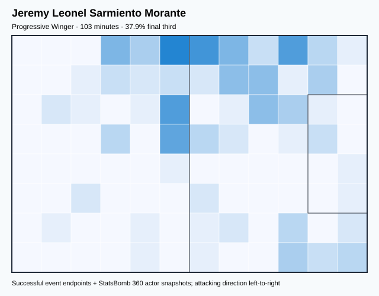

## Physical profile

| Metric | Score |
|---|---:|
| Aerial dominance | 0.250 |
| Pressing intensity per 90 | 14.87 |
| Recovery index per 90 | 2.62 |

## Top chemistry partners

- Pervis Josué Estupiñán Tenorio — synergy 0.284, 103 shared minutes
- Piero Martín Hincapié Reyna — synergy 0.275, 103 shared minutes
- Gonzalo Jordy Plata Jiménez — synergy 0.252, 96 shared minutes

## Tactical recommendations

- Lead the first pressing trigger and protect the inside passing lane.
- Use recovery capacity to support higher attacking positions.

_The heatmap combines successful event endpoints with StatsBomb 360 actor
snapshots. StatsBomb 360 is freeze-frame context, not continuous player
tracking. Ratings include eligible outfield players from 45 minutes and
goalkeepers from 90 minutes; ranking status communicates sample reliability._

---

<!-- PLAYER_REPORT 16: 51969_starter_report.md -->

# Jackson Gabriel Porozo Vernaza — Starter Report

- Team: Ecuador (ECU)
- Position: Right Center Back
- Functional role: Holding Anchor
- VAEP offense per 90: 0.1946
- VAEP defense per 90: -0.3290
- VAEP total per 90: -0.1344
- VAEP per touch: -0.00151
- Spatial xT per 90: 0.0030
- Final-third spatial share: 5.6%
- Unified final player rating: -0.0204
- Team rank: #15

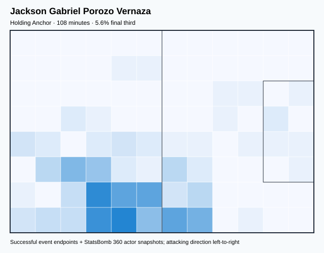

## Physical profile

| Metric | Score |
|---|---:|
| Aerial dominance | 1.000 |
| Pressing intensity per 90 | 13.30 |
| Recovery index per 90 | 1.66 |

## Top chemistry partners

- Hernán Ismael Galíndez — synergy 0.314, 108 shared minutes
- Piero Martín Hincapié Reyna — synergy 0.306, 108 shared minutes
- Felix Eduardo Torres Caicedo — synergy 0.306, 108 shared minutes

## Tactical recommendations

- Lead the first pressing trigger and protect the inside passing lane.
- Target this player on direct restarts and back-post deliveries.
- Pair with a faster recovery defender after aggressive rotations.

_The heatmap combines successful event endpoints with StatsBomb 360 actor
snapshots. StatsBomb 360 is freeze-frame context, not continuous player
tracking. Ratings include eligible outfield players from 45 minutes and
goalkeepers from 90 minutes; ranking status communicates sample reliability._
