# ENG — V4 Player Evaluation Collection

<!-- V5_CANONICAL_NOTICE -->
> **Historical V4 player-rating packet.** Player ratings, ranks, role-challenger decisions, and rating uncertainty below are superseded by `results/reports/player_rankings.csv`, `results/reports/player_profiles/`, and `results/reports/model_summary.md`. Possession, tactical, and match-bootstrap material remains a historical V4 result.

- Included eligible players: 19
- Rankings use the role-aware, development-gated VAEP/xT/xD model.
- Heatmaps combine successful on-ball endpoints and SB360 actor snapshots.

---

<!-- PLAYER_REPORT 1: 3205_starter_report.md -->

# Kyle Walker — Starter Report

- Team: England (ENG)
- Position: Right Back
- Functional role: Deep Playmaker
- VAEP offense per 90: 0.0486
- VAEP defense per 90: -0.0043
- VAEP total per 90: 0.0443
- VAEP per touch: 0.00027
- Spatial xT per 90: 0.0423
- Final-third spatial share: 19.1%
- Unified final player rating: 0.0454
- Team rank: #14

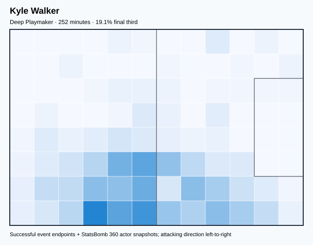

## Physical profile

| Metric | Score |
|---|---:|
| Aerial dominance | 0.556 |
| Pressing intensity per 90 | 8.59 |
| Recovery index per 90 | 2.86 |

## Top chemistry partners

- Declan Rice — synergy 0.585, 252 shared minutes
- Jordan Pickford — synergy 0.584, 252 shared minutes
- Harry Maguire — synergy 0.566, 252 shared minutes

## Tactical recommendations

- Use a compact pressing trigger rather than sustained solo pressure.
- Use recovery capacity to support higher attacking positions.

_The heatmap combines successful event endpoints with StatsBomb 360 actor
snapshots. StatsBomb 360 is freeze-frame context, not continuous player
tracking. Ratings include eligible outfield players from 45 minutes and
goalkeepers from 90 minutes; ranking status communicates sample reliability._

---

<!-- PLAYER_REPORT 2: 3233_starter_report.md -->

# Raheem Sterling — Starter Report

- Team: England (ENG)
- Position: Left Wing
- Functional role: Ball-Winner
- VAEP offense per 90: 0.3540
- VAEP defense per 90: 0.0067
- VAEP total per 90: 0.3607
- VAEP per touch: 0.00319
- Spatial xT per 90: 0.0438
- Final-third spatial share: 41.4%
- Unified final player rating: 0.1801
- Team rank: #6

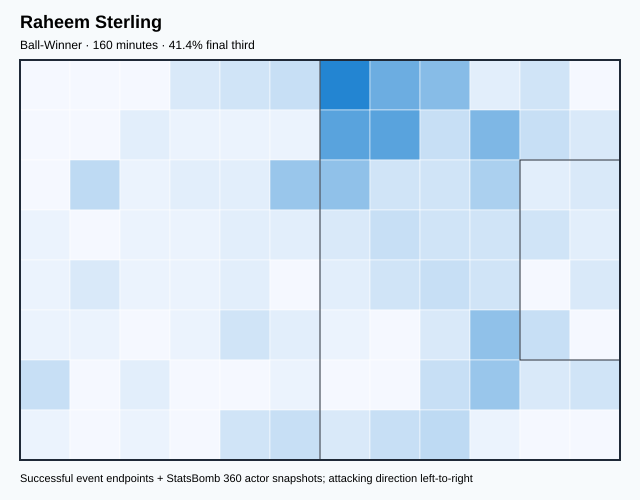

## Physical profile

| Metric | Score |
|---|---:|
| Aerial dominance | 0.333 |
| Pressing intensity per 90 | 10.69 |
| Recovery index per 90 | 2.25 |

## Top chemistry partners

- John Stones — synergy 0.412, 157 shared minutes
- Luke Shaw — synergy 0.408, 160 shared minutes
- Declan Rice — synergy 0.400, 160 shared minutes

## Tactical recommendations

- Use a compact pressing trigger rather than sustained solo pressure.
- Pair with a faster recovery defender after aggressive rotations.

_The heatmap combines successful event endpoints with StatsBomb 360 actor
snapshots. StatsBomb 360 is freeze-frame context, not continuous player
tracking. Ratings include eligible outfield players from 45 minutes and
goalkeepers from 90 minutes; ranking status communicates sample reliability._

---

<!-- PLAYER_REPORT 3: 3244_starter_report.md -->

# John Stones — Starter Report

- Team: England (ENG)
- Position: Right Center Back
- Functional role: Ball-Playing Centre-Back
- VAEP offense per 90: 0.0623
- VAEP defense per 90: -0.0318
- VAEP total per 90: 0.0305
- VAEP per touch: 0.00013
- Spatial xT per 90: 0.0105
- Final-third spatial share: 3.6%
- Unified final player rating: 0.0043
- Team rank: #17

## Physical profile

| Metric | Score |
|---|---:|
| Aerial dominance | 0.733 |
| Pressing intensity per 90 | 3.10 |
| Recovery index per 90 | 1.94 |

## Top chemistry partners

- Jordan Pickford — synergy 0.815, 465 shared minutes
- Harry Maguire — synergy 0.796, 432 shared minutes
- Jude Bellingham — synergy 0.795, 438 shared minutes

## Tactical recommendations

- Use a compact pressing trigger rather than sustained solo pressure.
- Target this player on direct restarts and back-post deliveries.
- Pair with a faster recovery defender after aggressive rotations.

_The heatmap combines successful event endpoints with StatsBomb 360 actor
snapshots. StatsBomb 360 is freeze-frame context, not continuous player
tracking. Ratings include eligible outfield players from 45 minutes and
goalkeepers from 90 minutes; ranking status communicates sample reliability._

---

<!-- PLAYER_REPORT 4: 3308_starter_report.md -->

# Kieran Trippier — Starter Report

- Team: England (ENG)
- Position: Right Back
- Functional role: Deep Playmaker
- VAEP offense per 90: 0.1647
- VAEP defense per 90: -0.0088
- VAEP total per 90: 0.1560
- VAEP per touch: 0.00086
- Spatial xT per 90: 0.0810
- Final-third spatial share: 24.4%
- Unified final player rating: 0.0673
- Team rank: #12

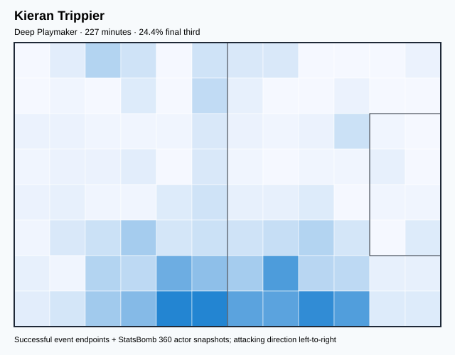

## Physical profile

| Metric | Score |
|---|---:|
| Aerial dominance | 0.800 |
| Pressing intensity per 90 | 11.90 |
| Recovery index per 90 | 3.17 |

## Top chemistry partners

- John Stones — synergy 0.558, 227 shared minutes
- Jordan Pickford — synergy 0.553, 227 shared minutes
- Declan Rice — synergy 0.514, 198 shared minutes

## Tactical recommendations

- Lead the first pressing trigger and protect the inside passing lane.
- Target this player on direct restarts and back-post deliveries.
- Use recovery capacity to support higher attacking positions.

_The heatmap combines successful event endpoints with StatsBomb 360 actor
snapshots. StatsBomb 360 is freeze-frame context, not continuous player
tracking. Ratings include eligible outfield players from 45 minutes and
goalkeepers from 90 minutes; ranking status communicates sample reliability._

---

<!-- PLAYER_REPORT 5: 3318_starter_report.md -->

# Marcus Rashford — Starter Report

- Team: England (ENG)
- Position: Left Wing
- Functional role: Progressive Winger
- VAEP offense per 90: 0.5305
- VAEP defense per 90: 0.0438
- VAEP total per 90: 0.5744
- VAEP per touch: 0.00420
- Spatial xT per 90: 0.0662
- Final-third spatial share: 49.6%
- Unified final player rating: 0.2110
- Team rank: #3

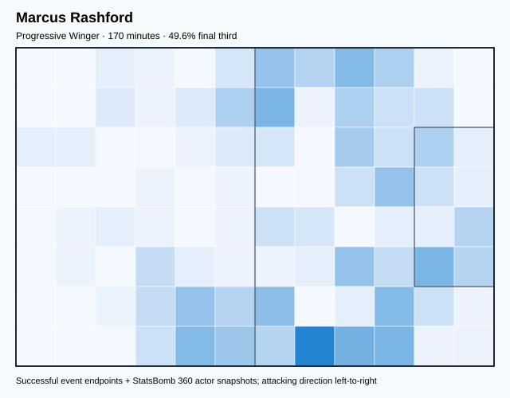

## Physical profile

| Metric | Score |
|---|---:|
| Aerial dominance | 0.167 |
| Pressing intensity per 90 | 10.03 |
| Recovery index per 90 | 3.17 |

## Top chemistry partners

- Luke Shaw — synergy 0.379, 160 shared minutes
- Declan Rice — synergy 0.366, 153 shared minutes
- Harry Maguire — synergy 0.335, 138 shared minutes

## Tactical recommendations

- Use a compact pressing trigger rather than sustained solo pressure.
- Avoid isolating this player in high-volume aerial matchups.
- Use recovery capacity to support higher attacking positions.

_The heatmap combines successful event endpoints with StatsBomb 360 actor
snapshots. StatsBomb 360 is freeze-frame context, not continuous player
tracking. Ratings include eligible outfield players from 45 minutes and
goalkeepers from 90 minutes; ranking status communicates sample reliability._

---

<!-- PLAYER_REPORT 6: 3336_starter_report.md -->

# Harry Maguire — Starter Report

- Team: England (ENG)
- Position: Left Center Back
- Functional role: Sweeper CB
- VAEP offense per 90: 0.1853
- VAEP defense per 90: 0.0018
- VAEP total per 90: 0.1871
- VAEP per touch: 0.00086
- Spatial xT per 90: 0.0346
- Final-third spatial share: 5.8%
- Unified final player rating: 0.0460
- Team rank: #13

## Physical profile

| Metric | Score |
|---|---:|
| Aerial dominance | 0.759 |
| Pressing intensity per 90 | 4.36 |
| Recovery index per 90 | 2.98 |

## Top chemistry partners

- Jordan Pickford — synergy 0.806, 454 shared minutes
- John Stones — synergy 0.796, 432 shared minutes
- Luke Shaw — synergy 0.765, 425 shared minutes

## Tactical recommendations

- Use a compact pressing trigger rather than sustained solo pressure.
- Target this player on direct restarts and back-post deliveries.
- Use recovery capacity to support higher attacking positions.

_The heatmap combines successful event endpoints with StatsBomb 360 actor
snapshots. StatsBomb 360 is freeze-frame context, not continuous player
tracking. Ratings include eligible outfield players from 45 minutes and
goalkeepers from 90 minutes; ranking status communicates sample reliability._

---

<!-- PLAYER_REPORT 7: 3382_starter_report.md -->

# Luke Shaw — Starter Report

- Team: England (ENG)
- Position: Left Back
- Functional role: Attacking Wingback
- VAEP offense per 90: 0.2759
- VAEP defense per 90: -0.0032
- VAEP total per 90: 0.2727
- VAEP per touch: 0.00134
- Spatial xT per 90: 0.0849
- Final-third spatial share: 26.0%
- Unified final player rating: 0.1041
- Team rank: #10

## Physical profile

| Metric | Score |
|---|---:|
| Aerial dominance | 0.429 |
| Pressing intensity per 90 | 6.69 |
| Recovery index per 90 | 2.76 |

## Top chemistry partners

- John Stones — synergy 0.773, 436 shared minutes
- Declan Rice — synergy 0.772, 450 shared minutes
- Harry Maguire — synergy 0.765, 425 shared minutes

## Tactical recommendations

- Use a compact pressing trigger rather than sustained solo pressure.
- Use recovery capacity to support higher attacking positions.

_The heatmap combines successful event endpoints with StatsBomb 360 actor
snapshots. StatsBomb 360 is freeze-frame context, not continuous player
tracking. Ratings include eligible outfield players from 45 minutes and
goalkeepers from 90 minutes; ranking status communicates sample reliability._

---

<!-- PLAYER_REPORT 8: 3468_starter_report.md -->

# Jordan Pickford — Starter Report

- Team: England (ENG)
- Position: Goalkeeper
- Functional role: Goalkeeper
- VAEP offense per 90: -0.0214
- VAEP defense per 90: -0.0995
- VAEP total per 90: -0.1209
- VAEP per touch: -0.00178
- Spatial xT per 90: 0.0031
- Final-third spatial share: 1.0%
- Unified final player rating: -0.0608
- Team rank: #19

## Physical profile

| Metric | Score |
|---|---:|
| Aerial dominance | 0.000 |
| Pressing intensity per 90 | 0.00 |
| Recovery index per 90 | 2.96 |

## Top chemistry partners

- John Stones — synergy 0.815, 465 shared minutes
- Harry Maguire — synergy 0.806, 454 shared minutes
- Declan Rice — synergy 0.781, 450 shared minutes

## Tactical recommendations

- Use a compact pressing trigger rather than sustained solo pressure.
- Avoid isolating this player in high-volume aerial matchups.
- Use recovery capacity to support higher attacking positions.

_The heatmap combines successful event endpoints with StatsBomb 360 actor
snapshots. StatsBomb 360 is freeze-frame context, not continuous player
tracking. Ratings include eligible outfield players from 45 minutes and
goalkeepers from 90 minutes; ranking status communicates sample reliability._

---

<!-- PLAYER_REPORT 9: 3532_starter_report.md -->

# Jordan Brian Henderson — Starter Report

- Team: England (ENG)
- Position: Right Center Midfield
- Functional role: Deep Playmaker
- VAEP offense per 90: 0.1904
- VAEP defense per 90: 0.0030
- VAEP total per 90: 0.1934
- VAEP per touch: 0.00128
- Spatial xT per 90: 0.0294
- Final-third spatial share: 33.7%
- Unified final player rating: 0.1060
- Team rank: #9

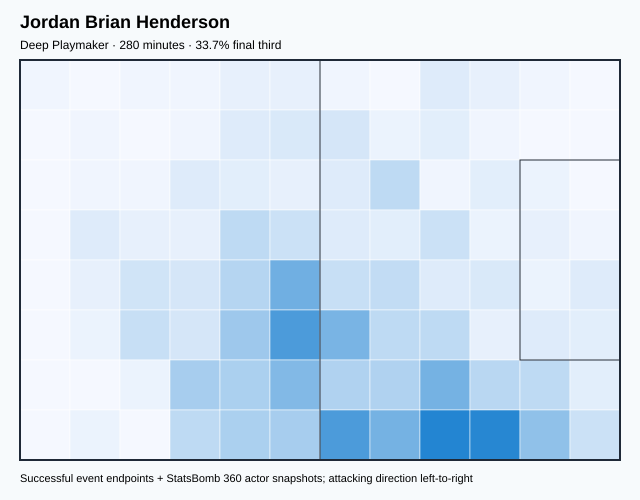

## Physical profile

| Metric | Score |
|---|---:|
| Aerial dominance | 0.400 |
| Pressing intensity per 90 | 11.88 |
| Recovery index per 90 | 1.93 |

## Top chemistry partners

- John Stones — synergy 0.618, 275 shared minutes
- Jordan Pickford — synergy 0.617, 280 shared minutes
- Harry Maguire — synergy 0.586, 280 shared minutes

## Tactical recommendations

- Lead the first pressing trigger and protect the inside passing lane.
- Pair with a faster recovery defender after aggressive rotations.

_The heatmap combines successful event endpoints with StatsBomb 360 actor
snapshots. StatsBomb 360 is freeze-frame context, not continuous player
tracking. Ratings include eligible outfield players from 45 minutes and
goalkeepers from 90 minutes; ranking status communicates sample reliability._

---

<!-- PLAYER_REPORT 10: 3616_starter_report.md -->

# Callum Wilson — Starter Report

- Team: England (ENG)
- Position: Center Forward
- Functional role: Progressive Winger
- VAEP offense per 90: 0.5615
- VAEP defense per 90: 0.0103
- VAEP total per 90: 0.5719
- VAEP per touch: 0.00698
- Spatial xT per 90: 0.0387
- Final-third spatial share: 37.2%
- Unified final player rating: 0.2463
- Team rank: #1

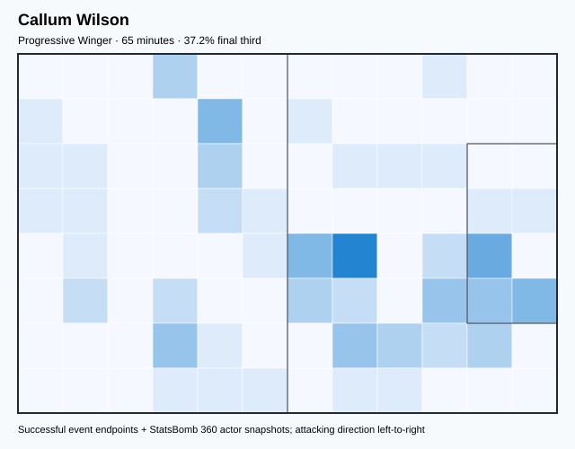

## Physical profile

| Metric | Score |
|---|---:|
| Aerial dominance | 0.000 |
| Pressing intensity per 90 | 13.89 |
| Recovery index per 90 | 4.17 |

## Top chemistry partners

- John Stones — synergy 0.196, 65 shared minutes
- Jordan Pickford — synergy 0.189, 65 shared minutes
- Kieran Trippier — synergy 0.172, 57 shared minutes

## Tactical recommendations

- Lead the first pressing trigger and protect the inside passing lane.
- Avoid isolating this player in high-volume aerial matchups.
- Use recovery capacity to support higher attacking positions.

_The heatmap combines successful event endpoints with StatsBomb 360 actor
snapshots. StatsBomb 360 is freeze-frame context, not continuous player
tracking. Ratings include eligible outfield players from 45 minutes and
goalkeepers from 90 minutes; ranking status communicates sample reliability._

---

<!-- PLAYER_REPORT 11: 3943_starter_report.md -->

# Declan Rice — Starter Report

- Team: England (ENG)
- Position: Left Defensive Midfield
- Functional role: Holding Anchor
- VAEP offense per 90: 0.0728
- VAEP defense per 90: -0.0260
- VAEP total per 90: 0.0468
- VAEP per touch: 0.00027
- Spatial xT per 90: 0.0222
- Final-third spatial share: 11.2%
- Unified final player rating: 0.0248
- Team rank: #15

## Physical profile

| Metric | Score |
|---|---:|
| Aerial dominance | 0.556 |
| Pressing intensity per 90 | 10.01 |
| Recovery index per 90 | 3.80 |

## Top chemistry partners

- John Stones — synergy 0.786, 428 shared minutes
- Jordan Pickford — synergy 0.781, 450 shared minutes
- Luke Shaw — synergy 0.772, 450 shared minutes

## Tactical recommendations

- Use a compact pressing trigger rather than sustained solo pressure.
- Use recovery capacity to support higher attacking positions.

_The heatmap combines successful event endpoints with StatsBomb 360 actor
snapshots. StatsBomb 360 is freeze-frame context, not continuous player
tracking. Ratings include eligible outfield players from 45 minutes and
goalkeepers from 90 minutes; ranking status communicates sample reliability._

---

<!-- PLAYER_REPORT 12: 4354_starter_report.md -->

# Phil Foden — Starter Report

- Team: England (ENG)
- Position: Right Wing
- Functional role: Ball-Winner
- VAEP offense per 90: 0.3901
- VAEP defense per 90: -0.0950
- VAEP total per 90: 0.2951
- VAEP per touch: 0.00235
- Spatial xT per 90: 0.0521
- Final-third spatial share: 50.6%
- Unified final player rating: 0.1698
- Team rank: #7

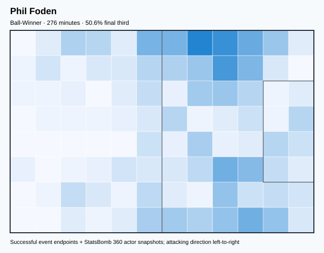

## Physical profile

| Metric | Score |
|---|---:|
| Aerial dominance | 0.300 |
| Pressing intensity per 90 | 10.78 |
| Recovery index per 90 | 2.29 |

## Top chemistry partners

- John Stones — synergy 0.618, 276 shared minutes
- Jude Bellingham — synergy 0.542, 276 shared minutes
- Declan Rice — synergy 0.529, 239 shared minutes

## Tactical recommendations

- Use a compact pressing trigger rather than sustained solo pressure.
- Pair with a faster recovery defender after aggressive rotations.

_The heatmap combines successful event endpoints with StatsBomb 360 actor
snapshots. StatsBomb 360 is freeze-frame context, not continuous player
tracking. Ratings include eligible outfield players from 45 minutes and
goalkeepers from 90 minutes; ranking status communicates sample reliability._

---

<!-- PLAYER_REPORT 13: 4706_starter_report.md -->

# Kalvin Phillips — Starter Report

- Team: England (ENG)
- Position: Center Defensive Midfield
- Functional role: Ball-Winner
- VAEP offense per 90: -0.0086
- VAEP defense per 90: -0.0255
- VAEP total per 90: -0.0341
- VAEP per touch: -0.00039
- Spatial xT per 90: 0.0251
- Final-third spatial share: 3.2%
- Unified final player rating: 0.0183
- Team rank: #16

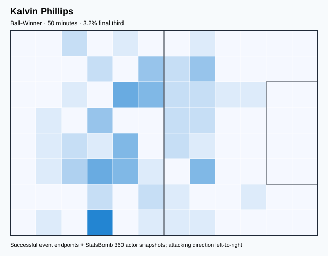

## Physical profile

| Metric | Score |
|---|---:|
| Aerial dominance | 0.000 |
| Pressing intensity per 90 | 23.48 |
| Recovery index per 90 | 0.00 |

## Top chemistry partners

- Harry Maguire — synergy 0.156, 50 shared minutes
- Jordan Pickford — synergy 0.155, 50 shared minutes
- Jude Bellingham — synergy 0.120, 37 shared minutes

## Tactical recommendations

- Lead the first pressing trigger and protect the inside passing lane.
- Avoid isolating this player in high-volume aerial matchups.
- Pair with a faster recovery defender after aggressive rotations.

_The heatmap combines successful event endpoints with StatsBomb 360 actor
snapshots. StatsBomb 360 is freeze-frame context, not continuous player
tracking. Ratings include eligible outfield players from 45 minutes and
goalkeepers from 90 minutes; ranking status communicates sample reliability._

---

<!-- PLAYER_REPORT 14: 7843_starter_report.md -->

# Mason Mount — Starter Report

- Team: England (ENG)
- Position: Center Attacking Midfield
- Functional role: Ball-Winner
- VAEP offense per 90: 0.2364
- VAEP defense per 90: 0.0099
- VAEP total per 90: 0.2463
- VAEP per touch: 0.00226
- Spatial xT per 90: 0.0649
- Final-third spatial share: 36.7%
- Unified final player rating: 0.1641
- Team rank: #8

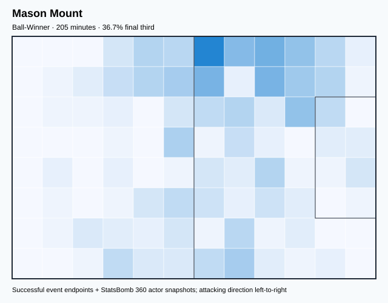

## Physical profile

| Metric | Score |
|---|---:|
| Aerial dominance | 0.143 |
| Pressing intensity per 90 | 19.32 |
| Recovery index per 90 | 2.63 |

## Top chemistry partners

- Declan Rice — synergy 0.477, 205 shared minutes
- Luke Shaw — synergy 0.477, 205 shared minutes
- Harry Maguire — synergy 0.460, 205 shared minutes

## Tactical recommendations

- Lead the first pressing trigger and protect the inside passing lane.
- Avoid isolating this player in high-volume aerial matchups.
- Use recovery capacity to support higher attacking positions.

_The heatmap combines successful event endpoints with StatsBomb 360 actor
snapshots. StatsBomb 360 is freeze-frame context, not continuous player
tracking. Ratings include eligible outfield players from 45 minutes and
goalkeepers from 90 minutes; ranking status communicates sample reliability._

---

<!-- PLAYER_REPORT 15: 9638_starter_report.md -->

# Jack Grealish — Starter Report

- Team: England (ENG)
- Position: Left Wing
- Functional role: Ball-Winner
- VAEP offense per 90: 0.5864
- VAEP defense per 90: 0.0871
- VAEP total per 90: 0.6735
- VAEP per touch: 0.00444
- Spatial xT per 90: 0.0926
- Final-third spatial share: 36.5%
- Unified final player rating: 0.2123
- Team rank: #2

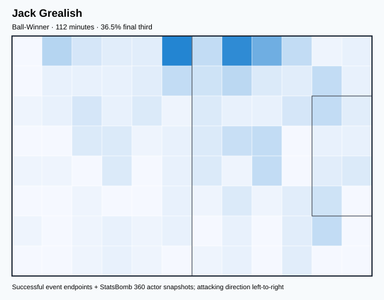

## Physical profile

| Metric | Score |
|---|---:|
| Aerial dominance | 0.000 |
| Pressing intensity per 90 | 16.95 |
| Recovery index per 90 | 3.23 |

## Top chemistry partners

- Declan Rice — synergy 0.279, 93 shared minutes
- Luke Shaw — synergy 0.276, 93 shared minutes
- Jordan Pickford — synergy 0.272, 111 shared minutes

## Tactical recommendations

- Lead the first pressing trigger and protect the inside passing lane.
- Avoid isolating this player in high-volume aerial matchups.
- Use recovery capacity to support higher attacking positions.

_The heatmap combines successful event endpoints with StatsBomb 360 actor
snapshots. StatsBomb 360 is freeze-frame context, not continuous player
tracking. Ratings include eligible outfield players from 45 minutes and
goalkeepers from 90 minutes; ranking status communicates sample reliability._

---

<!-- PLAYER_REPORT 16: 10955_starter_report.md -->

# Harry Kane — Starter Report

- Team: England (ENG)
- Position: Center Forward
- Functional role: Target Forward
- VAEP offense per 90: 0.2913
- VAEP defense per 90: -0.0034
- VAEP total per 90: 0.2879
- VAEP per touch: 0.00323
- Spatial xT per 90: 0.0474
- Final-third spatial share: 47.1%
- Unified final player rating: 0.1982
- Team rank: #5

## Physical profile

| Metric | Score |
|---|---:|
| Aerial dominance | 0.483 |
| Pressing intensity per 90 | 6.62 |
| Recovery index per 90 | 2.56 |

## Top chemistry partners

- Declan Rice — synergy 0.742, 422 shared minutes
- Luke Shaw — synergy 0.600, 422 shared minutes
- John Stones — synergy 0.519, 400 shared minutes

## Tactical recommendations

- Use a compact pressing trigger rather than sustained solo pressure.
- Use recovery capacity to support higher attacking positions.

_The heatmap combines successful event endpoints with StatsBomb 360 actor
snapshots. StatsBomb 360 is freeze-frame context, not continuous player
tracking. Ratings include eligible outfield players from 45 minutes and
goalkeepers from 90 minutes; ranking status communicates sample reliability._

---

<!-- PLAYER_REPORT 17: 10956_starter_report.md -->

# Eric Dier — Starter Report

- Team: England (ENG)
- Position: Left Center Back
- Functional role: Sweeper CB
- VAEP offense per 90: -0.0005
- VAEP defense per 90: -0.0275
- VAEP total per 90: -0.0280
- VAEP per touch: -0.00014
- Spatial xT per 90: 0.0023
- Final-third spatial share: 0.5%
- Unified final player rating: -0.0096
- Team rank: #18

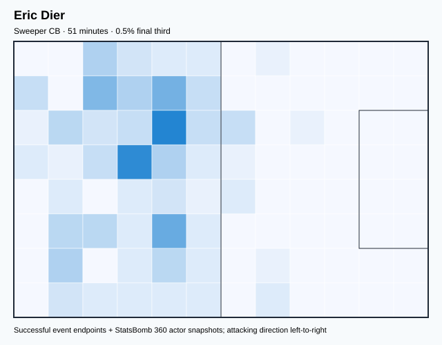

## Physical profile

| Metric | Score |
|---|---:|
| Aerial dominance | 1.000 |
| Pressing intensity per 90 | 5.33 |
| Recovery index per 90 | 5.33 |

## Top chemistry partners

- Luke Shaw — synergy 0.167, 51 shared minutes
- Declan Rice — synergy 0.164, 51 shared minutes
- Jordan Pickford — synergy 0.161, 51 shared minutes

## Tactical recommendations

- Use a compact pressing trigger rather than sustained solo pressure.
- Target this player on direct restarts and back-post deliveries.
- Use recovery capacity to support higher attacking positions.

_The heatmap combines successful event endpoints with StatsBomb 360 actor
snapshots. StatsBomb 360 is freeze-frame context, not continuous player
tracking. Ratings include eligible outfield players from 45 minutes and
goalkeepers from 90 minutes; ranking status communicates sample reliability._

---

<!-- PLAYER_REPORT 18: 22084_starter_report.md -->

# Bukayo Saka — Starter Report

- Team: England (ENG)
- Position: Right Wing
- Functional role: Progressive Winger
- VAEP offense per 90: 0.4540
- VAEP defense per 90: 0.0128
- VAEP total per 90: 0.4668
- VAEP per touch: 0.00391
- Spatial xT per 90: 0.0593
- Final-third spatial share: 53.7%
- Unified final player rating: 0.2040
- Team rank: #4

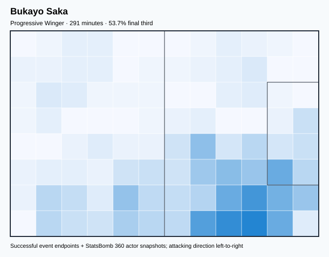

## Physical profile

| Metric | Score |
|---|---:|
| Aerial dominance | 0.333 |
| Pressing intensity per 90 | 17.30 |
| Recovery index per 90 | 2.78 |

## Top chemistry partners

- John Stones — synergy 0.625, 291 shared minutes
- Declan Rice — synergy 0.599, 291 shared minutes
- Harry Maguire — synergy 0.580, 291 shared minutes

## Tactical recommendations

- Lead the first pressing trigger and protect the inside passing lane.
- Use recovery capacity to support higher attacking positions.

_The heatmap combines successful event endpoints with StatsBomb 360 actor
snapshots. StatsBomb 360 is freeze-frame context, not continuous player
tracking. Ratings include eligible outfield players from 45 minutes and
goalkeepers from 90 minutes; ranking status communicates sample reliability._

---

<!-- PLAYER_REPORT 19: 30714_starter_report.md -->

# Jude Bellingham — Starter Report

- Team: England (ENG)
- Position: Right Defensive Midfield
- Functional role: Box-to-Box / Engine Midfielder
- VAEP offense per 90: 0.2592
- VAEP defense per 90: 0.0186
- VAEP total per 90: 0.2778
- VAEP per touch: 0.00169
- Spatial xT per 90: 0.0420
- Final-third spatial share: 26.4%
- Unified final player rating: 0.0842
- Team rank: #11

## Physical profile

| Metric | Score |
|---|---:|
| Aerial dominance | 0.444 |
| Pressing intensity per 90 | 15.08 |
| Recovery index per 90 | 6.11 |

## Top chemistry partners

- John Stones — synergy 0.795, 438 shared minutes
- Jordan Pickford — synergy 0.772, 442 shared minutes
- Luke Shaw — synergy 0.749, 413 shared minutes

## Tactical recommendations

- Lead the first pressing trigger and protect the inside passing lane.
- Use recovery capacity to support higher attacking positions.

_The heatmap combines successful event endpoints with StatsBomb 360 actor
snapshots. StatsBomb 360 is freeze-frame context, not continuous player
tracking. Ratings include eligible outfield players from 45 minutes and
goalkeepers from 90 minutes; ranking status communicates sample reliability._
