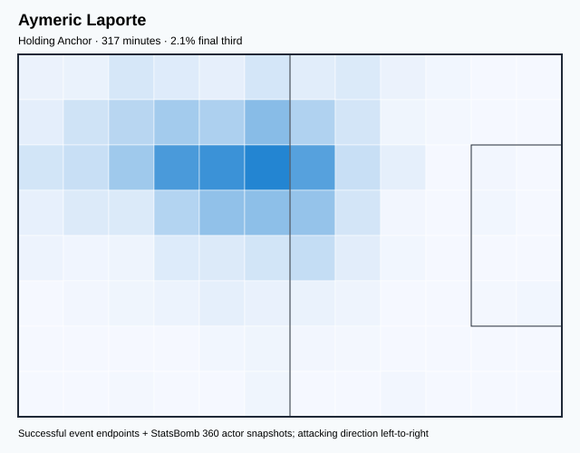
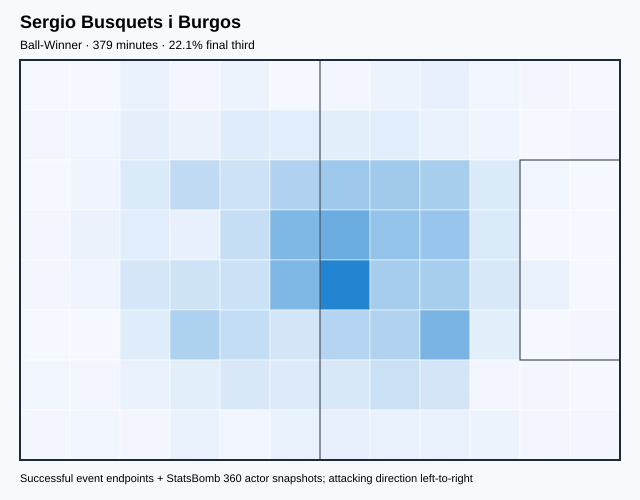
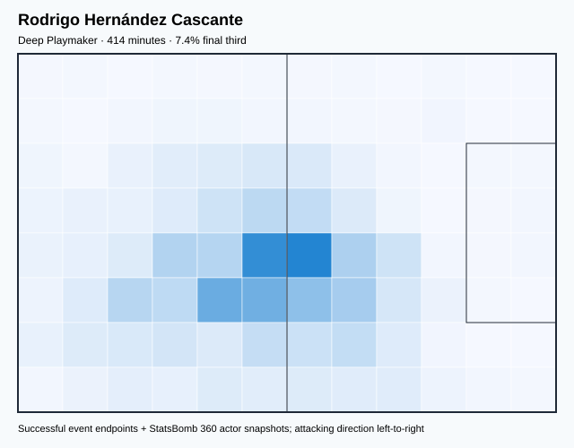
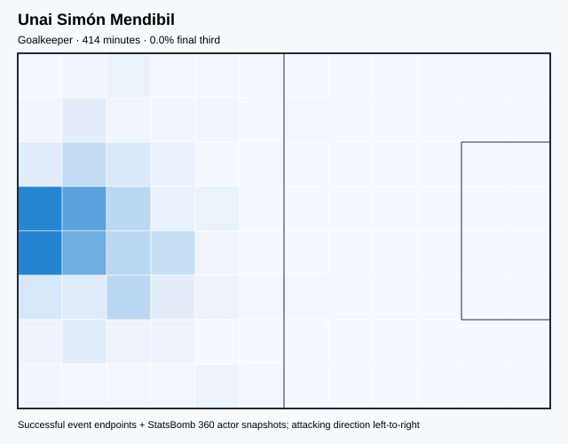
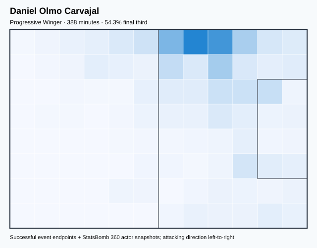
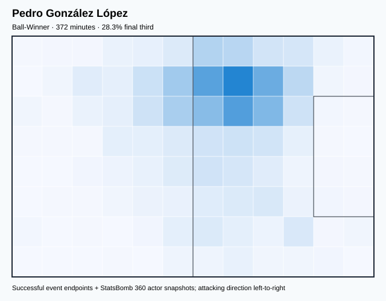

# ESP — V4 Player Evaluation Collection

- Included 300+ minute players: 6
- Rankings use one cross-role 360-VAEP plus xT formula.
- Heatmaps combine successful on-ball endpoints and SB360 actor snapshots.

---

<!-- PLAYER_REPORT 1: 4353_starter_report.md -->

# Aymeric Laporte — Starter Report

- Team: Spain (ESP)
- Position: Left Center Back
- Functional role: Deep Playmaker
- VAEP offense per 90: 0.0530
- VAEP defense per 90: -0.0126
- VAEP total per 90: 0.0404
- VAEP per touch: 0.00012
- Spatial xT per 90: 0.0249
- Final-third spatial share: 2.6%
- Unified final player rating: 0.0089
- Team rank: #4

## Physical profile

| Metric | Score |
|---|---:|
| Aerial dominance | 0.667 |
| Pressing intensity per 90 | 4.26 |
| Recovery index per 90 | 1.14 |

## Top chemistry partners

- Rodrigo Hernández Cascante — synergy 0.689, 317 shared minutes
- Unai Simón Mendibil — synergy 0.686, 317 shared minutes
- Pedro González López — synergy 0.630, 275 shared minutes

## Tactical recommendations

- Use a compact pressing trigger rather than sustained solo pressure.
- Target this player on direct restarts and back-post deliveries.
- Pair with a faster recovery defender after aggressive rotations.

_The heatmap combines successful event endpoints with StatsBomb 360 actor
snapshots. StatsBomb 360 is freeze-frame context, not continuous player
tracking. Scores exclude players below 300 tournament minutes._

---

<!-- PLAYER_REPORT 2: 5203_starter_report.md -->

# Sergio Busquets i Burgos — Starter Report

- Team: Spain (ESP)
- Position: Center Defensive Midfield
- Functional role: Ball-Winner
- VAEP offense per 90: -0.0391
- VAEP defense per 90: -0.0154
- VAEP total per 90: -0.0546
- VAEP per touch: -0.00032
- Spatial xT per 90: 0.0464
- Final-third spatial share: 22.0%
- Unified final player rating: 0.0032
- Team rank: #5

## Physical profile

| Metric | Score |
|---|---:|
| Aerial dominance | 0.667 |
| Pressing intensity per 90 | 10.44 |
| Recovery index per 90 | 2.85 |

## Top chemistry partners

- Rodrigo Hernández Cascante — synergy 0.742, 379 shared minutes
- Unai Simón Mendibil — synergy 0.725, 379 shared minutes
- Pedro González López — synergy 0.718, 372 shared minutes

## Tactical recommendations

- Use a compact pressing trigger rather than sustained solo pressure.
- Target this player on direct restarts and back-post deliveries.
- Use recovery capacity to support higher attacking positions.

_The heatmap combines successful event endpoints with StatsBomb 360 actor
snapshots. StatsBomb 360 is freeze-frame context, not continuous player
tracking. Scores exclude players below 300 tournament minutes._

---

<!-- PLAYER_REPORT 3: 6765_starter_report.md -->

# Rodrigo Hernández Cascante — Starter Report

- Team: Spain (ESP)
- Position: Right Center Back
- Functional role: Ball-Playing Centre-Back
- VAEP offense per 90: 0.1100
- VAEP defense per 90: -0.0672
- VAEP total per 90: 0.0428
- VAEP per touch: 0.00011
- Spatial xT per 90: 0.0496
- Final-third spatial share: 7.4%
- Unified final player rating: 0.0147
- Team rank: #3

## Physical profile

| Metric | Score |
|---|---:|
| Aerial dominance | 0.750 |
| Pressing intensity per 90 | 5.00 |
| Recovery index per 90 | 4.35 |

## Top chemistry partners

- Unai Simón Mendibil — synergy 0.779, 414 shared minutes
- Pedro González López — synergy 0.745, 372 shared minutes
- Sergio Busquets i Burgos — synergy 0.742, 379 shared minutes

## Tactical recommendations

- Use a compact pressing trigger rather than sustained solo pressure.
- Target this player on direct restarts and back-post deliveries.
- Use recovery capacity to support higher attacking positions.

_The heatmap combines successful event endpoints with StatsBomb 360 actor
snapshots. StatsBomb 360 is freeze-frame context, not continuous player
tracking. Scores exclude players below 300 tournament minutes._

---

<!-- PLAYER_REPORT 4: 11748_starter_report.md -->

# Unai Simón Mendibil — Starter Report

- Team: Spain (ESP)
- Position: Goalkeeper
- Functional role: Goalkeeper
- VAEP offense per 90: -0.0114
- VAEP defense per 90: -0.1136
- VAEP total per 90: -0.1250
- VAEP per touch: -0.00150
- Spatial xT per 90: 0.0007
- Final-third spatial share: 0.0%
- Unified final player rating: -0.0582
- Team rank: #6

## Physical profile

| Metric | Score |
|---|---:|
| Aerial dominance | 0.000 |
| Pressing intensity per 90 | 0.00 |
| Recovery index per 90 | 2.61 |

## Top chemistry partners

- Rodrigo Hernández Cascante — synergy 0.779, 414 shared minutes
- Sergio Busquets i Burgos — synergy 0.725, 379 shared minutes
- Aymeric Laporte — synergy 0.686, 317 shared minutes

## Tactical recommendations

- Use a compact pressing trigger rather than sustained solo pressure.
- Avoid isolating this player in high-volume aerial matchups.
- Use recovery capacity to support higher attacking positions.

_The heatmap combines successful event endpoints with StatsBomb 360 actor
snapshots. StatsBomb 360 is freeze-frame context, not continuous player
tracking. Scores exclude players below 300 tournament minutes._

---

<!-- PLAYER_REPORT 5: 16532_starter_report.md -->

# Daniel Olmo Carvajal — Starter Report

- Team: Spain (ESP)
- Position: Left Wing
- Functional role: Progressive Winger
- VAEP offense per 90: 0.5193
- VAEP defense per 90: 0.0354
- VAEP total per 90: 0.5547
- VAEP per touch: 0.00345
- Spatial xT per 90: 0.0722
- Final-third spatial share: 51.0%
- Unified final player rating: 0.2554
- Team rank: #1

## Physical profile

| Metric | Score |
|---|---:|
| Aerial dominance | 0.167 |
| Pressing intensity per 90 | 12.05 |
| Recovery index per 90 | 3.94 |

## Top chemistry partners

- Rodrigo Hernández Cascante — synergy 0.658, 388 shared minutes
- Pedro González López — synergy 0.649, 347 shared minutes
- Sergio Busquets i Burgos — synergy 0.611, 354 shared minutes

## Tactical recommendations

- Lead the first pressing trigger and protect the inside passing lane.
- Avoid isolating this player in high-volume aerial matchups.
- Use recovery capacity to support higher attacking positions.

_The heatmap combines successful event endpoints with StatsBomb 360 actor
snapshots. StatsBomb 360 is freeze-frame context, not continuous player
tracking. Scores exclude players below 300 tournament minutes._

---

<!-- PLAYER_REPORT 6: 30486_starter_report.md -->

# Pedro González López — Starter Report

- Team: Spain (ESP)
- Position: Left Center Midfield
- Functional role: Ball-Winner
- VAEP offense per 90: 0.1799
- VAEP defense per 90: -0.0004
- VAEP total per 90: 0.1796
- VAEP per touch: 0.00059
- Spatial xT per 90: 0.1051
- Final-third spatial share: 28.9%
- Unified final player rating: 0.1236
- Team rank: #2

## Physical profile

| Metric | Score |
|---|---:|
| Aerial dominance | 0.600 |
| Pressing intensity per 90 | 14.74 |
| Recovery index per 90 | 6.28 |

## Top chemistry partners

- Rodrigo Hernández Cascante — synergy 0.745, 372 shared minutes
- Sergio Busquets i Burgos — synergy 0.718, 372 shared minutes
- Daniel Olmo Carvajal — synergy 0.649, 347 shared minutes

## Tactical recommendations

- Lead the first pressing trigger and protect the inside passing lane.
- Target this player on direct restarts and back-post deliveries.
- Use recovery capacity to support higher attacking positions.

_The heatmap combines successful event endpoints with StatsBomb 360 actor
snapshots. StatsBomb 360 is freeze-frame context, not continuous player
tracking. Scores exclude players below 300 tournament minutes._

<!-- PROSPECTIVE_VALIDATION_START -->
## Prospective possession-model validation

**Overall status: `PARTIAL_PASS_ROLLBACK`.** Box-entry prediction passed every discrimination, calibration, and paired match-bootstrap gate. The shot challenger improved numerically but its confidence interval crossed zero, so it was rejected. The combined prospective artifact was not deployed and the stable production state was preserved.

| Target | Status | Baseline ROC-AUC | Challenger ROC-AUC | PR-AUC | Brier | ECE | Paired ROC gain (90% interval) |
|---|---|---:|---:|---:|---:|---:|---:|
| Box entry | **PASSED** | 0.6888 | 0.7268 | 0.6131 | 0.1722 | 0.0309 | +0.0155 [+0.0106, +0.0205] |
| Shot | **REJECTED** | 0.6642 | 0.6841 | 0.2686 | 0.0960 | 0.0118 | +0.0038 [-0.0030, +0.0120] |

_This challenger is isolated from 360-VAEP/xT player ratings, transition risk, retrospective possession models, and tactical clustering. Player and team descriptive metrics therefore remain unchanged._
<!-- PROSPECTIVE_VALIDATION_END -->

<!-- PLAYER_ROLE_VALIDATION_START -->
## Player-role and valuation validation status

**Production state retained.** The probabilistic role matrix and learned valuation were evaluated as challengers but were not promoted because they missed their predeclared statistical gates.

| Component | Decision | Validation evidence |
|---|---|---|
| Probabilistic GMM roles | **REJECTED** | K=9; silhouette 0.3159; median 500-bootstrap ARI 0.6961 vs required 0.70 |
| Learned Ridge valuation | **REJECTED** | OOF Spearman 0.7095 → 0.7150; gain 95% CI [-0.0053, +0.0165] crosses zero |

The active calibrated 360-VAEP model therefore remains unchanged: OOF ROC-AUC 0.948994, PR-AUC 0.084827, Brier 0.001123. Messi remains Argentina rank #1 and Mbappé remains France rank #1; no player-name override was used.
<!-- PLAYER_ROLE_VALIDATION_END -->

<!-- ROLE_AWARE_VALUATION_START -->
## Continuous role-aware valuation A/B test

**Decision: `REJECTED_RETAIN_INCUMBENT`.** The challenger was not promoted. Its Spearman correlation with the incumbent ranking was 0.9854, above the predeclared 0.90 ceiling, so it did not change the overall ordering enough to qualify as the intended systemic correction.

| Benchmark | Incumbent | Challenger diagnostic |
|---|---:|---:|
| Messi global rank | 1 | 1 |
| Mbappé global rank | 2 | 2 |
| Griezmann global rank | 21 | 6 |

The diagnostic Griezmann movement came from creation (0.799), pressing (0.711), and completeness (0.862), with no player-name rule. Nevertheless, all published player/team rankings retain the incumbent 360-VAEP+xT rating.

Foundational model performance remains unchanged: OOF ROC-AUC 0.948994, PR-AUC 0.084827, Brier 0.001123, ECE 0.000336.
<!-- ROLE_AWARE_VALUATION_END -->

<!-- CONTINUOUS_ROLE_REFINEMENT_START -->
## Accepted continuous role refinement

**34 of 142 players (23.9%) received an evidence-backed post-K-Means role refinement; 108 retained their original role.** The original cluster label remains available as `kmeans_functional_role`. Ratings, team ranks, VAEP and xT were not changed by this role-only promotion.

France refinements:

- Olivier Giroud: Target Forward → **Target Forward / Penalty-Box Anchor**
- Antoine Griezmann: Ball-Winner → **Hybrid Playmaker / Roaming Creator**
- Theo Bernard François Hernández: Wide Creator → **Attacking Wingback**
- Ibrahima Konaté: Deep Playmaker → **Ball-Playing Centre-Back**
- Aurélien Djani Tchouaméni: Ball-Winner → **Holding / Controlling Midfielder**

Refinements use continuous progression, creation, finishing, pressing, defensive, security, aerial and completeness scores with broad-position safeguards. No player-name condition is used.
<!-- CONTINUOUS_ROLE_REFINEMENT_END -->
