# ESP — V4 Player Evaluation Collection

<!-- V5_CANONICAL_NOTICE -->
> **Historical V4 player-rating packet.** Player ratings, ranks, role-challenger decisions, and rating uncertainty below are superseded by `results/reports/player_rankings.csv`, `results/reports/player_profiles/`, and `results/reports/model_summary.md`. Possession, tactical, and match-bootstrap material remains a historical V4 result.

- Included eligible players: 20
- Rankings use the role-aware, development-gated VAEP/xT/xD model.
- Heatmaps combine successful on-ball endpoints and SB360 actor snapshots.

---

<!-- PLAYER_REPORT 1: 3477_starter_report.md -->

# Álvaro Borja Morata Martín — Starter Report

- Team: Spain (ESP)
- Position: Center Forward
- Functional role: Target Forward
- VAEP offense per 90: 0.7457
- VAEP defense per 90: 0.0044
- VAEP total per 90: 0.7500
- VAEP per touch: 0.00962
- Spatial xT per 90: 0.0316
- Final-third spatial share: 45.8%
- Unified final player rating: 0.2839
- Team rank: #2

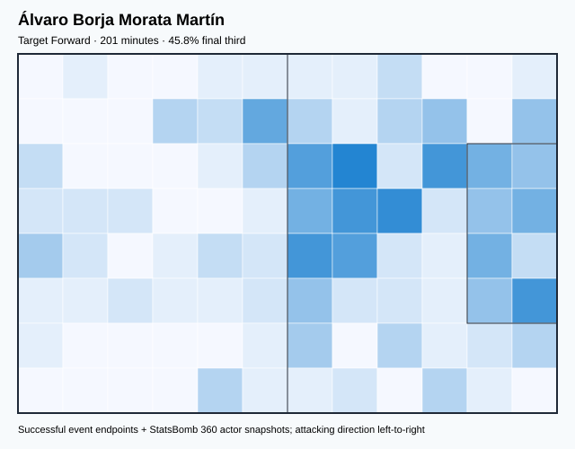

## Physical profile

| Metric | Score |
|---|---:|
| Aerial dominance | 0.667 |
| Pressing intensity per 90 | 11.65 |
| Recovery index per 90 | 0.90 |

## Top chemistry partners

- Unai Simón Mendibil — synergy 0.474, 201 shared minutes
- Rodrigo Hernández Cascante — synergy 0.391, 201 shared minutes
- Aymeric Laporte — synergy 0.374, 145 shared minutes

## Tactical recommendations

- Lead the first pressing trigger and protect the inside passing lane.
- Target this player on direct restarts and back-post deliveries.
- Pair with a faster recovery defender after aggressive rotations.

_The heatmap combines successful event endpoints with StatsBomb 360 actor
snapshots. StatsBomb 360 is freeze-frame context, not continuous player
tracking. Ratings include eligible outfield players from 45 minutes and
goalkeepers from 90 minutes; ranking status communicates sample reliability._

---

<!-- PLAYER_REPORT 2: 3957_starter_report.md -->

# César Azpilicueta Tanco — Starter Report

- Team: Spain (ESP)
- Position: Right Back
- Functional role: Attacking Wingback
- VAEP offense per 90: 0.1142
- VAEP defense per 90: 0.0021
- VAEP total per 90: 0.1164
- VAEP per touch: 0.00038
- Spatial xT per 90: 0.0875
- Final-third spatial share: 18.1%
- Unified final player rating: 0.0590
- Team rank: #12

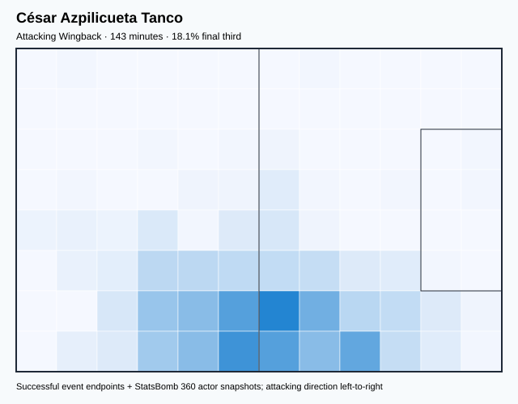

## Physical profile

| Metric | Score |
|---|---:|
| Aerial dominance | 0.600 |
| Pressing intensity per 90 | 6.92 |
| Recovery index per 90 | 1.26 |

## Top chemistry partners

- Rodrigo Hernández Cascante — synergy 0.409, 143 shared minutes
- Unai Simón Mendibil — synergy 0.383, 143 shared minutes
- Pablo Martín Páez Gavira — synergy 0.382, 143 shared minutes

## Tactical recommendations

- Use a compact pressing trigger rather than sustained solo pressure.
- Target this player on direct restarts and back-post deliveries.
- Pair with a faster recovery defender after aggressive rotations.

_The heatmap combines successful event endpoints with StatsBomb 360 actor
snapshots. StatsBomb 360 is freeze-frame context, not continuous player
tracking. Ratings include eligible outfield players from 45 minutes and
goalkeepers from 90 minutes; ranking status communicates sample reliability._

---

<!-- PLAYER_REPORT 3: 4353_starter_report.md -->

# Aymeric Laporte — Starter Report

- Team: Spain (ESP)
- Position: Left Center Back
- Functional role: Sweeper CB
- VAEP offense per 90: 0.0630
- VAEP defense per 90: -0.0130
- VAEP total per 90: 0.0500
- VAEP per touch: 0.00015
- Spatial xT per 90: 0.0249
- Final-third spatial share: 2.6%
- Unified final player rating: 0.0071
- Team rank: #18

## Physical profile

| Metric | Score |
|---|---:|
| Aerial dominance | 0.667 |
| Pressing intensity per 90 | 4.26 |
| Recovery index per 90 | 1.14 |

## Top chemistry partners

- Rodrigo Hernández Cascante — synergy 0.689, 317 shared minutes
- Unai Simón Mendibil — synergy 0.686, 317 shared minutes
- Pedro González López — synergy 0.630, 275 shared minutes

## Tactical recommendations

- Use a compact pressing trigger rather than sustained solo pressure.
- Target this player on direct restarts and back-post deliveries.
- Pair with a faster recovery defender after aggressive rotations.

_The heatmap combines successful event endpoints with StatsBomb 360 actor
snapshots. StatsBomb 360 is freeze-frame context, not continuous player
tracking. Ratings include eligible outfield players from 45 minutes and
goalkeepers from 90 minutes; ranking status communicates sample reliability._

---

<!-- PLAYER_REPORT 4: 5199_starter_report.md -->

# Jorge Resurrección Merodio — Starter Report

- Team: Spain (ESP)
- Position: Center Defensive Midfield
- Functional role: Holding Anchor
- VAEP offense per 90: 0.1770
- VAEP defense per 90: 0.0055
- VAEP total per 90: 0.1825
- VAEP per touch: 0.00076
- Spatial xT per 90: 0.0057
- Final-third spatial share: 12.1%
- Unified final player rating: 0.0306
- Team rank: #14

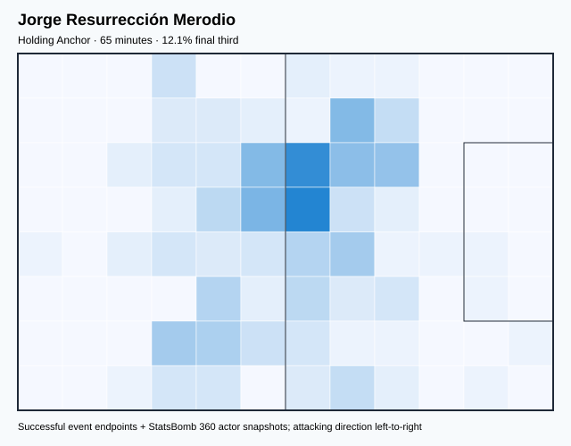

## Physical profile

| Metric | Score |
|---|---:|
| Aerial dominance | 0.000 |
| Pressing intensity per 90 | 12.41 |
| Recovery index per 90 | 0.00 |

## Top chemistry partners

- Rodrigo Hernández Cascante — synergy 0.202, 65 shared minutes
- Aymeric Laporte — synergy 0.199, 65 shared minutes
- Unai Simón Mendibil — synergy 0.199, 65 shared minutes

## Tactical recommendations

- Lead the first pressing trigger and protect the inside passing lane.
- Avoid isolating this player in high-volume aerial matchups.
- Pair with a faster recovery defender after aggressive rotations.

_The heatmap combines successful event endpoints with StatsBomb 360 actor
snapshots. StatsBomb 360 is freeze-frame context, not continuous player
tracking. Ratings include eligible outfield players from 45 minutes and
goalkeepers from 90 minutes; ranking status communicates sample reliability._

---

<!-- PLAYER_REPORT 5: 5203_starter_report.md -->

# Sergio Busquets i Burgos — Starter Report

- Team: Spain (ESP)
- Position: Center Defensive Midfield
- Functional role: Holding Anchor
- VAEP offense per 90: -0.0152
- VAEP defense per 90: -0.0123
- VAEP total per 90: -0.0275
- VAEP per touch: -0.00016
- Spatial xT per 90: 0.0464
- Final-third spatial share: 22.0%
- Unified final player rating: 0.0097
- Team rank: #16

## Physical profile

| Metric | Score |
|---|---:|
| Aerial dominance | 0.667 |
| Pressing intensity per 90 | 10.44 |
| Recovery index per 90 | 2.85 |

## Top chemistry partners

- Rodrigo Hernández Cascante — synergy 0.742, 379 shared minutes
- Unai Simón Mendibil — synergy 0.725, 379 shared minutes
- Pedro González López — synergy 0.718, 372 shared minutes

## Tactical recommendations

- Use a compact pressing trigger rather than sustained solo pressure.
- Target this player on direct restarts and back-post deliveries.
- Use recovery capacity to support higher attacking positions.

_The heatmap combines successful event endpoints with StatsBomb 360 actor
snapshots. StatsBomb 360 is freeze-frame context, not continuous player
tracking. Ratings include eligible outfield players from 45 minutes and
goalkeepers from 90 minutes; ranking status communicates sample reliability._

---

<!-- PLAYER_REPORT 6: 5211_starter_report.md -->

# Jordi Alba Ramos — Starter Report

- Team: Spain (ESP)
- Position: Left Back
- Functional role: Attacking Wingback
- VAEP offense per 90: 0.3569
- VAEP defense per 90: 0.0016
- VAEP total per 90: 0.3585
- VAEP per touch: 0.00111
- Spatial xT per 90: 0.1039
- Final-third spatial share: 31.4%
- Unified final player rating: 0.1088
- Team rank: #9

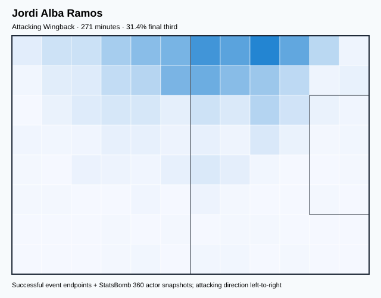

## Physical profile

| Metric | Score |
|---|---:|
| Aerial dominance | 0.250 |
| Pressing intensity per 90 | 13.63 |
| Recovery index per 90 | 4.99 |

## Top chemistry partners

- Unai Simón Mendibil — synergy 0.615, 271 shared minutes
- Sergio Busquets i Burgos — synergy 0.614, 271 shared minutes
- Rodrigo Hernández Cascante — synergy 0.614, 271 shared minutes

## Tactical recommendations

- Lead the first pressing trigger and protect the inside passing lane.
- Use recovery capacity to support higher attacking positions.

_The heatmap combines successful event endpoints with StatsBomb 360 actor
snapshots. StatsBomb 360 is freeze-frame context, not continuous player
tracking. Ratings include eligible outfield players from 45 minutes and
goalkeepers from 90 minutes; ranking status communicates sample reliability._

---

<!-- PLAYER_REPORT 7: 5719_starter_report.md -->

# Marco Asensio Willemsen — Starter Report

- Team: Spain (ESP)
- Position: Center Forward
- Functional role: Progressive Winger
- VAEP offense per 90: 0.7770
- VAEP defense per 90: 0.0217
- VAEP total per 90: 0.7988
- VAEP per touch: 0.00512
- Spatial xT per 90: 0.0208
- Final-third spatial share: 60.4%
- Unified final player rating: 0.2964
- Team rank: #1

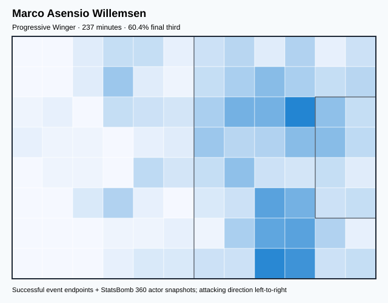

## Physical profile

| Metric | Score |
|---|---:|
| Aerial dominance | 0.333 |
| Pressing intensity per 90 | 10.63 |
| Recovery index per 90 | 1.90 |

## Top chemistry partners

- Rodrigo Hernández Cascante — synergy 0.542, 237 shared minutes
- Unai Simón Mendibil — synergy 0.528, 237 shared minutes
- Pedro González López — synergy 0.517, 225 shared minutes

## Tactical recommendations

- Use a compact pressing trigger rather than sustained solo pressure.
- Pair with a faster recovery defender after aggressive rotations.

_The heatmap combines successful event endpoints with StatsBomb 360 actor
snapshots. StatsBomb 360 is freeze-frame context, not continuous player
tracking. Ratings include eligible outfield players from 45 minutes and
goalkeepers from 90 minutes; ranking status communicates sample reliability._

---

<!-- PLAYER_REPORT 8: 5721_starter_report.md -->

# Daniel Carvajal Ramos — Starter Report

- Team: Spain (ESP)
- Position: Right Back
- Functional role: Two-Way Fullback
- VAEP offense per 90: 0.0789
- VAEP defense per 90: -0.1921
- VAEP total per 90: -0.1132
- VAEP per touch: -0.00057
- Spatial xT per 90: 0.0309
- Final-third spatial share: 22.2%
- Unified final player rating: 0.0279
- Team rank: #15

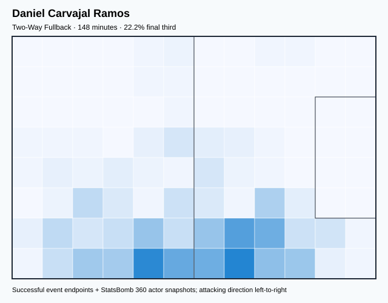

## Physical profile

| Metric | Score |
|---|---:|
| Aerial dominance | 1.000 |
| Pressing intensity per 90 | 7.91 |
| Recovery index per 90 | 4.87 |

## Top chemistry partners

- Rodrigo Hernández Cascante — synergy 0.419, 148 shared minutes
- Sergio Busquets i Burgos — synergy 0.405, 148 shared minutes
- Daniel Olmo Carvajal — synergy 0.405, 148 shared minutes

## Tactical recommendations

- Use a compact pressing trigger rather than sustained solo pressure.
- Target this player on direct restarts and back-post deliveries.
- Use recovery capacity to support higher attacking positions.

_The heatmap combines successful event endpoints with StatsBomb 360 actor
snapshots. StatsBomb 360 is freeze-frame context, not continuous player
tracking. Ratings include eligible outfield players from 45 minutes and
goalkeepers from 90 minutes; ranking status communicates sample reliability._

---

<!-- PLAYER_REPORT 9: 6583_starter_report.md -->

# Carlos Soler Barragán — Starter Report

- Team: Spain (ESP)
- Position: Right Center Midfield
- Functional role: Progressive Winger
- VAEP offense per 90: -0.1166
- VAEP defense per 90: 0.0097
- VAEP total per 90: -0.1068
- VAEP per touch: -0.00050
- Spatial xT per 90: 0.0791
- Final-third spatial share: 32.7%
- Unified final player rating: 0.0810
- Team rank: #11

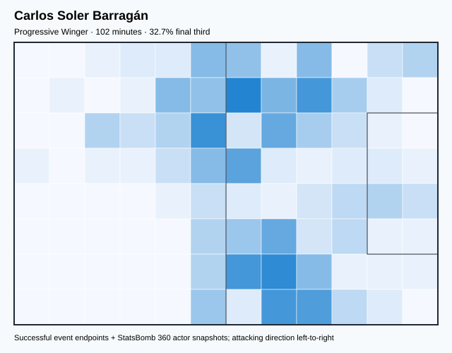

## Physical profile

| Metric | Score |
|---|---:|
| Aerial dominance | 0.000 |
| Pressing intensity per 90 | 7.94 |
| Recovery index per 90 | 4.41 |

## Top chemistry partners

- Rodrigo Hernández Cascante — synergy 0.310, 102 shared minutes
- Aymeric Laporte — synergy 0.294, 102 shared minutes
- Unai Simón Mendibil — synergy 0.292, 102 shared minutes

## Tactical recommendations

- Use a compact pressing trigger rather than sustained solo pressure.
- Avoid isolating this player in high-volume aerial matchups.
- Use recovery capacity to support higher attacking positions.

_The heatmap combines successful event endpoints with StatsBomb 360 actor
snapshots. StatsBomb 360 is freeze-frame context, not continuous player
tracking. Ratings include eligible outfield players from 45 minutes and
goalkeepers from 90 minutes; ranking status communicates sample reliability._

---

<!-- PLAYER_REPORT 10: 6748_starter_report.md -->

# Ferrán Torres García — Starter Report

- Team: Spain (ESP)
- Position: Right Wing
- Functional role: Progressive Winger
- VAEP offense per 90: 0.4283
- VAEP defense per 90: 0.0296
- VAEP total per 90: 0.4579
- VAEP per touch: 0.00325
- Spatial xT per 90: 0.0532
- Final-third spatial share: 56.3%
- Unified final player rating: 0.1980
- Team rank: #5

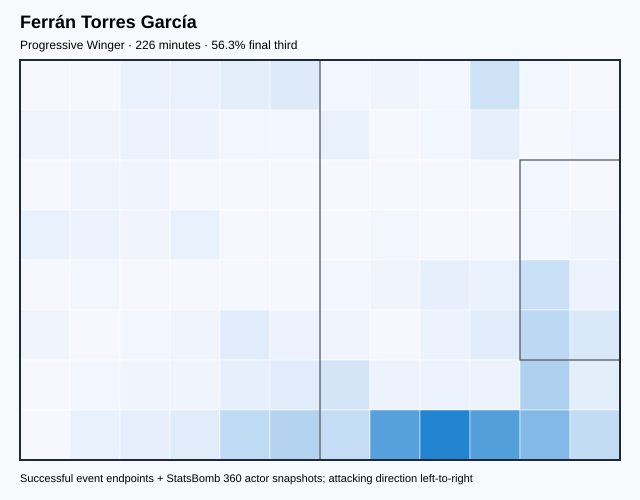

## Physical profile

| Metric | Score |
|---|---:|
| Aerial dominance | 0.250 |
| Pressing intensity per 90 | 12.75 |
| Recovery index per 90 | 3.19 |

## Top chemistry partners

- Sergio Busquets i Burgos — synergy 0.547, 226 shared minutes
- Unai Simón Mendibil — synergy 0.530, 226 shared minutes
- Pedro González López — synergy 0.478, 226 shared minutes

## Tactical recommendations

- Lead the first pressing trigger and protect the inside passing lane.
- Use recovery capacity to support higher attacking positions.

_The heatmap combines successful event endpoints with StatsBomb 360 actor
snapshots. StatsBomb 360 is freeze-frame context, not continuous player
tracking. Ratings include eligible outfield players from 45 minutes and
goalkeepers from 90 minutes; ranking status communicates sample reliability._

---

<!-- PLAYER_REPORT 11: 6765_starter_report.md -->

# Rodrigo Hernández Cascante — Starter Report

- Team: Spain (ESP)
- Position: Right Center Back
- Functional role: Ball-Playing Centre-Back
- VAEP offense per 90: 0.0901
- VAEP defense per 90: -0.0547
- VAEP total per 90: 0.0354
- VAEP per touch: 0.00009
- Spatial xT per 90: 0.0496
- Final-third spatial share: 7.4%
- Unified final player rating: 0.0085
- Team rank: #17

## Physical profile

| Metric | Score |
|---|---:|
| Aerial dominance | 0.750 |
| Pressing intensity per 90 | 5.00 |
| Recovery index per 90 | 4.35 |

## Top chemistry partners

- Unai Simón Mendibil — synergy 0.779, 414 shared minutes
- Pedro González López — synergy 0.745, 372 shared minutes
- Sergio Busquets i Burgos — synergy 0.742, 379 shared minutes

## Tactical recommendations

- Use a compact pressing trigger rather than sustained solo pressure.
- Target this player on direct restarts and back-post deliveries.
- Use recovery capacity to support higher attacking positions.

_The heatmap combines successful event endpoints with StatsBomb 360 actor
snapshots. StatsBomb 360 is freeze-frame context, not continuous player
tracking. Ratings include eligible outfield players from 45 minutes and
goalkeepers from 90 minutes; ranking status communicates sample reliability._

---

<!-- PLAYER_REPORT 12: 6840_starter_report.md -->

# Marcos Llorente Moreno — Starter Report

- Team: Spain (ESP)
- Position: Right Back
- Functional role: Two-Way Fullback
- VAEP offense per 90: 0.1089
- VAEP defense per 90: -0.0031
- VAEP total per 90: 0.1058
- VAEP per touch: 0.00054
- Spatial xT per 90: 0.0017
- Final-third spatial share: 26.3%
- Unified final player rating: 0.0536
- Team rank: #13

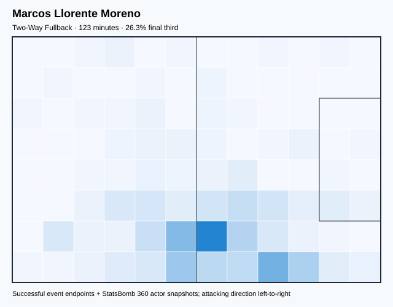

## Physical profile

| Metric | Score |
|---|---:|
| Aerial dominance | 0.000 |
| Pressing intensity per 90 | 13.17 |
| Recovery index per 90 | 7.31 |

## Top chemistry partners

- Rodrigo Hernández Cascante — synergy 0.363, 123 shared minutes
- Aymeric Laporte — synergy 0.357, 123 shared minutes
- Pedro González López — synergy 0.348, 123 shared minutes

## Tactical recommendations

- Lead the first pressing trigger and protect the inside passing lane.
- Avoid isolating this player in high-volume aerial matchups.
- Use recovery capacity to support higher attacking positions.

_The heatmap combines successful event endpoints with StatsBomb 360 actor
snapshots. StatsBomb 360 is freeze-frame context, not continuous player
tracking. Ratings include eligible outfield players from 45 minutes and
goalkeepers from 90 minutes; ranking status communicates sample reliability._

---

<!-- PLAYER_REPORT 13: 6892_starter_report.md -->

# Pau Francisco Torres — Starter Report

- Team: Spain (ESP)
- Position: Left Center Back
- Functional role: Sweeper CB
- VAEP offense per 90: 0.0336
- VAEP defense per 90: -0.0428
- VAEP total per 90: -0.0092
- VAEP per touch: -0.00002
- Spatial xT per 90: 0.0648
- Final-third spatial share: 4.8%
- Unified final player rating: -0.0060
- Team rank: #19

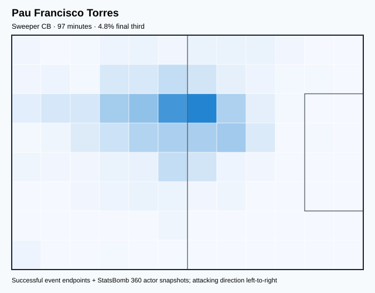

## Physical profile

| Metric | Score |
|---|---:|
| Aerial dominance | 0.500 |
| Pressing intensity per 90 | 3.71 |
| Recovery index per 90 | 4.64 |

## Top chemistry partners

- Rodrigo Hernández Cascante — synergy 0.301, 97 shared minutes
- Unai Simón Mendibil — synergy 0.296, 97 shared minutes
- Sergio Busquets i Burgos — synergy 0.287, 97 shared minutes

## Tactical recommendations

- Use a compact pressing trigger rather than sustained solo pressure.
- Use recovery capacity to support higher attacking positions.

_The heatmap combines successful event endpoints with StatsBomb 360 actor
snapshots. StatsBomb 360 is freeze-frame context, not continuous player
tracking. Ratings include eligible outfield players from 45 minutes and
goalkeepers from 90 minutes; ranking status communicates sample reliability._

---

<!-- PLAYER_REPORT 14: 11748_starter_report.md -->

# Unai Simón Mendibil — Starter Report

- Team: Spain (ESP)
- Position: Goalkeeper
- Functional role: Goalkeeper
- VAEP offense per 90: -0.0189
- VAEP defense per 90: -0.0314
- VAEP total per 90: -0.0503
- VAEP per touch: -0.00060
- Spatial xT per 90: 0.0007
- Final-third spatial share: 0.0%
- Unified final player rating: -0.0439
- Team rank: #20

## Physical profile

| Metric | Score |
|---|---:|
| Aerial dominance | 0.000 |
| Pressing intensity per 90 | 0.00 |
| Recovery index per 90 | 2.61 |

## Top chemistry partners

- Rodrigo Hernández Cascante — synergy 0.779, 414 shared minutes
- Sergio Busquets i Burgos — synergy 0.725, 379 shared minutes
- Aymeric Laporte — synergy 0.686, 317 shared minutes

## Tactical recommendations

- Use a compact pressing trigger rather than sustained solo pressure.
- Avoid isolating this player in high-volume aerial matchups.
- Use recovery capacity to support higher attacking positions.

_The heatmap combines successful event endpoints with StatsBomb 360 actor
snapshots. StatsBomb 360 is freeze-frame context, not continuous player
tracking. Ratings include eligible outfield players from 45 minutes and
goalkeepers from 90 minutes; ranking status communicates sample reliability._

---

<!-- PLAYER_REPORT 15: 16532_starter_report.md -->

# Daniel Olmo Carvajal — Starter Report

- Team: Spain (ESP)
- Position: Left Wing
- Functional role: Progressive Winger
- VAEP offense per 90: 0.5137
- VAEP defense per 90: 0.0442
- VAEP total per 90: 0.5579
- VAEP per touch: 0.00347
- Spatial xT per 90: 0.0722
- Final-third spatial share: 51.0%
- Unified final player rating: 0.2312
- Team rank: #3

## Physical profile

| Metric | Score |
|---|---:|
| Aerial dominance | 0.167 |
| Pressing intensity per 90 | 12.05 |
| Recovery index per 90 | 3.94 |

## Top chemistry partners

- Rodrigo Hernández Cascante — synergy 0.658, 388 shared minutes
- Pedro González López — synergy 0.649, 347 shared minutes
- Sergio Busquets i Burgos — synergy 0.611, 354 shared minutes

## Tactical recommendations

- Lead the first pressing trigger and protect the inside passing lane.
- Avoid isolating this player in high-volume aerial matchups.
- Use recovery capacity to support higher attacking positions.

_The heatmap combines successful event endpoints with StatsBomb 360 actor
snapshots. StatsBomb 360 is freeze-frame context, not continuous player
tracking. Ratings include eligible outfield players from 45 minutes and
goalkeepers from 90 minutes; ranking status communicates sample reliability._

---

<!-- PLAYER_REPORT 16: 30486_starter_report.md -->

# Pedro González López — Starter Report

- Team: Spain (ESP)
- Position: Left Center Midfield
- Functional role: Holding Anchor
- VAEP offense per 90: 0.1876
- VAEP defense per 90: 0.0062
- VAEP total per 90: 0.1938
- VAEP per touch: 0.00064
- Spatial xT per 90: 0.1051
- Final-third spatial share: 28.9%
- Unified final player rating: 0.1126
- Team rank: #8

## Physical profile

| Metric | Score |
|---|---:|
| Aerial dominance | 0.600 |
| Pressing intensity per 90 | 14.74 |
| Recovery index per 90 | 6.28 |

## Top chemistry partners

- Rodrigo Hernández Cascante — synergy 0.745, 372 shared minutes
- Sergio Busquets i Burgos — synergy 0.718, 372 shared minutes
- Daniel Olmo Carvajal — synergy 0.649, 347 shared minutes

## Tactical recommendations

- Lead the first pressing trigger and protect the inside passing lane.
- Target this player on direct restarts and back-post deliveries.
- Use recovery capacity to support higher attacking positions.

_The heatmap combines successful event endpoints with StatsBomb 360 actor
snapshots. StatsBomb 360 is freeze-frame context, not continuous player
tracking. Ratings include eligible outfield players from 45 minutes and
goalkeepers from 90 minutes; ranking status communicates sample reliability._

---

<!-- PLAYER_REPORT 17: 30756_starter_report.md -->

# Anssumane Fati — Starter Report

- Team: Spain (ESP)
- Position: Left Wing
- Functional role: Ball-Winner
- VAEP offense per 90: 0.7663
- VAEP defense per 90: 0.1219
- VAEP total per 90: 0.8882
- VAEP per touch: 0.00577
- Spatial xT per 90: -0.0613
- Final-third spatial share: 70.5%
- Unified final player rating: 0.2048
- Team rank: #4

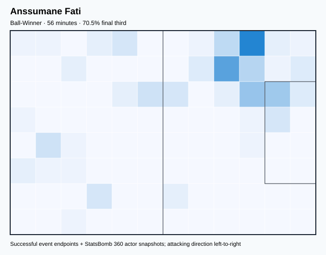

## Physical profile

| Metric | Score |
|---|---:|
| Aerial dominance | 0.250 |
| Pressing intensity per 90 | 4.86 |
| Recovery index per 90 | 3.24 |

## Top chemistry partners

- Sergio Busquets i Burgos — synergy 0.176, 56 shared minutes
- Unai Simón Mendibil — synergy 0.164, 56 shared minutes
- Pedro González López — synergy 0.139, 56 shared minutes

## Tactical recommendations

- Use a compact pressing trigger rather than sustained solo pressure.
- Use recovery capacity to support higher attacking positions.

_The heatmap combines successful event endpoints with StatsBomb 360 actor
snapshots. StatsBomb 360 is freeze-frame context, not continuous player
tracking. Ratings include eligible outfield players from 45 minutes and
goalkeepers from 90 minutes; ranking status communicates sample reliability._

---

<!-- PLAYER_REPORT 18: 39161_starter_report.md -->

# Alejandro Balde Martínez — Starter Report

- Team: Spain (ESP)
- Position: Left Back
- Functional role: Wide Creator
- VAEP offense per 90: 0.4048
- VAEP defense per 90: -0.0568
- VAEP total per 90: 0.3479
- VAEP per touch: 0.00161
- Spatial xT per 90: 0.0483
- Final-third spatial share: 26.2%
- Unified final player rating: 0.0852
- Team rank: #10

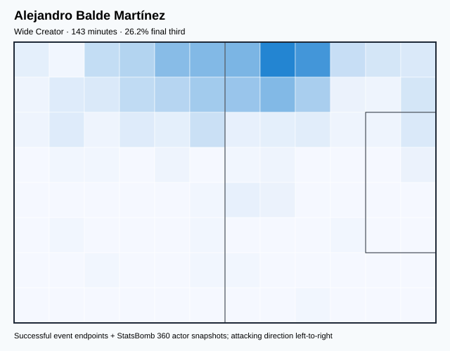

## Physical profile

| Metric | Score |
|---|---:|
| Aerial dominance | 0.000 |
| Pressing intensity per 90 | 16.34 |
| Recovery index per 90 | 3.14 |

## Top chemistry partners

- Unai Simón Mendibil — synergy 0.396, 143 shared minutes
- Rodrigo Hernández Cascante — synergy 0.395, 143 shared minutes
- Daniel Olmo Carvajal — synergy 0.340, 118 shared minutes

## Tactical recommendations

- Lead the first pressing trigger and protect the inside passing lane.
- Avoid isolating this player in high-volume aerial matchups.
- Use recovery capacity to support higher attacking positions.

_The heatmap combines successful event endpoints with StatsBomb 360 actor
snapshots. StatsBomb 360 is freeze-frame context, not continuous player
tracking. Ratings include eligible outfield players from 45 minutes and
goalkeepers from 90 minutes; ranking status communicates sample reliability._

---

<!-- PLAYER_REPORT 19: 68574_starter_report.md -->

# Nicholas Williams Arthuer — Starter Report

- Team: Spain (ESP)
- Position: Right Wing
- Functional role: Progressive Winger
- VAEP offense per 90: 0.1825
- VAEP defense per 90: 0.0050
- VAEP total per 90: 0.1875
- VAEP per touch: 0.00126
- Spatial xT per 90: 0.1001
- Final-third spatial share: 45.0%
- Unified final player rating: 0.1603
- Team rank: #6

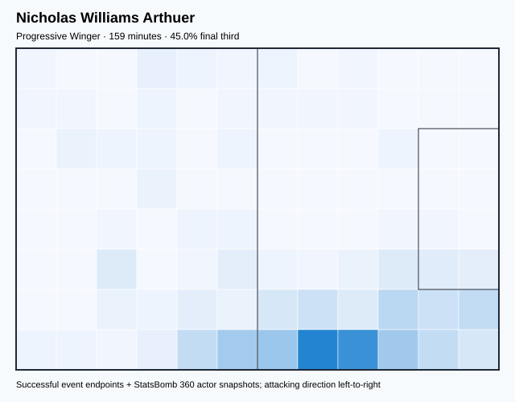

## Physical profile

| Metric | Score |
|---|---:|
| Aerial dominance | 0.000 |
| Pressing intensity per 90 | 14.74 |
| Recovery index per 90 | 3.40 |

## Top chemistry partners

- Rodrigo Hernández Cascante — synergy 0.406, 159 shared minutes
- Unai Simón Mendibil — synergy 0.393, 159 shared minutes
- Daniel Olmo Carvajal — synergy 0.362, 138 shared minutes

## Tactical recommendations

- Lead the first pressing trigger and protect the inside passing lane.
- Avoid isolating this player in high-volume aerial matchups.
- Use recovery capacity to support higher attacking positions.

_The heatmap combines successful event endpoints with StatsBomb 360 actor
snapshots. StatsBomb 360 is freeze-frame context, not continuous player
tracking. Ratings include eligible outfield players from 45 minutes and
goalkeepers from 90 minutes; ranking status communicates sample reliability._

---

<!-- PLAYER_REPORT 20: 133353_starter_report.md -->

# Pablo Martín Páez Gavira — Starter Report

- Team: Spain (ESP)
- Position: Right Center Midfield
- Functional role: Ball-Winner
- VAEP offense per 90: 0.2026
- VAEP defense per 90: 0.0265
- VAEP total per 90: 0.2291
- VAEP per touch: 0.00151
- Spatial xT per 90: 0.0430
- Final-third spatial share: 33.0%
- Unified final player rating: 0.1141
- Team rank: #7

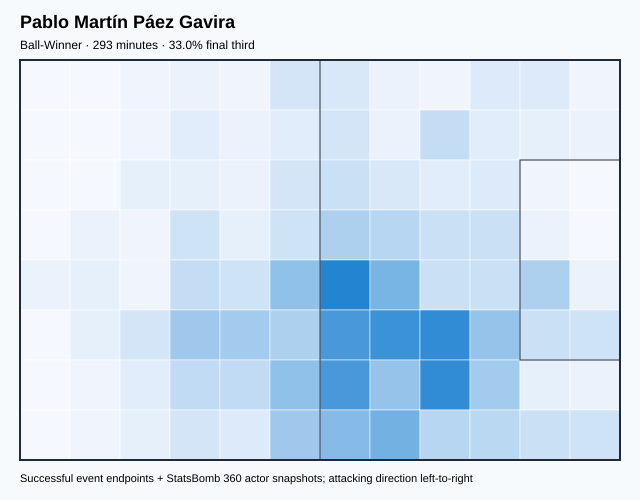

## Physical profile

| Metric | Score |
|---|---:|
| Aerial dominance | 0.300 |
| Pressing intensity per 90 | 17.79 |
| Recovery index per 90 | 3.99 |

## Top chemistry partners

- Rodrigo Hernández Cascante — synergy 0.657, 293 shared minutes
- Unai Simón Mendibil — synergy 0.608, 293 shared minutes
- Sergio Busquets i Burgos — synergy 0.571, 259 shared minutes

## Tactical recommendations

- Lead the first pressing trigger and protect the inside passing lane.
- Use recovery capacity to support higher attacking positions.

_The heatmap combines successful event endpoints with StatsBomb 360 actor
snapshots. StatsBomb 360 is freeze-frame context, not continuous player
tracking. Ratings include eligible outfield players from 45 minutes and
goalkeepers from 90 minutes; ranking status communicates sample reliability._
