# FRA — V4 Player Evaluation Collection

- Included 300+ minute players: 12
- Rankings use one cross-role 360-VAEP plus xT formula.
- Heatmaps combine successful on-ball endpoints and SB360 actor snapshots.

---

<!-- PLAYER_REPORT 1: 3009_starter_report.md -->

# Kylian Mbappé Lottin — Starter Report

- Team: France (FRA)
- Position: Left Center Forward
- Functional role: Progressive Winger
- VAEP offense per 90: 1.8760
- VAEP defense per 90: 0.0127
- VAEP total per 90: 1.8888
- VAEP per touch: 0.01357
- Spatial xT per 90: 0.1198
- Final-third spatial share: 59.0%
- Unified final player rating: 0.9724
- Team rank: #1

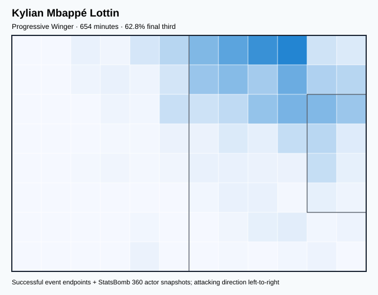

## Physical profile

| Metric | Score |
|---|---:|
| Aerial dominance | 0.250 |
| Pressing intensity per 90 | 5.23 |
| Recovery index per 90 | 3.99 |

## Top chemistry partners

- Aurélien Djani Tchouaméni — synergy 0.773, 600 shared minutes
- Theo Bernard François Hernández — synergy 0.767, 548 shared minutes
- Adrien Rabiot — synergy 0.721, 529 shared minutes

## Tactical recommendations

- Use a compact pressing trigger rather than sustained solo pressure.
- Use recovery capacity to support higher attacking positions.

_The heatmap combines successful event endpoints with StatsBomb 360 actor
snapshots. StatsBomb 360 is freeze-frame context, not continuous player
tracking. Scores exclude players below 300 tournament minutes._

---

<!-- PLAYER_REPORT 2: 3026_starter_report.md -->

# Adrien Rabiot — Starter Report

- Team: France (FRA)
- Position: Left Defensive Midfield
- Functional role: Ball-Winner
- VAEP offense per 90: 0.5712
- VAEP defense per 90: -0.0324
- VAEP total per 90: 0.5388
- VAEP per touch: 0.00395
- Spatial xT per 90: 0.0095
- Final-third spatial share: 29.6%
- Unified final player rating: 0.2725
- Team rank: #3

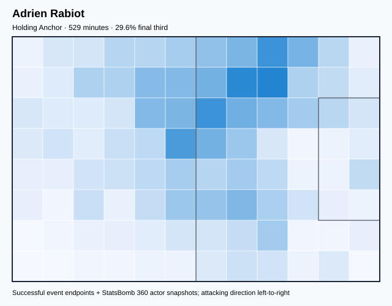

## Physical profile

| Metric | Score |
|---|---:|
| Aerial dominance | 0.667 |
| Pressing intensity per 90 | 15.98 |
| Recovery index per 90 | 3.57 |

## Top chemistry partners

- Aurélien Djani Tchouaméni — synergy 0.813, 475 shared minutes
- Theo Bernard François Hernández — synergy 0.797, 453 shared minutes
- Dayotchanculle Upamecano — synergy 0.791, 489 shared minutes

## Tactical recommendations

- Lead the first pressing trigger and protect the inside passing lane.
- Target this player on direct restarts and back-post deliveries.
- Use recovery capacity to support higher attacking positions.

_The heatmap combines successful event endpoints with StatsBomb 360 actor
snapshots. StatsBomb 360 is freeze-frame context, not continuous player
tracking. Scores exclude players below 300 tournament minutes._

---

<!-- PLAYER_REPORT 3: 3099_starter_report.md -->

# Hugo Lloris — Starter Report

- Team: France (FRA)
- Position: Goalkeeper
- Functional role: Goalkeeper
- VAEP offense per 90: -0.0159
- VAEP defense per 90: 0.1190
- VAEP total per 90: 0.1031
- VAEP per touch: 0.00214
- Spatial xT per 90: 0.0047
- Final-third spatial share: 1.3%
- Unified final player rating: 0.0531
- Team rank: #7

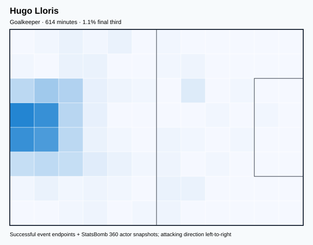

## Physical profile

| Metric | Score |
|---|---:|
| Aerial dominance | 0.000 |
| Pressing intensity per 90 | 0.00 |
| Recovery index per 90 | 2.34 |

## Top chemistry partners

- Dayotchanculle Upamecano — synergy 0.842, 518 shared minutes
- Aurélien Djani Tchouaméni — synergy 0.840, 560 shared minutes
- Jules Koundé — synergy 0.834, 514 shared minutes

## Tactical recommendations

- Use a compact pressing trigger rather than sustained solo pressure.
- Avoid isolating this player in high-volume aerial matchups.
- Pair with a faster recovery defender after aggressive rotations.

_The heatmap combines successful event endpoints with StatsBomb 360 actor
snapshots. StatsBomb 360 is freeze-frame context, not continuous player
tracking. Scores exclude players below 300 tournament minutes._

---

<!-- PLAYER_REPORT 4: 3604_starter_report.md -->

# Olivier Giroud — Starter Report

- Team: France (FRA)
- Position: Center Forward
- Functional role: Target Forward
- VAEP offense per 90: 1.7446
- VAEP defense per 90: 0.0965
- VAEP total per 90: 1.8411
- VAEP per touch: 0.03315
- Spatial xT per 90: 0.0090
- Final-third spatial share: 37.3%
- Unified final player rating: 0.9323
- Team rank: #2

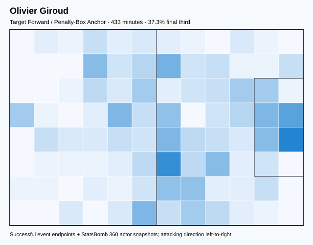

## Physical profile

| Metric | Score |
|---|---:|
| Aerial dominance | 0.558 |
| Pressing intensity per 90 | 12.69 |
| Recovery index per 90 | 0.62 |

## Top chemistry partners

- Aurélien Djani Tchouaméni — synergy 0.685, 410 shared minutes
- Theo Bernard François Hernández — synergy 0.662, 421 shared minutes
- Adrien Rabiot — synergy 0.654, 368 shared minutes

## Tactical recommendations

- Lead the first pressing trigger and protect the inside passing lane.
- Pair with a faster recovery defender after aggressive rotations.

_The heatmap combines successful event endpoints with StatsBomb 360 actor
snapshots. StatsBomb 360 is freeze-frame context, not continuous player
tracking. Scores exclude players below 300 tournament minutes._

---

<!-- PLAYER_REPORT 5: 4445_starter_report.md -->

# Jules Koundé — Starter Report

- Team: France (FRA)
- Position: Right Back
- Functional role: Box-to-Box Runner
- VAEP offense per 90: 0.0645
- VAEP defense per 90: -0.0531
- VAEP total per 90: 0.0114
- VAEP per touch: 0.00009
- Spatial xT per 90: 0.0154
- Final-third spatial share: 18.4%
- Unified final player rating: 0.0088
- Team rank: #9

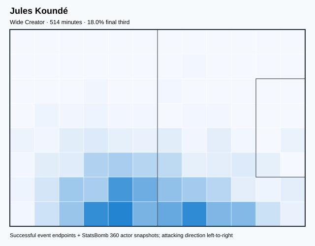

## Physical profile

| Metric | Score |
|---|---:|
| Aerial dominance | 0.632 |
| Pressing intensity per 90 | 9.62 |
| Recovery index per 90 | 2.62 |

## Top chemistry partners

- Hugo Lloris — synergy 0.834, 514 shared minutes
- Raphaël Varane — synergy 0.802, 474 shared minutes
- Aurélien Djani Tchouaméni — synergy 0.790, 480 shared minutes

## Tactical recommendations

- Use a compact pressing trigger rather than sustained solo pressure.
- Target this player on direct restarts and back-post deliveries.
- Use recovery capacity to support higher attacking positions.

_The heatmap combines successful event endpoints with StatsBomb 360 actor
snapshots. StatsBomb 360 is freeze-frame context, not continuous player
tracking. Scores exclude players below 300 tournament minutes._

---

<!-- PLAYER_REPORT 6: 5477_starter_report.md -->

# Ousmane Dembélé — Starter Report

- Team: France (FRA)
- Position: Right Wing
- Functional role: Progressive Winger
- VAEP offense per 90: 0.4151
- VAEP defense per 90: -0.0049
- VAEP total per 90: 0.4103
- VAEP per touch: 0.00319
- Spatial xT per 90: 0.1039
- Final-third spatial share: 53.5%
- Unified final player rating: 0.2269
- Team rank: #5

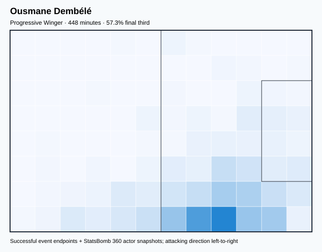

## Physical profile

| Metric | Score |
|---|---:|
| Aerial dominance | 0.500 |
| Pressing intensity per 90 | 18.88 |
| Recovery index per 90 | 4.22 |

## Top chemistry partners

- Aurélien Djani Tchouaméni — synergy 0.762, 438 shared minutes
- Antoine Griezmann — synergy 0.736, 448 shared minutes
- Raphaël Varane — synergy 0.709, 347 shared minutes

## Tactical recommendations

- Lead the first pressing trigger and protect the inside passing lane.
- Use recovery capacity to support higher attacking positions.

_The heatmap combines successful event endpoints with StatsBomb 360 actor
snapshots. StatsBomb 360 is freeze-frame context, not continuous player
tracking. Scores exclude players below 300 tournament minutes._

---

<!-- PLAYER_REPORT 7: 5485_starter_report.md -->

# Raphaël Varane — Starter Report

- Team: France (FRA)
- Position: Right Center Back
- Functional role: Deep Playmaker
- VAEP offense per 90: 0.0421
- VAEP defense per 90: -0.0163
- VAEP total per 90: 0.0258
- VAEP per touch: 0.00021
- Spatial xT per 90: 0.0064
- Final-third spatial share: 4.9%
- Unified final player rating: 0.0142
- Team rank: #8

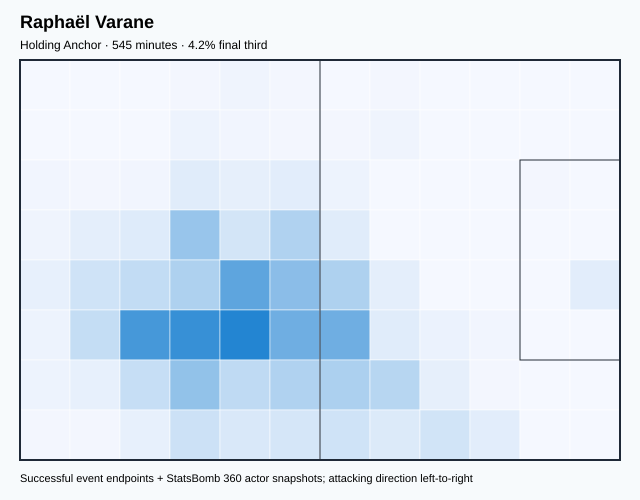

## Physical profile

| Metric | Score |
|---|---:|
| Aerial dominance | 0.538 |
| Pressing intensity per 90 | 3.64 |
| Recovery index per 90 | 1.65 |

## Top chemistry partners

- Aurélien Djani Tchouaméni — synergy 0.842, 511 shared minutes
- Hugo Lloris — synergy 0.820, 482 shared minutes
- Jules Koundé — synergy 0.802, 474 shared minutes

## Tactical recommendations

- Use a compact pressing trigger rather than sustained solo pressure.
- Pair with a faster recovery defender after aggressive rotations.

_The heatmap combines successful event endpoints with StatsBomb 360 actor
snapshots. StatsBomb 360 is freeze-frame context, not continuous player
tracking. Scores exclude players below 300 tournament minutes._

---

<!-- PLAYER_REPORT 8: 5487_starter_report.md -->

# Antoine Griezmann — Starter Report

- Team: France (FRA)
- Position: Center Attacking Midfield
- Functional role: Ball-Winner
- VAEP offense per 90: 0.4858
- VAEP defense per 90: -0.0152
- VAEP total per 90: 0.4706
- VAEP per touch: 0.00353
- Spatial xT per 90: 0.1182
- Final-third spatial share: 35.3%
- Unified final player rating: 0.2600
- Team rank: #4

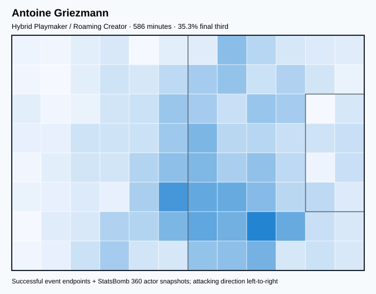

## Physical profile

| Metric | Score |
|---|---:|
| Aerial dominance | 0.643 |
| Pressing intensity per 90 | 20.89 |
| Recovery index per 90 | 3.84 |

## Top chemistry partners

- Aurélien Djani Tchouaméni — synergy 0.834, 531 shared minutes
- Dayotchanculle Upamecano — synergy 0.776, 460 shared minutes
- Theo Bernard François Hernández — synergy 0.766, 544 shared minutes

## Tactical recommendations

- Lead the first pressing trigger and protect the inside passing lane.
- Target this player on direct restarts and back-post deliveries.
- Use recovery capacity to support higher attacking positions.

_The heatmap combines successful event endpoints with StatsBomb 360 actor
snapshots. StatsBomb 360 is freeze-frame context, not continuous player
tracking. Scores exclude players below 300 tournament minutes._

---

<!-- PLAYER_REPORT 9: 6704_starter_report.md -->

# Theo Bernard François Hernández — Starter Report

- Team: France (FRA)
- Position: Left Back
- Functional role: Wide Creator
- VAEP offense per 90: 0.2293
- VAEP defense per 90: -0.0390
- VAEP total per 90: 0.1903
- VAEP per touch: 0.00134
- Spatial xT per 90: 0.0505
- Final-third spatial share: 27.8%
- Unified final player rating: 0.1057
- Team rank: #6

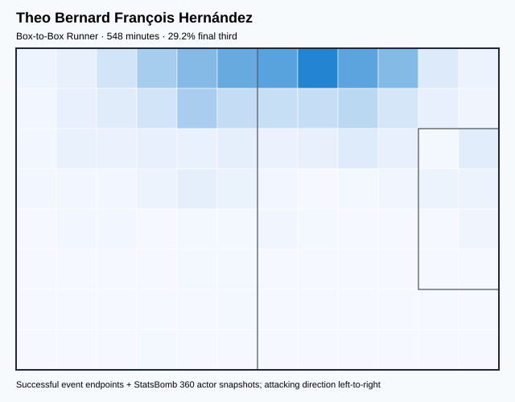

## Physical profile

| Metric | Score |
|---|---:|
| Aerial dominance | 0.600 |
| Pressing intensity per 90 | 12.63 |
| Recovery index per 90 | 3.94 |

## Top chemistry partners

- Aurélien Djani Tchouaméni — synergy 0.816, 494 shared minutes
- Dayotchanculle Upamecano — synergy 0.809, 453 shared minutes
- Hugo Lloris — synergy 0.800, 548 shared minutes

## Tactical recommendations

- Lead the first pressing trigger and protect the inside passing lane.
- Target this player on direct restarts and back-post deliveries.
- Use recovery capacity to support higher attacking positions.

_The heatmap combines successful event endpoints with StatsBomb 360 actor
snapshots. StatsBomb 360 is freeze-frame context, not continuous player
tracking. Scores exclude players below 300 tournament minutes._

---

<!-- PLAYER_REPORT 10: 8519_starter_report.md -->

# Dayotchanculle Upamecano — Starter Report

- Team: France (FRA)
- Position: Left Center Back
- Functional role: Deep Playmaker
- VAEP offense per 90: -0.0043
- VAEP defense per 90: -0.2125
- VAEP total per 90: -0.2169
- VAEP per touch: -0.00135
- Spatial xT per 90: 0.0137
- Final-third spatial share: 3.9%
- Unified final player rating: -0.1061
- Team rank: #12

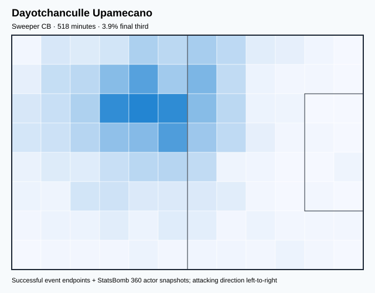

## Physical profile

| Metric | Score |
|---|---:|
| Aerial dominance | 0.333 |
| Pressing intensity per 90 | 11.98 |
| Recovery index per 90 | 2.78 |

## Top chemistry partners

- Hugo Lloris — synergy 0.842, 518 shared minutes
- Aurélien Djani Tchouaméni — synergy 0.815, 464 shared minutes
- Theo Bernard François Hernández — synergy 0.809, 453 shared minutes

## Tactical recommendations

- Lead the first pressing trigger and protect the inside passing lane.
- Use recovery capacity to support higher attacking positions.

_The heatmap combines successful event endpoints with StatsBomb 360 actor
snapshots. StatsBomb 360 is freeze-frame context, not continuous player
tracking. Scores exclude players below 300 tournament minutes._

---

<!-- PLAYER_REPORT 11: 10481_starter_report.md -->

# Aurélien Djani Tchouaméni — Starter Report

- Team: France (FRA)
- Position: Right Defensive Midfield
- Functional role: Ball-Winner
- VAEP offense per 90: 0.0362
- VAEP defense per 90: -0.0662
- VAEP total per 90: -0.0299
- VAEP per touch: -0.00017
- Spatial xT per 90: 0.0271
- Final-third spatial share: 15.0%
- Unified final player rating: -0.0096
- Team rank: #10

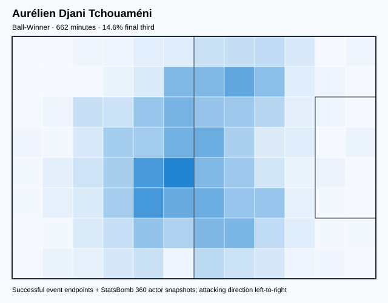

## Physical profile

| Metric | Score |
|---|---:|
| Aerial dominance | 0.750 |
| Pressing intensity per 90 | 10.74 |
| Recovery index per 90 | 4.89 |

## Top chemistry partners

- Raphaël Varane — synergy 0.842, 511 shared minutes
- Hugo Lloris — synergy 0.840, 560 shared minutes
- Antoine Griezmann — synergy 0.834, 531 shared minutes

## Tactical recommendations

- Use a compact pressing trigger rather than sustained solo pressure.
- Target this player on direct restarts and back-post deliveries.
- Use recovery capacity to support higher attacking positions.

_The heatmap combines successful event endpoints with StatsBomb 360 actor
snapshots. StatsBomb 360 is freeze-frame context, not continuous player
tracking. Scores exclude players below 300 tournament minutes._

---

<!-- PLAYER_REPORT 12: 11135_starter_report.md -->

# Ibrahima Konaté — Starter Report

- Team: France (FRA)
- Position: Left Center Back
- Functional role: Deep Playmaker
- VAEP offense per 90: 0.0760
- VAEP defense per 90: -0.1043
- VAEP total per 90: -0.0283
- VAEP per touch: -0.00016
- Spatial xT per 90: 0.0182
- Final-third spatial share: 3.6%
- Unified final player rating: -0.0106
- Team rank: #11

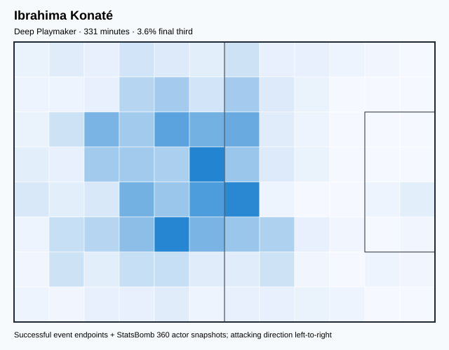

## Physical profile

| Metric | Score |
|---|---:|
| Aerial dominance | 0.900 |
| Pressing intensity per 90 | 6.80 |
| Recovery index per 90 | 3.54 |

## Top chemistry partners

- Aurélien Djani Tchouaméni — synergy 0.665, 310 shared minutes
- Kylian Mbappé Lottin — synergy 0.607, 268 shared minutes
- Antoine Griezmann — synergy 0.562, 242 shared minutes

## Tactical recommendations

- Use a compact pressing trigger rather than sustained solo pressure.
- Target this player on direct restarts and back-post deliveries.
- Use recovery capacity to support higher attacking positions.

_The heatmap combines successful event endpoints with StatsBomb 360 actor
snapshots. StatsBomb 360 is freeze-frame context, not continuous player
tracking. Scores exclude players below 300 tournament minutes._
