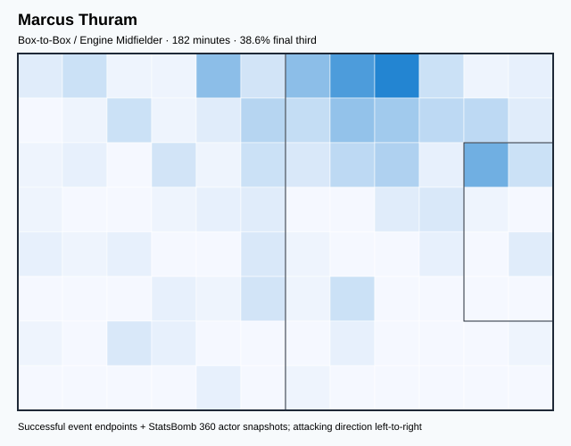
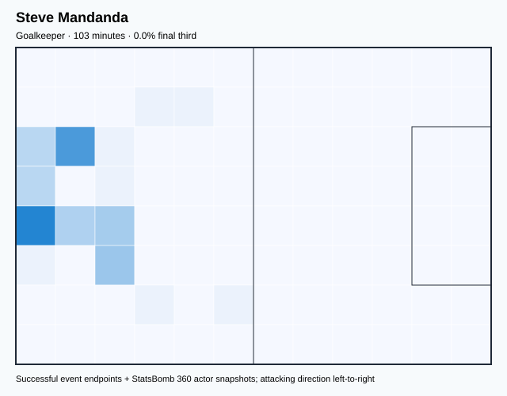
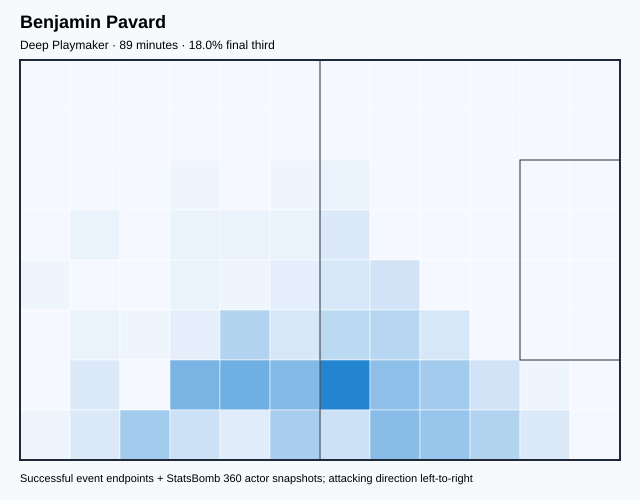
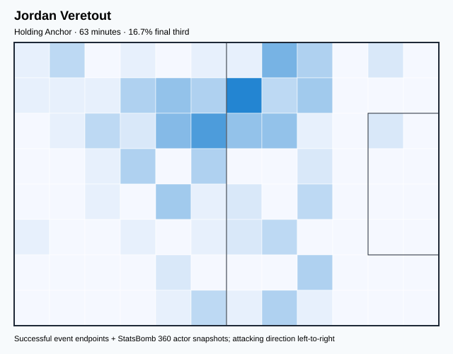
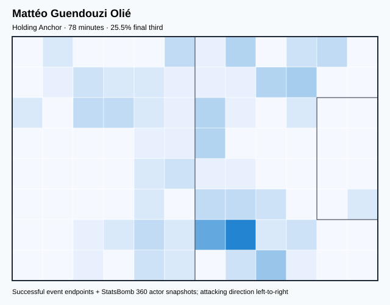
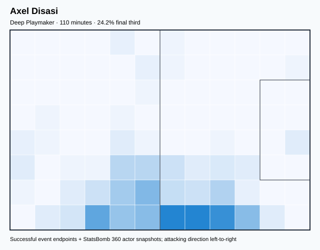
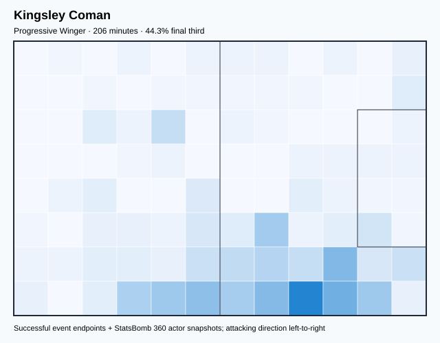
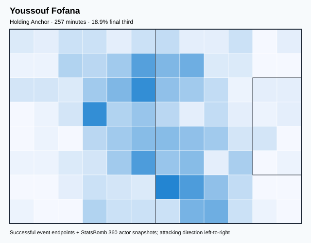
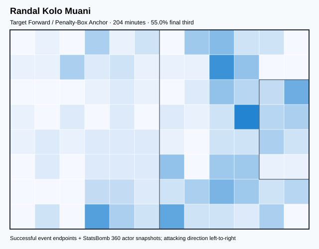
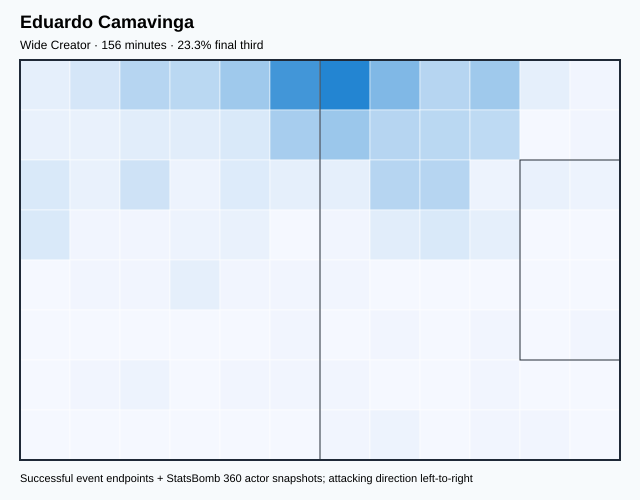

# FRA — V4 Player Evaluation Collection

<!-- V5_CANONICAL_NOTICE -->
> **Historical V4 player-rating packet.** Player ratings, ranks, role-challenger decisions, and rating uncertainty below are superseded by `results/reports/player_rankings.csv`, `results/reports/player_profiles/`, and `results/reports/model_summary.md`. Possession, tactical, and match-bootstrap material remains a historical V4 result.

- Included eligible players: 22
- Rankings use the role-aware, development-gated VAEP/xT/xD model.
- Heatmaps combine successful on-ball endpoints and SB360 actor snapshots.

---

<!-- PLAYER_REPORT 1: 2972_starter_report.md -->

# Marcus Thuram — Starter Report

- Team: France (FRA)
- Position: Left Midfield
- Functional role: Box-to-Box / Engine Midfielder
- VAEP offense per 90: 0.3108
- VAEP defense per 90: 0.0270
- VAEP total per 90: 0.3377
- VAEP per touch: 0.00366
- Spatial xT per 90: 0.0574
- Final-third spatial share: 38.6%
- Unified final player rating: 0.1291
- Team rank: #8

## Physical profile

| Metric | Score |
|---|---:|
| Aerial dominance | 0.500 |
| Pressing intensity per 90 | 15.86 |
| Recovery index per 90 | 3.97 |

## Top chemistry partners

- Jules Koundé — synergy 0.434, 170 shared minutes
- Aurélien Djani Tchouaméni — synergy 0.369, 149 shared minutes
- Kylian Mbappé Lottin — synergy 0.361, 182 shared minutes

## Tactical recommendations

- Lead the first pressing trigger and protect the inside passing lane.
- Use recovery capacity to support higher attacking positions.

_The heatmap combines successful event endpoints with StatsBomb 360 actor
snapshots. StatsBomb 360 is freeze-frame context, not continuous player
tracking. Ratings include eligible outfield players from 45 minutes and
goalkeepers from 90 minutes; ranking status communicates sample reliability._

---

<!-- PLAYER_REPORT 2: 3009_starter_report.md -->

# Kylian Mbappé Lottin — Starter Report

- Team: France (FRA)
- Position: Left Center Forward
- Functional role: Progressive Winger
- VAEP offense per 90: 0.6059
- VAEP defense per 90: 0.0188
- VAEP total per 90: 0.6248
- VAEP per touch: 0.00449
- Spatial xT per 90: 0.1343
- Final-third spatial share: 59.0%
- Unified final player rating: 0.2993
- Team rank: #1

## Physical profile

| Metric | Score |
|---|---:|
| Aerial dominance | 0.250 |
| Pressing intensity per 90 | 5.23 |
| Recovery index per 90 | 3.99 |

## Top chemistry partners

- Aurélien Djani Tchouaméni — synergy 0.773, 600 shared minutes
- Theo Bernard François Hernández — synergy 0.767, 548 shared minutes
- Adrien Rabiot — synergy 0.721, 529 shared minutes

## Tactical recommendations

- Use a compact pressing trigger rather than sustained solo pressure.
- Use recovery capacity to support higher attacking positions.

_The heatmap combines successful event endpoints with StatsBomb 360 actor
snapshots. StatsBomb 360 is freeze-frame context, not continuous player
tracking. Ratings include eligible outfield players from 45 minutes and
goalkeepers from 90 minutes; ranking status communicates sample reliability._

---

<!-- PLAYER_REPORT 3: 3026_starter_report.md -->

# Adrien Rabiot — Starter Report

- Team: France (FRA)
- Position: Left Defensive Midfield
- Functional role: Holding Anchor
- VAEP offense per 90: 0.2687
- VAEP defense per 90: -0.0252
- VAEP total per 90: 0.2434
- VAEP per touch: 0.00179
- Spatial xT per 90: 0.0126
- Final-third spatial share: 29.6%
- Unified final player rating: 0.0774
- Team rank: #11

## Physical profile

| Metric | Score |
|---|---:|
| Aerial dominance | 0.667 |
| Pressing intensity per 90 | 15.98 |
| Recovery index per 90 | 3.57 |

## Top chemistry partners

- Aurélien Djani Tchouaméni — synergy 0.813, 475 shared minutes
- Theo Bernard François Hernández — synergy 0.797, 453 shared minutes
- Dayotchanculle Upamecano — synergy 0.791, 489 shared minutes

## Tactical recommendations

- Lead the first pressing trigger and protect the inside passing lane.
- Target this player on direct restarts and back-post deliveries.
- Use recovery capacity to support higher attacking positions.

_The heatmap combines successful event endpoints with StatsBomb 360 actor
snapshots. StatsBomb 360 is freeze-frame context, not continuous player
tracking. Ratings include eligible outfield players from 45 minutes and
goalkeepers from 90 minutes; ranking status communicates sample reliability._

---

<!-- PLAYER_REPORT 4: 3099_starter_report.md -->

# Hugo Lloris — Starter Report

- Team: France (FRA)
- Position: Goalkeeper
- Functional role: Goalkeeper
- VAEP offense per 90: -0.0048
- VAEP defense per 90: -0.0389
- VAEP total per 90: -0.0437
- VAEP per touch: -0.00091
- Spatial xT per 90: 0.0061
- Final-third spatial share: 1.3%
- Unified final player rating: -0.0380
- Team rank: #21

## Physical profile

| Metric | Score |
|---|---:|
| Aerial dominance | 0.000 |
| Pressing intensity per 90 | 0.00 |
| Recovery index per 90 | 2.34 |

## Top chemistry partners

- Dayotchanculle Upamecano — synergy 0.842, 518 shared minutes
- Aurélien Djani Tchouaméni — synergy 0.840, 560 shared minutes
- Jules Koundé — synergy 0.834, 514 shared minutes

## Tactical recommendations

- Use a compact pressing trigger rather than sustained solo pressure.
- Avoid isolating this player in high-volume aerial matchups.
- Pair with a faster recovery defender after aggressive rotations.

_The heatmap combines successful event endpoints with StatsBomb 360 actor
snapshots. StatsBomb 360 is freeze-frame context, not continuous player
tracking. Ratings include eligible outfield players from 45 minutes and
goalkeepers from 90 minutes; ranking status communicates sample reliability._

---

<!-- PLAYER_REPORT 5: 3543_starter_report.md -->

# Steve Mandanda — Starter Report

- Team: France (FRA)
- Position: Goalkeeper
- Functional role: Goalkeeper
- VAEP offense per 90: -0.0105
- VAEP defense per 90: -0.0923
- VAEP total per 90: -0.1027
- VAEP per touch: -0.00217
- Spatial xT per 90: 0.0006
- Final-third spatial share: 0.0%
- Unified final player rating: -0.0595
- Team rank: #22

## Physical profile

| Metric | Score |
|---|---:|
| Aerial dominance | 0.000 |
| Pressing intensity per 90 | 0.00 |
| Recovery index per 90 | 6.14 |

## Top chemistry partners

- Ibrahima Konaté — synergy 0.298, 103 shared minutes
- Aurélien Djani Tchouaméni — synergy 0.296, 103 shared minutes
- Eduardo Camavinga — synergy 0.293, 103 shared minutes

## Tactical recommendations

- Use a compact pressing trigger rather than sustained solo pressure.
- Avoid isolating this player in high-volume aerial matchups.
- Use recovery capacity to support higher attacking positions.

_The heatmap combines successful event endpoints with StatsBomb 360 actor
snapshots. StatsBomb 360 is freeze-frame context, not continuous player
tracking. Ratings include eligible outfield players from 45 minutes and
goalkeepers from 90 minutes; ranking status communicates sample reliability._

---

<!-- PLAYER_REPORT 6: 3604_starter_report.md -->

# Olivier Giroud — Starter Report

- Team: France (FRA)
- Position: Center Forward
- Functional role: Target Forward / Penalty-Box Anchor
- VAEP offense per 90: 0.4420
- VAEP defense per 90: 0.0551
- VAEP total per 90: 0.4970
- VAEP per touch: 0.00895
- Spatial xT per 90: 0.0075
- Final-third spatial share: 37.3%
- Unified final player rating: 0.2458
- Team rank: #3

## Physical profile

| Metric | Score |
|---|---:|
| Aerial dominance | 0.558 |
| Pressing intensity per 90 | 12.69 |
| Recovery index per 90 | 0.62 |

## Top chemistry partners

- Aurélien Djani Tchouaméni — synergy 0.685, 410 shared minutes
- Theo Bernard François Hernández — synergy 0.662, 421 shared minutes
- Adrien Rabiot — synergy 0.654, 368 shared minutes

## Tactical recommendations

- Lead the first pressing trigger and protect the inside passing lane.
- Pair with a faster recovery defender after aggressive rotations.

_The heatmap combines successful event endpoints with StatsBomb 360 actor
snapshots. StatsBomb 360 is freeze-frame context, not continuous player
tracking. Ratings include eligible outfield players from 45 minutes and
goalkeepers from 90 minutes; ranking status communicates sample reliability._

---

<!-- PLAYER_REPORT 7: 4445_starter_report.md -->

# Jules Koundé — Starter Report

- Team: France (FRA)
- Position: Right Back
- Functional role: Deep Playmaker
- VAEP offense per 90: 0.0893
- VAEP defense per 90: -0.0790
- VAEP total per 90: 0.0103
- VAEP per touch: 0.00008
- Spatial xT per 90: 0.0185
- Final-third spatial share: 18.4%
- Unified final player rating: 0.0298
- Team rank: #15

## Physical profile

| Metric | Score |
|---|---:|
| Aerial dominance | 0.632 |
| Pressing intensity per 90 | 9.62 |
| Recovery index per 90 | 2.62 |

## Top chemistry partners

- Hugo Lloris — synergy 0.834, 514 shared minutes
- Raphaël Varane — synergy 0.802, 474 shared minutes
- Aurélien Djani Tchouaméni — synergy 0.790, 480 shared minutes

## Tactical recommendations

- Use a compact pressing trigger rather than sustained solo pressure.
- Target this player on direct restarts and back-post deliveries.
- Use recovery capacity to support higher attacking positions.

_The heatmap combines successful event endpoints with StatsBomb 360 actor
snapshots. StatsBomb 360 is freeze-frame context, not continuous player
tracking. Ratings include eligible outfield players from 45 minutes and
goalkeepers from 90 minutes; ranking status communicates sample reliability._

---

<!-- PLAYER_REPORT 8: 5476_starter_report.md -->

# Benjamin Pavard — Starter Report

- Team: France (FRA)
- Position: Right Back
- Functional role: Deep Playmaker
- VAEP offense per 90: 0.0280
- VAEP defense per 90: 0.0014
- VAEP total per 90: 0.0294
- VAEP per touch: 0.00013
- Spatial xT per 90: 0.0111
- Final-third spatial share: 18.0%
- Unified final player rating: 0.0476
- Team rank: #13

## Physical profile

| Metric | Score |
|---|---:|
| Aerial dominance | 0.000 |
| Pressing intensity per 90 | 2.03 |
| Recovery index per 90 | 3.05 |

## Top chemistry partners

- Ibrahima Konaté — synergy 0.276, 89 shared minutes
- Antoine Griezmann — synergy 0.273, 89 shared minutes
- Dayotchanculle Upamecano — synergy 0.272, 89 shared minutes

## Tactical recommendations

- Use a compact pressing trigger rather than sustained solo pressure.
- Avoid isolating this player in high-volume aerial matchups.
- Use recovery capacity to support higher attacking positions.

_The heatmap combines successful event endpoints with StatsBomb 360 actor
snapshots. StatsBomb 360 is freeze-frame context, not continuous player
tracking. Ratings include eligible outfield players from 45 minutes and
goalkeepers from 90 minutes; ranking status communicates sample reliability._

---

<!-- PLAYER_REPORT 9: 5477_starter_report.md -->

# Ousmane Dembélé — Starter Report

- Team: France (FRA)
- Position: Right Wing
- Functional role: Progressive Winger
- VAEP offense per 90: 0.3254
- VAEP defense per 90: 0.0062
- VAEP total per 90: 0.3316
- VAEP per touch: 0.00258
- Spatial xT per 90: 0.1122
- Final-third spatial share: 53.5%
- Unified final player rating: 0.1828
- Team rank: #5

## Physical profile

| Metric | Score |
|---|---:|
| Aerial dominance | 0.500 |
| Pressing intensity per 90 | 18.88 |
| Recovery index per 90 | 4.22 |

## Top chemistry partners

- Aurélien Djani Tchouaméni — synergy 0.762, 438 shared minutes
- Antoine Griezmann — synergy 0.736, 448 shared minutes
- Raphaël Varane — synergy 0.709, 347 shared minutes

## Tactical recommendations

- Lead the first pressing trigger and protect the inside passing lane.
- Use recovery capacity to support higher attacking positions.

_The heatmap combines successful event endpoints with StatsBomb 360 actor
snapshots. StatsBomb 360 is freeze-frame context, not continuous player
tracking. Ratings include eligible outfield players from 45 minutes and
goalkeepers from 90 minutes; ranking status communicates sample reliability._

---

<!-- PLAYER_REPORT 10: 5485_starter_report.md -->

# Raphaël Varane — Starter Report

- Team: France (FRA)
- Position: Right Center Back
- Functional role: Ball-Playing Centre-Back
- VAEP offense per 90: 0.0423
- VAEP defense per 90: -0.0166
- VAEP total per 90: 0.0256
- VAEP per touch: 0.00021
- Spatial xT per 90: 0.0120
- Final-third spatial share: 4.9%
- Unified final player rating: 0.0042
- Team rank: #18

## Physical profile

| Metric | Score |
|---|---:|
| Aerial dominance | 0.538 |
| Pressing intensity per 90 | 3.64 |
| Recovery index per 90 | 1.65 |

## Top chemistry partners

- Aurélien Djani Tchouaméni — synergy 0.842, 511 shared minutes
- Hugo Lloris — synergy 0.820, 482 shared minutes
- Jules Koundé — synergy 0.802, 474 shared minutes

## Tactical recommendations

- Use a compact pressing trigger rather than sustained solo pressure.
- Pair with a faster recovery defender after aggressive rotations.

_The heatmap combines successful event endpoints with StatsBomb 360 actor
snapshots. StatsBomb 360 is freeze-frame context, not continuous player
tracking. Ratings include eligible outfield players from 45 minutes and
goalkeepers from 90 minutes; ranking status communicates sample reliability._

---

<!-- PLAYER_REPORT 11: 5487_starter_report.md -->

# Antoine Griezmann — Starter Report

- Team: France (FRA)
- Position: Center Attacking Midfield
- Functional role: Hybrid Playmaker / Roaming Creator
- VAEP offense per 90: 0.3536
- VAEP defense per 90: -0.0158
- VAEP total per 90: 0.3378
- VAEP per touch: 0.00253
- Spatial xT per 90: 0.1166
- Final-third spatial share: 35.3%
- Unified final player rating: 0.1859
- Team rank: #4

## Physical profile

| Metric | Score |
|---|---:|
| Aerial dominance | 0.643 |
| Pressing intensity per 90 | 20.89 |
| Recovery index per 90 | 3.84 |

## Top chemistry partners

- Aurélien Djani Tchouaméni — synergy 0.834, 531 shared minutes
- Dayotchanculle Upamecano — synergy 0.776, 460 shared minutes
- Theo Bernard François Hernández — synergy 0.766, 544 shared minutes

## Tactical recommendations

- Lead the first pressing trigger and protect the inside passing lane.
- Target this player on direct restarts and back-post deliveries.
- Use recovery capacity to support higher attacking positions.

_The heatmap combines successful event endpoints with StatsBomb 360 actor
snapshots. StatsBomb 360 is freeze-frame context, not continuous player
tracking. Ratings include eligible outfield players from 45 minutes and
goalkeepers from 90 minutes; ranking status communicates sample reliability._

---

<!-- PLAYER_REPORT 12: 6704_starter_report.md -->

# Theo Bernard François Hernández — Starter Report

- Team: France (FRA)
- Position: Left Back
- Functional role: Attacking Wingback
- VAEP offense per 90: 0.1915
- VAEP defense per 90: -0.0101
- VAEP total per 90: 0.1814
- VAEP per touch: 0.00128
- Spatial xT per 90: 0.0466
- Final-third spatial share: 27.8%
- Unified final player rating: 0.0793
- Team rank: #10

## Physical profile

| Metric | Score |
|---|---:|
| Aerial dominance | 0.600 |
| Pressing intensity per 90 | 12.63 |
| Recovery index per 90 | 3.94 |

## Top chemistry partners

- Aurélien Djani Tchouaméni — synergy 0.816, 494 shared minutes
- Dayotchanculle Upamecano — synergy 0.809, 453 shared minutes
- Hugo Lloris — synergy 0.800, 548 shared minutes

## Tactical recommendations

- Lead the first pressing trigger and protect the inside passing lane.
- Target this player on direct restarts and back-post deliveries.
- Use recovery capacity to support higher attacking positions.

_The heatmap combines successful event endpoints with StatsBomb 360 actor
snapshots. StatsBomb 360 is freeze-frame context, not continuous player
tracking. Ratings include eligible outfield players from 45 minutes and
goalkeepers from 90 minutes; ranking status communicates sample reliability._

---

<!-- PLAYER_REPORT 13: 7153_starter_report.md -->

# Jordan Veretout — Starter Report

- Team: France (FRA)
- Position: Left Center Midfield
- Functional role: Holding Anchor
- VAEP offense per 90: 0.0363
- VAEP defense per 90: -0.0051
- VAEP total per 90: 0.0312
- VAEP per touch: 0.00022
- Spatial xT per 90: 0.0027
- Final-third spatial share: 16.7%
- Unified final player rating: 0.0967
- Team rank: #9

## Physical profile

| Metric | Score |
|---|---:|
| Aerial dominance | 0.500 |
| Pressing intensity per 90 | 12.92 |
| Recovery index per 90 | 2.87 |

## Top chemistry partners

- Eduardo Camavinga — synergy 0.202, 63 shared minutes
- Aurélien Djani Tchouaméni — synergy 0.201, 63 shared minutes
- Mattéo Guendouzi Olié — synergy 0.199, 63 shared minutes

## Tactical recommendations

- Lead the first pressing trigger and protect the inside passing lane.
- Use recovery capacity to support higher attacking positions.

_The heatmap combines successful event endpoints with StatsBomb 360 actor
snapshots. StatsBomb 360 is freeze-frame context, not continuous player
tracking. Ratings include eligible outfield players from 45 minutes and
goalkeepers from 90 minutes; ranking status communicates sample reliability._

---

<!-- PLAYER_REPORT 14: 7345_starter_report.md -->

# Mattéo Guendouzi Olié — Starter Report

- Team: France (FRA)
- Position: Left Wing
- Functional role: Holding Anchor
- VAEP offense per 90: 0.1173
- VAEP defense per 90: -0.0008
- VAEP total per 90: 0.1165
- VAEP per touch: 0.00111
- Spatial xT per 90: 0.0155
- Final-third spatial share: 25.5%
- Unified final player rating: 0.1596
- Team rank: #6

## Physical profile

| Metric | Score |
|---|---:|
| Aerial dominance | 1.000 |
| Pressing intensity per 90 | 2.30 |
| Recovery index per 90 | 5.76 |

## Top chemistry partners

- Aurélien Djani Tchouaméni — synergy 0.243, 78 shared minutes
- Axel Disasi — synergy 0.237, 78 shared minutes
- Ibrahima Konaté — synergy 0.230, 78 shared minutes

## Tactical recommendations

- Use a compact pressing trigger rather than sustained solo pressure.
- Target this player on direct restarts and back-post deliveries.
- Use recovery capacity to support higher attacking positions.

_The heatmap combines successful event endpoints with StatsBomb 360 actor
snapshots. StatsBomb 360 is freeze-frame context, not continuous player
tracking. Ratings include eligible outfield players from 45 minutes and
goalkeepers from 90 minutes; ranking status communicates sample reliability._

---

<!-- PLAYER_REPORT 15: 7439_starter_report.md -->

# Axel Disasi — Starter Report

- Team: France (FRA)
- Position: Right Back
- Functional role: Deep Playmaker
- VAEP offense per 90: 0.0986
- VAEP defense per 90: -0.0651
- VAEP total per 90: 0.0334
- VAEP per touch: 0.00023
- Spatial xT per 90: 0.0163
- Final-third spatial share: 24.2%
- Unified final player rating: 0.0470
- Team rank: #14

## Physical profile

| Metric | Score |
|---|---:|
| Aerial dominance | 1.000 |
| Pressing intensity per 90 | 9.79 |
| Recovery index per 90 | 0.82 |

## Top chemistry partners

- Aurélien Djani Tchouaméni — synergy 0.319, 106 shared minutes
- Ibrahima Konaté — synergy 0.294, 106 shared minutes
- Steve Mandanda — synergy 0.280, 103 shared minutes

## Tactical recommendations

- Use a compact pressing trigger rather than sustained solo pressure.
- Target this player on direct restarts and back-post deliveries.
- Pair with a faster recovery defender after aggressive rotations.

_The heatmap combines successful event endpoints with StatsBomb 360 actor
snapshots. StatsBomb 360 is freeze-frame context, not continuous player
tracking. Ratings include eligible outfield players from 45 minutes and
goalkeepers from 90 minutes; ranking status communicates sample reliability._

---

<!-- PLAYER_REPORT 16: 8217_starter_report.md -->

# Kingsley Coman — Starter Report

- Team: France (FRA)
- Position: Right Wing
- Functional role: Progressive Winger
- VAEP offense per 90: 0.1742
- VAEP defense per 90: -0.0122
- VAEP total per 90: 0.1620
- VAEP per touch: 0.00136
- Spatial xT per 90: 0.0426
- Final-third spatial share: 44.3%
- Unified final player rating: 0.1494
- Team rank: #7

## Physical profile

| Metric | Score |
|---|---:|
| Aerial dominance | 0.143 |
| Pressing intensity per 90 | 19.26 |
| Recovery index per 90 | 3.50 |

## Top chemistry partners

- Aurélien Djani Tchouaméni — synergy 0.418, 161 shared minutes
- Raphaël Varane — synergy 0.374, 150 shared minutes
- Youssouf Fofana — synergy 0.359, 141 shared minutes

## Tactical recommendations

- Lead the first pressing trigger and protect the inside passing lane.
- Avoid isolating this player in high-volume aerial matchups.
- Use recovery capacity to support higher attacking positions.

_The heatmap combines successful event endpoints with StatsBomb 360 actor
snapshots. StatsBomb 360 is freeze-frame context, not continuous player
tracking. Ratings include eligible outfield players from 45 minutes and
goalkeepers from 90 minutes; ranking status communicates sample reliability._

---

<!-- PLAYER_REPORT 17: 8519_starter_report.md -->

# Dayotchanculle Upamecano — Starter Report

- Team: France (FRA)
- Position: Left Center Back
- Functional role: Sweeper CB
- VAEP offense per 90: 0.0022
- VAEP defense per 90: -0.0535
- VAEP total per 90: -0.0513
- VAEP per touch: -0.00032
- Spatial xT per 90: 0.0197
- Final-third spatial share: 3.9%
- Unified final player rating: -0.0159
- Team rank: #20

## Physical profile

| Metric | Score |
|---|---:|
| Aerial dominance | 0.333 |
| Pressing intensity per 90 | 11.98 |
| Recovery index per 90 | 2.78 |

## Top chemistry partners

- Hugo Lloris — synergy 0.842, 518 shared minutes
- Aurélien Djani Tchouaméni — synergy 0.815, 464 shared minutes
- Theo Bernard François Hernández — synergy 0.809, 453 shared minutes

## Tactical recommendations

- Lead the first pressing trigger and protect the inside passing lane.
- Use recovery capacity to support higher attacking positions.

_The heatmap combines successful event endpoints with StatsBomb 360 actor
snapshots. StatsBomb 360 is freeze-frame context, not continuous player
tracking. Ratings include eligible outfield players from 45 minutes and
goalkeepers from 90 minutes; ranking status communicates sample reliability._

---

<!-- PLAYER_REPORT 18: 10481_starter_report.md -->

# Aurélien Djani Tchouaméni — Starter Report

- Team: France (FRA)
- Position: Right Defensive Midfield
- Functional role: Holding / Controlling Midfielder
- VAEP offense per 90: -0.0011
- VAEP defense per 90: -0.0162
- VAEP total per 90: -0.0174
- VAEP per touch: -0.00010
- Spatial xT per 90: 0.0375
- Final-third spatial share: 15.0%
- Unified final player rating: 0.0080
- Team rank: #17

## Physical profile

| Metric | Score |
|---|---:|
| Aerial dominance | 0.750 |
| Pressing intensity per 90 | 10.74 |
| Recovery index per 90 | 4.89 |

## Top chemistry partners

- Raphaël Varane — synergy 0.842, 511 shared minutes
- Hugo Lloris — synergy 0.840, 560 shared minutes
- Antoine Griezmann — synergy 0.834, 531 shared minutes

## Tactical recommendations

- Use a compact pressing trigger rather than sustained solo pressure.
- Target this player on direct restarts and back-post deliveries.
- Use recovery capacity to support higher attacking positions.

_The heatmap combines successful event endpoints with StatsBomb 360 actor
snapshots. StatsBomb 360 is freeze-frame context, not continuous player
tracking. Ratings include eligible outfield players from 45 minutes and
goalkeepers from 90 minutes; ranking status communicates sample reliability._

---

<!-- PLAYER_REPORT 19: 11135_starter_report.md -->

# Ibrahima Konaté — Starter Report

- Team: France (FRA)
- Position: Left Center Back
- Functional role: Ball-Playing Centre-Back
- VAEP offense per 90: 0.0468
- VAEP defense per 90: -0.0459
- VAEP total per 90: 0.0009
- VAEP per touch: 0.00001
- Spatial xT per 90: 0.0290
- Final-third spatial share: 3.6%
- Unified final player rating: -0.0026
- Team rank: #19

## Physical profile

| Metric | Score |
|---|---:|
| Aerial dominance | 0.900 |
| Pressing intensity per 90 | 6.80 |
| Recovery index per 90 | 3.54 |

## Top chemistry partners

- Aurélien Djani Tchouaméni — synergy 0.665, 310 shared minutes
- Kylian Mbappé Lottin — synergy 0.607, 268 shared minutes
- Antoine Griezmann — synergy 0.562, 242 shared minutes

## Tactical recommendations

- Use a compact pressing trigger rather than sustained solo pressure.
- Target this player on direct restarts and back-post deliveries.
- Use recovery capacity to support higher attacking positions.

_The heatmap combines successful event endpoints with StatsBomb 360 actor
snapshots. StatsBomb 360 is freeze-frame context, not continuous player
tracking. Ratings include eligible outfield players from 45 minutes and
goalkeepers from 90 minutes; ranking status communicates sample reliability._

---

<!-- PLAYER_REPORT 20: 11990_starter_report.md -->

# Youssouf Fofana — Starter Report

- Team: France (FRA)
- Position: Left Defensive Midfield
- Functional role: Holding Anchor
- VAEP offense per 90: 0.0508
- VAEP defense per 90: -0.0090
- VAEP total per 90: 0.0418
- VAEP per touch: 0.00038
- Spatial xT per 90: 0.0228
- Final-third spatial share: 18.9%
- Unified final player rating: 0.0231
- Team rank: #16

## Physical profile

| Metric | Score |
|---|---:|
| Aerial dominance | 0.500 |
| Pressing intensity per 90 | 25.59 |
| Recovery index per 90 | 3.86 |

## Top chemistry partners

- Raphaël Varane — synergy 0.527, 209 shared minutes
- Ibrahima Konaté — synergy 0.524, 206 shared minutes
- Aurélien Djani Tchouaméni — synergy 0.517, 202 shared minutes

## Tactical recommendations

- Lead the first pressing trigger and protect the inside passing lane.
- Use recovery capacity to support higher attacking positions.

_The heatmap combines successful event endpoints with StatsBomb 360 actor
snapshots. StatsBomb 360 is freeze-frame context, not continuous player
tracking. Ratings include eligible outfield players from 45 minutes and
goalkeepers from 90 minutes; ranking status communicates sample reliability._

---

<!-- PLAYER_REPORT 21: 22097_starter_report.md -->

# Randal Kolo Muani — Starter Report

- Team: France (FRA)
- Position: Center Forward
- Functional role: Target Forward / Penalty-Box Anchor
- VAEP offense per 90: 0.5124
- VAEP defense per 90: 0.0544
- VAEP total per 90: 0.5668
- VAEP per touch: 0.00756
- Spatial xT per 90: 0.0363
- Final-third spatial share: 55.0%
- Unified final player rating: 0.2560
- Team rank: #2

## Physical profile

| Metric | Score |
|---|---:|
| Aerial dominance | 0.533 |
| Pressing intensity per 90 | 22.93 |
| Recovery index per 90 | 2.20 |

## Top chemistry partners

- Aurélien Djani Tchouaméni — synergy 0.466, 204 shared minutes
- Eduardo Camavinga — synergy 0.421, 156 shared minutes
- Ibrahima Konaté — synergy 0.359, 132 shared minutes

## Tactical recommendations

- Lead the first pressing trigger and protect the inside passing lane.
- Pair with a faster recovery defender after aggressive rotations.

_The heatmap combines successful event endpoints with StatsBomb 360 actor
snapshots. StatsBomb 360 is freeze-frame context, not continuous player
tracking. Ratings include eligible outfield players from 45 minutes and
goalkeepers from 90 minutes; ranking status communicates sample reliability._

---

<!-- PLAYER_REPORT 22: 24778_starter_report.md -->

# Eduardo Camavinga — Starter Report

- Team: France (FRA)
- Position: Left Back
- Functional role: Wide Creator
- VAEP offense per 90: 0.0815
- VAEP defense per 90: -0.0076
- VAEP total per 90: 0.0739
- VAEP per touch: 0.00046
- Spatial xT per 90: 0.0719
- Final-third spatial share: 23.3%
- Unified final player rating: 0.0531
- Team rank: #12

## Physical profile

| Metric | Score |
|---|---:|
| Aerial dominance | 0.600 |
| Pressing intensity per 90 | 21.30 |
| Recovery index per 90 | 6.91 |

## Top chemistry partners

- Aurélien Djani Tchouaméni — synergy 0.432, 156 shared minutes
- Randal Kolo Muani — synergy 0.421, 156 shared minutes
- Ibrahima Konaté — synergy 0.339, 114 shared minutes

## Tactical recommendations

- Lead the first pressing trigger and protect the inside passing lane.
- Target this player on direct restarts and back-post deliveries.
- Use recovery capacity to support higher attacking positions.

_The heatmap combines successful event endpoints with StatsBomb 360 actor
snapshots. StatsBomb 360 is freeze-frame context, not continuous player
tracking. Ratings include eligible outfield players from 45 minutes and
goalkeepers from 90 minutes; ranking status communicates sample reliability._
