# GER — V4 Player Evaluation Collection

<!-- V5_CANONICAL_NOTICE -->
> **Historical V4 player-rating packet.** Player ratings, ranks, role-challenger decisions, and rating uncertainty below are superseded by `results/reports/player_rankings.csv`, `results/reports/player_profiles/`, and `results/reports/model_summary.md`. Possession, tactical, and match-bootstrap material remains a historical V4 result.

- Included eligible players: 17
- Rankings use the role-aware, development-gated VAEP/xT/xD model.
- Heatmaps combine successful on-ball endpoints and SB360 actor snapshots.

---

<!-- PLAYER_REPORT 1: 3053_starter_report.md -->

# Leroy Sané — Starter Report

- Team: Germany (GER)
- Position: Right Wing
- Functional role: Progressive Winger
- VAEP offense per 90: 0.5878
- VAEP defense per 90: 0.0042
- VAEP total per 90: 0.5920
- VAEP per touch: 0.00461
- Spatial xT per 90: 0.1492
- Final-third spatial share: 61.8%
- Unified final player rating: 0.2097
- Team rank: #6

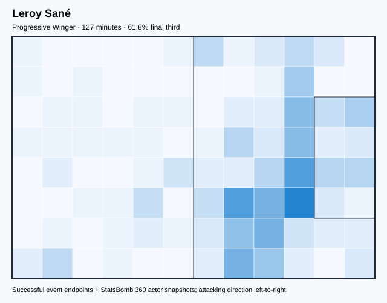

## Physical profile

| Metric | Score |
|---|---:|
| Aerial dominance | 0.250 |
| Pressing intensity per 90 | 10.65 |
| Recovery index per 90 | 2.13 |

## Top chemistry partners

- Joshua Kimmich — synergy 0.367, 127 shared minutes
- Antonio Rüdiger — synergy 0.351, 127 shared minutes
- Jamal Musiala — synergy 0.339, 127 shared minutes

## Tactical recommendations

- Use a compact pressing trigger rather than sustained solo pressure.
- Pair with a faster recovery defender after aggressive rotations.

_The heatmap combines successful event endpoints with StatsBomb 360 actor
snapshots. StatsBomb 360 is freeze-frame context, not continuous player
tracking. Ratings include eligible outfield players from 45 minutes and
goalkeepers from 90 minutes; ranking status communicates sample reliability._

---

<!-- PLAYER_REPORT 2: 3167_starter_report.md -->

# Antonio Rüdiger — Starter Report

- Team: Germany (GER)
- Position: Left Center Back
- Functional role: Ball-Playing Centre-Back
- VAEP offense per 90: 0.1603
- VAEP defense per 90: -0.0924
- VAEP total per 90: 0.0679
- VAEP per touch: 0.00033
- Spatial xT per 90: 0.0221
- Final-third spatial share: 7.7%
- Unified final player rating: 0.0097
- Team rank: #15

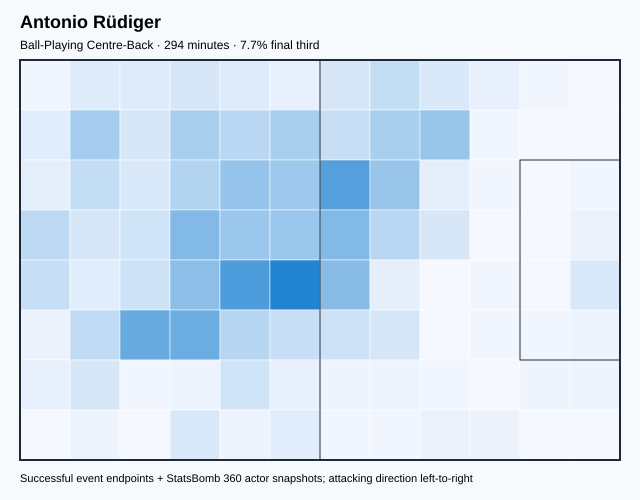

## Physical profile

| Metric | Score |
|---|---:|
| Aerial dominance | 0.667 |
| Pressing intensity per 90 | 4.29 |
| Recovery index per 90 | 4.59 |

## Top chemistry partners

- Manuel Neuer — synergy 0.657, 294 shared minutes
- Niklas Süle — synergy 0.652, 288 shared minutes
- Joshua Kimmich — synergy 0.618, 294 shared minutes

## Tactical recommendations

- Use a compact pressing trigger rather than sustained solo pressure.
- Target this player on direct restarts and back-post deliveries.
- Use recovery capacity to support higher attacking positions.

_The heatmap combines successful event endpoints with StatsBomb 360 actor
snapshots. StatsBomb 360 is freeze-frame context, not continuous player
tracking. Ratings include eligible outfield players from 45 minutes and
goalkeepers from 90 minutes; ranking status communicates sample reliability._

---

<!-- PLAYER_REPORT 3: 5562_starter_report.md -->

# Thomas Müller — Starter Report

- Team: Germany (GER)
- Position: Center Forward
- Functional role: Ball-Winner
- VAEP offense per 90: 0.6295
- VAEP defense per 90: 0.0341
- VAEP total per 90: 0.6636
- VAEP per touch: 0.00661
- Spatial xT per 90: -0.0120
- Final-third spatial share: 56.6%
- Unified final player rating: 0.2677
- Team rank: #4

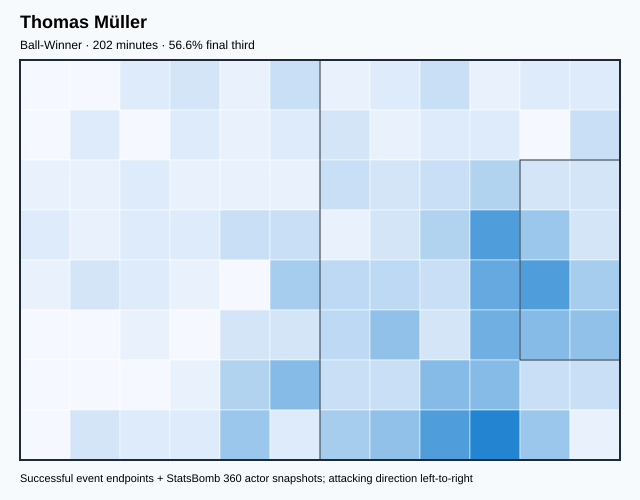

## Physical profile

| Metric | Score |
|---|---:|
| Aerial dominance | 0.200 |
| Pressing intensity per 90 | 23.20 |
| Recovery index per 90 | 0.45 |

## Top chemistry partners

- Niklas Süle — synergy 0.478, 202 shared minutes
- Serge Gnabry — synergy 0.421, 202 shared minutes
- Jamal Musiala — synergy 0.418, 202 shared minutes

## Tactical recommendations

- Lead the first pressing trigger and protect the inside passing lane.
- Pair with a faster recovery defender after aggressive rotations.

_The heatmap combines successful event endpoints with StatsBomb 360 actor
snapshots. StatsBomb 360 is freeze-frame context, not continuous player
tracking. Ratings include eligible outfield players from 45 minutes and
goalkeepers from 90 minutes; ranking status communicates sample reliability._

---

<!-- PLAYER_REPORT 4: 5570_starter_report.md -->

# Manuel Neuer — Starter Report

- Team: Germany (GER)
- Position: Goalkeeper
- Functional role: Goalkeeper
- VAEP offense per 90: -0.0088
- VAEP defense per 90: -0.0703
- VAEP total per 90: -0.0791
- VAEP per touch: -0.00089
- Spatial xT per 90: 0.0001
- Final-third spatial share: 0.0%
- Unified final player rating: -0.0527
- Team rank: #17

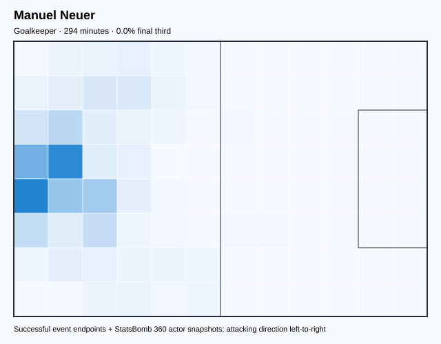

## Physical profile

| Metric | Score |
|---|---:|
| Aerial dominance | 0.000 |
| Pressing intensity per 90 | 0.00 |
| Recovery index per 90 | 2.76 |

## Top chemistry partners

- Antonio Rüdiger — synergy 0.657, 294 shared minutes
- Joshua Kimmich — synergy 0.651, 294 shared minutes
- Niklas Süle — synergy 0.647, 288 shared minutes

## Tactical recommendations

- Use a compact pressing trigger rather than sustained solo pressure.
- Avoid isolating this player in high-volume aerial matchups.
- Use recovery capacity to support higher attacking positions.

_The heatmap combines successful event endpoints with StatsBomb 360 actor
snapshots. StatsBomb 360 is freeze-frame context, not continuous player
tracking. Ratings include eligible outfield players from 45 minutes and
goalkeepers from 90 minutes; ranking status communicates sample reliability._

---

<!-- PLAYER_REPORT 5: 5579_starter_report.md -->

# Joshua Kimmich — Starter Report

- Team: Germany (GER)
- Position: Right Back
- Functional role: Attacking Wingback
- VAEP offense per 90: 0.1144
- VAEP defense per 90: 0.0094
- VAEP total per 90: 0.1238
- VAEP per touch: 0.00059
- Spatial xT per 90: 0.1265
- Final-third spatial share: 30.4%
- Unified final player rating: 0.0670
- Team rank: #10

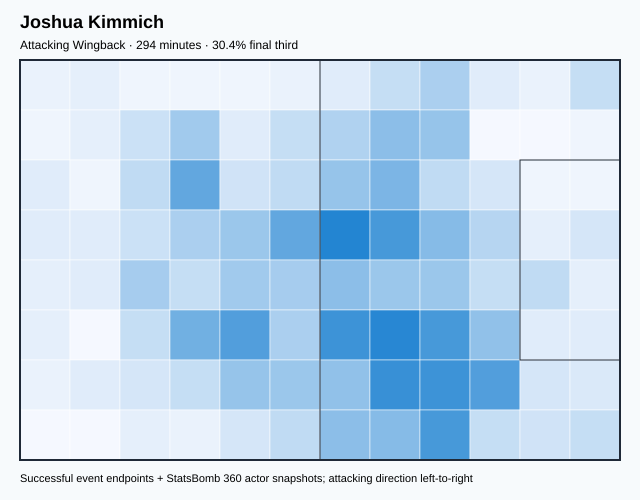

## Physical profile

| Metric | Score |
|---|---:|
| Aerial dominance | 0.714 |
| Pressing intensity per 90 | 12.86 |
| Recovery index per 90 | 4.90 |

## Top chemistry partners

- Manuel Neuer — synergy 0.651, 294 shared minutes
- Niklas Süle — synergy 0.644, 288 shared minutes
- Antonio Rüdiger — synergy 0.618, 294 shared minutes

## Tactical recommendations

- Lead the first pressing trigger and protect the inside passing lane.
- Target this player on direct restarts and back-post deliveries.
- Use recovery capacity to support higher attacking positions.

_The heatmap combines successful event endpoints with StatsBomb 360 actor
snapshots. StatsBomb 360 is freeze-frame context, not continuous player
tracking. Ratings include eligible outfield players from 45 minutes and
goalkeepers from 90 minutes; ranking status communicates sample reliability._

---

<!-- PLAYER_REPORT 6: 6322_starter_report.md -->

# Niklas Süle — Starter Report

- Team: Germany (GER)
- Position: Right Back
- Functional role: Sweeper CB
- VAEP offense per 90: 0.0354
- VAEP defense per 90: -0.0505
- VAEP total per 90: -0.0151
- VAEP per touch: -0.00007
- Spatial xT per 90: 0.0444
- Final-third spatial share: 14.6%
- Unified final player rating: 0.0333
- Team rank: #12

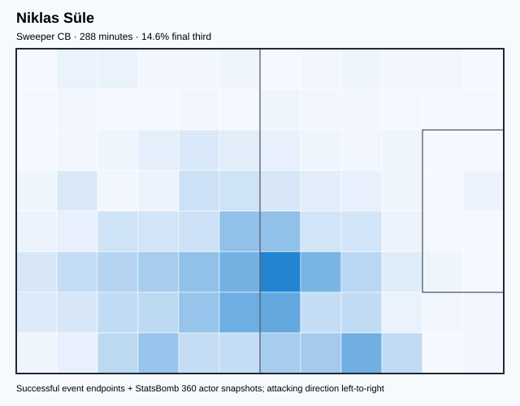

## Physical profile

| Metric | Score |
|---|---:|
| Aerial dominance | 0.833 |
| Pressing intensity per 90 | 7.82 |
| Recovery index per 90 | 4.07 |

## Top chemistry partners

- Antonio Rüdiger — synergy 0.652, 288 shared minutes
- Manuel Neuer — synergy 0.647, 288 shared minutes
- Joshua Kimmich — synergy 0.644, 288 shared minutes

## Tactical recommendations

- Use a compact pressing trigger rather than sustained solo pressure.
- Target this player on direct restarts and back-post deliveries.
- Use recovery capacity to support higher attacking positions.

_The heatmap combines successful event endpoints with StatsBomb 360 actor
snapshots. StatsBomb 360 is freeze-frame context, not continuous player
tracking. Ratings include eligible outfield players from 45 minutes and
goalkeepers from 90 minutes; ranking status communicates sample reliability._

---

<!-- PLAYER_REPORT 7: 6324_starter_report.md -->

# Leon Goretzka — Starter Report

- Team: Germany (GER)
- Position: Left Defensive Midfield
- Functional role: Holding Anchor
- VAEP offense per 90: 0.1310
- VAEP defense per 90: -0.1465
- VAEP total per 90: -0.0155
- VAEP per touch: -0.00019
- Spatial xT per 90: 0.0298
- Final-third spatial share: 33.0%
- Unified final player rating: 0.0152
- Team rank: #14

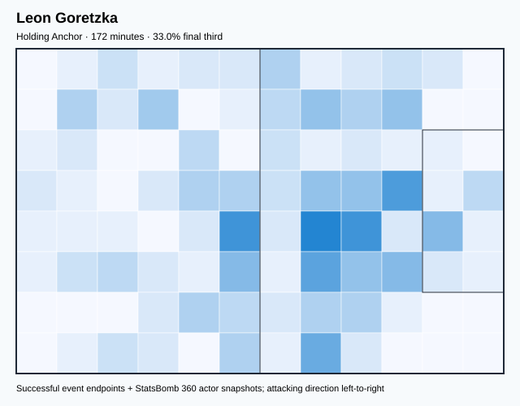

## Physical profile

| Metric | Score |
|---|---:|
| Aerial dominance | 0.750 |
| Pressing intensity per 90 | 13.61 |
| Recovery index per 90 | 2.62 |

## Top chemistry partners

- Joshua Kimmich — synergy 0.451, 172 shared minutes
- Antonio Rüdiger — synergy 0.444, 172 shared minutes
- Niklas Süle — synergy 0.432, 172 shared minutes

## Tactical recommendations

- Lead the first pressing trigger and protect the inside passing lane.
- Target this player on direct restarts and back-post deliveries.
- Use recovery capacity to support higher attacking positions.

_The heatmap combines successful event endpoints with StatsBomb 360 actor
snapshots. StatsBomb 360 is freeze-frame context, not continuous player
tracking. Ratings include eligible outfield players from 45 minutes and
goalkeepers from 90 minutes; ranking status communicates sample reliability._

---

<!-- PLAYER_REPORT 8: 8227_starter_report.md -->

# Mario Götze — Starter Report

- Team: Germany (GER)
- Position: Right Center Midfield
- Functional role: Progressive Winger
- VAEP offense per 90: 0.3713
- VAEP defense per 90: 0.0891
- VAEP total per 90: 0.4605
- VAEP per touch: 0.00532
- Spatial xT per 90: 0.1223
- Final-third spatial share: 72.2%
- Unified final player rating: 0.1239
- Team rank: #8

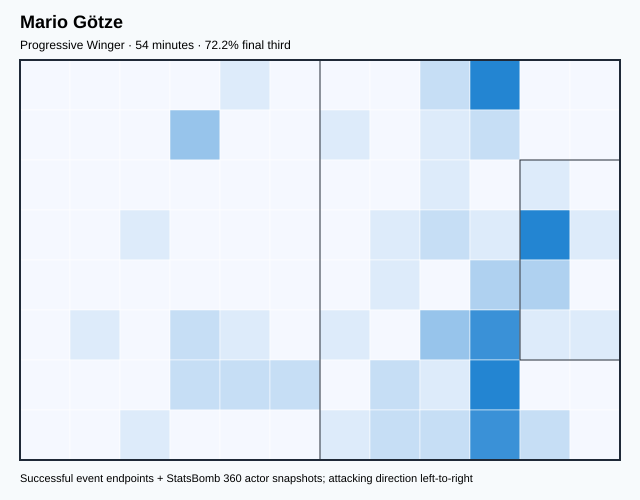

## Physical profile

| Metric | Score |
|---|---:|
| Aerial dominance | 0.000 |
| Pressing intensity per 90 | 29.94 |
| Recovery index per 90 | 3.33 |

## Top chemistry partners

- Joshua Kimmich — synergy 0.172, 54 shared minutes
- Antonio Rüdiger — synergy 0.168, 54 shared minutes
- Niclas Füllkrug — synergy 0.168, 54 shared minutes

## Tactical recommendations

- Lead the first pressing trigger and protect the inside passing lane.
- Avoid isolating this player in high-volume aerial matchups.
- Use recovery capacity to support higher attacking positions.

_The heatmap combines successful event endpoints with StatsBomb 360 actor
snapshots. StatsBomb 360 is freeze-frame context, not continuous player
tracking. Ratings include eligible outfield players from 45 minutes and
goalkeepers from 90 minutes; ranking status communicates sample reliability._

---

<!-- PLAYER_REPORT 9: 8400_starter_report.md -->

# Serge Gnabry — Starter Report

- Team: Germany (GER)
- Position: Left Wing
- Functional role: Progressive Winger
- VAEP offense per 90: 0.5418
- VAEP defense per 90: 0.0866
- VAEP total per 90: 0.6284
- VAEP per touch: 0.00513
- Spatial xT per 90: 0.0757
- Final-third spatial share: 60.8%
- Unified final player rating: 0.2349
- Team rank: #5

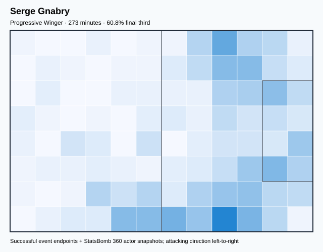

## Physical profile

| Metric | Score |
|---|---:|
| Aerial dominance | 0.000 |
| Pressing intensity per 90 | 13.83 |
| Recovery index per 90 | 4.94 |

## Top chemistry partners

- Manuel Neuer — synergy 0.591, 273 shared minutes
- Joshua Kimmich — synergy 0.582, 273 shared minutes
- Niklas Süle — synergy 0.570, 267 shared minutes

## Tactical recommendations

- Lead the first pressing trigger and protect the inside passing lane.
- Avoid isolating this player in high-volume aerial matchups.
- Use recovery capacity to support higher attacking positions.

_The heatmap combines successful event endpoints with StatsBomb 360 actor
snapshots. StatsBomb 360 is freeze-frame context, not continuous player
tracking. Ratings include eligible outfield players from 45 minutes and
goalkeepers from 90 minutes; ranking status communicates sample reliability._

---

<!-- PLAYER_REPORT 10: 8507_starter_report.md -->

# Lukas Klostermann — Starter Report

- Team: Germany (GER)
- Position: Right Back
- Functional role: Ball-Winner
- VAEP offense per 90: 0.0420
- VAEP defense per 90: -0.0007
- VAEP total per 90: 0.0413
- VAEP per touch: 0.00034
- Spatial xT per 90: 0.0612
- Final-third spatial share: 19.8%
- Unified final player rating: 0.0505
- Team rank: #11

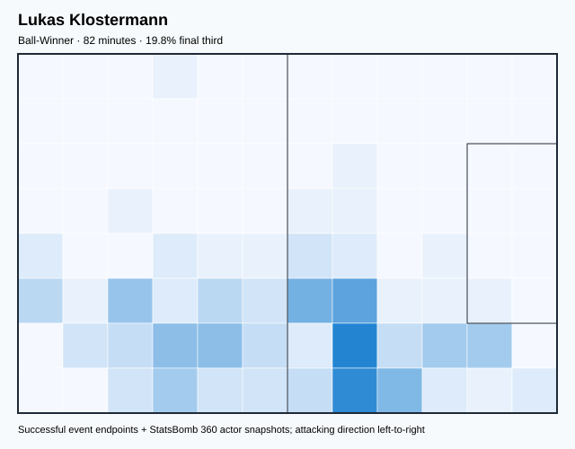

## Physical profile

| Metric | Score |
|---|---:|
| Aerial dominance | 0.000 |
| Pressing intensity per 90 | 14.35 |
| Recovery index per 90 | 1.10 |

## Top chemistry partners

- Joshua Kimmich — synergy 0.256, 82 shared minutes
- Leroy Sané — synergy 0.250, 82 shared minutes
- Manuel Neuer — synergy 0.247, 82 shared minutes

## Tactical recommendations

- Lead the first pressing trigger and protect the inside passing lane.
- Avoid isolating this player in high-volume aerial matchups.
- Pair with a faster recovery defender after aggressive rotations.

_The heatmap combines successful event endpoints with StatsBomb 360 actor
snapshots. StatsBomb 360 is freeze-frame context, not continuous player
tracking. Ratings include eligible outfield players from 45 minutes and
goalkeepers from 90 minutes; ranking status communicates sample reliability._

---

<!-- PLAYER_REPORT 11: 8511_starter_report.md -->

# Thilo Kehrer — Starter Report

- Team: Germany (GER)
- Position: Right Back
- Functional role: Two-Way Fullback
- VAEP offense per 90: 0.0116
- VAEP defense per 90: -0.4333
- VAEP total per 90: -0.4217
- VAEP per touch: -0.00471
- Spatial xT per 90: 0.0187
- Final-third spatial share: 16.2%
- Unified final player rating: 0.0187
- Team rank: #13

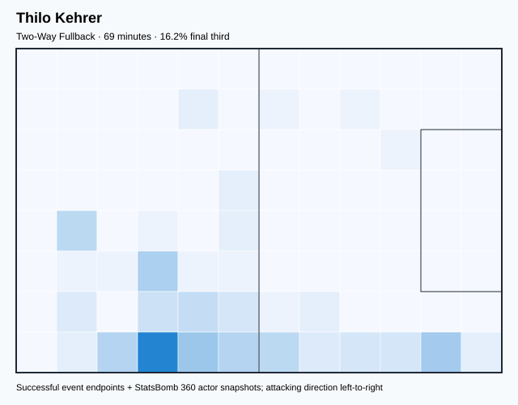

## Physical profile

| Metric | Score |
|---|---:|
| Aerial dominance | 1.000 |
| Pressing intensity per 90 | 33.75 |
| Recovery index per 90 | 2.60 |

## Top chemistry partners

- Niklas Süle — synergy 0.219, 69 shared minutes
- Leon Goretzka — synergy 0.210, 69 shared minutes
- Antonio Rüdiger — synergy 0.208, 69 shared minutes

## Tactical recommendations

- Lead the first pressing trigger and protect the inside passing lane.
- Target this player on direct restarts and back-post deliveries.
- Use recovery capacity to support higher attacking positions.

_The heatmap combines successful event endpoints with StatsBomb 360 actor
snapshots. StatsBomb 360 is freeze-frame context, not continuous player
tracking. Ratings include eligible outfield players from 45 minutes and
goalkeepers from 90 minutes; ranking status communicates sample reliability._

---

<!-- PLAYER_REPORT 12: 8546_starter_report.md -->

# Niclas Füllkrug — Starter Report

- Team: Germany (GER)
- Position: Right Center Forward
- Functional role: Target Forward / Penalty-Box Anchor
- VAEP offense per 90: 1.0564
- VAEP defense per 90: 0.1698
- VAEP total per 90: 1.2262
- VAEP per touch: 0.01502
- Spatial xT per 90: 0.0177
- Final-third spatial share: 62.1%
- Unified final player rating: 0.3044
- Team rank: #2

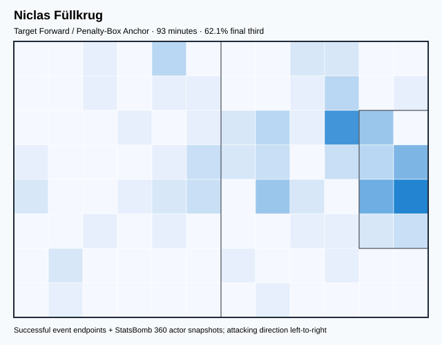

## Physical profile

| Metric | Score |
|---|---:|
| Aerial dominance | 0.500 |
| Pressing intensity per 90 | 3.89 |
| Recovery index per 90 | 0.97 |

## Top chemistry partners

- Joshua Kimmich — synergy 0.273, 93 shared minutes
- Manuel Neuer — synergy 0.262, 93 shared minutes
- Niklas Süle — synergy 0.219, 86 shared minutes

## Tactical recommendations

- Use a compact pressing trigger rather than sustained solo pressure.
- Pair with a faster recovery defender after aggressive rotations.

_The heatmap combines successful event endpoints with StatsBomb 360 actor
snapshots. StatsBomb 360 is freeze-frame context, not continuous player
tracking. Ratings include eligible outfield players from 45 minutes and
goalkeepers from 90 minutes; ranking status communicates sample reliability._

---

<!-- PLAYER_REPORT 13: 8966_starter_report.md -->

# Kai Havertz — Starter Report

- Team: Germany (GER)
- Position: Center Forward
- Functional role: Ball-Winner
- VAEP offense per 90: 1.2348
- VAEP defense per 90: 0.1942
- VAEP total per 90: 1.4290
- VAEP per touch: 0.01439
- Spatial xT per 90: 0.0889
- Final-third spatial share: 61.7%
- Unified final player rating: 0.3386
- Team rank: #1

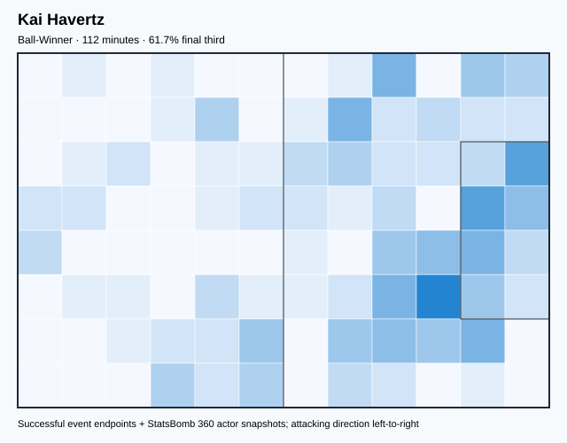

## Physical profile

| Metric | Score |
|---|---:|
| Aerial dominance | 0.000 |
| Pressing intensity per 90 | 16.81 |
| Recovery index per 90 | 3.20 |

## Top chemistry partners

- Manuel Neuer — synergy 0.308, 112 shared minutes
- Joshua Kimmich — synergy 0.299, 112 shared minutes
- Niklas Süle — synergy 0.285, 106 shared minutes

## Tactical recommendations

- Lead the first pressing trigger and protect the inside passing lane.
- Avoid isolating this player in high-volume aerial matchups.
- Use recovery capacity to support higher attacking positions.

_The heatmap combines successful event endpoints with StatsBomb 360 actor
snapshots. StatsBomb 360 is freeze-frame context, not continuous player
tracking. Ratings include eligible outfield players from 45 minutes and
goalkeepers from 90 minutes; ranking status communicates sample reliability._

---

<!-- PLAYER_REPORT 14: 10287_starter_report.md -->

# İlkay Gündoğan — Starter Report

- Team: Germany (GER)
- Position: Center Attacking Midfield
- Functional role: Holding Anchor
- VAEP offense per 90: 0.1620
- VAEP defense per 90: 0.0201
- VAEP total per 90: 0.1822
- VAEP per touch: 0.00084
- Spatial xT per 90: 0.0778
- Final-third spatial share: 33.1%
- Unified final player rating: 0.1559
- Team rank: #7

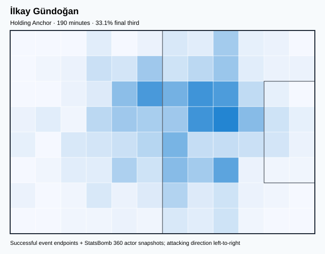

## Physical profile

| Metric | Score |
|---|---:|
| Aerial dominance | 0.200 |
| Pressing intensity per 90 | 9.94 |
| Recovery index per 90 | 8.05 |

## Top chemistry partners

- Antonio Rüdiger — synergy 0.499, 190 shared minutes
- Niklas Süle — synergy 0.491, 190 shared minutes
- Manuel Neuer — synergy 0.484, 190 shared minutes

## Tactical recommendations

- Use a compact pressing trigger rather than sustained solo pressure.
- Use recovery capacity to support higher attacking positions.

_The heatmap combines successful event endpoints with StatsBomb 360 actor
snapshots. StatsBomb 360 is freeze-frame context, not continuous player
tracking. Ratings include eligible outfield players from 45 minutes and
goalkeepers from 90 minutes; ranking status communicates sample reliability._

---

<!-- PLAYER_REPORT 15: 12034_starter_report.md -->

# David Raum — Starter Report

- Team: Germany (GER)
- Position: Left Back
- Functional role: Attacking Wingback
- VAEP offense per 90: 0.3156
- VAEP defense per 90: -0.0216
- VAEP total per 90: 0.2940
- VAEP per touch: 0.00174
- Spatial xT per 90: 0.1122
- Final-third spatial share: 40.9%
- Unified final player rating: 0.0952
- Team rank: #9

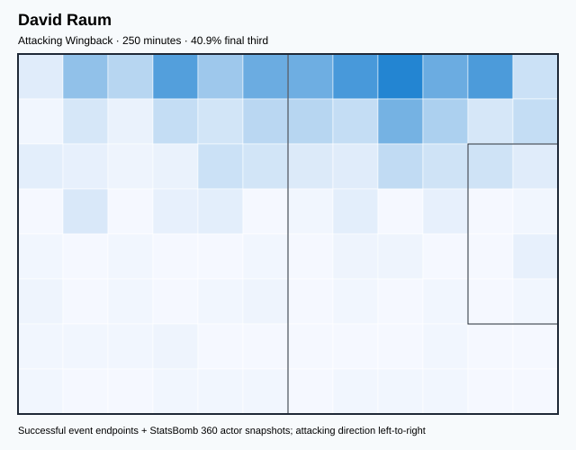

## Physical profile

| Metric | Score |
|---|---:|
| Aerial dominance | 0.800 |
| Pressing intensity per 90 | 17.62 |
| Recovery index per 90 | 3.24 |

## Top chemistry partners

- Manuel Neuer — synergy 0.589, 250 shared minutes
- Niklas Süle — synergy 0.577, 250 shared minutes
- Antonio Rüdiger — synergy 0.576, 250 shared minutes

## Tactical recommendations

- Lead the first pressing trigger and protect the inside passing lane.
- Target this player on direct restarts and back-post deliveries.
- Use recovery capacity to support higher attacking positions.

_The heatmap combines successful event endpoints with StatsBomb 360 actor
snapshots. StatsBomb 360 is freeze-frame context, not continuous player
tracking. Ratings include eligible outfield players from 45 minutes and
goalkeepers from 90 minutes; ranking status communicates sample reliability._

---

<!-- PLAYER_REPORT 16: 24118_starter_report.md -->

# Nico Schlotterbeck — Starter Report

- Team: Germany (GER)
- Position: Left Center Back
- Functional role: Sweeper CB
- VAEP offense per 90: 0.0144
- VAEP defense per 90: -0.0450
- VAEP total per 90: -0.0306
- VAEP per touch: -0.00012
- Spatial xT per 90: 0.0695
- Final-third spatial share: 9.7%
- Unified final player rating: -0.0076
- Team rank: #16

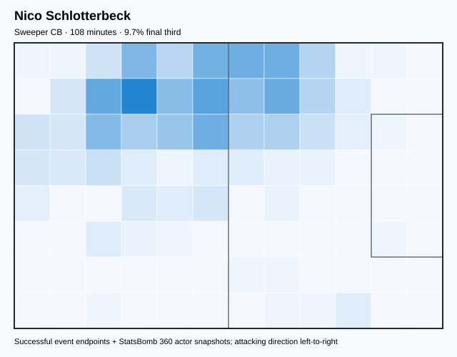

## Physical profile

| Metric | Score |
|---|---:|
| Aerial dominance | 1.000 |
| Pressing intensity per 90 | 9.19 |
| Recovery index per 90 | 6.69 |

## Top chemistry partners

- Antonio Rüdiger — synergy 0.326, 108 shared minutes
- Manuel Neuer — synergy 0.324, 108 shared minutes
- Joshua Kimmich — synergy 0.312, 108 shared minutes

## Tactical recommendations

- Use a compact pressing trigger rather than sustained solo pressure.
- Target this player on direct restarts and back-post deliveries.
- Use recovery capacity to support higher attacking positions.

_The heatmap combines successful event endpoints with StatsBomb 360 actor
snapshots. StatsBomb 360 is freeze-frame context, not continuous player
tracking. Ratings include eligible outfield players from 45 minutes and
goalkeepers from 90 minutes; ranking status communicates sample reliability._

---

<!-- PLAYER_REPORT 17: 39565_starter_report.md -->

# Jamal Musiala — Starter Report

- Team: Germany (GER)
- Position: Center Attacking Midfield
- Functional role: Hybrid Playmaker / Roaming Creator
- VAEP offense per 90: 0.9357
- VAEP defense per 90: -0.0177
- VAEP total per 90: 0.9180
- VAEP per touch: 0.00548
- Spatial xT per 90: 0.1576
- Final-third spatial share: 60.7%
- Unified final player rating: 0.2960
- Team rank: #3

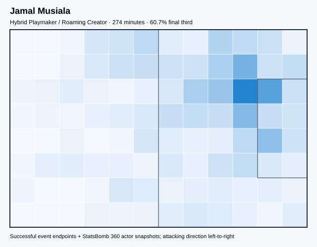

## Physical profile

| Metric | Score |
|---|---:|
| Aerial dominance | 0.200 |
| Pressing intensity per 90 | 14.12 |
| Recovery index per 90 | 5.91 |

## Top chemistry partners

- Antonio Rüdiger — synergy 0.594, 274 shared minutes
- Joshua Kimmich — synergy 0.582, 274 shared minutes
- Niklas Süle — synergy 0.567, 268 shared minutes

## Tactical recommendations

- Lead the first pressing trigger and protect the inside passing lane.
- Use recovery capacity to support higher attacking positions.

_The heatmap combines successful event endpoints with StatsBomb 360 actor
snapshots. StatsBomb 360 is freeze-frame context, not continuous player
tracking. Ratings include eligible outfield players from 45 minutes and
goalkeepers from 90 minutes; ranking status communicates sample reliability._
