# GHA — V4 Player Evaluation Collection

<!-- V5_CANONICAL_NOTICE -->
> **Historical V4 player-rating packet.** Player ratings, ranks, role-challenger decisions, and rating uncertainty below are superseded by `results/reports/player_rankings.csv`, `results/reports/player_profiles/`, and `results/reports/model_summary.md`. Possession, tactical, and match-bootstrap material remains a historical V4 result.

- Included eligible players: 17
- Rankings use the role-aware, development-gated VAEP/xT/xD model.
- Heatmaps combine successful on-ball endpoints and SB360 actor snapshots.

---

<!-- PLAYER_REPORT 1: 2989_starter_report.md -->

# Alexander Djiku — Starter Report

- Team: Ghana (GHA)
- Position: Center Back
- Functional role: Sweeper CB
- VAEP offense per 90: -0.0295
- VAEP defense per 90: -0.0508
- VAEP total per 90: -0.0804
- VAEP per touch: -0.00150
- Spatial xT per 90: 0.0003
- Final-third spatial share: 1.6%
- Unified final player rating: -0.0153
- Team rank: #15

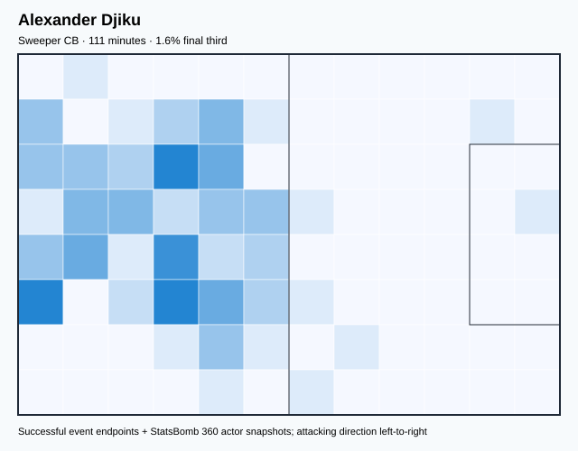

## Physical profile

| Metric | Score |
|---|---:|
| Aerial dominance | 1.000 |
| Pressing intensity per 90 | 7.33 |
| Recovery index per 90 | 2.44 |

## Top chemistry partners

- Daniel Amartey — synergy 0.322, 111 shared minutes
- Lawrence Ati-Zigi — synergy 0.321, 111 shared minutes
- Mohamed Salisu — synergy 0.318, 111 shared minutes

## Tactical recommendations

- Use a compact pressing trigger rather than sustained solo pressure.
- Target this player on direct restarts and back-post deliveries.
- Pair with a faster recovery defender after aggressive rotations.

_The heatmap combines successful event endpoints with StatsBomb 360 actor
snapshots. StatsBomb 360 is freeze-frame context, not continuous player
tracking. Ratings include eligible outfield players from 45 minutes and
goalkeepers from 90 minutes; ranking status communicates sample reliability._

---

<!-- PLAYER_REPORT 2: 3347_starter_report.md -->

# André Ayew Pelé — Starter Report

- Team: Ghana (GHA)
- Position: Center Attacking Midfield
- Functional role: Ball-Winner
- VAEP offense per 90: 0.1200
- VAEP defense per 90: 0.0755
- VAEP total per 90: 0.1955
- VAEP per touch: 0.00277
- Spatial xT per 90: -0.0110
- Final-third spatial share: 24.2%
- Unified final player rating: 0.1520
- Team rank: #5

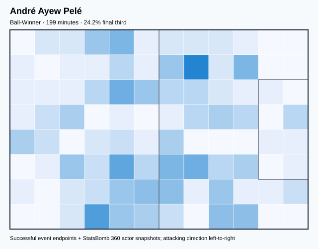

## Physical profile

| Metric | Score |
|---|---:|
| Aerial dominance | 0.235 |
| Pressing intensity per 90 | 14.01 |
| Recovery index per 90 | 1.81 |

## Top chemistry partners

- Thomas Teye Partey — synergy 0.454, 199 shared minutes
- Salis Abdul Samed — synergy 0.418, 199 shared minutes
- Daniel Amartey — synergy 0.410, 199 shared minutes

## Tactical recommendations

- Lead the first pressing trigger and protect the inside passing lane.
- Pair with a faster recovery defender after aggressive rotations.

_The heatmap combines successful event endpoints with StatsBomb 360 actor
snapshots. StatsBomb 360 is freeze-frame context, not continuous player
tracking. Ratings include eligible outfield players from 45 minutes and
goalkeepers from 90 minutes; ranking status communicates sample reliability._

---

<!-- PLAYER_REPORT 3: 3450_starter_report.md -->

# Jordan Ayew — Starter Report

- Team: Ghana (GHA)
- Position: Left Wing
- Functional role: Progressive Winger
- VAEP offense per 90: 0.0565
- VAEP defense per 90: 0.0043
- VAEP total per 90: 0.0608
- VAEP per touch: 0.00060
- Spatial xT per 90: 0.0395
- Final-third spatial share: 24.4%
- Unified final player rating: 0.1427
- Team rank: #6

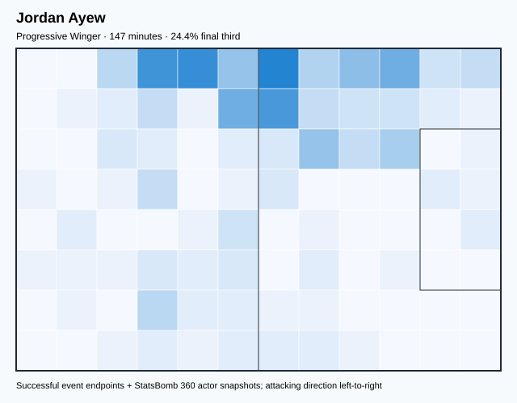

## Physical profile

| Metric | Score |
|---|---:|
| Aerial dominance | 0.000 |
| Pressing intensity per 90 | 23.95 |
| Recovery index per 90 | 3.68 |

## Top chemistry partners

- Daniel Amartey — synergy 0.370, 147 shared minutes
- Salis Abdul Samed — synergy 0.362, 139 shared minutes
- Thomas Teye Partey — synergy 0.347, 147 shared minutes

## Tactical recommendations

- Lead the first pressing trigger and protect the inside passing lane.
- Avoid isolating this player in high-volume aerial matchups.
- Use recovery capacity to support higher attacking positions.

_The heatmap combines successful event endpoints with StatsBomb 360 actor
snapshots. StatsBomb 360 is freeze-frame context, not continuous player
tracking. Ratings include eligible outfield players from 45 minutes and
goalkeepers from 90 minutes; ranking status communicates sample reliability._

---

<!-- PLAYER_REPORT 4: 3709_starter_report.md -->

# Daniel Amartey — Starter Report

- Team: Ghana (GHA)
- Position: Right Center Back
- Functional role: Sweeper CB
- VAEP offense per 90: 0.0023
- VAEP defense per 90: -0.2391
- VAEP total per 90: -0.2368
- VAEP per touch: -0.00214
- Spatial xT per 90: 0.0118
- Final-third spatial share: 5.2%
- Unified final player rating: -0.0522
- Team rank: #16

## Physical profile

| Metric | Score |
|---|---:|
| Aerial dominance | 0.545 |
| Pressing intensity per 90 | 7.47 |
| Recovery index per 90 | 3.59 |

## Top chemistry partners

- Mohamed Salisu — synergy 0.662, 301 shared minutes
- Thomas Teye Partey — synergy 0.657, 301 shared minutes
- Lawrence Ati-Zigi — synergy 0.653, 301 shared minutes

## Tactical recommendations

- Use a compact pressing trigger rather than sustained solo pressure.
- Use recovery capacity to support higher attacking positions.

_The heatmap combines successful event endpoints with StatsBomb 360 actor
snapshots. StatsBomb 360 is freeze-frame context, not continuous player
tracking. Ratings include eligible outfield players from 45 minutes and
goalkeepers from 90 minutes; ranking status communicates sample reliability._

---

<!-- PLAYER_REPORT 5: 6383_starter_report.md -->

# Thomas Teye Partey — Starter Report

- Team: Ghana (GHA)
- Position: Right Defensive Midfield
- Functional role: Holding Anchor
- VAEP offense per 90: 0.0249
- VAEP defense per 90: -0.1256
- VAEP total per 90: -0.1007
- VAEP per touch: -0.00068
- Spatial xT per 90: 0.0443
- Final-third spatial share: 15.1%
- Unified final player rating: -0.0037
- Team rank: #14

## Physical profile

| Metric | Score |
|---|---:|
| Aerial dominance | 0.692 |
| Pressing intensity per 90 | 12.85 |
| Recovery index per 90 | 3.59 |

## Top chemistry partners

- Mohamed Salisu — synergy 0.663, 301 shared minutes
- Daniel Amartey — synergy 0.657, 301 shared minutes
- Lawrence Ati-Zigi — synergy 0.637, 301 shared minutes

## Tactical recommendations

- Lead the first pressing trigger and protect the inside passing lane.
- Target this player on direct restarts and back-post deliveries.
- Use recovery capacity to support higher attacking positions.

_The heatmap combines successful event endpoints with StatsBomb 360 actor
snapshots. StatsBomb 360 is freeze-frame context, not continuous player
tracking. Ratings include eligible outfield players from 45 minutes and
goalkeepers from 90 minutes; ranking status communicates sample reliability._

---

<!-- PLAYER_REPORT 6: 6393_starter_report.md -->

# Iñaki Williams Arthuer — Starter Report

- Team: Ghana (GHA)
- Position: Center Forward
- Functional role: Ball-Winner
- VAEP offense per 90: 0.1260
- VAEP defense per 90: 0.0194
- VAEP total per 90: 0.1454
- VAEP per touch: 0.00232
- Spatial xT per 90: 0.0303
- Final-third spatial share: 41.6%
- Unified final player rating: 0.1789
- Team rank: #4

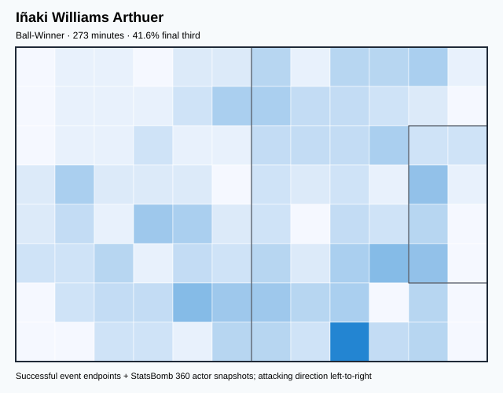

## Physical profile

| Metric | Score |
|---|---:|
| Aerial dominance | 0.200 |
| Pressing intensity per 90 | 10.56 |
| Recovery index per 90 | 3.30 |

## Top chemistry partners

- Daniel Amartey — synergy 0.545, 273 shared minutes
- Thomas Teye Partey — synergy 0.449, 273 shared minutes
- Mohammed Kudus — synergy 0.401, 230 shared minutes

## Tactical recommendations

- Use a compact pressing trigger rather than sustained solo pressure.
- Use recovery capacity to support higher attacking positions.

_The heatmap combines successful event endpoints with StatsBomb 360 actor
snapshots. StatsBomb 360 is freeze-frame context, not continuous player
tracking. Ratings include eligible outfield players from 45 minutes and
goalkeepers from 90 minutes; ranking status communicates sample reliability._

---

<!-- PLAYER_REPORT 7: 8108_starter_report.md -->

# Lawrence Ati-Zigi — Starter Report

- Team: Ghana (GHA)
- Position: Goalkeeper
- Functional role: Goalkeeper
- VAEP offense per 90: -0.0031
- VAEP defense per 90: -0.1338
- VAEP total per 90: -0.1369
- VAEP per touch: -0.00369
- Spatial xT per 90: 0.0066
- Final-third spatial share: 1.1%
- Unified final player rating: -0.0640
- Team rank: #17

## Physical profile

| Metric | Score |
|---|---:|
| Aerial dominance | 0.000 |
| Pressing intensity per 90 | 0.00 |
| Recovery index per 90 | 2.39 |

## Top chemistry partners

- Mohamed Salisu — synergy 0.655, 301 shared minutes
- Daniel Amartey — synergy 0.653, 301 shared minutes
- Thomas Teye Partey — synergy 0.637, 301 shared minutes

## Tactical recommendations

- Use a compact pressing trigger rather than sustained solo pressure.
- Avoid isolating this player in high-volume aerial matchups.
- Pair with a faster recovery defender after aggressive rotations.

_The heatmap combines successful event endpoints with StatsBomb 360 actor
snapshots. StatsBomb 360 is freeze-frame context, not continuous player
tracking. Ratings include eligible outfield players from 45 minutes and
goalkeepers from 90 minutes; ranking status communicates sample reliability._

---

<!-- PLAYER_REPORT 8: 12325_starter_report.md -->

# Abdul Rahman Baba — Starter Report

- Team: Ghana (GHA)
- Position: Left Back
- Functional role: Attacking Wingback
- VAEP offense per 90: 0.1040
- VAEP defense per 90: -0.0041
- VAEP total per 90: 0.0999
- VAEP per touch: 0.00088
- Spatial xT per 90: 0.0473
- Final-third spatial share: 37.0%
- Unified final player rating: 0.0556
- Team rank: #7

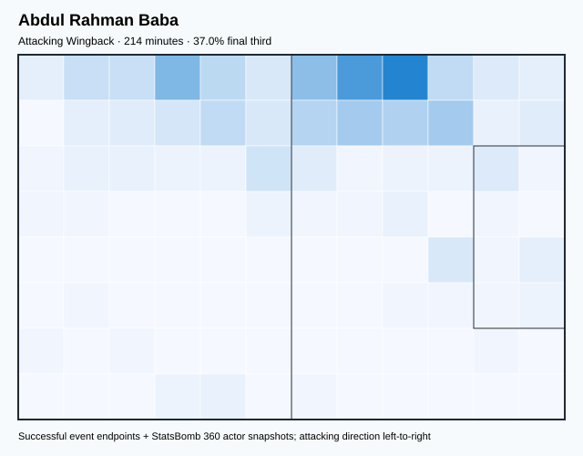

## Physical profile

| Metric | Score |
|---|---:|
| Aerial dominance | 0.333 |
| Pressing intensity per 90 | 12.21 |
| Recovery index per 90 | 2.11 |

## Top chemistry partners

- Mohamed Salisu — synergy 0.476, 214 shared minutes
- Daniel Amartey — synergy 0.468, 214 shared minutes
- Lawrence Ati-Zigi — synergy 0.468, 214 shared minutes

## Tactical recommendations

- Lead the first pressing trigger and protect the inside passing lane.
- Pair with a faster recovery defender after aggressive rotations.

_The heatmap combines successful event endpoints with StatsBomb 360 actor
snapshots. StatsBomb 360 is freeze-frame context, not continuous player
tracking. Ratings include eligible outfield players from 45 minutes and
goalkeepers from 90 minutes; ranking status communicates sample reliability._

---

<!-- PLAYER_REPORT 9: 17033_starter_report.md -->

# Mohammed Kudus — Starter Report

- Team: Ghana (GHA)
- Position: Center Attacking Midfield
- Functional role: Progressive Winger
- VAEP offense per 90: 0.4643
- VAEP defense per 90: 0.0878
- VAEP total per 90: 0.5521
- VAEP per touch: 0.00477
- Spatial xT per 90: 0.0309
- Final-third spatial share: 42.8%
- Unified final player rating: 0.2153
- Team rank: #1

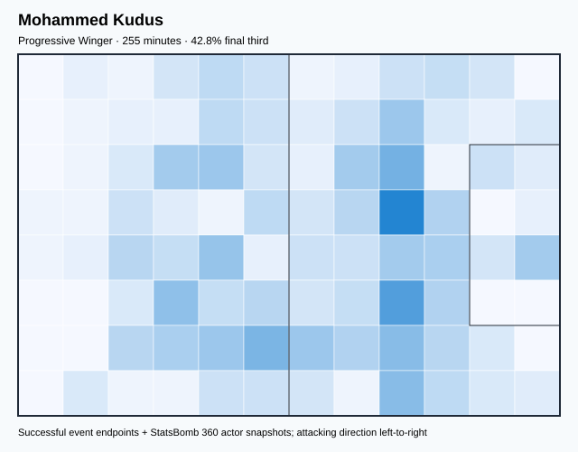

## Physical profile

| Metric | Score |
|---|---:|
| Aerial dominance | 0.167 |
| Pressing intensity per 90 | 19.77 |
| Recovery index per 90 | 8.47 |

## Top chemistry partners

- Salis Abdul Samed — synergy 0.538, 230 shared minutes
- Daniel Amartey — synergy 0.537, 255 shared minutes
- Thomas Teye Partey — synergy 0.508, 255 shared minutes

## Tactical recommendations

- Lead the first pressing trigger and protect the inside passing lane.
- Avoid isolating this player in high-volume aerial matchups.
- Use recovery capacity to support higher attacking positions.

_The heatmap combines successful event endpoints with StatsBomb 360 actor
snapshots. StatsBomb 360 is freeze-frame context, not continuous player
tracking. Ratings include eligible outfield players from 45 minutes and
goalkeepers from 90 minutes; ranking status communicates sample reliability._

---

<!-- PLAYER_REPORT 10: 23615_starter_report.md -->

# Gideon Mensah — Starter Report

- Team: Ghana (GHA)
- Position: Left Back
- Functional role: Wide Creator
- VAEP offense per 90: 0.0328
- VAEP defense per 90: -0.0450
- VAEP total per 90: -0.0122
- VAEP per touch: -0.00011
- Spatial xT per 90: 0.0302
- Final-third spatial share: 26.7%
- Unified final player rating: 0.0449
- Team rank: #8

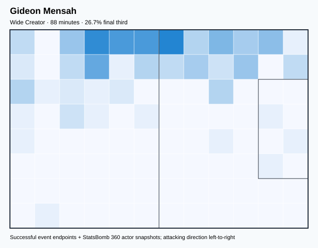

## Physical profile

| Metric | Score |
|---|---:|
| Aerial dominance | 0.667 |
| Pressing intensity per 90 | 11.31 |
| Recovery index per 90 | 6.17 |

## Top chemistry partners

- Mohamed Salisu — synergy 0.269, 88 shared minutes
- Salis Abdul Samed — synergy 0.269, 88 shared minutes
- Thomas Teye Partey — synergy 0.259, 88 shared minutes

## Tactical recommendations

- Lead the first pressing trigger and protect the inside passing lane.
- Target this player on direct restarts and back-post deliveries.
- Use recovery capacity to support higher attacking positions.

_The heatmap combines successful event endpoints with StatsBomb 360 actor
snapshots. StatsBomb 360 is freeze-frame context, not continuous player
tracking. Ratings include eligible outfield players from 45 minutes and
goalkeepers from 90 minutes; ranking status communicates sample reliability._

---

<!-- PLAYER_REPORT 11: 28616_starter_report.md -->

# Daniel-Kofi Kyereh — Starter Report

- Team: Ghana (GHA)
- Position: Left Defensive Midfield
- Functional role: Wide Creator
- VAEP offense per 90: 0.3578
- VAEP defense per 90: -0.0060
- VAEP total per 90: 0.3517
- VAEP per touch: 0.00290
- Spatial xT per 90: 0.0261
- Final-third spatial share: 33.8%
- Unified final player rating: 0.0403
- Team rank: #10

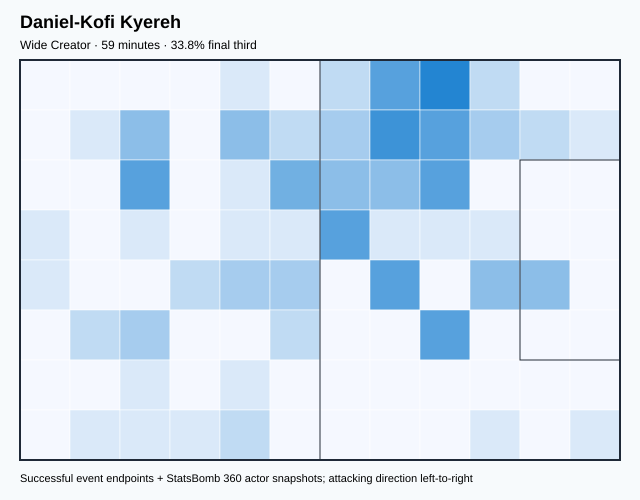

## Physical profile

| Metric | Score |
|---|---:|
| Aerial dominance | 0.000 |
| Pressing intensity per 90 | 13.64 |
| Recovery index per 90 | 3.03 |

## Top chemistry partners

- Thomas Teye Partey — synergy 0.175, 59 shared minutes
- Kamaldeen Sulemana — synergy 0.162, 51 shared minutes
- Daniel Amartey — synergy 0.153, 59 shared minutes

## Tactical recommendations

- Lead the first pressing trigger and protect the inside passing lane.
- Avoid isolating this player in high-volume aerial matchups.
- Use recovery capacity to support higher attacking positions.

_The heatmap combines successful event endpoints with StatsBomb 360 actor
snapshots. StatsBomb 360 is freeze-frame context, not continuous player
tracking. Ratings include eligible outfield players from 45 minutes and
goalkeepers from 90 minutes; ranking status communicates sample reliability._

---

<!-- PLAYER_REPORT 12: 30519_starter_report.md -->

# Mohamed Salisu — Starter Report

- Team: Ghana (GHA)
- Position: Left Center Back
- Functional role: Sweeper CB
- VAEP offense per 90: 0.0810
- VAEP defense per 90: -0.0384
- VAEP total per 90: 0.0426
- VAEP per touch: 0.00038
- Spatial xT per 90: 0.0187
- Final-third spatial share: 6.4%
- Unified final player rating: 0.0046
- Team rank: #13

## Physical profile

| Metric | Score |
|---|---:|
| Aerial dominance | 0.529 |
| Pressing intensity per 90 | 6.87 |
| Recovery index per 90 | 2.09 |

## Top chemistry partners

- Thomas Teye Partey — synergy 0.663, 301 shared minutes
- Daniel Amartey — synergy 0.662, 301 shared minutes
- Lawrence Ati-Zigi — synergy 0.655, 301 shared minutes

## Tactical recommendations

- Use a compact pressing trigger rather than sustained solo pressure.
- Pair with a faster recovery defender after aggressive rotations.

_The heatmap combines successful event endpoints with StatsBomb 360 actor
snapshots. StatsBomb 360 is freeze-frame context, not continuous player
tracking. Ratings include eligible outfield players from 45 minutes and
goalkeepers from 90 minutes; ranking status communicates sample reliability._

---

<!-- PLAYER_REPORT 13: 31029_starter_report.md -->

# Salis Abdul Samed — Starter Report

- Team: Ghana (GHA)
- Position: Left Defensive Midfield
- Functional role: Holding Anchor
- VAEP offense per 90: 0.0255
- VAEP defense per 90: -0.0421
- VAEP total per 90: -0.0166
- VAEP per touch: -0.00012
- Spatial xT per 90: 0.0150
- Final-third spatial share: 19.2%
- Unified final player rating: 0.0117
- Team rank: #12

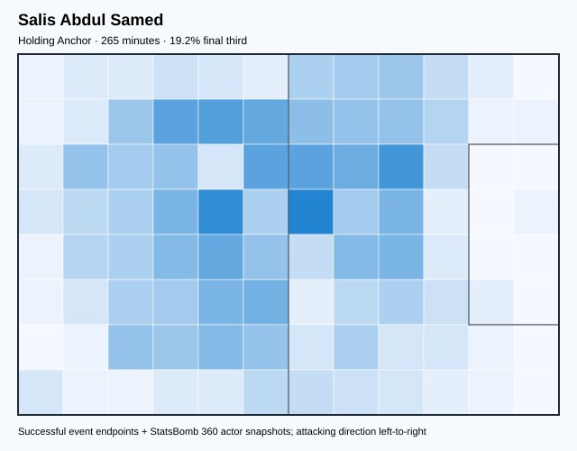

## Physical profile

| Metric | Score |
|---|---:|
| Aerial dominance | 0.000 |
| Pressing intensity per 90 | 18.34 |
| Recovery index per 90 | 4.76 |

## Top chemistry partners

- Thomas Teye Partey — synergy 0.620, 265 shared minutes
- Mohamed Salisu — synergy 0.617, 265 shared minutes
- Daniel Amartey — synergy 0.606, 265 shared minutes

## Tactical recommendations

- Lead the first pressing trigger and protect the inside passing lane.
- Avoid isolating this player in high-volume aerial matchups.
- Use recovery capacity to support higher attacking positions.

_The heatmap combines successful event endpoints with StatsBomb 360 actor
snapshots. StatsBomb 360 is freeze-frame context, not continuous player
tracking. Ratings include eligible outfield players from 45 minutes and
goalkeepers from 90 minutes; ranking status communicates sample reliability._

---

<!-- PLAYER_REPORT 14: 33602_starter_report.md -->

# Tariq Lamptey — Starter Report

- Team: Ghana (GHA)
- Position: Right Back
- Functional role: Deep Playmaker
- VAEP offense per 90: 0.0580
- VAEP defense per 90: -0.0901
- VAEP total per 90: -0.0321
- VAEP per touch: -0.00046
- Spatial xT per 90: 0.0485
- Final-third spatial share: 28.3%
- Unified final player rating: 0.0417
- Team rank: #9

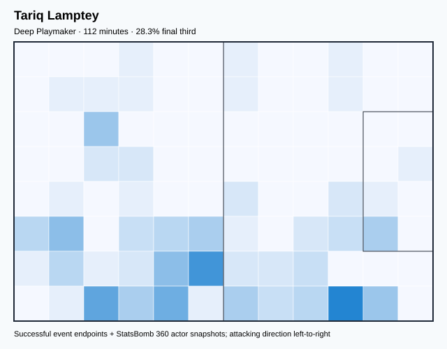

## Physical profile

| Metric | Score |
|---|---:|
| Aerial dominance | 0.000 |
| Pressing intensity per 90 | 19.25 |
| Recovery index per 90 | 4.01 |

## Top chemistry partners

- Daniel Amartey — synergy 0.328, 112 shared minutes
- Lawrence Ati-Zigi — synergy 0.312, 112 shared minutes
- Salis Abdul Samed — synergy 0.294, 104 shared minutes

## Tactical recommendations

- Lead the first pressing trigger and protect the inside passing lane.
- Avoid isolating this player in high-volume aerial matchups.
- Use recovery capacity to support higher attacking positions.

_The heatmap combines successful event endpoints with StatsBomb 360 actor
snapshots. StatsBomb 360 is freeze-frame context, not continuous player
tracking. Ratings include eligible outfield players from 45 minutes and
goalkeepers from 90 minutes; ranking status communicates sample reliability._

---

<!-- PLAYER_REPORT 15: 35658_starter_report.md -->

# Kamaldeen Sulemana — Starter Report

- Team: Ghana (GHA)
- Position: Left Wing
- Functional role: Target Forward
- VAEP offense per 90: 0.4294
- VAEP defense per 90: 0.0000
- VAEP total per 90: 0.4294
- VAEP per touch: 0.00445
- Spatial xT per 90: 0.0666
- Final-third spatial share: 69.0%
- Unified final player rating: 0.1844
- Team rank: #3

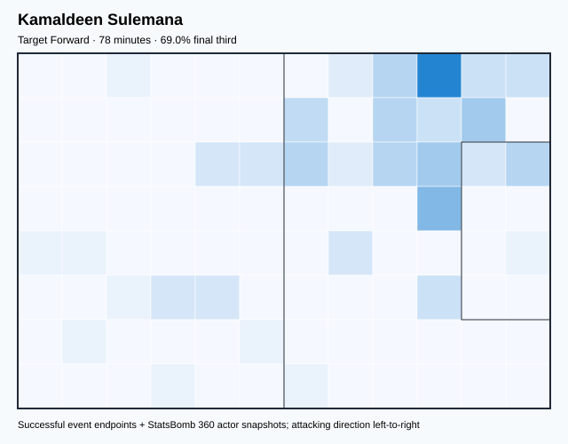

## Physical profile

| Metric | Score |
|---|---:|
| Aerial dominance | 0.667 |
| Pressing intensity per 90 | 11.50 |
| Recovery index per 90 | 0.00 |

## Top chemistry partners

- Thomas Teye Partey — synergy 0.233, 78 shared minutes
- Daniel Amartey — synergy 0.231, 78 shared minutes
- Lawrence Ati-Zigi — synergy 0.227, 78 shared minutes

## Tactical recommendations

- Lead the first pressing trigger and protect the inside passing lane.
- Target this player on direct restarts and back-post deliveries.
- Pair with a faster recovery defender after aggressive rotations.

_The heatmap combines successful event endpoints with StatsBomb 360 actor
snapshots. StatsBomb 360 is freeze-frame context, not continuous player
tracking. Ratings include eligible outfield players from 45 minutes and
goalkeepers from 90 minutes; ranking status communicates sample reliability._

---

<!-- PLAYER_REPORT 16: 44225_starter_report.md -->

# Osman Bukari — Starter Report

- Team: Ghana (GHA)
- Position: Right Wing
- Functional role: Ball-Winner
- VAEP offense per 90: 0.2571
- VAEP defense per 90: 0.2410
- VAEP total per 90: 0.4981
- VAEP per touch: 0.00558
- Spatial xT per 90: 0.0312
- Final-third spatial share: 55.3%
- Unified final player rating: 0.1887
- Team rank: #2

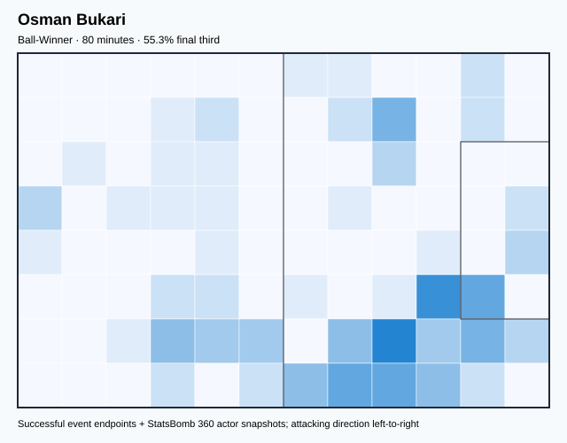

## Physical profile

| Metric | Score |
|---|---:|
| Aerial dominance | 0.500 |
| Pressing intensity per 90 | 12.43 |
| Recovery index per 90 | 7.91 |

## Top chemistry partners

- Lawrence Ati-Zigi — synergy 0.226, 80 shared minutes
- Thomas Teye Partey — synergy 0.214, 80 shared minutes
- Abdul Rahman Baba — synergy 0.205, 80 shared minutes

## Tactical recommendations

- Lead the first pressing trigger and protect the inside passing lane.
- Use recovery capacity to support higher attacking positions.

_The heatmap combines successful event endpoints with StatsBomb 360 actor
snapshots. StatsBomb 360 is freeze-frame context, not continuous player
tracking. Ratings include eligible outfield players from 45 minutes and
goalkeepers from 90 minutes; ranking status communicates sample reliability._

---

<!-- PLAYER_REPORT 17: 45047_starter_report.md -->

# Alidu Seidu — Starter Report

- Team: Ghana (GHA)
- Position: Right Back
- Functional role: Deep Playmaker
- VAEP offense per 90: 0.0083
- VAEP defense per 90: -0.0711
- VAEP total per 90: -0.0628
- VAEP per touch: -0.00059
- Spatial xT per 90: 0.0511
- Final-third spatial share: 23.7%
- Unified final player rating: 0.0335
- Team rank: #11

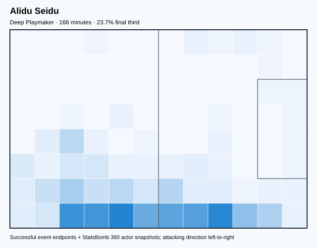

## Physical profile

| Metric | Score |
|---|---:|
| Aerial dominance | 0.500 |
| Pressing intensity per 90 | 21.71 |
| Recovery index per 90 | 4.88 |

## Top chemistry partners

- Thomas Teye Partey — synergy 0.451, 166 shared minutes
- Daniel Amartey — synergy 0.431, 166 shared minutes
- Lawrence Ati-Zigi — synergy 0.421, 166 shared minutes

## Tactical recommendations

- Lead the first pressing trigger and protect the inside passing lane.
- Use recovery capacity to support higher attacking positions.

_The heatmap combines successful event endpoints with StatsBomb 360 actor
snapshots. StatsBomb 360 is freeze-frame context, not continuous player
tracking. Ratings include eligible outfield players from 45 minutes and
goalkeepers from 90 minutes; ranking status communicates sample reliability._
