# IRN — V4 Player Evaluation Collection

<!-- V5_CANONICAL_NOTICE -->
> **Historical V4 player-rating packet.** Player ratings, ranks, role-challenger decisions, and rating uncertainty below are superseded by `results/reports/player_rankings.csv`, `results/reports/player_profiles/`, and `results/reports/model_summary.md`. Possession, tactical, and match-bootstrap material remains a historical V4 result.

- Included eligible players: 20
- Rankings use the role-aware, development-gated VAEP/xT/xD model.
- Heatmaps combine successful on-ball endpoints and SB360 actor snapshots.

---

<!-- PLAYER_REPORT 1: 5220_starter_report.md -->

# Morteza Pouraliganji — Starter Report

- Team: Iran (IRN)
- Position: Right Center Back
- Functional role: Sweeper CB
- VAEP offense per 90: 0.0912
- VAEP defense per 90: -0.0549
- VAEP total per 90: 0.0363
- VAEP per touch: 0.00042
- Spatial xT per 90: 0.0086
- Final-third spatial share: 5.4%
- Unified final player rating: 0.0026
- Team rank: #15

## Physical profile

| Metric | Score |
|---|---:|
| Aerial dominance | 0.750 |
| Pressing intensity per 90 | 10.62 |
| Recovery index per 90 | 2.36 |

## Top chemistry partners

- Seyed Majid Hosseini — synergy 0.669, 305 shared minutes
- Mehdi Taremi — synergy 0.585, 305 shared minutes
- Ehsan Hajsafi — synergy 0.544, 250 shared minutes

## Tactical recommendations

- Use a compact pressing trigger rather than sustained solo pressure.
- Target this player on direct restarts and back-post deliveries.
- Pair with a faster recovery defender after aggressive rotations.

_The heatmap combines successful event endpoints with StatsBomb 360 actor
snapshots. StatsBomb 360 is freeze-frame context, not continuous player
tracking. Ratings include eligible outfield players from 45 minutes and
goalkeepers from 90 minutes; ranking status communicates sample reliability._

---

<!-- PLAYER_REPORT 2: 5222_starter_report.md -->

# Roozbeh Cheshmi — Starter Report

- Team: Iran (IRN)
- Position: Center Back
- Functional role: Sweeper CB
- VAEP offense per 90: 0.0099
- VAEP defense per 90: -0.0525
- VAEP total per 90: -0.0426
- VAEP per touch: -0.00132
- Spatial xT per 90: 0.0008
- Final-third spatial share: 16.4%
- Unified final player rating: -0.0108
- Team rank: #16

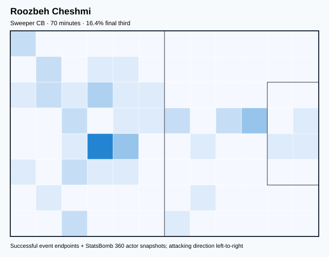

## Physical profile

| Metric | Score |
|---|---:|
| Aerial dominance | 0.250 |
| Pressing intensity per 90 | 7.74 |
| Recovery index per 90 | 2.58 |

## Top chemistry partners

- Seyed Majid Hosseini — synergy 0.211, 70 shared minutes
- Alireza Jahanbakhsh — synergy 0.201, 70 shared minutes
- Ali Karimi — synergy 0.193, 65 shared minutes

## Tactical recommendations

- Use a compact pressing trigger rather than sustained solo pressure.
- Use recovery capacity to support higher attacking positions.

_The heatmap combines successful event endpoints with StatsBomb 360 actor
snapshots. StatsBomb 360 is freeze-frame context, not continuous player
tracking. Ratings include eligible outfield players from 45 minutes and
goalkeepers from 90 minutes; ranking status communicates sample reliability._

---

<!-- PLAYER_REPORT 3: 5224_starter_report.md -->

# Sardar Azmoun — Starter Report

- Team: Iran (IRN)
- Position: Center Forward
- Functional role: Target Forward
- VAEP offense per 90: 0.4073
- VAEP defense per 90: 0.0552
- VAEP total per 90: 0.4625
- VAEP per touch: 0.00699
- Spatial xT per 90: 0.0441
- Final-third spatial share: 40.5%
- Unified final player rating: 0.2399
- Team rank: #1

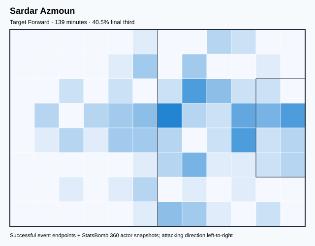

## Physical profile

| Metric | Score |
|---|---:|
| Aerial dominance | 0.333 |
| Pressing intensity per 90 | 6.49 |
| Recovery index per 90 | 1.30 |

## Top chemistry partners

- Seyed Majid Hosseini — synergy 0.355, 139 shared minutes
- Saeid Ezatolahi Afagh — synergy 0.322, 139 shared minutes
- Ahmad Nourollahi — synergy 0.312, 112 shared minutes

## Tactical recommendations

- Use a compact pressing trigger rather than sustained solo pressure.
- Pair with a faster recovery defender after aggressive rotations.

_The heatmap combines successful event endpoints with StatsBomb 360 actor
snapshots. StatsBomb 360 is freeze-frame context, not continuous player
tracking. Ratings include eligible outfield players from 45 minutes and
goalkeepers from 90 minutes; ranking status communicates sample reliability._

---

<!-- PLAYER_REPORT 4: 5226_starter_report.md -->

# Mehdi Taremi — Starter Report

- Team: Iran (IRN)
- Position: Center Forward
- Functional role: Target Forward
- VAEP offense per 90: 0.3589
- VAEP defense per 90: 0.0804
- VAEP total per 90: 0.4393
- VAEP per touch: 0.00500
- Spatial xT per 90: 0.0526
- Final-third spatial share: 40.8%
- Unified final player rating: 0.2362
- Team rank: #2

## Physical profile

| Metric | Score |
|---|---:|
| Aerial dominance | 0.389 |
| Pressing intensity per 90 | 19.47 |
| Recovery index per 90 | 3.54 |

## Top chemistry partners

- Morteza Pouraliganji — synergy 0.585, 305 shared minutes
- Saeid Ezatolahi Afagh — synergy 0.573, 240 shared minutes
- Seyed Majid Hosseini — synergy 0.526, 305 shared minutes

## Tactical recommendations

- Lead the first pressing trigger and protect the inside passing lane.
- Use recovery capacity to support higher attacking positions.

_The heatmap combines successful event endpoints with StatsBomb 360 actor
snapshots. StatsBomb 360 is freeze-frame context, not continuous player
tracking. Ratings include eligible outfield players from 45 minutes and
goalkeepers from 90 minutes; ranking status communicates sample reliability._

---

<!-- PLAYER_REPORT 5: 5227_starter_report.md -->

# Alireza Safar Beiranvand — Starter Report

- Team: Iran (IRN)
- Position: Goalkeeper
- Functional role: Goalkeeper
- VAEP offense per 90: -0.0215
- VAEP defense per 90: -0.1425
- VAEP total per 90: -0.1640
- VAEP per touch: -0.00368
- Spatial xT per 90: 0.0109
- Final-third spatial share: 2.5%
- Unified final player rating: -0.0653
- Team rank: #19

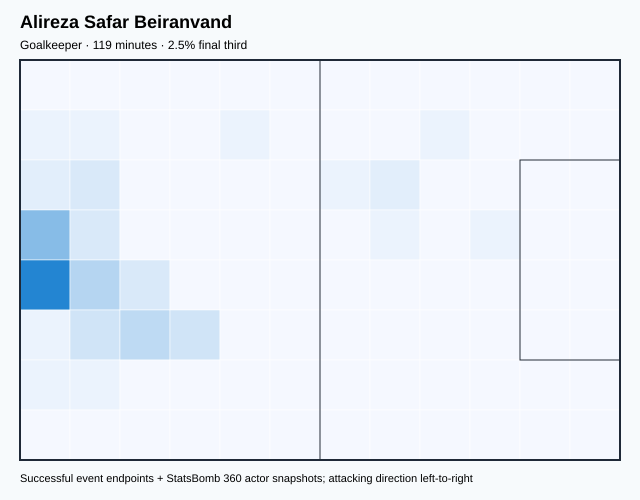

## Physical profile

| Metric | Score |
|---|---:|
| Aerial dominance | 0.000 |
| Pressing intensity per 90 | 0.00 |
| Recovery index per 90 | 0.76 |

## Top chemistry partners

- Seyed Majid Hosseini — synergy 0.344, 119 shared minutes
- Morteza Pouraliganji — synergy 0.327, 119 shared minutes
- Ramin Rezaeian — synergy 0.287, 100 shared minutes

## Tactical recommendations

- Use a compact pressing trigger rather than sustained solo pressure.
- Avoid isolating this player in high-volume aerial matchups.
- Pair with a faster recovery defender after aggressive rotations.

_The heatmap combines successful event endpoints with StatsBomb 360 actor
snapshots. StatsBomb 360 is freeze-frame context, not continuous player
tracking. Ratings include eligible outfield players from 45 minutes and
goalkeepers from 90 minutes; ranking status communicates sample reliability._

---

<!-- PLAYER_REPORT 6: 5228_starter_report.md -->

# Seyed Majid Hosseini — Starter Report

- Team: Iran (IRN)
- Position: Left Center Back
- Functional role: Sweeper CB
- VAEP offense per 90: 0.0013
- VAEP defense per 90: -0.0721
- VAEP total per 90: -0.0708
- VAEP per touch: -0.00096
- Spatial xT per 90: 0.0097
- Final-third spatial share: 3.9%
- Unified final player rating: -0.0191
- Team rank: #18

## Physical profile

| Metric | Score |
|---|---:|
| Aerial dominance | 0.417 |
| Pressing intensity per 90 | 10.32 |
| Recovery index per 90 | 5.31 |

## Top chemistry partners

- Morteza Pouraliganji — synergy 0.669, 305 shared minutes
- Ehsan Hajsafi — synergy 0.575, 250 shared minutes
- Saeid Ezatolahi Afagh — synergy 0.574, 240 shared minutes

## Tactical recommendations

- Use a compact pressing trigger rather than sustained solo pressure.
- Use recovery capacity to support higher attacking positions.

_The heatmap combines successful event endpoints with StatsBomb 360 actor
snapshots. StatsBomb 360 is freeze-frame context, not continuous player
tracking. Ratings include eligible outfield players from 45 minutes and
goalkeepers from 90 minutes; ranking status communicates sample reliability._

---

<!-- PLAYER_REPORT 7: 5230_starter_report.md -->

# Ehsan Hajsafi — Starter Report

- Team: Iran (IRN)
- Position: Left Wing Back
- Functional role: Attacking Wingback
- VAEP offense per 90: 0.0597
- VAEP defense per 90: -0.0033
- VAEP total per 90: 0.0564
- VAEP per touch: 0.00063
- Spatial xT per 90: 0.0310
- Final-third spatial share: 24.9%
- Unified final player rating: 0.0469
- Team rank: #9

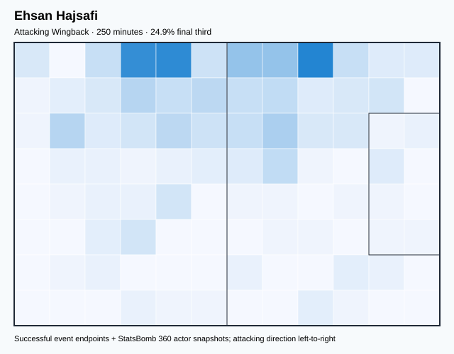

## Physical profile

| Metric | Score |
|---|---:|
| Aerial dominance | 1.000 |
| Pressing intensity per 90 | 13.68 |
| Recovery index per 90 | 2.52 |

## Top chemistry partners

- Seyed Majid Hosseini — synergy 0.575, 250 shared minutes
- Morteza Pouraliganji — synergy 0.544, 250 shared minutes
- Ahmad Nourollahi — synergy 0.494, 223 shared minutes

## Tactical recommendations

- Lead the first pressing trigger and protect the inside passing lane.
- Target this player on direct restarts and back-post deliveries.
- Pair with a faster recovery defender after aggressive rotations.

_The heatmap combines successful event endpoints with StatsBomb 360 actor
snapshots. StatsBomb 360 is freeze-frame context, not continuous player
tracking. Ratings include eligible outfield players from 45 minutes and
goalkeepers from 90 minutes; ranking status communicates sample reliability._

---

<!-- PLAYER_REPORT 8: 5231_starter_report.md -->

# Karim Ansarifard — Starter Report

- Team: Iran (IRN)
- Position: Center Attacking Midfield
- Functional role: Ball-Winner
- VAEP offense per 90: 0.1707
- VAEP defense per 90: 0.0391
- VAEP total per 90: 0.2098
- VAEP per touch: 0.00586
- Spatial xT per 90: 0.0301
- Final-third spatial share: 52.4%
- Unified final player rating: 0.1693
- Team rank: #4

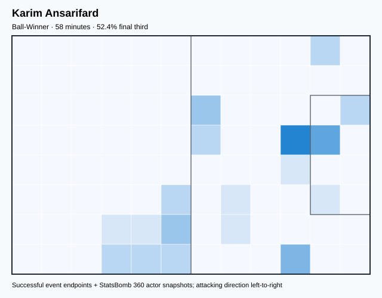

## Physical profile

| Metric | Score |
|---|---:|
| Aerial dominance | 0.500 |
| Pressing intensity per 90 | 7.79 |
| Recovery index per 90 | 3.12 |

## Top chemistry partners

- Mehdi Taremi — synergy 0.177, 58 shared minutes
- Seyed Majid Hosseini — synergy 0.174, 58 shared minutes
- Ramin Rezaeian — synergy 0.174, 58 shared minutes

## Tactical recommendations

- Use a compact pressing trigger rather than sustained solo pressure.
- Use recovery capacity to support higher attacking positions.

_The heatmap combines successful event endpoints with StatsBomb 360 actor
snapshots. StatsBomb 360 is freeze-frame context, not continuous player
tracking. Ratings include eligible outfield players from 45 minutes and
goalkeepers from 90 minutes; ranking status communicates sample reliability._

---

<!-- PLAYER_REPORT 9: 5235_starter_report.md -->

# Ramin Rezaeian — Starter Report

- Team: Iran (IRN)
- Position: Right Back
- Functional role: Attacking Wingback
- VAEP offense per 90: 0.2062
- VAEP defense per 90: -0.0962
- VAEP total per 90: 0.1100
- VAEP per touch: 0.00092
- Spatial xT per 90: 0.0850
- Final-third spatial share: 29.4%
- Unified final player rating: 0.0594
- Team rank: #8

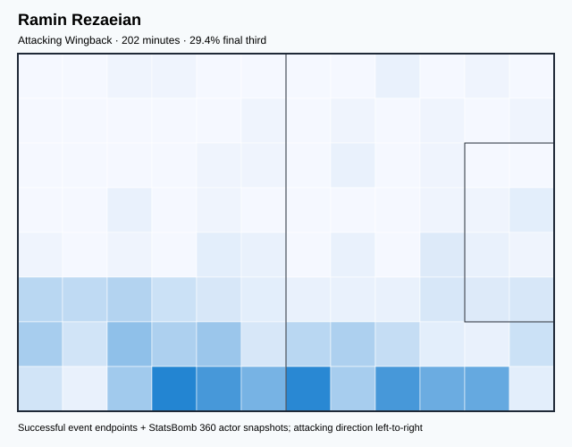

## Physical profile

| Metric | Score |
|---|---:|
| Aerial dominance | 0.143 |
| Pressing intensity per 90 | 17.82 |
| Recovery index per 90 | 2.67 |

## Top chemistry partners

- Seyed Majid Hosseini — synergy 0.468, 202 shared minutes
- Morteza Pouraliganji — synergy 0.463, 202 shared minutes
- Mehdi Taremi — synergy 0.451, 202 shared minutes

## Tactical recommendations

- Lead the first pressing trigger and protect the inside passing lane.
- Avoid isolating this player in high-volume aerial matchups.
- Use recovery capacity to support higher attacking positions.

_The heatmap combines successful event endpoints with StatsBomb 360 actor
snapshots. StatsBomb 360 is freeze-frame context, not continuous player
tracking. Ratings include eligible outfield players from 45 minutes and
goalkeepers from 90 minutes; ranking status communicates sample reliability._

---

<!-- PLAYER_REPORT 10: 5239_starter_report.md -->

# Alireza Jahanbakhsh — Starter Report

- Team: Iran (IRN)
- Position: Right Wing
- Functional role: Ball-Winner
- VAEP offense per 90: 0.1916
- VAEP defense per 90: -0.0025
- VAEP total per 90: 0.1891
- VAEP per touch: 0.00242
- Spatial xT per 90: 0.0572
- Final-third spatial share: 31.9%
- Unified final player rating: 0.1670
- Team rank: #5

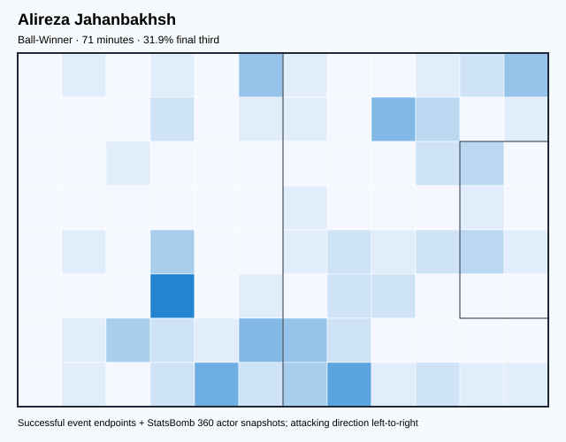

## Physical profile

| Metric | Score |
|---|---:|
| Aerial dominance | 0.250 |
| Pressing intensity per 90 | 20.16 |
| Recovery index per 90 | 3.78 |

## Top chemistry partners

- Mehdi Taremi — synergy 0.219, 71 shared minutes
- Seyed Majid Hosseini — synergy 0.205, 71 shared minutes
- Roozbeh Cheshmi — synergy 0.201, 70 shared minutes

## Tactical recommendations

- Lead the first pressing trigger and protect the inside passing lane.
- Use recovery capacity to support higher attacking positions.

_The heatmap combines successful event endpoints with StatsBomb 360 actor
snapshots. StatsBomb 360 is freeze-frame context, not continuous player
tracking. Ratings include eligible outfield players from 45 minutes and
goalkeepers from 90 minutes; ranking status communicates sample reliability._

---

<!-- PLAYER_REPORT 11: 5240_starter_report.md -->

# Saman Ghoddos — Starter Report

- Team: Iran (IRN)
- Position: Left Wing
- Functional role: Target Forward
- VAEP offense per 90: 0.3631
- VAEP defense per 90: 0.0053
- VAEP total per 90: 0.3684
- VAEP per touch: 0.00357
- Spatial xT per 90: 0.0643
- Final-third spatial share: 53.7%
- Unified final player rating: 0.1789
- Team rank: #3

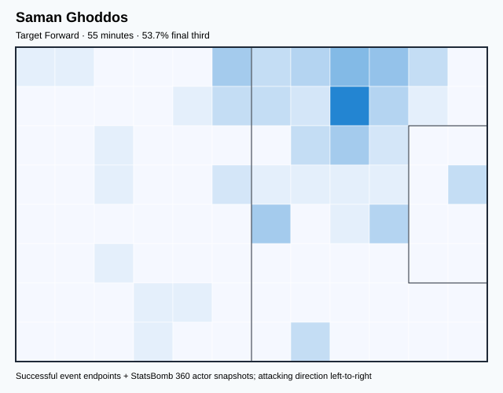

## Physical profile

| Metric | Score |
|---|---:|
| Aerial dominance | 0.500 |
| Pressing intensity per 90 | 14.76 |
| Recovery index per 90 | 0.00 |

## Top chemistry partners

- Saeid Ezatolahi Afagh — synergy 0.176, 55 shared minutes
- Morteza Pouraliganji — synergy 0.169, 55 shared minutes
- Ali Karimi — synergy 0.166, 53 shared minutes

## Tactical recommendations

- Lead the first pressing trigger and protect the inside passing lane.
- Pair with a faster recovery defender after aggressive rotations.

_The heatmap combines successful event endpoints with StatsBomb 360 actor
snapshots. StatsBomb 360 is freeze-frame context, not continuous player
tracking. Ratings include eligible outfield players from 45 minutes and
goalkeepers from 90 minutes; ranking status communicates sample reliability._

---

<!-- PLAYER_REPORT 12: 5720_starter_report.md -->

# Milad Mohammadi — Starter Report

- Team: Iran (IRN)
- Position: Left Back
- Functional role: Wide Creator
- VAEP offense per 90: 0.0008
- VAEP defense per 90: -0.0476
- VAEP total per 90: -0.0468
- VAEP per touch: -0.00075
- Spatial xT per 90: 0.0278
- Final-third spatial share: 17.6%
- Unified final player rating: 0.0307
- Team rank: #11

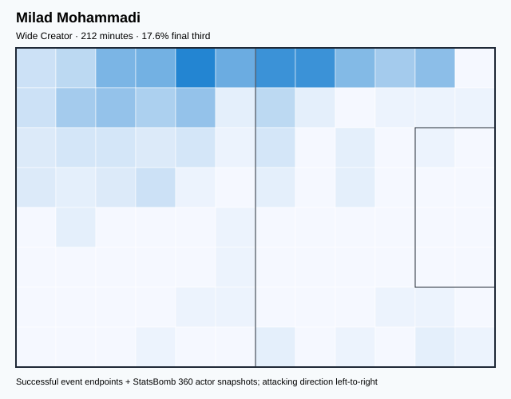

## Physical profile

| Metric | Score |
|---|---:|
| Aerial dominance | 0.571 |
| Pressing intensity per 90 | 22.93 |
| Recovery index per 90 | 1.27 |

## Top chemistry partners

- Morteza Pouraliganji — synergy 0.505, 212 shared minutes
- Ahmad Nourollahi — synergy 0.474, 187 shared minutes
- Mehdi Taremi — synergy 0.450, 212 shared minutes

## Tactical recommendations

- Lead the first pressing trigger and protect the inside passing lane.
- Target this player on direct restarts and back-post deliveries.
- Pair with a faster recovery defender after aggressive rotations.

_The heatmap combines successful event endpoints with StatsBomb 360 actor
snapshots. StatsBomb 360 is freeze-frame context, not continuous player
tracking. Ratings include eligible outfield players from 45 minutes and
goalkeepers from 90 minutes; ranking status communicates sample reliability._

---

<!-- PLAYER_REPORT 13: 5722_starter_report.md -->

# Saeid Ezatolahi Afagh — Starter Report

- Team: Iran (IRN)
- Position: Left Defensive Midfield
- Functional role: Holding Anchor
- VAEP offense per 90: 0.0301
- VAEP defense per 90: -0.0169
- VAEP total per 90: 0.0132
- VAEP per touch: 0.00015
- Spatial xT per 90: 0.0590
- Final-third spatial share: 20.2%
- Unified final player rating: 0.0205
- Team rank: #13

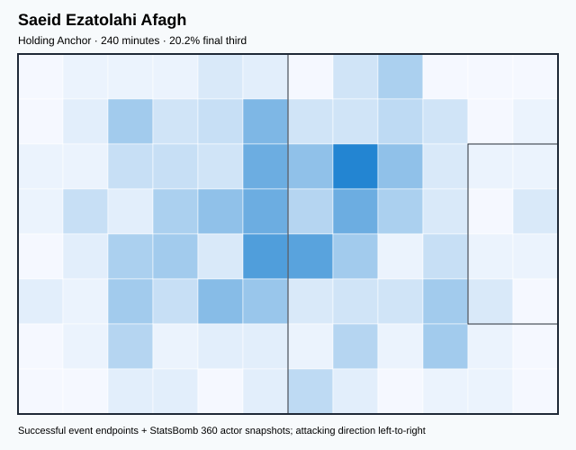

## Physical profile

| Metric | Score |
|---|---:|
| Aerial dominance | 0.615 |
| Pressing intensity per 90 | 14.62 |
| Recovery index per 90 | 3.00 |

## Top chemistry partners

- Seyed Majid Hosseini — synergy 0.574, 240 shared minutes
- Mehdi Taremi — synergy 0.573, 240 shared minutes
- Ali Gholizadeh — synergy 0.518, 211 shared minutes

## Tactical recommendations

- Lead the first pressing trigger and protect the inside passing lane.
- Target this player on direct restarts and back-post deliveries.
- Use recovery capacity to support higher attacking positions.

_The heatmap combines successful event endpoints with StatsBomb 360 actor
snapshots. StatsBomb 360 is freeze-frame context, not continuous player
tracking. Ratings include eligible outfield players from 45 minutes and
goalkeepers from 90 minutes; ranking status communicates sample reliability._

---

<!-- PLAYER_REPORT 14: 23538_starter_report.md -->

# Sadegh Moharrami — Starter Report

- Team: Iran (IRN)
- Position: Right Wing Back
- Functional role: Deep Playmaker
- VAEP offense per 90: 0.0702
- VAEP defense per 90: -0.0536
- VAEP total per 90: 0.0165
- VAEP per touch: 0.00028
- Spatial xT per 90: 0.0082
- Final-third spatial share: 24.4%
- Unified final player rating: 0.0455
- Team rank: #10

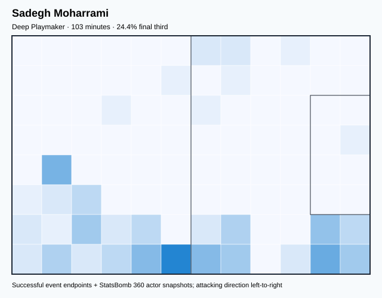

## Physical profile

| Metric | Score |
|---|---:|
| Aerial dominance | 0.500 |
| Pressing intensity per 90 | 17.46 |
| Recovery index per 90 | 3.49 |

## Top chemistry partners

- Seyed Majid Hosseini — synergy 0.287, 103 shared minutes
- Ehsan Hajsafi — synergy 0.281, 103 shared minutes
- Mehdi Taremi — synergy 0.272, 103 shared minutes

## Tactical recommendations

- Lead the first pressing trigger and protect the inside passing lane.
- Use recovery capacity to support higher attacking positions.

_The heatmap combines successful event endpoints with StatsBomb 360 actor
snapshots. StatsBomb 360 is freeze-frame context, not continuous player
tracking. Ratings include eligible outfield players from 45 minutes and
goalkeepers from 90 minutes; ranking status communicates sample reliability._

---

<!-- PLAYER_REPORT 15: 23874_starter_report.md -->

# Ali Gholizadeh — Starter Report

- Team: Iran (IRN)
- Position: Right Midfield
- Functional role: Progressive Winger
- VAEP offense per 90: 0.2181
- VAEP defense per 90: -0.0050
- VAEP total per 90: 0.2132
- VAEP per touch: 0.00233
- Spatial xT per 90: 0.0778
- Final-third spatial share: 40.4%
- Unified final player rating: 0.1127
- Team rank: #6

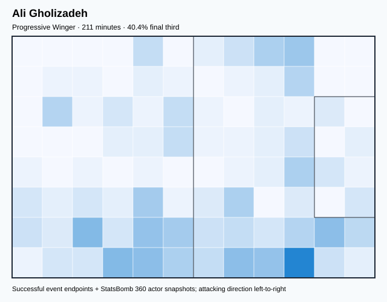

## Physical profile

| Metric | Score |
|---|---:|
| Aerial dominance | 0.000 |
| Pressing intensity per 90 | 14.52 |
| Recovery index per 90 | 5.98 |

## Top chemistry partners

- Saeid Ezatolahi Afagh — synergy 0.518, 211 shared minutes
- Seyed Majid Hosseini — synergy 0.503, 211 shared minutes
- Morteza Pouraliganji — synergy 0.479, 211 shared minutes

## Tactical recommendations

- Lead the first pressing trigger and protect the inside passing lane.
- Avoid isolating this player in high-volume aerial matchups.
- Use recovery capacity to support higher attacking positions.

_The heatmap combines successful event endpoints with StatsBomb 360 actor
snapshots. StatsBomb 360 is freeze-frame context, not continuous player
tracking. Ratings include eligible outfield players from 45 minutes and
goalkeepers from 90 minutes; ranking status communicates sample reliability._

---

<!-- PLAYER_REPORT 16: 124161_starter_report.md -->

# Mehdi Torabi — Starter Report

- Team: Iran (IRN)
- Position: Right Center Midfield
- Functional role: Ball-Winner
- VAEP offense per 90: 0.2016
- VAEP defense per 90: -0.1021
- VAEP total per 90: 0.0995
- VAEP per touch: 0.00093
- Spatial xT per 90: 0.0461
- Final-third spatial share: 31.6%
- Unified final player rating: 0.0994
- Team rank: #7

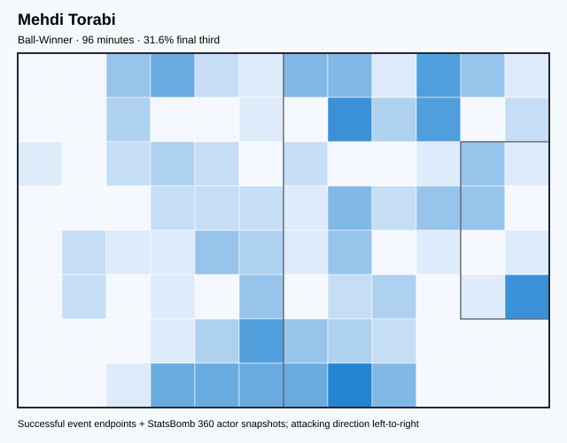

## Physical profile

| Metric | Score |
|---|---:|
| Aerial dominance | 0.000 |
| Pressing intensity per 90 | 18.78 |
| Recovery index per 90 | 4.69 |

## Top chemistry partners

- Seyed Majid Hosseini — synergy 0.283, 96 shared minutes
- Mehdi Taremi — synergy 0.282, 96 shared minutes
- Morteza Pouraliganji — synergy 0.235, 96 shared minutes

## Tactical recommendations

- Lead the first pressing trigger and protect the inside passing lane.
- Avoid isolating this player in high-volume aerial matchups.
- Use recovery capacity to support higher attacking positions.

_The heatmap combines successful event endpoints with StatsBomb 360 actor
snapshots. StatsBomb 360 is freeze-frame context, not continuous player
tracking. Ratings include eligible outfield players from 45 minutes and
goalkeepers from 90 minutes; ranking status communicates sample reliability._

---

<!-- PLAYER_REPORT 17: 124167_starter_report.md -->

# Ahmad Nourollahi — Starter Report

- Team: Iran (IRN)
- Position: Left Defensive Midfield
- Functional role: Holding Anchor
- VAEP offense per 90: 0.0130
- VAEP defense per 90: -0.0177
- VAEP total per 90: -0.0048
- VAEP per touch: -0.00007
- Spatial xT per 90: 0.0244
- Final-third spatial share: 31.5%
- Unified final player rating: 0.0153
- Team rank: #14

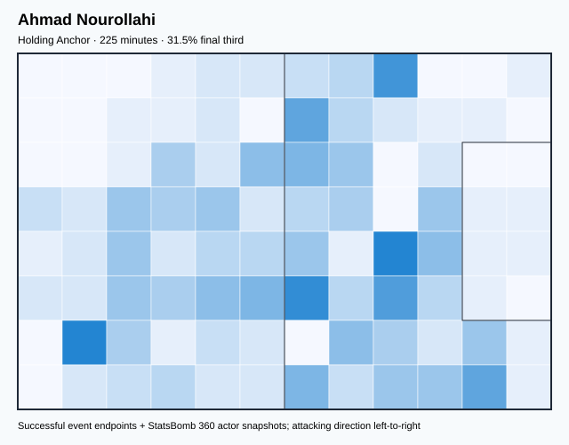

## Physical profile

| Metric | Score |
|---|---:|
| Aerial dominance | 1.000 |
| Pressing intensity per 90 | 16.42 |
| Recovery index per 90 | 6.41 |

## Top chemistry partners

- Seyed Majid Hosseini — synergy 0.535, 225 shared minutes
- Morteza Pouraliganji — synergy 0.510, 225 shared minutes
- Ehsan Hajsafi — synergy 0.494, 223 shared minutes

## Tactical recommendations

- Lead the first pressing trigger and protect the inside passing lane.
- Target this player on direct restarts and back-post deliveries.
- Use recovery capacity to support higher attacking positions.

_The heatmap combines successful event endpoints with StatsBomb 360 actor
snapshots. StatsBomb 360 is freeze-frame context, not continuous player
tracking. Ratings include eligible outfield players from 45 minutes and
goalkeepers from 90 minutes; ranking status communicates sample reliability._

---

<!-- PLAYER_REPORT 18: 124175_starter_report.md -->

# Mohammad Hossein Kanani Zadegan — Starter Report

- Team: Iran (IRN)
- Position: Right Center Back
- Functional role: Sweeper CB
- VAEP offense per 90: -0.0276
- VAEP defense per 90: -0.0903
- VAEP total per 90: -0.1179
- VAEP per touch: -0.00304
- Spatial xT per 90: 0.0007
- Final-third spatial share: 8.2%
- Unified final player rating: -0.0149
- Team rank: #17

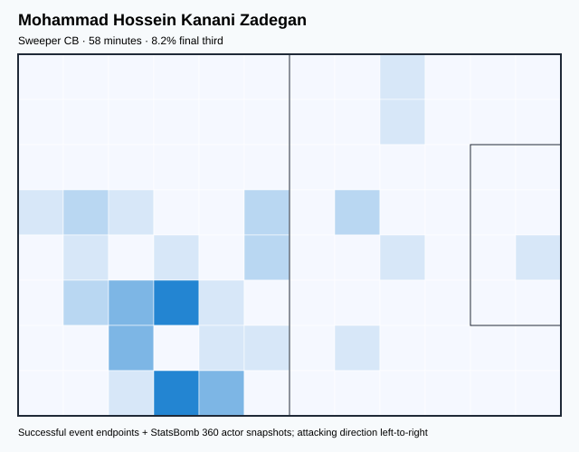

## Physical profile

| Metric | Score |
|---|---:|
| Aerial dominance | 0.000 |
| Pressing intensity per 90 | 9.30 |
| Recovery index per 90 | 0.00 |

## Top chemistry partners

- Morteza Pouraliganji — synergy 0.180, 58 shared minutes
- Saeid Ezatolahi Afagh — synergy 0.178, 58 shared minutes
- Sadegh Moharrami — synergy 0.178, 58 shared minutes

## Tactical recommendations

- Use a compact pressing trigger rather than sustained solo pressure.
- Avoid isolating this player in high-volume aerial matchups.
- Pair with a faster recovery defender after aggressive rotations.

_The heatmap combines successful event endpoints with StatsBomb 360 actor
snapshots. StatsBomb 360 is freeze-frame context, not continuous player
tracking. Ratings include eligible outfield players from 45 minutes and
goalkeepers from 90 minutes; ranking status communicates sample reliability._

---

<!-- PLAYER_REPORT 19: 125818_starter_report.md -->

# Ali Karimi — Starter Report

- Team: Iran (IRN)
- Position: Right Defensive Midfield
- Functional role: Holding Anchor
- VAEP offense per 90: 0.1883
- VAEP defense per 90: -0.0672
- VAEP total per 90: 0.1211
- VAEP per touch: 0.00134
- Spatial xT per 90: 0.0138
- Final-third spatial share: 24.5%
- Unified final player rating: 0.0304
- Team rank: #12

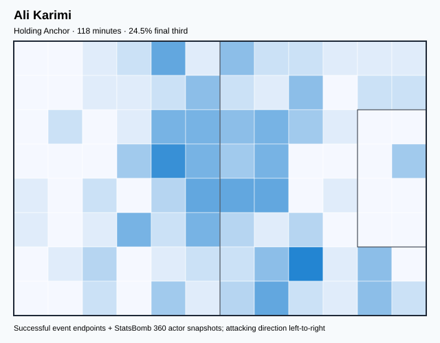

## Physical profile

| Metric | Score |
|---|---:|
| Aerial dominance | 0.750 |
| Pressing intensity per 90 | 23.68 |
| Recovery index per 90 | 0.00 |

## Top chemistry partners

- Seyed Majid Hosseini — synergy 0.333, 118 shared minutes
- Morteza Pouraliganji — synergy 0.311, 118 shared minutes
- Mehdi Taremi — synergy 0.311, 118 shared minutes

## Tactical recommendations

- Lead the first pressing trigger and protect the inside passing lane.
- Target this player on direct restarts and back-post deliveries.
- Pair with a faster recovery defender after aggressive rotations.

_The heatmap combines successful event endpoints with StatsBomb 360 actor
snapshots. StatsBomb 360 is freeze-frame context, not continuous player
tracking. Ratings include eligible outfield players from 45 minutes and
goalkeepers from 90 minutes; ranking status communicates sample reliability._

---

<!-- PLAYER_REPORT 20: 125823_starter_report.md -->

# Seyed Hossein Hosseini — Starter Report

- Team: Iran (IRN)
- Position: Goalkeeper
- Functional role: Goalkeeper
- VAEP offense per 90: -0.0203
- VAEP defense per 90: -0.1322
- VAEP total per 90: -0.1525
- VAEP per touch: -0.00350
- Spatial xT per 90: -0.0005
- Final-third spatial share: 0.0%
- Unified final player rating: -0.0660
- Team rank: #20

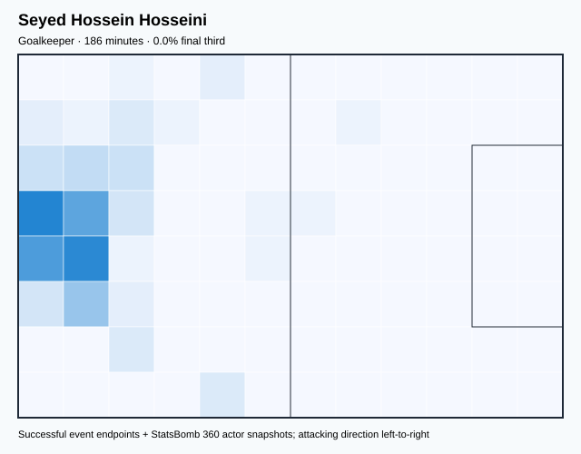

## Physical profile

| Metric | Score |
|---|---:|
| Aerial dominance | 0.000 |
| Pressing intensity per 90 | 0.00 |
| Recovery index per 90 | 4.84 |

## Top chemistry partners

- Morteza Pouraliganji — synergy 0.483, 186 shared minutes
- Seyed Majid Hosseini — synergy 0.472, 186 shared minutes
- Milad Mohammadi — synergy 0.377, 146 shared minutes

## Tactical recommendations

- Use a compact pressing trigger rather than sustained solo pressure.
- Avoid isolating this player in high-volume aerial matchups.
- Use recovery capacity to support higher attacking positions.

_The heatmap combines successful event endpoints with StatsBomb 360 actor
snapshots. StatsBomb 360 is freeze-frame context, not continuous player
tracking. Ratings include eligible outfield players from 45 minutes and
goalkeepers from 90 minutes; ranking status communicates sample reliability._
