# JPN — V4 Player Evaluation Collection

<!-- V5_CANONICAL_NOTICE -->
> **Historical V4 player-rating packet.** Player ratings, ranks, role-challenger decisions, and rating uncertainty below are superseded by `results/reports/player_rankings.csv`, `results/reports/player_profiles/`, and `results/reports/model_summary.md`. Possession, tactical, and match-bootstrap material remains a historical V4 result.

- Included eligible players: 22
- Rankings use the role-aware, development-gated VAEP/xT/xD model.
- Heatmaps combine successful on-ball endpoints and SB360 actor snapshots.

---

<!-- PLAYER_REPORT 1: 3300_starter_report.md -->

# Maya Yoshida — Starter Report

- Team: Japan (JPN)
- Position: Center Back
- Functional role: Sweeper CB
- VAEP offense per 90: -0.0724
- VAEP defense per 90: -0.0316
- VAEP total per 90: -0.1040
- VAEP per touch: -0.00082
- Spatial xT per 90: 0.0063
- Final-third spatial share: 3.0%
- Unified final player rating: -0.0292
- Team rank: #21

## Physical profile

| Metric | Score |
|---|---:|
| Aerial dominance | 0.600 |
| Pressing intensity per 90 | 6.76 |
| Recovery index per 90 | 1.96 |

## Top chemistry partners

- Shūichi Gonda — synergy 0.773, 413 shared minutes
- Wataru Endo — synergy 0.694, 326 shared minutes
- Ko Itakura — synergy 0.655, 292 shared minutes

## Tactical recommendations

- Use a compact pressing trigger rather than sustained solo pressure.
- Target this player on direct restarts and back-post deliveries.
- Pair with a faster recovery defender after aggressive rotations.

_The heatmap combines successful event endpoints with StatsBomb 360 actor
snapshots. StatsBomb 360 is freeze-frame context, not continuous player
tracking. Ratings include eligible outfield players from 45 minutes and
goalkeepers from 90 minutes; ranking status communicates sample reliability._

---

<!-- PLAYER_REPORT 2: 3530_starter_report.md -->

# Hiroki Sakai — Starter Report

- Team: Japan (JPN)
- Position: Right Back
- Functional role: Attacking Wingback
- VAEP offense per 90: 0.1505
- VAEP defense per 90: 0.0461
- VAEP total per 90: 0.1966
- VAEP per touch: 0.00238
- Spatial xT per 90: 0.0702
- Final-third spatial share: 35.5%
- Unified final player rating: 0.0662
- Team rank: #9

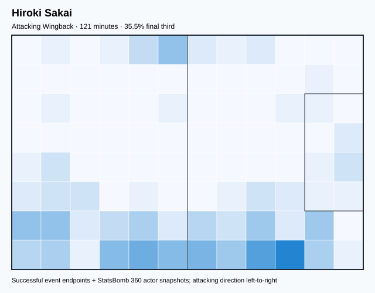

## Physical profile

| Metric | Score |
|---|---:|
| Aerial dominance | 0.308 |
| Pressing intensity per 90 | 11.16 |
| Recovery index per 90 | 2.23 |

## Top chemistry partners

- Wataru Endo — synergy 0.344, 121 shared minutes
- Maya Yoshida — synergy 0.309, 121 shared minutes
- Junya Ito — synergy 0.277, 121 shared minutes

## Tactical recommendations

- Lead the first pressing trigger and protect the inside passing lane.
- Pair with a faster recovery defender after aggressive rotations.

_The heatmap combines successful event endpoints with StatsBomb 360 actor
snapshots. StatsBomb 360 is freeze-frame context, not continuous player
tracking. Ratings include eligible outfield players from 45 minutes and
goalkeepers from 90 minutes; ranking status communicates sample reliability._

---

<!-- PLAYER_REPORT 3: 5690_starter_report.md -->

# Yuto Nagatomo — Starter Report

- Team: Japan (JPN)
- Position: Left Wing Back
- Functional role: Wide Creator
- VAEP offense per 90: 0.0423
- VAEP defense per 90: -0.0063
- VAEP total per 90: 0.0360
- VAEP per touch: 0.00032
- Spatial xT per 90: 0.0337
- Final-third spatial share: 25.4%
- Unified final player rating: 0.0445
- Team rank: #12

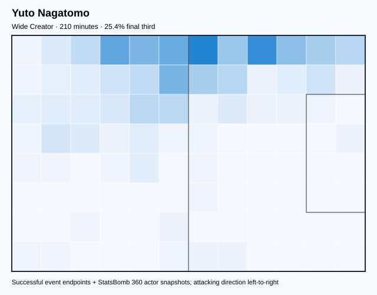

## Physical profile

| Metric | Score |
|---|---:|
| Aerial dominance | 0.667 |
| Pressing intensity per 90 | 14.58 |
| Recovery index per 90 | 3.86 |

## Top chemistry partners

- Maya Yoshida — synergy 0.522, 210 shared minutes
- Shūichi Gonda — synergy 0.463, 210 shared minutes
- Wataru Endo — synergy 0.440, 165 shared minutes

## Tactical recommendations

- Lead the first pressing trigger and protect the inside passing lane.
- Target this player on direct restarts and back-post deliveries.
- Use recovery capacity to support higher attacking positions.

_The heatmap combines successful event endpoints with StatsBomb 360 actor
snapshots. StatsBomb 360 is freeze-frame context, not continuous player
tracking. Ratings include eligible outfield players from 45 minutes and
goalkeepers from 90 minutes; ranking status communicates sample reliability._

---

<!-- PLAYER_REPORT 4: 8361_starter_report.md -->

# Ritsu Doan — Starter Report

- Team: Japan (JPN)
- Position: Right Wing
- Functional role: Progressive Winger
- VAEP offense per 90: 0.1454
- VAEP defense per 90: 0.0394
- VAEP total per 90: 0.1847
- VAEP per touch: 0.00222
- Spatial xT per 90: 0.0568
- Final-third spatial share: 47.8%
- Unified final player rating: 0.1520
- Team rank: #5

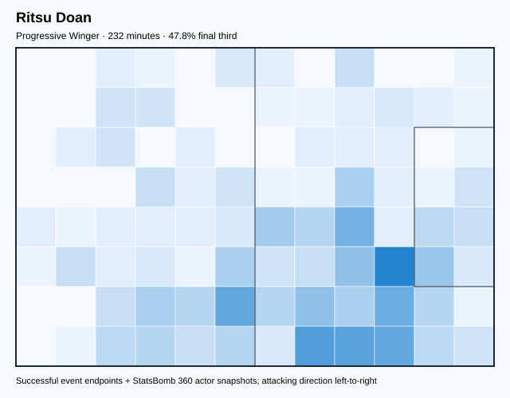

## Physical profile

| Metric | Score |
|---|---:|
| Aerial dominance | 0.200 |
| Pressing intensity per 90 | 20.18 |
| Recovery index per 90 | 3.88 |

## Top chemistry partners

- Shūichi Gonda — synergy 0.446, 232 shared minutes
- Wataru Endo — synergy 0.441, 190 shared minutes
- Maya Yoshida — synergy 0.441, 232 shared minutes

## Tactical recommendations

- Lead the first pressing trigger and protect the inside passing lane.
- Use recovery capacity to support higher attacking positions.

_The heatmap combines successful event endpoints with StatsBomb 360 actor
snapshots. StatsBomb 360 is freeze-frame context, not continuous player
tracking. Ratings include eligible outfield players from 45 minutes and
goalkeepers from 90 minutes; ranking status communicates sample reliability._

---

<!-- PLAYER_REPORT 5: 8776_starter_report.md -->

# Takumi Minamino — Starter Report

- Team: Japan (JPN)
- Position: Left Wing
- Functional role: Target Forward
- VAEP offense per 90: -0.1312
- VAEP defense per 90: -0.0991
- VAEP total per 90: -0.2304
- VAEP per touch: -0.00242
- Spatial xT per 90: 0.0500
- Final-third spatial share: 43.3%
- Unified final player rating: 0.1369
- Team rank: #7

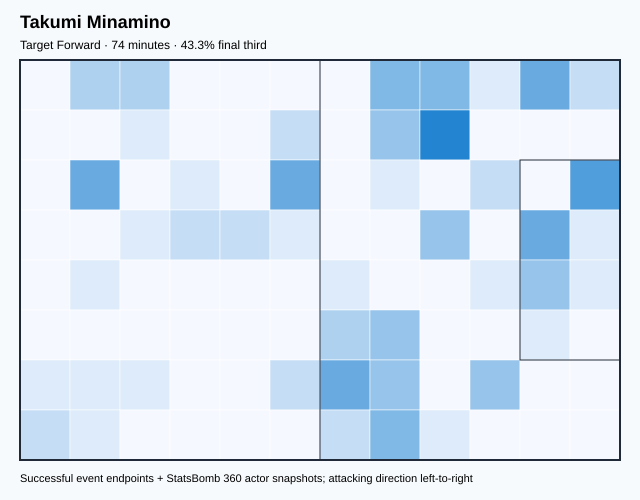

## Physical profile

| Metric | Score |
|---|---:|
| Aerial dominance | 0.000 |
| Pressing intensity per 90 | 14.66 |
| Recovery index per 90 | 2.44 |

## Top chemistry partners

- Maya Yoshida — synergy 0.223, 74 shared minutes
- Kaoru Mitoma — synergy 0.209, 74 shared minutes
- Wataru Endo — synergy 0.201, 74 shared minutes

## Tactical recommendations

- Lead the first pressing trigger and protect the inside passing lane.
- Avoid isolating this player in high-volume aerial matchups.
- Pair with a faster recovery defender after aggressive rotations.

_The heatmap combines successful event endpoints with StatsBomb 360 actor
snapshots. StatsBomb 360 is freeze-frame context, not continuous player
tracking. Ratings include eligible outfield players from 45 minutes and
goalkeepers from 90 minutes; ranking status communicates sample reliability._

---

<!-- PLAYER_REPORT 6: 8949_starter_report.md -->

# Takuma Asano — Starter Report

- Team: Japan (JPN)
- Position: Center Forward
- Functional role: Target Forward
- VAEP offense per 90: 0.3246
- VAEP defense per 90: 0.0325
- VAEP total per 90: 0.3571
- VAEP per touch: 0.00471
- Spatial xT per 90: 0.0291
- Final-third spatial share: 52.5%
- Unified final player rating: 0.2235
- Team rank: #1

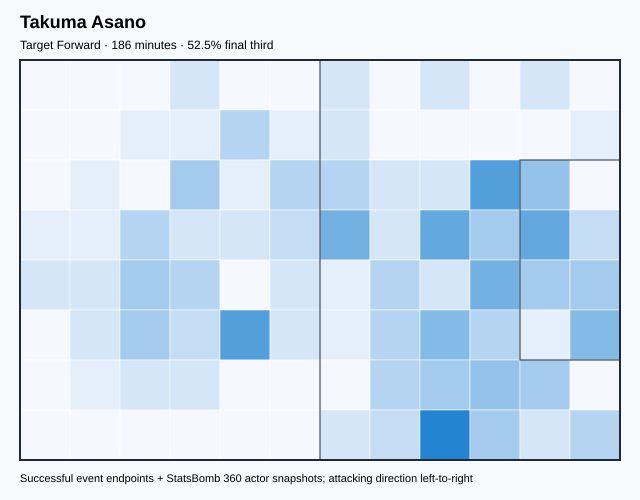

## Physical profile

| Metric | Score |
|---|---:|
| Aerial dominance | 0.182 |
| Pressing intensity per 90 | 14.01 |
| Recovery index per 90 | 3.38 |

## Top chemistry partners

- Ko Itakura — synergy 0.343, 129 shared minutes
- Hidemasa Morita — synergy 0.333, 129 shared minutes
- Junya Ito — synergy 0.323, 165 shared minutes

## Tactical recommendations

- Lead the first pressing trigger and protect the inside passing lane.
- Avoid isolating this player in high-volume aerial matchups.
- Use recovery capacity to support higher attacking positions.

_The heatmap combines successful event endpoints with StatsBomb 360 actor
snapshots. StatsBomb 360 is freeze-frame context, not continuous player
tracking. Ratings include eligible outfield players from 45 minutes and
goalkeepers from 90 minutes; ranking status communicates sample reliability._

---

<!-- PLAYER_REPORT 7: 9411_starter_report.md -->

# Daichi Kamada — Starter Report

- Team: Japan (JPN)
- Position: Center Attacking Midfield
- Functional role: Ball-Winner
- VAEP offense per 90: 0.1660
- VAEP defense per 90: 0.0114
- VAEP total per 90: 0.1775
- VAEP per touch: 0.00186
- Spatial xT per 90: 0.0228
- Final-third spatial share: 36.1%
- Unified final player rating: 0.1411
- Team rank: #6

## Physical profile

| Metric | Score |
|---|---:|
| Aerial dominance | 0.600 |
| Pressing intensity per 90 | 20.55 |
| Recovery index per 90 | 1.60 |

## Top chemistry partners

- Maya Yoshida — synergy 0.647, 337 shared minutes
- Wataru Endo — synergy 0.592, 268 shared minutes
- Ko Itakura — synergy 0.553, 263 shared minutes

## Tactical recommendations

- Lead the first pressing trigger and protect the inside passing lane.
- Target this player on direct restarts and back-post deliveries.
- Pair with a faster recovery defender after aggressive rotations.

_The heatmap combines successful event endpoints with StatsBomb 360 actor
snapshots. StatsBomb 360 is freeze-frame context, not continuous player
tracking. Ratings include eligible outfield players from 45 minutes and
goalkeepers from 90 minutes; ranking status communicates sample reliability._

---

<!-- PLAYER_REPORT 8: 23527_starter_report.md -->

# Junya Ito — Starter Report

- Team: Japan (JPN)
- Position: Right Wing Back
- Functional role: Attacking Wingback
- VAEP offense per 90: 0.1727
- VAEP defense per 90: -0.0419
- VAEP total per 90: 0.1308
- VAEP per touch: 0.00169
- Spatial xT per 90: 0.0544
- Final-third spatial share: 35.8%
- Unified final player rating: 0.0637
- Team rank: #10

## Physical profile

| Metric | Score |
|---|---:|
| Aerial dominance | 0.364 |
| Pressing intensity per 90 | 13.25 |
| Recovery index per 90 | 3.64 |

## Top chemistry partners

- Wataru Endo — synergy 0.579, 260 shared minutes
- Maya Yoshida — synergy 0.567, 346 shared minutes
- Hidemasa Morita — synergy 0.551, 232 shared minutes

## Tactical recommendations

- Lead the first pressing trigger and protect the inside passing lane.
- Use recovery capacity to support higher attacking positions.

_The heatmap combines successful event endpoints with StatsBomb 360 actor
snapshots. StatsBomb 360 is freeze-frame context, not continuous player
tracking. Ratings include eligible outfield players from 45 minutes and
goalkeepers from 90 minutes; ranking status communicates sample reliability._

---

<!-- PLAYER_REPORT 9: 23721_starter_report.md -->

# Wataru Endo — Starter Report

- Team: Japan (JPN)
- Position: Right Defensive Midfield
- Functional role: Box-to-Box / Engine Midfielder
- VAEP offense per 90: 0.0308
- VAEP defense per 90: -0.0382
- VAEP total per 90: -0.0074
- VAEP per touch: -0.00005
- Spatial xT per 90: 0.0382
- Final-third spatial share: 22.5%
- Unified final player rating: 0.0142
- Team rank: #16

## Physical profile

| Metric | Score |
|---|---:|
| Aerial dominance | 0.529 |
| Pressing intensity per 90 | 20.43 |
| Recovery index per 90 | 6.35 |

## Top chemistry partners

- Maya Yoshida — synergy 0.694, 326 shared minutes
- Shūichi Gonda — synergy 0.664, 326 shared minutes
- Daichi Kamada — synergy 0.592, 268 shared minutes

## Tactical recommendations

- Lead the first pressing trigger and protect the inside passing lane.
- Use recovery capacity to support higher attacking positions.

_The heatmap combines successful event endpoints with StatsBomb 360 actor
snapshots. StatsBomb 360 is freeze-frame context, not continuous player
tracking. Ratings include eligible outfield players from 45 minutes and
goalkeepers from 90 minutes; ranking status communicates sample reliability._

---

<!-- PLAYER_REPORT 10: 23730_starter_report.md -->

# Takehiro Tomiyasu — Starter Report

- Team: Japan (JPN)
- Position: Right Center Back
- Functional role: Deep Playmaker
- VAEP offense per 90: 0.0807
- VAEP defense per 90: -0.0919
- VAEP total per 90: -0.0112
- VAEP per touch: -0.00011
- Spatial xT per 90: 0.0307
- Final-third spatial share: 17.2%
- Unified final player rating: -0.0061
- Team rank: #20

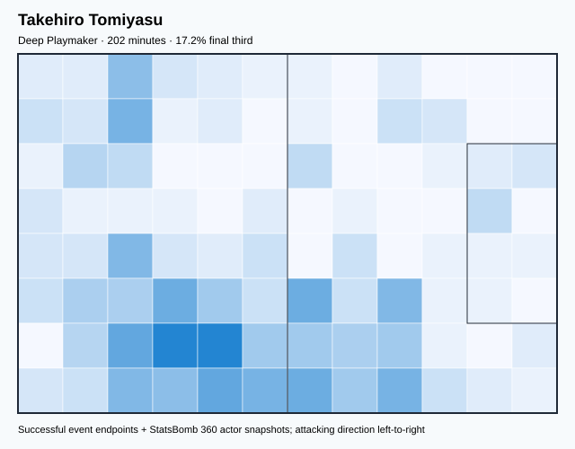

## Physical profile

| Metric | Score |
|---|---:|
| Aerial dominance | 0.500 |
| Pressing intensity per 90 | 8.01 |
| Recovery index per 90 | 2.22 |

## Top chemistry partners

- Maya Yoshida — synergy 0.517, 202 shared minutes
- Shūichi Gonda — synergy 0.484, 202 shared minutes
- Junya Ito — synergy 0.473, 202 shared minutes

## Tactical recommendations

- Use a compact pressing trigger rather than sustained solo pressure.
- Pair with a faster recovery defender after aggressive rotations.

_The heatmap combines successful event endpoints with StatsBomb 360 actor
snapshots. StatsBomb 360 is freeze-frame context, not continuous player
tracking. Ratings include eligible outfield players from 45 minutes and
goalkeepers from 90 minutes; ranking status communicates sample reliability._

---

<!-- PLAYER_REPORT 11: 25719_starter_report.md -->

# Shūichi Gonda — Starter Report

- Team: Japan (JPN)
- Position: Goalkeeper
- Functional role: Goalkeeper
- VAEP offense per 90: -0.0019
- VAEP defense per 90: -0.0910
- VAEP total per 90: -0.0929
- VAEP per touch: -0.00201
- Spatial xT per 90: 0.0065
- Final-third spatial share: 1.6%
- Unified final player rating: -0.0538
- Team rank: #22

## Physical profile

| Metric | Score |
|---|---:|
| Aerial dominance | 0.000 |
| Pressing intensity per 90 | 0.22 |
| Recovery index per 90 | 3.05 |

## Top chemistry partners

- Maya Yoshida — synergy 0.773, 413 shared minutes
- Wataru Endo — synergy 0.664, 326 shared minutes
- Ko Itakura — synergy 0.640, 292 shared minutes

## Tactical recommendations

- Use a compact pressing trigger rather than sustained solo pressure.
- Avoid isolating this player in high-volume aerial matchups.
- Use recovery capacity to support higher attacking positions.

_The heatmap combines successful event endpoints with StatsBomb 360 actor
snapshots. StatsBomb 360 is freeze-frame context, not continuous player
tracking. Ratings include eligible outfield players from 45 minutes and
goalkeepers from 90 minutes; ranking status communicates sample reliability._

---

<!-- PLAYER_REPORT 12: 29595_starter_report.md -->

# Ko Itakura — Starter Report

- Team: Japan (JPN)
- Position: Right Center Back
- Functional role: Sweeper CB
- VAEP offense per 90: 0.0696
- VAEP defense per 90: -0.0144
- VAEP total per 90: 0.0552
- VAEP per touch: 0.00060
- Spatial xT per 90: 0.0119
- Final-third spatial share: 8.6%
- Unified final player rating: 0.0063
- Team rank: #17

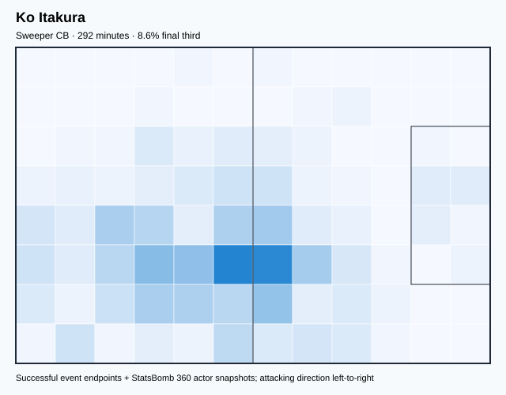

## Physical profile

| Metric | Score |
|---|---:|
| Aerial dominance | 0.167 |
| Pressing intensity per 90 | 12.04 |
| Recovery index per 90 | 1.54 |

## Top chemistry partners

- Maya Yoshida — synergy 0.655, 292 shared minutes
- Shūichi Gonda — synergy 0.640, 292 shared minutes
- Daichi Kamada — synergy 0.553, 263 shared minutes

## Tactical recommendations

- Lead the first pressing trigger and protect the inside passing lane.
- Avoid isolating this player in high-volume aerial matchups.
- Pair with a faster recovery defender after aggressive rotations.

_The heatmap combines successful event endpoints with StatsBomb 360 actor
snapshots. StatsBomb 360 is freeze-frame context, not continuous player
tracking. Ratings include eligible outfield players from 45 minutes and
goalkeepers from 90 minutes; ranking status communicates sample reliability._

---

<!-- PLAYER_REPORT 13: 30628_starter_report.md -->

# Daizen Maeda — Starter Report

- Team: Japan (JPN)
- Position: Center Forward
- Functional role: Target Forward
- VAEP offense per 90: 0.2121
- VAEP defense per 90: 0.0379
- VAEP total per 90: 0.2499
- VAEP per touch: 0.00719
- Spatial xT per 90: 0.0049
- Final-third spatial share: 33.0%
- Unified final player rating: 0.2073
- Team rank: #3

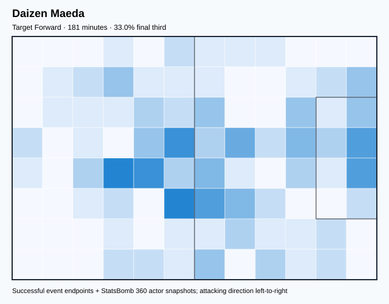

## Physical profile

| Metric | Score |
|---|---:|
| Aerial dominance | 0.182 |
| Pressing intensity per 90 | 41.23 |
| Recovery index per 90 | 1.49 |

## Top chemistry partners

- Maya Yoshida — synergy 0.331, 181 shared minutes
- Ko Itakura — synergy 0.324, 118 shared minutes
- Shūichi Gonda — synergy 0.309, 181 shared minutes

## Tactical recommendations

- Lead the first pressing trigger and protect the inside passing lane.
- Avoid isolating this player in high-volume aerial matchups.
- Pair with a faster recovery defender after aggressive rotations.

_The heatmap combines successful event endpoints with StatsBomb 360 actor
snapshots. StatsBomb 360 is freeze-frame context, not continuous player
tracking. Ratings include eligible outfield players from 45 minutes and
goalkeepers from 90 minutes; ranking status communicates sample reliability._

---

<!-- PLAYER_REPORT 14: 31090_starter_report.md -->

# Takefusa Kubo — Starter Report

- Team: Japan (JPN)
- Position: Right Wing
- Functional role: Target Forward
- VAEP offense per 90: 0.1328
- VAEP defense per 90: -0.0158
- VAEP total per 90: 0.1169
- VAEP per touch: 0.00229
- Spatial xT per 90: 0.0145
- Final-third spatial share: 42.0%
- Unified final player rating: 0.1575
- Team rank: #4

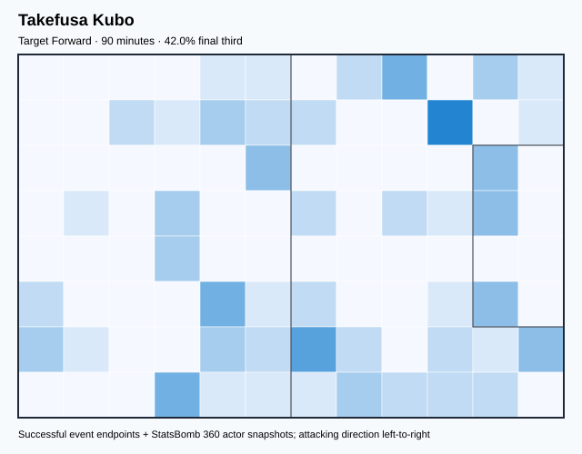

## Physical profile

| Metric | Score |
|---|---:|
| Aerial dominance | 0.500 |
| Pressing intensity per 90 | 39.00 |
| Recovery index per 90 | 5.00 |

## Top chemistry partners

- Junya Ito — synergy 0.265, 90 shared minutes
- Ao Tanaka — synergy 0.263, 90 shared minutes
- Maya Yoshida — synergy 0.251, 90 shared minutes

## Tactical recommendations

- Lead the first pressing trigger and protect the inside passing lane.
- Use recovery capacity to support higher attacking positions.

_The heatmap combines successful event endpoints with StatsBomb 360 actor
snapshots. StatsBomb 360 is freeze-frame context, not continuous player
tracking. Ratings include eligible outfield players from 45 minutes and
goalkeepers from 90 minutes; ranking status communicates sample reliability._

---

<!-- PLAYER_REPORT 15: 37122_starter_report.md -->

# Yuki Soma — Starter Report

- Team: Japan (JPN)
- Position: Left Midfield
- Functional role: Target Forward
- VAEP offense per 90: 0.1782
- VAEP defense per 90: 0.0044
- VAEP total per 90: 0.1826
- VAEP per touch: 0.00241
- Spatial xT per 90: 0.0600
- Final-third spatial share: 69.4%
- Unified final player rating: 0.1073
- Team rank: #8

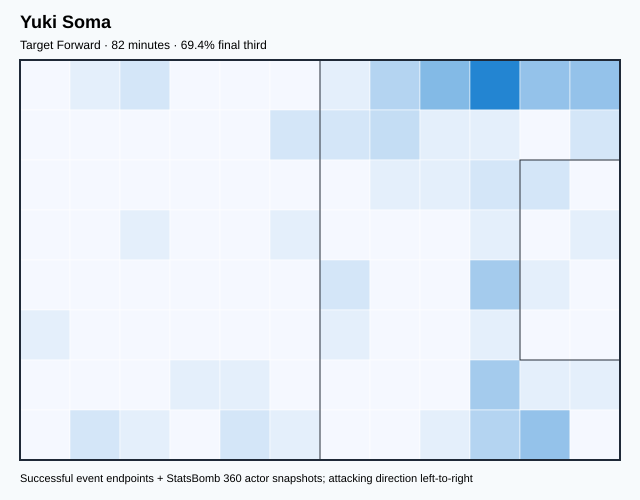

## Physical profile

| Metric | Score |
|---|---:|
| Aerial dominance | 0.000 |
| Pressing intensity per 90 | 14.30 |
| Recovery index per 90 | 3.30 |

## Top chemistry partners

- Ko Itakura — synergy 0.236, 82 shared minutes
- Shūichi Gonda — synergy 0.231, 82 shared minutes
- Maya Yoshida — synergy 0.202, 82 shared minutes

## Tactical recommendations

- Lead the first pressing trigger and protect the inside passing lane.
- Avoid isolating this player in high-volume aerial matchups.
- Use recovery capacity to support higher attacking positions.

_The heatmap combines successful event endpoints with StatsBomb 360 actor
snapshots. StatsBomb 360 is freeze-frame context, not continuous player
tracking. Ratings include eligible outfield players from 45 minutes and
goalkeepers from 90 minutes; ranking status communicates sample reliability._

---

<!-- PLAYER_REPORT 16: 37208_starter_report.md -->

# Ao Tanaka — Starter Report

- Team: Japan (JPN)
- Position: Right Defensive Midfield
- Functional role: Holding Anchor
- VAEP offense per 90: 0.1137
- VAEP defense per 90: -0.0103
- VAEP total per 90: 0.1033
- VAEP per touch: 0.00113
- Spatial xT per 90: 0.0336
- Final-third spatial share: 20.0%
- Unified final player rating: 0.0320
- Team rank: #13

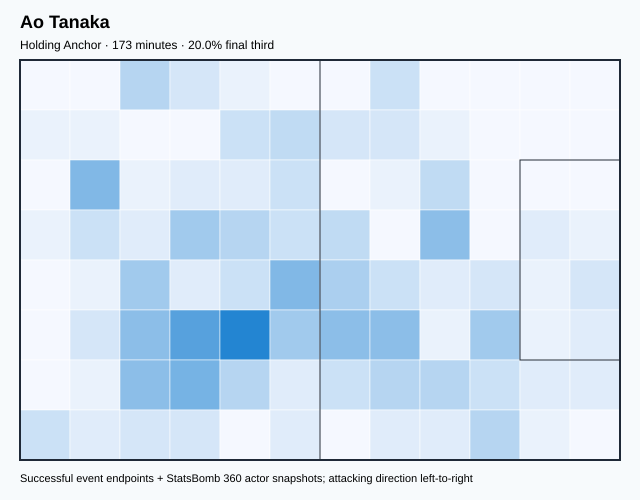

## Physical profile

| Metric | Score |
|---|---:|
| Aerial dominance | 1.000 |
| Pressing intensity per 90 | 21.83 |
| Recovery index per 90 | 0.52 |

## Top chemistry partners

- Shūichi Gonda — synergy 0.450, 173 shared minutes
- Junya Ito — synergy 0.432, 173 shared minutes
- Maya Yoshida — synergy 0.424, 173 shared minutes

## Tactical recommendations

- Lead the first pressing trigger and protect the inside passing lane.
- Target this player on direct restarts and back-post deliveries.
- Pair with a faster recovery defender after aggressive rotations.

_The heatmap combines successful event endpoints with StatsBomb 360 actor
snapshots. StatsBomb 360 is freeze-frame context, not continuous player
tracking. Ratings include eligible outfield players from 45 minutes and
goalkeepers from 90 minutes; ranking status communicates sample reliability._

---

<!-- PLAYER_REPORT 17: 37209_starter_report.md -->

# Miki Yamane — Starter Report

- Team: Japan (JPN)
- Position: Right Back
- Functional role: Attacking Wingback
- VAEP offense per 90: 0.0471
- VAEP defense per 90: 0.0054
- VAEP total per 90: 0.0525
- VAEP per touch: 0.00055
- Spatial xT per 90: 0.0512
- Final-third spatial share: 36.5%
- Unified final player rating: 0.0516
- Team rank: #11

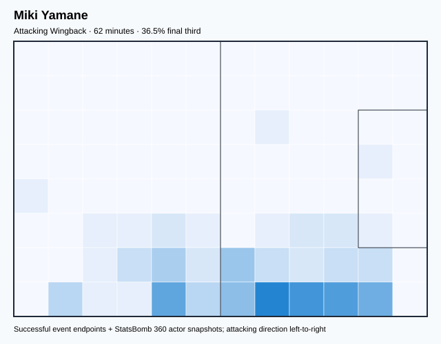

## Physical profile

| Metric | Score |
|---|---:|
| Aerial dominance | 0.000 |
| Pressing intensity per 90 | 13.16 |
| Recovery index per 90 | 4.39 |

## Top chemistry partners

- Ko Itakura — synergy 0.195, 62 shared minutes
- Wataru Endo — synergy 0.195, 62 shared minutes
- Maya Yoshida — synergy 0.187, 62 shared minutes

## Tactical recommendations

- Lead the first pressing trigger and protect the inside passing lane.
- Avoid isolating this player in high-volume aerial matchups.
- Use recovery capacity to support higher attacking positions.

_The heatmap combines successful event endpoints with StatsBomb 360 actor
snapshots. StatsBomb 360 is freeze-frame context, not continuous player
tracking. Ratings include eligible outfield players from 45 minutes and
goalkeepers from 90 minutes; ranking status communicates sample reliability._

---

<!-- PLAYER_REPORT 18: 37211_starter_report.md -->

# Kaoru Mitoma — Starter Report

- Team: Japan (JPN)
- Position: Left Wing Back
- Functional role: Attacking Wingback
- VAEP offense per 90: -0.0487
- VAEP defense per 90: -0.0549
- VAEP total per 90: -0.1036
- VAEP per touch: -0.00103
- Spatial xT per 90: 0.0859
- Final-third spatial share: 35.7%
- Unified final player rating: 0.0277
- Team rank: #15

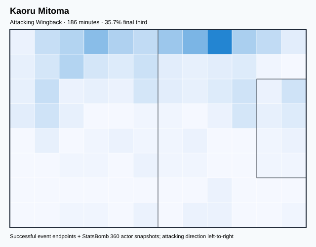

## Physical profile

| Metric | Score |
|---|---:|
| Aerial dominance | 0.500 |
| Pressing intensity per 90 | 24.18 |
| Recovery index per 90 | 3.87 |

## Top chemistry partners

- Maya Yoshida — synergy 0.481, 186 shared minutes
- Junya Ito — synergy 0.454, 182 shared minutes
- Shūichi Gonda — synergy 0.370, 186 shared minutes

## Tactical recommendations

- Lead the first pressing trigger and protect the inside passing lane.
- Use recovery capacity to support higher attacking positions.

_The heatmap combines successful event endpoints with StatsBomb 360 actor
snapshots. StatsBomb 360 is freeze-frame context, not continuous player
tracking. Ratings include eligible outfield players from 45 minutes and
goalkeepers from 90 minutes; ranking status communicates sample reliability._

---

<!-- PLAYER_REPORT 19: 37215_starter_report.md -->

# Shogo Taniguchi — Starter Report

- Team: Japan (JPN)
- Position: Left Center Back
- Functional role: Sweeper CB
- VAEP offense per 90: 0.0776
- VAEP defense per 90: -0.0418
- VAEP total per 90: 0.0358
- VAEP per touch: 0.00042
- Spatial xT per 90: 0.0105
- Final-third spatial share: 11.8%
- Unified final player rating: 0.0004
- Team rank: #18

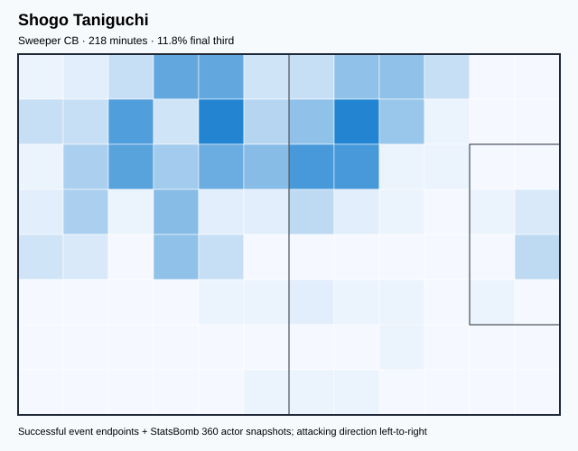

## Physical profile

| Metric | Score |
|---|---:|
| Aerial dominance | 0.667 |
| Pressing intensity per 90 | 3.30 |
| Recovery index per 90 | 0.83 |

## Top chemistry partners

- Maya Yoshida — synergy 0.542, 218 shared minutes
- Shūichi Gonda — synergy 0.529, 218 shared minutes
- Junya Ito — synergy 0.518, 218 shared minutes

## Tactical recommendations

- Use a compact pressing trigger rather than sustained solo pressure.
- Target this player on direct restarts and back-post deliveries.
- Pair with a faster recovery defender after aggressive rotations.

_The heatmap combines successful event endpoints with StatsBomb 360 actor
snapshots. StatsBomb 360 is freeze-frame context, not continuous player
tracking. Ratings include eligible outfield players from 45 minutes and
goalkeepers from 90 minutes; ranking status communicates sample reliability._

---

<!-- PLAYER_REPORT 20: 37221_starter_report.md -->

# Hidemasa Morita — Starter Report

- Team: Japan (JPN)
- Position: Left Defensive Midfield
- Functional role: Box-to-Box / Engine Midfielder
- VAEP offense per 90: 0.0785
- VAEP defense per 90: -0.0034
- VAEP total per 90: 0.0751
- VAEP per touch: 0.00057
- Spatial xT per 90: 0.0297
- Final-third spatial share: 22.6%
- Unified final player rating: 0.0304
- Team rank: #14

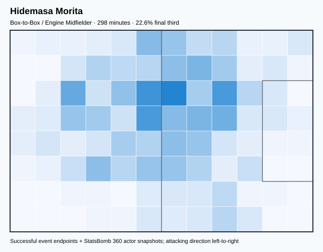

## Physical profile

| Metric | Score |
|---|---:|
| Aerial dominance | 0.500 |
| Pressing intensity per 90 | 17.80 |
| Recovery index per 90 | 5.73 |

## Top chemistry partners

- Shūichi Gonda — synergy 0.620, 298 shared minutes
- Maya Yoshida — synergy 0.618, 298 shared minutes
- Junya Ito — synergy 0.551, 232 shared minutes

## Tactical recommendations

- Lead the first pressing trigger and protect the inside passing lane.
- Use recovery capacity to support higher attacking positions.

_The heatmap combines successful event endpoints with StatsBomb 360 actor
snapshots. StatsBomb 360 is freeze-frame context, not continuous player
tracking. Ratings include eligible outfield players from 45 minutes and
goalkeepers from 90 minutes; ranking status communicates sample reliability._

---

<!-- PLAYER_REPORT 21: 38285_starter_report.md -->

# Ayase Ueda — Starter Report

- Team: Japan (JPN)
- Position: Right Center Forward
- Functional role: Target Forward
- VAEP offense per 90: 0.0787
- VAEP defense per 90: 0.0260
- VAEP total per 90: 0.1047
- VAEP per touch: 0.00095
- Spatial xT per 90: 0.0254
- Final-third spatial share: 62.1%
- Unified final player rating: 0.2227
- Team rank: #2

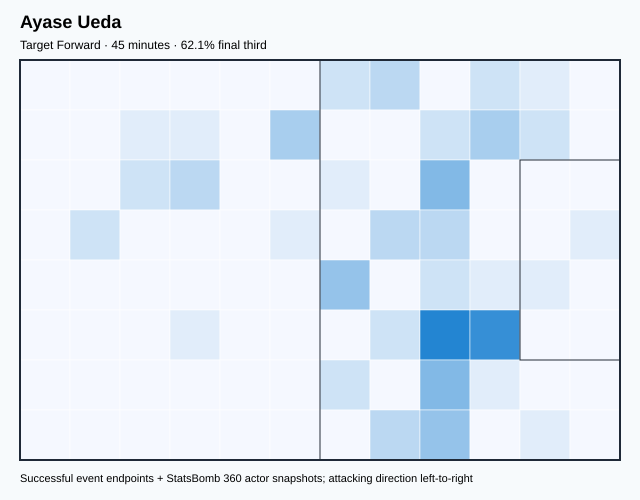

## Physical profile

| Metric | Score |
|---|---:|
| Aerial dominance | 1.000 |
| Pressing intensity per 90 | 32.00 |
| Recovery index per 90 | 4.00 |

## Top chemistry partners

- Yuto Nagatomo — synergy 0.145, 45 shared minutes
- Shūichi Gonda — synergy 0.139, 45 shared minutes
- Ko Itakura — synergy 0.139, 45 shared minutes

## Tactical recommendations

- Lead the first pressing trigger and protect the inside passing lane.
- Target this player on direct restarts and back-post deliveries.
- Use recovery capacity to support higher attacking positions.

_The heatmap combines successful event endpoints with StatsBomb 360 actor
snapshots. StatsBomb 360 is freeze-frame context, not continuous player
tracking. Ratings include eligible outfield players from 45 minutes and
goalkeepers from 90 minutes; ranking status communicates sample reliability._

---

<!-- PLAYER_REPORT 22: 95272_starter_report.md -->

# Hiroki Ito — Starter Report

- Team: Japan (JPN)
- Position: Left Center Back
- Functional role: Ball-Playing Centre-Back
- VAEP offense per 90: 0.0895
- VAEP defense per 90: 0.0007
- VAEP total per 90: 0.0902
- VAEP per touch: 0.00032
- Spatial xT per 90: 0.0507
- Final-third spatial share: 22.9%
- Unified final player rating: -0.0025
- Team rank: #19

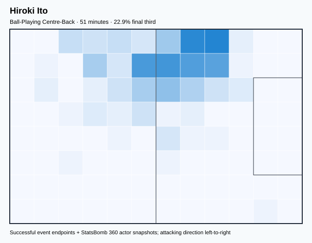

## Physical profile

| Metric | Score |
|---|---:|
| Aerial dominance | 1.000 |
| Pressing intensity per 90 | 3.51 |
| Recovery index per 90 | 1.75 |

## Top chemistry partners

- Maya Yoshida — synergy 0.171, 51 shared minutes
- Wataru Endo — synergy 0.169, 51 shared minutes
- Hidemasa Morita — synergy 0.169, 51 shared minutes

## Tactical recommendations

- Use a compact pressing trigger rather than sustained solo pressure.
- Target this player on direct restarts and back-post deliveries.
- Pair with a faster recovery defender after aggressive rotations.

_The heatmap combines successful event endpoints with StatsBomb 360 actor
snapshots. StatsBomb 360 is freeze-frame context, not continuous player
tracking. Ratings include eligible outfield players from 45 minutes and
goalkeepers from 90 minutes; ranking status communicates sample reliability._
