# KOR — V4 Player Evaluation Collection

<!-- V5_CANONICAL_NOTICE -->
> **Historical V4 player-rating packet.** Player ratings, ranks, role-challenger decisions, and rating uncertainty below are superseded by `results/reports/player_rankings.csv`, `results/reports/player_profiles/`, and `results/reports/model_summary.md`. Possession, tactical, and match-bootstrap material remains a historical V4 result.

- Included eligible players: 19
- Rankings use the role-aware, development-gated VAEP/xT/xD model.
- Heatmaps combine successful on-ball endpoints and SB360 actor snapshots.

---

<!-- PLAYER_REPORT 1: 3083_starter_report.md -->

# Heung-Min Son — Starter Report

- Team: South Korea (KOR)
- Position: Left Wing
- Functional role: Target Forward
- VAEP offense per 90: 0.3616
- VAEP defense per 90: 0.0059
- VAEP total per 90: 0.3676
- VAEP per touch: 0.00362
- Spatial xT per 90: 0.0781
- Final-third spatial share: 57.5%
- Unified final player rating: 0.1877
- Team rank: #3

## Physical profile

| Metric | Score |
|---|---:|
| Aerial dominance | 0.167 |
| Pressing intensity per 90 | 8.78 |
| Recovery index per 90 | 3.23 |

## Top chemistry partners

- Moon-Hwan Kim — synergy 0.709, 390 shared minutes
- Young-Gwon Kim — synergy 0.642, 373 shared minutes
- Woo-Young Jung — synergy 0.634, 318 shared minutes

## Tactical recommendations

- Use a compact pressing trigger rather than sustained solo pressure.
- Avoid isolating this player in high-volume aerial matchups.
- Use recovery capacity to support higher attacking positions.

_The heatmap combines successful event endpoints with StatsBomb 360 actor
snapshots. StatsBomb 360 is freeze-frame context, not continuous player
tracking. Ratings include eligible outfield players from 45 minutes and
goalkeepers from 90 minutes; ranking status communicates sample reliability._

---

<!-- PLAYER_REPORT 2: 3135_starter_report.md -->

# Chang-Hoon Kwon — Starter Report

- Team: South Korea (KOR)
- Position: Right Wing
- Functional role: Ball-Winner
- VAEP offense per 90: 0.5291
- VAEP defense per 90: -0.0143
- VAEP total per 90: 0.5148
- VAEP per touch: 0.00447
- Spatial xT per 90: 0.0586
- Final-third spatial share: 52.9%
- Unified final player rating: 0.1870
- Team rank: #4

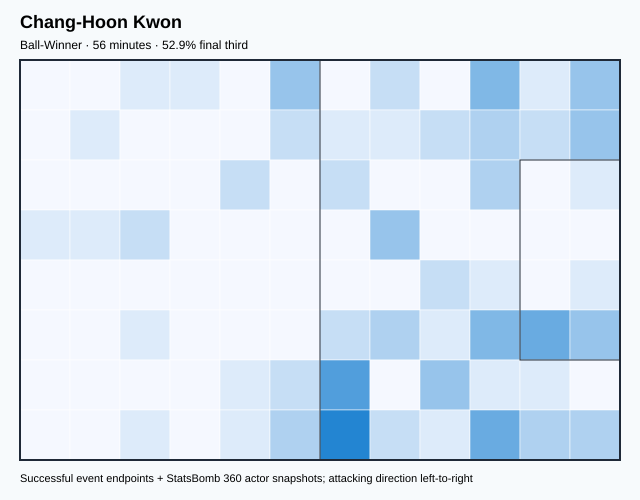

## Physical profile

| Metric | Score |
|---|---:|
| Aerial dominance | 0.000 |
| Pressing intensity per 90 | 17.58 |
| Recovery index per 90 | 3.20 |

## Top chemistry partners

- Young-Gwon Kim — synergy 0.177, 56 shared minutes
- Woo-Young Jung — synergy 0.176, 56 shared minutes
- Seung-Gyu Kim — synergy 0.166, 56 shared minutes

## Tactical recommendations

- Lead the first pressing trigger and protect the inside passing lane.
- Avoid isolating this player in high-volume aerial matchups.
- Use recovery capacity to support higher attacking positions.

_The heatmap combines successful event endpoints with StatsBomb 360 actor
snapshots. StatsBomb 360 is freeze-frame context, not continuous player
tracking. Ratings include eligible outfield players from 45 minutes and
goalkeepers from 90 minutes; ranking status communicates sample reliability._

---

<!-- PLAYER_REPORT 3: 5604_starter_report.md -->

# Young-Gwon Kim — Starter Report

- Team: South Korea (KOR)
- Position: Left Center Back
- Functional role: Sweeper CB
- VAEP offense per 90: 0.0382
- VAEP defense per 90: -0.0086
- VAEP total per 90: 0.0295
- VAEP per touch: 0.00022
- Spatial xT per 90: 0.0231
- Final-third spatial share: 5.3%
- Unified final player rating: 0.0038
- Team rank: #16

## Physical profile

| Metric | Score |
|---|---:|
| Aerial dominance | 0.778 |
| Pressing intensity per 90 | 5.06 |
| Recovery index per 90 | 1.93 |

## Top chemistry partners

- Seung-Gyu Kim — synergy 0.730, 373 shared minutes
- Jin-Su Kim — synergy 0.676, 324 shared minutes
- Woo-Young Jung — synergy 0.656, 301 shared minutes

## Tactical recommendations

- Use a compact pressing trigger rather than sustained solo pressure.
- Target this player on direct restarts and back-post deliveries.
- Pair with a faster recovery defender after aggressive rotations.

_The heatmap combines successful event endpoints with StatsBomb 360 actor
snapshots. StatsBomb 360 is freeze-frame context, not continuous player
tracking. Ratings include eligible outfield players from 45 minutes and
goalkeepers from 90 minutes; ranking status communicates sample reliability._

---

<!-- PLAYER_REPORT 4: 5618_starter_report.md -->

# Woo-Young Jung — Starter Report

- Team: South Korea (KOR)
- Position: Left Defensive Midfield
- Functional role: Holding Anchor
- VAEP offense per 90: 0.0231
- VAEP defense per 90: -0.0300
- VAEP total per 90: -0.0069
- VAEP per touch: -0.00005
- Spatial xT per 90: 0.0498
- Final-third spatial share: 18.3%
- Unified final player rating: 0.0154
- Team rank: #15

## Physical profile

| Metric | Score |
|---|---:|
| Aerial dominance | 0.818 |
| Pressing intensity per 90 | 15.00 |
| Recovery index per 90 | 4.25 |

## Top chemistry partners

- In-Beom Hwang — synergy 0.675, 318 shared minutes
- Seung-Gyu Kim — synergy 0.674, 318 shared minutes
- Moon-Hwan Kim — synergy 0.672, 318 shared minutes

## Tactical recommendations

- Lead the first pressing trigger and protect the inside passing lane.
- Target this player on direct restarts and back-post deliveries.
- Use recovery capacity to support higher attacking positions.

_The heatmap combines successful event endpoints with StatsBomb 360 actor
snapshots. StatsBomb 360 is freeze-frame context, not continuous player
tracking. Ratings include eligible outfield players from 45 minutes and
goalkeepers from 90 minutes; ranking status communicates sample reliability._

---

<!-- PLAYER_REPORT 5: 5620_starter_report.md -->

# Hee-Chan Hwang — Starter Report

- Team: South Korea (KOR)
- Position: Right Midfield
- Functional role: Progressive Winger
- VAEP offense per 90: 0.5508
- VAEP defense per 90: -0.0245
- VAEP total per 90: 0.5263
- VAEP per touch: 0.00317
- Spatial xT per 90: 0.0926
- Final-third spatial share: 56.4%
- Unified final player rating: 0.1461
- Team rank: #7

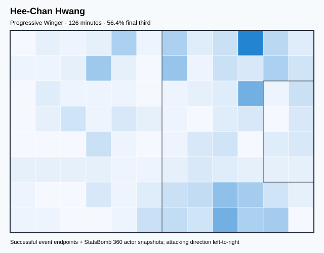

## Physical profile

| Metric | Score |
|---|---:|
| Aerial dominance | 0.000 |
| Pressing intensity per 90 | 22.94 |
| Recovery index per 90 | 7.17 |

## Top chemistry partners

- Moon-Hwan Kim — synergy 0.339, 126 shared minutes
- Heung-Min Son — synergy 0.289, 126 shared minutes
- Seung-Gyu Kim — synergy 0.288, 126 shared minutes

## Tactical recommendations

- Lead the first pressing trigger and protect the inside passing lane.
- Avoid isolating this player in high-volume aerial matchups.
- Use recovery capacity to support higher attacking positions.

_The heatmap combines successful event endpoints with StatsBomb 360 actor
snapshots. StatsBomb 360 is freeze-frame context, not continuous player
tracking. Ratings include eligible outfield players from 45 minutes and
goalkeepers from 90 minutes; ranking status communicates sample reliability._

---

<!-- PLAYER_REPORT 6: 5623_starter_report.md -->

# Jae-Sung Lee — Starter Report

- Team: South Korea (KOR)
- Position: Center Attacking Midfield
- Functional role: Ball-Winner
- VAEP offense per 90: 0.1328
- VAEP defense per 90: -0.0119
- VAEP total per 90: 0.1209
- VAEP per touch: 0.00105
- Spatial xT per 90: -0.0013
- Final-third spatial share: 33.3%
- Unified final player rating: 0.1394
- Team rank: #8

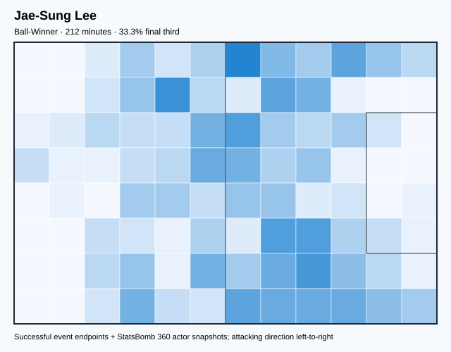

## Physical profile

| Metric | Score |
|---|---:|
| Aerial dominance | 0.375 |
| Pressing intensity per 90 | 29.23 |
| Recovery index per 90 | 2.96 |

## Top chemistry partners

- Moon-Hwan Kim — synergy 0.534, 212 shared minutes
- Young-Gwon Kim — synergy 0.486, 212 shared minutes
- Woo-Young Jung — synergy 0.484, 184 shared minutes

## Tactical recommendations

- Lead the first pressing trigger and protect the inside passing lane.
- Use recovery capacity to support higher attacking positions.

_The heatmap combines successful event endpoints with StatsBomb 360 actor
snapshots. StatsBomb 360 is freeze-frame context, not continuous player
tracking. Ratings include eligible outfield players from 45 minutes and
goalkeepers from 90 minutes; ranking status communicates sample reliability._

---

<!-- PLAYER_REPORT 7: 5986_starter_report.md -->

# Chul Hong — Starter Report

- Team: South Korea (KOR)
- Position: Left Back
- Functional role: Attacking Wingback
- VAEP offense per 90: 0.1047
- VAEP defense per 90: -0.0154
- VAEP total per 90: 0.0892
- VAEP per touch: 0.00087
- Spatial xT per 90: 0.0636
- Final-third spatial share: 40.0%
- Unified final player rating: 0.0541
- Team rank: #12

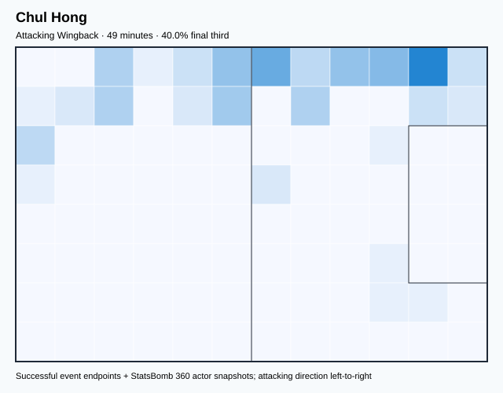

## Physical profile

| Metric | Score |
|---|---:|
| Aerial dominance | 1.000 |
| Pressing intensity per 90 | 14.70 |
| Recovery index per 90 | 5.51 |

## Top chemistry partners

- Young-Gwon Kim — synergy 0.158, 49 shared minutes
- Jun-Ho Son — synergy 0.154, 49 shared minutes
- Moon-Hwan Kim — synergy 0.150, 49 shared minutes

## Tactical recommendations

- Lead the first pressing trigger and protect the inside passing lane.
- Target this player on direct restarts and back-post deliveries.
- Use recovery capacity to support higher attacking positions.

_The heatmap combines successful event endpoints with StatsBomb 360 actor
snapshots. StatsBomb 360 is freeze-frame context, not continuous player
tracking. Ratings include eligible outfield players from 45 minutes and
goalkeepers from 90 minutes; ranking status communicates sample reliability._

---

<!-- PLAYER_REPORT 8: 22067_starter_report.md -->

# Woo-Yeong Jeong — Starter Report

- Team: South Korea (KOR)
- Position: Center Attacking Midfield
- Functional role: Ball-Winner
- VAEP offense per 90: 0.3839
- VAEP defense per 90: 0.0314
- VAEP total per 90: 0.4152
- VAEP per touch: 0.00399
- Spatial xT per 90: 0.0279
- Final-third spatial share: 64.0%
- Unified final player rating: 0.1800
- Team rank: #5

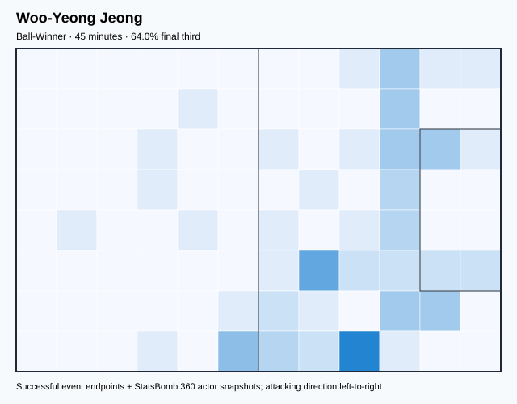

## Physical profile

| Metric | Score |
|---|---:|
| Aerial dominance | 0.000 |
| Pressing intensity per 90 | 28.00 |
| Recovery index per 90 | 4.00 |

## Top chemistry partners

- Jin-Su Kim — synergy 0.145, 45 shared minutes
- Chang-Hoon Kwon — synergy 0.141, 45 shared minutes
- Woo-Young Jung — synergy 0.141, 45 shared minutes

## Tactical recommendations

- Lead the first pressing trigger and protect the inside passing lane.
- Avoid isolating this player in high-volume aerial matchups.
- Use recovery capacity to support higher attacking positions.

_The heatmap combines successful event endpoints with StatsBomb 360 actor
snapshots. StatsBomb 360 is freeze-frame context, not continuous player
tracking. Ratings include eligible outfield players from 45 minutes and
goalkeepers from 90 minutes; ranking status communicates sample reliability._

---

<!-- PLAYER_REPORT 9: 22740_starter_report.md -->

# Kang-In Lee — Starter Report

- Team: South Korea (KOR)
- Position: Left Center Midfield
- Functional role: Deep Playmaker / Metronome
- VAEP offense per 90: 0.1432
- VAEP defense per 90: 0.0071
- VAEP total per 90: 0.1503
- VAEP per touch: 0.00130
- Spatial xT per 90: 0.1088
- Final-third spatial share: 45.6%
- Unified final player rating: 0.1050
- Team rank: #9

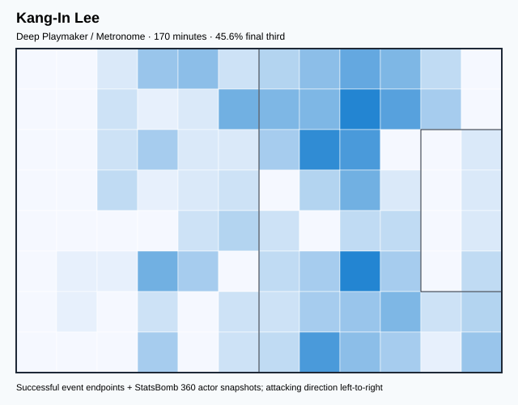

## Physical profile

| Metric | Score |
|---|---:|
| Aerial dominance | 1.000 |
| Pressing intensity per 90 | 18.52 |
| Recovery index per 90 | 4.76 |

## Top chemistry partners

- Young-Gwon Kim — synergy 0.439, 169 shared minutes
- Moon-Hwan Kim — synergy 0.434, 170 shared minutes
- Heung-Min Son — synergy 0.426, 170 shared minutes

## Tactical recommendations

- Lead the first pressing trigger and protect the inside passing lane.
- Target this player on direct restarts and back-post deliveries.
- Use recovery capacity to support higher attacking positions.

_The heatmap combines successful event endpoints with StatsBomb 360 actor
snapshots. StatsBomb 360 is freeze-frame context, not continuous player
tracking. Ratings include eligible outfield players from 45 minutes and
goalkeepers from 90 minutes; ranking status communicates sample reliability._

---

<!-- PLAYER_REPORT 10: 23763_starter_report.md -->

# In-Beom Hwang — Starter Report

- Team: South Korea (KOR)
- Position: Left Defensive Midfield
- Functional role: Holding Anchor
- VAEP offense per 90: 0.1234
- VAEP defense per 90: -0.0074
- VAEP total per 90: 0.1160
- VAEP per touch: 0.00067
- Spatial xT per 90: 0.0614
- Final-third spatial share: 35.7%
- Unified final player rating: 0.0434
- Team rank: #13

## Physical profile

| Metric | Score |
|---|---:|
| Aerial dominance | 0.444 |
| Pressing intensity per 90 | 13.50 |
| Recovery index per 90 | 6.50 |

## Top chemistry partners

- Moon-Hwan Kim — synergy 0.676, 360 shared minutes
- Woo-Young Jung — synergy 0.675, 318 shared minutes
- Jin-Su Kim — synergy 0.662, 341 shared minutes

## Tactical recommendations

- Lead the first pressing trigger and protect the inside passing lane.
- Use recovery capacity to support higher attacking positions.

_The heatmap combines successful event endpoints with StatsBomb 360 actor
snapshots. StatsBomb 360 is freeze-frame context, not continuous player
tracking. Ratings include eligible outfield players from 45 minutes and
goalkeepers from 90 minutes; ranking status communicates sample reliability._

---

<!-- PLAYER_REPORT 11: 29966_starter_report.md -->

# Ui-Jo Hwang — Starter Report

- Team: South Korea (KOR)
- Position: Center Forward
- Functional role: Ball-Winner
- VAEP offense per 90: 0.2333
- VAEP defense per 90: 0.0117
- VAEP total per 90: 0.2449
- VAEP per touch: 0.00465
- Spatial xT per 90: -0.0073
- Final-third spatial share: 34.4%
- Unified final player rating: 0.2136
- Team rank: #2

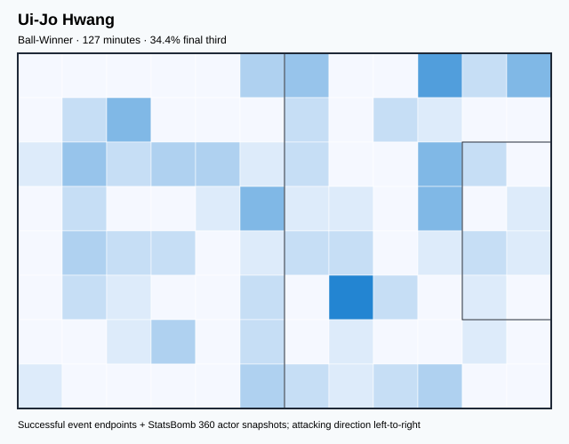

## Physical profile

| Metric | Score |
|---|---:|
| Aerial dominance | 0.111 |
| Pressing intensity per 90 | 12.80 |
| Recovery index per 90 | 1.42 |

## Top chemistry partners

- Heung-Min Son — synergy 0.267, 127 shared minutes
- Woo-Young Jung — synergy 0.261, 89 shared minutes
- Min Jae Kim — synergy 0.231, 102 shared minutes

## Tactical recommendations

- Lead the first pressing trigger and protect the inside passing lane.
- Avoid isolating this player in high-volume aerial matchups.
- Pair with a faster recovery defender after aggressive rotations.

_The heatmap combines successful event endpoints with StatsBomb 360 actor
snapshots. StatsBomb 360 is freeze-frame context, not continuous player
tracking. Ratings include eligible outfield players from 45 minutes and
goalkeepers from 90 minutes; ranking status communicates sample reliability._

---

<!-- PLAYER_REPORT 12: 37641_starter_report.md -->

# Seung-Gyu Kim — Starter Report

- Team: South Korea (KOR)
- Position: Goalkeeper
- Functional role: Goalkeeper
- VAEP offense per 90: -0.0077
- VAEP defense per 90: -0.1801
- VAEP total per 90: -0.1878
- VAEP per touch: -0.00315
- Spatial xT per 90: 0.0035
- Final-third spatial share: 1.2%
- Unified final player rating: -0.0765
- Team rank: #19

## Physical profile

| Metric | Score |
|---|---:|
| Aerial dominance | 0.000 |
| Pressing intensity per 90 | 0.00 |
| Recovery index per 90 | 3.46 |

## Top chemistry partners

- Young-Gwon Kim — synergy 0.730, 373 shared minutes
- Moon-Hwan Kim — synergy 0.700, 390 shared minutes
- Woo-Young Jung — synergy 0.674, 318 shared minutes

## Tactical recommendations

- Use a compact pressing trigger rather than sustained solo pressure.
- Avoid isolating this player in high-volume aerial matchups.
- Use recovery capacity to support higher attacking positions.

_The heatmap combines successful event endpoints with StatsBomb 360 actor
snapshots. StatsBomb 360 is freeze-frame context, not continuous player
tracking. Ratings include eligible outfield players from 45 minutes and
goalkeepers from 90 minutes; ranking status communicates sample reliability._

---

<!-- PLAYER_REPORT 13: 40538_starter_report.md -->

# Jin-Su Kim — Starter Report

- Team: South Korea (KOR)
- Position: Left Back
- Functional role: Attacking Wingback
- VAEP offense per 90: 0.2657
- VAEP defense per 90: -0.0107
- VAEP total per 90: 0.2550
- VAEP per touch: 0.00278
- Spatial xT per 90: 0.0414
- Final-third spatial share: 42.5%
- Unified final player rating: 0.0894
- Team rank: #10

## Physical profile

| Metric | Score |
|---|---:|
| Aerial dominance | 0.556 |
| Pressing intensity per 90 | 7.66 |
| Recovery index per 90 | 3.17 |

## Top chemistry partners

- Young-Gwon Kim — synergy 0.676, 324 shared minutes
- Moon-Hwan Kim — synergy 0.671, 341 shared minutes
- In-Beom Hwang — synergy 0.662, 341 shared minutes

## Tactical recommendations

- Use a compact pressing trigger rather than sustained solo pressure.
- Use recovery capacity to support higher attacking positions.

_The heatmap combines successful event endpoints with StatsBomb 360 actor
snapshots. StatsBomb 360 is freeze-frame context, not continuous player
tracking. Ratings include eligible outfield players from 45 minutes and
goalkeepers from 90 minutes; ranking status communicates sample reliability._

---

<!-- PLAYER_REPORT 14: 40542_starter_report.md -->

# Gue-Sung Cho — Starter Report

- Team: South Korea (KOR)
- Position: Center Forward
- Functional role: Target Forward / Penalty-Box Anchor
- VAEP offense per 90: 0.3876
- VAEP defense per 90: 0.0657
- VAEP total per 90: 0.4532
- VAEP per touch: 0.00587
- Spatial xT per 90: -0.0085
- Final-third spatial share: 46.2%
- Unified final player rating: 0.2342
- Team rank: #1

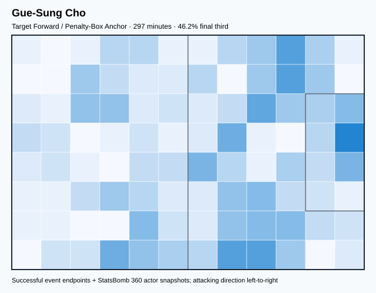

## Physical profile

| Metric | Score |
|---|---:|
| Aerial dominance | 0.556 |
| Pressing intensity per 90 | 17.85 |
| Recovery index per 90 | 1.82 |

## Top chemistry partners

- Jin-Su Kim — synergy 0.487, 263 shared minutes
- In-Beom Hwang — synergy 0.478, 282 shared minutes
- Young-Gwon Kim — synergy 0.466, 285 shared minutes

## Tactical recommendations

- Lead the first pressing trigger and protect the inside passing lane.
- Pair with a faster recovery defender after aggressive rotations.

_The heatmap combines successful event endpoints with StatsBomb 360 actor
snapshots. StatsBomb 360 is freeze-frame context, not continuous player
tracking. Ratings include eligible outfield players from 45 minutes and
goalkeepers from 90 minutes; ranking status communicates sample reliability._

---

<!-- PLAYER_REPORT 15: 40558_starter_report.md -->

# Jun-Ho Son — Starter Report

- Team: South Korea (KOR)
- Position: Center Defensive Midfield
- Functional role: Holding Anchor
- VAEP offense per 90: 0.0065
- VAEP defense per 90: -0.0410
- VAEP total per 90: -0.0345
- VAEP per touch: -0.00023
- Spatial xT per 90: 0.0632
- Final-third spatial share: 9.6%
- Unified final player rating: 0.0173
- Team rank: #14

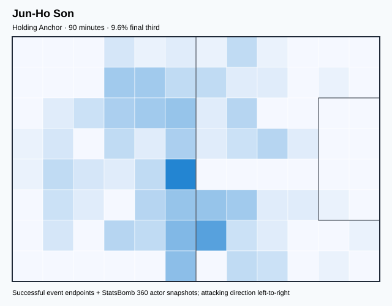

## Physical profile

| Metric | Score |
|---|---:|
| Aerial dominance | 0.000 |
| Pressing intensity per 90 | 21.10 |
| Recovery index per 90 | 3.01 |

## Top chemistry partners

- Moon-Hwan Kim — synergy 0.272, 90 shared minutes
- Seung-Gyu Kim — synergy 0.259, 90 shared minutes
- Heung-Min Son — synergy 0.245, 90 shared minutes

## Tactical recommendations

- Lead the first pressing trigger and protect the inside passing lane.
- Avoid isolating this player in high-volume aerial matchups.
- Use recovery capacity to support higher attacking positions.

_The heatmap combines successful event endpoints with StatsBomb 360 actor
snapshots. StatsBomb 360 is freeze-frame context, not continuous player
tracking. Ratings include eligible outfield players from 45 minutes and
goalkeepers from 90 minutes; ranking status communicates sample reliability._

---

<!-- PLAYER_REPORT 16: 40564_starter_report.md -->

# Kyung-Won Kwon — Starter Report

- Team: South Korea (KOR)
- Position: Right Center Back
- Functional role: Sweeper CB
- VAEP offense per 90: 0.0046
- VAEP defense per 90: -0.0420
- VAEP total per 90: -0.0374
- VAEP per touch: -0.00041
- Spatial xT per 90: 0.0019
- Final-third spatial share: 3.3%
- Unified final player rating: -0.0109
- Team rank: #18

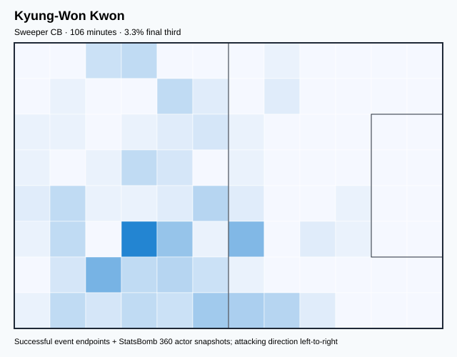

## Physical profile

| Metric | Score |
|---|---:|
| Aerial dominance | 0.667 |
| Pressing intensity per 90 | 4.24 |
| Recovery index per 90 | 2.54 |

## Top chemistry partners

- In-Beom Hwang — synergy 0.318, 106 shared minutes
- Moon-Hwan Kim — synergy 0.315, 106 shared minutes
- Seung-Gyu Kim — synergy 0.314, 106 shared minutes

## Tactical recommendations

- Use a compact pressing trigger rather than sustained solo pressure.
- Target this player on direct restarts and back-post deliveries.
- Use recovery capacity to support higher attacking positions.

_The heatmap combines successful event endpoints with StatsBomb 360 actor
snapshots. StatsBomb 360 is freeze-frame context, not continuous player
tracking. Ratings include eligible outfield players from 45 minutes and
goalkeepers from 90 minutes; ranking status communicates sample reliability._

---

<!-- PLAYER_REPORT 17: 40672_starter_report.md -->

# Moon-Hwan Kim — Starter Report

- Team: South Korea (KOR)
- Position: Right Back
- Functional role: Attacking Wingback
- VAEP offense per 90: 0.1734
- VAEP defense per 90: -0.0392
- VAEP total per 90: 0.1342
- VAEP per touch: 0.00097
- Spatial xT per 90: 0.0459
- Final-third spatial share: 39.5%
- Unified final player rating: 0.0643
- Team rank: #11

## Physical profile

| Metric | Score |
|---|---:|
| Aerial dominance | 0.727 |
| Pressing intensity per 90 | 11.32 |
| Recovery index per 90 | 3.70 |

## Top chemistry partners

- Heung-Min Son — synergy 0.709, 390 shared minutes
- Seung-Gyu Kim — synergy 0.700, 390 shared minutes
- In-Beom Hwang — synergy 0.676, 360 shared minutes

## Tactical recommendations

- Lead the first pressing trigger and protect the inside passing lane.
- Target this player on direct restarts and back-post deliveries.
- Use recovery capacity to support higher attacking positions.

_The heatmap combines successful event endpoints with StatsBomb 360 actor
snapshots. StatsBomb 360 is freeze-frame context, not continuous player
tracking. Ratings include eligible outfield players from 45 minutes and
goalkeepers from 90 minutes; ranking status communicates sample reliability._

---

<!-- PLAYER_REPORT 18: 41711_starter_report.md -->

# Sang-Ho Na — Starter Report

- Team: South Korea (KOR)
- Position: Right Wing
- Functional role: Progressive Winger
- VAEP offense per 90: 0.2479
- VAEP defense per 90: 0.0134
- VAEP total per 90: 0.2613
- VAEP per touch: 0.00258
- Spatial xT per 90: 0.0175
- Final-third spatial share: 62.4%
- Unified final player rating: 0.1673
- Team rank: #6

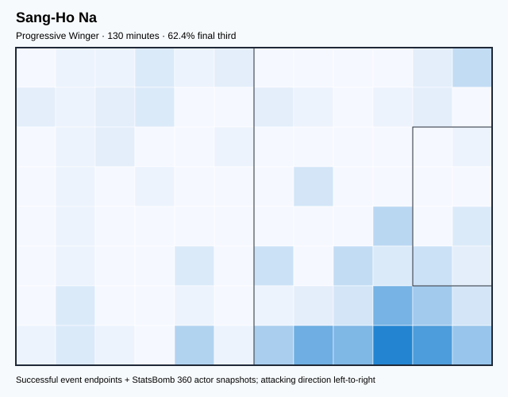

## Physical profile

| Metric | Score |
|---|---:|
| Aerial dominance | 0.625 |
| Pressing intensity per 90 | 17.31 |
| Recovery index per 90 | 5.54 |

## Top chemistry partners

- Jin-Su Kim — synergy 0.350, 130 shared minutes
- Seung-Gyu Kim — synergy 0.338, 130 shared minutes
- Heung-Min Son — synergy 0.324, 130 shared minutes

## Tactical recommendations

- Lead the first pressing trigger and protect the inside passing lane.
- Target this player on direct restarts and back-post deliveries.
- Use recovery capacity to support higher attacking positions.

_The heatmap combines successful event endpoints with StatsBomb 360 actor
snapshots. StatsBomb 360 is freeze-frame context, not continuous player
tracking. Ratings include eligible outfield players from 45 minutes and
goalkeepers from 90 minutes; ranking status communicates sample reliability._

---

<!-- PLAYER_REPORT 19: 43565_starter_report.md -->

# Min Jae Kim — Starter Report

- Team: South Korea (KOR)
- Position: Right Center Back
- Functional role: Sweeper CB
- VAEP offense per 90: 0.1160
- VAEP defense per 90: -0.1335
- VAEP total per 90: -0.0175
- VAEP per touch: -0.00011
- Spatial xT per 90: 0.0273
- Final-third spatial share: 11.9%
- Unified final player rating: -0.0069
- Team rank: #17

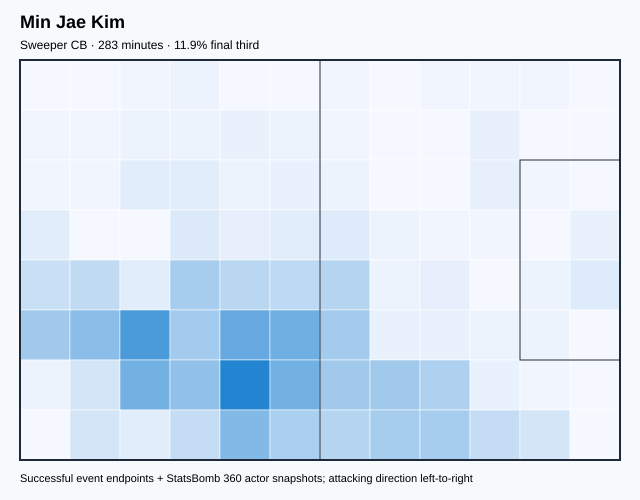

## Physical profile

| Metric | Score |
|---|---:|
| Aerial dominance | 0.786 |
| Pressing intensity per 90 | 6.67 |
| Recovery index per 90 | 3.81 |

## Top chemistry partners

- Moon-Hwan Kim — synergy 0.645, 283 shared minutes
- Young-Gwon Kim — synergy 0.645, 283 shared minutes
- Seung-Gyu Kim — synergy 0.624, 283 shared minutes

## Tactical recommendations

- Use a compact pressing trigger rather than sustained solo pressure.
- Target this player on direct restarts and back-post deliveries.
- Use recovery capacity to support higher attacking positions.

_The heatmap combines successful event endpoints with StatsBomb 360 actor
snapshots. StatsBomb 360 is freeze-frame context, not continuous player
tracking. Ratings include eligible outfield players from 45 minutes and
goalkeepers from 90 minutes; ranking status communicates sample reliability._
