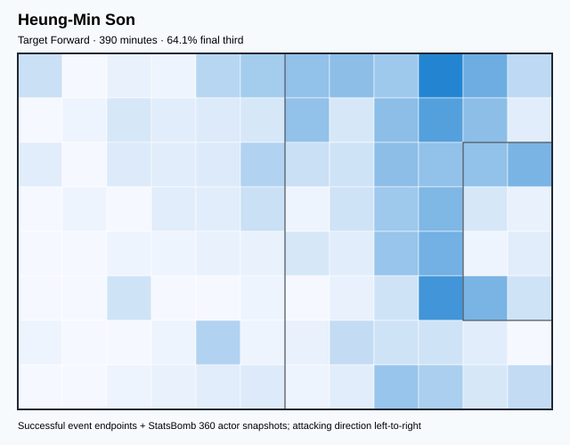
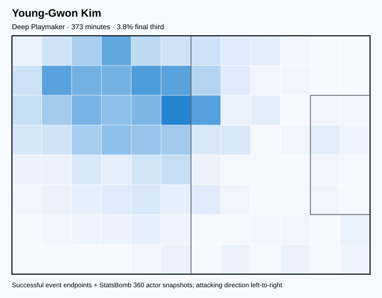
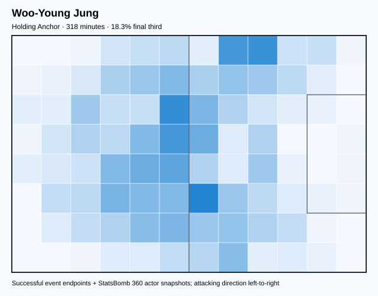
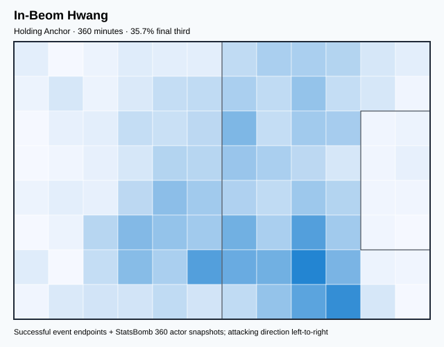
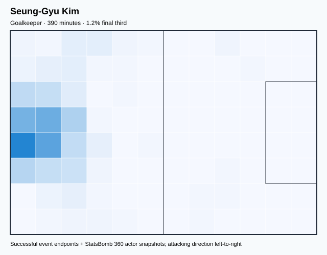
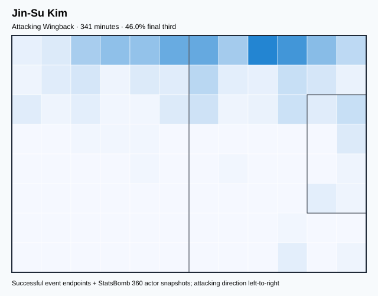
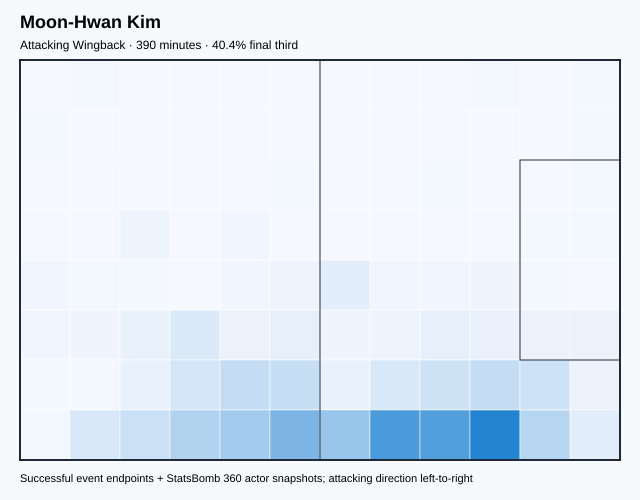

# KOR — V4 Player Evaluation Collection

- Included 300+ minute players: 7
- Rankings are role-relative; cross-role score comparisons are invalid.
- Heatmaps combine successful on-ball endpoints and SB360 actor snapshots.

---

<!-- PLAYER_REPORT 1: 3083_starter_report.md -->

# Heung-Min Son — Starter Report

- Team: South Korea (KOR)
- Position: Left Wing
- Functional role: Target Forward
- Risk-adjusted OBV per 90: -0.3476
- OBV source: `open_event_value_fallback`
- Final-third spatial share: 64.1%
- Role-relative z-score: +0.539
- V4 evaluation score: 55.4

## Physical profile

| Metric | Score |
|---|---:|
| Aerial dominance | 0.167 |
| Pressing intensity per 90 | 8.78 |
| Recovery index per 90 | 3.23 |

## Top chemistry partners

- Moon-Hwan Kim — synergy 0.709, 390 shared minutes
- Young-Gwon Kim — synergy 0.642, 373 shared minutes
- Woo-Young Jung — synergy 0.634, 318 shared minutes

## Tactical recommendations

- Use a compact pressing trigger rather than sustained solo pressure.
- Avoid isolating this player in high-volume aerial matchups.
- Use recovery capacity to support higher attacking positions.

_The heatmap combines successful event endpoints with StatsBomb 360 actor
snapshots. StatsBomb 360 is freeze-frame context, not continuous player
tracking. Scores exclude players below 300 tournament minutes._

---

<!-- PLAYER_REPORT 2: 5604_starter_report.md -->

# Young-Gwon Kim — Starter Report

- Team: South Korea (KOR)
- Position: Left Center Back
- Functional role: Deep Playmaker
- Risk-adjusted OBV per 90: 0.4447
- OBV source: `open_event_value_fallback`
- Final-third spatial share: 3.8%
- Role-relative z-score: +2.554
- V4 evaluation score: 75.5

## Physical profile

| Metric | Score |
|---|---:|
| Aerial dominance | 0.778 |
| Pressing intensity per 90 | 5.06 |
| Recovery index per 90 | 1.93 |

## Top chemistry partners

- Seung-Gyu Kim — synergy 0.730, 373 shared minutes
- Jin-Su Kim — synergy 0.676, 324 shared minutes
- Woo-Young Jung — synergy 0.656, 301 shared minutes

## Tactical recommendations

- Use a compact pressing trigger rather than sustained solo pressure.
- Target this player on direct restarts and back-post deliveries.
- Pair with a faster recovery defender after aggressive rotations.

_The heatmap combines successful event endpoints with StatsBomb 360 actor
snapshots. StatsBomb 360 is freeze-frame context, not continuous player
tracking. Scores exclude players below 300 tournament minutes._

---

<!-- PLAYER_REPORT 3: 5618_starter_report.md -->

# Woo-Young Jung — Starter Report

- Team: South Korea (KOR)
- Position: Left Defensive Midfield
- Functional role: Ball-Winner
- Risk-adjusted OBV per 90: 0.2307
- OBV source: `open_event_value_fallback`
- Final-third spatial share: 17.3%
- Role-relative z-score: +1.671
- V4 evaluation score: 66.7

## Physical profile

| Metric | Score |
|---|---:|
| Aerial dominance | 0.818 |
| Pressing intensity per 90 | 15.00 |
| Recovery index per 90 | 4.25 |

## Top chemistry partners

- In-Beom Hwang — synergy 0.675, 318 shared minutes
- Seung-Gyu Kim — synergy 0.674, 318 shared minutes
- Moon-Hwan Kim — synergy 0.672, 318 shared minutes

## Tactical recommendations

- Lead the first pressing trigger and protect the inside passing lane.
- Target this player on direct restarts and back-post deliveries.
- Use recovery capacity to support higher attacking positions.

_The heatmap combines successful event endpoints with StatsBomb 360 actor
snapshots. StatsBomb 360 is freeze-frame context, not continuous player
tracking. Scores exclude players below 300 tournament minutes._

---

<!-- PLAYER_REPORT 4: 23763_starter_report.md -->

# In-Beom Hwang — Starter Report

- Team: South Korea (KOR)
- Position: Left Defensive Midfield
- Functional role: Ball-Winner
- Risk-adjusted OBV per 90: 0.1728
- OBV source: `open_event_value_fallback`
- Final-third spatial share: 34.6%
- Role-relative z-score: +0.528
- V4 evaluation score: 55.3

## Physical profile

| Metric | Score |
|---|---:|
| Aerial dominance | 0.444 |
| Pressing intensity per 90 | 13.50 |
| Recovery index per 90 | 6.50 |

## Top chemistry partners

- Moon-Hwan Kim — synergy 0.676, 360 shared minutes
- Woo-Young Jung — synergy 0.675, 318 shared minutes
- Jin-Su Kim — synergy 0.662, 341 shared minutes

## Tactical recommendations

- Lead the first pressing trigger and protect the inside passing lane.
- Use recovery capacity to support higher attacking positions.

_The heatmap combines successful event endpoints with StatsBomb 360 actor
snapshots. StatsBomb 360 is freeze-frame context, not continuous player
tracking. Scores exclude players below 300 tournament minutes._

---

<!-- PLAYER_REPORT 5: 37641_starter_report.md -->

# Seung-Gyu Kim — Starter Report

- Team: South Korea (KOR)
- Position: Goalkeeper
- Functional role: Goalkeeper
- Risk-adjusted OBV per 90: 0.3271
- OBV source: `open_event_value_fallback`
- Final-third spatial share: 1.2%
- Role-relative z-score: -0.028
- V4 evaluation score: 49.7

## Physical profile

| Metric | Score |
|---|---:|
| Aerial dominance | 0.000 |
| Pressing intensity per 90 | 0.00 |
| Recovery index per 90 | 3.46 |

## Top chemistry partners

- Young-Gwon Kim — synergy 0.730, 373 shared minutes
- Moon-Hwan Kim — synergy 0.700, 390 shared minutes
- Woo-Young Jung — synergy 0.674, 318 shared minutes

## Tactical recommendations

- Use a compact pressing trigger rather than sustained solo pressure.
- Avoid isolating this player in high-volume aerial matchups.
- Use recovery capacity to support higher attacking positions.

_The heatmap combines successful event endpoints with StatsBomb 360 actor
snapshots. StatsBomb 360 is freeze-frame context, not continuous player
tracking. Scores exclude players below 300 tournament minutes._

---

<!-- PLAYER_REPORT 6: 40538_starter_report.md -->

# Jin-Su Kim — Starter Report

- Team: South Korea (KOR)
- Position: Left Back
- Functional role: Attacking Wingback
- Risk-adjusted OBV per 90: 0.0005
- OBV source: `open_event_value_fallback`
- Final-third spatial share: 46.0%
- Role-relative z-score: +1.380
- V4 evaluation score: 63.8

## Physical profile

| Metric | Score |
|---|---:|
| Aerial dominance | 0.556 |
| Pressing intensity per 90 | 7.66 |
| Recovery index per 90 | 3.17 |

## Top chemistry partners

- Young-Gwon Kim — synergy 0.676, 324 shared minutes
- Moon-Hwan Kim — synergy 0.671, 341 shared minutes
- In-Beom Hwang — synergy 0.662, 341 shared minutes

## Tactical recommendations

- Use a compact pressing trigger rather than sustained solo pressure.
- Use recovery capacity to support higher attacking positions.

_The heatmap combines successful event endpoints with StatsBomb 360 actor
snapshots. StatsBomb 360 is freeze-frame context, not continuous player
tracking. Scores exclude players below 300 tournament minutes._

---

<!-- PLAYER_REPORT 7: 40672_starter_report.md -->

# Moon-Hwan Kim — Starter Report

- Team: South Korea (KOR)
- Position: Right Back
- Functional role: Attacking Wingback
- Risk-adjusted OBV per 90: -0.1179
- OBV source: `open_event_value_fallback`
- Final-third spatial share: 40.4%
- Role-relative z-score: +0.066
- V4 evaluation score: 50.7

## Physical profile

| Metric | Score |
|---|---:|
| Aerial dominance | 0.727 |
| Pressing intensity per 90 | 11.32 |
| Recovery index per 90 | 3.70 |

## Top chemistry partners

- Heung-Min Son — synergy 0.709, 390 shared minutes
- Seung-Gyu Kim — synergy 0.700, 390 shared minutes
- In-Beom Hwang — synergy 0.676, 360 shared minutes

## Tactical recommendations

- Lead the first pressing trigger and protect the inside passing lane.
- Target this player on direct restarts and back-post deliveries.
- Use recovery capacity to support higher attacking positions.

_The heatmap combines successful event endpoints with StatsBomb 360 actor
snapshots. StatsBomb 360 is freeze-frame context, not continuous player
tracking. Scores exclude players below 300 tournament minutes._
