# KSA — V4 Player Evaluation Collection

<!-- V5_CANONICAL_NOTICE -->
> **Historical V4 player-rating packet.** Player ratings, ranks, role-challenger decisions, and rating uncertainty below are superseded by `results/reports/player_rankings.csv`, `results/reports/player_profiles/`, and `results/reports/model_summary.md`. Possession, tactical, and match-bootstrap material remains a historical V4 result.

- Included eligible players: 20
- Rankings use the role-aware, development-gated VAEP/xT/xD model.
- Heatmaps combine successful on-ball endpoints and SB360 actor snapshots.

---

<!-- PLAYER_REPORT 1: 5178_starter_report.md -->

# Salman Mohammed Al Faraj — Starter Report

- Team: Saudi Arabia (KSA)
- Position: Right Center Midfield
- Functional role: Ball-Winner
- VAEP offense per 90: 0.0539
- VAEP defense per 90: 0.0024
- VAEP total per 90: 0.0563
- VAEP per touch: 0.00063
- Spatial xT per 90: 0.0004
- Final-third spatial share: 35.7%
- Unified final player rating: 0.1003
- Team rank: #7

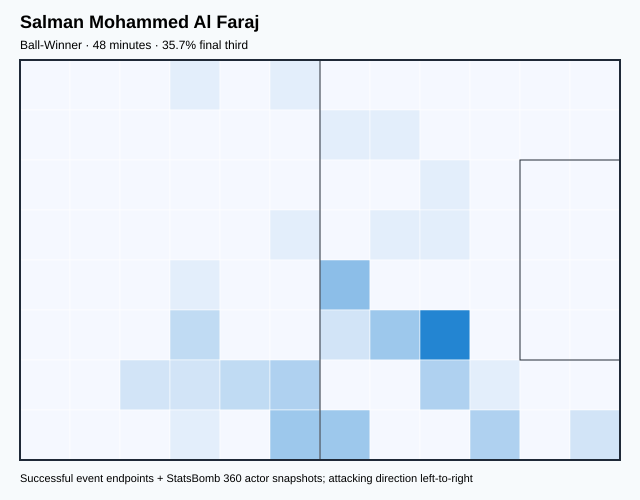

## Physical profile

| Metric | Score |
|---|---:|
| Aerial dominance | 0.000 |
| Pressing intensity per 90 | 11.33 |
| Recovery index per 90 | 5.67 |

## Top chemistry partners

- Mohammed Kanoo — synergy 0.152, 48 shared minutes
- Salem Mohammed Al Dawsari — synergy 0.143, 48 shared minutes
- Mohammed Khalil Al Owais — synergy 0.143, 48 shared minutes

## Tactical recommendations

- Lead the first pressing trigger and protect the inside passing lane.
- Avoid isolating this player in high-volume aerial matchups.
- Use recovery capacity to support higher attacking positions.

_The heatmap combines successful event endpoints with StatsBomb 360 actor
snapshots. StatsBomb 360 is freeze-frame context, not continuous player
tracking. Ratings include eligible outfield players from 45 minutes and
goalkeepers from 90 minutes; ranking status communicates sample reliability._

---

<!-- PLAYER_REPORT 2: 5183_starter_report.md -->

# Yasir Gharsan Al Shahrani — Starter Report

- Team: Saudi Arabia (KSA)
- Position: Left Back
- Functional role: Wide Creator
- VAEP offense per 90: 0.0122
- VAEP defense per 90: 0.0010
- VAEP total per 90: 0.0132
- VAEP per touch: 0.00025
- Spatial xT per 90: 0.0288
- Final-third spatial share: 17.6%
- Unified final player rating: 0.0463
- Team rank: #12

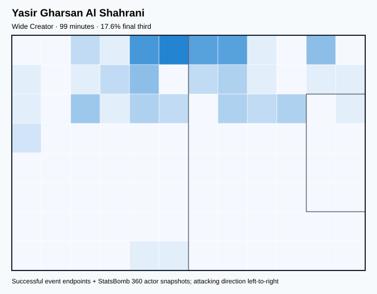

## Physical profile

| Metric | Score |
|---|---:|
| Aerial dominance | 0.000 |
| Pressing intensity per 90 | 22.82 |
| Recovery index per 90 | 0.91 |

## Top chemistry partners

- Abdulelah Saad Hameed Al-Malki — synergy 0.288, 99 shared minutes
- Mohammed Khalil Al Owais — synergy 0.281, 99 shared minutes
- Ali Albulayhi — synergy 0.276, 99 shared minutes

## Tactical recommendations

- Lead the first pressing trigger and protect the inside passing lane.
- Avoid isolating this player in high-volume aerial matchups.
- Pair with a faster recovery defender after aggressive rotations.

_The heatmap combines successful event endpoints with StatsBomb 360 actor
snapshots. StatsBomb 360 is freeze-frame context, not continuous player
tracking. Ratings include eligible outfield players from 45 minutes and
goalkeepers from 90 minutes; ranking status communicates sample reliability._

---

<!-- PLAYER_REPORT 3: 5187_starter_report.md -->

# Salem Mohammed Al Dawsari — Starter Report

- Team: Saudi Arabia (KSA)
- Position: Left Midfield
- Functional role: Progressive Winger
- VAEP offense per 90: 0.4041
- VAEP defense per 90: 0.0646
- VAEP total per 90: 0.4687
- VAEP per touch: 0.00397
- Spatial xT per 90: 0.0880
- Final-third spatial share: 46.7%
- Unified final player rating: 0.1658
- Team rank: #5

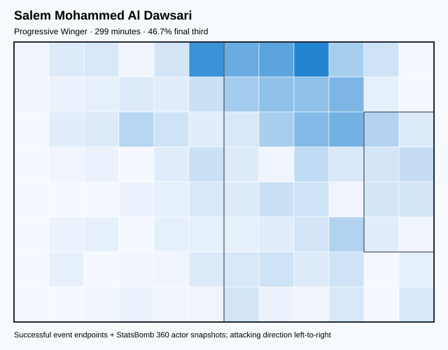

## Physical profile

| Metric | Score |
|---|---:|
| Aerial dominance | 0.500 |
| Pressing intensity per 90 | 12.96 |
| Recovery index per 90 | 4.52 |

## Top chemistry partners

- Saud Abdullah Abdul Hamid — synergy 0.582, 299 shared minutes
- Mohammed Kanoo — synergy 0.532, 299 shared minutes
- Ali Albulayhi — synergy 0.501, 237 shared minutes

## Tactical recommendations

- Lead the first pressing trigger and protect the inside passing lane.
- Use recovery capacity to support higher attacking positions.

_The heatmap combines successful event endpoints with StatsBomb 360 actor
snapshots. StatsBomb 360 is freeze-frame context, not continuous player
tracking. Ratings include eligible outfield players from 45 minutes and
goalkeepers from 90 minutes; ranking status communicates sample reliability._

---

<!-- PLAYER_REPORT 4: 5191_starter_report.md -->

# Mohammed Al Burayk — Starter Report

- Team: Saudi Arabia (KSA)
- Position: Left Back
- Functional role: Attacking Wingback
- VAEP offense per 90: 0.3111
- VAEP defense per 90: 0.2622
- VAEP total per 90: 0.5732
- VAEP per touch: 0.00346
- Spatial xT per 90: 0.0681
- Final-third spatial share: 33.2%
- Unified final player rating: 0.0870
- Team rank: #9

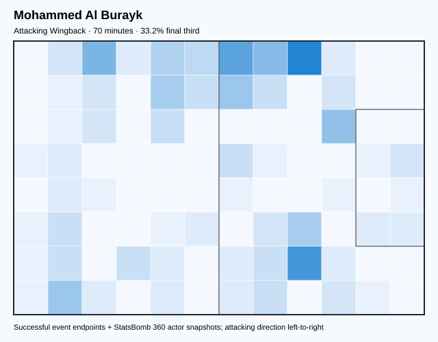

## Physical profile

| Metric | Score |
|---|---:|
| Aerial dominance | 0.167 |
| Pressing intensity per 90 | 11.57 |
| Recovery index per 90 | 6.43 |

## Top chemistry partners

- Ali Albulayhi — synergy 0.221, 70 shared minutes
- Mohammed Khalil Al Owais — synergy 0.212, 70 shared minutes
- Saud Abdullah Abdul Hamid — synergy 0.212, 70 shared minutes

## Tactical recommendations

- Lead the first pressing trigger and protect the inside passing lane.
- Avoid isolating this player in high-volume aerial matchups.
- Use recovery capacity to support higher attacking positions.

_The heatmap combines successful event endpoints with StatsBomb 360 actor
snapshots. StatsBomb 360 is freeze-frame context, not continuous player
tracking. Ratings include eligible outfield players from 45 minutes and
goalkeepers from 90 minutes; ranking status communicates sample reliability._

---

<!-- PLAYER_REPORT 5: 5713_starter_report.md -->

# Mohammed Kanoo — Starter Report

- Team: Saudi Arabia (KSA)
- Position: Left Center Midfield
- Functional role: Holding Anchor
- VAEP offense per 90: 0.1377
- VAEP defense per 90: -0.0402
- VAEP total per 90: 0.0975
- VAEP per touch: 0.00077
- Spatial xT per 90: 0.0449
- Final-third spatial share: 31.5%
- Unified final player rating: 0.0880
- Team rank: #8

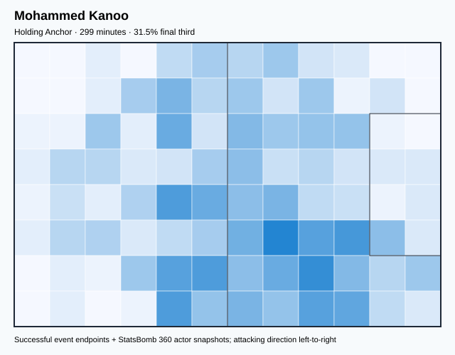

## Physical profile

| Metric | Score |
|---|---:|
| Aerial dominance | 0.562 |
| Pressing intensity per 90 | 11.46 |
| Recovery index per 90 | 4.82 |

## Top chemistry partners

- Saud Abdullah Abdul Hamid — synergy 0.569, 299 shared minutes
- Ali Albulayhi — synergy 0.563, 237 shared minutes
- Salem Mohammed Al Dawsari — synergy 0.532, 299 shared minutes

## Tactical recommendations

- Lead the first pressing trigger and protect the inside passing lane.
- Use recovery capacity to support higher attacking positions.

_The heatmap combines successful event endpoints with StatsBomb 360 actor
snapshots. StatsBomb 360 is freeze-frame context, not continuous player
tracking. Ratings include eligible outfield players from 45 minutes and
goalkeepers from 90 minutes; ranking status communicates sample reliability._

---

<!-- PLAYER_REPORT 6: 5714_starter_report.md -->

# Mohammed Khalil Al Owais — Starter Report

- Team: Saudi Arabia (KSA)
- Position: Goalkeeper
- Functional role: Goalkeeper
- VAEP offense per 90: -0.0143
- VAEP defense per 90: -0.1910
- VAEP total per 90: -0.2053
- VAEP per touch: -0.00445
- Spatial xT per 90: 0.0013
- Final-third spatial share: 2.4%
- Unified final player rating: -0.0782
- Team rank: #20

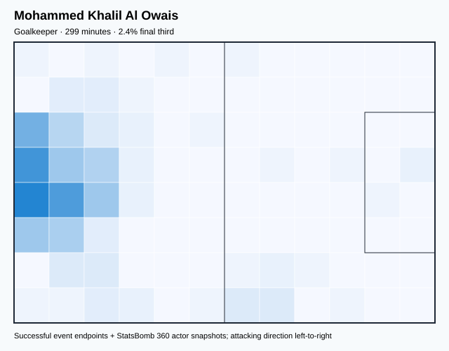

## Physical profile

| Metric | Score |
|---|---:|
| Aerial dominance | 0.000 |
| Pressing intensity per 90 | 0.30 |
| Recovery index per 90 | 4.52 |

## Top chemistry partners

- Saud Abdullah Abdul Hamid — synergy 0.594, 299 shared minutes
- Ali Albulayhi — synergy 0.549, 237 shared minutes
- Abdulelah Al Amri — synergy 0.523, 211 shared minutes

## Tactical recommendations

- Use a compact pressing trigger rather than sustained solo pressure.
- Avoid isolating this player in high-volume aerial matchups.
- Use recovery capacity to support higher attacking positions.

_The heatmap combines successful event endpoints with StatsBomb 360 actor
snapshots. StatsBomb 360 is freeze-frame context, not continuous player
tracking. Ratings include eligible outfield players from 45 minutes and
goalkeepers from 90 minutes; ranking status communicates sample reliability._

---

<!-- PLAYER_REPORT 7: 5715_starter_report.md -->

# Ali Albulayhi — Starter Report

- Team: Saudi Arabia (KSA)
- Position: Left Center Back
- Functional role: Sweeper CB
- VAEP offense per 90: -0.0206
- VAEP defense per 90: -0.0544
- VAEP total per 90: -0.0749
- VAEP per touch: -0.00092
- Spatial xT per 90: 0.0016
- Final-third spatial share: 1.9%
- Unified final player rating: -0.0189
- Team rank: #18

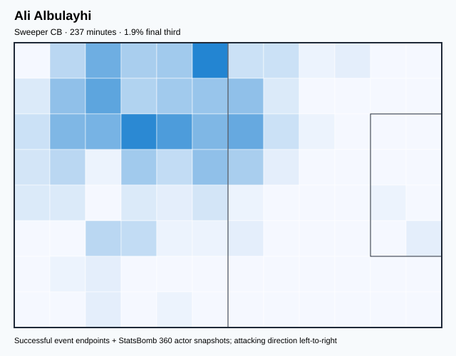

## Physical profile

| Metric | Score |
|---|---:|
| Aerial dominance | 0.500 |
| Pressing intensity per 90 | 7.22 |
| Recovery index per 90 | 2.66 |

## Top chemistry partners

- Mohammed Kanoo — synergy 0.563, 237 shared minutes
- Saud Abdullah Abdul Hamid — synergy 0.563, 237 shared minutes
- Mohammed Khalil Al Owais — synergy 0.549, 237 shared minutes

## Tactical recommendations

- Use a compact pressing trigger rather than sustained solo pressure.
- Use recovery capacity to support higher attacking positions.

_The heatmap combines successful event endpoints with StatsBomb 360 actor
snapshots. StatsBomb 360 is freeze-frame context, not continuous player
tracking. Ratings include eligible outfield players from 45 minutes and
goalkeepers from 90 minutes; ranking status communicates sample reliability._

---

<!-- PLAYER_REPORT 8: 51094_starter_report.md -->

# Abdulelah Al Amri — Starter Report

- Team: Saudi Arabia (KSA)
- Position: Right Center Back
- Functional role: Sweeper CB
- VAEP offense per 90: 0.0667
- VAEP defense per 90: -0.0585
- VAEP total per 90: 0.0082
- VAEP per touch: 0.00008
- Spatial xT per 90: 0.0227
- Final-third spatial share: 10.3%
- Unified final player rating: -0.0034
- Team rank: #16

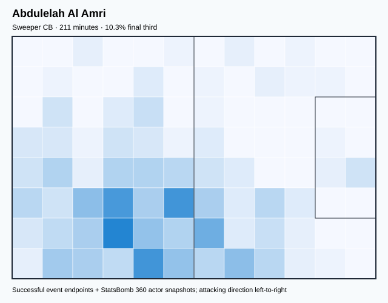

## Physical profile

| Metric | Score |
|---|---:|
| Aerial dominance | 0.706 |
| Pressing intensity per 90 | 8.54 |
| Recovery index per 90 | 5.98 |

## Top chemistry partners

- Mohammed Khalil Al Owais — synergy 0.523, 211 shared minutes
- Mohammed Kanoo — synergy 0.513, 211 shared minutes
- Saud Abdullah Abdul Hamid — synergy 0.464, 211 shared minutes

## Tactical recommendations

- Use a compact pressing trigger rather than sustained solo pressure.
- Target this player on direct restarts and back-post deliveries.
- Use recovery capacity to support higher attacking positions.

_The heatmap combines successful event endpoints with StatsBomb 360 actor
snapshots. StatsBomb 360 is freeze-frame context, not continuous player
tracking. Ratings include eligible outfield players from 45 minutes and
goalkeepers from 90 minutes; ranking status communicates sample reliability._

---

<!-- PLAYER_REPORT 9: 51096_starter_report.md -->

# Ali Al Hassan — Starter Report

- Team: Saudi Arabia (KSA)
- Position: Right Defensive Midfield
- Functional role: Target Forward
- VAEP offense per 90: 0.0113
- VAEP defense per 90: 0.0012
- VAEP total per 90: 0.0125
- VAEP per touch: 0.00027
- Spatial xT per 90: 0.0101
- Final-third spatial share: 27.7%
- Unified final player rating: 0.0204
- Team rank: #13

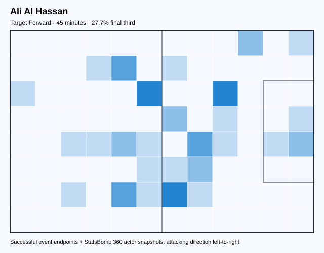

## Physical profile

| Metric | Score |
|---|---:|
| Aerial dominance | 0.000 |
| Pressing intensity per 90 | 16.00 |
| Recovery index per 90 | 6.00 |

## Top chemistry partners

- Firas Tariq Nasser Al Albirakan — synergy 0.141, 45 shared minutes
- Abdulelah Al Amri — synergy 0.139, 45 shared minutes
- Saud Abdullah Abdul Hamid — synergy 0.139, 45 shared minutes

## Tactical recommendations

- Lead the first pressing trigger and protect the inside passing lane.
- Avoid isolating this player in high-volume aerial matchups.
- Use recovery capacity to support higher attacking positions.

_The heatmap combines successful event endpoints with StatsBomb 360 actor
snapshots. StatsBomb 360 is freeze-frame context, not continuous player
tracking. Ratings include eligible outfield players from 45 minutes and
goalkeepers from 90 minutes; ranking status communicates sample reliability._

---

<!-- PLAYER_REPORT 10: 51099_starter_report.md -->

# Firas Tariq Nasser Al Albirakan — Starter Report

- Team: Saudi Arabia (KSA)
- Position: Right Midfield
- Functional role: Target Forward
- VAEP offense per 90: 0.3868
- VAEP defense per 90: -0.0107
- VAEP total per 90: 0.3760
- VAEP per touch: 0.00466
- Spatial xT per 90: -0.0095
- Final-third spatial share: 47.5%
- Unified final player rating: 0.1387
- Team rank: #6

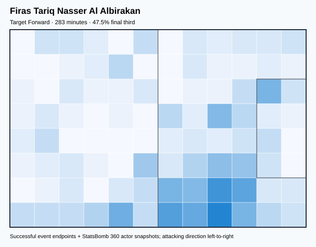

## Physical profile

| Metric | Score |
|---|---:|
| Aerial dominance | 0.375 |
| Pressing intensity per 90 | 10.17 |
| Recovery index per 90 | 3.18 |

## Top chemistry partners

- Mohammed Kanoo — synergy 0.507, 283 shared minutes
- Ali Albulayhi — synergy 0.506, 222 shared minutes
- Salem Mohammed Al Dawsari — synergy 0.484, 283 shared minutes

## Tactical recommendations

- Use a compact pressing trigger rather than sustained solo pressure.
- Use recovery capacity to support higher attacking positions.

_The heatmap combines successful event endpoints with StatsBomb 360 actor
snapshots. StatsBomb 360 is freeze-frame context, not continuous player
tracking. Ratings include eligible outfield players from 45 minutes and
goalkeepers from 90 minutes; ranking status communicates sample reliability._

---

<!-- PLAYER_REPORT 11: 51103_starter_report.md -->

# Abdullah Mohammed Madu — Starter Report

- Team: Saudi Arabia (KSA)
- Position: Left Center Back
- Functional role: Wide Creator
- VAEP offense per 90: -0.0025
- VAEP defense per 90: -0.1291
- VAEP total per 90: -0.1317
- VAEP per touch: -0.00321
- Spatial xT per 90: -0.0004
- Final-third spatial share: 2.5%
- Unified final player rating: -0.0152
- Team rank: #17

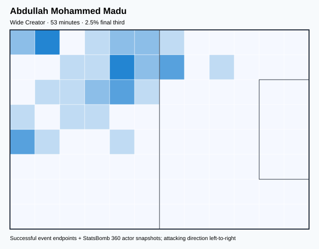

## Physical profile

| Metric | Score |
|---|---:|
| Aerial dominance | 0.500 |
| Pressing intensity per 90 | 5.13 |
| Recovery index per 90 | 3.42 |

## Top chemistry partners

- Mohammed Kanoo — synergy 0.164, 53 shared minutes
- Mohammed Khalil Al Owais — synergy 0.160, 53 shared minutes
- Hassan Mohammed Al-Tambakti — synergy 0.160, 53 shared minutes

## Tactical recommendations

- Use a compact pressing trigger rather than sustained solo pressure.
- Use recovery capacity to support higher attacking positions.

_The heatmap combines successful event endpoints with StatsBomb 360 actor
snapshots. StatsBomb 360 is freeze-frame context, not continuous player
tracking. Ratings include eligible outfield players from 45 minutes and
goalkeepers from 90 minutes; ranking status communicates sample reliability._

---

<!-- PLAYER_REPORT 12: 51469_starter_report.md -->

# Saleh Khalid Al Shehri — Starter Report

- Team: Saudi Arabia (KSA)
- Position: Center Forward
- Functional role: Target Forward
- VAEP offense per 90: 0.3389
- VAEP defense per 90: 0.0255
- VAEP total per 90: 0.3644
- VAEP per touch: 0.00474
- Spatial xT per 90: 0.0203
- Final-third spatial share: 40.0%
- Unified final player rating: 0.2221
- Team rank: #1

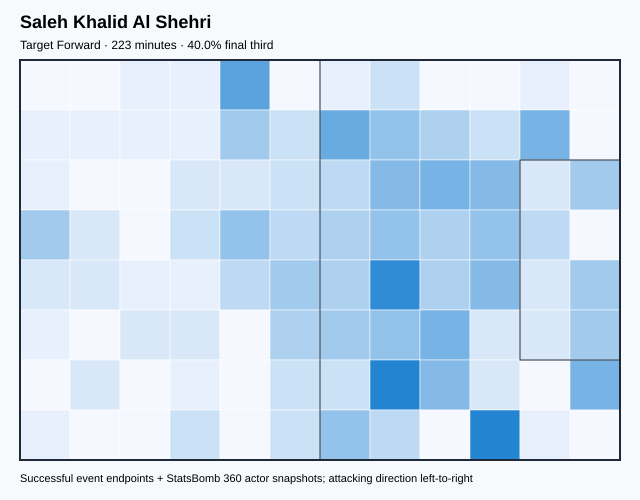

## Physical profile

| Metric | Score |
|---|---:|
| Aerial dominance | 0.467 |
| Pressing intensity per 90 | 20.95 |
| Recovery index per 90 | 2.82 |

## Top chemistry partners

- Mohammed Kanoo — synergy 0.467, 223 shared minutes
- Firas Tariq Nasser Al Albirakan — synergy 0.466, 223 shared minutes
- Salem Mohammed Al Dawsari — synergy 0.402, 223 shared minutes

## Tactical recommendations

- Lead the first pressing trigger and protect the inside passing lane.
- Use recovery capacity to support higher attacking positions.

_The heatmap combines successful event endpoints with StatsBomb 360 actor
snapshots. StatsBomb 360 is freeze-frame context, not continuous player
tracking. Ratings include eligible outfield players from 45 minutes and
goalkeepers from 90 minutes; ranking status communicates sample reliability._

---

<!-- PLAYER_REPORT 13: 51470_starter_report.md -->

# Riyadh Sharahili — Starter Report

- Team: Saudi Arabia (KSA)
- Position: Right Defensive Midfield
- Functional role: Holding Anchor
- VAEP offense per 90: 0.0109
- VAEP defense per 90: -0.0946
- VAEP total per 90: -0.0837
- VAEP per touch: -0.00112
- Spatial xT per 90: -0.0001
- Final-third spatial share: 8.1%
- Unified final player rating: 0.0140
- Team rank: #14

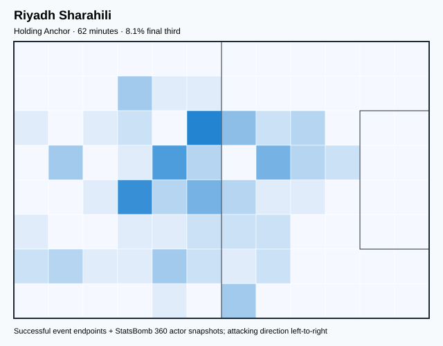

## Physical profile

| Metric | Score |
|---|---:|
| Aerial dominance | 0.333 |
| Pressing intensity per 90 | 20.45 |
| Recovery index per 90 | 10.23 |

## Top chemistry partners

- Mohammed Kanoo — synergy 0.193, 62 shared minutes
- Mohammed Khalil Al Owais — synergy 0.187, 62 shared minutes
- Saud Abdullah Abdul Hamid — synergy 0.187, 62 shared minutes

## Tactical recommendations

- Lead the first pressing trigger and protect the inside passing lane.
- Use recovery capacity to support higher attacking positions.

_The heatmap combines successful event endpoints with StatsBomb 360 actor
snapshots. StatsBomb 360 is freeze-frame context, not continuous player
tracking. Ratings include eligible outfield players from 45 minutes and
goalkeepers from 90 minutes; ranking status communicates sample reliability._

---

<!-- PLAYER_REPORT 14: 51546_starter_report.md -->

# Hassan Mohammed Al-Tambakti — Starter Report

- Team: Saudi Arabia (KSA)
- Position: Right Center Back
- Functional role: Sweeper CB
- VAEP offense per 90: 0.0027
- VAEP defense per 90: -0.2523
- VAEP total per 90: -0.2496
- VAEP per touch: -0.00490
- Spatial xT per 90: -0.0021
- Final-third spatial share: 4.6%
- Unified final player rating: -0.0455
- Team rank: #19

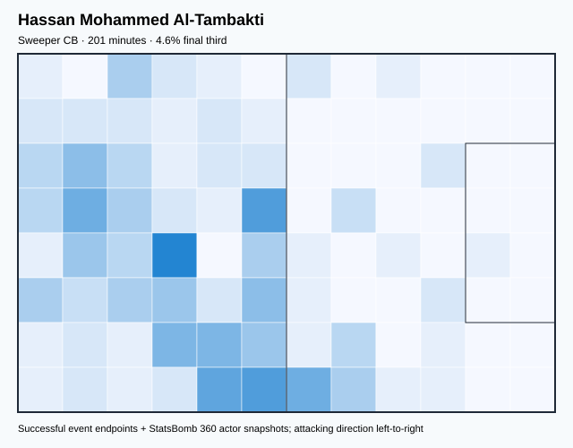

## Physical profile

| Metric | Score |
|---|---:|
| Aerial dominance | 0.000 |
| Pressing intensity per 90 | 12.51 |
| Recovery index per 90 | 1.79 |

## Top chemistry partners

- Mohammed Khalil Al Owais — synergy 0.508, 201 shared minutes
- Salem Mohammed Al Dawsari — synergy 0.488, 201 shared minutes
- Mohammed Kanoo — synergy 0.480, 201 shared minutes

## Tactical recommendations

- Lead the first pressing trigger and protect the inside passing lane.
- Avoid isolating this player in high-volume aerial matchups.
- Pair with a faster recovery defender after aggressive rotations.

_The heatmap combines successful event endpoints with StatsBomb 360 actor
snapshots. StatsBomb 360 is freeze-frame context, not continuous player
tracking. Ratings include eligible outfield players from 45 minutes and
goalkeepers from 90 minutes; ranking status communicates sample reliability._

---

<!-- PLAYER_REPORT 15: 51632_starter_report.md -->

# Sami Khalil Al Naji — Starter Report

- Team: Saudi Arabia (KSA)
- Position: Center Attacking Midfield
- Functional role: Progressive Winger
- VAEP offense per 90: 0.1366
- VAEP defense per 90: 0.0096
- VAEP total per 90: 0.1461
- VAEP per touch: 0.00118
- Spatial xT per 90: 0.1288
- Final-third spatial share: 60.6%
- Unified final player rating: 0.1696
- Team rank: #4

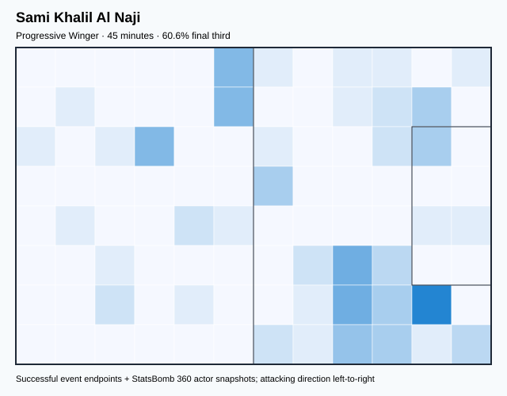

## Physical profile

| Metric | Score |
|---|---:|
| Aerial dominance | 1.000 |
| Pressing intensity per 90 | 14.00 |
| Recovery index per 90 | 4.00 |

## Top chemistry partners

- Firas Tariq Nasser Al Albirakan — synergy 0.141, 45 shared minutes
- Mohammed Al Burayk — synergy 0.139, 45 shared minutes
- Mohammed Khalil Al Owais — synergy 0.136, 45 shared minutes

## Tactical recommendations

- Lead the first pressing trigger and protect the inside passing lane.
- Target this player on direct restarts and back-post deliveries.
- Use recovery capacity to support higher attacking positions.

_The heatmap combines successful event endpoints with StatsBomb 360 actor
snapshots. StatsBomb 360 is freeze-frame context, not continuous player
tracking. Ratings include eligible outfield players from 45 minutes and
goalkeepers from 90 minutes; ranking status communicates sample reliability._

---

<!-- PLAYER_REPORT 16: 51705_starter_report.md -->

# Abdulrahman Al-Obood — Starter Report

- Team: Saudi Arabia (KSA)
- Position: Right Wing
- Functional role: Progressive Winger
- VAEP offense per 90: 0.5817
- VAEP defense per 90: 0.0040
- VAEP total per 90: 0.5856
- VAEP per touch: 0.00598
- Spatial xT per 90: -0.0000
- Final-third spatial share: 63.7%
- Unified final player rating: 0.1881
- Team rank: #3

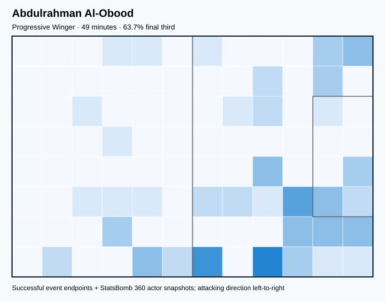

## Physical profile

| Metric | Score |
|---|---:|
| Aerial dominance | 0.500 |
| Pressing intensity per 90 | 27.70 |
| Recovery index per 90 | 5.54 |

## Top chemistry partners

- Mohammed Kanoo — synergy 0.155, 49 shared minutes
- Mohammed Khalil Al Owais — synergy 0.146, 49 shared minutes
- Firas Tariq Nasser Al Albirakan — synergy 0.139, 49 shared minutes

## Tactical recommendations

- Lead the first pressing trigger and protect the inside passing lane.
- Use recovery capacity to support higher attacking positions.

_The heatmap combines successful event endpoints with StatsBomb 360 actor
snapshots. StatsBomb 360 is freeze-frame context, not continuous player
tracking. Ratings include eligible outfield players from 45 minutes and
goalkeepers from 90 minutes; ranking status communicates sample reliability._

---

<!-- PLAYER_REPORT 17: 51710_starter_report.md -->

# Saud Abdullah Abdul Hamid — Starter Report

- Team: Saudi Arabia (KSA)
- Position: Right Back
- Functional role: Attacking Wingback
- VAEP offense per 90: 0.1363
- VAEP defense per 90: -0.0399
- VAEP total per 90: 0.0963
- VAEP per touch: 0.00102
- Spatial xT per 90: 0.0766
- Final-third spatial share: 41.4%
- Unified final player rating: 0.0577
- Team rank: #11

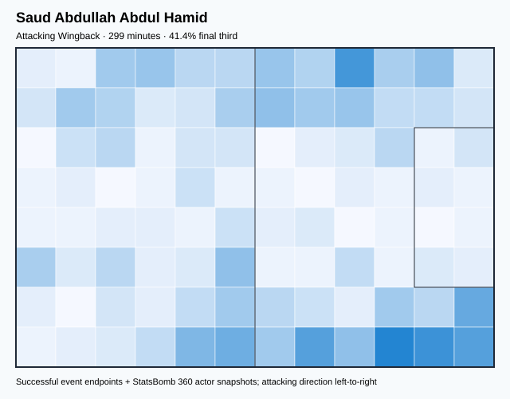

## Physical profile

| Metric | Score |
|---|---:|
| Aerial dominance | 0.300 |
| Pressing intensity per 90 | 12.66 |
| Recovery index per 90 | 3.62 |

## Top chemistry partners

- Mohammed Khalil Al Owais — synergy 0.594, 299 shared minutes
- Salem Mohammed Al Dawsari — synergy 0.582, 299 shared minutes
- Mohammed Kanoo — synergy 0.569, 299 shared minutes

## Tactical recommendations

- Lead the first pressing trigger and protect the inside passing lane.
- Use recovery capacity to support higher attacking positions.

_The heatmap combines successful event endpoints with StatsBomb 360 actor
snapshots. StatsBomb 360 is freeze-frame context, not continuous player
tracking. Ratings include eligible outfield players from 45 minutes and
goalkeepers from 90 minutes; ranking status communicates sample reliability._

---

<!-- PLAYER_REPORT 18: 54144_starter_report.md -->

# Nawaf Shaker Al Abid — Starter Report

- Team: Saudi Arabia (KSA)
- Position: Center Attacking Midfield
- Functional role: Ball-Winner
- VAEP offense per 90: 0.5287
- VAEP defense per 90: 0.0216
- VAEP total per 90: 0.5503
- VAEP per touch: 0.00371
- Spatial xT per 90: 0.0157
- Final-third spatial share: 50.2%
- Unified final player rating: 0.1937
- Team rank: #2

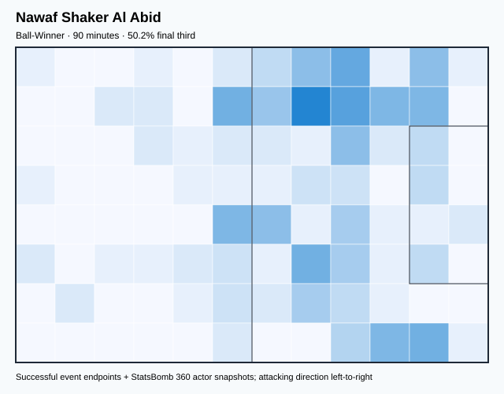

## Physical profile

| Metric | Score |
|---|---:|
| Aerial dominance | 0.000 |
| Pressing intensity per 90 | 14.04 |
| Recovery index per 90 | 4.01 |

## Top chemistry partners

- Salem Mohammed Al Dawsari — synergy 0.261, 90 shared minutes
- Mohammed Kanoo — synergy 0.261, 90 shared minutes
- Firas Tariq Nasser Al Albirakan — synergy 0.238, 90 shared minutes

## Tactical recommendations

- Lead the first pressing trigger and protect the inside passing lane.
- Avoid isolating this player in high-volume aerial matchups.
- Use recovery capacity to support higher attacking positions.

_The heatmap combines successful event endpoints with StatsBomb 360 actor
snapshots. StatsBomb 360 is freeze-frame context, not continuous player
tracking. Ratings include eligible outfield players from 45 minutes and
goalkeepers from 90 minutes; ranking status communicates sample reliability._

---

<!-- PLAYER_REPORT 19: 56755_starter_report.md -->

# Abdulelah Saad Hameed Al-Malki — Starter Report

- Team: Saudi Arabia (KSA)
- Position: Center Defensive Midfield
- Functional role: Holding Anchor
- VAEP offense per 90: 0.0177
- VAEP defense per 90: -0.1441
- VAEP total per 90: -0.1264
- VAEP per touch: -0.00123
- Spatial xT per 90: 0.0049
- Final-third spatial share: 24.2%
- Unified final player rating: -0.0032
- Team rank: #15

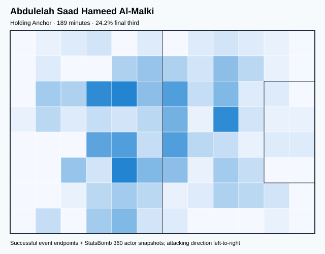

## Physical profile

| Metric | Score |
|---|---:|
| Aerial dominance | 0.333 |
| Pressing intensity per 90 | 19.07 |
| Recovery index per 90 | 5.24 |

## Top chemistry partners

- Mohammed Kanoo — synergy 0.492, 189 shared minutes
- Ali Albulayhi — synergy 0.468, 189 shared minutes
- Saud Abdullah Abdul Hamid — synergy 0.463, 189 shared minutes

## Tactical recommendations

- Lead the first pressing trigger and protect the inside passing lane.
- Use recovery capacity to support higher attacking positions.

_The heatmap combines successful event endpoints with StatsBomb 360 actor
snapshots. StatsBomb 360 is freeze-frame context, not continuous player
tracking. Ratings include eligible outfield players from 45 minutes and
goalkeepers from 90 minutes; ranking status communicates sample reliability._

---

<!-- PLAYER_REPORT 20: 57620_starter_report.md -->

# Sultan Abdullah Salim Al Ghannam — Starter Report

- Team: Saudi Arabia (KSA)
- Position: Right Wing Back
- Functional role: Attacking Wingback
- VAEP offense per 90: 0.2829
- VAEP defense per 90: 0.0059
- VAEP total per 90: 0.2888
- VAEP per touch: 0.00315
- Spatial xT per 90: 0.0415
- Final-third spatial share: 38.0%
- Unified final player rating: 0.0782
- Team rank: #10

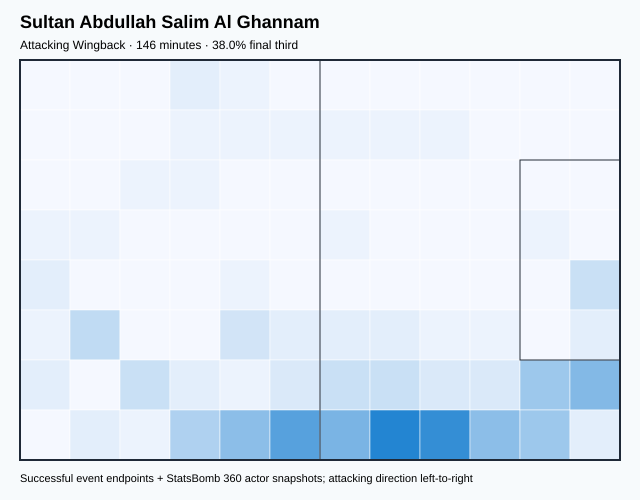

## Physical profile

| Metric | Score |
|---|---:|
| Aerial dominance | 0.000 |
| Pressing intensity per 90 | 8.62 |
| Recovery index per 90 | 3.08 |

## Top chemistry partners

- Salem Mohammed Al Dawsari — synergy 0.391, 146 shared minutes
- Saud Abdullah Abdul Hamid — synergy 0.378, 146 shared minutes
- Mohammed Kanoo — synergy 0.375, 146 shared minutes

## Tactical recommendations

- Use a compact pressing trigger rather than sustained solo pressure.
- Avoid isolating this player in high-volume aerial matchups.
- Use recovery capacity to support higher attacking positions.

_The heatmap combines successful event endpoints with StatsBomb 360 actor
snapshots. StatsBomb 360 is freeze-frame context, not continuous player
tracking. Ratings include eligible outfield players from 45 minutes and
goalkeepers from 90 minutes; ranking status communicates sample reliability._
