# MAR — V4 Player Evaluation Collection

<!-- V5_CANONICAL_NOTICE -->
> **Historical V4 player-rating packet.** Player ratings, ranks, role-challenger decisions, and rating uncertainty below are superseded by `results/reports/player_rankings.csv`, `results/reports/player_profiles/`, and `results/reports/model_summary.md`. Possession, tactical, and match-bootstrap material remains a historical V4 result.

- Included eligible players: 23
- Rankings use the role-aware, development-gated VAEP/xT/xD model.
- Heatmaps combine successful on-ball endpoints and SB360 actor snapshots.

---

<!-- PLAYER_REPORT 1: 3625_starter_report.md -->

# Sofiane Boufal — Starter Report

- Team: Morocco (MAR)
- Position: Left Midfield
- Functional role: Progressive Winger
- VAEP offense per 90: 0.1888
- VAEP defense per 90: 0.0105
- VAEP total per 90: 0.1993
- VAEP per touch: 0.00198
- Spatial xT per 90: 0.0793
- Final-third spatial share: 38.3%
- Unified final player rating: 0.1122
- Team rank: #6

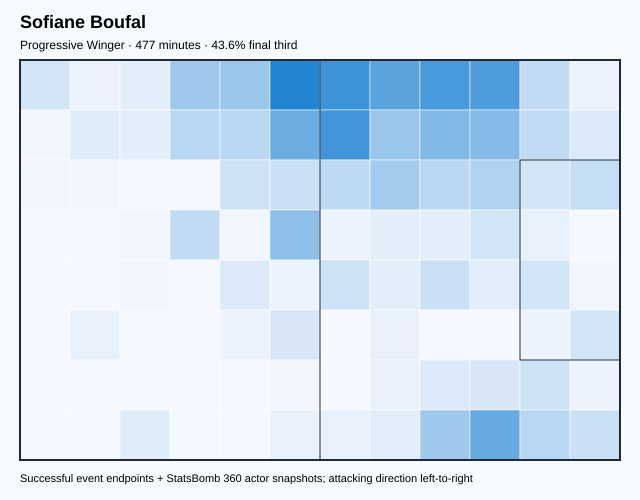

## Physical profile

| Metric | Score |
|---|---:|
| Aerial dominance | 0.250 |
| Pressing intensity per 90 | 18.50 |
| Recovery index per 90 | 3.21 |

## Top chemistry partners

- Achraf Hakimi Mouh — synergy 0.700, 472 shared minutes
- Azzedine Ounahi — synergy 0.688, 422 shared minutes
- Sofyan Amrabat — synergy 0.675, 477 shared minutes

## Tactical recommendations

- Lead the first pressing trigger and protect the inside passing lane.
- Use recovery capacity to support higher attacking positions.

_The heatmap combines successful event endpoints with StatsBomb 360 actor
snapshots. StatsBomb 360 is freeze-frame context, not continuous player
tracking. Ratings include eligible outfield players from 45 minutes and
goalkeepers from 90 minutes; ranking status communicates sample reliability._

---

<!-- PLAYER_REPORT 2: 3634_starter_report.md -->

# Abdelhamid Sabiri — Starter Report

- Team: Morocco (MAR)
- Position: Left Center Midfield
- Functional role: Holding Anchor
- VAEP offense per 90: -0.0816
- VAEP defense per 90: -0.0258
- VAEP total per 90: -0.1074
- VAEP per touch: -0.00130
- Spatial xT per 90: 0.0138
- Final-third spatial share: 17.7%
- Unified final player rating: 0.0599
- Team rank: #13

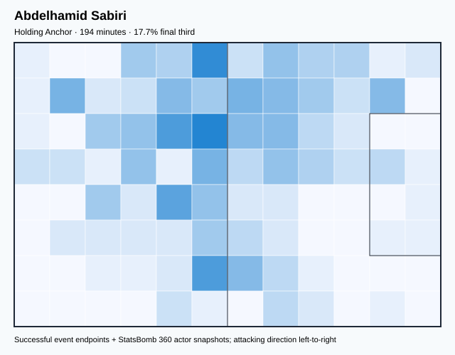

## Physical profile

| Metric | Score |
|---|---:|
| Aerial dominance | 0.750 |
| Pressing intensity per 90 | 15.75 |
| Recovery index per 90 | 0.93 |

## Top chemistry partners

- Sofyan Amrabat — synergy 0.485, 194 shared minutes
- Yassine Bounou — synergy 0.440, 166 shared minutes
- Achraf Hakimi Mouh — synergy 0.407, 166 shared minutes

## Tactical recommendations

- Lead the first pressing trigger and protect the inside passing lane.
- Target this player on direct restarts and back-post deliveries.
- Pair with a faster recovery defender after aggressive rotations.

_The heatmap combines successful event endpoints with StatsBomb 360 actor
snapshots. StatsBomb 360 is freeze-frame context, not continuous player
tracking. Ratings include eligible outfield players from 45 minutes and
goalkeepers from 90 minutes; ranking status communicates sample reliability._

---

<!-- PLAYER_REPORT 3: 5219_starter_report.md -->

# Romain Saïss — Starter Report

- Team: Morocco (MAR)
- Position: Left Center Back
- Functional role: Sweeper CB
- VAEP offense per 90: 0.0639
- VAEP defense per 90: -0.0631
- VAEP total per 90: 0.0009
- VAEP per touch: 0.00001
- Spatial xT per 90: 0.0112
- Final-third spatial share: 3.2%
- Unified final player rating: -0.0030
- Team rank: #16

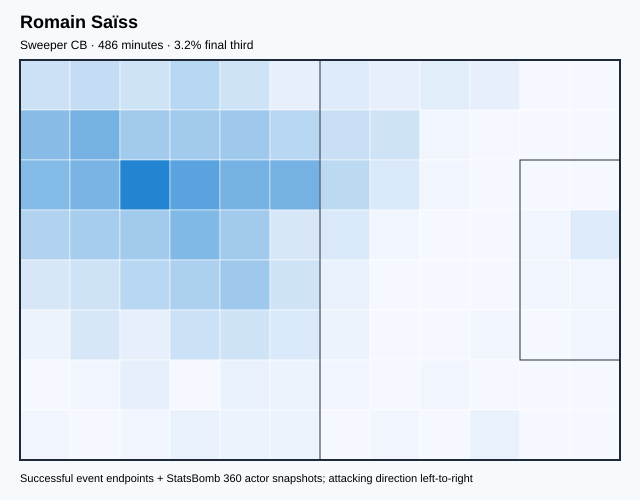

## Physical profile

| Metric | Score |
|---|---:|
| Aerial dominance | 0.800 |
| Pressing intensity per 90 | 7.60 |
| Recovery index per 90 | 2.22 |

## Top chemistry partners

- Sofyan Amrabat — synergy 0.824, 486 shared minutes
- Achraf Hakimi Mouh — synergy 0.781, 448 shared minutes
- Yassine Bounou — synergy 0.752, 391 shared minutes

## Tactical recommendations

- Use a compact pressing trigger rather than sustained solo pressure.
- Target this player on direct restarts and back-post deliveries.
- Pair with a faster recovery defender after aggressive rotations.

_The heatmap combines successful event endpoints with StatsBomb 360 actor
snapshots. StatsBomb 360 is freeze-frame context, not continuous player
tracking. Ratings include eligible outfield players from 45 minutes and
goalkeepers from 90 minutes; ranking status communicates sample reliability._

---

<!-- PLAYER_REPORT 4: 5233_starter_report.md -->

# Munir Mohand Mohamedi — Starter Report

- Team: Morocco (MAR)
- Position: Goalkeeper
- Functional role: Goalkeeper
- VAEP offense per 90: -0.0156
- VAEP defense per 90: -0.1445
- VAEP total per 90: -0.1600
- VAEP per touch: -0.00403
- Spatial xT per 90: 0.0028
- Final-third spatial share: 0.0%
- Unified final player rating: -0.0646
- Team rank: #23

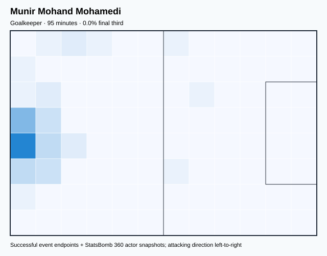

## Physical profile

| Metric | Score |
|---|---:|
| Aerial dominance | 0.000 |
| Pressing intensity per 90 | 0.00 |
| Recovery index per 90 | 4.73 |

## Top chemistry partners

- Romain Saïss — synergy 0.283, 95 shared minutes
- Nayef Aguerd — synergy 0.283, 95 shared minutes
- Sofyan Amrabat — synergy 0.278, 95 shared minutes

## Tactical recommendations

- Use a compact pressing trigger rather than sustained solo pressure.
- Avoid isolating this player in high-volume aerial matchups.
- Use recovery capacity to support higher attacking positions.

_The heatmap combines successful event endpoints with StatsBomb 360 actor
snapshots. StatsBomb 360 is freeze-frame context, not continuous player
tracking. Ratings include eligible outfield players from 45 minutes and
goalkeepers from 90 minutes; ranking status communicates sample reliability._

---

<!-- PLAYER_REPORT 5: 5234_starter_report.md -->

# Sofyan Amrabat — Starter Report

- Team: Morocco (MAR)
- Position: Center Defensive Midfield
- Functional role: Holding Anchor
- VAEP offense per 90: 0.0028
- VAEP defense per 90: -0.0543
- VAEP total per 90: -0.0515
- VAEP per touch: -0.00048
- Spatial xT per 90: 0.0165
- Final-third spatial share: 7.5%
- Unified final player rating: -0.0053
- Team rank: #17

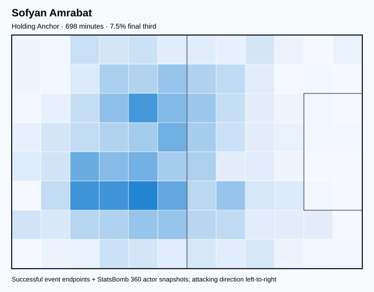

## Physical profile

| Metric | Score |
|---|---:|
| Aerial dominance | 0.250 |
| Pressing intensity per 90 | 18.17 |
| Recovery index per 90 | 5.03 |

## Top chemistry partners

- Yassine Bounou — synergy 0.877, 603 shared minutes
- Hakim Ziyech — synergy 0.855, 663 shared minutes
- Achraf Hakimi Mouh — synergy 0.829, 661 shared minutes

## Tactical recommendations

- Lead the first pressing trigger and protect the inside passing lane.
- Use recovery capacity to support higher attacking positions.

_The heatmap combines successful event endpoints with StatsBomb 360 actor
snapshots. StatsBomb 360 is freeze-frame context, not continuous player
tracking. Ratings include eligible outfield players from 45 minutes and
goalkeepers from 90 minutes; ranking status communicates sample reliability._

---

<!-- PLAYER_REPORT 6: 5237_starter_report.md -->

# Hakim Ziyech — Starter Report

- Team: Morocco (MAR)
- Position: Right Wing
- Functional role: Deep Playmaker
- VAEP offense per 90: 0.1045
- VAEP defense per 90: -0.0137
- VAEP total per 90: 0.0908
- VAEP per touch: 0.00069
- Spatial xT per 90: 0.0715
- Final-third spatial share: 32.3%
- Unified final player rating: 0.1071
- Team rank: #7

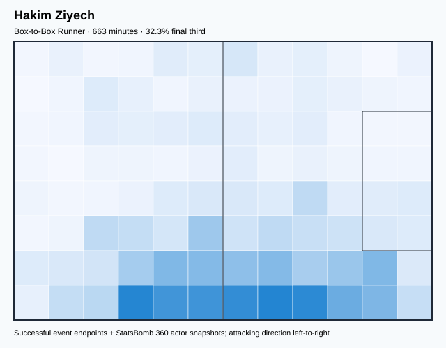

## Physical profile

| Metric | Score |
|---|---:|
| Aerial dominance | 0.333 |
| Pressing intensity per 90 | 20.64 |
| Recovery index per 90 | 3.26 |

## Top chemistry partners

- Sofyan Amrabat — synergy 0.855, 663 shared minutes
- Yassine Bounou — synergy 0.835, 567 shared minutes
- Achraf Hakimi Mouh — synergy 0.797, 634 shared minutes

## Tactical recommendations

- Lead the first pressing trigger and protect the inside passing lane.
- Use recovery capacity to support higher attacking positions.

_The heatmap combines successful event endpoints with StatsBomb 360 actor
snapshots. StatsBomb 360 is freeze-frame context, not continuous player
tracking. Ratings include eligible outfield players from 45 minutes and
goalkeepers from 90 minutes; ranking status communicates sample reliability._

---

<!-- PLAYER_REPORT 7: 5245_starter_report.md -->

# Achraf Hakimi Mouh — Starter Report

- Team: Morocco (MAR)
- Position: Right Back
- Functional role: Attacking Wingback
- VAEP offense per 90: 0.0615
- VAEP defense per 90: -0.0817
- VAEP total per 90: -0.0202
- VAEP per touch: -0.00015
- Spatial xT per 90: 0.0545
- Final-third spatial share: 26.6%
- Unified final player rating: 0.0222
- Team rank: #15

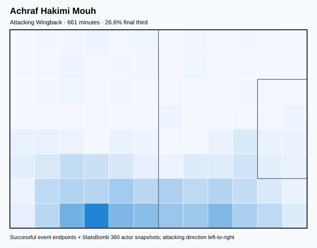

## Physical profile

| Metric | Score |
|---|---:|
| Aerial dominance | 0.571 |
| Pressing intensity per 90 | 16.21 |
| Recovery index per 90 | 4.90 |

## Top chemistry partners

- Sofyan Amrabat — synergy 0.829, 661 shared minutes
- Hakim Ziyech — synergy 0.797, 634 shared minutes
- Azzedine Ounahi — synergy 0.784, 578 shared minutes

## Tactical recommendations

- Lead the first pressing trigger and protect the inside passing lane.
- Target this player on direct restarts and back-post deliveries.
- Use recovery capacity to support higher attacking positions.

_The heatmap combines successful event endpoints with StatsBomb 360 actor
snapshots. StatsBomb 360 is freeze-frame context, not continuous player
tracking. Ratings include eligible outfield players from 45 minutes and
goalkeepers from 90 minutes; ranking status communicates sample reliability._

---

<!-- PLAYER_REPORT 8: 6301_starter_report.md -->

# Youssef En-Nesyri — Starter Report

- Team: Morocco (MAR)
- Position: Center Forward
- Functional role: Target Forward / Penalty-Box Anchor
- VAEP offense per 90: 0.2149
- VAEP defense per 90: 0.0314
- VAEP total per 90: 0.2463
- VAEP per touch: 0.00494
- Spatial xT per 90: -0.0001
- Final-third spatial share: 26.1%
- Unified final player rating: 0.1760
- Team rank: #4

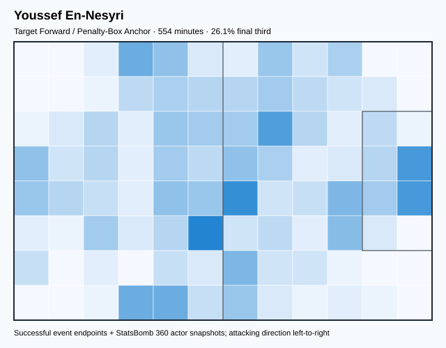

## Physical profile

| Metric | Score |
|---|---:|
| Aerial dominance | 0.537 |
| Pressing intensity per 90 | 18.36 |
| Recovery index per 90 | 1.95 |

## Top chemistry partners

- Sofyan Amrabat — synergy 0.633, 554 shared minutes
- Sofiane Boufal — synergy 0.611, 459 shared minutes
- Achraf Hakimi Mouh — synergy 0.603, 540 shared minutes

## Tactical recommendations

- Lead the first pressing trigger and protect the inside passing lane.
- Pair with a faster recovery defender after aggressive rotations.

_The heatmap combines successful event endpoints with StatsBomb 360 actor
snapshots. StatsBomb 360 is freeze-frame context, not continuous player
tracking. Ratings include eligible outfield players from 45 minutes and
goalkeepers from 90 minutes; ranking status communicates sample reliability._

---

<!-- PLAYER_REPORT 9: 6785_starter_report.md -->

# Yassine Bounou — Starter Report

- Team: Morocco (MAR)
- Position: Goalkeeper
- Functional role: Goalkeeper
- VAEP offense per 90: -0.0172
- VAEP defense per 90: -0.1099
- VAEP total per 90: -0.1271
- VAEP per touch: -0.00203
- Spatial xT per 90: 0.0033
- Final-third spatial share: 0.8%
- Unified final player rating: -0.0625
- Team rank: #22

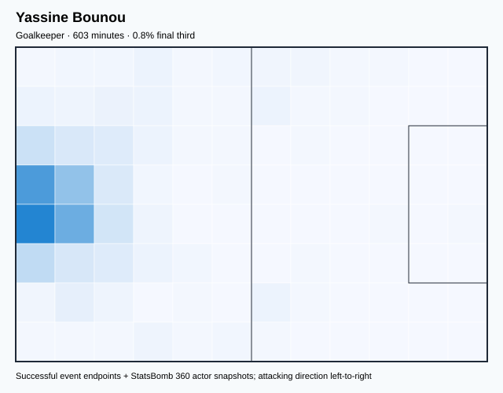

## Physical profile

| Metric | Score |
|---|---:|
| Aerial dominance | 0.000 |
| Pressing intensity per 90 | 0.15 |
| Recovery index per 90 | 3.73 |

## Top chemistry partners

- Sofyan Amrabat — synergy 0.877, 603 shared minutes
- Hakim Ziyech — synergy 0.835, 567 shared minutes
- Achraf Hakimi Mouh — synergy 0.775, 594 shared minutes

## Tactical recommendations

- Use a compact pressing trigger rather than sustained solo pressure.
- Avoid isolating this player in high-volume aerial matchups.
- Use recovery capacity to support higher attacking positions.

_The heatmap combines successful event endpoints with StatsBomb 360 actor
snapshots. StatsBomb 360 is freeze-frame context, not continuous player
tracking. Ratings include eligible outfield players from 45 minutes and
goalkeepers from 90 minutes; ranking status communicates sample reliability._

---

<!-- PLAYER_REPORT 10: 7459_starter_report.md -->

# Jawad El Yamiq — Starter Report

- Team: Morocco (MAR)
- Position: Right Center Back
- Functional role: Sweeper CB
- VAEP offense per 90: 0.0027
- VAEP defense per 90: -0.0059
- VAEP total per 90: -0.0032
- VAEP per touch: -0.00003
- Spatial xT per 90: 0.0022
- Final-third spatial share: 2.4%
- Unified final player rating: -0.0057
- Team rank: #18

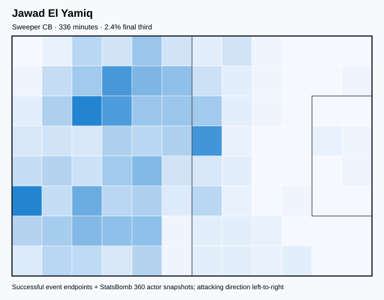

## Physical profile

| Metric | Score |
|---|---:|
| Aerial dominance | 1.000 |
| Pressing intensity per 90 | 6.17 |
| Recovery index per 90 | 2.95 |

## Top chemistry partners

- Sofyan Amrabat — synergy 0.701, 336 shared minutes
- Yassine Bounou — synergy 0.684, 318 shared minutes
- Achraf Hakimi Mouh — synergy 0.631, 309 shared minutes

## Tactical recommendations

- Use a compact pressing trigger rather than sustained solo pressure.
- Target this player on direct restarts and back-post deliveries.
- Use recovery capacity to support higher attacking positions.

_The heatmap combines successful event endpoints with StatsBomb 360 actor
snapshots. StatsBomb 360 is freeze-frame context, not continuous player
tracking. Ratings include eligible outfield players from 45 minutes and
goalkeepers from 90 minutes; ranking status communicates sample reliability._

---

<!-- PLAYER_REPORT 11: 12149_starter_report.md -->

# Nayef Aguerd — Starter Report

- Team: Morocco (MAR)
- Position: Right Center Back
- Functional role: Sweeper CB
- VAEP offense per 90: 0.0287
- VAEP defense per 90: -0.0677
- VAEP total per 90: -0.0390
- VAEP per touch: -0.00041
- Spatial xT per 90: 0.0064
- Final-third spatial share: 2.0%
- Unified final player rating: -0.0133
- Team rank: #19

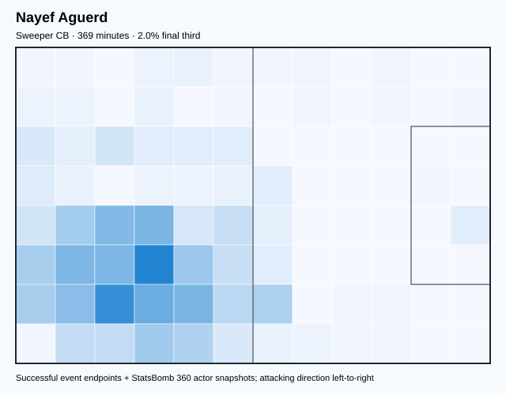

## Physical profile

| Metric | Score |
|---|---:|
| Aerial dominance | 0.750 |
| Pressing intensity per 90 | 4.88 |
| Recovery index per 90 | 1.46 |

## Top chemistry partners

- Romain Saïss — synergy 0.737, 369 shared minutes
- Sofyan Amrabat — synergy 0.723, 369 shared minutes
- Achraf Hakimi Mouh — synergy 0.701, 332 shared minutes

## Tactical recommendations

- Use a compact pressing trigger rather than sustained solo pressure.
- Target this player on direct restarts and back-post deliveries.
- Pair with a faster recovery defender after aggressive rotations.

_The heatmap combines successful event endpoints with StatsBomb 360 actor
snapshots. StatsBomb 360 is freeze-frame context, not continuous player
tracking. Ratings include eligible outfield players from 45 minutes and
goalkeepers from 90 minutes; ranking status communicates sample reliability._

---

<!-- PLAYER_REPORT 12: 15890_starter_report.md -->

# Noussair Mazraoui — Starter Report

- Team: Morocco (MAR)
- Position: Left Back
- Functional role: Wide Creator
- VAEP offense per 90: 0.0485
- VAEP defense per 90: 0.0031
- VAEP total per 90: 0.0516
- VAEP per touch: 0.00069
- Spatial xT per 90: 0.0181
- Final-third spatial share: 17.3%
- Unified final player rating: 0.0427
- Team rank: #14

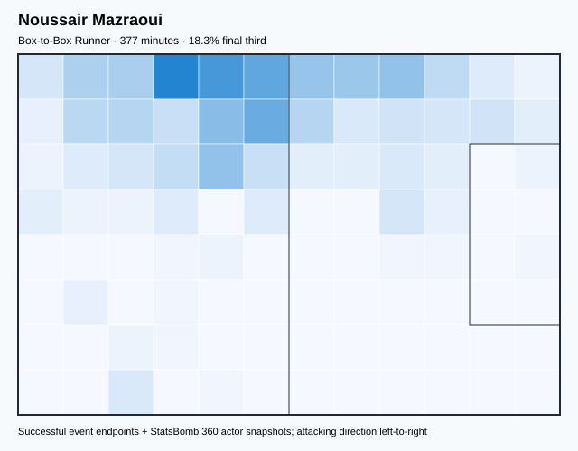

## Physical profile

| Metric | Score |
|---|---:|
| Aerial dominance | 0.400 |
| Pressing intensity per 90 | 12.18 |
| Recovery index per 90 | 3.10 |

## Top chemistry partners

- Romain Saïss — synergy 0.702, 352 shared minutes
- Sofyan Amrabat — synergy 0.678, 377 shared minutes
- Achraf Hakimi Mouh — synergy 0.669, 339 shared minutes

## Tactical recommendations

- Lead the first pressing trigger and protect the inside passing lane.
- Use recovery capacity to support higher attacking positions.

_The heatmap combines successful event endpoints with StatsBomb 360 actor
snapshots. StatsBomb 360 is freeze-frame context, not continuous player
tracking. Ratings include eligible outfield players from 45 minutes and
goalkeepers from 90 minutes; ranking status communicates sample reliability._

---

<!-- PLAYER_REPORT 13: 21214_starter_report.md -->

# Ilias Chair — Starter Report

- Team: Morocco (MAR)
- Position: Right Center Midfield
- Functional role: Ball-Winner
- VAEP offense per 90: 0.1486
- VAEP defense per 90: 0.0012
- VAEP total per 90: 0.1497
- VAEP per touch: 0.00167
- Spatial xT per 90: 0.0213
- Final-third spatial share: 37.5%
- Unified final player rating: 0.1051
- Team rank: #8

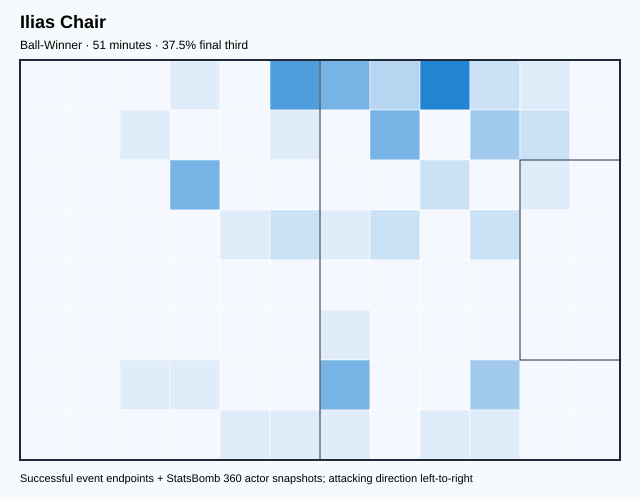

## Physical profile

| Metric | Score |
|---|---:|
| Aerial dominance | 0.000 |
| Pressing intensity per 90 | 15.84 |
| Recovery index per 90 | 0.00 |

## Top chemistry partners

- Hakim Ziyech — synergy 0.161, 51 shared minutes
- Achraf Hakimi Mouh — synergy 0.158, 51 shared minutes
- Sofyan Amrabat — synergy 0.156, 51 shared minutes

## Tactical recommendations

- Lead the first pressing trigger and protect the inside passing lane.
- Avoid isolating this player in high-volume aerial matchups.
- Pair with a faster recovery defender after aggressive rotations.

_The heatmap combines successful event endpoints with StatsBomb 360 actor
snapshots. StatsBomb 360 is freeze-frame context, not continuous player
tracking. Ratings include eligible outfield players from 45 minutes and
goalkeepers from 90 minutes; ranking status communicates sample reliability._

---

<!-- PLAYER_REPORT 14: 21736_starter_report.md -->

# Zakaria Aboukhlal — Starter Report

- Team: Morocco (MAR)
- Position: Left Center Forward
- Functional role: Wide Creator
- VAEP offense per 90: 0.2944
- VAEP defense per 90: 0.0161
- VAEP total per 90: 0.3105
- VAEP per touch: 0.00569
- Spatial xT per 90: 0.0663
- Final-third spatial share: 52.6%
- Unified final player rating: 0.2266
- Team rank: #3

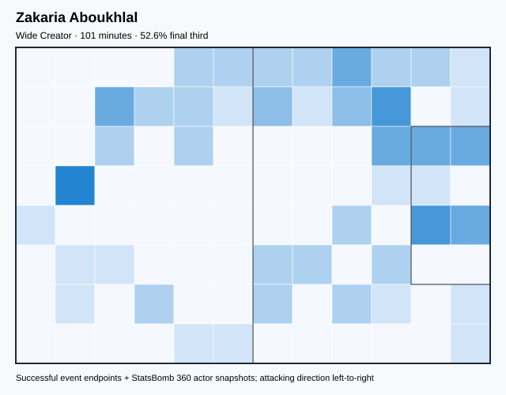

## Physical profile

| Metric | Score |
|---|---:|
| Aerial dominance | 1.000 |
| Pressing intensity per 90 | 16.09 |
| Recovery index per 90 | 4.47 |

## Top chemistry partners

- Sofyan Amrabat — synergy 0.250, 101 shared minutes
- Jawad El Yamiq — synergy 0.234, 83 shared minutes
- Yassine Bounou — synergy 0.228, 77 shared minutes

## Tactical recommendations

- Lead the first pressing trigger and protect the inside passing lane.
- Target this player on direct restarts and back-post deliveries.
- Use recovery capacity to support higher attacking positions.

_The heatmap combines successful event endpoints with StatsBomb 360 actor
snapshots. StatsBomb 360 is freeze-frame context, not continuous player
tracking. Ratings include eligible outfield players from 45 minutes and
goalkeepers from 90 minutes; ranking status communicates sample reliability._

---

<!-- PLAYER_REPORT 15: 23774_starter_report.md -->

# Selim Amallah — Starter Report

- Team: Morocco (MAR)
- Position: Left Center Midfield
- Functional role: Ball-Winner
- VAEP offense per 90: 0.0765
- VAEP defense per 90: -0.0065
- VAEP total per 90: 0.0699
- VAEP per touch: 0.00102
- Spatial xT per 90: 0.0064
- Final-third spatial share: 18.8%
- Unified final player rating: 0.0733
- Team rank: #11

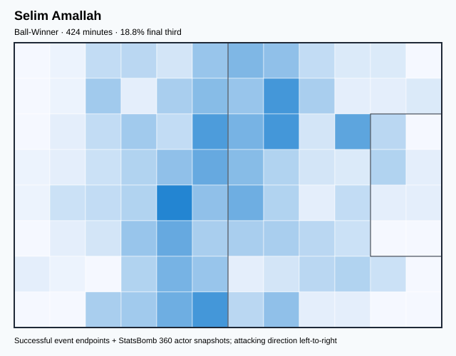

## Physical profile

| Metric | Score |
|---|---:|
| Aerial dominance | 0.000 |
| Pressing intensity per 90 | 26.34 |
| Recovery index per 90 | 2.97 |

## Top chemistry partners

- Achraf Hakimi Mouh — synergy 0.752, 415 shared minutes
- Sofyan Amrabat — synergy 0.700, 424 shared minutes
- Romain Saïss — synergy 0.687, 331 shared minutes

## Tactical recommendations

- Lead the first pressing trigger and protect the inside passing lane.
- Avoid isolating this player in high-volume aerial matchups.
- Use recovery capacity to support higher attacking positions.

_The heatmap combines successful event endpoints with StatsBomb 360 actor
snapshots. StatsBomb 360 is freeze-frame context, not continuous player
tracking. Ratings include eligible outfield players from 45 minutes and
goalkeepers from 90 minutes; ranking status communicates sample reliability._

---

<!-- PLAYER_REPORT 16: 31295_starter_report.md -->

# Yahia Attiyat allah — Starter Report

- Team: Morocco (MAR)
- Position: Left Back
- Functional role: Attacking Wingback
- VAEP offense per 90: 0.1654
- VAEP defense per 90: -0.0093
- VAEP total per 90: 0.1561
- VAEP per touch: 0.00177
- Spatial xT per 90: 0.0328
- Final-third spatial share: 19.7%
- Unified final player rating: 0.0675
- Team rank: #12

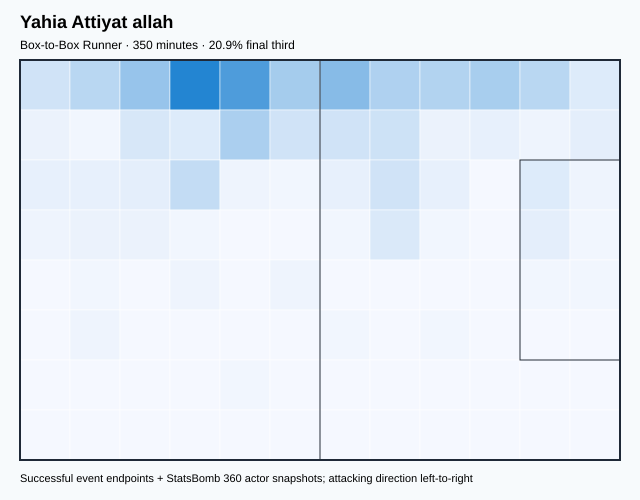

## Physical profile

| Metric | Score |
|---|---:|
| Aerial dominance | 0.200 |
| Pressing intensity per 90 | 11.31 |
| Recovery index per 90 | 5.14 |

## Top chemistry partners

- Sofyan Amrabat — synergy 0.690, 350 shared minutes
- Yassine Bounou — synergy 0.671, 322 shared minutes
- Achraf Hakimi Mouh — synergy 0.638, 322 shared minutes

## Tactical recommendations

- Lead the first pressing trigger and protect the inside passing lane.
- Use recovery capacity to support higher attacking positions.

_The heatmap combines successful event endpoints with StatsBomb 360 actor
snapshots. StatsBomb 360 is freeze-frame context, not continuous player
tracking. Ratings include eligible outfield players from 45 minutes and
goalkeepers from 90 minutes; ranking status communicates sample reliability._

---

<!-- PLAYER_REPORT 17: 46258_starter_report.md -->

# Azzedine Ounahi — Starter Report

- Team: Morocco (MAR)
- Position: Right Center Midfield
- Functional role: Box-to-Box / Engine Midfielder
- VAEP offense per 90: 0.1128
- VAEP defense per 90: -0.0013
- VAEP total per 90: 0.1115
- VAEP per touch: 0.00086
- Spatial xT per 90: 0.0363
- Final-third spatial share: 22.9%
- Unified final player rating: 0.0826
- Team rank: #10

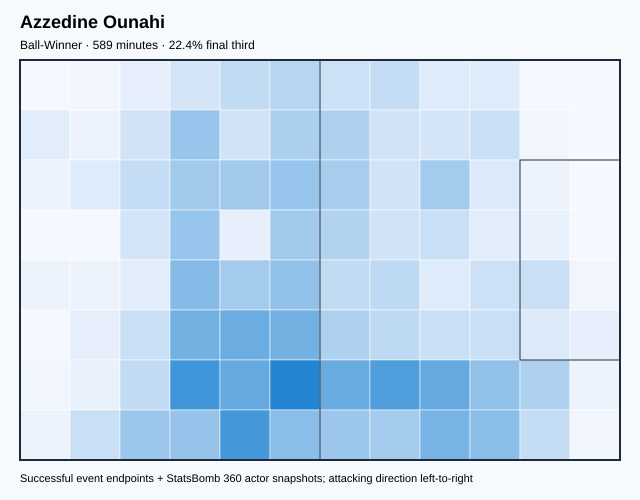

## Physical profile

| Metric | Score |
|---|---:|
| Aerial dominance | 0.286 |
| Pressing intensity per 90 | 16.04 |
| Recovery index per 90 | 4.73 |

## Top chemistry partners

- Achraf Hakimi Mouh — synergy 0.784, 578 shared minutes
- Hakim Ziyech — synergy 0.780, 572 shared minutes
- Sofyan Amrabat — synergy 0.777, 589 shared minutes

## Tactical recommendations

- Lead the first pressing trigger and protect the inside passing lane.
- Use recovery capacity to support higher attacking positions.

_The heatmap combines successful event endpoints with StatsBomb 360 actor
snapshots. StatsBomb 360 is freeze-frame context, not continuous player
tracking. Ratings include eligible outfield players from 45 minutes and
goalkeepers from 90 minutes; ranking status communicates sample reliability._

---

<!-- PLAYER_REPORT 18: 59493_starter_report.md -->

# Abderrazak Hamdallah — Starter Report

- Team: Morocco (MAR)
- Position: Center Forward
- Functional role: Target Forward
- VAEP offense per 90: 0.4187
- VAEP defense per 90: 0.0602
- VAEP total per 90: 0.4788
- VAEP per touch: 0.00646
- Spatial xT per 90: 0.0628
- Final-third spatial share: 49.1%
- Unified final player rating: 0.2416
- Team rank: #1

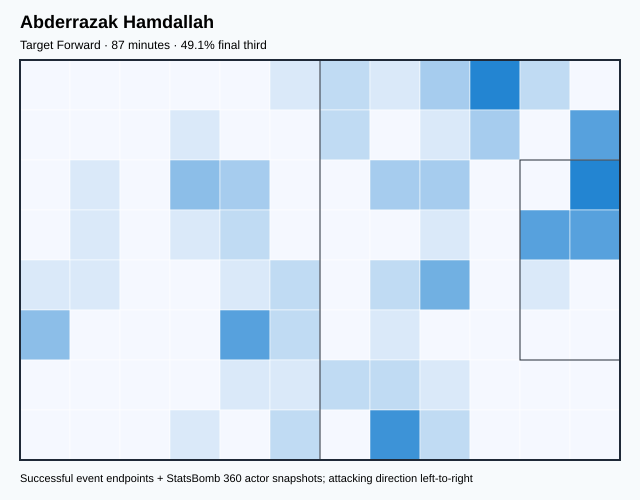

## Physical profile

| Metric | Score |
|---|---:|
| Aerial dominance | 0.364 |
| Pressing intensity per 90 | 10.30 |
| Recovery index per 90 | 5.15 |

## Top chemistry partners

- Sofyan Amrabat — synergy 0.233, 87 shared minutes
- Zakaria Aboukhlal — synergy 0.221, 72 shared minutes
- Jawad El Yamiq — synergy 0.196, 66 shared minutes

## Tactical recommendations

- Use a compact pressing trigger rather than sustained solo pressure.
- Use recovery capacity to support higher attacking positions.

_The heatmap combines successful event endpoints with StatsBomb 360 actor
snapshots. StatsBomb 360 is freeze-frame context, not continuous player
tracking. Ratings include eligible outfield players from 45 minutes and
goalkeepers from 90 minutes; ranking status communicates sample reliability._

---

<!-- PLAYER_REPORT 19: 67700_starter_report.md -->

# Badr Banoun — Starter Report

- Team: Morocco (MAR)
- Position: Center Back
- Functional role: Sweeper CB
- VAEP offense per 90: -0.4914
- VAEP defense per 90: -0.0581
- VAEP total per 90: -0.5495
- VAEP per touch: -0.00682
- Spatial xT per 90: -0.0015
- Final-third spatial share: 3.6%
- Unified final player rating: -0.0453
- Team rank: #21

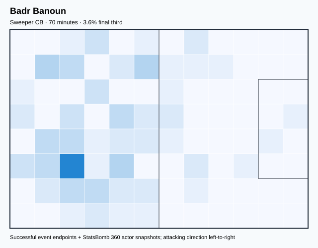

## Physical profile

| Metric | Score |
|---|---:|
| Aerial dominance | 0.000 |
| Pressing intensity per 90 | 8.96 |
| Recovery index per 90 | 1.28 |

## Top chemistry partners

- Yassine Bounou — synergy 0.220, 70 shared minutes
- Sofyan Amrabat — synergy 0.219, 70 shared minutes
- Achraf Hakimi Mouh — synergy 0.217, 70 shared minutes

## Tactical recommendations

- Use a compact pressing trigger rather than sustained solo pressure.
- Avoid isolating this player in high-volume aerial matchups.
- Pair with a faster recovery defender after aggressive rotations.

_The heatmap combines successful event endpoints with StatsBomb 360 actor
snapshots. StatsBomb 360 is freeze-frame context, not continuous player
tracking. Ratings include eligible outfield players from 45 minutes and
goalkeepers from 90 minutes; ranking status communicates sample reliability._

---

<!-- PLAYER_REPORT 20: 139016_starter_report.md -->

# Achraf Dari — Starter Report

- Team: Morocco (MAR)
- Position: Right Center Back
- Functional role: Sweeper CB
- VAEP offense per 90: 0.0112
- VAEP defense per 90: -0.1063
- VAEP total per 90: -0.0950
- VAEP per touch: -0.00078
- Spatial xT per 90: 0.0111
- Final-third spatial share: 4.4%
- Unified final player rating: -0.0203
- Team rank: #20

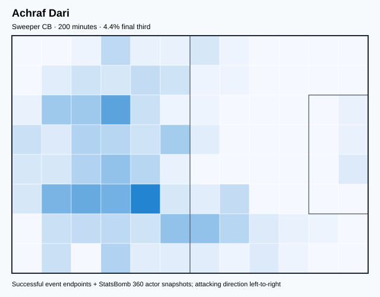

## Physical profile

| Metric | Score |
|---|---:|
| Aerial dominance | 0.600 |
| Pressing intensity per 90 | 8.98 |
| Recovery index per 90 | 3.59 |

## Top chemistry partners

- Sofyan Amrabat — synergy 0.517, 200 shared minutes
- Jawad El Yamiq — synergy 0.516, 200 shared minutes
- Yassine Bounou — synergy 0.496, 200 shared minutes

## Tactical recommendations

- Use a compact pressing trigger rather than sustained solo pressure.
- Target this player on direct restarts and back-post deliveries.
- Use recovery capacity to support higher attacking positions.

_The heatmap combines successful event endpoints with StatsBomb 360 actor
snapshots. StatsBomb 360 is freeze-frame context, not continuous player
tracking. Ratings include eligible outfield players from 45 minutes and
goalkeepers from 90 minutes; ranking status communicates sample reliability._

---

<!-- PLAYER_REPORT 21: 149714_starter_report.md -->

# Abdessamad Ezzalzouli — Starter Report

- Team: Morocco (MAR)
- Position: Left Wing
- Functional role: Wide Creator
- VAEP offense per 90: 0.1483
- VAEP defense per 90: -0.0092
- VAEP total per 90: 0.1391
- VAEP per touch: 0.00243
- Spatial xT per 90: 0.0687
- Final-third spatial share: 39.0%
- Unified final player rating: 0.1588
- Team rank: #5

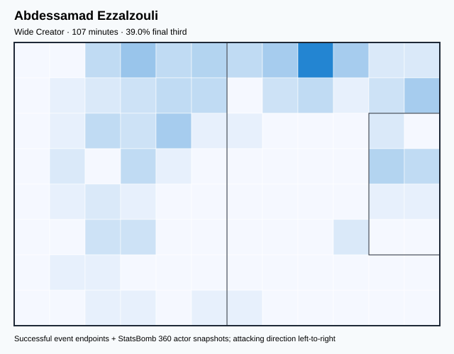

## Physical profile

| Metric | Score |
|---|---:|
| Aerial dominance | 0.333 |
| Pressing intensity per 90 | 31.99 |
| Recovery index per 90 | 5.05 |

## Top chemistry partners

- Yassine Bounou — synergy 0.300, 107 shared minutes
- Hakim Ziyech — synergy 0.295, 107 shared minutes
- Sofyan Amrabat — synergy 0.275, 107 shared minutes

## Tactical recommendations

- Lead the first pressing trigger and protect the inside passing lane.
- Use recovery capacity to support higher attacking positions.

_The heatmap combines successful event endpoints with StatsBomb 360 actor
snapshots. StatsBomb 360 is freeze-frame context, not continuous player
tracking. Ratings include eligible outfield players from 45 minutes and
goalkeepers from 90 minutes; ranking status communicates sample reliability._

---

<!-- PLAYER_REPORT 22: 156734_starter_report.md -->

# Bilal El Khannous — Starter Report

- Team: Morocco (MAR)
- Position: Right Center Midfield
- Functional role: Ball-Winner
- VAEP offense per 90: 0.0694
- VAEP defense per 90: -0.0969
- VAEP total per 90: -0.0274
- VAEP per touch: -0.00024
- Spatial xT per 90: -0.0110
- Final-third spatial share: 31.5%
- Unified final player rating: 0.0944
- Team rank: #9

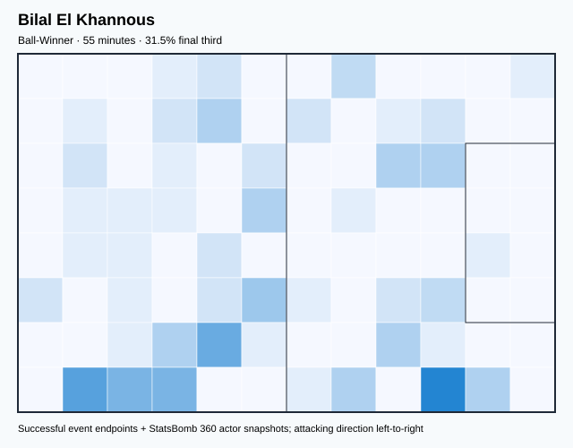

## Physical profile

| Metric | Score |
|---|---:|
| Aerial dominance | 0.000 |
| Pressing intensity per 90 | 21.26 |
| Recovery index per 90 | 0.00 |

## Top chemistry partners

- Hakim Ziyech — synergy 0.175, 55 shared minutes
- Jawad El Yamiq — synergy 0.173, 55 shared minutes
- Achraf Dari — synergy 0.171, 55 shared minutes

## Tactical recommendations

- Lead the first pressing trigger and protect the inside passing lane.
- Avoid isolating this player in high-volume aerial matchups.
- Pair with a faster recovery defender after aggressive rotations.

_The heatmap combines successful event endpoints with StatsBomb 360 actor
snapshots. StatsBomb 360 is freeze-frame context, not continuous player
tracking. Ratings include eligible outfield players from 45 minutes and
goalkeepers from 90 minutes; ranking status communicates sample reliability._

---

<!-- PLAYER_REPORT 23: 296254_starter_report.md -->

# Walid Cheddira — Starter Report

- Team: Morocco (MAR)
- Position: Center Forward
- Functional role: Target Forward
- VAEP offense per 90: 0.4235
- VAEP defense per 90: -0.0103
- VAEP total per 90: 0.4132
- VAEP per touch: 0.00773
- Spatial xT per 90: 0.0382
- Final-third spatial share: 26.4%
- Unified final player rating: 0.2359
- Team rank: #2

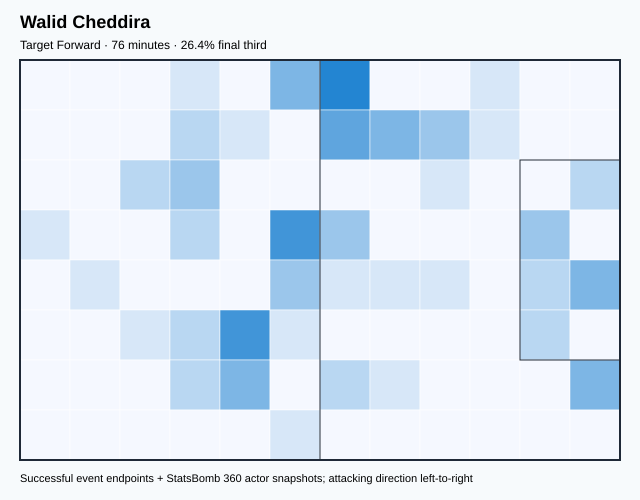

## Physical profile

| Metric | Score |
|---|---:|
| Aerial dominance | 0.500 |
| Pressing intensity per 90 | 24.96 |
| Recovery index per 90 | 1.19 |

## Top chemistry partners

- Yahia Attiyat allah — synergy 0.218, 74 shared minutes
- Yassine Bounou — synergy 0.202, 76 shared minutes
- Jawad El Yamiq — synergy 0.175, 73 shared minutes

## Tactical recommendations

- Lead the first pressing trigger and protect the inside passing lane.
- Pair with a faster recovery defender after aggressive rotations.

_The heatmap combines successful event endpoints with StatsBomb 360 actor
snapshots. StatsBomb 360 is freeze-frame context, not continuous player
tracking. Ratings include eligible outfield players from 45 minutes and
goalkeepers from 90 minutes; ranking status communicates sample reliability._
