# MEX — V4 Player Evaluation Collection

<!-- V5_CANONICAL_NOTICE -->
> **Historical V4 player-rating packet.** Player ratings, ranks, role-challenger decisions, and rating uncertainty below are superseded by `results/reports/player_rankings.csv`, `results/reports/player_profiles/`, and `results/reports/model_summary.md`. Possession, tactical, and match-bootstrap material remains a historical V4 result.

- Included eligible players: 18
- Rankings use the role-aware, development-gated VAEP/xT/xD model.
- Heatmaps combine successful on-ball endpoints and SB360 actor snapshots.

---

<!-- PLAYER_REPORT 1: 5567_starter_report.md -->

# Edson Omar Álvarez Velázquez — Starter Report

- Team: Mexico (MEX)
- Position: Center Defensive Midfield
- Functional role: Box-to-Box / Engine Midfielder
- VAEP offense per 90: 0.0428
- VAEP defense per 90: -0.0299
- VAEP total per 90: 0.0129
- VAEP per touch: 0.00010
- Spatial xT per 90: 0.0219
- Final-third spatial share: 11.6%
- Unified final player rating: 0.0185
- Team rank: #14

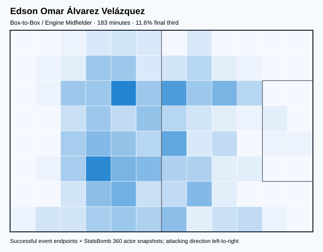

## Physical profile

| Metric | Score |
|---|---:|
| Aerial dominance | 0.688 |
| Pressing intensity per 90 | 17.68 |
| Recovery index per 90 | 3.93 |

## Top chemistry partners

- César Jasib Montes Castro — synergy 0.486, 183 shared minutes
- Luis Gerardo Chávez Magallón — synergy 0.482, 183 shared minutes
- Héctor Alfredo Moreno Herrera — synergy 0.473, 183 shared minutes

## Tactical recommendations

- Lead the first pressing trigger and protect the inside passing lane.
- Target this player on direct restarts and back-post deliveries.
- Use recovery capacity to support higher attacking positions.

_The heatmap combines successful event endpoints with StatsBomb 360 actor
snapshots. StatsBomb 360 is freeze-frame context, not continuous player
tracking. Ratings include eligible outfield players from 45 minutes and
goalkeepers from 90 minutes; ranking status communicates sample reliability._

---

<!-- PLAYER_REPORT 2: 5568_starter_report.md -->

# Raúl Alonso Jiménez Rodríguez — Starter Report

- Team: Mexico (MEX)
- Position: Center Forward
- Functional role: Target Forward
- VAEP offense per 90: 0.4455
- VAEP defense per 90: 0.1074
- VAEP total per 90: 0.5529
- VAEP per touch: 0.00554
- Spatial xT per 90: 0.0300
- Final-third spatial share: 56.5%
- Unified final player rating: 0.2459
- Team rank: #2

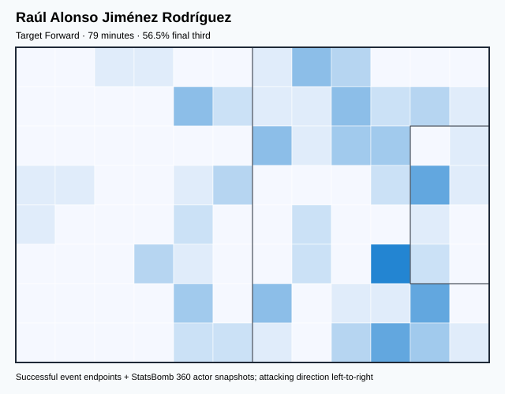

## Physical profile

| Metric | Score |
|---|---:|
| Aerial dominance | 0.750 |
| Pressing intensity per 90 | 2.27 |
| Recovery index per 90 | 3.40 |

## Top chemistry partners

- Jesús Daniel Gallardo Vasconcelos — synergy 0.224, 79 shared minutes
- Luis Gerardo Chávez Magallón — synergy 0.200, 79 shared minutes
- César Jasib Montes Castro — synergy 0.197, 79 shared minutes

## Tactical recommendations

- Use a compact pressing trigger rather than sustained solo pressure.
- Target this player on direct restarts and back-post deliveries.
- Use recovery capacity to support higher attacking positions.

_The heatmap combines successful event endpoints with StatsBomb 360 actor
snapshots. StatsBomb 360 is freeze-frame context, not continuous player
tracking. Ratings include eligible outfield players from 45 minutes and
goalkeepers from 90 minutes; ranking status communicates sample reliability._

---

<!-- PLAYER_REPORT 3: 5571_starter_report.md -->

# Hirving Rodrigo Lozano Bahena — Starter Report

- Team: Mexico (MEX)
- Position: Right Wing
- Functional role: Progressive Winger
- VAEP offense per 90: 0.2545
- VAEP defense per 90: 0.0664
- VAEP total per 90: 0.3209
- VAEP per touch: 0.00290
- Spatial xT per 90: 0.1701
- Final-third spatial share: 57.5%
- Unified final player rating: 0.1836
- Team rank: #3

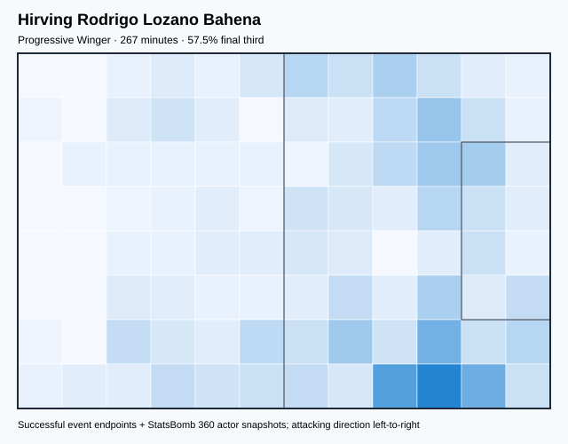

## Physical profile

| Metric | Score |
|---|---:|
| Aerial dominance | 0.067 |
| Pressing intensity per 90 | 17.17 |
| Recovery index per 90 | 5.39 |

## Top chemistry partners

- Luis Gerardo Chávez Magallón — synergy 0.475, 267 shared minutes
- Francisco Guillermo Ochoa Magaña — synergy 0.455, 267 shared minutes
- Héctor Alfredo Moreno Herrera — synergy 0.453, 267 shared minutes

## Tactical recommendations

- Lead the first pressing trigger and protect the inside passing lane.
- Avoid isolating this player in high-volume aerial matchups.
- Use recovery capacity to support higher attacking positions.

_The heatmap combines successful event endpoints with StatsBomb 360 actor
snapshots. StatsBomb 360 is freeze-frame context, not continuous player
tracking. Ratings include eligible outfield players from 45 minutes and
goalkeepers from 90 minutes; ranking status communicates sample reliability._

---

<!-- PLAYER_REPORT 4: 5573_starter_report.md -->

# Héctor Alfredo Moreno Herrera — Starter Report

- Team: Mexico (MEX)
- Position: Left Center Back
- Functional role: Sweeper CB
- VAEP offense per 90: 0.1292
- VAEP defense per 90: -0.0278
- VAEP total per 90: 0.1014
- VAEP per touch: 0.00068
- Spatial xT per 90: 0.0233
- Final-third spatial share: 4.7%
- Unified final player rating: 0.0163
- Team rank: #15

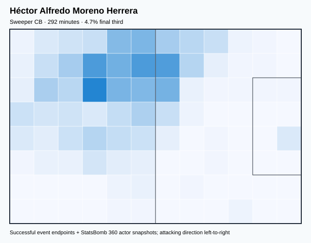

## Physical profile

| Metric | Score |
|---|---:|
| Aerial dominance | 0.417 |
| Pressing intensity per 90 | 5.25 |
| Recovery index per 90 | 3.40 |

## Top chemistry partners

- César Jasib Montes Castro — synergy 0.656, 292 shared minutes
- Jesús Daniel Gallardo Vasconcelos — synergy 0.653, 292 shared minutes
- Francisco Guillermo Ochoa Magaña — synergy 0.653, 292 shared minutes

## Tactical recommendations

- Use a compact pressing trigger rather than sustained solo pressure.
- Use recovery capacity to support higher attacking positions.

_The heatmap combines successful event endpoints with StatsBomb 360 actor
snapshots. StatsBomb 360 is freeze-frame context, not continuous player
tracking. Ratings include eligible outfield players from 45 minutes and
goalkeepers from 90 minutes; ranking status communicates sample reliability._

---

<!-- PLAYER_REPORT 5: 5575_starter_report.md -->

# Héctor Miguel Herrera López — Starter Report

- Team: Mexico (MEX)
- Position: Right Defensive Midfield
- Functional role: Holding Anchor
- VAEP offense per 90: 0.0888
- VAEP defense per 90: -0.0158
- VAEP total per 90: 0.0730
- VAEP per touch: 0.00071
- Spatial xT per 90: -0.0005
- Final-third spatial share: 28.7%
- Unified final player rating: 0.0257
- Team rank: #12

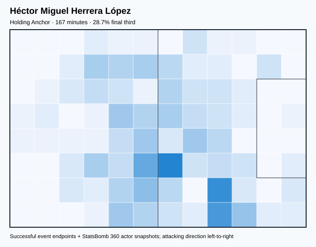

## Physical profile

| Metric | Score |
|---|---:|
| Aerial dominance | 0.778 |
| Pressing intensity per 90 | 15.11 |
| Recovery index per 90 | 4.32 |

## Top chemistry partners

- Francisco Guillermo Ochoa Magaña — synergy 0.434, 167 shared minutes
- Luis Gerardo Chávez Magallón — synergy 0.422, 167 shared minutes
- César Jasib Montes Castro — synergy 0.418, 167 shared minutes

## Tactical recommendations

- Lead the first pressing trigger and protect the inside passing lane.
- Target this player on direct restarts and back-post deliveries.
- Use recovery capacity to support higher attacking positions.

_The heatmap combines successful event endpoints with StatsBomb 360 actor
snapshots. StatsBomb 360 is freeze-frame context, not continuous player
tracking. Ratings include eligible outfield players from 45 minutes and
goalkeepers from 90 minutes; ranking status communicates sample reliability._

---

<!-- PLAYER_REPORT 6: 5576_starter_report.md -->

# Jesús Daniel Gallardo Vasconcelos — Starter Report

- Team: Mexico (MEX)
- Position: Left Back
- Functional role: Wide Creator
- VAEP offense per 90: 0.1528
- VAEP defense per 90: -0.0943
- VAEP total per 90: 0.0584
- VAEP per touch: 0.00060
- Spatial xT per 90: 0.0440
- Final-third spatial share: 29.4%
- Unified final player rating: 0.0476
- Team rank: #10

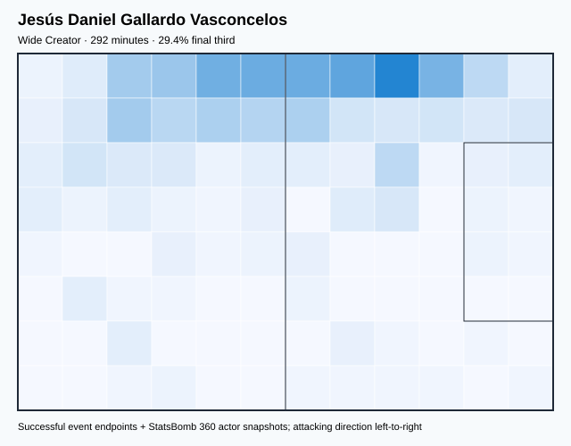

## Physical profile

| Metric | Score |
|---|---:|
| Aerial dominance | 1.000 |
| Pressing intensity per 90 | 19.14 |
| Recovery index per 90 | 4.01 |

## Top chemistry partners

- Héctor Alfredo Moreno Herrera — synergy 0.653, 292 shared minutes
- Francisco Guillermo Ochoa Magaña — synergy 0.641, 292 shared minutes
- César Jasib Montes Castro — synergy 0.635, 292 shared minutes

## Tactical recommendations

- Lead the first pressing trigger and protect the inside passing lane.
- Target this player on direct restarts and back-post deliveries.
- Use recovery capacity to support higher attacking positions.

_The heatmap combines successful event endpoints with StatsBomb 360 actor
snapshots. StatsBomb 360 is freeze-frame context, not continuous player
tracking. Ratings include eligible outfield players from 45 minutes and
goalkeepers from 90 minutes; ranking status communicates sample reliability._

---

<!-- PLAYER_REPORT 7: 5577_starter_report.md -->

# Francisco Guillermo Ochoa Magaña — Starter Report

- Team: Mexico (MEX)
- Position: Goalkeeper
- Functional role: Goalkeeper
- VAEP offense per 90: -0.0106
- VAEP defense per 90: -0.1033
- VAEP total per 90: -0.1139
- VAEP per touch: -0.00167
- Spatial xT per 90: -0.0001
- Final-third spatial share: 0.3%
- Unified final player rating: -0.0597
- Team rank: #18

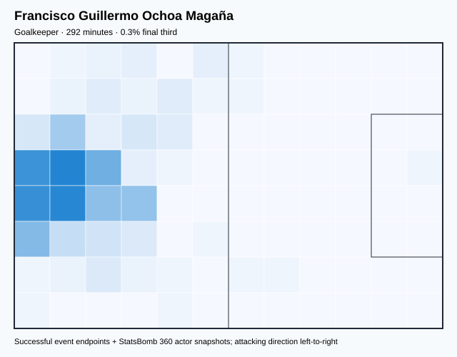

## Physical profile

| Metric | Score |
|---|---:|
| Aerial dominance | 0.000 |
| Pressing intensity per 90 | 0.00 |
| Recovery index per 90 | 5.25 |

## Top chemistry partners

- César Jasib Montes Castro — synergy 0.654, 292 shared minutes
- Héctor Alfredo Moreno Herrera — synergy 0.653, 292 shared minutes
- Jesús Daniel Gallardo Vasconcelos — synergy 0.641, 292 shared minutes

## Tactical recommendations

- Use a compact pressing trigger rather than sustained solo pressure.
- Avoid isolating this player in high-volume aerial matchups.
- Use recovery capacity to support higher attacking positions.

_The heatmap combines successful event endpoints with StatsBomb 360 actor
snapshots. StatsBomb 360 is freeze-frame context, not continuous player
tracking. Ratings include eligible outfield players from 45 minutes and
goalkeepers from 90 minutes; ranking status communicates sample reliability._

---

<!-- PLAYER_REPORT 8: 11388_starter_report.md -->

# Néstor Alejandro Araújo Razo — Starter Report

- Team: Mexico (MEX)
- Position: Right Center Back
- Functional role: Deep Playmaker
- VAEP offense per 90: 0.0122
- VAEP defense per 90: -0.0042
- VAEP total per 90: 0.0080
- VAEP per touch: 0.00006
- Spatial xT per 90: 0.0710
- Final-third spatial share: 11.6%
- Unified final player rating: -0.0043
- Team rank: #17

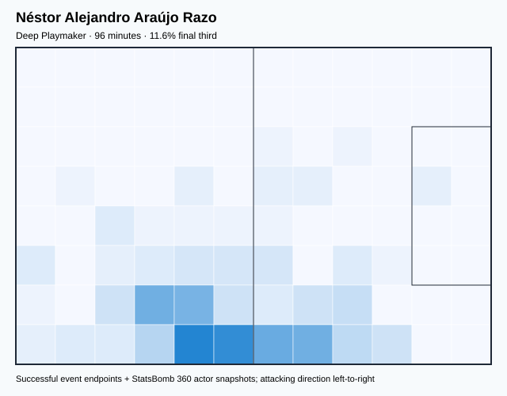

## Physical profile

| Metric | Score |
|---|---:|
| Aerial dominance | 1.000 |
| Pressing intensity per 90 | 6.53 |
| Recovery index per 90 | 5.60 |

## Top chemistry partners

- Héctor Miguel Herrera López — synergy 0.292, 96 shared minutes
- Luis Gerardo Chávez Magallón — synergy 0.291, 96 shared minutes
- César Jasib Montes Castro — synergy 0.287, 96 shared minutes

## Tactical recommendations

- Use a compact pressing trigger rather than sustained solo pressure.
- Target this player on direct restarts and back-post deliveries.
- Use recovery capacity to support higher attacking positions.

_The heatmap combines successful event endpoints with StatsBomb 360 actor
snapshots. StatsBomb 360 is freeze-frame context, not continuous player
tracking. Ratings include eligible outfield players from 45 minutes and
goalkeepers from 90 minutes; ranking status communicates sample reliability._

---

<!-- PLAYER_REPORT 9: 15452_starter_report.md -->

# Carlos Uriel Antuna Romero — Starter Report

- Team: Mexico (MEX)
- Position: Right Wing
- Functional role: Progressive Winger
- VAEP offense per 90: 0.2836
- VAEP defense per 90: 0.0041
- VAEP total per 90: 0.2877
- VAEP per touch: 0.00389
- Spatial xT per 90: 0.0329
- Final-third spatial share: 57.3%
- Unified final player rating: 0.1721
- Team rank: #4

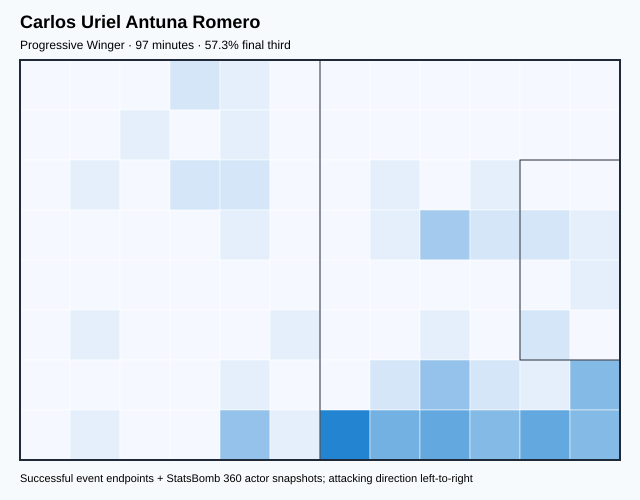

## Physical profile

| Metric | Score |
|---|---:|
| Aerial dominance | 0.000 |
| Pressing intensity per 90 | 8.32 |
| Recovery index per 90 | 0.92 |

## Top chemistry partners

- César Jasib Montes Castro — synergy 0.278, 97 shared minutes
- Héctor Alfredo Moreno Herrera — synergy 0.273, 97 shared minutes
- Jesús Daniel Gallardo Vasconcelos — synergy 0.268, 97 shared minutes

## Tactical recommendations

- Use a compact pressing trigger rather than sustained solo pressure.
- Avoid isolating this player in high-volume aerial matchups.
- Pair with a faster recovery defender after aggressive rotations.

_The heatmap combines successful event endpoints with StatsBomb 360 actor
snapshots. StatsBomb 360 is freeze-frame context, not continuous player
tracking. Ratings include eligible outfield players from 45 minutes and
goalkeepers from 90 minutes; ranking status communicates sample reliability._

---

<!-- PLAYER_REPORT 10: 15872_starter_report.md -->

# Érick Gabriel Gutiérrez Galaviz — Starter Report

- Team: Mexico (MEX)
- Position: Left Defensive Midfield
- Functional role: Holding Anchor
- VAEP offense per 90: 0.0107
- VAEP defense per 90: 0.0007
- VAEP total per 90: 0.0113
- VAEP per touch: 0.00009
- Spatial xT per 90: 0.0002
- Final-third spatial share: 13.2%
- Unified final player rating: 0.0199
- Team rank: #13

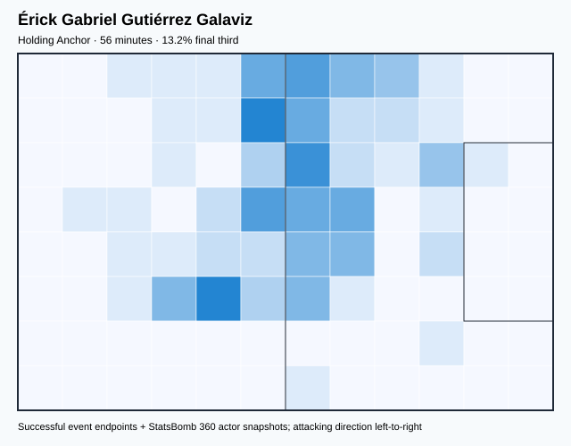

## Physical profile

| Metric | Score |
|---|---:|
| Aerial dominance | 1.000 |
| Pressing intensity per 90 | 24.27 |
| Recovery index per 90 | 1.62 |

## Top chemistry partners

- Héctor Alfredo Moreno Herrera — synergy 0.180, 56 shared minutes
- César Jasib Montes Castro — synergy 0.180, 56 shared minutes
- Héctor Miguel Herrera López — synergy 0.178, 56 shared minutes

## Tactical recommendations

- Lead the first pressing trigger and protect the inside passing lane.
- Target this player on direct restarts and back-post deliveries.
- Pair with a faster recovery defender after aggressive rotations.

_The heatmap combines successful event endpoints with StatsBomb 360 actor
snapshots. StatsBomb 360 is freeze-frame context, not continuous player
tracking. Ratings include eligible outfield players from 45 minutes and
goalkeepers from 90 minutes; ranking status communicates sample reliability._

---

<!-- PLAYER_REPORT 11: 26280_starter_report.md -->

# Orbelín Pineda Alvarado — Starter Report

- Team: Mexico (MEX)
- Position: Center Attacking Midfield
- Functional role: Holding Anchor
- VAEP offense per 90: 0.2770
- VAEP defense per 90: -0.0381
- VAEP total per 90: 0.2389
- VAEP per touch: 0.00193
- Spatial xT per 90: 0.0147
- Final-third spatial share: 38.9%
- Unified final player rating: 0.1688
- Team rank: #6

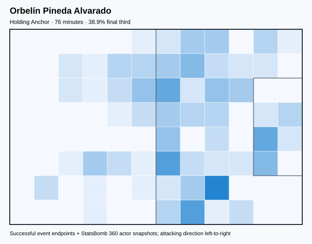

## Physical profile

| Metric | Score |
|---|---:|
| Aerial dominance | 0.500 |
| Pressing intensity per 90 | 30.63 |
| Recovery index per 90 | 8.25 |

## Top chemistry partners

- Jorge Eduardo Sánchez Ramos — synergy 0.235, 76 shared minutes
- Héctor Alfredo Moreno Herrera — synergy 0.231, 76 shared minutes
- César Jasib Montes Castro — synergy 0.231, 76 shared minutes

## Tactical recommendations

- Lead the first pressing trigger and protect the inside passing lane.
- Use recovery capacity to support higher attacking positions.

_The heatmap combines successful event endpoints with StatsBomb 360 actor
snapshots. StatsBomb 360 is freeze-frame context, not continuous player
tracking. Ratings include eligible outfield players from 45 minutes and
goalkeepers from 90 minutes; ranking status communicates sample reliability._

---

<!-- PLAYER_REPORT 12: 26297_starter_report.md -->

# Carlos Alberto Rodríguez Gómez — Starter Report

- Team: Mexico (MEX)
- Position: Right Center Midfield
- Functional role: Progressive Winger
- VAEP offense per 90: 0.1045
- VAEP defense per 90: 0.0040
- VAEP total per 90: 0.1085
- VAEP per touch: 0.00063
- Spatial xT per 90: 0.0143
- Final-third spatial share: 19.4%
- Unified final player rating: 0.1030
- Team rank: #7

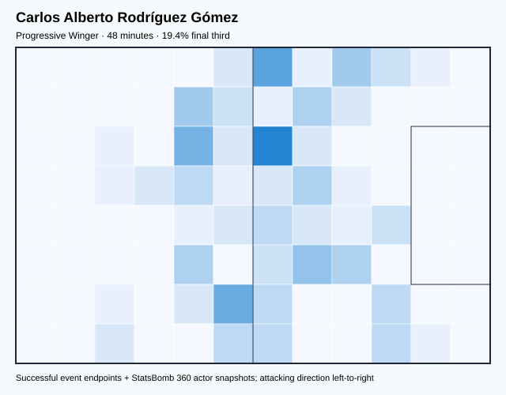

## Physical profile

| Metric | Score |
|---|---:|
| Aerial dominance | 0.000 |
| Pressing intensity per 90 | 7.44 |
| Recovery index per 90 | 7.44 |

## Top chemistry partners

- César Jasib Montes Castro — synergy 0.155, 48 shared minutes
- Jesús Daniel Gallardo Vasconcelos — synergy 0.152, 48 shared minutes
- Luis Gerardo Chávez Magallón — synergy 0.150, 48 shared minutes

## Tactical recommendations

- Use a compact pressing trigger rather than sustained solo pressure.
- Avoid isolating this player in high-volume aerial matchups.
- Use recovery capacity to support higher attacking positions.

_The heatmap combines successful event endpoints with StatsBomb 360 actor
snapshots. StatsBomb 360 is freeze-frame context, not continuous player
tracking. Ratings include eligible outfield players from 45 minutes and
goalkeepers from 90 minutes; ranking status communicates sample reliability._

---

<!-- PLAYER_REPORT 13: 26301_starter_report.md -->

# Ernesto Alexis Vega Rojas — Starter Report

- Team: Mexico (MEX)
- Position: Left Wing
- Functional role: Progressive Winger
- VAEP offense per 90: 0.2690
- VAEP defense per 90: 0.0407
- VAEP total per 90: 0.3097
- VAEP per touch: 0.00309
- Spatial xT per 90: 0.0119
- Final-third spatial share: 38.4%
- Unified final player rating: 0.1710
- Team rank: #5

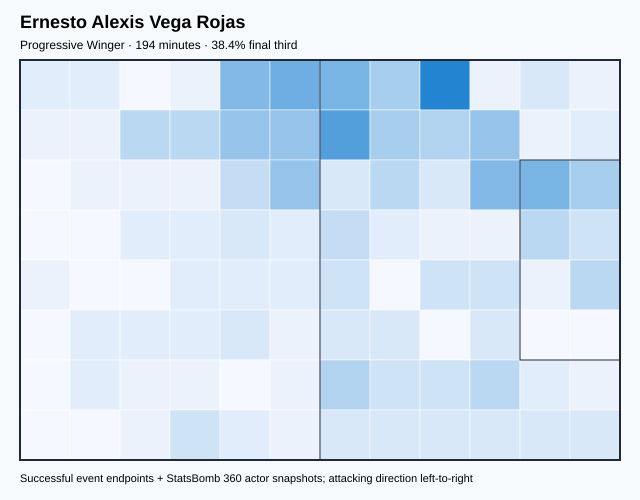

## Physical profile

| Metric | Score |
|---|---:|
| Aerial dominance | 0.143 |
| Pressing intensity per 90 | 15.30 |
| Recovery index per 90 | 7.42 |

## Top chemistry partners

- Héctor Alfredo Moreno Herrera — synergy 0.478, 194 shared minutes
- César Jasib Montes Castro — synergy 0.439, 194 shared minutes
- Luis Gerardo Chávez Magallón — synergy 0.433, 194 shared minutes

## Tactical recommendations

- Lead the first pressing trigger and protect the inside passing lane.
- Avoid isolating this player in high-volume aerial matchups.
- Use recovery capacity to support higher attacking positions.

_The heatmap combines successful event endpoints with StatsBomb 360 actor
snapshots. StatsBomb 360 is freeze-frame context, not continuous player
tracking. Ratings include eligible outfield players from 45 minutes and
goalkeepers from 90 minutes; ranking status communicates sample reliability._

---

<!-- PLAYER_REPORT 14: 26368_starter_report.md -->

# César Jasib Montes Castro — Starter Report

- Team: Mexico (MEX)
- Position: Right Center Back
- Functional role: Sweeper CB
- VAEP offense per 90: 0.0573
- VAEP defense per 90: -0.0312
- VAEP total per 90: 0.0261
- VAEP per touch: 0.00017
- Spatial xT per 90: 0.0112
- Final-third spatial share: 5.3%
- Unified final player rating: 0.0005
- Team rank: #16

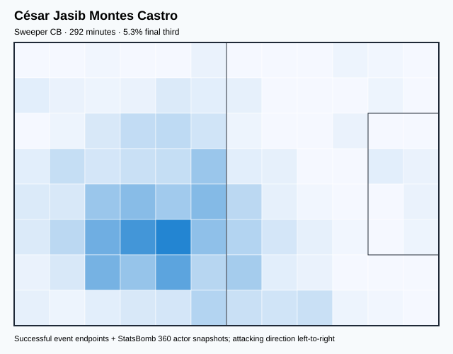

## Physical profile

| Metric | Score |
|---|---:|
| Aerial dominance | 0.611 |
| Pressing intensity per 90 | 5.87 |
| Recovery index per 90 | 1.85 |

## Top chemistry partners

- Héctor Alfredo Moreno Herrera — synergy 0.656, 292 shared minutes
- Francisco Guillermo Ochoa Magaña — synergy 0.654, 292 shared minutes
- Jesús Daniel Gallardo Vasconcelos — synergy 0.635, 292 shared minutes

## Tactical recommendations

- Use a compact pressing trigger rather than sustained solo pressure.
- Target this player on direct restarts and back-post deliveries.
- Pair with a faster recovery defender after aggressive rotations.

_The heatmap combines successful event endpoints with StatsBomb 360 actor
snapshots. StatsBomb 360 is freeze-frame context, not continuous player
tracking. Ratings include eligible outfield players from 45 minutes and
goalkeepers from 90 minutes; ranking status communicates sample reliability._

---

<!-- PLAYER_REPORT 15: 26400_starter_report.md -->

# Henry Josué Martín Mex — Starter Report

- Team: Mexico (MEX)
- Position: Center Forward
- Functional role: Target Forward
- VAEP offense per 90: 0.7312
- VAEP defense per 90: 0.0088
- VAEP total per 90: 0.7401
- VAEP per touch: 0.01183
- Spatial xT per 90: -0.0024
- Final-third spatial share: 49.4%
- Unified final player rating: 0.2721
- Team rank: #1

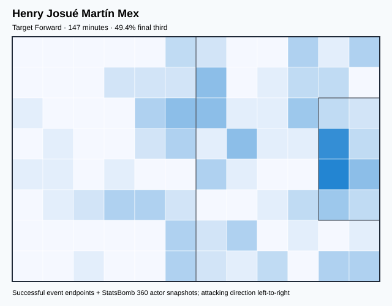

## Physical profile

| Metric | Score |
|---|---:|
| Aerial dominance | 0.500 |
| Pressing intensity per 90 | 16.56 |
| Recovery index per 90 | 0.61 |

## Top chemistry partners

- Luis Gerardo Chávez Magallón — synergy 0.401, 147 shared minutes
- Jesús Daniel Gallardo Vasconcelos — synergy 0.389, 147 shared minutes
- Francisco Guillermo Ochoa Magaña — synergy 0.371, 147 shared minutes

## Tactical recommendations

- Lead the first pressing trigger and protect the inside passing lane.
- Pair with a faster recovery defender after aggressive rotations.

_The heatmap combines successful event endpoints with StatsBomb 360 actor
snapshots. StatsBomb 360 is freeze-frame context, not continuous player
tracking. Ratings include eligible outfield players from 45 minutes and
goalkeepers from 90 minutes; ranking status communicates sample reliability._

---

<!-- PLAYER_REPORT 16: 26406_starter_report.md -->

# Jorge Eduardo Sánchez Ramos — Starter Report

- Team: Mexico (MEX)
- Position: Right Back
- Functional role: Deep Playmaker
- VAEP offense per 90: 0.1504
- VAEP defense per 90: -0.0245
- VAEP total per 90: 0.1258
- VAEP per touch: 0.00119
- Spatial xT per 90: 0.0334
- Final-third spatial share: 33.1%
- Unified final player rating: 0.0584
- Team rank: #8

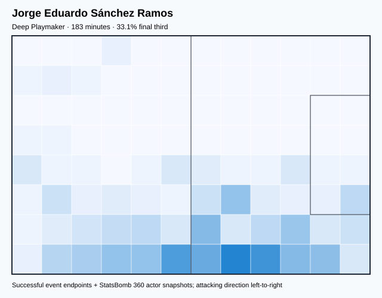

## Physical profile

| Metric | Score |
|---|---:|
| Aerial dominance | 0.667 |
| Pressing intensity per 90 | 9.83 |
| Recovery index per 90 | 2.46 |

## Top chemistry partners

- César Jasib Montes Castro — synergy 0.485, 183 shared minutes
- Luis Gerardo Chávez Magallón — synergy 0.457, 183 shared minutes
- Héctor Alfredo Moreno Herrera — synergy 0.452, 183 shared minutes

## Tactical recommendations

- Use a compact pressing trigger rather than sustained solo pressure.
- Target this player on direct restarts and back-post deliveries.
- Pair with a faster recovery defender after aggressive rotations.

_The heatmap combines successful event endpoints with StatsBomb 360 actor
snapshots. StatsBomb 360 is freeze-frame context, not continuous player
tracking. Ratings include eligible outfield players from 45 minutes and
goalkeepers from 90 minutes; ranking status communicates sample reliability._

---

<!-- PLAYER_REPORT 17: 28825_starter_report.md -->

# Luis Gerardo Chávez Magallón — Starter Report

- Team: Mexico (MEX)
- Position: Left Defensive Midfield
- Functional role: Progressive Winger
- VAEP offense per 90: 0.1048
- VAEP defense per 90: 0.0040
- VAEP total per 90: 0.1088
- VAEP per touch: 0.00089
- Spatial xT per 90: 0.0750
- Final-third spatial share: 31.6%
- Unified final player rating: 0.0405
- Team rank: #11

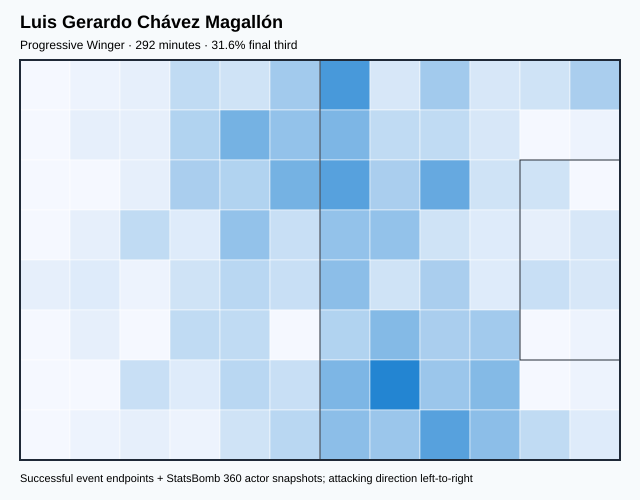

## Physical profile

| Metric | Score |
|---|---:|
| Aerial dominance | 0.462 |
| Pressing intensity per 90 | 13.58 |
| Recovery index per 90 | 4.01 |

## Top chemistry partners

- Héctor Alfredo Moreno Herrera — synergy 0.612, 292 shared minutes
- Jesús Daniel Gallardo Vasconcelos — synergy 0.605, 292 shared minutes
- Francisco Guillermo Ochoa Magaña — synergy 0.580, 292 shared minutes

## Tactical recommendations

- Lead the first pressing trigger and protect the inside passing lane.
- Use recovery capacity to support higher attacking positions.

_The heatmap combines successful event endpoints with StatsBomb 360 actor
snapshots. StatsBomb 360 is freeze-frame context, not continuous player
tracking. Ratings include eligible outfield players from 45 minutes and
goalkeepers from 90 minutes; ranking status communicates sample reliability._

---

<!-- PLAYER_REPORT 18: 30500_starter_report.md -->

# Kevin Nahin Álvarez Campos — Starter Report

- Team: Mexico (MEX)
- Position: Right Wing Back
- Functional role: Attacking Wingback
- VAEP offense per 90: 0.0627
- VAEP defense per 90: 0.0200
- VAEP total per 90: 0.0827
- VAEP per touch: 0.00109
- Spatial xT per 90: 0.0566
- Final-third spatial share: 53.5%
- Unified final player rating: 0.0536
- Team rank: #9

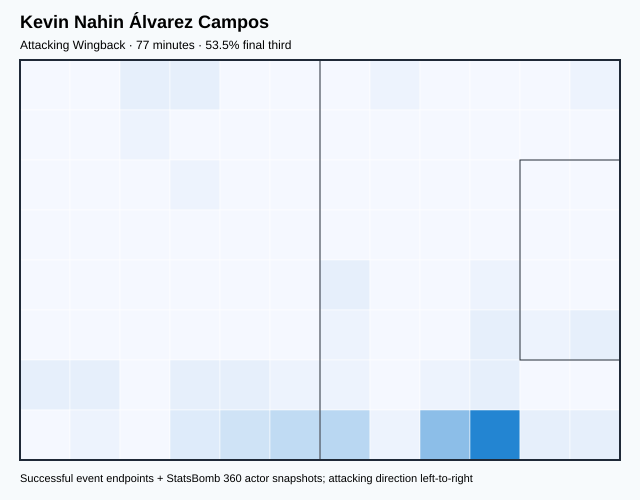

## Physical profile

| Metric | Score |
|---|---:|
| Aerial dominance | 0.000 |
| Pressing intensity per 90 | 13.98 |
| Recovery index per 90 | 2.33 |

## Top chemistry partners

- César Jasib Montes Castro — synergy 0.228, 77 shared minutes
- Héctor Alfredo Moreno Herrera — synergy 0.225, 77 shared minutes
- Jesús Daniel Gallardo Vasconcelos — synergy 0.220, 77 shared minutes

## Tactical recommendations

- Lead the first pressing trigger and protect the inside passing lane.
- Avoid isolating this player in high-volume aerial matchups.
- Pair with a faster recovery defender after aggressive rotations.

_The heatmap combines successful event endpoints with StatsBomb 360 actor
snapshots. StatsBomb 360 is freeze-frame context, not continuous player
tracking. Ratings include eligible outfield players from 45 minutes and
goalkeepers from 90 minutes; ranking status communicates sample reliability._
