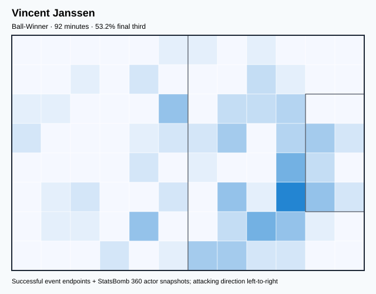
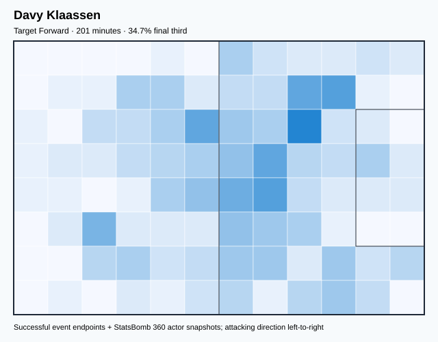
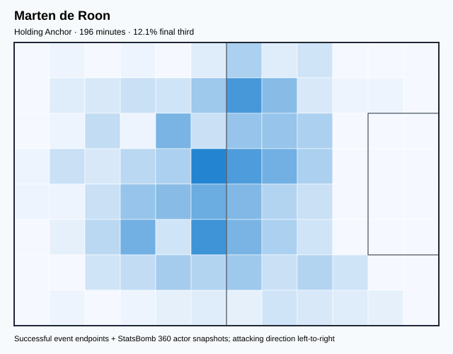
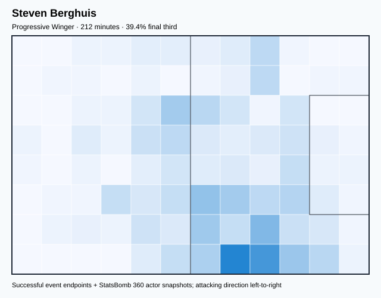
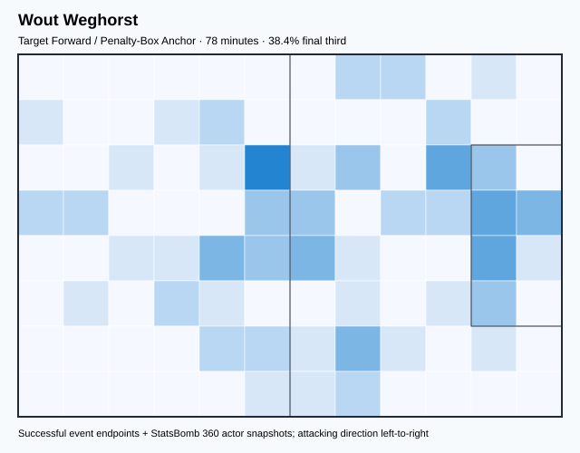
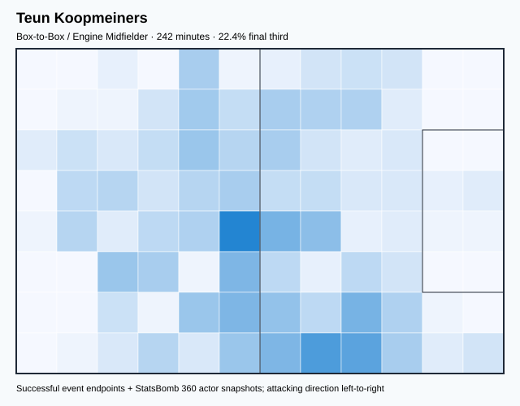
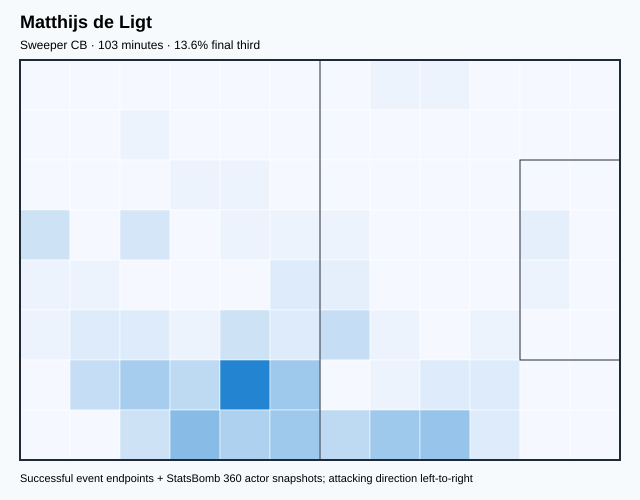
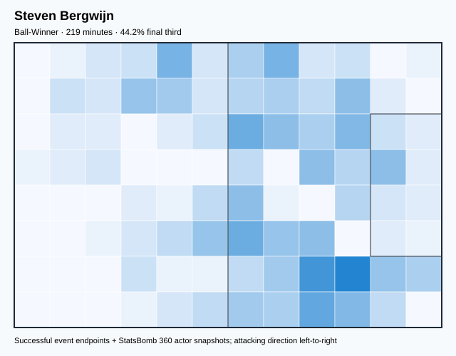
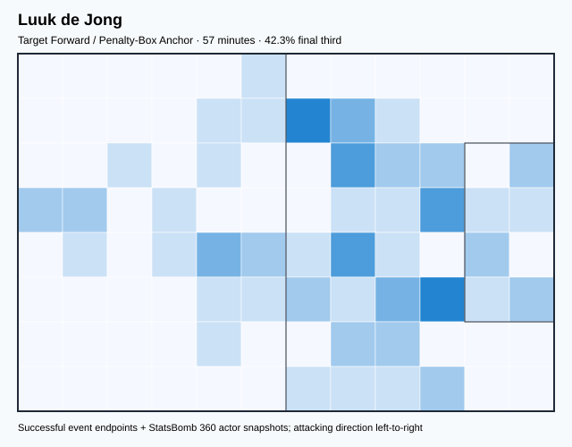

# NED — V4 Player Evaluation Collection

<!-- V5_CANONICAL_NOTICE -->
> **Historical V4 player-rating packet.** Player ratings, ranks, role-challenger decisions, and rating uncertainty below are superseded by `results/reports/player_rankings.csv`, `results/reports/player_profiles/`, and `results/reports/model_summary.md`. Possession, tactical, and match-bootstrap material remains a historical V4 result.

- Included eligible players: 18
- Rankings use the role-aware, development-gated VAEP/xT/xD model.
- Heatmaps combine successful on-ball endpoints and SB360 actor snapshots.

---

<!-- PLAYER_REPORT 1: 2988_starter_report.md -->

# Memphis Depay — Starter Report

- Team: Netherlands (NED)
- Position: Left Center Forward
- Functional role: Target Forward
- VAEP offense per 90: 0.3792
- VAEP defense per 90: 0.1147
- VAEP total per 90: 0.4939
- VAEP per touch: 0.00353
- Spatial xT per 90: 0.0469
- Final-third spatial share: 43.2%
- Unified final player rating: 0.2467
- Team rank: #1

## Physical profile

| Metric | Score |
|---|---:|
| Aerial dominance | 0.200 |
| Pressing intensity per 90 | 13.12 |
| Recovery index per 90 | 2.00 |

## Top chemistry partners

- Nathan Aké — synergy 0.608, 316 shared minutes
- Virgil van Dijk — synergy 0.600, 316 shared minutes
- Frenkie de Jong — synergy 0.580, 316 shared minutes

## Tactical recommendations

- Lead the first pressing trigger and protect the inside passing lane.
- Pair with a faster recovery defender after aggressive rotations.

_The heatmap combines successful event endpoints with StatsBomb 360 actor
snapshots. StatsBomb 360 is freeze-frame context, not continuous player
tracking. Ratings include eligible outfield players from 45 minutes and
goalkeepers from 90 minutes; ranking status communicates sample reliability._

---

<!-- PLAYER_REPORT 2: 3264_starter_report.md -->

# Vincent Janssen — Starter Report

- Team: Netherlands (NED)
- Position: Right Center Forward
- Functional role: Ball-Winner
- VAEP offense per 90: 0.4282
- VAEP defense per 90: 0.0318
- VAEP total per 90: 0.4601
- VAEP per touch: 0.00586
- Spatial xT per 90: -0.0546
- Final-third spatial share: 53.2%
- Unified final player rating: 0.2361
- Team rank: #2

## Physical profile

| Metric | Score |
|---|---:|
| Aerial dominance | 0.000 |
| Pressing intensity per 90 | 18.65 |
| Recovery index per 90 | 1.96 |

## Top chemistry partners

- Virgil van Dijk — synergy 0.260, 92 shared minutes
- Nathan Aké — synergy 0.255, 92 shared minutes
- Andries Noppert — synergy 0.255, 92 shared minutes

## Tactical recommendations

- Lead the first pressing trigger and protect the inside passing lane.
- Avoid isolating this player in high-volume aerial matchups.
- Pair with a faster recovery defender after aggressive rotations.

_The heatmap combines successful event endpoints with StatsBomb 360 actor
snapshots. StatsBomb 360 is freeze-frame context, not continuous player
tracking. Ratings include eligible outfield players from 45 minutes and
goalkeepers from 90 minutes; ranking status communicates sample reliability._

---

<!-- PLAYER_REPORT 3: 3306_starter_report.md -->

# Nathan Aké — Starter Report

- Team: Netherlands (NED)
- Position: Left Center Back
- Functional role: Sweeper CB
- VAEP offense per 90: 0.0114
- VAEP defense per 90: -0.0767
- VAEP total per 90: -0.0653
- VAEP per touch: -0.00039
- Spatial xT per 90: 0.0173
- Final-third spatial share: 6.5%
- Unified final player rating: -0.0198
- Team rank: #16

## Physical profile

| Metric | Score |
|---|---:|
| Aerial dominance | 0.500 |
| Pressing intensity per 90 | 10.49 |
| Recovery index per 90 | 2.13 |

## Top chemistry partners

- Andries Noppert — synergy 0.839, 506 shared minutes
- Virgil van Dijk — synergy 0.837, 506 shared minutes
- Frenkie de Jong — synergy 0.820, 496 shared minutes

## Tactical recommendations

- Use a compact pressing trigger rather than sustained solo pressure.
- Pair with a faster recovery defender after aggressive rotations.

_The heatmap combines successful event endpoints with StatsBomb 360 actor
snapshots. StatsBomb 360 is freeze-frame context, not continuous player
tracking. Ratings include eligible outfield players from 45 minutes and
goalkeepers from 90 minutes; ranking status communicates sample reliability._

---

<!-- PLAYER_REPORT 4: 3311_starter_report.md -->

# Daley Blind — Starter Report

- Team: Netherlands (NED)
- Position: Left Wing Back
- Functional role: Attacking Wingback
- VAEP offense per 90: 0.1373
- VAEP defense per 90: -0.0335
- VAEP total per 90: 0.1038
- VAEP per touch: 0.00066
- Spatial xT per 90: 0.0512
- Final-third spatial share: 28.9%
- Unified final player rating: 0.0580
- Team rank: #9

## Physical profile

| Metric | Score |
|---|---:|
| Aerial dominance | 0.429 |
| Pressing intensity per 90 | 17.70 |
| Recovery index per 90 | 2.59 |

## Top chemistry partners

- Nathan Aké — synergy 0.786, 449 shared minutes
- Frenkie de Jong — synergy 0.763, 442 shared minutes
- Virgil van Dijk — synergy 0.736, 452 shared minutes

## Tactical recommendations

- Lead the first pressing trigger and protect the inside passing lane.
- Use recovery capacity to support higher attacking positions.

_The heatmap combines successful event endpoints with StatsBomb 360 actor
snapshots. StatsBomb 360 is freeze-frame context, not continuous player
tracking. Ratings include eligible outfield players from 45 minutes and
goalkeepers from 90 minutes; ranking status communicates sample reliability._

---

<!-- PLAYER_REPORT 5: 3669_starter_report.md -->

# Virgil van Dijk — Starter Report

- Team: Netherlands (NED)
- Position: Center Back
- Functional role: Sweeper CB
- VAEP offense per 90: -0.0092
- VAEP defense per 90: -0.1503
- VAEP total per 90: -0.1596
- VAEP per touch: -0.00102
- Spatial xT per 90: 0.0151
- Final-third spatial share: 2.8%
- Unified final player rating: -0.0452
- Team rank: #18

## Physical profile

| Metric | Score |
|---|---:|
| Aerial dominance | 0.643 |
| Pressing intensity per 90 | 6.01 |
| Recovery index per 90 | 1.41 |

## Top chemistry partners

- Andries Noppert — synergy 0.840, 510 shared minutes
- Nathan Aké — synergy 0.837, 506 shared minutes
- Frenkie de Jong — synergy 0.820, 499 shared minutes

## Tactical recommendations

- Use a compact pressing trigger rather than sustained solo pressure.
- Target this player on direct restarts and back-post deliveries.
- Pair with a faster recovery defender after aggressive rotations.

_The heatmap combines successful event endpoints with StatsBomb 360 actor
snapshots. StatsBomb 360 is freeze-frame context, not continuous player
tracking. Ratings include eligible outfield players from 45 minutes and
goalkeepers from 90 minutes; ranking status communicates sample reliability._

---

<!-- PLAYER_REPORT 6: 4318_starter_report.md -->

# Davy Klaassen — Starter Report

- Team: Netherlands (NED)
- Position: Center Attacking Midfield
- Functional role: Target Forward
- VAEP offense per 90: 0.2124
- VAEP defense per 90: 0.0554
- VAEP total per 90: 0.2678
- VAEP per touch: 0.00274
- Spatial xT per 90: 0.0310
- Final-third spatial share: 34.7%
- Unified final player rating: 0.1656
- Team rank: #7

## Physical profile

| Metric | Score |
|---|---:|
| Aerial dominance | 0.400 |
| Pressing intensity per 90 | 10.28 |
| Recovery index per 90 | 2.68 |

## Top chemistry partners

- Nathan Aké — synergy 0.509, 201 shared minutes
- Andries Noppert — synergy 0.475, 201 shared minutes
- Virgil van Dijk — synergy 0.474, 201 shared minutes

## Tactical recommendations

- Use a compact pressing trigger rather than sustained solo pressure.
- Use recovery capacity to support higher attacking positions.

_The heatmap combines successful event endpoints with StatsBomb 360 actor
snapshots. StatsBomb 360 is freeze-frame context, not continuous player
tracking. Ratings include eligible outfield players from 45 minutes and
goalkeepers from 90 minutes; ranking status communicates sample reliability._

---

<!-- PLAYER_REPORT 7: 6994_starter_report.md -->

# Marten de Roon — Starter Report

- Team: Netherlands (NED)
- Position: Right Defensive Midfield
- Functional role: Holding Anchor
- VAEP offense per 90: 0.0088
- VAEP defense per 90: -0.0756
- VAEP total per 90: -0.0668
- VAEP per touch: -0.00048
- Spatial xT per 90: 0.0038
- Final-third spatial share: 12.1%
- Unified final player rating: 0.0052
- Team rank: #13

## Physical profile

| Metric | Score |
|---|---:|
| Aerial dominance | 0.625 |
| Pressing intensity per 90 | 23.90 |
| Recovery index per 90 | 1.38 |

## Top chemistry partners

- Virgil van Dijk — synergy 0.506, 196 shared minutes
- Nathan Aké — synergy 0.496, 196 shared minutes
- Daley Blind — synergy 0.490, 196 shared minutes

## Tactical recommendations

- Lead the first pressing trigger and protect the inside passing lane.
- Target this player on direct restarts and back-post deliveries.
- Pair with a faster recovery defender after aggressive rotations.

_The heatmap combines successful event endpoints with StatsBomb 360 actor
snapshots. StatsBomb 360 is freeze-frame context, not continuous player
tracking. Ratings include eligible outfield players from 45 minutes and
goalkeepers from 90 minutes; ranking status communicates sample reliability._

---

<!-- PLAYER_REPORT 8: 7745_starter_report.md -->

# Steven Berghuis — Starter Report

- Team: Netherlands (NED)
- Position: Right Defensive Midfield
- Functional role: Progressive Winger
- VAEP offense per 90: 0.0654
- VAEP defense per 90: 0.0074
- VAEP total per 90: 0.0728
- VAEP per touch: 0.00047
- Spatial xT per 90: 0.1062
- Final-third spatial share: 39.4%
- Unified final player rating: 0.0332
- Team rank: #11

## Physical profile

| Metric | Score |
|---|---:|
| Aerial dominance | 0.250 |
| Pressing intensity per 90 | 13.15 |
| Recovery index per 90 | 3.82 |

## Top chemistry partners

- Nathan Aké — synergy 0.532, 212 shared minutes
- Virgil van Dijk — synergy 0.508, 212 shared minutes
- Andries Noppert — synergy 0.505, 212 shared minutes

## Tactical recommendations

- Lead the first pressing trigger and protect the inside passing lane.
- Use recovery capacity to support higher attacking positions.

_The heatmap combines successful event endpoints with StatsBomb 360 actor
snapshots. StatsBomb 360 is freeze-frame context, not continuous player
tracking. Ratings include eligible outfield players from 45 minutes and
goalkeepers from 90 minutes; ranking status communicates sample reliability._

---

<!-- PLAYER_REPORT 9: 7829_starter_report.md -->

# Wout Weghorst — Starter Report

- Team: Netherlands (NED)
- Position: Right Center Forward
- Functional role: Target Forward / Penalty-Box Anchor
- VAEP offense per 90: 0.1751
- VAEP defense per 90: 0.0038
- VAEP total per 90: 0.1789
- VAEP per touch: 0.00296
- Spatial xT per 90: -0.0173
- Final-third spatial share: 38.4%
- Unified final player rating: 0.2168
- Team rank: #4

## Physical profile

| Metric | Score |
|---|---:|
| Aerial dominance | 0.500 |
| Pressing intensity per 90 | 34.84 |
| Recovery index per 90 | 1.16 |

## Top chemistry partners

- Virgil van Dijk — synergy 0.225, 78 shared minutes
- Jurriën David Norman Timber — synergy 0.225, 78 shared minutes
- Nathan Aké — synergy 0.221, 74 shared minutes

## Tactical recommendations

- Lead the first pressing trigger and protect the inside passing lane.
- Pair with a faster recovery defender after aggressive rotations.

_The heatmap combines successful event endpoints with StatsBomb 360 actor
snapshots. StatsBomb 360 is freeze-frame context, not continuous player
tracking. Ratings include eligible outfield players from 45 minutes and
goalkeepers from 90 minutes; ranking status communicates sample reliability._

---

<!-- PLAYER_REPORT 10: 7891_starter_report.md -->

# Teun Koopmeiners — Starter Report

- Team: Netherlands (NED)
- Position: Right Defensive Midfield
- Functional role: Box-to-Box / Engine Midfielder
- VAEP offense per 90: -0.0344
- VAEP defense per 90: -0.0073
- VAEP total per 90: -0.0417
- VAEP per touch: -0.00033
- Spatial xT per 90: 0.0455
- Final-third spatial share: 22.4%
- Unified final player rating: 0.0099
- Team rank: #12

## Physical profile

| Metric | Score |
|---|---:|
| Aerial dominance | 0.500 |
| Pressing intensity per 90 | 21.94 |
| Recovery index per 90 | 3.72 |

## Top chemistry partners

- Nathan Aké — synergy 0.573, 239 shared minutes
- Frenkie de Jong — synergy 0.567, 232 shared minutes
- Virgil van Dijk — synergy 0.553, 242 shared minutes

## Tactical recommendations

- Lead the first pressing trigger and protect the inside passing lane.
- Use recovery capacity to support higher attacking positions.

_The heatmap combines successful event endpoints with StatsBomb 360 actor
snapshots. StatsBomb 360 is freeze-frame context, not continuous player
tracking. Ratings include eligible outfield players from 45 minutes and
goalkeepers from 90 minutes; ranking status communicates sample reliability._

---

<!-- PLAYER_REPORT 11: 8069_starter_report.md -->

# Matthijs de Ligt — Starter Report

- Team: Netherlands (NED)
- Position: Right Center Back
- Functional role: Sweeper CB
- VAEP offense per 90: 0.0846
- VAEP defense per 90: -0.0169
- VAEP total per 90: 0.0678
- VAEP per touch: 0.00067
- Spatial xT per 90: 0.0253
- Final-third spatial share: 13.6%
- Unified final player rating: -0.0001
- Team rank: #14

## Physical profile

| Metric | Score |
|---|---:|
| Aerial dominance | 0.714 |
| Pressing intensity per 90 | 7.84 |
| Recovery index per 90 | 1.74 |

## Top chemistry partners

- Virgil van Dijk — synergy 0.311, 103 shared minutes
- Frenkie de Jong — synergy 0.307, 103 shared minutes
- Andries Noppert — synergy 0.303, 103 shared minutes

## Tactical recommendations

- Use a compact pressing trigger rather than sustained solo pressure.
- Target this player on direct restarts and back-post deliveries.
- Pair with a faster recovery defender after aggressive rotations.

_The heatmap combines successful event endpoints with StatsBomb 360 actor
snapshots. StatsBomb 360 is freeze-frame context, not continuous player
tracking. Ratings include eligible outfield players from 45 minutes and
goalkeepers from 90 minutes; ranking status communicates sample reliability._

---

<!-- PLAYER_REPORT 12: 8118_starter_report.md -->

# Frenkie de Jong — Starter Report

- Team: Netherlands (NED)
- Position: Left Defensive Midfield
- Functional role: Holding Anchor
- VAEP offense per 90: 0.1118
- VAEP defense per 90: 0.0067
- VAEP total per 90: 0.1185
- VAEP per touch: 0.00067
- Spatial xT per 90: 0.0281
- Final-third spatial share: 19.4%
- Unified final player rating: 0.0445
- Team rank: #10

## Physical profile

| Metric | Score |
|---|---:|
| Aerial dominance | 0.857 |
| Pressing intensity per 90 | 14.96 |
| Recovery index per 90 | 3.60 |

## Top chemistry partners

- Andries Noppert — synergy 0.830, 499 shared minutes
- Virgil van Dijk — synergy 0.820, 499 shared minutes
- Nathan Aké — synergy 0.820, 496 shared minutes

## Tactical recommendations

- Lead the first pressing trigger and protect the inside passing lane.
- Target this player on direct restarts and back-post deliveries.
- Use recovery capacity to support higher attacking positions.

_The heatmap combines successful event endpoints with StatsBomb 360 actor
snapshots. StatsBomb 360 is freeze-frame context, not continuous player
tracking. Ratings include eligible outfield players from 45 minutes and
goalkeepers from 90 minutes; ranking status communicates sample reliability._

---

<!-- PLAYER_REPORT 13: 8125_starter_report.md -->

# Denzel Dumfries — Starter Report

- Team: Netherlands (NED)
- Position: Right Wing Back
- Functional role: Attacking Wingback
- VAEP offense per 90: 0.1741
- VAEP defense per 90: 0.0083
- VAEP total per 90: 0.1824
- VAEP per touch: 0.00167
- Spatial xT per 90: 0.0503
- Final-third spatial share: 41.2%
- Unified final player rating: 0.0792
- Team rank: #8

## Physical profile

| Metric | Score |
|---|---:|
| Aerial dominance | 0.476 |
| Pressing intensity per 90 | 13.07 |
| Recovery index per 90 | 1.77 |

## Top chemistry partners

- Andries Noppert — synergy 0.790, 510 shared minutes
- Jurriën David Norman Timber — synergy 0.759, 409 shared minutes
- Nathan Aké — synergy 0.679, 506 shared minutes

## Tactical recommendations

- Lead the first pressing trigger and protect the inside passing lane.
- Pair with a faster recovery defender after aggressive rotations.

_The heatmap combines successful event endpoints with StatsBomb 360 actor
snapshots. StatsBomb 360 is freeze-frame context, not continuous player
tracking. Ratings include eligible outfield players from 45 minutes and
goalkeepers from 90 minutes; ranking status communicates sample reliability._

---

<!-- PLAYER_REPORT 14: 8259_starter_report.md -->

# Steven Bergwijn — Starter Report

- Team: Netherlands (NED)
- Position: Left Center Forward
- Functional role: Ball-Winner
- VAEP offense per 90: 0.3557
- VAEP defense per 90: 0.0870
- VAEP total per 90: 0.4427
- VAEP per touch: 0.00425
- Spatial xT per 90: 0.0293
- Final-third spatial share: 44.2%
- Unified final player rating: 0.2357
- Team rank: #3

## Physical profile

| Metric | Score |
|---|---:|
| Aerial dominance | 0.000 |
| Pressing intensity per 90 | 8.62 |
| Recovery index per 90 | 1.64 |

## Top chemistry partners

- Nathan Aké — synergy 0.526, 216 shared minutes
- Frenkie de Jong — synergy 0.525, 219 shared minutes
- Daley Blind — synergy 0.480, 219 shared minutes

## Tactical recommendations

- Use a compact pressing trigger rather than sustained solo pressure.
- Avoid isolating this player in high-volume aerial matchups.
- Pair with a faster recovery defender after aggressive rotations.

_The heatmap combines successful event endpoints with StatsBomb 360 actor
snapshots. StatsBomb 360 is freeze-frame context, not continuous player
tracking. Ratings include eligible outfield players from 45 minutes and
goalkeepers from 90 minutes; ranking status communicates sample reliability._

---

<!-- PLAYER_REPORT 15: 8326_starter_report.md -->

# Andries Noppert — Starter Report

- Team: Netherlands (NED)
- Position: Goalkeeper
- Functional role: Goalkeeper
- VAEP offense per 90: -0.0050
- VAEP defense per 90: 0.0272
- VAEP total per 90: 0.0222
- VAEP per touch: 0.00033
- Spatial xT per 90: 0.0014
- Final-third spatial share: 0.3%
- Unified final player rating: -0.0226
- Team rank: #17

## Physical profile

| Metric | Score |
|---|---:|
| Aerial dominance | 0.000 |
| Pressing intensity per 90 | 0.00 |
| Recovery index per 90 | 4.59 |

## Top chemistry partners

- Virgil van Dijk — synergy 0.840, 510 shared minutes
- Nathan Aké — synergy 0.839, 506 shared minutes
- Frenkie de Jong — synergy 0.830, 499 shared minutes

## Tactical recommendations

- Use a compact pressing trigger rather than sustained solo pressure.
- Avoid isolating this player in high-volume aerial matchups.
- Use recovery capacity to support higher attacking positions.

_The heatmap combines successful event endpoints with StatsBomb 360 actor
snapshots. StatsBomb 360 is freeze-frame context, not continuous player
tracking. Ratings include eligible outfield players from 45 minutes and
goalkeepers from 90 minutes; ranking status communicates sample reliability._

---

<!-- PLAYER_REPORT 16: 20033_starter_report.md -->

# Luuk de Jong — Starter Report

- Team: Netherlands (NED)
- Position: Left Center Forward
- Functional role: Target Forward / Penalty-Box Anchor
- VAEP offense per 90: -0.0483
- VAEP defense per 90: 0.0105
- VAEP total per 90: -0.0378
- VAEP per touch: -0.00050
- Spatial xT per 90: 0.0265
- Final-third spatial share: 42.3%
- Unified final player rating: 0.2107
- Team rank: #5

## Physical profile

| Metric | Score |
|---|---:|
| Aerial dominance | 0.500 |
| Pressing intensity per 90 | 14.20 |
| Recovery index per 90 | 1.58 |

## Top chemistry partners

- Frenkie de Jong — synergy 0.177, 57 shared minutes
- Teun Koopmeiners — synergy 0.175, 57 shared minutes
- Virgil van Dijk — synergy 0.172, 57 shared minutes

## Tactical recommendations

- Lead the first pressing trigger and protect the inside passing lane.
- Pair with a faster recovery defender after aggressive rotations.

_The heatmap combines successful event endpoints with StatsBomb 360 actor
snapshots. StatsBomb 360 is freeze-frame context, not continuous player
tracking. Ratings include eligible outfield players from 45 minutes and
goalkeepers from 90 minutes; ranking status communicates sample reliability._

---

<!-- PLAYER_REPORT 17: 20750_starter_report.md -->

# Cody Mathès Gakpo — Starter Report

- Team: Netherlands (NED)
- Position: Center Attacking Midfield
- Functional role: Progressive Winger
- VAEP offense per 90: 0.2911
- VAEP defense per 90: 0.0006
- VAEP total per 90: 0.2917
- VAEP per touch: 0.00290
- Spatial xT per 90: 0.0748
- Final-third spatial share: 51.2%
- Unified final player rating: 0.1690
- Team rank: #6

## Physical profile

| Metric | Score |
|---|---:|
| Aerial dominance | 0.500 |
| Pressing intensity per 90 | 11.93 |
| Recovery index per 90 | 3.72 |

## Top chemistry partners

- Frenkie de Jong — synergy 0.764, 460 shared minutes
- Daley Blind — synergy 0.659, 412 shared minutes
- Jurriën David Norman Timber — synergy 0.636, 367 shared minutes

## Tactical recommendations

- Lead the first pressing trigger and protect the inside passing lane.
- Use recovery capacity to support higher attacking positions.

_The heatmap combines successful event endpoints with StatsBomb 360 actor
snapshots. StatsBomb 360 is freeze-frame context, not continuous player
tracking. Ratings include eligible outfield players from 45 minutes and
goalkeepers from 90 minutes; ranking status communicates sample reliability._

---

<!-- PLAYER_REPORT 18: 21809_starter_report.md -->

# Jurriën David Norman Timber — Starter Report

- Team: Netherlands (NED)
- Position: Right Center Back
- Functional role: Sweeper CB
- VAEP offense per 90: 0.0076
- VAEP defense per 90: -0.0427
- VAEP total per 90: -0.0351
- VAEP per touch: -0.00019
- Spatial xT per 90: 0.0190
- Final-third spatial share: 6.0%
- Unified final player rating: -0.0114
- Team rank: #15

## Physical profile

| Metric | Score |
|---|---:|
| Aerial dominance | 0.533 |
| Pressing intensity per 90 | 17.37 |
| Recovery index per 90 | 3.30 |

## Top chemistry partners

- Andries Noppert — synergy 0.772, 409 shared minutes
- Frenkie de Jong — synergy 0.767, 399 shared minutes
- Virgil van Dijk — synergy 0.766, 409 shared minutes

## Tactical recommendations

- Lead the first pressing trigger and protect the inside passing lane.
- Use recovery capacity to support higher attacking positions.

_The heatmap combines successful event endpoints with StatsBomb 360 actor
snapshots. StatsBomb 360 is freeze-frame context, not continuous player
tracking. Ratings include eligible outfield players from 45 minutes and
goalkeepers from 90 minutes; ranking status communicates sample reliability._
