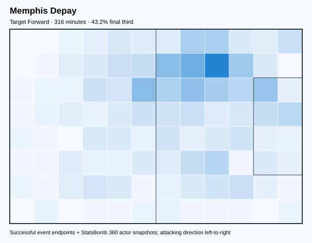
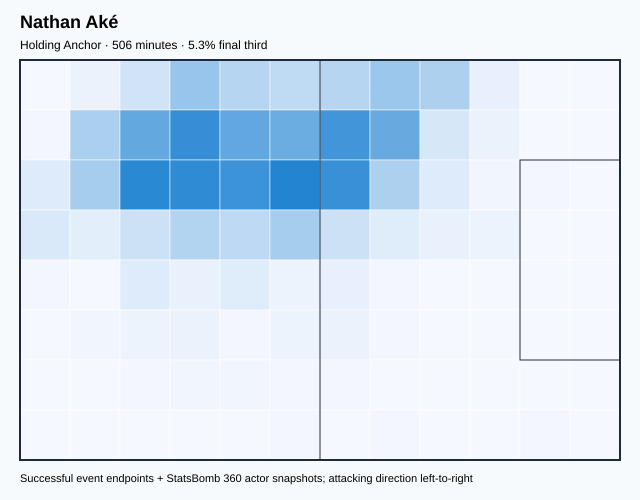
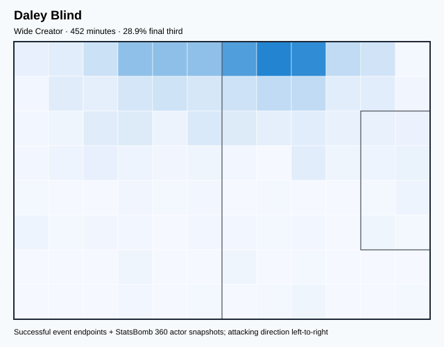
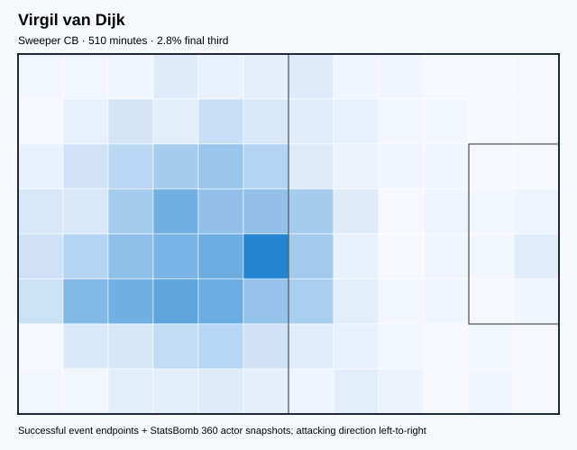
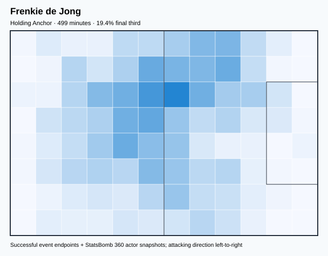
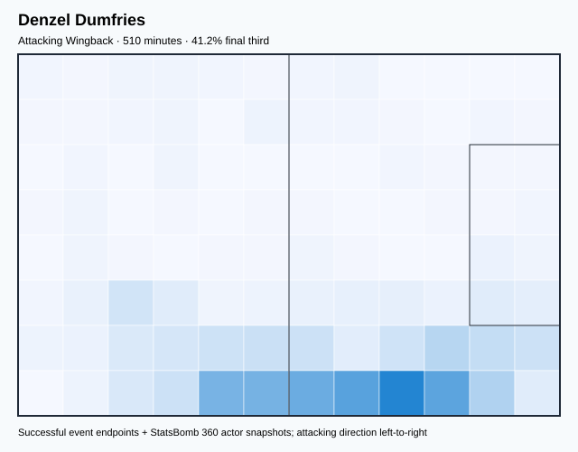
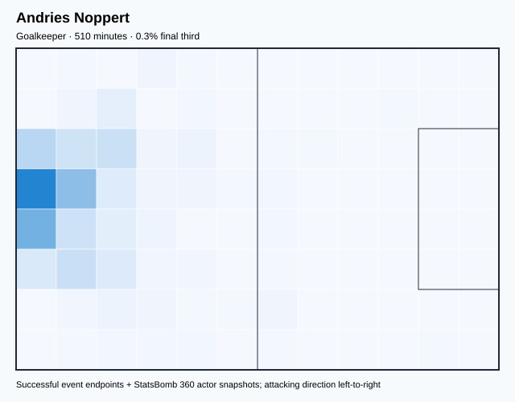
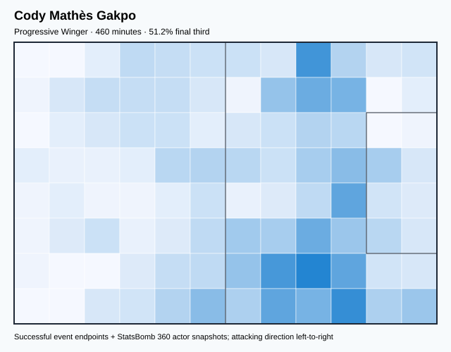
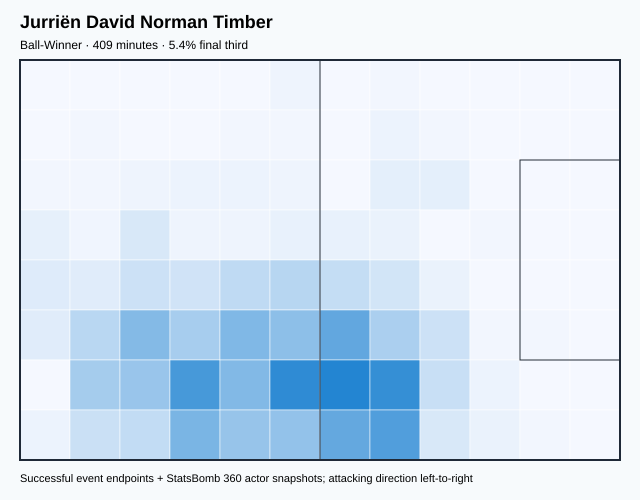

# NED — V4 Player Evaluation Collection

- Included 300+ minute players: 9
- Rankings use one cross-role 360-VAEP plus xT formula.
- Heatmaps combine successful on-ball endpoints and SB360 actor snapshots.

---

<!-- PLAYER_REPORT 1: 2988_starter_report.md -->

# Memphis Depay — Starter Report

- Team: Netherlands (NED)
- Position: Left Center Forward
- Functional role: Target Forward
- VAEP offense per 90: 0.4395
- VAEP defense per 90: 0.1497
- VAEP total per 90: 0.5892
- VAEP per touch: 0.00421
- Spatial xT per 90: 0.0469
- Final-third spatial share: 43.2%
- Unified final player rating: 0.2694
- Team rank: #1

## Physical profile

| Metric | Score |
|---|---:|
| Aerial dominance | 0.200 |
| Pressing intensity per 90 | 13.12 |
| Recovery index per 90 | 2.00 |

## Top chemistry partners

- Nathan Aké — synergy 0.608, 316 shared minutes
- Virgil van Dijk — synergy 0.600, 316 shared minutes
- Frenkie de Jong — synergy 0.580, 316 shared minutes

## Tactical recommendations

- Lead the first pressing trigger and protect the inside passing lane.
- Pair with a faster recovery defender after aggressive rotations.

_The heatmap combines successful event endpoints with StatsBomb 360 actor
snapshots. StatsBomb 360 is freeze-frame context, not continuous player
tracking. Scores exclude players below 300 tournament minutes._

---

<!-- PLAYER_REPORT 2: 3306_starter_report.md -->

# Nathan Aké — Starter Report

- Team: Netherlands (NED)
- Position: Left Center Back
- Functional role: Deep Playmaker
- VAEP offense per 90: 0.0085
- VAEP defense per 90: -0.0540
- VAEP total per 90: -0.0455
- VAEP per touch: -0.00028
- Spatial xT per 90: 0.0173
- Final-third spatial share: 6.5%
- Unified final player rating: -0.0153
- Team rank: #7

## Physical profile

| Metric | Score |
|---|---:|
| Aerial dominance | 0.500 |
| Pressing intensity per 90 | 10.49 |
| Recovery index per 90 | 2.13 |

## Top chemistry partners

- Andries Noppert — synergy 0.839, 506 shared minutes
- Virgil van Dijk — synergy 0.837, 506 shared minutes
- Frenkie de Jong — synergy 0.820, 496 shared minutes

## Tactical recommendations

- Use a compact pressing trigger rather than sustained solo pressure.
- Pair with a faster recovery defender after aggressive rotations.

_The heatmap combines successful event endpoints with StatsBomb 360 actor
snapshots. StatsBomb 360 is freeze-frame context, not continuous player
tracking. Scores exclude players below 300 tournament minutes._

---

<!-- PLAYER_REPORT 3: 3311_starter_report.md -->

# Daley Blind — Starter Report

- Team: Netherlands (NED)
- Position: Left Wing Back
- Functional role: Wide Creator
- VAEP offense per 90: 0.1585
- VAEP defense per 90: -0.0185
- VAEP total per 90: 0.1400
- VAEP per touch: 0.00090
- Spatial xT per 90: 0.0512
- Final-third spatial share: 28.9%
- Unified final player rating: 0.0791
- Team rank: #3

## Physical profile

| Metric | Score |
|---|---:|
| Aerial dominance | 0.429 |
| Pressing intensity per 90 | 17.70 |
| Recovery index per 90 | 2.59 |

## Top chemistry partners

- Nathan Aké — synergy 0.786, 449 shared minutes
- Frenkie de Jong — synergy 0.763, 442 shared minutes
- Virgil van Dijk — synergy 0.736, 452 shared minutes

## Tactical recommendations

- Lead the first pressing trigger and protect the inside passing lane.
- Use recovery capacity to support higher attacking positions.

_The heatmap combines successful event endpoints with StatsBomb 360 actor
snapshots. StatsBomb 360 is freeze-frame context, not continuous player
tracking. Scores exclude players below 300 tournament minutes._

---

<!-- PLAYER_REPORT 4: 3669_starter_report.md -->

# Virgil van Dijk — Starter Report

- Team: Netherlands (NED)
- Position: Center Back
- Functional role: Sweeper CB
- VAEP offense per 90: 0.0155
- VAEP defense per 90: -0.1148
- VAEP total per 90: -0.0993
- VAEP per touch: -0.00064
- Spatial xT per 90: 0.0151
- Final-third spatial share: 2.8%
- Unified final player rating: -0.0325
- Team rank: #9

## Physical profile

| Metric | Score |
|---|---:|
| Aerial dominance | 0.643 |
| Pressing intensity per 90 | 6.01 |
| Recovery index per 90 | 1.41 |

## Top chemistry partners

- Andries Noppert — synergy 0.840, 510 shared minutes
- Nathan Aké — synergy 0.837, 506 shared minutes
- Frenkie de Jong — synergy 0.820, 499 shared minutes

## Tactical recommendations

- Use a compact pressing trigger rather than sustained solo pressure.
- Target this player on direct restarts and back-post deliveries.
- Pair with a faster recovery defender after aggressive rotations.

_The heatmap combines successful event endpoints with StatsBomb 360 actor
snapshots. StatsBomb 360 is freeze-frame context, not continuous player
tracking. Scores exclude players below 300 tournament minutes._

---

<!-- PLAYER_REPORT 5: 8118_starter_report.md -->

# Frenkie de Jong — Starter Report

- Team: Netherlands (NED)
- Position: Left Defensive Midfield
- Functional role: Box-to-Box / Engine Midfielder
- VAEP offense per 90: 0.0675
- VAEP defense per 90: -0.0075
- VAEP total per 90: 0.0600
- VAEP per touch: 0.00034
- Spatial xT per 90: 0.0281
- Final-third spatial share: 19.4%
- Unified final player rating: 0.0336
- Team rank: #5

## Physical profile

| Metric | Score |
|---|---:|
| Aerial dominance | 0.857 |
| Pressing intensity per 90 | 14.96 |
| Recovery index per 90 | 3.60 |

## Top chemistry partners

- Andries Noppert — synergy 0.830, 499 shared minutes
- Virgil van Dijk — synergy 0.820, 499 shared minutes
- Nathan Aké — synergy 0.820, 496 shared minutes

## Tactical recommendations

- Lead the first pressing trigger and protect the inside passing lane.
- Target this player on direct restarts and back-post deliveries.
- Use recovery capacity to support higher attacking positions.

_The heatmap combines successful event endpoints with StatsBomb 360 actor
snapshots. StatsBomb 360 is freeze-frame context, not continuous player
tracking. Scores exclude players below 300 tournament minutes._

---

<!-- PLAYER_REPORT 6: 8125_starter_report.md -->

# Denzel Dumfries — Starter Report

- Team: Netherlands (NED)
- Position: Right Wing Back
- Functional role: Attacking Wingback
- VAEP offense per 90: 0.1615
- VAEP defense per 90: -0.0254
- VAEP total per 90: 0.1361
- VAEP per touch: 0.00125
- Spatial xT per 90: 0.0503
- Final-third spatial share: 41.2%
- Unified final player rating: 0.0780
- Team rank: #4

## Physical profile

| Metric | Score |
|---|---:|
| Aerial dominance | 0.476 |
| Pressing intensity per 90 | 13.07 |
| Recovery index per 90 | 1.77 |

## Top chemistry partners

- Andries Noppert — synergy 0.790, 510 shared minutes
- Jurriën David Norman Timber — synergy 0.759, 409 shared minutes
- Nathan Aké — synergy 0.679, 506 shared minutes

## Tactical recommendations

- Lead the first pressing trigger and protect the inside passing lane.
- Pair with a faster recovery defender after aggressive rotations.

_The heatmap combines successful event endpoints with StatsBomb 360 actor
snapshots. StatsBomb 360 is freeze-frame context, not continuous player
tracking. Scores exclude players below 300 tournament minutes._

---

<!-- PLAYER_REPORT 7: 8326_starter_report.md -->

# Andries Noppert — Starter Report

- Team: Netherlands (NED)
- Position: Goalkeeper
- Functional role: Goalkeeper
- VAEP offense per 90: -0.0053
- VAEP defense per 90: 0.0595
- VAEP total per 90: 0.0542
- VAEP per touch: 0.00080
- Spatial xT per 90: 0.0014
- Final-third spatial share: 0.3%
- Unified final player rating: -0.0018
- Team rank: #6

## Physical profile

| Metric | Score |
|---|---:|
| Aerial dominance | 0.000 |
| Pressing intensity per 90 | 0.00 |
| Recovery index per 90 | 4.59 |

## Top chemistry partners

- Virgil van Dijk — synergy 0.840, 510 shared minutes
- Nathan Aké — synergy 0.839, 506 shared minutes
- Frenkie de Jong — synergy 0.830, 499 shared minutes

## Tactical recommendations

- Use a compact pressing trigger rather than sustained solo pressure.
- Avoid isolating this player in high-volume aerial matchups.
- Use recovery capacity to support higher attacking positions.

_The heatmap combines successful event endpoints with StatsBomb 360 actor
snapshots. StatsBomb 360 is freeze-frame context, not continuous player
tracking. Scores exclude players below 300 tournament minutes._

---

<!-- PLAYER_REPORT 8: 20750_starter_report.md -->

# Cody Mathès Gakpo — Starter Report

- Team: Netherlands (NED)
- Position: Center Attacking Midfield
- Functional role: Progressive Winger
- VAEP offense per 90: 0.3177
- VAEP defense per 90: 0.0067
- VAEP total per 90: 0.3243
- VAEP per touch: 0.00323
- Spatial xT per 90: 0.0748
- Final-third spatial share: 51.2%
- Unified final player rating: 0.1895
- Team rank: #2

## Physical profile

| Metric | Score |
|---|---:|
| Aerial dominance | 0.500 |
| Pressing intensity per 90 | 11.93 |
| Recovery index per 90 | 3.72 |

## Top chemistry partners

- Frenkie de Jong — synergy 0.764, 460 shared minutes
- Daley Blind — synergy 0.659, 412 shared minutes
- Jurriën David Norman Timber — synergy 0.636, 367 shared minutes

## Tactical recommendations

- Lead the first pressing trigger and protect the inside passing lane.
- Use recovery capacity to support higher attacking positions.

_The heatmap combines successful event endpoints with StatsBomb 360 actor
snapshots. StatsBomb 360 is freeze-frame context, not continuous player
tracking. Scores exclude players below 300 tournament minutes._

---

<!-- PLAYER_REPORT 9: 21809_starter_report.md -->

# Jurriën David Norman Timber — Starter Report

- Team: Netherlands (NED)
- Position: Right Center Back
- Functional role: Deep Playmaker
- VAEP offense per 90: 0.0053
- VAEP defense per 90: -0.0646
- VAEP total per 90: -0.0593
- VAEP per touch: -0.00032
- Spatial xT per 90: 0.0190
- Final-third spatial share: 6.0%
- Unified final player rating: -0.0185
- Team rank: #8

## Physical profile

| Metric | Score |
|---|---:|
| Aerial dominance | 0.533 |
| Pressing intensity per 90 | 17.37 |
| Recovery index per 90 | 3.30 |

## Top chemistry partners

- Andries Noppert — synergy 0.772, 409 shared minutes
- Frenkie de Jong — synergy 0.767, 399 shared minutes
- Virgil van Dijk — synergy 0.766, 409 shared minutes

## Tactical recommendations

- Lead the first pressing trigger and protect the inside passing lane.
- Use recovery capacity to support higher attacking positions.

_The heatmap combines successful event endpoints with StatsBomb 360 actor
snapshots. StatsBomb 360 is freeze-frame context, not continuous player
tracking. Scores exclude players below 300 tournament minutes._

<!-- PROSPECTIVE_VALIDATION_START -->
## Prospective possession-model validation

**Overall status: `PARTIAL_PASS_ROLLBACK`.** Box-entry prediction passed every discrimination, calibration, and paired match-bootstrap gate. The shot challenger improved numerically but its confidence interval crossed zero, so it was rejected. The combined prospective artifact was not deployed and the stable production state was preserved.

| Target | Status | Baseline ROC-AUC | Challenger ROC-AUC | PR-AUC | Brier | ECE | Paired ROC gain (90% interval) |
|---|---|---:|---:|---:|---:|---:|---:|
| Box entry | **PASSED** | 0.6888 | 0.7268 | 0.6131 | 0.1722 | 0.0309 | +0.0155 [+0.0106, +0.0205] |
| Shot | **REJECTED** | 0.6642 | 0.6841 | 0.2686 | 0.0960 | 0.0118 | +0.0038 [-0.0030, +0.0120] |

_This challenger is isolated from 360-VAEP/xT player ratings, transition risk, retrospective possession models, and tactical clustering. Player and team descriptive metrics therefore remain unchanged._
<!-- PROSPECTIVE_VALIDATION_END -->

<!-- PLAYER_ROLE_VALIDATION_START -->
## Player-role and valuation validation status

**Production state retained.** The probabilistic role matrix and learned valuation were evaluated as challengers but were not promoted because they missed their predeclared statistical gates.

| Component | Decision | Validation evidence |
|---|---|---|
| Probabilistic GMM roles | **REJECTED** | K=9; silhouette 0.3159; median 500-bootstrap ARI 0.6961 vs required 0.70 |
| Learned Ridge valuation | **REJECTED** | OOF Spearman 0.7095 → 0.7150; gain 95% CI [-0.0053, +0.0165] crosses zero |

The active calibrated 360-VAEP model therefore remains unchanged: OOF ROC-AUC 0.948994, PR-AUC 0.084827, Brier 0.001123. Messi remains Argentina rank #1 and Mbappé remains France rank #1; no player-name override was used.
<!-- PLAYER_ROLE_VALIDATION_END -->

<!-- ROLE_AWARE_VALUATION_START -->
## Continuous role-aware valuation A/B test

**Decision: `REJECTED_RETAIN_INCUMBENT`.** The challenger was not promoted. Its Spearman correlation with the incumbent ranking was 0.9854, above the predeclared 0.90 ceiling, so it did not change the overall ordering enough to qualify as the intended systemic correction.

| Benchmark | Incumbent | Challenger diagnostic |
|---|---:|---:|
| Messi global rank | 1 | 1 |
| Mbappé global rank | 2 | 2 |
| Griezmann global rank | 21 | 6 |

The diagnostic Griezmann movement came from creation (0.799), pressing (0.711), and completeness (0.862), with no player-name rule. Nevertheless, all published player/team rankings retain the incumbent 360-VAEP+xT rating.

Foundational model performance remains unchanged: OOF ROC-AUC 0.948994, PR-AUC 0.084827, Brier 0.001123, ECE 0.000336.
<!-- ROLE_AWARE_VALUATION_END -->

<!-- CONTINUOUS_ROLE_REFINEMENT_START -->
## Accepted continuous role refinement

**34 of 142 players (23.9%) received an evidence-backed post-K-Means role refinement; 108 retained their original role.** The original cluster label remains available as `kmeans_functional_role`. Ratings, team ranks, VAEP and xT were not changed by this role-only promotion.

France refinements:

- Olivier Giroud: Target Forward → **Target Forward / Penalty-Box Anchor**
- Antoine Griezmann: Ball-Winner → **Hybrid Playmaker / Roaming Creator**
- Theo Bernard François Hernández: Wide Creator → **Attacking Wingback**
- Ibrahima Konaté: Deep Playmaker → **Ball-Playing Centre-Back**
- Aurélien Djani Tchouaméni: Ball-Winner → **Holding / Controlling Midfielder**

Refinements use continuous progression, creation, finishing, pressing, defensive, security, aerial and completeness scores with broad-position safeguards. No player-name condition is used.
<!-- CONTINUOUS_ROLE_REFINEMENT_END -->
