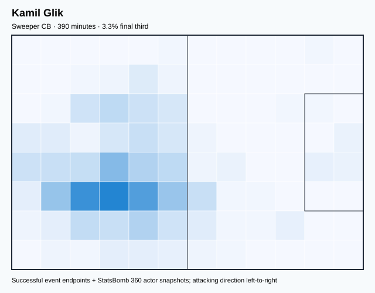
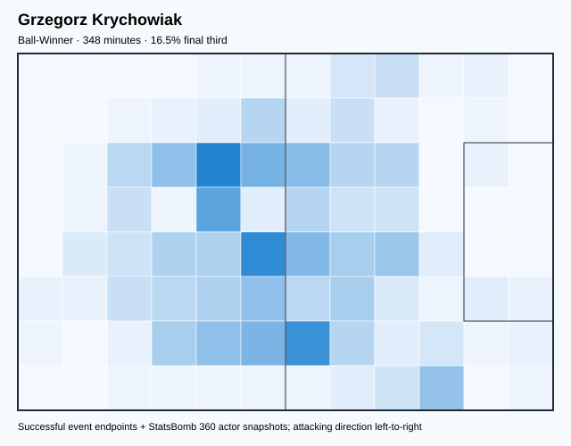
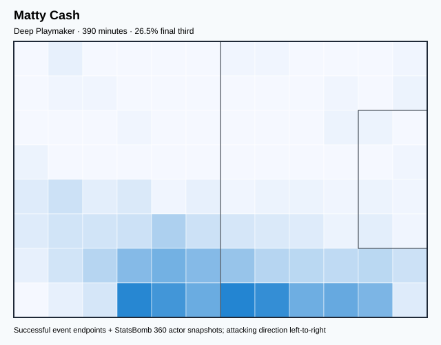
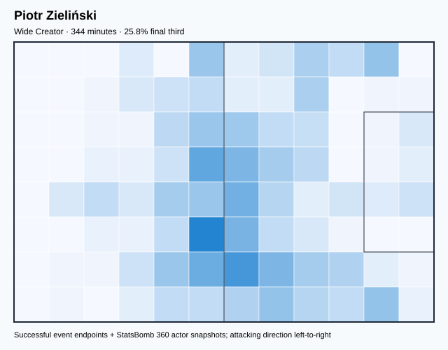
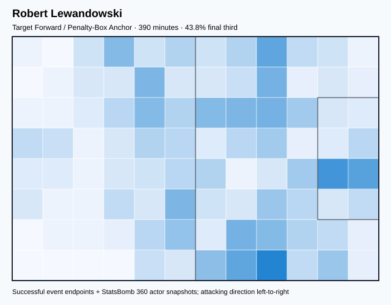
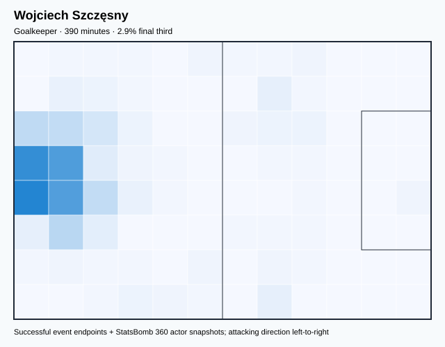
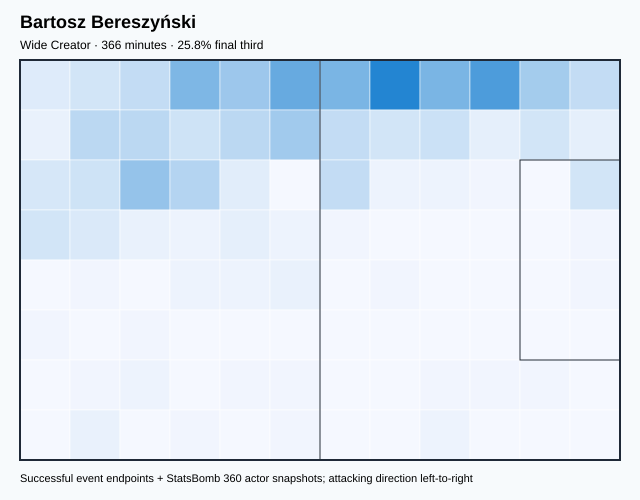
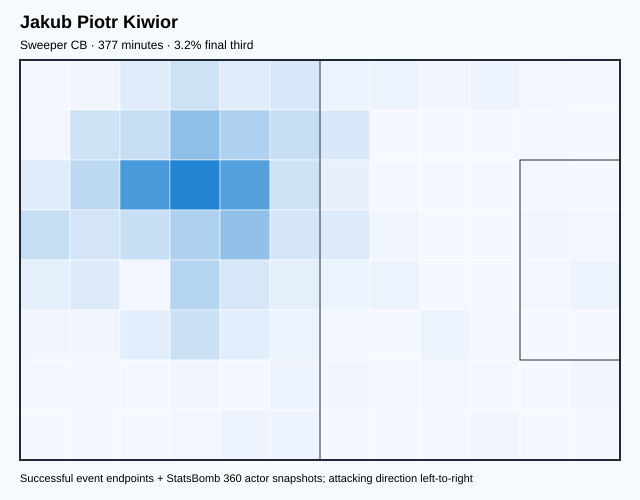

# POL — V4 Player Evaluation Collection

- Included 300+ minute players: 8
- Rankings use one cross-role 360-VAEP plus xT formula.
- Heatmaps combine successful on-ball endpoints and SB360 actor snapshots.

---

<!-- PLAYER_REPORT 1: 3034_starter_report.md -->

# Kamil Glik — Starter Report

- Team: Poland (POL)
- Position: Right Center Back
- Functional role: Sweeper CB
- VAEP offense per 90: 0.0879
- VAEP defense per 90: -0.0650
- VAEP total per 90: 0.0229
- VAEP per touch: 0.00029
- Spatial xT per 90: 0.0043
- Final-third spatial share: 3.3%
- Unified final player rating: 0.0034
- Team rank: #6

## Physical profile

| Metric | Score |
|---|---:|
| Aerial dominance | 0.700 |
| Pressing intensity per 90 | 4.39 |
| Recovery index per 90 | 1.62 |

## Top chemistry partners

- Matty Cash — synergy 0.756, 390 shared minutes
- Jakub Piotr Kiwior — synergy 0.748, 377 shared minutes
- Wojciech Szczęsny — synergy 0.743, 390 shared minutes

## Tactical recommendations

- Use a compact pressing trigger rather than sustained solo pressure.
- Target this player on direct restarts and back-post deliveries.
- Pair with a faster recovery defender after aggressive rotations.

_The heatmap combines successful event endpoints with StatsBomb 360 actor
snapshots. StatsBomb 360 is freeze-frame context, not continuous player
tracking. Scores exclude players below 300 tournament minutes._

---

<!-- PLAYER_REPORT 2: 3637_starter_report.md -->

# Grzegorz Krychowiak — Starter Report

- Team: Poland (POL)
- Position: Center Defensive Midfield
- Functional role: Ball-Winner
- VAEP offense per 90: 0.0211
- VAEP defense per 90: -0.0095
- VAEP total per 90: 0.0115
- VAEP per touch: 0.00014
- Spatial xT per 90: 0.0252
- Final-third spatial share: 16.7%
- Unified final player rating: 0.0197
- Team rank: #4

## Physical profile

| Metric | Score |
|---|---:|
| Aerial dominance | 0.750 |
| Pressing intensity per 90 | 14.49 |
| Recovery index per 90 | 4.40 |

## Top chemistry partners

- Jakub Piotr Kiwior — synergy 0.713, 348 shared minutes
- Kamil Glik — synergy 0.670, 348 shared minutes
- Bartosz Bereszyński — synergy 0.629, 337 shared minutes

## Tactical recommendations

- Lead the first pressing trigger and protect the inside passing lane.
- Target this player on direct restarts and back-post deliveries.
- Use recovery capacity to support higher attacking positions.

_The heatmap combines successful event endpoints with StatsBomb 360 actor
snapshots. StatsBomb 360 is freeze-frame context, not continuous player
tracking. Scores exclude players below 300 tournament minutes._

---

<!-- PLAYER_REPORT 3: 4734_starter_report.md -->

# Matty Cash — Starter Report

- Team: Poland (POL)
- Position: Right Back
- Functional role: Box-to-Box Runner
- VAEP offense per 90: 0.0728
- VAEP defense per 90: -0.1625
- VAEP total per 90: -0.0897
- VAEP per touch: -0.00101
- Spatial xT per 90: 0.0384
- Final-third spatial share: 26.5%
- Unified final player rating: 0.0124
- Team rank: #5

## Physical profile

| Metric | Score |
|---|---:|
| Aerial dominance | 0.500 |
| Pressing intensity per 90 | 10.16 |
| Recovery index per 90 | 1.39 |

## Top chemistry partners

- Kamil Glik — synergy 0.756, 390 shared minutes
- Wojciech Szczęsny — synergy 0.741, 390 shared minutes
- Piotr Zieliński — synergy 0.662, 344 shared minutes

## Tactical recommendations

- Use a compact pressing trigger rather than sustained solo pressure.
- Pair with a faster recovery defender after aggressive rotations.

_The heatmap combines successful event endpoints with StatsBomb 360 actor
snapshots. StatsBomb 360 is freeze-frame context, not continuous player
tracking. Scores exclude players below 300 tournament minutes._

---

<!-- PLAYER_REPORT 4: 5660_starter_report.md -->

# Piotr Zieliński — Starter Report

- Team: Poland (POL)
- Position: Right Center Midfield
- Functional role: Ball-Winner
- VAEP offense per 90: 0.0993
- VAEP defense per 90: -0.0101
- VAEP total per 90: 0.0893
- VAEP per touch: 0.00085
- Spatial xT per 90: 0.0591
- Final-third spatial share: 24.8%
- Unified final player rating: 0.0952
- Team rank: #2

## Physical profile

| Metric | Score |
|---|---:|
| Aerial dominance | 0.500 |
| Pressing intensity per 90 | 13.33 |
| Recovery index per 90 | 3.92 |

## Top chemistry partners

- Jakub Piotr Kiwior — synergy 0.694, 331 shared minutes
- Matty Cash — synergy 0.662, 344 shared minutes
- Kamil Glik — synergy 0.646, 344 shared minutes

## Tactical recommendations

- Lead the first pressing trigger and protect the inside passing lane.
- Use recovery capacity to support higher attacking positions.

_The heatmap combines successful event endpoints with StatsBomb 360 actor
snapshots. StatsBomb 360 is freeze-frame context, not continuous player
tracking. Scores exclude players below 300 tournament minutes._

---

<!-- PLAYER_REPORT 5: 5668_starter_report.md -->

# Robert Lewandowski — Starter Report

- Team: Poland (POL)
- Position: Center Forward
- Functional role: Target Forward
- VAEP offense per 90: 0.3901
- VAEP defense per 90: 0.0199
- VAEP total per 90: 0.4101
- VAEP per touch: 0.00421
- Spatial xT per 90: 0.0192
- Final-third spatial share: 43.8%
- Unified final player rating: 0.2195
- Team rank: #1

## Physical profile

| Metric | Score |
|---|---:|
| Aerial dominance | 0.447 |
| Pressing intensity per 90 | 9.70 |
| Recovery index per 90 | 2.77 |

## Top chemistry partners

- Kamil Glik — synergy 0.643, 390 shared minutes
- Matty Cash — synergy 0.631, 390 shared minutes
- Bartosz Bereszyński — synergy 0.583, 366 shared minutes

## Tactical recommendations

- Use a compact pressing trigger rather than sustained solo pressure.
- Use recovery capacity to support higher attacking positions.

_The heatmap combines successful event endpoints with StatsBomb 360 actor
snapshots. StatsBomb 360 is freeze-frame context, not continuous player
tracking. Scores exclude players below 300 tournament minutes._

---

<!-- PLAYER_REPORT 6: 5669_starter_report.md -->

# Wojciech Szczęsny — Starter Report

- Team: Poland (POL)
- Position: Goalkeeper
- Functional role: Goalkeeper
- VAEP offense per 90: -0.0251
- VAEP defense per 90: -0.1804
- VAEP total per 90: -0.2055
- VAEP per touch: -0.00331
- Spatial xT per 90: 0.0047
- Final-third spatial share: 2.9%
- Unified final player rating: -0.0806
- Team rank: #8

## Physical profile

| Metric | Score |
|---|---:|
| Aerial dominance | 0.000 |
| Pressing intensity per 90 | 0.00 |
| Recovery index per 90 | 4.16 |

## Top chemistry partners

- Jakub Piotr Kiwior — synergy 0.745, 377 shared minutes
- Kamil Glik — synergy 0.743, 390 shared minutes
- Matty Cash — synergy 0.741, 390 shared minutes

## Tactical recommendations

- Use a compact pressing trigger rather than sustained solo pressure.
- Avoid isolating this player in high-volume aerial matchups.
- Use recovery capacity to support higher attacking positions.

_The heatmap combines successful event endpoints with StatsBomb 360 actor
snapshots. StatsBomb 360 is freeze-frame context, not continuous player
tracking. Scores exclude players below 300 tournament minutes._

---

<!-- PLAYER_REPORT 7: 5673_starter_report.md -->

# Bartosz Bereszyński — Starter Report

- Team: Poland (POL)
- Position: Left Back
- Functional role: Wide Creator
- VAEP offense per 90: 0.0967
- VAEP defense per 90: -0.0184
- VAEP total per 90: 0.0783
- VAEP per touch: 0.00090
- Spatial xT per 90: 0.0401
- Final-third spatial share: 25.8%
- Unified final player rating: 0.0608
- Team rank: #3

## Physical profile

| Metric | Score |
|---|---:|
| Aerial dominance | 0.833 |
| Pressing intensity per 90 | 10.34 |
| Recovery index per 90 | 3.45 |

## Top chemistry partners

- Wojciech Szczęsny — synergy 0.719, 366 shared minutes
- Jakub Piotr Kiwior — synergy 0.697, 353 shared minutes
- Kamil Glik — synergy 0.670, 366 shared minutes

## Tactical recommendations

- Use a compact pressing trigger rather than sustained solo pressure.
- Target this player on direct restarts and back-post deliveries.
- Use recovery capacity to support higher attacking positions.

_The heatmap combines successful event endpoints with StatsBomb 360 actor
snapshots. StatsBomb 360 is freeze-frame context, not continuous player
tracking. Scores exclude players below 300 tournament minutes._

---

<!-- PLAYER_REPORT 8: 44166_starter_report.md -->

# Jakub Piotr Kiwior — Starter Report

- Team: Poland (POL)
- Position: Left Center Back
- Functional role: Sweeper CB
- VAEP offense per 90: 0.0567
- VAEP defense per 90: -0.0589
- VAEP total per 90: -0.0022
- VAEP per touch: -0.00002
- Spatial xT per 90: 0.0210
- Final-third spatial share: 3.2%
- Unified final player rating: -0.0020
- Team rank: #7

## Physical profile

| Metric | Score |
|---|---:|
| Aerial dominance | 0.571 |
| Pressing intensity per 90 | 4.54 |
| Recovery index per 90 | 1.67 |

## Top chemistry partners

- Kamil Glik — synergy 0.748, 377 shared minutes
- Wojciech Szczęsny — synergy 0.745, 377 shared minutes
- Grzegorz Krychowiak — synergy 0.713, 348 shared minutes

## Tactical recommendations

- Use a compact pressing trigger rather than sustained solo pressure.
- Target this player on direct restarts and back-post deliveries.
- Pair with a faster recovery defender after aggressive rotations.

_The heatmap combines successful event endpoints with StatsBomb 360 actor
snapshots. StatsBomb 360 is freeze-frame context, not continuous player
tracking. Scores exclude players below 300 tournament minutes._

<!-- PROSPECTIVE_VALIDATION_START -->
## Prospective possession-model validation

**Overall status: `PARTIAL_PASS_ROLLBACK`.** Box-entry prediction passed every discrimination, calibration, and paired match-bootstrap gate. The shot challenger improved numerically but its confidence interval crossed zero, so it was rejected. The combined prospective artifact was not deployed and the stable production state was preserved.

| Target | Status | Baseline ROC-AUC | Challenger ROC-AUC | PR-AUC | Brier | ECE | Paired ROC gain (90% interval) |
|---|---|---:|---:|---:|---:|---:|---:|
| Box entry | **PASSED** | 0.6888 | 0.7268 | 0.6131 | 0.1722 | 0.0309 | +0.0155 [+0.0106, +0.0205] |
| Shot | **REJECTED** | 0.6642 | 0.6841 | 0.2686 | 0.0960 | 0.0118 | +0.0038 [-0.0030, +0.0120] |

_This challenger is isolated from 360-VAEP/xT player ratings, transition risk, retrospective possession models, and tactical clustering. Player and team descriptive metrics therefore remain unchanged._
<!-- PROSPECTIVE_VALIDATION_END -->

<!-- PLAYER_ROLE_VALIDATION_START -->
## Player-role and valuation validation status

**Production state retained.** The probabilistic role matrix and learned valuation were evaluated as challengers but were not promoted because they missed their predeclared statistical gates.

| Component | Decision | Validation evidence |
|---|---|---|
| Probabilistic GMM roles | **REJECTED** | K=9; silhouette 0.3159; median 500-bootstrap ARI 0.6961 vs required 0.70 |
| Learned Ridge valuation | **REJECTED** | OOF Spearman 0.7095 → 0.7150; gain 95% CI [-0.0053, +0.0165] crosses zero |

The active calibrated 360-VAEP model therefore remains unchanged: OOF ROC-AUC 0.948994, PR-AUC 0.084827, Brier 0.001123. Messi remains Argentina rank #1 and Mbappé remains France rank #1; no player-name override was used.
<!-- PLAYER_ROLE_VALIDATION_END -->
