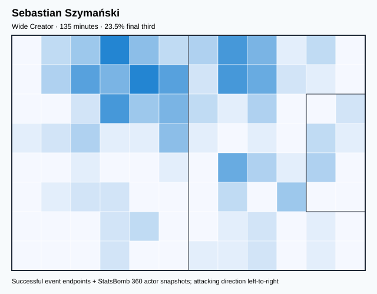
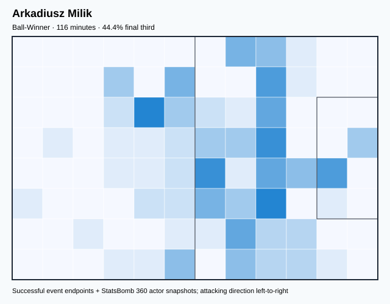
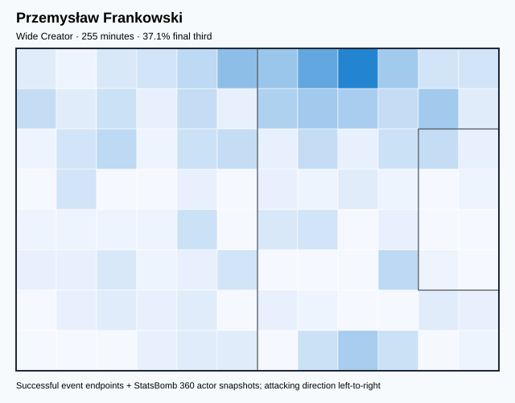
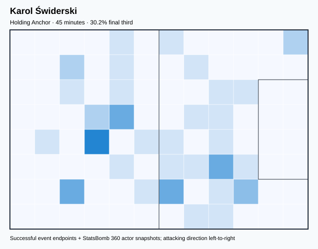
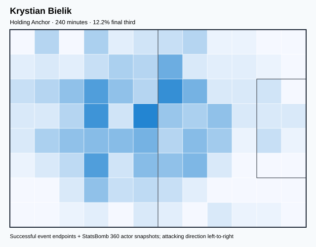
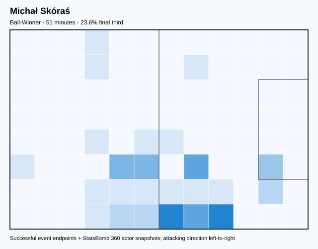
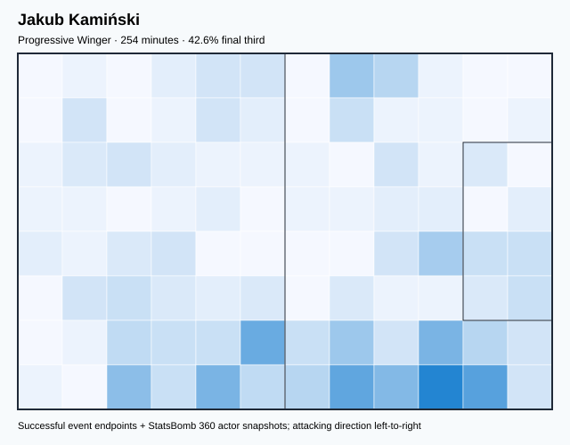
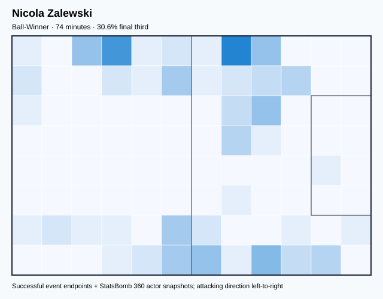

# POL — V4 Player Evaluation Collection

<!-- V5_CANONICAL_NOTICE -->
> **Historical V4 player-rating packet.** Player ratings, ranks, role-challenger decisions, and rating uncertainty below are superseded by `results/reports/player_rankings.csv`, `results/reports/player_profiles/`, and `results/reports/model_summary.md`. Possession, tactical, and match-bootstrap material remains a historical V4 result.

- Included eligible players: 16
- Rankings use the role-aware, development-gated VAEP/xT/xD model.
- Heatmaps combine successful on-ball endpoints and SB360 actor snapshots.

---

<!-- PLAYER_REPORT 1: 3034_starter_report.md -->

# Kamil Glik — Starter Report

- Team: Poland (POL)
- Position: Right Center Back
- Functional role: Sweeper CB
- VAEP offense per 90: 0.0992
- VAEP defense per 90: -0.0528
- VAEP total per 90: 0.0464
- VAEP per touch: 0.00060
- Spatial xT per 90: 0.0043
- Final-third spatial share: 3.3%
- Unified final player rating: 0.0064
- Team rank: #13

## Physical profile

| Metric | Score |
|---|---:|
| Aerial dominance | 0.700 |
| Pressing intensity per 90 | 4.39 |
| Recovery index per 90 | 1.62 |

## Top chemistry partners

- Matty Cash — synergy 0.756, 390 shared minutes
- Jakub Piotr Kiwior — synergy 0.748, 377 shared minutes
- Wojciech Szczęsny — synergy 0.743, 390 shared minutes

## Tactical recommendations

- Use a compact pressing trigger rather than sustained solo pressure.
- Target this player on direct restarts and back-post deliveries.
- Pair with a faster recovery defender after aggressive rotations.

_The heatmap combines successful event endpoints with StatsBomb 360 actor
snapshots. StatsBomb 360 is freeze-frame context, not continuous player
tracking. Ratings include eligible outfield players from 45 minutes and
goalkeepers from 90 minutes; ranking status communicates sample reliability._

---

<!-- PLAYER_REPORT 2: 3637_starter_report.md -->

# Grzegorz Krychowiak — Starter Report

- Team: Poland (POL)
- Position: Center Defensive Midfield
- Functional role: Box-to-Box / Engine Midfielder
- VAEP offense per 90: 0.0330
- VAEP defense per 90: -0.0167
- VAEP total per 90: 0.0163
- VAEP per touch: 0.00020
- Spatial xT per 90: 0.0252
- Final-third spatial share: 16.7%
- Unified final player rating: 0.0180
- Team rank: #12

## Physical profile

| Metric | Score |
|---|---:|
| Aerial dominance | 0.750 |
| Pressing intensity per 90 | 14.49 |
| Recovery index per 90 | 4.40 |

## Top chemistry partners

- Jakub Piotr Kiwior — synergy 0.713, 348 shared minutes
- Kamil Glik — synergy 0.670, 348 shared minutes
- Bartosz Bereszyński — synergy 0.629, 337 shared minutes

## Tactical recommendations

- Lead the first pressing trigger and protect the inside passing lane.
- Target this player on direct restarts and back-post deliveries.
- Use recovery capacity to support higher attacking positions.

_The heatmap combines successful event endpoints with StatsBomb 360 actor
snapshots. StatsBomb 360 is freeze-frame context, not continuous player
tracking. Ratings include eligible outfield players from 45 minutes and
goalkeepers from 90 minutes; ranking status communicates sample reliability._

---

<!-- PLAYER_REPORT 3: 4664_starter_report.md -->

# Sebastian Szymański — Starter Report

- Team: Poland (POL)
- Position: Left Center Midfield
- Functional role: Wide Creator
- VAEP offense per 90: 0.1432
- VAEP defense per 90: -0.0389
- VAEP total per 90: 0.1043
- VAEP per touch: 0.00128
- Spatial xT per 90: -0.0048
- Final-third spatial share: 23.5%
- Unified final player rating: 0.0949
- Team rank: #7

## Physical profile

| Metric | Score |
|---|---:|
| Aerial dominance | 0.200 |
| Pressing intensity per 90 | 26.68 |
| Recovery index per 90 | 2.67 |

## Top chemistry partners

- Grzegorz Krychowiak — synergy 0.374, 135 shared minutes
- Jakub Piotr Kiwior — synergy 0.364, 135 shared minutes
- Matty Cash — synergy 0.355, 135 shared minutes

## Tactical recommendations

- Lead the first pressing trigger and protect the inside passing lane.
- Use recovery capacity to support higher attacking positions.

_The heatmap combines successful event endpoints with StatsBomb 360 actor
snapshots. StatsBomb 360 is freeze-frame context, not continuous player
tracking. Ratings include eligible outfield players from 45 minutes and
goalkeepers from 90 minutes; ranking status communicates sample reliability._

---

<!-- PLAYER_REPORT 4: 4734_starter_report.md -->

# Matty Cash — Starter Report

- Team: Poland (POL)
- Position: Right Back
- Functional role: Deep Playmaker
- VAEP offense per 90: 0.0670
- VAEP defense per 90: -0.1948
- VAEP total per 90: -0.1277
- VAEP per touch: -0.00144
- Spatial xT per 90: 0.0384
- Final-third spatial share: 26.5%
- Unified final player rating: 0.0025
- Team rank: #14

## Physical profile

| Metric | Score |
|---|---:|
| Aerial dominance | 0.500 |
| Pressing intensity per 90 | 10.16 |
| Recovery index per 90 | 1.39 |

## Top chemistry partners

- Kamil Glik — synergy 0.756, 390 shared minutes
- Wojciech Szczęsny — synergy 0.741, 390 shared minutes
- Piotr Zieliński — synergy 0.662, 344 shared minutes

## Tactical recommendations

- Use a compact pressing trigger rather than sustained solo pressure.
- Pair with a faster recovery defender after aggressive rotations.

_The heatmap combines successful event endpoints with StatsBomb 360 actor
snapshots. StatsBomb 360 is freeze-frame context, not continuous player
tracking. Ratings include eligible outfield players from 45 minutes and
goalkeepers from 90 minutes; ranking status communicates sample reliability._

---

<!-- PLAYER_REPORT 5: 5660_starter_report.md -->

# Piotr Zieliński — Starter Report

- Team: Poland (POL)
- Position: Right Center Midfield
- Functional role: Holding Anchor
- VAEP offense per 90: 0.0990
- VAEP defense per 90: 0.0018
- VAEP total per 90: 0.1007
- VAEP per touch: 0.00096
- Spatial xT per 90: 0.0591
- Final-third spatial share: 24.8%
- Unified final player rating: 0.0882
- Team rank: #8

## Physical profile

| Metric | Score |
|---|---:|
| Aerial dominance | 0.500 |
| Pressing intensity per 90 | 13.33 |
| Recovery index per 90 | 3.92 |

## Top chemistry partners

- Jakub Piotr Kiwior — synergy 0.694, 331 shared minutes
- Matty Cash — synergy 0.662, 344 shared minutes
- Kamil Glik — synergy 0.646, 344 shared minutes

## Tactical recommendations

- Lead the first pressing trigger and protect the inside passing lane.
- Use recovery capacity to support higher attacking positions.

_The heatmap combines successful event endpoints with StatsBomb 360 actor
snapshots. StatsBomb 360 is freeze-frame context, not continuous player
tracking. Ratings include eligible outfield players from 45 minutes and
goalkeepers from 90 minutes; ranking status communicates sample reliability._

---

<!-- PLAYER_REPORT 6: 5665_starter_report.md -->

# Arkadiusz Milik — Starter Report

- Team: Poland (POL)
- Position: Left Midfield
- Functional role: Ball-Winner
- VAEP offense per 90: 0.2390
- VAEP defense per 90: 0.0088
- VAEP total per 90: 0.2479
- VAEP per touch: 0.00286
- Spatial xT per 90: 0.0143
- Final-third spatial share: 44.4%
- Unified final player rating: 0.1120
- Team rank: #3

## Physical profile

| Metric | Score |
|---|---:|
| Aerial dominance | 0.400 |
| Pressing intensity per 90 | 9.27 |
| Recovery index per 90 | 1.55 |

## Top chemistry partners

- Kamil Glik — synergy 0.321, 116 shared minutes
- Bartosz Bereszyński — synergy 0.321, 116 shared minutes
- Krystian Bielik — synergy 0.320, 110 shared minutes

## Tactical recommendations

- Use a compact pressing trigger rather than sustained solo pressure.
- Pair with a faster recovery defender after aggressive rotations.

_The heatmap combines successful event endpoints with StatsBomb 360 actor
snapshots. StatsBomb 360 is freeze-frame context, not continuous player
tracking. Ratings include eligible outfield players from 45 minutes and
goalkeepers from 90 minutes; ranking status communicates sample reliability._

---

<!-- PLAYER_REPORT 7: 5668_starter_report.md -->

# Robert Lewandowski — Starter Report

- Team: Poland (POL)
- Position: Center Forward
- Functional role: Target Forward / Penalty-Box Anchor
- VAEP offense per 90: 0.4895
- VAEP defense per 90: 0.0174
- VAEP total per 90: 0.5069
- VAEP per touch: 0.00520
- Spatial xT per 90: 0.0192
- Final-third spatial share: 43.8%
- Unified final player rating: 0.2483
- Team rank: #1

## Physical profile

| Metric | Score |
|---|---:|
| Aerial dominance | 0.447 |
| Pressing intensity per 90 | 9.70 |
| Recovery index per 90 | 2.77 |

## Top chemistry partners

- Kamil Glik — synergy 0.643, 390 shared minutes
- Matty Cash — synergy 0.631, 390 shared minutes
- Bartosz Bereszyński — synergy 0.583, 366 shared minutes

## Tactical recommendations

- Use a compact pressing trigger rather than sustained solo pressure.
- Use recovery capacity to support higher attacking positions.

_The heatmap combines successful event endpoints with StatsBomb 360 actor
snapshots. StatsBomb 360 is freeze-frame context, not continuous player
tracking. Ratings include eligible outfield players from 45 minutes and
goalkeepers from 90 minutes; ranking status communicates sample reliability._

---

<!-- PLAYER_REPORT 8: 5669_starter_report.md -->

# Wojciech Szczęsny — Starter Report

- Team: Poland (POL)
- Position: Goalkeeper
- Functional role: Goalkeeper
- VAEP offense per 90: -0.0228
- VAEP defense per 90: -0.2168
- VAEP total per 90: -0.2395
- VAEP per touch: -0.00386
- Spatial xT per 90: 0.0047
- Final-third spatial share: 2.9%
- Unified final player rating: -0.0885
- Team rank: #16

## Physical profile

| Metric | Score |
|---|---:|
| Aerial dominance | 0.000 |
| Pressing intensity per 90 | 0.00 |
| Recovery index per 90 | 4.16 |

## Top chemistry partners

- Jakub Piotr Kiwior — synergy 0.745, 377 shared minutes
- Kamil Glik — synergy 0.743, 390 shared minutes
- Matty Cash — synergy 0.741, 390 shared minutes

## Tactical recommendations

- Use a compact pressing trigger rather than sustained solo pressure.
- Avoid isolating this player in high-volume aerial matchups.
- Use recovery capacity to support higher attacking positions.

_The heatmap combines successful event endpoints with StatsBomb 360 actor
snapshots. StatsBomb 360 is freeze-frame context, not continuous player
tracking. Ratings include eligible outfield players from 45 minutes and
goalkeepers from 90 minutes; ranking status communicates sample reliability._

---

<!-- PLAYER_REPORT 9: 5673_starter_report.md -->

# Bartosz Bereszyński — Starter Report

- Team: Poland (POL)
- Position: Left Back
- Functional role: Wide Creator
- VAEP offense per 90: 0.0993
- VAEP defense per 90: -0.0213
- VAEP total per 90: 0.0780
- VAEP per touch: 0.00089
- Spatial xT per 90: 0.0401
- Final-third spatial share: 25.8%
- Unified final player rating: 0.0508
- Team rank: #10

## Physical profile

| Metric | Score |
|---|---:|
| Aerial dominance | 0.833 |
| Pressing intensity per 90 | 10.34 |
| Recovery index per 90 | 3.45 |

## Top chemistry partners

- Wojciech Szczęsny — synergy 0.719, 366 shared minutes
- Jakub Piotr Kiwior — synergy 0.697, 353 shared minutes
- Kamil Glik — synergy 0.670, 366 shared minutes

## Tactical recommendations

- Use a compact pressing trigger rather than sustained solo pressure.
- Target this player on direct restarts and back-post deliveries.
- Use recovery capacity to support higher attacking positions.

_The heatmap combines successful event endpoints with StatsBomb 360 actor
snapshots. StatsBomb 360 is freeze-frame context, not continuous player
tracking. Ratings include eligible outfield players from 45 minutes and
goalkeepers from 90 minutes; ranking status communicates sample reliability._

---

<!-- PLAYER_REPORT 10: 7979_starter_report.md -->

# Przemysław Frankowski — Starter Report

- Team: Poland (POL)
- Position: Left Midfield
- Functional role: Wide Creator
- VAEP offense per 90: 0.1227
- VAEP defense per 90: -0.0224
- VAEP total per 90: 0.1003
- VAEP per touch: 0.00126
- Spatial xT per 90: 0.0032
- Final-third spatial share: 37.1%
- Unified final player rating: 0.0874
- Team rank: #9

## Physical profile

| Metric | Score |
|---|---:|
| Aerial dominance | 0.333 |
| Pressing intensity per 90 | 15.56 |
| Recovery index per 90 | 3.89 |

## Top chemistry partners

- Kamil Glik — synergy 0.560, 255 shared minutes
- Bartosz Bereszyński — synergy 0.529, 255 shared minutes
- Jakub Piotr Kiwior — synergy 0.505, 255 shared minutes

## Tactical recommendations

- Lead the first pressing trigger and protect the inside passing lane.
- Use recovery capacity to support higher attacking positions.

_The heatmap combines successful event endpoints with StatsBomb 360 actor
snapshots. StatsBomb 360 is freeze-frame context, not continuous player
tracking. Ratings include eligible outfield players from 45 minutes and
goalkeepers from 90 minutes; ranking status communicates sample reliability._

---

<!-- PLAYER_REPORT 11: 8836_starter_report.md -->

# Karol Świderski — Starter Report

- Team: Poland (POL)
- Position: Left Center Forward
- Functional role: Holding Anchor
- VAEP offense per 90: 0.0027
- VAEP defense per 90: 0.0022
- VAEP total per 90: 0.0050
- VAEP per touch: 0.00010
- Spatial xT per 90: -0.0102
- Final-third spatial share: 30.2%
- Unified final player rating: 0.2175
- Team rank: #2

## Physical profile

| Metric | Score |
|---|---:|
| Aerial dominance | 0.500 |
| Pressing intensity per 90 | 24.00 |
| Recovery index per 90 | 2.00 |

## Top chemistry partners

- Krystian Bielik — synergy 0.142, 45 shared minutes
- Grzegorz Krychowiak — synergy 0.141, 45 shared minutes
- Piotr Zieliński — synergy 0.139, 45 shared minutes

## Tactical recommendations

- Lead the first pressing trigger and protect the inside passing lane.
- Pair with a faster recovery defender after aggressive rotations.

_The heatmap combines successful event endpoints with StatsBomb 360 actor
snapshots. StatsBomb 360 is freeze-frame context, not continuous player
tracking. Ratings include eligible outfield players from 45 minutes and
goalkeepers from 90 minutes; ranking status communicates sample reliability._

---

<!-- PLAYER_REPORT 12: 11737_starter_report.md -->

# Krystian Bielik — Starter Report

- Team: Poland (POL)
- Position: Right Defensive Midfield
- Functional role: Holding Anchor
- VAEP offense per 90: 0.0325
- VAEP defense per 90: -0.0126
- VAEP total per 90: 0.0199
- VAEP per touch: 0.00020
- Spatial xT per 90: 0.0224
- Final-third spatial share: 12.2%
- Unified final player rating: 0.0192
- Team rank: #11

## Physical profile

| Metric | Score |
|---|---:|
| Aerial dominance | 0.583 |
| Pressing intensity per 90 | 16.87 |
| Recovery index per 90 | 2.25 |

## Top chemistry partners

- Bartosz Bereszyński — synergy 0.573, 240 shared minutes
- Kamil Glik — synergy 0.571, 240 shared minutes
- Wojciech Szczęsny — synergy 0.563, 240 shared minutes

## Tactical recommendations

- Lead the first pressing trigger and protect the inside passing lane.
- Target this player on direct restarts and back-post deliveries.
- Pair with a faster recovery defender after aggressive rotations.

_The heatmap combines successful event endpoints with StatsBomb 360 actor
snapshots. StatsBomb 360 is freeze-frame context, not continuous player
tracking. Ratings include eligible outfield players from 45 minutes and
goalkeepers from 90 minutes; ranking status communicates sample reliability._

---

<!-- PLAYER_REPORT 13: 28453_starter_report.md -->

# Michał Skóraś — Starter Report

- Team: Poland (POL)
- Position: Right Midfield
- Functional role: Ball-Winner
- VAEP offense per 90: 0.0759
- VAEP defense per 90: -0.0722
- VAEP total per 90: 0.0038
- VAEP per touch: 0.00007
- Spatial xT per 90: 0.0093
- Final-third spatial share: 23.6%
- Unified final player rating: 0.0973
- Team rank: #6

## Physical profile

| Metric | Score |
|---|---:|
| Aerial dominance | 1.000 |
| Pressing intensity per 90 | 10.58 |
| Recovery index per 90 | 0.00 |

## Top chemistry partners

- Kamil Glik — synergy 0.156, 51 shared minutes
- Matty Cash — synergy 0.154, 51 shared minutes
- Wojciech Szczęsny — synergy 0.152, 51 shared minutes

## Tactical recommendations

- Use a compact pressing trigger rather than sustained solo pressure.
- Target this player on direct restarts and back-post deliveries.
- Pair with a faster recovery defender after aggressive rotations.

_The heatmap combines successful event endpoints with StatsBomb 360 actor
snapshots. StatsBomb 360 is freeze-frame context, not continuous player
tracking. Ratings include eligible outfield players from 45 minutes and
goalkeepers from 90 minutes; ranking status communicates sample reliability._

---

<!-- PLAYER_REPORT 14: 31955_starter_report.md -->

# Jakub Kamiński — Starter Report

- Team: Poland (POL)
- Position: Right Midfield
- Functional role: Progressive Winger
- VAEP offense per 90: 0.1637
- VAEP defense per 90: 0.0095
- VAEP total per 90: 0.1732
- VAEP per touch: 0.00231
- Spatial xT per 90: 0.0468
- Final-third spatial share: 42.6%
- Unified final player rating: 0.1039
- Team rank: #4

## Physical profile

| Metric | Score |
|---|---:|
| Aerial dominance | 0.200 |
| Pressing intensity per 90 | 13.13 |
| Recovery index per 90 | 5.68 |

## Top chemistry partners

- Bartosz Bereszyński — synergy 0.540, 230 shared minutes
- Matty Cash — synergy 0.516, 254 shared minutes
- Kamil Glik — synergy 0.452, 254 shared minutes

## Tactical recommendations

- Lead the first pressing trigger and protect the inside passing lane.
- Use recovery capacity to support higher attacking positions.

_The heatmap combines successful event endpoints with StatsBomb 360 actor
snapshots. StatsBomb 360 is freeze-frame context, not continuous player
tracking. Ratings include eligible outfield players from 45 minutes and
goalkeepers from 90 minutes; ranking status communicates sample reliability._

---

<!-- PLAYER_REPORT 15: 44166_starter_report.md -->

# Jakub Piotr Kiwior — Starter Report

- Team: Poland (POL)
- Position: Left Center Back
- Functional role: Sweeper CB
- VAEP offense per 90: 0.0632
- VAEP defense per 90: -0.0470
- VAEP total per 90: 0.0163
- VAEP per touch: 0.00013
- Spatial xT per 90: 0.0210
- Final-third spatial share: 3.2%
- Unified final player rating: 0.0007
- Team rank: #15

## Physical profile

| Metric | Score |
|---|---:|
| Aerial dominance | 0.571 |
| Pressing intensity per 90 | 4.54 |
| Recovery index per 90 | 1.67 |

## Top chemistry partners

- Kamil Glik — synergy 0.748, 377 shared minutes
- Wojciech Szczęsny — synergy 0.745, 377 shared minutes
- Grzegorz Krychowiak — synergy 0.713, 348 shared minutes

## Tactical recommendations

- Use a compact pressing trigger rather than sustained solo pressure.
- Target this player on direct restarts and back-post deliveries.
- Pair with a faster recovery defender after aggressive rotations.

_The heatmap combines successful event endpoints with StatsBomb 360 actor
snapshots. StatsBomb 360 is freeze-frame context, not continuous player
tracking. Ratings include eligible outfield players from 45 minutes and
goalkeepers from 90 minutes; ranking status communicates sample reliability._

---

<!-- PLAYER_REPORT 16: 50502_starter_report.md -->

# Nicola Zalewski — Starter Report

- Team: Poland (POL)
- Position: Left Midfield
- Functional role: Ball-Winner
- VAEP offense per 90: 0.0504
- VAEP defense per 90: -0.0009
- VAEP total per 90: 0.0495
- VAEP per touch: 0.00057
- Spatial xT per 90: 0.0455
- Final-third spatial share: 30.6%
- Unified final player rating: 0.0975
- Team rank: #5

## Physical profile

| Metric | Score |
|---|---:|
| Aerial dominance | 0.000 |
| Pressing intensity per 90 | 26.76 |
| Recovery index per 90 | 2.43 |

## Top chemistry partners

- Matty Cash — synergy 0.228, 74 shared minutes
- Bartosz Bereszyński — synergy 0.213, 74 shared minutes
- Kamil Glik — synergy 0.212, 74 shared minutes

## Tactical recommendations

- Lead the first pressing trigger and protect the inside passing lane.
- Avoid isolating this player in high-volume aerial matchups.
- Pair with a faster recovery defender after aggressive rotations.

_The heatmap combines successful event endpoints with StatsBomb 360 actor
snapshots. StatsBomb 360 is freeze-frame context, not continuous player
tracking. Ratings include eligible outfield players from 45 minutes and
goalkeepers from 90 minutes; ranking status communicates sample reliability._
