# POR — V4 Player Evaluation Collection

<!-- V5_CANONICAL_NOTICE -->
> **Historical V4 player-rating packet.** Player ratings, ranks, role-challenger decisions, and rating uncertainty below are superseded by `results/reports/player_rankings.csv`, `results/reports/player_profiles/`, and `results/reports/model_summary.md`. Possession, tactical, and match-bootstrap material remains a historical V4 result.

- Included eligible players: 22
- Rankings use the role-aware, development-gated VAEP/xT/xD model.
- Heatmaps combine successful on-ball endpoints and SB360 actor snapshots.

---

<!-- PLAYER_REPORT 1: 3193_starter_report.md -->

# Bernardo Mota Veiga de Carvalho e Silva — Starter Report

- Team: Portugal (POR)
- Position: Right Center Midfield
- Functional role: Ball-Winner
- VAEP offense per 90: 0.2028
- VAEP defense per 90: 0.0076
- VAEP total per 90: 0.2104
- VAEP per touch: 0.00109
- Spatial xT per 90: 0.0584
- Final-third spatial share: 31.2%
- Unified final player rating: 0.1122
- Team rank: #9

## Physical profile

| Metric | Score |
|---|---:|
| Aerial dominance | 0.125 |
| Pressing intensity per 90 | 14.60 |
| Recovery index per 90 | 4.95 |

## Top chemistry partners

- Rúben Santos Gato Alves Dias — synergy 0.735, 366 shared minutes
- Bruno Miguel Borges Fernandes — synergy 0.655, 366 shared minutes
- Kléper Laveran Lima Ferreira — synergy 0.623, 295 shared minutes

## Tactical recommendations

- Lead the first pressing trigger and protect the inside passing lane.
- Avoid isolating this player in high-volume aerial matchups.
- Use recovery capacity to support higher attacking positions.

_The heatmap combines successful event endpoints with StatsBomb 360 actor
snapshots. StatsBomb 360 is freeze-frame context, not continuous player
tracking. Ratings include eligible outfield players from 45 minutes and
goalkeepers from 90 minutes; ranking status communicates sample reliability._

---

<!-- PLAYER_REPORT 2: 4272_starter_report.md -->

# João Mário Naval da Costa Eduardo — Starter Report

- Team: Portugal (POR)
- Position: Left Wing
- Functional role: Ball-Winner
- VAEP offense per 90: 0.2259
- VAEP defense per 90: 0.0544
- VAEP total per 90: 0.2803
- VAEP per touch: 0.00236
- Spatial xT per 90: 0.0144
- Final-third spatial share: 52.6%
- Unified final player rating: 0.1709
- Team rank: #6

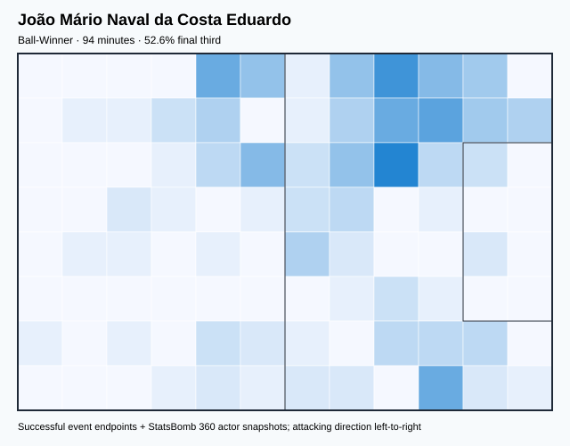

## Physical profile

| Metric | Score |
|---|---:|
| Aerial dominance | 0.000 |
| Pressing intensity per 90 | 15.33 |
| Recovery index per 90 | 4.79 |

## Top chemistry partners

- Vitor Machado Ferreira — synergy 0.250, 81 shared minutes
- José Diogo Dalot Teixeira — synergy 0.243, 81 shared minutes
- António João Pereira Albuquerque Tavares Silva — synergy 0.243, 81 shared minutes

## Tactical recommendations

- Lead the first pressing trigger and protect the inside passing lane.
- Avoid isolating this player in high-volume aerial matchups.
- Use recovery capacity to support higher attacking positions.

_The heatmap combines successful event endpoints with StatsBomb 360 actor
snapshots. StatsBomb 360 is freeze-frame context, not continuous player
tracking. Ratings include eligible outfield players from 45 minutes and
goalkeepers from 90 minutes; ranking status communicates sample reliability._

---

<!-- PLAYER_REPORT 3: 5204_starter_report.md -->

# Bruno Miguel Borges Fernandes — Starter Report

- Team: Portugal (POR)
- Position: Center Attacking Midfield
- Functional role: Progressive Winger
- VAEP offense per 90: 0.2206
- VAEP defense per 90: -0.0210
- VAEP total per 90: 0.1995
- VAEP per touch: 0.00127
- Spatial xT per 90: 0.1281
- Final-third spatial share: 37.5%
- Unified final player rating: 0.1532
- Team rank: #7

## Physical profile

| Metric | Score |
|---|---:|
| Aerial dominance | 0.214 |
| Pressing intensity per 90 | 15.20 |
| Recovery index per 90 | 3.27 |

## Top chemistry partners

- Rúben Santos Gato Alves Dias — synergy 0.715, 385 shared minutes
- Bernardo Mota Veiga de Carvalho e Silva — synergy 0.655, 366 shared minutes
- João Félix Sequeira — synergy 0.654, 340 shared minutes

## Tactical recommendations

- Lead the first pressing trigger and protect the inside passing lane.
- Use recovery capacity to support higher attacking positions.

_The heatmap combines successful event endpoints with StatsBomb 360 actor
snapshots. StatsBomb 360 is freeze-frame context, not continuous player
tracking. Ratings include eligible outfield players from 45 minutes and
goalkeepers from 90 minutes; ranking status communicates sample reliability._

---

<!-- PLAYER_REPORT 4: 5206_starter_report.md -->

# Rúben Santos Gato Alves Dias — Starter Report

- Team: Portugal (POR)
- Position: Left Center Back
- Functional role: Sweeper CB
- VAEP offense per 90: 0.0248
- VAEP defense per 90: -0.0103
- VAEP total per 90: 0.0145
- VAEP per touch: 0.00009
- Spatial xT per 90: 0.0095
- Final-third spatial share: 2.3%
- Unified final player rating: -0.0006
- Team rank: #19

## Physical profile

| Metric | Score |
|---|---:|
| Aerial dominance | 0.733 |
| Pressing intensity per 90 | 4.59 |
| Recovery index per 90 | 2.98 |

## Top chemistry partners

- Diogo Meireles Costa — synergy 0.745, 392 shared minutes
- Bernardo Mota Veiga de Carvalho e Silva — synergy 0.735, 366 shared minutes
- Bruno Miguel Borges Fernandes — synergy 0.715, 385 shared minutes

## Tactical recommendations

- Use a compact pressing trigger rather than sustained solo pressure.
- Target this player on direct restarts and back-post deliveries.
- Use recovery capacity to support higher attacking positions.

_The heatmap combines successful event endpoints with StatsBomb 360 actor
snapshots. StatsBomb 360 is freeze-frame context, not continuous player
tracking. Ratings include eligible outfield players from 45 minutes and
goalkeepers from 90 minutes; ranking status communicates sample reliability._

---

<!-- PLAYER_REPORT 5: 5207_starter_report.md -->

# Cristiano Ronaldo dos Santos Aveiro — Starter Report

- Team: Portugal (POR)
- Position: Center Forward
- Functional role: Target Forward
- VAEP offense per 90: 0.6425
- VAEP defense per 90: 0.1428
- VAEP total per 90: 0.7854
- VAEP per touch: 0.00826
- Spatial xT per 90: 0.0091
- Final-third spatial share: 47.2%
- Unified final player rating: 0.3027
- Team rank: #1

## Physical profile

| Metric | Score |
|---|---:|
| Aerial dominance | 0.500 |
| Pressing intensity per 90 | 6.24 |
| Recovery index per 90 | 1.49 |

## Top chemistry partners

- Bruno Miguel Borges Fernandes — synergy 0.563, 230 shared minutes
- Rúben Diogo Da Silva Neves — synergy 0.504, 224 shared minutes
- João Pedro Cavaco Cancelo — synergy 0.490, 281 shared minutes

## Tactical recommendations

- Use a compact pressing trigger rather than sustained solo pressure.
- Pair with a faster recovery defender after aggressive rotations.

_The heatmap combines successful event endpoints with StatsBomb 360 actor
snapshots. StatsBomb 360 is freeze-frame context, not continuous player
tracking. Ratings include eligible outfield players from 45 minutes and
goalkeepers from 90 minutes; ranking status communicates sample reliability._

---

<!-- PLAYER_REPORT 6: 5209_starter_report.md -->

# Raphaël Adelino José Guerreiro — Starter Report

- Team: Portugal (POR)
- Position: Left Back
- Functional role: Attacking Wingback
- VAEP offense per 90: 0.2479
- VAEP defense per 90: 0.0152
- VAEP total per 90: 0.2631
- VAEP per touch: 0.00189
- Spatial xT per 90: 0.0764
- Final-third spatial share: 33.8%
- Unified final player rating: 0.0914
- Team rank: #12

## Physical profile

| Metric | Score |
|---|---:|
| Aerial dominance | 0.667 |
| Pressing intensity per 90 | 8.30 |
| Recovery index per 90 | 2.37 |

## Top chemistry partners

- Rúben Santos Gato Alves Dias — synergy 0.666, 304 shared minutes
- Bernardo Mota Veiga de Carvalho e Silva — synergy 0.620, 278 shared minutes
- Diogo Meireles Costa — synergy 0.586, 304 shared minutes

## Tactical recommendations

- Use a compact pressing trigger rather than sustained solo pressure.
- Target this player on direct restarts and back-post deliveries.
- Pair with a faster recovery defender after aggressive rotations.

_The heatmap combines successful event endpoints with StatsBomb 360 actor
snapshots. StatsBomb 360 is freeze-frame context, not continuous player
tracking. Ratings include eligible outfield players from 45 minutes and
goalkeepers from 90 minutes; ranking status communicates sample reliability._

---

<!-- PLAYER_REPORT 7: 5214_starter_report.md -->

# William Silva de Carvalho — Starter Report

- Team: Portugal (POR)
- Position: Center Defensive Midfield
- Functional role: Holding Anchor
- VAEP offense per 90: 0.0292
- VAEP defense per 90: -0.0038
- VAEP total per 90: 0.0254
- VAEP per touch: 0.00015
- Spatial xT per 90: 0.0020
- Final-third spatial share: 14.9%
- Unified final player rating: 0.0187
- Team rank: #17

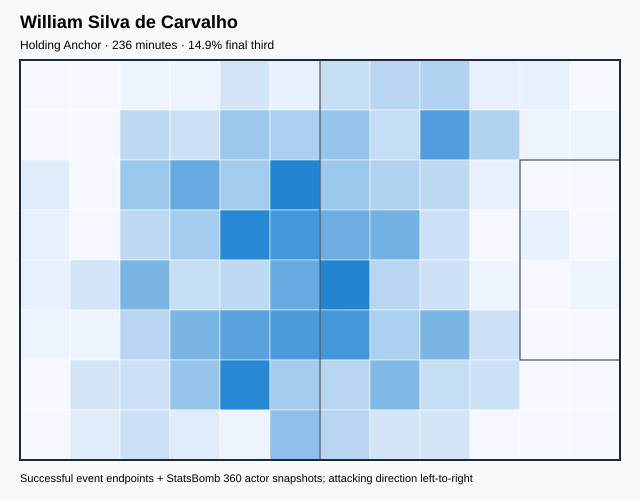

## Physical profile

| Metric | Score |
|---|---:|
| Aerial dominance | 0.714 |
| Pressing intensity per 90 | 15.24 |
| Recovery index per 90 | 1.90 |

## Top chemistry partners

- Diogo Meireles Costa — synergy 0.561, 236 shared minutes
- Rúben Santos Gato Alves Dias — synergy 0.548, 220 shared minutes
- Bruno Miguel Borges Fernandes — synergy 0.537, 213 shared minutes

## Tactical recommendations

- Lead the first pressing trigger and protect the inside passing lane.
- Target this player on direct restarts and back-post deliveries.
- Pair with a faster recovery defender after aggressive rotations.

_The heatmap combines successful event endpoints with StatsBomb 360 actor
snapshots. StatsBomb 360 is freeze-frame context, not continuous player
tracking. Ratings include eligible outfield players from 45 minutes and
goalkeepers from 90 minutes; ranking status communicates sample reliability._

---

<!-- PLAYER_REPORT 8: 7005_starter_report.md -->

# João Pedro Cavaco Cancelo — Starter Report

- Team: Portugal (POR)
- Position: Right Back
- Functional role: Wide Creator
- VAEP offense per 90: 0.2114
- VAEP defense per 90: -0.0028
- VAEP total per 90: 0.2086
- VAEP per touch: 0.00108
- Spatial xT per 90: 0.0678
- Final-third spatial share: 33.3%
- Unified final player rating: 0.0816
- Team rank: #13

## Physical profile

| Metric | Score |
|---|---:|
| Aerial dominance | 0.929 |
| Pressing intensity per 90 | 6.01 |
| Recovery index per 90 | 5.75 |

## Top chemistry partners

- Diogo Meireles Costa — synergy 0.658, 345 shared minutes
- Bruno Miguel Borges Fernandes — synergy 0.573, 248 shared minutes
- Kléper Laveran Lima Ferreira — synergy 0.570, 244 shared minutes

## Tactical recommendations

- Use a compact pressing trigger rather than sustained solo pressure.
- Target this player on direct restarts and back-post deliveries.
- Use recovery capacity to support higher attacking positions.

_The heatmap combines successful event endpoints with StatsBomb 360 actor
snapshots. StatsBomb 360 is freeze-frame context, not continuous player
tracking. Ratings include eligible outfield players from 45 minutes and
goalkeepers from 90 minutes; ranking status communicates sample reliability._

---

<!-- PLAYER_REPORT 9: 9927_starter_report.md -->

# Rúben Diogo Da Silva Neves — Starter Report

- Team: Portugal (POR)
- Position: Center Defensive Midfield
- Functional role: Holding / Controlling Midfielder
- VAEP offense per 90: 0.1623
- VAEP defense per 90: -0.0221
- VAEP total per 90: 0.1402
- VAEP per touch: 0.00061
- Spatial xT per 90: 0.0398
- Final-third spatial share: 12.2%
- Unified final player rating: 0.0431
- Team rank: #15

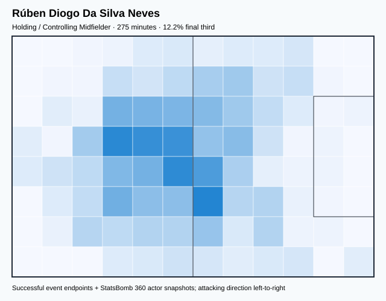

## Physical profile

| Metric | Score |
|---|---:|
| Aerial dominance | 0.500 |
| Pressing intensity per 90 | 12.78 |
| Recovery index per 90 | 3.60 |

## Top chemistry partners

- Diogo Meireles Costa — synergy 0.622, 275 shared minutes
- Rúben Santos Gato Alves Dias — synergy 0.536, 210 shared minutes
- Kléper Laveran Lima Ferreira — synergy 0.516, 198 shared minutes

## Tactical recommendations

- Lead the first pressing trigger and protect the inside passing lane.
- Use recovery capacity to support higher attacking positions.

_The heatmap combines successful event endpoints with StatsBomb 360 actor
snapshots. StatsBomb 360 is freeze-frame context, not continuous player
tracking. Ratings include eligible outfield players from 45 minutes and
goalkeepers from 90 minutes; ranking status communicates sample reliability._

---

<!-- PLAYER_REPORT 10: 10868_starter_report.md -->

# Ricardo Jorge Luz Horta — Starter Report

- Team: Portugal (POR)
- Position: Right Wing
- Functional role: Ball-Winner
- VAEP offense per 90: 0.3497
- VAEP defense per 90: 0.0789
- VAEP total per 90: 0.4286
- VAEP per touch: 0.00505
- Spatial xT per 90: 0.0034
- Final-third spatial share: 58.5%
- Unified final player rating: 0.1860
- Team rank: #4

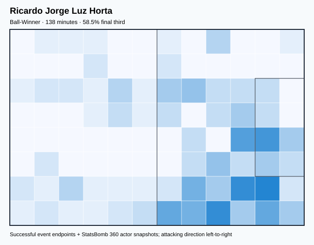

## Physical profile

| Metric | Score |
|---|---:|
| Aerial dominance | 0.000 |
| Pressing intensity per 90 | 17.62 |
| Recovery index per 90 | 3.26 |

## Top chemistry partners

- Diogo Meireles Costa — synergy 0.361, 138 shared minutes
- Kléper Laveran Lima Ferreira — synergy 0.337, 138 shared minutes
- João Pedro Cavaco Cancelo — synergy 0.325, 116 shared minutes

## Tactical recommendations

- Lead the first pressing trigger and protect the inside passing lane.
- Avoid isolating this player in high-volume aerial matchups.
- Use recovery capacity to support higher attacking positions.

_The heatmap combines successful event endpoints with StatsBomb 360 actor
snapshots. StatsBomb 360 is freeze-frame context, not continuous player
tracking. Ratings include eligible outfield players from 45 minutes and
goalkeepers from 90 minutes; ranking status communicates sample reliability._

---

<!-- PLAYER_REPORT 11: 11184_starter_report.md -->

# Otávio Edmilson da Silva Monteiro — Starter Report

- Team: Portugal (POR)
- Position: Left Center Midfield
- Functional role: Deep Playmaker / Metronome
- VAEP offense per 90: 0.1242
- VAEP defense per 90: 0.0009
- VAEP total per 90: 0.1251
- VAEP per touch: 0.00075
- Spatial xT per 90: 0.0843
- Final-third spatial share: 27.0%
- Unified final player rating: 0.0993
- Team rank: #11

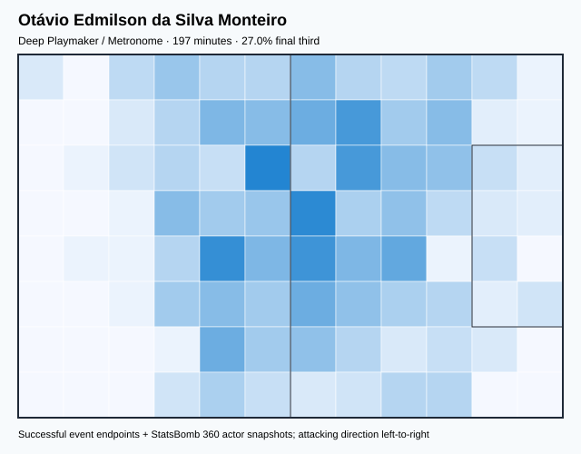

## Physical profile

| Metric | Score |
|---|---:|
| Aerial dominance | 0.833 |
| Pressing intensity per 90 | 20.98 |
| Recovery index per 90 | 3.65 |

## Top chemistry partners

- Rúben Santos Gato Alves Dias — synergy 0.510, 197 shared minutes
- Bernardo Mota Veiga de Carvalho e Silva — synergy 0.497, 197 shared minutes
- Diogo Meireles Costa — synergy 0.485, 197 shared minutes

## Tactical recommendations

- Lead the first pressing trigger and protect the inside passing lane.
- Target this player on direct restarts and back-post deliveries.
- Use recovery capacity to support higher attacking positions.

_The heatmap combines successful event endpoints with StatsBomb 360 actor
snapshots. StatsBomb 360 is freeze-frame context, not continuous player
tracking. Ratings include eligible outfield players from 45 minutes and
goalkeepers from 90 minutes; ranking status communicates sample reliability._

---

<!-- PLAYER_REPORT 12: 12041_starter_report.md -->

# João Félix Sequeira — Starter Report

- Team: Portugal (POR)
- Position: Left Wing
- Functional role: Ball-Winner
- VAEP offense per 90: 0.3602
- VAEP defense per 90: 0.0085
- VAEP total per 90: 0.3687
- VAEP per touch: 0.00321
- Spatial xT per 90: 0.0463
- Final-third spatial share: 46.7%
- Unified final player rating: 0.1843
- Team rank: #5

## Physical profile

| Metric | Score |
|---|---:|
| Aerial dominance | 0.500 |
| Pressing intensity per 90 | 8.99 |
| Recovery index per 90 | 2.38 |

## Top chemistry partners

- Bruno Miguel Borges Fernandes — synergy 0.654, 340 shared minutes
- Diogo Meireles Costa — synergy 0.647, 340 shared minutes
- Bernardo Mota Veiga de Carvalho e Silva — synergy 0.609, 340 shared minutes

## Tactical recommendations

- Use a compact pressing trigger rather than sustained solo pressure.
- Pair with a faster recovery defender after aggressive rotations.

_The heatmap combines successful event endpoints with StatsBomb 360 actor
snapshots. StatsBomb 360 is freeze-frame context, not continuous player
tracking. Ratings include eligible outfield players from 45 minutes and
goalkeepers from 90 minutes; ranking status communicates sample reliability._

---

<!-- PLAYER_REPORT 13: 12169_starter_report.md -->

# João Maria Lobo Alves Palhinha Gonçalves — Starter Report

- Team: Portugal (POR)
- Position: Center Defensive Midfield
- Functional role: Ball-Winner
- VAEP offense per 90: 0.0889
- VAEP defense per 90: -0.0183
- VAEP total per 90: 0.0706
- VAEP per touch: 0.00057
- Spatial xT per 90: 0.0360
- Final-third spatial share: 25.5%
- Unified final player rating: 0.0242
- Team rank: #16

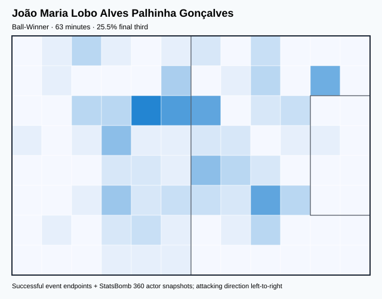

## Physical profile

| Metric | Score |
|---|---:|
| Aerial dominance | 0.000 |
| Pressing intensity per 90 | 21.34 |
| Recovery index per 90 | 4.27 |

## Top chemistry partners

- João Pedro Cavaco Cancelo — synergy 0.200, 63 shared minutes
- Rafael Alexandre Conceição Leão — synergy 0.196, 63 shared minutes
- Diogo Meireles Costa — synergy 0.185, 63 shared minutes

## Tactical recommendations

- Lead the first pressing trigger and protect the inside passing lane.
- Avoid isolating this player in high-volume aerial matchups.
- Use recovery capacity to support higher attacking positions.

_The heatmap combines successful event endpoints with StatsBomb 360 actor
snapshots. StatsBomb 360 is freeze-frame context, not continuous player
tracking. Ratings include eligible outfield players from 45 minutes and
goalkeepers from 90 minutes; ranking status communicates sample reliability._

---

<!-- PLAYER_REPORT 14: 13621_starter_report.md -->

# Danilo Luís Hélio Pereira — Starter Report

- Team: Portugal (POR)
- Position: Left Center Back
- Functional role: Sweeper CB
- VAEP offense per 90: -0.0162
- VAEP defense per 90: -0.0604
- VAEP total per 90: -0.0765
- VAEP per touch: -0.00040
- Spatial xT per 90: 0.0123
- Final-third spatial share: 2.7%
- Unified final player rating: -0.0140
- Team rank: #21

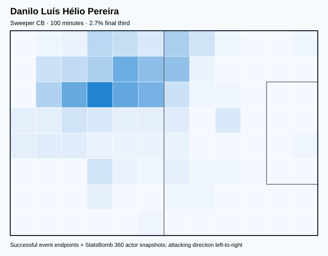

## Physical profile

| Metric | Score |
|---|---:|
| Aerial dominance | 0.667 |
| Pressing intensity per 90 | 8.99 |
| Recovery index per 90 | 4.49 |

## Top chemistry partners

- Rúben Santos Gato Alves Dias — synergy 0.303, 100 shared minutes
- Diogo Meireles Costa — synergy 0.300, 100 shared minutes
- Raphaël Adelino José Guerreiro — synergy 0.298, 100 shared minutes

## Tactical recommendations

- Use a compact pressing trigger rather than sustained solo pressure.
- Target this player on direct restarts and back-post deliveries.
- Use recovery capacity to support higher attacking positions.

_The heatmap combines successful event endpoints with StatsBomb 360 actor
snapshots. StatsBomb 360 is freeze-frame context, not continuous player
tracking. Ratings include eligible outfield players from 45 minutes and
goalkeepers from 90 minutes; ranking status communicates sample reliability._

---

<!-- PLAYER_REPORT 15: 16028_starter_report.md -->

# José Diogo Dalot Teixeira — Starter Report

- Team: Portugal (POR)
- Position: Right Back
- Functional role: Attacking Wingback
- VAEP offense per 90: 0.0928
- VAEP defense per 90: -0.0459
- VAEP total per 90: 0.0469
- VAEP per touch: 0.00039
- Spatial xT per 90: 0.0748
- Final-third spatial share: 32.3%
- Unified final player rating: 0.0480
- Team rank: #14

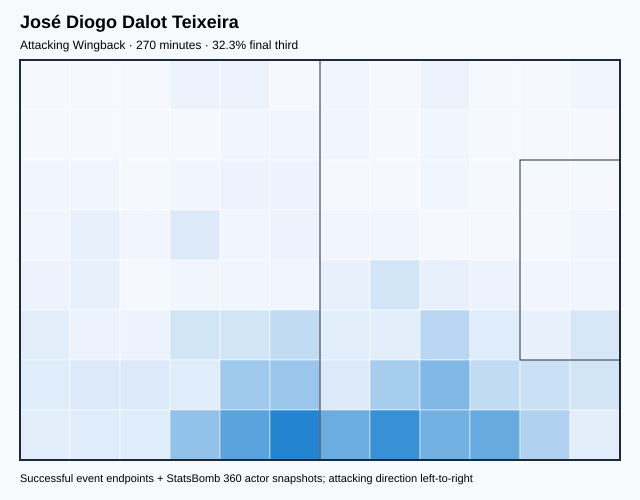

## Physical profile

| Metric | Score |
|---|---:|
| Aerial dominance | 0.600 |
| Pressing intensity per 90 | 9.34 |
| Recovery index per 90 | 2.00 |

## Top chemistry partners

- Diogo Meireles Costa — synergy 0.604, 270 shared minutes
- Kléper Laveran Lima Ferreira — synergy 0.603, 270 shared minutes
- Rúben Santos Gato Alves Dias — synergy 0.448, 173 shared minutes

## Tactical recommendations

- Use a compact pressing trigger rather than sustained solo pressure.
- Target this player on direct restarts and back-post deliveries.
- Pair with a faster recovery defender after aggressive rotations.

_The heatmap combines successful event endpoints with StatsBomb 360 actor
snapshots. StatsBomb 360 is freeze-frame context, not continuous player
tracking. Ratings include eligible outfield players from 45 minutes and
goalkeepers from 90 minutes; ranking status communicates sample reliability._

---

<!-- PLAYER_REPORT 16: 18360_starter_report.md -->

# Rafael Alexandre Conceição Leão — Starter Report

- Team: Portugal (POR)
- Position: Left Wing
- Functional role: Progressive Winger
- VAEP offense per 90: 0.5099
- VAEP defense per 90: 0.0398
- VAEP total per 90: 0.5497
- VAEP per touch: 0.00409
- Spatial xT per 90: 0.0595
- Final-third spatial share: 52.4%
- Unified final player rating: 0.2007
- Team rank: #3

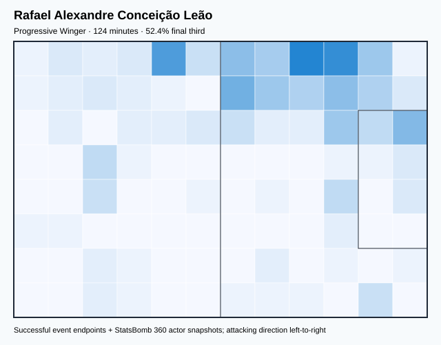

## Physical profile

| Metric | Score |
|---|---:|
| Aerial dominance | 0.000 |
| Pressing intensity per 90 | 8.71 |
| Recovery index per 90 | 2.90 |

## Top chemistry partners

- Diogo Meireles Costa — synergy 0.338, 124 shared minutes
- João Pedro Cavaco Cancelo — synergy 0.317, 117 shared minutes
- Kléper Laveran Lima Ferreira — synergy 0.285, 101 shared minutes

## Tactical recommendations

- Use a compact pressing trigger rather than sustained solo pressure.
- Avoid isolating this player in high-volume aerial matchups.
- Use recovery capacity to support higher attacking positions.

_The heatmap combines successful event endpoints with StatsBomb 360 actor
snapshots. StatsBomb 360 is freeze-frame context, not continuous player
tracking. Ratings include eligible outfield players from 45 minutes and
goalkeepers from 90 minutes; ranking status communicates sample reliability._

---

<!-- PLAYER_REPORT 17: 20016_starter_report.md -->

# Kléper Laveran Lima Ferreira — Starter Report

- Team: Portugal (POR)
- Position: Right Center Back
- Functional role: Sweeper CB
- VAEP offense per 90: 0.1050
- VAEP defense per 90: -0.0736
- VAEP total per 90: 0.0315
- VAEP per touch: 0.00017
- Spatial xT per 90: 0.0235
- Final-third spatial share: 5.0%
- Unified final player rating: 0.0046
- Team rank: #18

## Physical profile

| Metric | Score |
|---|---:|
| Aerial dominance | 0.647 |
| Pressing intensity per 90 | 4.86 |
| Recovery index per 90 | 4.16 |

## Top chemistry partners

- Diogo Meireles Costa — synergy 0.754, 389 shared minutes
- Rúben Santos Gato Alves Dias — synergy 0.656, 292 shared minutes
- Bernardo Mota Veiga de Carvalho e Silva — synergy 0.623, 295 shared minutes

## Tactical recommendations

- Use a compact pressing trigger rather than sustained solo pressure.
- Target this player on direct restarts and back-post deliveries.
- Use recovery capacity to support higher attacking positions.

_The heatmap combines successful event endpoints with StatsBomb 360 actor
snapshots. StatsBomb 360 is freeze-frame context, not continuous player
tracking. Ratings include eligible outfield players from 45 minutes and
goalkeepers from 90 minutes; ranking status communicates sample reliability._

---

<!-- PLAYER_REPORT 18: 32975_starter_report.md -->

# Diogo Meireles Costa — Starter Report

- Team: Portugal (POR)
- Position: Goalkeeper
- Functional role: Goalkeeper
- VAEP offense per 90: -0.0154
- VAEP defense per 90: -0.1061
- VAEP total per 90: -0.1215
- VAEP per touch: -0.00198
- Spatial xT per 90: 0.0017
- Final-third spatial share: 1.2%
- Unified final player rating: -0.0611
- Team rank: #22

## Physical profile

| Metric | Score |
|---|---:|
| Aerial dominance | 0.000 |
| Pressing intensity per 90 | 0.18 |
| Recovery index per 90 | 2.76 |

## Top chemistry partners

- Kléper Laveran Lima Ferreira — synergy 0.754, 389 shared minutes
- Rúben Santos Gato Alves Dias — synergy 0.745, 392 shared minutes
- João Pedro Cavaco Cancelo — synergy 0.658, 345 shared minutes

## Tactical recommendations

- Use a compact pressing trigger rather than sustained solo pressure.
- Avoid isolating this player in high-volume aerial matchups.
- Use recovery capacity to support higher attacking positions.

_The heatmap combines successful event endpoints with StatsBomb 360 actor
snapshots. StatsBomb 360 is freeze-frame context, not continuous player
tracking. Ratings include eligible outfield players from 45 minutes and
goalkeepers from 90 minutes; ranking status communicates sample reliability._

---

<!-- PLAYER_REPORT 19: 34639_starter_report.md -->

# Vitor Machado Ferreira — Starter Report

- Team: Portugal (POR)
- Position: Left Center Midfield
- Functional role: Deep Playmaker / Metronome
- VAEP offense per 90: 0.1089
- VAEP defense per 90: -0.0113
- VAEP total per 90: 0.0977
- VAEP per touch: 0.00044
- Spatial xT per 90: 0.1091
- Final-third spatial share: 27.2%
- Unified final player rating: 0.0995
- Team rank: #10

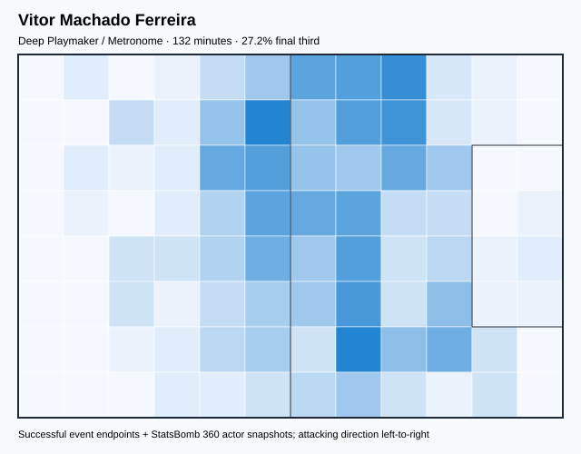

## Physical profile

| Metric | Score |
|---|---:|
| Aerial dominance | 0.000 |
| Pressing intensity per 90 | 13.65 |
| Recovery index per 90 | 4.10 |

## Top chemistry partners

- Kléper Laveran Lima Ferreira — synergy 0.379, 132 shared minutes
- José Diogo Dalot Teixeira — synergy 0.333, 112 shared minutes
- João Pedro Cavaco Cancelo — synergy 0.325, 111 shared minutes

## Tactical recommendations

- Lead the first pressing trigger and protect the inside passing lane.
- Avoid isolating this player in high-volume aerial matchups.
- Use recovery capacity to support higher attacking positions.

_The heatmap combines successful event endpoints with StatsBomb 360 actor
snapshots. StatsBomb 360 is freeze-frame context, not continuous player
tracking. Ratings include eligible outfield players from 45 minutes and
goalkeepers from 90 minutes; ranking status communicates sample reliability._

---

<!-- PLAYER_REPORT 20: 38803_starter_report.md -->

# Gonçalo Matias Ramos — Starter Report

- Team: Portugal (POR)
- Position: Center Forward
- Functional role: Target Forward
- VAEP offense per 90: 0.8374
- VAEP defense per 90: 0.0771
- VAEP total per 90: 0.9145
- VAEP per touch: 0.01164
- Spatial xT per 90: 0.0006
- Final-third spatial share: 49.1%
- Unified final player rating: 0.3005
- Team rank: #2

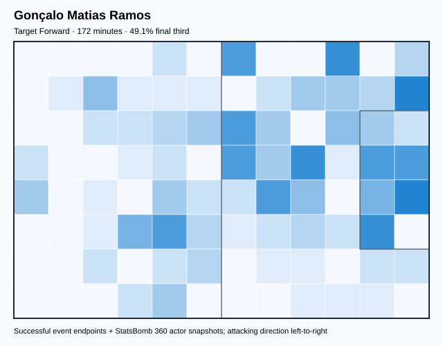

## Physical profile

| Metric | Score |
|---|---:|
| Aerial dominance | 0.364 |
| Pressing intensity per 90 | 15.71 |
| Recovery index per 90 | 1.57 |

## Top chemistry partners

- Rúben Santos Gato Alves Dias — synergy 0.441, 172 shared minutes
- Bernardo Mota Veiga de Carvalho e Silva — synergy 0.395, 159 shared minutes
- Raphaël Adelino José Guerreiro — synergy 0.376, 154 shared minutes

## Tactical recommendations

- Lead the first pressing trigger and protect the inside passing lane.
- Pair with a faster recovery defender after aggressive rotations.

_The heatmap combines successful event endpoints with StatsBomb 360 actor
snapshots. StatsBomb 360 is freeze-frame context, not continuous player
tracking. Ratings include eligible outfield players from 45 minutes and
goalkeepers from 90 minutes; ranking status communicates sample reliability._

---

<!-- PLAYER_REPORT 21: 40874_starter_report.md -->

# Matheus Luiz Nunes — Starter Report

- Team: Portugal (POR)
- Position: Right Center Midfield
- Functional role: Ball-Winner
- VAEP offense per 90: 0.3892
- VAEP defense per 90: 0.0016
- VAEP total per 90: 0.3908
- VAEP per touch: 0.00326
- Spatial xT per 90: 0.0237
- Final-third spatial share: 36.7%
- Unified final player rating: 0.1224
- Team rank: #8

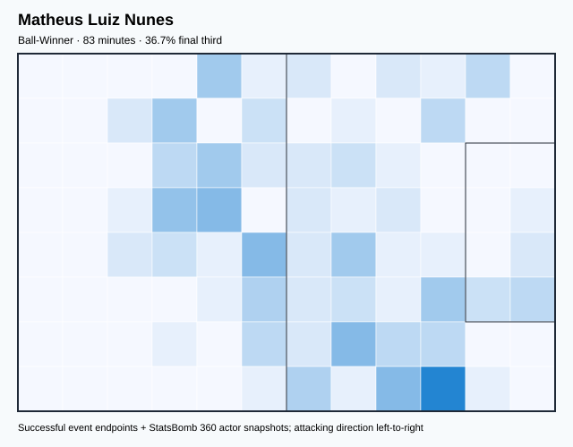

## Physical profile

| Metric | Score |
|---|---:|
| Aerial dominance | 0.000 |
| Pressing intensity per 90 | 7.63 |
| Recovery index per 90 | 1.09 |

## Top chemistry partners

- João Pedro Cavaco Cancelo — synergy 0.252, 83 shared minutes
- Diogo Meireles Costa — synergy 0.238, 83 shared minutes
- Kléper Laveran Lima Ferreira — synergy 0.237, 83 shared minutes

## Tactical recommendations

- Use a compact pressing trigger rather than sustained solo pressure.
- Avoid isolating this player in high-volume aerial matchups.
- Pair with a faster recovery defender after aggressive rotations.

_The heatmap combines successful event endpoints with StatsBomb 360 actor
snapshots. StatsBomb 360 is freeze-frame context, not continuous player
tracking. Ratings include eligible outfield players from 45 minutes and
goalkeepers from 90 minutes; ranking status communicates sample reliability._

---

<!-- PLAYER_REPORT 22: 143854_starter_report.md -->

# António João Pereira Albuquerque Tavares Silva — Starter Report

- Team: Portugal (POR)
- Position: Left Center Back
- Functional role: Sweeper CB
- VAEP offense per 90: -0.0010
- VAEP defense per 90: -0.0129
- VAEP total per 90: -0.0139
- VAEP per touch: -0.00010
- Spatial xT per 90: 0.0053
- Final-third spatial share: 3.0%
- Unified final player rating: -0.0086
- Team rank: #20

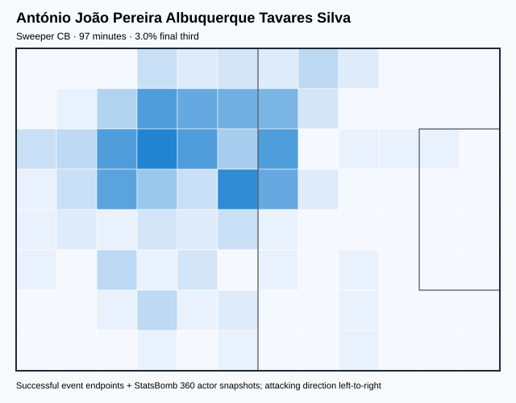

## Physical profile

| Metric | Score |
|---|---:|
| Aerial dominance | 0.375 |
| Pressing intensity per 90 | 2.78 |
| Recovery index per 90 | 1.86 |

## Top chemistry partners

- João Pedro Cavaco Cancelo — synergy 0.296, 97 shared minutes
- Kléper Laveran Lima Ferreira — synergy 0.295, 97 shared minutes
- Diogo Meireles Costa — synergy 0.291, 97 shared minutes

## Tactical recommendations

- Use a compact pressing trigger rather than sustained solo pressure.
- Pair with a faster recovery defender after aggressive rotations.

_The heatmap combines successful event endpoints with StatsBomb 360 actor
snapshots. StatsBomb 360 is freeze-frame context, not continuous player
tracking. Ratings include eligible outfield players from 45 minutes and
goalkeepers from 90 minutes; ranking status communicates sample reliability._
