# QAT — V4 Player Evaluation Collection

<!-- V5_CANONICAL_NOTICE -->
> **Historical V4 player-rating packet.** Player ratings, ranks, role-challenger decisions, and rating uncertainty below are superseded by `results/reports/player_rankings.csv`, `results/reports/player_profiles/`, and `results/reports/model_summary.md`. Possession, tactical, and match-bootstrap material remains a historical V4 result.

- Included eligible players: 15
- Rankings use the role-aware, development-gated VAEP/xT/xD model.
- Heatmaps combine successful on-ball endpoints and SB360 actor snapshots.

---

<!-- PLAYER_REPORT 1: 40784_starter_report.md -->

# Akram Hassan Afif — Starter Report

- Team: Qatar (QAT)
- Position: Left Center Forward
- Functional role: Progressive Winger
- VAEP offense per 90: 0.1056
- VAEP defense per 90: -0.0048
- VAEP total per 90: 0.1008
- VAEP per touch: 0.00062
- Spatial xT per 90: 0.0830
- Final-third spatial share: 26.8%
- Unified final player rating: 0.1721
- Team rank: #3

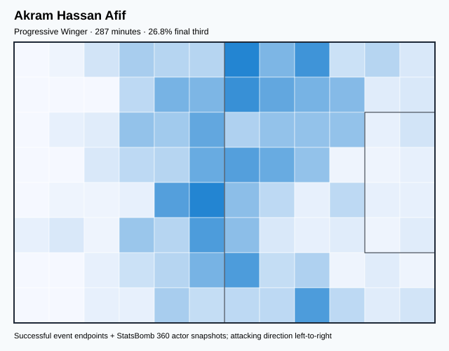

## Physical profile

| Metric | Score |
|---|---:|
| Aerial dominance | 0.500 |
| Pressing intensity per 90 | 7.20 |
| Recovery index per 90 | 5.32 |

## Top chemistry partners

- Boualem Khoukhi — synergy 0.574, 287 shared minutes
- Abdelkarim Hassan Al Haj Fadlalla — synergy 0.540, 287 shared minutes
- Pedro Miguel Correia — synergy 0.529, 274 shared minutes

## Tactical recommendations

- Use a compact pressing trigger rather than sustained solo pressure.
- Use recovery capacity to support higher attacking positions.

_The heatmap combines successful event endpoints with StatsBomb 360 actor
snapshots. StatsBomb 360 is freeze-frame context, not continuous player
tracking. Ratings include eligible outfield players from 45 minutes and
goalkeepers from 90 minutes; ranking status communicates sample reliability._

---

<!-- PLAYER_REPORT 2: 124488_starter_report.md -->

# Hassan Khalid Al Heidos — Starter Report

- Team: Qatar (QAT)
- Position: Left Center Midfield
- Functional role: Ball-Winner
- VAEP offense per 90: 0.0429
- VAEP defense per 90: -0.1743
- VAEP total per 90: -0.1314
- VAEP per touch: -0.00120
- Spatial xT per 90: 0.0344
- Final-third spatial share: 24.3%
- Unified final player rating: 0.0549
- Team rank: #5

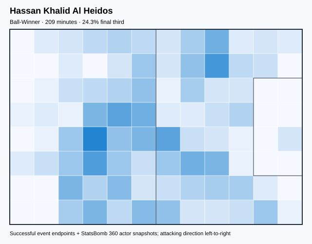

## Physical profile

| Metric | Score |
|---|---:|
| Aerial dominance | 0.000 |
| Pressing intensity per 90 | 22.81 |
| Recovery index per 90 | 4.73 |

## Top chemistry partners

- Boualem Khoukhi — synergy 0.498, 209 shared minutes
- Akram Hassan Afif — synergy 0.477, 209 shared minutes
- Homam Alamin Ahmed — synergy 0.473, 209 shared minutes

## Tactical recommendations

- Lead the first pressing trigger and protect the inside passing lane.
- Avoid isolating this player in high-volume aerial matchups.
- Use recovery capacity to support higher attacking positions.

_The heatmap combines successful event endpoints with StatsBomb 360 actor
snapshots. StatsBomb 360 is freeze-frame context, not continuous player
tracking. Ratings include eligible outfield players from 45 minutes and
goalkeepers from 90 minutes; ranking status communicates sample reliability._

---

<!-- PLAYER_REPORT 3: 124492_starter_report.md -->

# Karim Boudiaf — Starter Report

- Team: Qatar (QAT)
- Position: Center Defensive Midfield
- Functional role: Holding Anchor
- VAEP offense per 90: 0.0326
- VAEP defense per 90: -0.0254
- VAEP total per 90: 0.0072
- VAEP per touch: 0.00005
- Spatial xT per 90: 0.0118
- Final-third spatial share: 10.2%
- Unified final player rating: 0.0169
- Team rank: #9

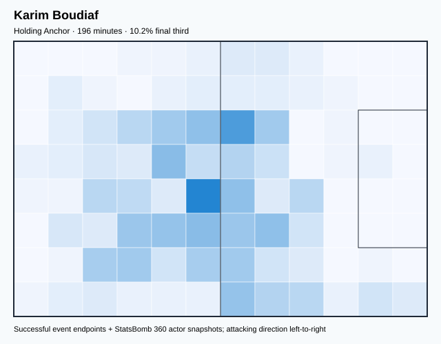

## Physical profile

| Metric | Score |
|---|---:|
| Aerial dominance | 0.692 |
| Pressing intensity per 90 | 13.33 |
| Recovery index per 90 | 3.22 |

## Top chemistry partners

- Abdelkarim Hassan Al Haj Fadlalla — synergy 0.506, 196 shared minutes
- Homam Alamin Ahmed — synergy 0.495, 196 shared minutes
- Boualem Khoukhi — synergy 0.488, 196 shared minutes

## Tactical recommendations

- Lead the first pressing trigger and protect the inside passing lane.
- Target this player on direct restarts and back-post deliveries.
- Use recovery capacity to support higher attacking positions.

_The heatmap combines successful event endpoints with StatsBomb 360 actor
snapshots. StatsBomb 360 is freeze-frame context, not continuous player
tracking. Ratings include eligible outfield players from 45 minutes and
goalkeepers from 90 minutes; ranking status communicates sample reliability._

---

<!-- PLAYER_REPORT 4: 124493_starter_report.md -->

# Boualem Khoukhi — Starter Report

- Team: Qatar (QAT)
- Position: Center Back
- Functional role: Sweeper CB
- VAEP offense per 90: 0.1468
- VAEP defense per 90: -0.0388
- VAEP total per 90: 0.1080
- VAEP per touch: 0.00069
- Spatial xT per 90: 0.0117
- Final-third spatial share: 3.3%
- Unified final player rating: 0.0165
- Team rank: #10

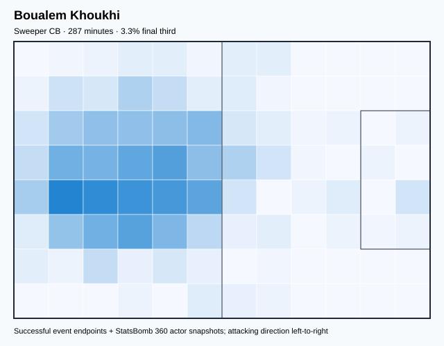

## Physical profile

| Metric | Score |
|---|---:|
| Aerial dominance | 0.545 |
| Pressing intensity per 90 | 6.26 |
| Recovery index per 90 | 5.01 |

## Top chemistry partners

- Abdelkarim Hassan Al Haj Fadlalla — synergy 0.649, 287 shared minutes
- Pedro Miguel Correia — synergy 0.584, 274 shared minutes
- Akram Hassan Afif — synergy 0.574, 287 shared minutes

## Tactical recommendations

- Use a compact pressing trigger rather than sustained solo pressure.
- Use recovery capacity to support higher attacking positions.

_The heatmap combines successful event endpoints with StatsBomb 360 actor
snapshots. StatsBomb 360 is freeze-frame context, not continuous player
tracking. Ratings include eligible outfield players from 45 minutes and
goalkeepers from 90 minutes; ranking status communicates sample reliability._

---

<!-- PLAYER_REPORT 5: 124494_starter_report.md -->

# Abdelkarim Hassan Al Haj Fadlalla — Starter Report

- Team: Qatar (QAT)
- Position: Left Center Back
- Functional role: Wide Creator
- VAEP offense per 90: 0.0463
- VAEP defense per 90: -0.0253
- VAEP total per 90: 0.0210
- VAEP per touch: 0.00015
- Spatial xT per 90: 0.0284
- Final-third spatial share: 12.8%
- Unified final player rating: 0.0007
- Team rank: #12

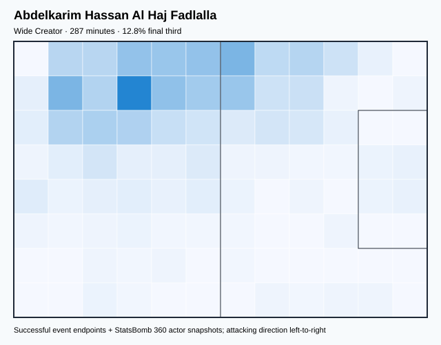

## Physical profile

| Metric | Score |
|---|---:|
| Aerial dominance | 0.500 |
| Pressing intensity per 90 | 10.02 |
| Recovery index per 90 | 3.13 |

## Top chemistry partners

- Boualem Khoukhi — synergy 0.649, 287 shared minutes
- Homam Alamin Ahmed — synergy 0.616, 274 shared minutes
- Akram Hassan Afif — synergy 0.540, 287 shared minutes

## Tactical recommendations

- Use a compact pressing trigger rather than sustained solo pressure.
- Use recovery capacity to support higher attacking positions.

_The heatmap combines successful event endpoints with StatsBomb 360 actor
snapshots. StatsBomb 360 is freeze-frame context, not continuous player
tracking. Ratings include eligible outfield players from 45 minutes and
goalkeepers from 90 minutes; ranking status communicates sample reliability._

---

<!-- PLAYER_REPORT 6: 124495_starter_report.md -->

# Almoez Ali Zainalabiddin Abdulla — Starter Report

- Team: Qatar (QAT)
- Position: Right Center Forward
- Functional role: Ball-Winner
- VAEP offense per 90: 0.1934
- VAEP defense per 90: 0.0357
- VAEP total per 90: 0.2291
- VAEP per touch: 0.00292
- Spatial xT per 90: -0.0037
- Final-third spatial share: 26.6%
- Unified final player rating: 0.1969
- Team rank: #2

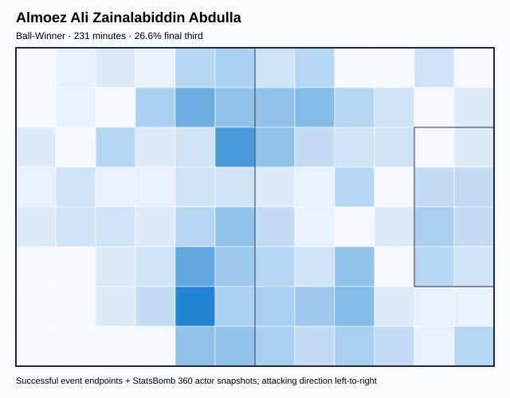

## Physical profile

| Metric | Score |
|---|---:|
| Aerial dominance | 0.154 |
| Pressing intensity per 90 | 16.34 |
| Recovery index per 90 | 2.33 |

## Top chemistry partners

- Homam Alamin Ahmed — synergy 0.458, 218 shared minutes
- Assim Omer Al Haj Madibo — synergy 0.430, 160 shared minutes
- Abdelkarim Hassan Al Haj Fadlalla — synergy 0.370, 231 shared minutes

## Tactical recommendations

- Lead the first pressing trigger and protect the inside passing lane.
- Avoid isolating this player in high-volume aerial matchups.
- Pair with a faster recovery defender after aggressive rotations.

_The heatmap combines successful event endpoints with StatsBomb 360 actor
snapshots. StatsBomb 360 is freeze-frame context, not continuous player
tracking. Ratings include eligible outfield players from 45 minutes and
goalkeepers from 90 minutes; ranking status communicates sample reliability._

---

<!-- PLAYER_REPORT 7: 124496_starter_report.md -->

# Saad Abdullah Al Sheeb — Starter Report

- Team: Qatar (QAT)
- Position: Goalkeeper
- Functional role: Goalkeeper
- VAEP offense per 90: -0.0347
- VAEP defense per 90: -0.1200
- VAEP total per 90: -0.1548
- VAEP per touch: -0.00372
- Spatial xT per 90: 0.0004
- Final-third spatial share: 1.2%
- Unified final player rating: -0.0642
- Team rank: #15

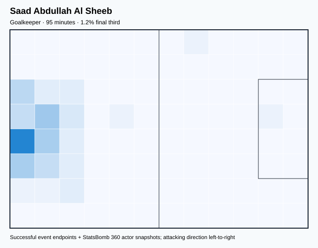

## Physical profile

| Metric | Score |
|---|---:|
| Aerial dominance | 0.000 |
| Pressing intensity per 90 | 0.94 |
| Recovery index per 90 | 3.78 |

## Top chemistry partners

- Boualem Khoukhi — synergy 0.283, 95 shared minutes
- Bassam Hisham Al Rawi — synergy 0.282, 95 shared minutes
- Abdelkarim Hassan Al Haj Fadlalla — synergy 0.280, 95 shared minutes

## Tactical recommendations

- Use a compact pressing trigger rather than sustained solo pressure.
- Avoid isolating this player in high-volume aerial matchups.
- Use recovery capacity to support higher attacking positions.

_The heatmap combines successful event endpoints with StatsBomb 360 actor
snapshots. StatsBomb 360 is freeze-frame context, not continuous player
tracking. Ratings include eligible outfield players from 45 minutes and
goalkeepers from 90 minutes; ranking status communicates sample reliability._

---

<!-- PLAYER_REPORT 8: 124500_starter_report.md -->

# Assim Omer Al Haj Madibo — Starter Report

- Team: Qatar (QAT)
- Position: Center Defensive Midfield
- Functional role: Holding Anchor
- VAEP offense per 90: 0.0002
- VAEP defense per 90: -0.0224
- VAEP total per 90: -0.0222
- VAEP per touch: -0.00022
- Spatial xT per 90: 0.0045
- Final-third spatial share: 4.3%
- Unified final player rating: 0.0133
- Team rank: #11

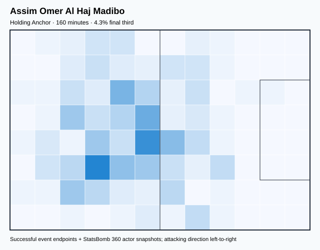

## Physical profile

| Metric | Score |
|---|---:|
| Aerial dominance | 0.750 |
| Pressing intensity per 90 | 29.28 |
| Recovery index per 90 | 4.50 |

## Top chemistry partners

- Boualem Khoukhi — synergy 0.438, 160 shared minutes
- Almoez Ali Zainalabiddin Abdulla — synergy 0.430, 160 shared minutes
- Meshaal Aissa Barsham — synergy 0.410, 160 shared minutes

## Tactical recommendations

- Lead the first pressing trigger and protect the inside passing lane.
- Target this player on direct restarts and back-post deliveries.
- Use recovery capacity to support higher attacking positions.

_The heatmap combines successful event endpoints with StatsBomb 360 actor
snapshots. StatsBomb 360 is freeze-frame context, not continuous player
tracking. Ratings include eligible outfield players from 45 minutes and
goalkeepers from 90 minutes; ranking status communicates sample reliability._

---

<!-- PLAYER_REPORT 9: 124503_starter_report.md -->

# Bassam Hisham Al Rawi — Starter Report

- Team: Qatar (QAT)
- Position: Right Center Back
- Functional role: Sweeper CB
- VAEP offense per 90: -0.0097
- VAEP defense per 90: -0.0457
- VAEP total per 90: -0.0554
- VAEP per touch: -0.00041
- Spatial xT per 90: 0.0350
- Final-third spatial share: 3.3%
- Unified final player rating: -0.0112
- Team rank: #13

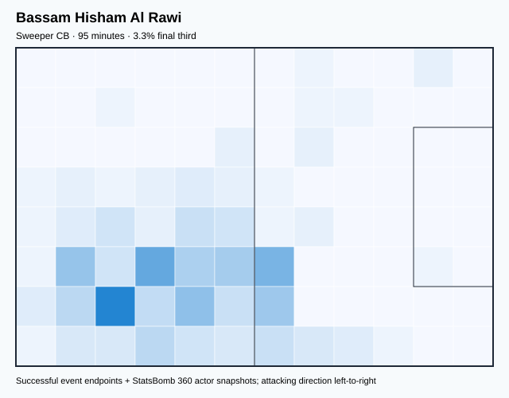

## Physical profile

| Metric | Score |
|---|---:|
| Aerial dominance | 1.000 |
| Pressing intensity per 90 | 7.55 |
| Recovery index per 90 | 0.00 |

## Top chemistry partners

- Boualem Khoukhi — synergy 0.293, 95 shared minutes
- Karim Boudiaf — synergy 0.286, 95 shared minutes
- Saad Abdullah Al Sheeb — synergy 0.282, 95 shared minutes

## Tactical recommendations

- Use a compact pressing trigger rather than sustained solo pressure.
- Target this player on direct restarts and back-post deliveries.
- Pair with a faster recovery defender after aggressive rotations.

_The heatmap combines successful event endpoints with StatsBomb 360 actor
snapshots. StatsBomb 360 is freeze-frame context, not continuous player
tracking. Ratings include eligible outfield players from 45 minutes and
goalkeepers from 90 minutes; ranking status communicates sample reliability._

---

<!-- PLAYER_REPORT 10: 124506_starter_report.md -->

# Pedro Miguel Correia — Starter Report

- Team: Qatar (QAT)
- Position: Right Center Back
- Functional role: Deep Playmaker
- VAEP offense per 90: 0.1557
- VAEP defense per 90: -0.0282
- VAEP total per 90: 0.1275
- VAEP per touch: 0.00127
- Spatial xT per 90: 0.0208
- Final-third spatial share: 15.5%
- Unified final player rating: 0.0201
- Team rank: #8

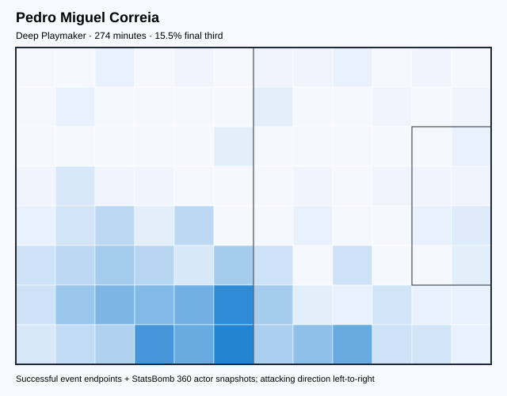

## Physical profile

| Metric | Score |
|---|---:|
| Aerial dominance | 0.667 |
| Pressing intensity per 90 | 11.84 |
| Recovery index per 90 | 3.29 |

## Top chemistry partners

- Boualem Khoukhi — synergy 0.584, 274 shared minutes
- Akram Hassan Afif — synergy 0.529, 274 shared minutes
- Abdelkarim Hassan Al Haj Fadlalla — synergy 0.527, 274 shared minutes

## Tactical recommendations

- Lead the first pressing trigger and protect the inside passing lane.
- Target this player on direct restarts and back-post deliveries.
- Use recovery capacity to support higher attacking positions.

_The heatmap combines successful event endpoints with StatsBomb 360 actor
snapshots. StatsBomb 360 is freeze-frame context, not continuous player
tracking. Ratings include eligible outfield players from 45 minutes and
goalkeepers from 90 minutes; ranking status communicates sample reliability._

---

<!-- PLAYER_REPORT 11: 124510_starter_report.md -->

# Meshaal Aissa Barsham — Starter Report

- Team: Qatar (QAT)
- Position: Goalkeeper
- Functional role: Goalkeeper
- VAEP offense per 90: -0.0023
- VAEP defense per 90: -0.1161
- VAEP total per 90: -0.1184
- VAEP per touch: -0.00205
- Spatial xT per 90: 0.0004
- Final-third spatial share: 0.0%
- Unified final player rating: -0.0608
- Team rank: #14

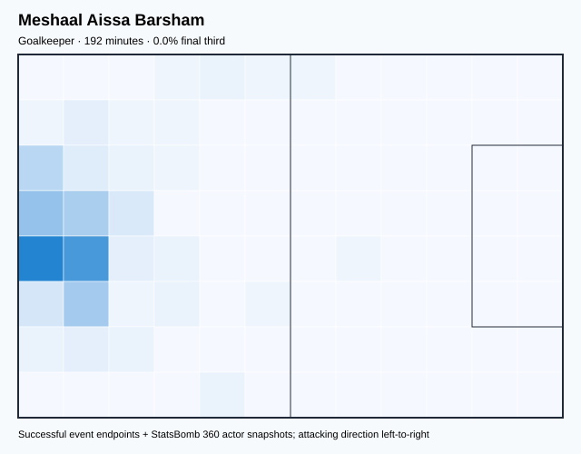

## Physical profile

| Metric | Score |
|---|---:|
| Aerial dominance | 0.000 |
| Pressing intensity per 90 | 0.00 |
| Recovery index per 90 | 3.28 |

## Top chemistry partners

- Abdelkarim Hassan Al Haj Fadlalla — synergy 0.494, 192 shared minutes
- Boualem Khoukhi — synergy 0.487, 192 shared minutes
- Pedro Miguel Correia — synergy 0.463, 178 shared minutes

## Tactical recommendations

- Use a compact pressing trigger rather than sustained solo pressure.
- Avoid isolating this player in high-volume aerial matchups.
- Use recovery capacity to support higher attacking positions.

_The heatmap combines successful event endpoints with StatsBomb 360 actor
snapshots. StatsBomb 360 is freeze-frame context, not continuous player
tracking. Ratings include eligible outfield players from 45 minutes and
goalkeepers from 90 minutes; ranking status communicates sample reliability._

---

<!-- PLAYER_REPORT 12: 124514_starter_report.md -->

# Abdulaziz Hatem Mohammed Abdullah — Starter Report

- Team: Qatar (QAT)
- Position: Left Center Midfield
- Functional role: Ball-Winner
- VAEP offense per 90: 0.0275
- VAEP defense per 90: 0.0059
- VAEP total per 90: 0.0334
- VAEP per touch: 0.00029
- Spatial xT per 90: 0.0109
- Final-third spatial share: 17.7%
- Unified final player rating: 0.0799
- Team rank: #4

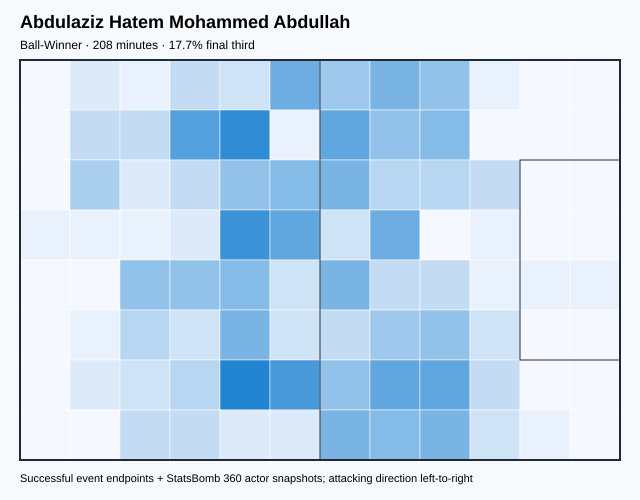

## Physical profile

| Metric | Score |
|---|---:|
| Aerial dominance | 0.333 |
| Pressing intensity per 90 | 9.54 |
| Recovery index per 90 | 0.87 |

## Top chemistry partners

- Pedro Miguel Correia — synergy 0.495, 194 shared minutes
- Abdelkarim Hassan Al Haj Fadlalla — synergy 0.490, 208 shared minutes
- Akram Hassan Afif — synergy 0.482, 208 shared minutes

## Tactical recommendations

- Use a compact pressing trigger rather than sustained solo pressure.
- Pair with a faster recovery defender after aggressive rotations.

_The heatmap combines successful event endpoints with StatsBomb 360 actor
snapshots. StatsBomb 360 is freeze-frame context, not continuous player
tracking. Ratings include eligible outfield players from 45 minutes and
goalkeepers from 90 minutes; ranking status communicates sample reliability._

---

<!-- PLAYER_REPORT 13: 124899_starter_report.md -->

# Ismaeel Mohammad Mohammad — Starter Report

- Team: Qatar (QAT)
- Position: Right Wing Back
- Functional role: Attacking Wingback
- VAEP offense per 90: 0.2318
- VAEP defense per 90: -0.1624
- VAEP total per 90: 0.0694
- VAEP per touch: 0.00071
- Spatial xT per 90: 0.0742
- Final-third spatial share: 45.3%
- Unified final player rating: 0.0525
- Team rank: #6

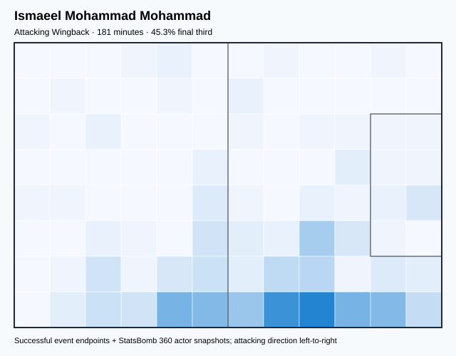

## Physical profile

| Metric | Score |
|---|---:|
| Aerial dominance | 0.333 |
| Pressing intensity per 90 | 9.97 |
| Recovery index per 90 | 1.99 |

## Top chemistry partners

- Akram Hassan Afif — synergy 0.472, 181 shared minutes
- Homam Alamin Ahmed — synergy 0.427, 167 shared minutes
- Assim Omer Al Haj Madibo — synergy 0.396, 160 shared minutes

## Tactical recommendations

- Use a compact pressing trigger rather than sustained solo pressure.
- Pair with a faster recovery defender after aggressive rotations.

_The heatmap combines successful event endpoints with StatsBomb 360 actor
snapshots. StatsBomb 360 is freeze-frame context, not continuous player
tracking. Ratings include eligible outfield players from 45 minutes and
goalkeepers from 90 minutes; ranking status communicates sample reliability._

---

<!-- PLAYER_REPORT 14: 124900_starter_report.md -->

# Homam Alamin Ahmed — Starter Report

- Team: Qatar (QAT)
- Position: Left Wing Back
- Functional role: Wide Creator
- VAEP offense per 90: 0.1143
- VAEP defense per 90: -0.0273
- VAEP total per 90: 0.0871
- VAEP per touch: 0.00097
- Spatial xT per 90: -0.0004
- Final-third spatial share: 30.3%
- Unified final player rating: 0.0499
- Team rank: #7

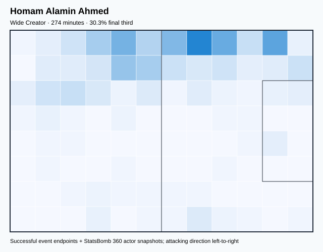

## Physical profile

| Metric | Score |
|---|---:|
| Aerial dominance | 0.714 |
| Pressing intensity per 90 | 10.53 |
| Recovery index per 90 | 2.30 |

## Top chemistry partners

- Abdelkarim Hassan Al Haj Fadlalla — synergy 0.616, 274 shared minutes
- Pedro Miguel Correia — synergy 0.525, 274 shared minutes
- Boualem Khoukhi — synergy 0.517, 274 shared minutes

## Tactical recommendations

- Use a compact pressing trigger rather than sustained solo pressure.
- Target this player on direct restarts and back-post deliveries.
- Pair with a faster recovery defender after aggressive rotations.

_The heatmap combines successful event endpoints with StatsBomb 360 actor
snapshots. StatsBomb 360 is freeze-frame context, not continuous player
tracking. Ratings include eligible outfield players from 45 minutes and
goalkeepers from 90 minutes; ranking status communicates sample reliability._

---

<!-- PLAYER_REPORT 15: 124901_starter_report.md -->

# Mohammed Muntari — Starter Report

- Team: Qatar (QAT)
- Position: Right Center Forward
- Functional role: Target Forward / Penalty-Box Anchor
- VAEP offense per 90: 0.2056
- VAEP defense per 90: 0.0873
- VAEP total per 90: 0.2930
- VAEP per touch: 0.00367
- Spatial xT per 90: -0.0009
- Final-third spatial share: 17.1%
- Unified final player rating: 0.2257
- Team rank: #1

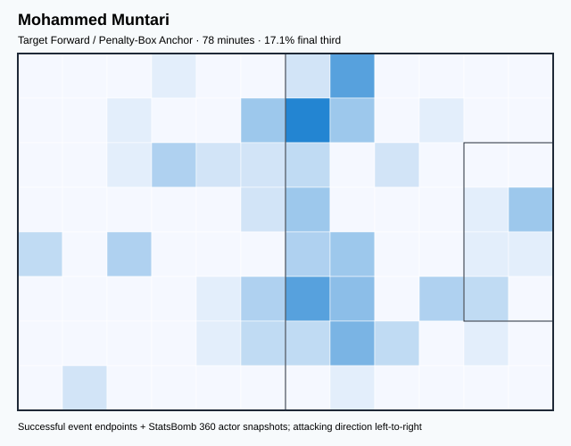

## Physical profile

| Metric | Score |
|---|---:|
| Aerial dominance | 0.667 |
| Pressing intensity per 90 | 17.36 |
| Recovery index per 90 | 3.47 |

## Top chemistry partners

- Boualem Khoukhi — synergy 0.232, 78 shared minutes
- Akram Hassan Afif — synergy 0.220, 78 shared minutes
- Abdulaziz Hatem Mohammed Abdullah — synergy 0.203, 66 shared minutes

## Tactical recommendations

- Lead the first pressing trigger and protect the inside passing lane.
- Target this player on direct restarts and back-post deliveries.
- Use recovery capacity to support higher attacking positions.

_The heatmap combines successful event endpoints with StatsBomb 360 actor
snapshots. StatsBomb 360 is freeze-frame context, not continuous player
tracking. Ratings include eligible outfield players from 45 minutes and
goalkeepers from 90 minutes; ranking status communicates sample reliability._
