# SEN — V4 Player Evaluation Collection

<!-- V5_CANONICAL_NOTICE -->
> **Historical V4 player-rating packet.** Player ratings, ranks, role-challenger decisions, and rating uncertainty below are superseded by `results/reports/player_rankings.csv`, `results/reports/player_profiles/`, and `results/reports/model_summary.md`. Possession, tactical, and match-bootstrap material remains a historical V4 result.

- Included eligible players: 18
- Rankings use the role-aware, development-gated VAEP/xT/xD model.
- Heatmaps combine successful on-ball endpoints and SB360 actor snapshots.

---

<!-- PLAYER_REPORT 1: 2941_starter_report.md -->

# Ismaïla Sarr — Starter Report

- Team: Senegal (SEN)
- Position: Left Wing
- Functional role: Progressive Winger
- VAEP offense per 90: 0.4656
- VAEP defense per 90: -0.0045
- VAEP total per 90: 0.4611
- VAEP per touch: 0.00503
- Spatial xT per 90: 0.0903
- Final-third spatial share: 56.0%
- Unified final player rating: 0.2095
- Team rank: #3

## Physical profile

| Metric | Score |
|---|---:|
| Aerial dominance | 0.500 |
| Pressing intensity per 90 | 13.31 |
| Recovery index per 90 | 3.94 |

## Top chemistry partners

- Youssouf Sabaly — synergy 0.628, 365 shared minutes
- Nampalys Mendy — synergy 0.579, 291 shared minutes
- Kalidou Koulibaly — synergy 0.542, 365 shared minutes

## Tactical recommendations

- Lead the first pressing trigger and protect the inside passing lane.
- Use recovery capacity to support higher attacking positions.

_The heatmap combines successful event endpoints with StatsBomb 360 actor
snapshots. StatsBomb 360 is freeze-frame context, not continuous player
tracking. Ratings include eligible outfield players from 45 minutes and
goalkeepers from 90 minutes; ranking status communicates sample reliability._

---

<!-- PLAYER_REPORT 2: 3404_starter_report.md -->

# Youssouf Sabaly — Starter Report

- Team: Senegal (SEN)
- Position: Right Back
- Functional role: Attacking Wingback
- VAEP offense per 90: 0.1545
- VAEP defense per 90: -0.0222
- VAEP total per 90: 0.1322
- VAEP per touch: 0.00096
- Spatial xT per 90: 0.0776
- Final-third spatial share: 34.9%
- Unified final player rating: 0.0667
- Team rank: #9

## Physical profile

| Metric | Score |
|---|---:|
| Aerial dominance | 0.429 |
| Pressing intensity per 90 | 11.85 |
| Recovery index per 90 | 6.04 |

## Top chemistry partners

- Kalidou Koulibaly — synergy 0.747, 387 shared minutes
- Abdou Diallo — synergy 0.697, 349 shared minutes
- Edouard Mendy — synergy 0.676, 387 shared minutes

## Tactical recommendations

- Lead the first pressing trigger and protect the inside passing lane.
- Use recovery capacity to support higher attacking positions.

_The heatmap combines successful event endpoints with StatsBomb 360 actor
snapshots. StatsBomb 360 is freeze-frame context, not continuous player
tracking. Ratings include eligible outfield players from 45 minutes and
goalkeepers from 90 minutes; ranking status communicates sample reliability._

---

<!-- PLAYER_REPORT 3: 3436_starter_report.md -->

# Idrissa Gana Gueye — Starter Report

- Team: Senegal (SEN)
- Position: Center Attacking Midfield
- Functional role: Ball-Winner
- VAEP offense per 90: 0.1582
- VAEP defense per 90: 0.0067
- VAEP total per 90: 0.1649
- VAEP per touch: 0.00146
- Spatial xT per 90: 0.0092
- Final-third spatial share: 40.4%
- Unified final player rating: 0.1404
- Team rank: #8

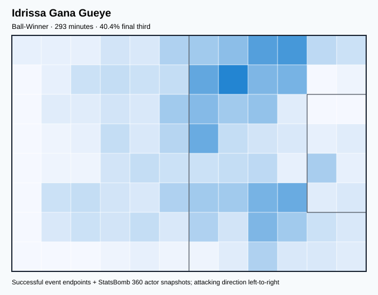

## Physical profile

| Metric | Score |
|---|---:|
| Aerial dominance | 0.286 |
| Pressing intensity per 90 | 21.80 |
| Recovery index per 90 | 5.53 |

## Top chemistry partners

- Kalidou Koulibaly — synergy 0.601, 293 shared minutes
- Youssouf Sabaly — synergy 0.554, 293 shared minutes
- Ismail Jakobs — synergy 0.534, 213 shared minutes

## Tactical recommendations

- Lead the first pressing trigger and protect the inside passing lane.
- Use recovery capacity to support higher attacking positions.

_The heatmap combines successful event endpoints with StatsBomb 360 actor
snapshots. StatsBomb 360 is freeze-frame context, not continuous player
tracking. Ratings include eligible outfield players from 45 minutes and
goalkeepers from 90 minutes; ranking status communicates sample reliability._

---

<!-- PLAYER_REPORT 4: 3684_starter_report.md -->

# Cheikhou Kouyaté — Starter Report

- Team: Senegal (SEN)
- Position: Right Defensive Midfield
- Functional role: Ball-Winner
- VAEP offense per 90: 0.0951
- VAEP defense per 90: -0.3045
- VAEP total per 90: -0.2094
- VAEP per touch: -0.00258
- Spatial xT per 90: -0.0106
- Final-third spatial share: 30.4%
- Unified final player rating: 0.0036
- Team rank: #14

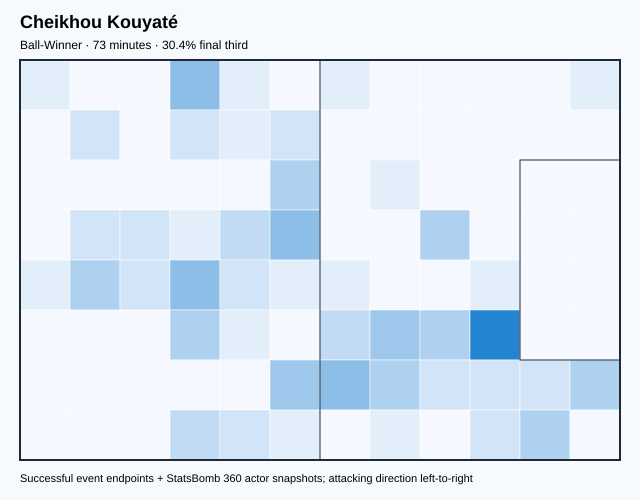

## Physical profile

| Metric | Score |
|---|---:|
| Aerial dominance | 0.333 |
| Pressing intensity per 90 | 13.53 |
| Recovery index per 90 | 2.46 |

## Top chemistry partners

- Nampalys Mendy — synergy 0.227, 73 shared minutes
- Idrissa Gana Gueye — synergy 0.224, 73 shared minutes
- Pape Abou Cissé — synergy 0.218, 73 shared minutes

## Tactical recommendations

- Lead the first pressing trigger and protect the inside passing lane.
- Pair with a faster recovery defender after aggressive rotations.

_The heatmap combines successful event endpoints with StatsBomb 360 actor
snapshots. StatsBomb 360 is freeze-frame context, not continuous player
tracking. Ratings include eligible outfield players from 45 minutes and
goalkeepers from 90 minutes; ranking status communicates sample reliability._

---

<!-- PLAYER_REPORT 5: 4506_starter_report.md -->

# Nampalys Mendy — Starter Report

- Team: Senegal (SEN)
- Position: Left Defensive Midfield
- Functional role: Holding Anchor
- VAEP offense per 90: 0.0519
- VAEP defense per 90: -0.0106
- VAEP total per 90: 0.0413
- VAEP per touch: 0.00033
- Spatial xT per 90: 0.0282
- Final-third spatial share: 23.8%
- Unified final player rating: 0.0235
- Team rank: #12

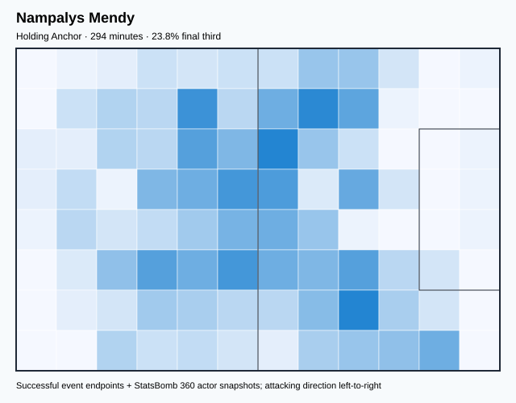

## Physical profile

| Metric | Score |
|---|---:|
| Aerial dominance | 0.000 |
| Pressing intensity per 90 | 12.84 |
| Recovery index per 90 | 5.20 |

## Top chemistry partners

- Youssouf Sabaly — synergy 0.639, 294 shared minutes
- Kalidou Koulibaly — synergy 0.624, 294 shared minutes
- Abdou Diallo — synergy 0.604, 256 shared minutes

## Tactical recommendations

- Lead the first pressing trigger and protect the inside passing lane.
- Avoid isolating this player in high-volume aerial matchups.
- Use recovery capacity to support higher attacking positions.

_The heatmap combines successful event endpoints with StatsBomb 360 actor
snapshots. StatsBomb 360 is freeze-frame context, not continuous player
tracking. Ratings include eligible outfield players from 45 minutes and
goalkeepers from 90 minutes; ranking status communicates sample reliability._

---

<!-- PLAYER_REPORT 6: 5675_starter_report.md -->

# Kalidou Koulibaly — Starter Report

- Team: Senegal (SEN)
- Position: Right Center Back
- Functional role: Sweeper CB
- VAEP offense per 90: 0.0266
- VAEP defense per 90: -0.0222
- VAEP total per 90: 0.0044
- VAEP per touch: 0.00004
- Spatial xT per 90: 0.0112
- Final-third spatial share: 4.3%
- Unified final player rating: -0.0028
- Team rank: #16

## Physical profile

| Metric | Score |
|---|---:|
| Aerial dominance | 0.800 |
| Pressing intensity per 90 | 9.30 |
| Recovery index per 90 | 4.65 |

## Top chemistry partners

- Edouard Mendy — synergy 0.753, 387 shared minutes
- Youssouf Sabaly — synergy 0.747, 387 shared minutes
- Abdou Diallo — synergy 0.716, 349 shared minutes

## Tactical recommendations

- Use a compact pressing trigger rather than sustained solo pressure.
- Target this player on direct restarts and back-post deliveries.
- Use recovery capacity to support higher attacking positions.

_The heatmap combines successful event endpoints with StatsBomb 360 actor
snapshots. StatsBomb 360 is freeze-frame context, not continuous player
tracking. Ratings include eligible outfield players from 45 minutes and
goalkeepers from 90 minutes; ranking status communicates sample reliability._

---

<!-- PLAYER_REPORT 7: 7379_starter_report.md -->

# Edouard Mendy — Starter Report

- Team: Senegal (SEN)
- Position: Goalkeeper
- Functional role: Goalkeeper
- VAEP offense per 90: -0.0118
- VAEP defense per 90: -0.1169
- VAEP total per 90: -0.1286
- VAEP per touch: -0.00242
- Spatial xT per 90: 0.0055
- Final-third spatial share: 1.7%
- Unified final player rating: -0.0625
- Team rank: #18

## Physical profile

| Metric | Score |
|---|---:|
| Aerial dominance | 0.000 |
| Pressing intensity per 90 | 0.00 |
| Recovery index per 90 | 3.72 |

## Top chemistry partners

- Kalidou Koulibaly — synergy 0.753, 387 shared minutes
- Abdou Diallo — synergy 0.712, 349 shared minutes
- Youssouf Sabaly — synergy 0.676, 387 shared minutes

## Tactical recommendations

- Use a compact pressing trigger rather than sustained solo pressure.
- Avoid isolating this player in high-volume aerial matchups.
- Use recovery capacity to support higher attacking positions.

_The heatmap combines successful event endpoints with StatsBomb 360 actor
snapshots. StatsBomb 360 is freeze-frame context, not continuous player
tracking. Ratings include eligible outfield players from 45 minutes and
goalkeepers from 90 minutes; ranking status communicates sample reliability._

---

<!-- PLAYER_REPORT 8: 8553_starter_report.md -->

# Abdou Diallo — Starter Report

- Team: Senegal (SEN)
- Position: Left Center Back
- Functional role: Sweeper CB
- VAEP offense per 90: 0.0207
- VAEP defense per 90: -0.0315
- VAEP total per 90: -0.0108
- VAEP per touch: -0.00009
- Spatial xT per 90: 0.0357
- Final-third spatial share: 9.7%
- Unified final player rating: -0.0044
- Team rank: #17

## Physical profile

| Metric | Score |
|---|---:|
| Aerial dominance | 0.583 |
| Pressing intensity per 90 | 6.71 |
| Recovery index per 90 | 0.77 |

## Top chemistry partners

- Kalidou Koulibaly — synergy 0.716, 349 shared minutes
- Edouard Mendy — synergy 0.712, 349 shared minutes
- Youssouf Sabaly — synergy 0.697, 349 shared minutes

## Tactical recommendations

- Use a compact pressing trigger rather than sustained solo pressure.
- Target this player on direct restarts and back-post deliveries.
- Pair with a faster recovery defender after aggressive rotations.

_The heatmap combines successful event endpoints with StatsBomb 360 actor
snapshots. StatsBomb 360 is freeze-frame context, not continuous player
tracking. Ratings include eligible outfield players from 45 minutes and
goalkeepers from 90 minutes; ranking status communicates sample reliability._

---

<!-- PLAYER_REPORT 9: 13314_starter_report.md -->

# Famara Diedhiou — Starter Report

- Team: Senegal (SEN)
- Position: Center Forward
- Functional role: Target Forward
- VAEP offense per 90: 0.5425
- VAEP defense per 90: 0.0063
- VAEP total per 90: 0.5488
- VAEP per touch: 0.00687
- Spatial xT per 90: 0.0055
- Final-third spatial share: 38.8%
- Unified final player rating: 0.2460
- Team rank: #1

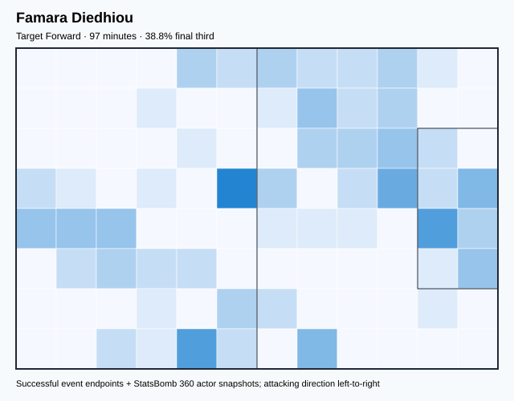

## Physical profile

| Metric | Score |
|---|---:|
| Aerial dominance | 0.375 |
| Pressing intensity per 90 | 16.72 |
| Recovery index per 90 | 2.79 |

## Top chemistry partners

- Nampalys Mendy — synergy 0.276, 97 shared minutes
- Youssouf Sabaly — synergy 0.249, 97 shared minutes
- Edouard Mendy — synergy 0.242, 97 shared minutes

## Tactical recommendations

- Lead the first pressing trigger and protect the inside passing lane.
- Use recovery capacity to support higher attacking positions.

_The heatmap combines successful event endpoints with StatsBomb 360 actor
snapshots. StatsBomb 360 is freeze-frame context, not continuous player
tracking. Ratings include eligible outfield players from 45 minutes and
goalkeepers from 90 minutes; ranking status communicates sample reliability._

---

<!-- PLAYER_REPORT 10: 15970_starter_report.md -->

# Pape Abou Cissé — Starter Report

- Team: Senegal (SEN)
- Position: Left Center Back
- Functional role: Sweeper CB
- VAEP offense per 90: 0.1412
- VAEP defense per 90: -0.0430
- VAEP total per 90: 0.0982
- VAEP per touch: 0.00127
- Spatial xT per 90: -0.0031
- Final-third spatial share: 6.3%
- Unified final player rating: 0.0032
- Team rank: #15

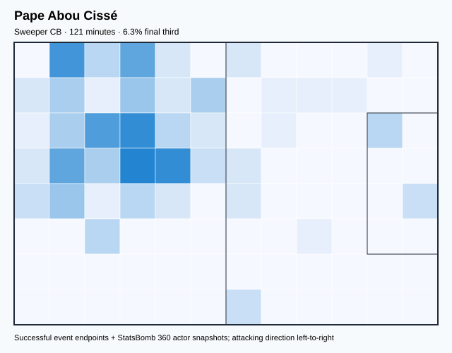

## Physical profile

| Metric | Score |
|---|---:|
| Aerial dominance | 0.400 |
| Pressing intensity per 90 | 5.93 |
| Recovery index per 90 | 0.74 |

## Top chemistry partners

- Edouard Mendy — synergy 0.353, 121 shared minutes
- Kalidou Koulibaly — synergy 0.343, 121 shared minutes
- Youssouf Sabaly — synergy 0.336, 121 shared minutes

## Tactical recommendations

- Use a compact pressing trigger rather than sustained solo pressure.
- Pair with a faster recovery defender after aggressive rotations.

_The heatmap combines successful event endpoints with StatsBomb 360 actor
snapshots. StatsBomb 360 is freeze-frame context, not continuous player
tracking. Ratings include eligible outfield players from 45 minutes and
goalkeepers from 90 minutes; ranking status communicates sample reliability._

---

<!-- PLAYER_REPORT 11: 20611_starter_report.md -->

# Boulaye Dia — Starter Report

- Team: Senegal (SEN)
- Position: Center Attacking Midfield
- Functional role: Target Forward
- VAEP offense per 90: 0.2614
- VAEP defense per 90: -0.0022
- VAEP total per 90: 0.2592
- VAEP per touch: 0.00388
- Spatial xT per 90: -0.0076
- Final-third spatial share: 57.7%
- Unified final player rating: 0.1566
- Team rank: #7

## Physical profile

| Metric | Score |
|---|---:|
| Aerial dominance | 0.364 |
| Pressing intensity per 90 | 8.73 |
| Recovery index per 90 | 2.18 |

## Top chemistry partners

- Youssouf Sabaly — synergy 0.554, 330 shared minutes
- Nampalys Mendy — synergy 0.530, 237 shared minutes
- Idrissa Gana Gueye — synergy 0.487, 259 shared minutes

## Tactical recommendations

- Use a compact pressing trigger rather than sustained solo pressure.
- Pair with a faster recovery defender after aggressive rotations.

_The heatmap combines successful event endpoints with StatsBomb 360 actor
snapshots. StatsBomb 360 is freeze-frame context, not continuous player
tracking. Ratings include eligible outfield players from 45 minutes and
goalkeepers from 90 minutes; ranking status communicates sample reliability._

---

<!-- PLAYER_REPORT 12: 20758_starter_report.md -->

# Krépin Diatta — Starter Report

- Team: Senegal (SEN)
- Position: Right Wing
- Functional role: Progressive Winger
- VAEP offense per 90: 0.2345
- VAEP defense per 90: 0.0092
- VAEP total per 90: 0.2437
- VAEP per touch: 0.00184
- Spatial xT per 90: 0.0943
- Final-third spatial share: 55.4%
- Unified final player rating: 0.1664
- Team rank: #5

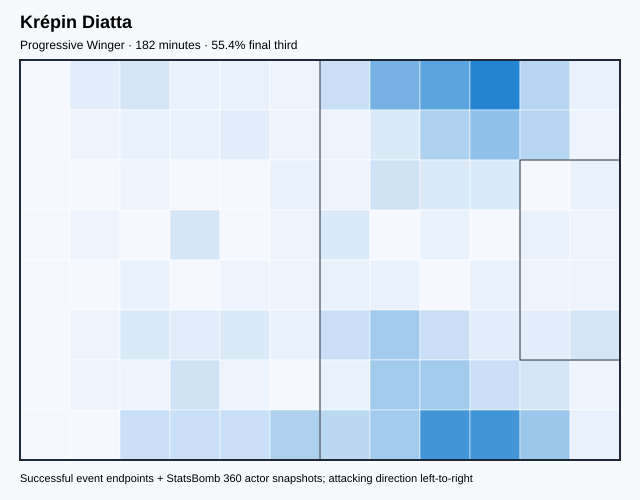

## Physical profile

| Metric | Score |
|---|---:|
| Aerial dominance | 0.600 |
| Pressing intensity per 90 | 21.27 |
| Recovery index per 90 | 4.95 |

## Top chemistry partners

- Nampalys Mendy — synergy 0.443, 182 shared minutes
- Youssouf Sabaly — synergy 0.428, 182 shared minutes
- Abdou Diallo — synergy 0.418, 170 shared minutes

## Tactical recommendations

- Lead the first pressing trigger and protect the inside passing lane.
- Target this player on direct restarts and back-post deliveries.
- Use recovery capacity to support higher attacking positions.

_The heatmap combines successful event endpoints with StatsBomb 360 actor
snapshots. StatsBomb 360 is freeze-frame context, not continuous player
tracking. Ratings include eligible outfield players from 45 minutes and
goalkeepers from 90 minutes; ranking status communicates sample reliability._

---

<!-- PLAYER_REPORT 13: 21026_starter_report.md -->

# Pape Gueye — Starter Report

- Team: Senegal (SEN)
- Position: Left Defensive Midfield
- Functional role: Holding Anchor
- VAEP offense per 90: 0.1651
- VAEP defense per 90: 0.0043
- VAEP total per 90: 0.1694
- VAEP per touch: 0.00197
- Spatial xT per 90: 0.0515
- Final-third spatial share: 26.9%
- Unified final player rating: 0.0422
- Team rank: #11

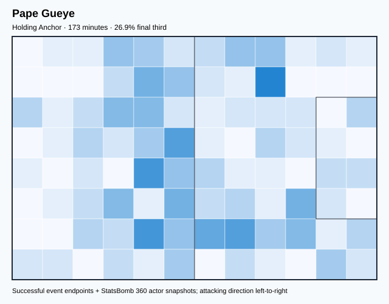

## Physical profile

| Metric | Score |
|---|---:|
| Aerial dominance | 0.857 |
| Pressing intensity per 90 | 11.96 |
| Recovery index per 90 | 5.20 |

## Top chemistry partners

- Youssouf Sabaly — synergy 0.447, 173 shared minutes
- Edouard Mendy — synergy 0.446, 173 shared minutes
- Ismail Jakobs — synergy 0.429, 163 shared minutes

## Tactical recommendations

- Lead the first pressing trigger and protect the inside passing lane.
- Target this player on direct restarts and back-post deliveries.
- Use recovery capacity to support higher attacking positions.

_The heatmap combines successful event endpoints with StatsBomb 360 actor
snapshots. StatsBomb 360 is freeze-frame context, not continuous player
tracking. Ratings include eligible outfield players from 45 minutes and
goalkeepers from 90 minutes; ranking status communicates sample reliability._

---

<!-- PLAYER_REPORT 14: 31751_starter_report.md -->

# Pathé Ismaël Ciss — Starter Report

- Team: Senegal (SEN)
- Position: Right Defensive Midfield
- Functional role: Box-to-Box / Engine Midfielder
- VAEP offense per 90: 0.0163
- VAEP defense per 90: -0.0068
- VAEP total per 90: 0.0094
- VAEP per touch: 0.00010
- Spatial xT per 90: 0.0281
- Final-third spatial share: 10.8%
- Unified final player rating: 0.0188
- Team rank: #13

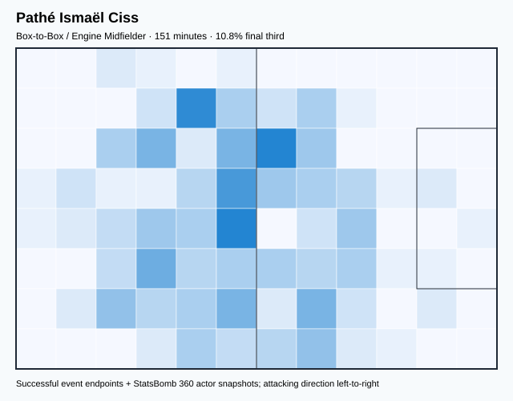

## Physical profile

| Metric | Score |
|---|---:|
| Aerial dominance | 0.750 |
| Pressing intensity per 90 | 18.46 |
| Recovery index per 90 | 4.17 |

## Top chemistry partners

- Youssouf Sabaly — synergy 0.417, 151 shared minutes
- Kalidou Koulibaly — synergy 0.415, 151 shared minutes
- Abdou Diallo — synergy 0.414, 151 shared minutes

## Tactical recommendations

- Lead the first pressing trigger and protect the inside passing lane.
- Target this player on direct restarts and back-post deliveries.
- Use recovery capacity to support higher attacking positions.

_The heatmap combines successful event endpoints with StatsBomb 360 actor
snapshots. StatsBomb 360 is freeze-frame context, not continuous player
tracking. Ratings include eligible outfield players from 45 minutes and
goalkeepers from 90 minutes; ranking status communicates sample reliability._

---

<!-- PLAYER_REPORT 15: 32915_starter_report.md -->

# Ismail Jakobs — Starter Report

- Team: Senegal (SEN)
- Position: Left Back
- Functional role: Attacking Wingback
- VAEP offense per 90: 0.0560
- VAEP defense per 90: -0.0097
- VAEP total per 90: 0.0463
- VAEP per touch: 0.00044
- Spatial xT per 90: 0.0888
- Final-third spatial share: 31.1%
- Unified final player rating: 0.0486
- Team rank: #10

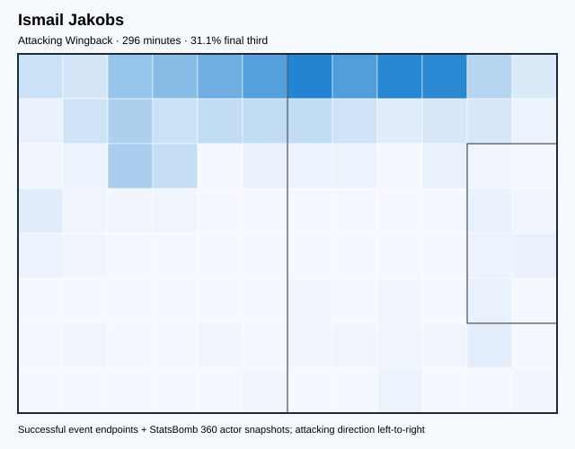

## Physical profile

| Metric | Score |
|---|---:|
| Aerial dominance | 0.786 |
| Pressing intensity per 90 | 9.41 |
| Recovery index per 90 | 3.04 |

## Top chemistry partners

- Edouard Mendy — synergy 0.616, 296 shared minutes
- Youssouf Sabaly — synergy 0.611, 296 shared minutes
- Abdou Diallo — synergy 0.582, 258 shared minutes

## Tactical recommendations

- Use a compact pressing trigger rather than sustained solo pressure.
- Target this player on direct restarts and back-post deliveries.
- Use recovery capacity to support higher attacking positions.

_The heatmap combines successful event endpoints with StatsBomb 360 actor
snapshots. StatsBomb 360 is freeze-frame context, not continuous player
tracking. Ratings include eligible outfield players from 45 minutes and
goalkeepers from 90 minutes; ranking status communicates sample reliability._

---

<!-- PLAYER_REPORT 16: 50498_starter_report.md -->

# Pape Matar Sarr — Starter Report

- Team: Senegal (SEN)
- Position: Center Attacking Midfield
- Functional role: Holding Anchor
- VAEP offense per 90: 0.0642
- VAEP defense per 90: 0.0086
- VAEP total per 90: 0.0728
- VAEP per touch: 0.00045
- Spatial xT per 90: 0.1338
- Final-third spatial share: 27.2%
- Unified final player rating: 0.1617
- Team rank: #6

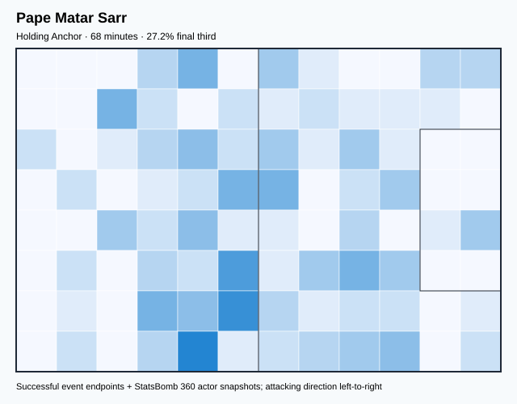

## Physical profile

| Metric | Score |
|---|---:|
| Aerial dominance | 1.000 |
| Pressing intensity per 90 | 9.23 |
| Recovery index per 90 | 2.64 |

## Top chemistry partners

- Kalidou Koulibaly — synergy 0.213, 68 shared minutes
- Cheikh Ahmadou Bamba Mbacke Dieng — synergy 0.207, 68 shared minutes
- Edouard Mendy — synergy 0.205, 68 shared minutes

## Tactical recommendations

- Use a compact pressing trigger rather than sustained solo pressure.
- Target this player on direct restarts and back-post deliveries.
- Use recovery capacity to support higher attacking positions.

_The heatmap combines successful event endpoints with StatsBomb 360 actor
snapshots. StatsBomb 360 is freeze-frame context, not continuous player
tracking. Ratings include eligible outfield players from 45 minutes and
goalkeepers from 90 minutes; ranking status communicates sample reliability._

---

<!-- PLAYER_REPORT 17: 80484_starter_report.md -->

# Iliman Ndiaye — Starter Report

- Team: Senegal (SEN)
- Position: Right Wing
- Functional role: Ball-Winner
- VAEP offense per 90: 0.3006
- VAEP defense per 90: 0.0060
- VAEP total per 90: 0.3065
- VAEP per touch: 0.00336
- Spatial xT per 90: 0.0050
- Final-third spatial share: 51.0%
- Unified final player rating: 0.1715
- Team rank: #4

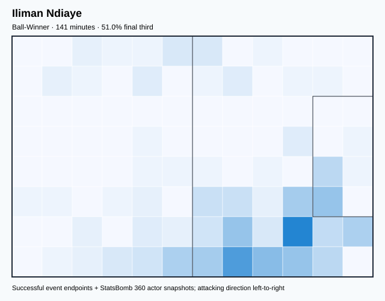

## Physical profile

| Metric | Score |
|---|---:|
| Aerial dominance | 0.000 |
| Pressing intensity per 90 | 17.85 |
| Recovery index per 90 | 2.55 |

## Top chemistry partners

- Pathé Ismaël Ciss — synergy 0.391, 141 shared minutes
- Youssouf Sabaly — synergy 0.365, 141 shared minutes
- Edouard Mendy — synergy 0.360, 141 shared minutes

## Tactical recommendations

- Lead the first pressing trigger and protect the inside passing lane.
- Avoid isolating this player in high-volume aerial matchups.
- Use recovery capacity to support higher attacking positions.

_The heatmap combines successful event endpoints with StatsBomb 360 actor
snapshots. StatsBomb 360 is freeze-frame context, not continuous player
tracking. Ratings include eligible outfield players from 45 minutes and
goalkeepers from 90 minutes; ranking status communicates sample reliability._

---

<!-- PLAYER_REPORT 18: 88123_starter_report.md -->

# Cheikh Ahmadou Bamba Mbacke Dieng — Starter Report

- Team: Senegal (SEN)
- Position: Center Forward
- Functional role: Target Forward
- VAEP offense per 90: 0.2107
- VAEP defense per 90: 0.0062
- VAEP total per 90: 0.2169
- VAEP per touch: 0.00324
- Spatial xT per 90: -0.0142
- Final-third spatial share: 29.4%
- Unified final player rating: 0.2101
- Team rank: #2

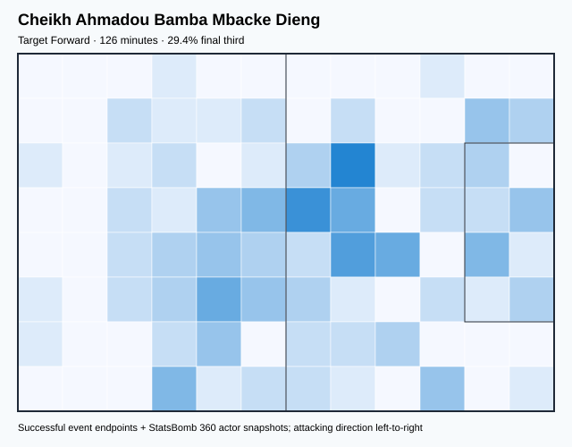

## Physical profile

| Metric | Score |
|---|---:|
| Aerial dominance | 0.100 |
| Pressing intensity per 90 | 17.82 |
| Recovery index per 90 | 3.56 |

## Top chemistry partners

- Youssouf Sabaly — synergy 0.271, 126 shared minutes
- Ismaïla Sarr — synergy 0.270, 104 shared minutes
- Ismail Jakobs — synergy 0.249, 97 shared minutes

## Tactical recommendations

- Lead the first pressing trigger and protect the inside passing lane.
- Avoid isolating this player in high-volume aerial matchups.
- Use recovery capacity to support higher attacking positions.

_The heatmap combines successful event endpoints with StatsBomb 360 actor
snapshots. StatsBomb 360 is freeze-frame context, not continuous player
tracking. Ratings include eligible outfield players from 45 minutes and
goalkeepers from 90 minutes; ranking status communicates sample reliability._
