# SRB — V4 Player Evaluation Collection

<!-- V5_CANONICAL_NOTICE -->
> **Historical V4 player-rating packet.** Player ratings, ranks, role-challenger decisions, and rating uncertainty below are superseded by `results/reports/player_rankings.csv`, `results/reports/player_profiles/`, and `results/reports/model_summary.md`. Possession, tactical, and match-bootstrap material remains a historical V4 result.

- Included eligible players: 16
- Rankings use the role-aware, development-gated VAEP/xT/xD model.
- Heatmaps combine successful on-ball endpoints and SB360 actor snapshots.

---

<!-- PLAYER_REPORT 1: 3831_starter_report.md -->

# Dušan Tadić — Starter Report

- Team: Serbia (SRB)
- Position: Right Attacking Midfield
- Functional role: Progressive Winger
- VAEP offense per 90: 0.3923
- VAEP defense per 90: 0.0124
- VAEP total per 90: 0.4048
- VAEP per touch: 0.00287
- Spatial xT per 90: 0.0922
- Final-third spatial share: 49.7%
- Unified final player rating: 0.1935
- Team rank: #4

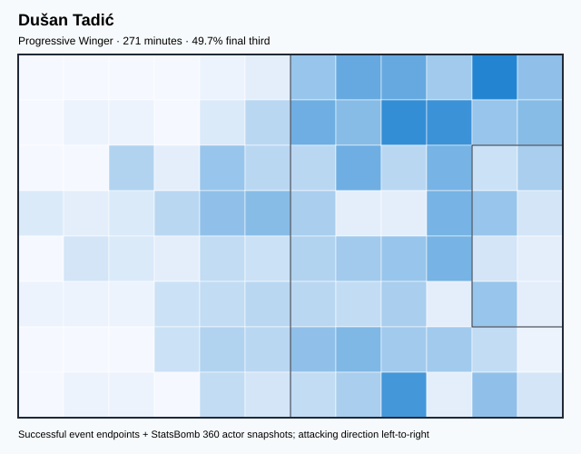

## Physical profile

| Metric | Score |
|---|---:|
| Aerial dominance | 0.000 |
| Pressing intensity per 90 | 13.29 |
| Recovery index per 90 | 2.66 |

## Top chemistry partners

- Nikola Milenković — synergy 0.559, 271 shared minutes
- Milos Veljkovic — synergy 0.538, 229 shared minutes
- Saša Lukić — synergy 0.503, 239 shared minutes

## Tactical recommendations

- Lead the first pressing trigger and protect the inside passing lane.
- Avoid isolating this player in high-volume aerial matchups.
- Use recovery capacity to support higher attacking positions.

_The heatmap combines successful event endpoints with StatsBomb 360 actor
snapshots. StatsBomb 360 is freeze-frame context, not continuous player
tracking. Ratings include eligible outfield players from 45 minutes and
goalkeepers from 90 minutes; ranking status communicates sample reliability._

---

<!-- PLAYER_REPORT 2: 4269_starter_report.md -->

# Aleksandar Mitrović — Starter Report

- Team: Serbia (SRB)
- Position: Left Center Forward
- Functional role: Target Forward
- VAEP offense per 90: 0.3852
- VAEP defense per 90: 0.0695
- VAEP total per 90: 0.4547
- VAEP per touch: 0.00519
- Spatial xT per 90: 0.0209
- Final-third spatial share: 33.6%
- Unified final player rating: 0.2369
- Team rank: #2

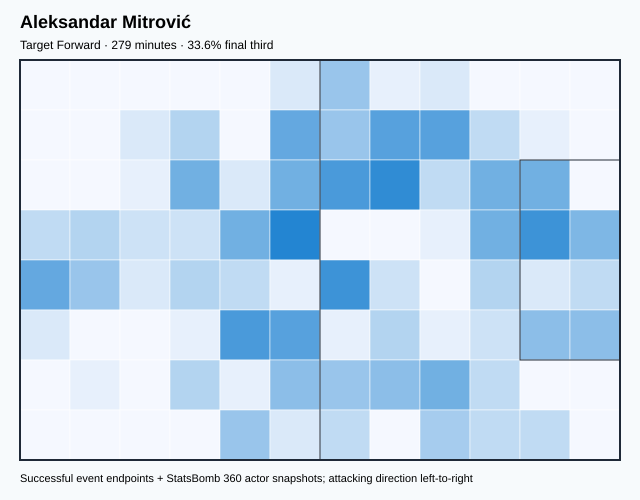

## Physical profile

| Metric | Score |
|---|---:|
| Aerial dominance | 0.222 |
| Pressing intensity per 90 | 7.73 |
| Recovery index per 90 | 2.25 |

## Top chemistry partners

- Saša Lukić — synergy 0.548, 262 shared minutes
- Strahinja Pavlović — synergy 0.475, 239 shared minutes
- Nikola Milenković — synergy 0.418, 279 shared minutes

## Tactical recommendations

- Use a compact pressing trigger rather than sustained solo pressure.
- Pair with a faster recovery defender after aggressive rotations.

_The heatmap combines successful event endpoints with StatsBomb 360 actor
snapshots. StatsBomb 360 is freeze-frame context, not continuous player
tracking. Ratings include eligible outfield players from 45 minutes and
goalkeepers from 90 minutes; ranking status communicates sample reliability._

---

<!-- PLAYER_REPORT 3: 5589_starter_report.md -->

# Sergej Milinković-Savić — Starter Report

- Team: Serbia (SRB)
- Position: Left Attacking Midfield
- Functional role: Holding Anchor
- VAEP offense per 90: 0.2716
- VAEP defense per 90: -0.0730
- VAEP total per 90: 0.1985
- VAEP per touch: 0.00149
- Spatial xT per 90: 0.0239
- Final-third spatial share: 29.4%
- Unified final player rating: 0.1513
- Team rank: #5

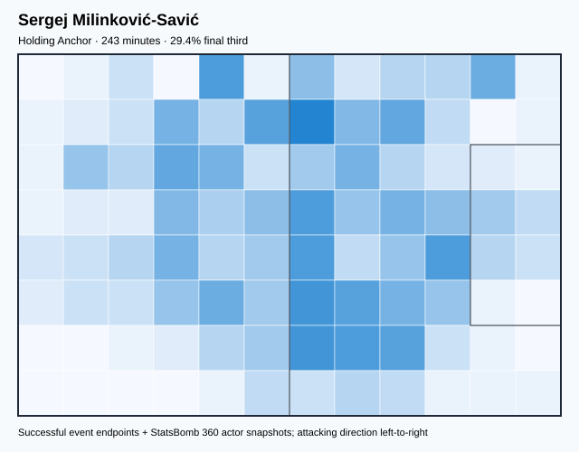

## Physical profile

| Metric | Score |
|---|---:|
| Aerial dominance | 0.556 |
| Pressing intensity per 90 | 13.73 |
| Recovery index per 90 | 5.94 |

## Top chemistry partners

- Nikola Milenković — synergy 0.548, 243 shared minutes
- Milos Veljkovic — synergy 0.542, 229 shared minutes
- Strahinja Pavlović — synergy 0.521, 220 shared minutes

## Tactical recommendations

- Lead the first pressing trigger and protect the inside passing lane.
- Use recovery capacity to support higher attacking positions.

_The heatmap combines successful event endpoints with StatsBomb 360 actor
snapshots. StatsBomb 360 is freeze-frame context, not continuous player
tracking. Ratings include eligible outfield players from 45 minutes and
goalkeepers from 90 minutes; ranking status communicates sample reliability._

---

<!-- PLAYER_REPORT 4: 5591_starter_report.md -->

# Filip Kostić — Starter Report

- Team: Serbia (SRB)
- Position: Left Wing Back
- Functional role: Attacking Wingback
- VAEP offense per 90: 0.4454
- VAEP defense per 90: 0.0052
- VAEP total per 90: 0.4506
- VAEP per touch: 0.00327
- Spatial xT per 90: 0.1217
- Final-third spatial share: 47.0%
- Unified final player rating: 0.1124
- Team rank: #6

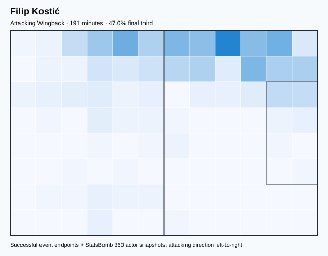

## Physical profile

| Metric | Score |
|---|---:|
| Aerial dominance | 1.000 |
| Pressing intensity per 90 | 14.59 |
| Recovery index per 90 | 5.18 |

## Top chemistry partners

- Vanja Milinković Savić — synergy 0.458, 191 shared minutes
- Saša Lukić — synergy 0.394, 191 shared minutes
- Strahinja Pavlović — synergy 0.386, 156 shared minutes

## Tactical recommendations

- Lead the first pressing trigger and protect the inside passing lane.
- Target this player on direct restarts and back-post deliveries.
- Use recovery capacity to support higher attacking positions.

_The heatmap combines successful event endpoints with StatsBomb 360 actor
snapshots. StatsBomb 360 is freeze-frame context, not continuous player
tracking. Ratings include eligible outfield players from 45 minutes and
goalkeepers from 90 minutes; ranking status communicates sample reliability._

---

<!-- PLAYER_REPORT 5: 5603_starter_report.md -->

# Nikola Milenković — Starter Report

- Team: Serbia (SRB)
- Position: Right Center Back
- Functional role: Sweeper CB
- VAEP offense per 90: 0.0397
- VAEP defense per 90: -0.1795
- VAEP total per 90: -0.1397
- VAEP per touch: -0.00117
- Spatial xT per 90: 0.0124
- Final-third spatial share: 10.1%
- Unified final player rating: -0.0323
- Team rank: #15

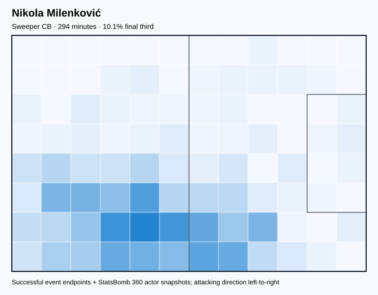

## Physical profile

| Metric | Score |
|---|---:|
| Aerial dominance | 0.857 |
| Pressing intensity per 90 | 10.42 |
| Recovery index per 90 | 1.84 |

## Top chemistry partners

- Saša Lukić — synergy 0.615, 262 shared minutes
- Vanja Milinković Savić — synergy 0.591, 294 shared minutes
- Strahinja Pavlović — synergy 0.579, 253 shared minutes

## Tactical recommendations

- Use a compact pressing trigger rather than sustained solo pressure.
- Target this player on direct restarts and back-post deliveries.
- Pair with a faster recovery defender after aggressive rotations.

_The heatmap combines successful event endpoints with StatsBomb 360 actor
snapshots. StatsBomb 360 is freeze-frame context, not continuous player
tracking. Ratings include eligible outfield players from 45 minutes and
goalkeepers from 90 minutes; ranking status communicates sample reliability._

---

<!-- PLAYER_REPORT 6: 5833_starter_report.md -->

# Nemanja Radonjić — Starter Report

- Team: Serbia (SRB)
- Position: Left Wing Back
- Functional role: Attacking Wingback
- VAEP offense per 90: 0.0662
- VAEP defense per 90: 0.0021
- VAEP total per 90: 0.0683
- VAEP per touch: 0.00073
- Spatial xT per 90: 0.1656
- Final-third spatial share: 60.3%
- Unified final player rating: 0.0558
- Team rank: #8

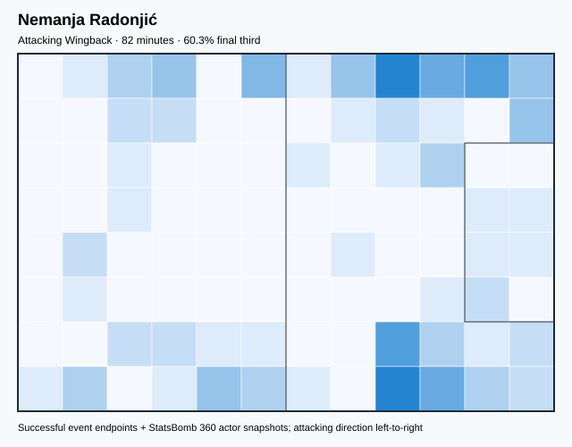

## Physical profile

| Metric | Score |
|---|---:|
| Aerial dominance | 0.000 |
| Pressing intensity per 90 | 5.52 |
| Recovery index per 90 | 2.21 |

## Top chemistry partners

- Nikola Milenković — synergy 0.215, 82 shared minutes
- Vanja Milinković Savić — synergy 0.209, 82 shared minutes
- Strahinja Pavlović — synergy 0.178, 63 shared minutes

## Tactical recommendations

- Use a compact pressing trigger rather than sustained solo pressure.
- Avoid isolating this player in high-volume aerial matchups.
- Pair with a faster recovery defender after aggressive rotations.

_The heatmap combines successful event endpoints with StatsBomb 360 actor
snapshots. StatsBomb 360 is freeze-frame context, not continuous player
tracking. Ratings include eligible outfield players from 45 minutes and
goalkeepers from 90 minutes; ranking status communicates sample reliability._

---

<!-- PLAYER_REPORT 7: 6318_starter_report.md -->

# Andrija Živković — Starter Report

- Team: Serbia (SRB)
- Position: Right Wing Back
- Functional role: Attacking Wingback
- VAEP offense per 90: 0.2080
- VAEP defense per 90: -0.0235
- VAEP total per 90: 0.1845
- VAEP per touch: 0.00160
- Spatial xT per 90: 0.0661
- Final-third spatial share: 37.2%
- Unified final player rating: 0.0704
- Team rank: #7

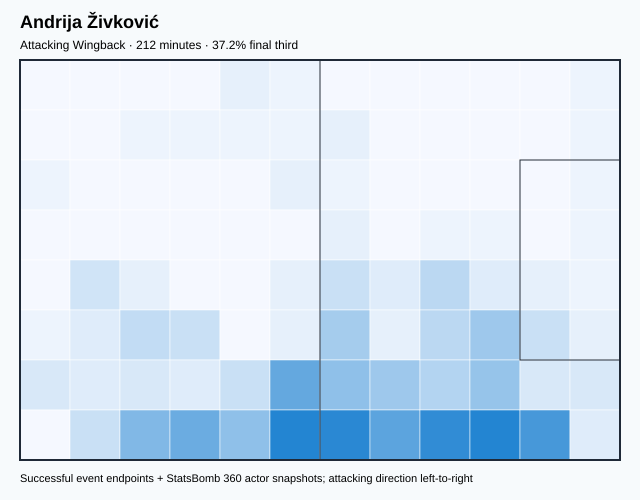

## Physical profile

| Metric | Score |
|---|---:|
| Aerial dominance | 0.400 |
| Pressing intensity per 90 | 12.31 |
| Recovery index per 90 | 3.82 |

## Top chemistry partners

- Nikola Milenković — synergy 0.498, 212 shared minutes
- Saša Lukić — synergy 0.481, 212 shared minutes
- Vanja Milinković Savić — synergy 0.466, 212 shared minutes

## Tactical recommendations

- Lead the first pressing trigger and protect the inside passing lane.
- Use recovery capacity to support higher attacking positions.

_The heatmap combines successful event endpoints with StatsBomb 360 actor
snapshots. StatsBomb 360 is freeze-frame context, not continuous player
tracking. Ratings include eligible outfield players from 45 minutes and
goalkeepers from 90 minutes; ranking status communicates sample reliability._

---

<!-- PLAYER_REPORT 8: 6319_starter_report.md -->

# Luka Jović — Starter Report

- Team: Serbia (SRB)
- Position: Right Center Forward
- Functional role: Target Forward / Penalty-Box Anchor
- VAEP offense per 90: 0.6866
- VAEP defense per 90: 0.0842
- VAEP total per 90: 0.7707
- VAEP per touch: 0.01011
- Spatial xT per 90: -0.0289
- Final-third spatial share: 62.7%
- Unified final player rating: 0.2525
- Team rank: #1

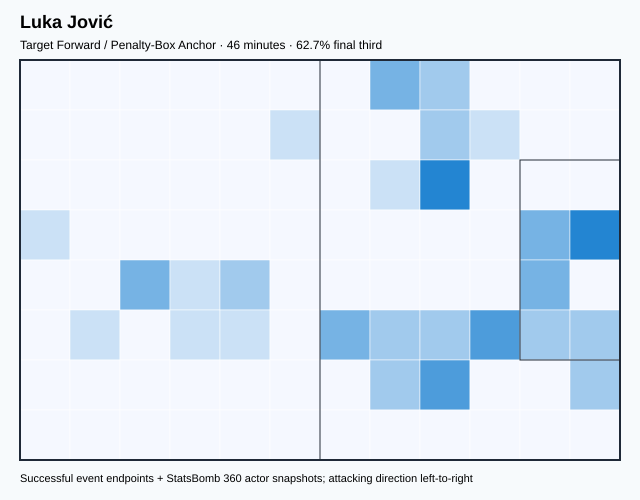

## Physical profile

| Metric | Score |
|---|---:|
| Aerial dominance | 0.500 |
| Pressing intensity per 90 | 3.91 |
| Recovery index per 90 | 0.00 |

## Top chemistry partners

- Nikola Milenković — synergy 0.145, 46 shared minutes
- Nemanja Gudelj — synergy 0.139, 46 shared minutes
- Strahinja Pavlović — synergy 0.136, 46 shared minutes

## Tactical recommendations

- Use a compact pressing trigger rather than sustained solo pressure.
- Pair with a faster recovery defender after aggressive rotations.

_The heatmap combines successful event endpoints with StatsBomb 360 actor
snapshots. StatsBomb 360 is freeze-frame context, not continuous player
tracking. Ratings include eligible outfield players from 45 minutes and
goalkeepers from 90 minutes; ranking status communicates sample reliability._

---

<!-- PLAYER_REPORT 9: 6321_starter_report.md -->

# Milos Veljkovic — Starter Report

- Team: Serbia (SRB)
- Position: Center Back
- Functional role: Sweeper CB
- VAEP offense per 90: -0.0040
- VAEP defense per 90: -0.1171
- VAEP total per 90: -0.1212
- VAEP per touch: -0.00108
- Spatial xT per 90: 0.0012
- Final-third spatial share: 1.1%
- Unified final player rating: -0.0265
- Team rank: #14

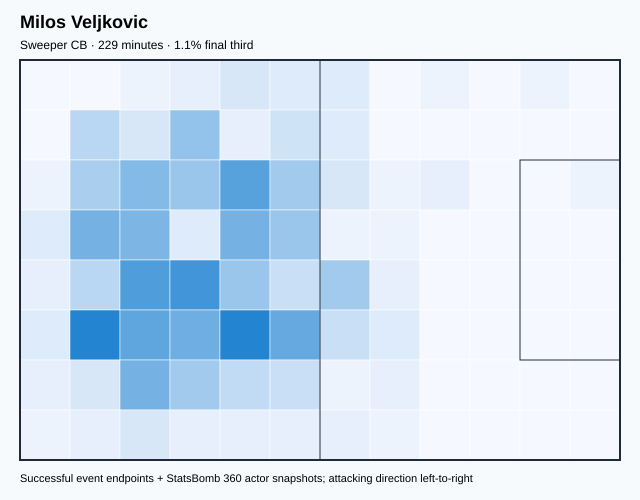

## Physical profile

| Metric | Score |
|---|---:|
| Aerial dominance | 0.714 |
| Pressing intensity per 90 | 9.44 |
| Recovery index per 90 | 1.57 |

## Top chemistry partners

- Vanja Milinković Savić — synergy 0.565, 229 shared minutes
- Nikola Milenković — synergy 0.564, 229 shared minutes
- Sergej Milinković-Savić — synergy 0.542, 229 shared minutes

## Tactical recommendations

- Use a compact pressing trigger rather than sustained solo pressure.
- Target this player on direct restarts and back-post deliveries.
- Pair with a faster recovery defender after aggressive rotations.

_The heatmap combines successful event endpoints with StatsBomb 360 actor
snapshots. StatsBomb 360 is freeze-frame context, not continuous player
tracking. Ratings include eligible outfield players from 45 minutes and
goalkeepers from 90 minutes; ranking status communicates sample reliability._

---

<!-- PLAYER_REPORT 10: 6687_starter_report.md -->

# Saša Lukić — Starter Report

- Team: Serbia (SRB)
- Position: Right Defensive Midfield
- Functional role: Holding Anchor
- VAEP offense per 90: 0.0207
- VAEP defense per 90: -0.0326
- VAEP total per 90: -0.0119
- VAEP per touch: -0.00008
- Spatial xT per 90: 0.0315
- Final-third spatial share: 13.3%
- Unified final player rating: 0.0138
- Team rank: #10

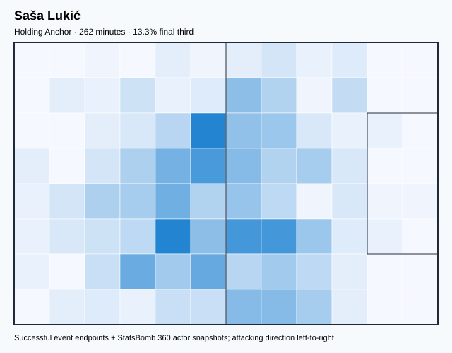

## Physical profile

| Metric | Score |
|---|---:|
| Aerial dominance | 0.444 |
| Pressing intensity per 90 | 15.48 |
| Recovery index per 90 | 4.82 |

## Top chemistry partners

- Nikola Milenković — synergy 0.615, 262 shared minutes
- Vanja Milinković Savić — synergy 0.555, 262 shared minutes
- Aleksandar Mitrović — synergy 0.548, 262 shared minutes

## Tactical recommendations

- Lead the first pressing trigger and protect the inside passing lane.
- Use recovery capacity to support higher attacking positions.

_The heatmap combines successful event endpoints with StatsBomb 360 actor
snapshots. StatsBomb 360 is freeze-frame context, not continuous player
tracking. Ratings include eligible outfield players from 45 minutes and
goalkeepers from 90 minutes; ranking status communicates sample reliability._

---

<!-- PLAYER_REPORT 11: 6901_starter_report.md -->

# Nemanja Maksimović — Starter Report

- Team: Serbia (SRB)
- Position: Right Defensive Midfield
- Functional role: Holding Anchor
- VAEP offense per 90: 0.0783
- VAEP defense per 90: -0.0066
- VAEP total per 90: 0.0717
- VAEP per touch: 0.00080
- Spatial xT per 90: 0.0309
- Final-third spatial share: 18.3%
- Unified final player rating: 0.0266
- Team rank: #9

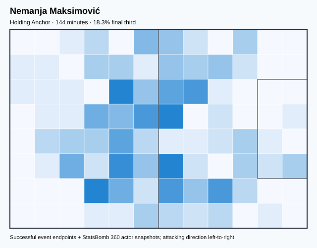

## Physical profile

| Metric | Score |
|---|---:|
| Aerial dominance | 0.250 |
| Pressing intensity per 90 | 12.52 |
| Recovery index per 90 | 3.13 |

## Top chemistry partners

- Nikola Milenković — synergy 0.402, 144 shared minutes
- Vanja Milinković Savić — synergy 0.386, 144 shared minutes
- Aleksandar Mitrović — synergy 0.353, 130 shared minutes

## Tactical recommendations

- Lead the first pressing trigger and protect the inside passing lane.
- Use recovery capacity to support higher attacking positions.

_The heatmap combines successful event endpoints with StatsBomb 360 actor
snapshots. StatsBomb 360 is freeze-frame context, not continuous player
tracking. Ratings include eligible outfield players from 45 minutes and
goalkeepers from 90 minutes; ranking status communicates sample reliability._

---

<!-- PLAYER_REPORT 12: 7993_starter_report.md -->

# Filip Mladenović — Starter Report

- Team: Serbia (SRB)
- Position: Left Wing Back
- Functional role: Wide Creator
- VAEP offense per 90: 0.0311
- VAEP defense per 90: -0.9200
- VAEP total per 90: -0.8890
- VAEP per touch: -0.01041
- Spatial xT per 90: 0.0129
- Final-third spatial share: 22.2%
- Unified final player rating: -0.0095
- Team rank: #11

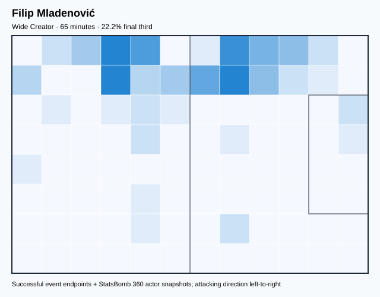

## Physical profile

| Metric | Score |
|---|---:|
| Aerial dominance | 1.000 |
| Pressing intensity per 90 | 17.91 |
| Recovery index per 90 | 4.13 |

## Top chemistry partners

- Strahinja Pavlović — synergy 0.204, 65 shared minutes
- Saša Lukić — synergy 0.197, 65 shared minutes
- Nikola Milenković — synergy 0.194, 65 shared minutes

## Tactical recommendations

- Lead the first pressing trigger and protect the inside passing lane.
- Target this player on direct restarts and back-post deliveries.
- Use recovery capacity to support higher attacking positions.

_The heatmap combines successful event endpoints with StatsBomb 360 actor
snapshots. StatsBomb 360 is freeze-frame context, not continuous player
tracking. Ratings include eligible outfield players from 45 minutes and
goalkeepers from 90 minutes; ranking status communicates sample reliability._

---

<!-- PLAYER_REPORT 13: 16489_starter_report.md -->

# Nemanja Gudelj — Starter Report

- Team: Serbia (SRB)
- Position: Left Defensive Midfield
- Functional role: Holding Anchor
- VAEP offense per 90: 0.0148
- VAEP defense per 90: -0.3542
- VAEP total per 90: -0.3394
- VAEP per touch: -0.00276
- Spatial xT per 90: 0.0116
- Final-third spatial share: 7.6%
- Unified final player rating: -0.0136
- Team rank: #13

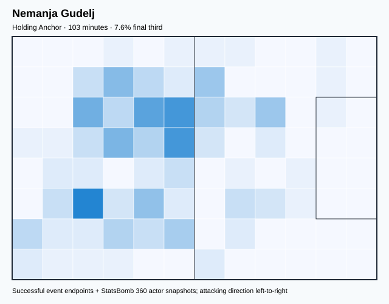

## Physical profile

| Metric | Score |
|---|---:|
| Aerial dominance | 0.667 |
| Pressing intensity per 90 | 15.78 |
| Recovery index per 90 | 2.63 |

## Top chemistry partners

- Saša Lukić — synergy 0.305, 103 shared minutes
- Nikola Milenković — synergy 0.304, 103 shared minutes
- Vanja Milinković Savić — synergy 0.298, 103 shared minutes

## Tactical recommendations

- Lead the first pressing trigger and protect the inside passing lane.
- Target this player on direct restarts and back-post deliveries.
- Use recovery capacity to support higher attacking positions.

_The heatmap combines successful event endpoints with StatsBomb 360 actor
snapshots. StatsBomb 360 is freeze-frame context, not continuous player
tracking. Ratings include eligible outfield players from 45 minutes and
goalkeepers from 90 minutes; ranking status communicates sample reliability._

---

<!-- PLAYER_REPORT 14: 18015_starter_report.md -->

# Dušan Vlahović — Starter Report

- Team: Serbia (SRB)
- Position: Right Center Forward
- Functional role: Target Forward / Penalty-Box Anchor
- VAEP offense per 90: 0.3200
- VAEP defense per 90: 0.0931
- VAEP total per 90: 0.4131
- VAEP per touch: 0.00637
- Spatial xT per 90: -0.0034
- Final-third spatial share: 33.0%
- Unified final player rating: 0.2341
- Team rank: #3

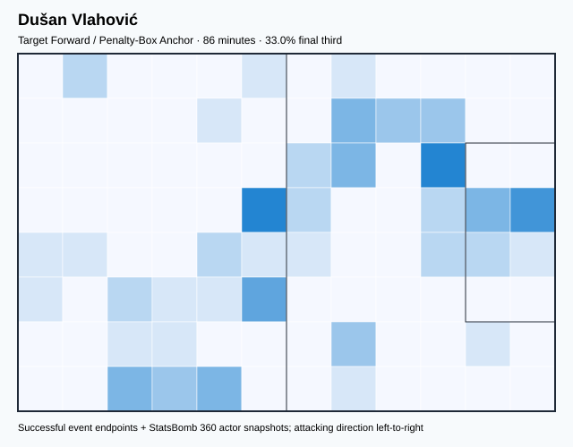

## Physical profile

| Metric | Score |
|---|---:|
| Aerial dominance | 0.750 |
| Pressing intensity per 90 | 7.32 |
| Recovery index per 90 | 4.18 |

## Top chemistry partners

- Nikola Milenković — synergy 0.255, 86 shared minutes
- Vanja Milinković Savić — synergy 0.247, 86 shared minutes
- Milos Veljkovic — synergy 0.241, 86 shared minutes

## Tactical recommendations

- Use a compact pressing trigger rather than sustained solo pressure.
- Target this player on direct restarts and back-post deliveries.
- Use recovery capacity to support higher attacking positions.

_The heatmap combines successful event endpoints with StatsBomb 360 actor
snapshots. StatsBomb 360 is freeze-frame context, not continuous player
tracking. Ratings include eligible outfield players from 45 minutes and
goalkeepers from 90 minutes; ranking status communicates sample reliability._

---

<!-- PLAYER_REPORT 15: 20600_starter_report.md -->

# Vanja Milinković Savić — Starter Report

- Team: Serbia (SRB)
- Position: Goalkeeper
- Functional role: Goalkeeper
- VAEP offense per 90: -0.0159
- VAEP defense per 90: -0.1281
- VAEP total per 90: -0.1440
- VAEP per touch: -0.00178
- Spatial xT per 90: 0.0134
- Final-third spatial share: 2.4%
- Unified final player rating: -0.0646
- Team rank: #16

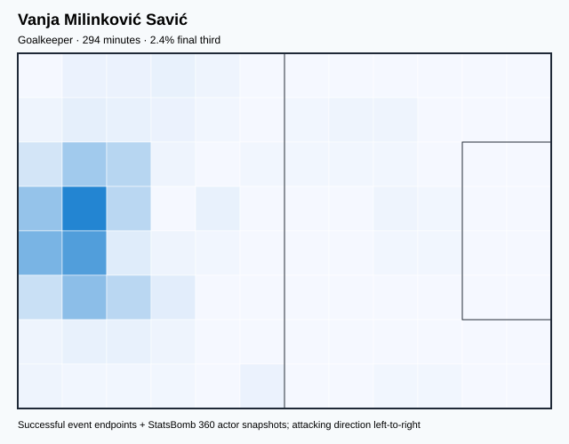

## Physical profile

| Metric | Score |
|---|---:|
| Aerial dominance | 0.000 |
| Pressing intensity per 90 | 0.00 |
| Recovery index per 90 | 5.82 |

## Top chemistry partners

- Strahinja Pavlović — synergy 0.598, 253 shared minutes
- Nikola Milenković — synergy 0.591, 294 shared minutes
- Milos Veljkovic — synergy 0.565, 229 shared minutes

## Tactical recommendations

- Use a compact pressing trigger rather than sustained solo pressure.
- Avoid isolating this player in high-volume aerial matchups.
- Use recovery capacity to support higher attacking positions.

_The heatmap combines successful event endpoints with StatsBomb 360 actor
snapshots. StatsBomb 360 is freeze-frame context, not continuous player
tracking. Ratings include eligible outfield players from 45 minutes and
goalkeepers from 90 minutes; ranking status communicates sample reliability._

---

<!-- PLAYER_REPORT 16: 27719_starter_report.md -->

# Strahinja Pavlović — Starter Report

- Team: Serbia (SRB)
- Position: Left Center Back
- Functional role: Wide Creator
- VAEP offense per 90: 0.1038
- VAEP defense per 90: -0.1499
- VAEP total per 90: -0.0461
- VAEP per touch: -0.00032
- Spatial xT per 90: 0.0437
- Final-third spatial share: 13.2%
- Unified final player rating: -0.0110
- Team rank: #12

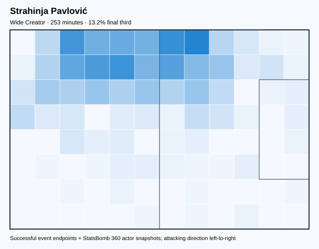

## Physical profile

| Metric | Score |
|---|---:|
| Aerial dominance | 1.000 |
| Pressing intensity per 90 | 12.46 |
| Recovery index per 90 | 5.34 |

## Top chemistry partners

- Vanja Milinković Savić — synergy 0.598, 253 shared minutes
- Nikola Milenković — synergy 0.579, 253 shared minutes
- Milos Veljkovic — synergy 0.524, 207 shared minutes

## Tactical recommendations

- Lead the first pressing trigger and protect the inside passing lane.
- Target this player on direct restarts and back-post deliveries.
- Use recovery capacity to support higher attacking positions.

_The heatmap combines successful event endpoints with StatsBomb 360 actor
snapshots. StatsBomb 360 is freeze-frame context, not continuous player
tracking. Ratings include eligible outfield players from 45 minutes and
goalkeepers from 90 minutes; ranking status communicates sample reliability._
