# SUI — V4 Player Evaluation Collection

<!-- V5_CANONICAL_NOTICE -->
> **Historical V4 player-rating packet.** Player ratings, ranks, role-challenger decisions, and rating uncertainty below are superseded by `results/reports/player_rankings.csv`, `results/reports/player_profiles/`, and `results/reports/model_summary.md`. Possession, tactical, and match-bootstrap material remains a historical V4 result.

- Included eligible players: 19
- Rankings use the role-aware, development-gated VAEP/xT/xD model.
- Heatmaps combine successful on-ball endpoints and SB360 actor snapshots.

---

<!-- PLAYER_REPORT 1: 3500_starter_report.md -->

# Granit Xhaka — Starter Report

- Team: Switzerland (SUI)
- Position: Left Defensive Midfield
- Functional role: Holding Anchor
- VAEP offense per 90: 0.0568
- VAEP defense per 90: -0.0333
- VAEP total per 90: 0.0235
- VAEP per touch: 0.00015
- Spatial xT per 90: 0.0487
- Final-third spatial share: 16.6%
- Unified final player rating: 0.0216
- Team rank: #11

## Physical profile

| Metric | Score |
|---|---:|
| Aerial dominance | 0.583 |
| Pressing intensity per 90 | 7.92 |
| Recovery index per 90 | 2.10 |

## Top chemistry partners

- Manuel Obafemi Akanji — synergy 0.755, 387 shared minutes
- Ricardo Iván Rodríguez Araya — synergy 0.709, 380 shared minutes
- Remo Freuler — synergy 0.658, 346 shared minutes

## Tactical recommendations

- Use a compact pressing trigger rather than sustained solo pressure.
- Target this player on direct restarts and back-post deliveries.
- Pair with a faster recovery defender after aggressive rotations.

_The heatmap combines successful event endpoints with StatsBomb 360 actor
snapshots. StatsBomb 360 is freeze-frame context, not continuous player
tracking. Ratings include eligible outfield players from 45 minutes and
goalkeepers from 90 minutes; ranking status communicates sample reliability._

---

<!-- PLAYER_REPORT 2: 3533_starter_report.md -->

# Xherdan Shaqiri — Starter Report

- Team: Switzerland (SUI)
- Position: Right Midfield
- Functional role: Progressive Winger
- VAEP offense per 90: 0.2318
- VAEP defense per 90: -0.0183
- VAEP total per 90: 0.2135
- VAEP per touch: 0.00162
- Spatial xT per 90: 0.0773
- Final-third spatial share: 49.4%
- Unified final player rating: 0.1130
- Team rank: #7

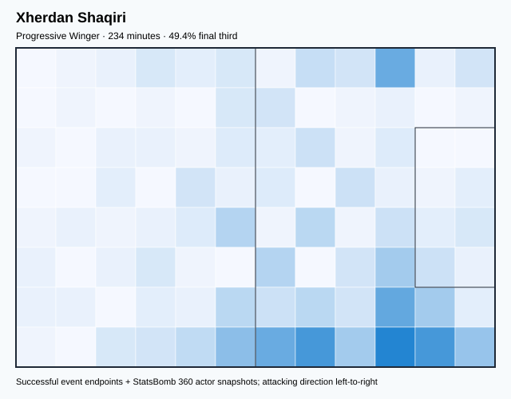

## Physical profile

| Metric | Score |
|---|---:|
| Aerial dominance | 0.143 |
| Pressing intensity per 90 | 8.48 |
| Recovery index per 90 | 2.70 |

## Top chemistry partners

- Granit Xhaka — synergy 0.470, 234 shared minutes
- Ricardo Iván Rodríguez Araya — synergy 0.470, 234 shared minutes
- Manuel Obafemi Akanji — synergy 0.455, 234 shared minutes

## Tactical recommendations

- Use a compact pressing trigger rather than sustained solo pressure.
- Avoid isolating this player in high-volume aerial matchups.
- Use recovery capacity to support higher attacking positions.

_The heatmap combines successful event endpoints with StatsBomb 360 actor
snapshots. StatsBomb 360 is freeze-frame context, not continuous player
tracking. Ratings include eligible outfield players from 45 minutes and
goalkeepers from 90 minutes; ranking status communicates sample reliability._

---

<!-- PLAYER_REPORT 3: 3913_starter_report.md -->

# Edimilson Fernandes — Starter Report

- Team: Switzerland (SUI)
- Position: Right Back
- Functional role: Ball-Winner
- VAEP offense per 90: 0.1473
- VAEP defense per 90: -0.0100
- VAEP total per 90: 0.1372
- VAEP per touch: 0.00113
- Spatial xT per 90: 0.0290
- Final-third spatial share: 28.3%
- Unified final player rating: 0.0593
- Team rank: #9

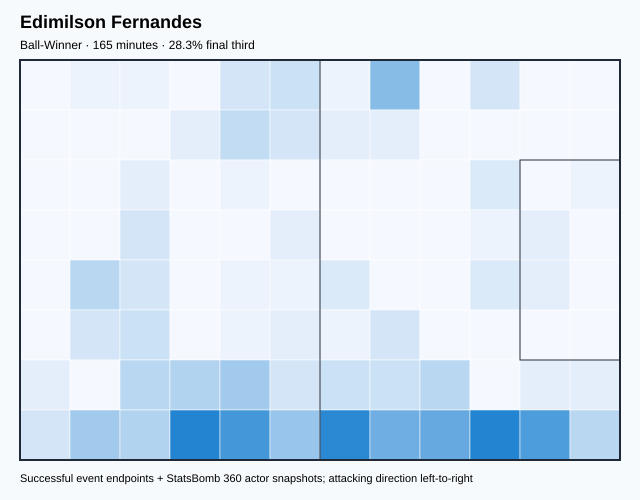

## Physical profile

| Metric | Score |
|---|---:|
| Aerial dominance | 0.000 |
| Pressing intensity per 90 | 8.20 |
| Recovery index per 90 | 4.37 |

## Top chemistry partners

- Manuel Obafemi Akanji — synergy 0.428, 165 shared minutes
- Granit Xhaka — synergy 0.409, 165 shared minutes
- Yann Sommer — synergy 0.365, 132 shared minutes

## Tactical recommendations

- Use a compact pressing trigger rather than sustained solo pressure.
- Avoid isolating this player in high-volume aerial matchups.
- Use recovery capacity to support higher attacking positions.

_The heatmap combines successful event endpoints with StatsBomb 360 actor
snapshots. StatsBomb 360 is freeze-frame context, not continuous player
tracking. Ratings include eligible outfield players from 45 minutes and
goalkeepers from 90 minutes; ranking status communicates sample reliability._

---

<!-- PLAYER_REPORT 4: 5537_starter_report.md -->

# Fabian Lukas Schär — Starter Report

- Team: Switzerland (SUI)
- Position: Right Center Back
- Functional role: Sweeper CB
- VAEP offense per 90: 0.0331
- VAEP defense per 90: -0.0356
- VAEP total per 90: -0.0025
- VAEP per touch: -0.00002
- Spatial xT per 90: 0.0177
- Final-third spatial share: 5.1%
- Unified final player rating: -0.0063
- Team rank: #15

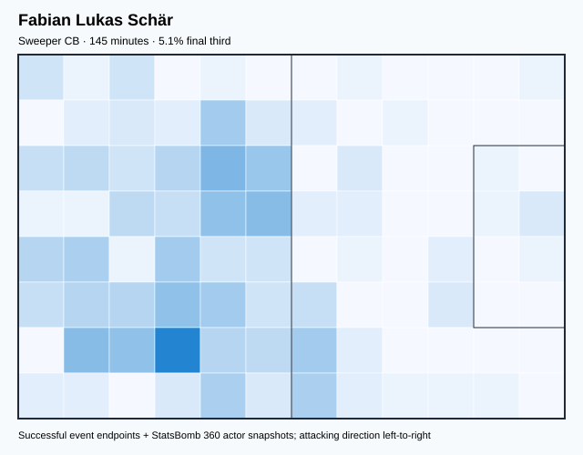

## Physical profile

| Metric | Score |
|---|---:|
| Aerial dominance | 0.625 |
| Pressing intensity per 90 | 8.05 |
| Recovery index per 90 | 2.48 |

## Top chemistry partners

- Ricardo Iván Rodríguez Araya — synergy 0.407, 145 shared minutes
- Manuel Obafemi Akanji — synergy 0.407, 145 shared minutes
- Granit Xhaka — synergy 0.386, 145 shared minutes

## Tactical recommendations

- Use a compact pressing trigger rather than sustained solo pressure.
- Target this player on direct restarts and back-post deliveries.
- Pair with a faster recovery defender after aggressive rotations.

_The heatmap combines successful event endpoints with StatsBomb 360 actor
snapshots. StatsBomb 360 is freeze-frame context, not continuous player
tracking. Ratings include eligible outfield players from 45 minutes and
goalkeepers from 90 minutes; ranking status communicates sample reliability._

---

<!-- PLAYER_REPORT 5: 5538_starter_report.md -->

# Denis Lemi Zakaria Lako Lado — Starter Report

- Team: Switzerland (SUI)
- Position: Right Defensive Midfield
- Functional role: Deep Playmaker
- VAEP offense per 90: 0.0296
- VAEP defense per 90: -0.0247
- VAEP total per 90: 0.0048
- VAEP per touch: 0.00006
- Spatial xT per 90: 0.0432
- Final-third spatial share: 19.7%
- Unified final player rating: 0.0202
- Team rank: #13

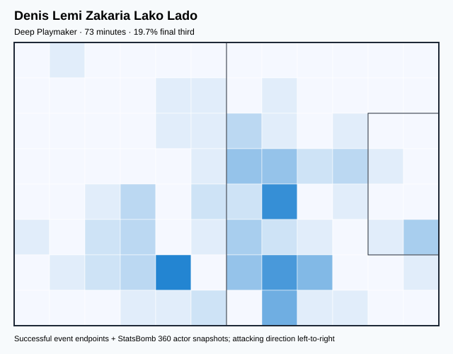

## Physical profile

| Metric | Score |
|---|---:|
| Aerial dominance | 0.000 |
| Pressing intensity per 90 | 12.41 |
| Recovery index per 90 | 2.48 |

## Top chemistry partners

- Edimilson Fernandes — synergy 0.223, 73 shared minutes
- Manuel Obafemi Akanji — synergy 0.223, 73 shared minutes
- Ricardo Iván Rodríguez Araya — synergy 0.216, 73 shared minutes

## Tactical recommendations

- Lead the first pressing trigger and protect the inside passing lane.
- Avoid isolating this player in high-volume aerial matchups.
- Pair with a faster recovery defender after aggressive rotations.

_The heatmap combines successful event endpoints with StatsBomb 360 actor
snapshots. StatsBomb 360 is freeze-frame context, not continuous player
tracking. Ratings include eligible outfield players from 45 minutes and
goalkeepers from 90 minutes; ranking status communicates sample reliability._

---

<!-- PLAYER_REPORT 6: 5543_starter_report.md -->

# Haris Seferović — Starter Report

- Team: Switzerland (SUI)
- Position: Right Center Forward
- Functional role: Target Forward
- VAEP offense per 90: 0.1791
- VAEP defense per 90: -0.0163
- VAEP total per 90: 0.1628
- VAEP per touch: 0.00294
- Spatial xT per 90: 0.0104
- Final-third spatial share: 30.5%
- Unified final player rating: 0.2143
- Team rank: #1

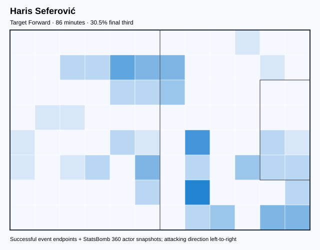

## Physical profile

| Metric | Score |
|---|---:|
| Aerial dominance | 0.000 |
| Pressing intensity per 90 | 7.31 |
| Recovery index per 90 | 0.00 |

## Top chemistry partners

- Manuel Obafemi Akanji — synergy 0.247, 86 shared minutes
- Granit Xhaka — synergy 0.225, 86 shared minutes
- Yann Sommer — synergy 0.185, 86 shared minutes

## Tactical recommendations

- Use a compact pressing trigger rather than sustained solo pressure.
- Avoid isolating this player in high-volume aerial matchups.
- Pair with a faster recovery defender after aggressive rotations.

_The heatmap combines successful event endpoints with StatsBomb 360 actor
snapshots. StatsBomb 360 is freeze-frame context, not continuous player
tracking. Ratings include eligible outfield players from 45 minutes and
goalkeepers from 90 minutes; ranking status communicates sample reliability._

---

<!-- PLAYER_REPORT 7: 5544_starter_report.md -->

# Ricardo Iván Rodríguez Araya — Starter Report

- Team: Switzerland (SUI)
- Position: Left Back
- Functional role: Attacking Wingback
- VAEP offense per 90: 0.0856
- VAEP defense per 90: -0.0807
- VAEP total per 90: 0.0049
- VAEP per touch: 0.00004
- Spatial xT per 90: 0.0444
- Final-third spatial share: 20.6%
- Unified final player rating: 0.0343
- Team rank: #10

## Physical profile

| Metric | Score |
|---|---:|
| Aerial dominance | 0.833 |
| Pressing intensity per 90 | 6.39 |
| Recovery index per 90 | 2.60 |

## Top chemistry partners

- Granit Xhaka — synergy 0.709, 380 shared minutes
- Manuel Obafemi Akanji — synergy 0.701, 380 shared minutes
- Remo Freuler — synergy 0.664, 340 shared minutes

## Tactical recommendations

- Use a compact pressing trigger rather than sustained solo pressure.
- Target this player on direct restarts and back-post deliveries.
- Use recovery capacity to support higher attacking positions.

_The heatmap combines successful event endpoints with StatsBomb 360 actor
snapshots. StatsBomb 360 is freeze-frame context, not continuous player
tracking. Ratings include eligible outfield players from 45 minutes and
goalkeepers from 90 minutes; ranking status communicates sample reliability._

---

<!-- PLAYER_REPORT 8: 5545_starter_report.md -->

# Breel-Donald Embolo — Starter Report

- Team: Switzerland (SUI)
- Position: Center Forward
- Functional role: Ball-Winner
- VAEP offense per 90: 0.3179
- VAEP defense per 90: -0.0096
- VAEP total per 90: 0.3083
- VAEP per touch: 0.00386
- Spatial xT per 90: 0.0111
- Final-third spatial share: 43.6%
- Unified final player rating: 0.2046
- Team rank: #2

## Physical profile

| Metric | Score |
|---|---:|
| Aerial dominance | 0.222 |
| Pressing intensity per 90 | 13.08 |
| Recovery index per 90 | 1.09 |

## Top chemistry partners

- Manuel Obafemi Akanji — synergy 0.647, 330 shared minutes
- Granit Xhaka — synergy 0.612, 330 shared minutes
- Djibril Sow — synergy 0.535, 267 shared minutes

## Tactical recommendations

- Lead the first pressing trigger and protect the inside passing lane.
- Pair with a faster recovery defender after aggressive rotations.

_The heatmap combines successful event endpoints with StatsBomb 360 actor
snapshots. StatsBomb 360 is freeze-frame context, not continuous player
tracking. Ratings include eligible outfield players from 45 minutes and
goalkeepers from 90 minutes; ranking status communicates sample reliability._

---

<!-- PLAYER_REPORT 9: 5549_starter_report.md -->

# Manuel Obafemi Akanji — Starter Report

- Team: Switzerland (SUI)
- Position: Left Center Back
- Functional role: Ball-Playing Centre-Back
- VAEP offense per 90: 0.0562
- VAEP defense per 90: -0.0252
- VAEP total per 90: 0.0310
- VAEP per touch: 0.00020
- Spatial xT per 90: 0.0106
- Final-third spatial share: 5.2%
- Unified final player rating: 0.0033
- Team rank: #14

## Physical profile

| Metric | Score |
|---|---:|
| Aerial dominance | 0.733 |
| Pressing intensity per 90 | 6.98 |
| Recovery index per 90 | 2.10 |

## Top chemistry partners

- Granit Xhaka — synergy 0.755, 387 shared minutes
- Ricardo Iván Rodríguez Araya — synergy 0.701, 380 shared minutes
- Yann Sommer — synergy 0.648, 286 shared minutes

## Tactical recommendations

- Use a compact pressing trigger rather than sustained solo pressure.
- Target this player on direct restarts and back-post deliveries.
- Pair with a faster recovery defender after aggressive rotations.

_The heatmap combines successful event endpoints with StatsBomb 360 actor
snapshots. StatsBomb 360 is freeze-frame context, not continuous player
tracking. Ratings include eligible outfield players from 45 minutes and
goalkeepers from 90 minutes; ranking status communicates sample reliability._

---

<!-- PLAYER_REPORT 10: 5550_starter_report.md -->

# Yann Sommer — Starter Report

- Team: Switzerland (SUI)
- Position: Goalkeeper
- Functional role: Goalkeeper
- VAEP offense per 90: -0.0124
- VAEP defense per 90: -0.1136
- VAEP total per 90: -0.1260
- VAEP per touch: -0.00148
- Spatial xT per 90: 0.0001
- Final-third spatial share: 0.0%
- Unified final player rating: -0.0621
- Team rank: #18

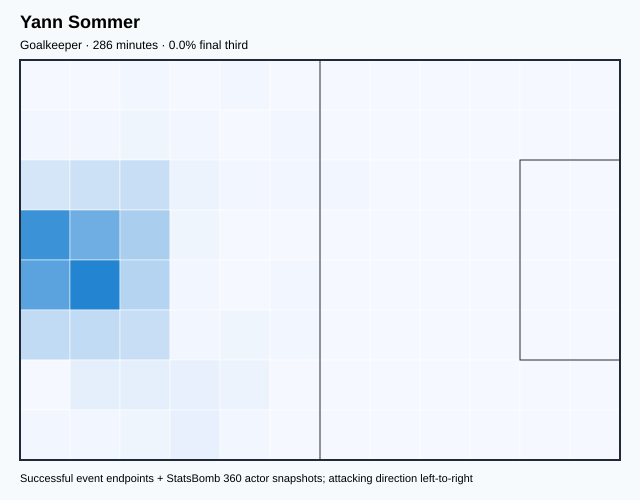

## Physical profile

| Metric | Score |
|---|---:|
| Aerial dominance | 0.000 |
| Pressing intensity per 90 | 0.31 |
| Recovery index per 90 | 3.46 |

## Top chemistry partners

- Manuel Obafemi Akanji — synergy 0.648, 286 shared minutes
- Granit Xhaka — synergy 0.630, 286 shared minutes
- Ricardo Iván Rodríguez Araya — synergy 0.625, 280 shared minutes

## Tactical recommendations

- Use a compact pressing trigger rather than sustained solo pressure.
- Avoid isolating this player in high-volume aerial matchups.
- Use recovery capacity to support higher attacking positions.

_The heatmap combines successful event endpoints with StatsBomb 360 actor
snapshots. StatsBomb 360 is freeze-frame context, not continuous player
tracking. Ratings include eligible outfield players from 45 minutes and
goalkeepers from 90 minutes; ranking status communicates sample reliability._

---

<!-- PLAYER_REPORT 11: 6983_starter_report.md -->

# Remo Freuler — Starter Report

- Team: Switzerland (SUI)
- Position: Right Defensive Midfield
- Functional role: Holding Anchor
- VAEP offense per 90: 0.0916
- VAEP defense per 90: -0.0604
- VAEP total per 90: 0.0313
- VAEP per touch: 0.00029
- Spatial xT per 90: 0.0204
- Final-third spatial share: 24.4%
- Unified final player rating: 0.0209
- Team rank: #12

## Physical profile

| Metric | Score |
|---|---:|
| Aerial dominance | 0.625 |
| Pressing intensity per 90 | 17.17 |
| Recovery index per 90 | 3.12 |

## Top chemistry partners

- Ricardo Iván Rodríguez Araya — synergy 0.664, 340 shared minutes
- Granit Xhaka — synergy 0.658, 346 shared minutes
- Manuel Obafemi Akanji — synergy 0.645, 346 shared minutes

## Tactical recommendations

- Lead the first pressing trigger and protect the inside passing lane.
- Target this player on direct restarts and back-post deliveries.
- Use recovery capacity to support higher attacking positions.

_The heatmap combines successful event endpoints with StatsBomb 360 actor
snapshots. StatsBomb 360 is freeze-frame context, not continuous player
tracking. Ratings include eligible outfield players from 45 minutes and
goalkeepers from 90 minutes; ranking status communicates sample reliability._

---

<!-- PLAYER_REPORT 12: 7796_starter_report.md -->

# Silvan Widmer — Starter Report

- Team: Switzerland (SUI)
- Position: Right Back
- Functional role: Attacking Wingback
- VAEP offense per 90: 0.1970
- VAEP defense per 90: -0.0428
- VAEP total per 90: 0.1542
- VAEP per touch: 0.00116
- Spatial xT per 90: 0.0390
- Final-third spatial share: 24.4%
- Unified final player rating: 0.0658
- Team rank: #8

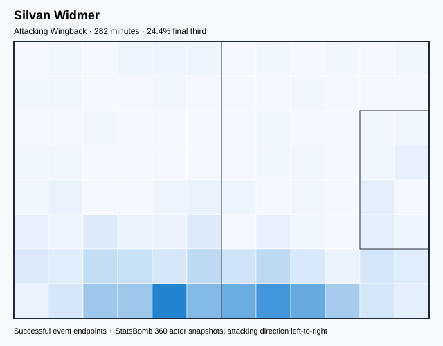

## Physical profile

| Metric | Score |
|---|---:|
| Aerial dominance | 0.750 |
| Pressing intensity per 90 | 14.69 |
| Recovery index per 90 | 1.60 |

## Top chemistry partners

- Manuel Obafemi Akanji — synergy 0.641, 282 shared minutes
- Remo Freuler — synergy 0.625, 282 shared minutes
- Granit Xhaka — synergy 0.594, 282 shared minutes

## Tactical recommendations

- Lead the first pressing trigger and protect the inside passing lane.
- Target this player on direct restarts and back-post deliveries.
- Pair with a faster recovery defender after aggressive rotations.

_The heatmap combines successful event endpoints with StatsBomb 360 actor
snapshots. StatsBomb 360 is freeze-frame context, not continuous player
tracking. Ratings include eligible outfield players from 45 minutes and
goalkeepers from 90 minutes; ranking status communicates sample reliability._

---

<!-- PLAYER_REPORT 13: 8814_starter_report.md -->

# Nico Elvedi — Starter Report

- Team: Switzerland (SUI)
- Position: Left Center Back
- Functional role: Sweeper CB
- VAEP offense per 90: 0.0114
- VAEP defense per 90: -0.0457
- VAEP total per 90: -0.0343
- VAEP per touch: -0.00020
- Spatial xT per 90: 0.0060
- Final-third spatial share: 2.5%
- Unified final player rating: -0.0112
- Team rank: #16

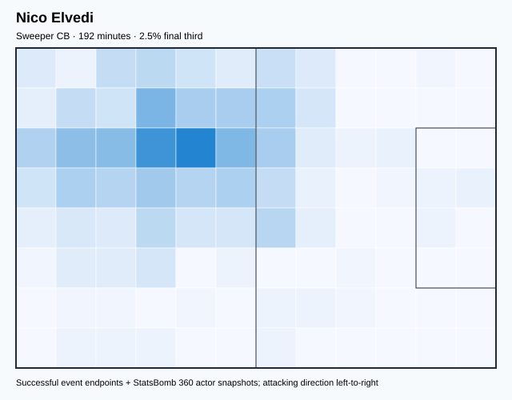

## Physical profile

| Metric | Score |
|---|---:|
| Aerial dominance | 0.556 |
| Pressing intensity per 90 | 8.43 |
| Recovery index per 90 | 1.87 |

## Top chemistry partners

- Yann Sommer — synergy 0.504, 192 shared minutes
- Manuel Obafemi Akanji — synergy 0.503, 192 shared minutes
- Remo Freuler — synergy 0.500, 192 shared minutes

## Tactical recommendations

- Use a compact pressing trigger rather than sustained solo pressure.
- Pair with a faster recovery defender after aggressive rotations.

_The heatmap combines successful event endpoints with StatsBomb 360 actor
snapshots. StatsBomb 360 is freeze-frame context, not continuous player
tracking. Ratings include eligible outfield players from 45 minutes and
goalkeepers from 90 minutes; ranking status communicates sample reliability._

---

<!-- PLAYER_REPORT 14: 16026_starter_report.md -->

# Djibril Sow — Starter Report

- Team: Switzerland (SUI)
- Position: Center Attacking Midfield
- Functional role: Ball-Winner
- VAEP offense per 90: 0.2217
- VAEP defense per 90: 0.0301
- VAEP total per 90: 0.2518
- VAEP per touch: 0.00258
- Spatial xT per 90: 0.0227
- Final-third spatial share: 27.3%
- Unified final player rating: 0.1597
- Team rank: #5

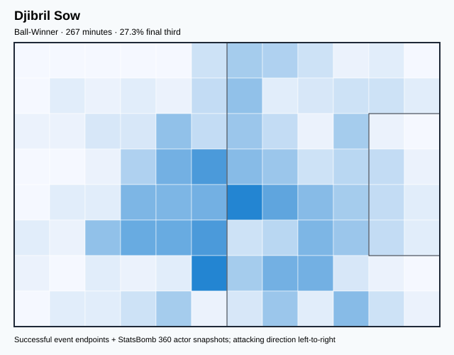

## Physical profile

| Metric | Score |
|---|---:|
| Aerial dominance | 0.250 |
| Pressing intensity per 90 | 14.81 |
| Recovery index per 90 | 3.37 |

## Top chemistry partners

- Granit Xhaka — synergy 0.616, 267 shared minutes
- Manuel Obafemi Akanji — synergy 0.590, 267 shared minutes
- Remo Freuler — synergy 0.561, 267 shared minutes

## Tactical recommendations

- Lead the first pressing trigger and protect the inside passing lane.
- Use recovery capacity to support higher attacking positions.

_The heatmap combines successful event endpoints with StatsBomb 360 actor
snapshots. StatsBomb 360 is freeze-frame context, not continuous player
tracking. Ratings include eligible outfield players from 45 minutes and
goalkeepers from 90 minutes; ranking status communicates sample reliability._

---

<!-- PLAYER_REPORT 15: 17974_starter_report.md -->

# Gregor Kobel — Starter Report

- Team: Switzerland (SUI)
- Position: Goalkeeper
- Functional role: Goalkeeper
- VAEP offense per 90: -0.0242
- VAEP defense per 90: -0.1241
- VAEP total per 90: -0.1483
- VAEP per touch: -0.00331
- Spatial xT per 90: -0.0018
- Final-third spatial share: 0.0%
- Unified final player rating: -0.0638
- Team rank: #19

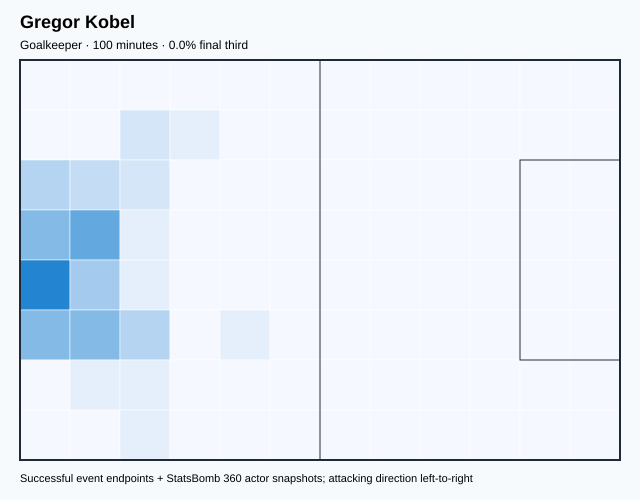

## Physical profile

| Metric | Score |
|---|---:|
| Aerial dominance | 0.000 |
| Pressing intensity per 90 | 0.00 |
| Recovery index per 90 | 4.49 |

## Top chemistry partners

- Manuel Obafemi Akanji — synergy 0.300, 100 shared minutes
- Fabian Lukas Schär — synergy 0.298, 100 shared minutes
- Granit Xhaka — synergy 0.288, 100 shared minutes

## Tactical recommendations

- Use a compact pressing trigger rather than sustained solo pressure.
- Avoid isolating this player in high-volume aerial matchups.
- Use recovery capacity to support higher attacking positions.

_The heatmap combines successful event endpoints with StatsBomb 360 actor
snapshots. StatsBomb 360 is freeze-frame context, not continuous player
tracking. Ratings include eligible outfield players from 45 minutes and
goalkeepers from 90 minutes; ranking status communicates sample reliability._

---

<!-- PLAYER_REPORT 16: 29006_starter_report.md -->

# Noah Okafor — Starter Report

- Team: Switzerland (SUI)
- Position: Left Midfield
- Functional role: Ball-Winner
- VAEP offense per 90: 0.3053
- VAEP defense per 90: 0.0039
- VAEP total per 90: 0.3092
- VAEP per touch: 0.00245
- Spatial xT per 90: 0.0278
- Final-third spatial share: 40.1%
- Unified final player rating: 0.1140
- Team rank: #6

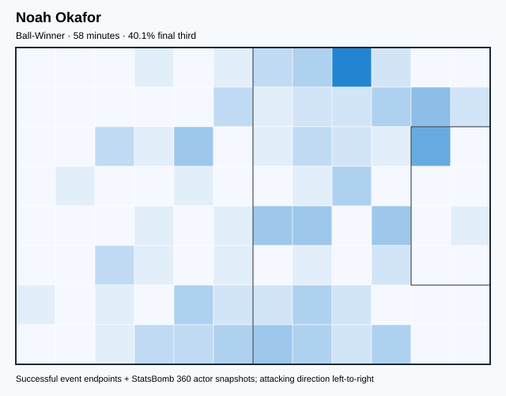

## Physical profile

| Metric | Score |
|---|---:|
| Aerial dominance | 0.000 |
| Pressing intensity per 90 | 24.66 |
| Recovery index per 90 | 4.62 |

## Top chemistry partners

- Ricardo Iván Rodríguez Araya — synergy 0.164, 52 shared minutes
- Manuel Obafemi Akanji — synergy 0.160, 58 shared minutes
- Yann Sommer — synergy 0.159, 53 shared minutes

## Tactical recommendations

- Lead the first pressing trigger and protect the inside passing lane.
- Avoid isolating this player in high-volume aerial matchups.
- Use recovery capacity to support higher attacking positions.

_The heatmap combines successful event endpoints with StatsBomb 360 actor
snapshots. StatsBomb 360 is freeze-frame context, not continuous player
tracking. Ratings include eligible outfield players from 45 minutes and
goalkeepers from 90 minutes; ranking status communicates sample reliability._

---

<!-- PLAYER_REPORT 17: 29012_starter_report.md -->

# Eray Ervin Cömert — Starter Report

- Team: Switzerland (SUI)
- Position: Left Center Back
- Functional role: Ball-Playing Centre-Back
- VAEP offense per 90: 0.0046
- VAEP defense per 90: -0.2317
- VAEP total per 90: -0.2271
- VAEP per touch: -0.00125
- Spatial xT per 90: 0.0121
- Final-third spatial share: 4.7%
- Unified final player rating: -0.0204
- Team rank: #17

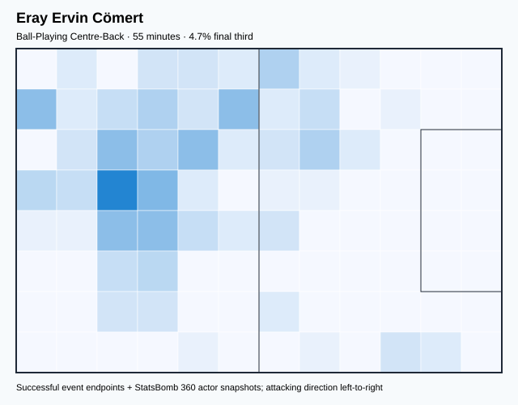

## Physical profile

| Metric | Score |
|---|---:|
| Aerial dominance | 0.000 |
| Pressing intensity per 90 | 17.84 |
| Recovery index per 90 | 4.87 |

## Top chemistry partners

- Granit Xhaka — synergy 0.180, 55 shared minutes
- Yann Sommer — synergy 0.178, 55 shared minutes
- Manuel Obafemi Akanji — synergy 0.174, 55 shared minutes

## Tactical recommendations

- Lead the first pressing trigger and protect the inside passing lane.
- Avoid isolating this player in high-volume aerial matchups.
- Use recovery capacity to support higher attacking positions.

_The heatmap combines successful event endpoints with StatsBomb 360 actor
snapshots. StatsBomb 360 is freeze-frame context, not continuous player
tracking. Ratings include eligible outfield players from 45 minutes and
goalkeepers from 90 minutes; ranking status communicates sample reliability._

---

<!-- PLAYER_REPORT 18: 30401_starter_report.md -->

# Ruben Vargas — Starter Report

- Team: Switzerland (SUI)
- Position: Left Wing
- Functional role: Progressive Winger
- VAEP offense per 90: 0.2643
- VAEP defense per 90: -0.0150
- VAEP total per 90: 0.2492
- VAEP per touch: 0.00227
- Spatial xT per 90: 0.0794
- Final-third spatial share: 49.1%
- Unified final player rating: 0.1628
- Team rank: #4

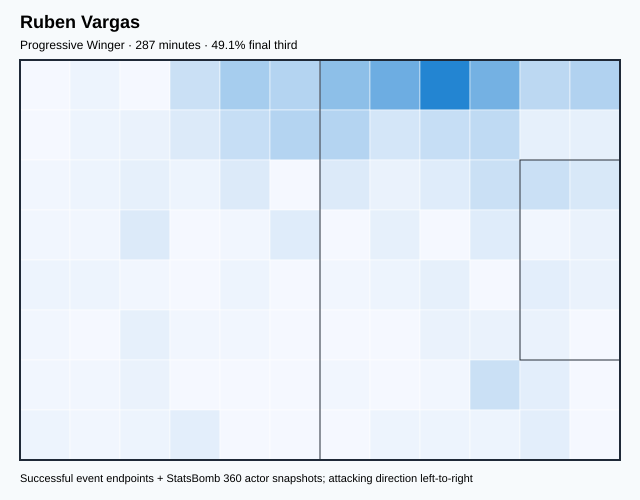

## Physical profile

| Metric | Score |
|---|---:|
| Aerial dominance | 0.429 |
| Pressing intensity per 90 | 10.66 |
| Recovery index per 90 | 1.88 |

## Top chemistry partners

- Ricardo Iván Rodríguez Araya — synergy 0.612, 287 shared minutes
- Granit Xhaka — synergy 0.599, 287 shared minutes
- Remo Freuler — synergy 0.586, 275 shared minutes

## Tactical recommendations

- Use a compact pressing trigger rather than sustained solo pressure.
- Pair with a faster recovery defender after aggressive rotations.

_The heatmap combines successful event endpoints with StatsBomb 360 actor
snapshots. StatsBomb 360 is freeze-frame context, not continuous player
tracking. Ratings include eligible outfield players from 45 minutes and
goalkeepers from 90 minutes; ranking status communicates sample reliability._

---

<!-- PLAYER_REPORT 19: 50436_starter_report.md -->

# Fabian Rieder — Starter Report

- Team: Switzerland (SUI)
- Position: Right Wing
- Functional role: Deep Playmaker
- VAEP offense per 90: 0.1622
- VAEP defense per 90: 0.0786
- VAEP total per 90: 0.2408
- VAEP per touch: 0.00238
- Spatial xT per 90: 0.0336
- Final-third spatial share: 24.4%
- Unified final player rating: 0.1697
- Team rank: #3

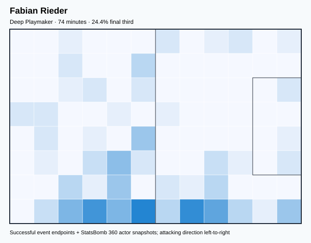

## Physical profile

| Metric | Score |
|---|---:|
| Aerial dominance | 0.500 |
| Pressing intensity per 90 | 40.15 |
| Recovery index per 90 | 6.08 |

## Top chemistry partners

- Manuel Obafemi Akanji — synergy 0.226, 74 shared minutes
- Silvan Widmer — synergy 0.214, 74 shared minutes
- Yann Sommer — synergy 0.212, 74 shared minutes

## Tactical recommendations

- Lead the first pressing trigger and protect the inside passing lane.
- Use recovery capacity to support higher attacking positions.

_The heatmap combines successful event endpoints with StatsBomb 360 actor
snapshots. StatsBomb 360 is freeze-frame context, not continuous player
tracking. Ratings include eligible outfield players from 45 minutes and
goalkeepers from 90 minutes; ranking status communicates sample reliability._
