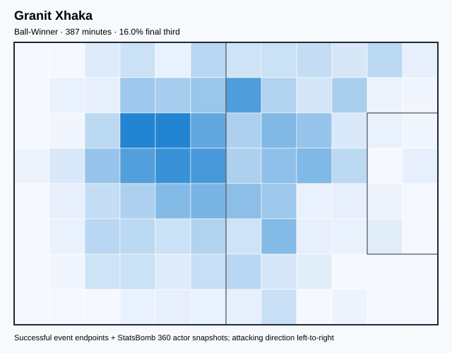
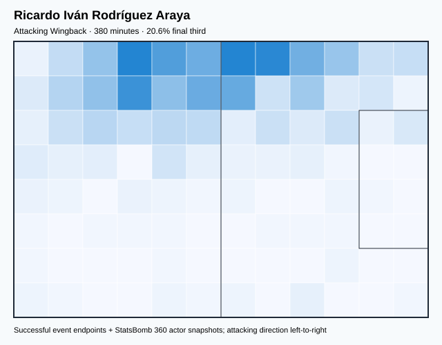
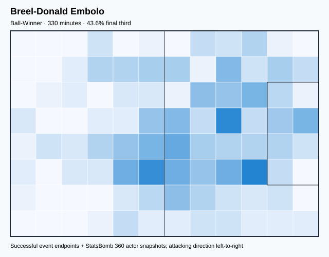
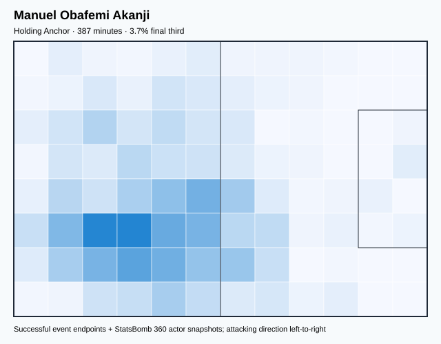
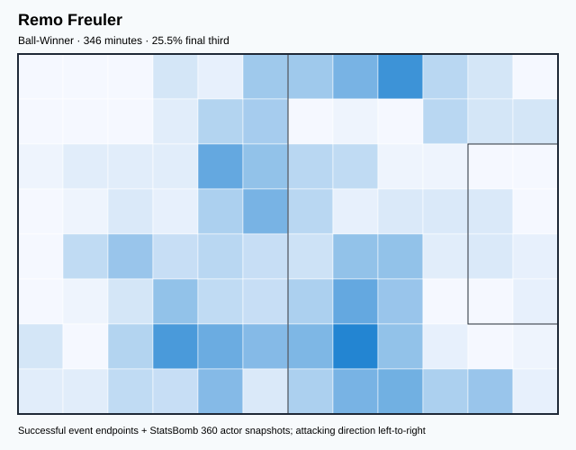

# SUI — V4 Player Evaluation Collection

- Included 300+ minute players: 5
- Rankings use one cross-role 360-VAEP plus xT formula.
- Heatmaps combine successful on-ball endpoints and SB360 actor snapshots.

---

<!-- PLAYER_REPORT 1: 3500_starter_report.md -->

# Granit Xhaka — Starter Report

- Team: Switzerland (SUI)
- Position: Left Defensive Midfield
- Functional role: Ball-Winner
- VAEP offense per 90: 0.0694
- VAEP defense per 90: -0.0131
- VAEP total per 90: 0.0563
- VAEP per touch: 0.00037
- Spatial xT per 90: 0.0487
- Final-third spatial share: 16.6%
- Unified final player rating: 0.0345
- Team rank: #3

## Physical profile

| Metric | Score |
|---|---:|
| Aerial dominance | 0.583 |
| Pressing intensity per 90 | 7.92 |
| Recovery index per 90 | 2.10 |

## Top chemistry partners

- Manuel Obafemi Akanji — synergy 0.755, 387 shared minutes
- Ricardo Iván Rodríguez Araya — synergy 0.709, 380 shared minutes
- Remo Freuler — synergy 0.658, 346 shared minutes

## Tactical recommendations

- Use a compact pressing trigger rather than sustained solo pressure.
- Target this player on direct restarts and back-post deliveries.
- Pair with a faster recovery defender after aggressive rotations.

_The heatmap combines successful event endpoints with StatsBomb 360 actor
snapshots. StatsBomb 360 is freeze-frame context, not continuous player
tracking. Scores exclude players below 300 tournament minutes._

---

<!-- PLAYER_REPORT 2: 5544_starter_report.md -->

# Ricardo Iván Rodríguez Araya — Starter Report

- Team: Switzerland (SUI)
- Position: Left Back
- Functional role: Wide Creator
- VAEP offense per 90: 0.0841
- VAEP defense per 90: -0.0600
- VAEP total per 90: 0.0240
- VAEP per touch: 0.00018
- Spatial xT per 90: 0.0444
- Final-third spatial share: 20.6%
- Unified final player rating: 0.0457
- Team rank: #2

## Physical profile

| Metric | Score |
|---|---:|
| Aerial dominance | 0.833 |
| Pressing intensity per 90 | 6.39 |
| Recovery index per 90 | 2.60 |

## Top chemistry partners

- Granit Xhaka — synergy 0.709, 380 shared minutes
- Manuel Obafemi Akanji — synergy 0.701, 380 shared minutes
- Remo Freuler — synergy 0.664, 340 shared minutes

## Tactical recommendations

- Use a compact pressing trigger rather than sustained solo pressure.
- Target this player on direct restarts and back-post deliveries.
- Use recovery capacity to support higher attacking positions.

_The heatmap combines successful event endpoints with StatsBomb 360 actor
snapshots. StatsBomb 360 is freeze-frame context, not continuous player
tracking. Scores exclude players below 300 tournament minutes._

---

<!-- PLAYER_REPORT 3: 5545_starter_report.md -->

# Breel-Donald Embolo — Starter Report

- Team: Switzerland (SUI)
- Position: Center Forward
- Functional role: Target Forward
- VAEP offense per 90: 0.2954
- VAEP defense per 90: 0.0167
- VAEP total per 90: 0.3120
- VAEP per touch: 0.00391
- Spatial xT per 90: 0.0111
- Final-third spatial share: 43.6%
- Unified final player rating: 0.1938
- Team rank: #1

## Physical profile

| Metric | Score |
|---|---:|
| Aerial dominance | 0.222 |
| Pressing intensity per 90 | 13.08 |
| Recovery index per 90 | 1.09 |

## Top chemistry partners

- Manuel Obafemi Akanji — synergy 0.647, 330 shared minutes
- Granit Xhaka — synergy 0.612, 330 shared minutes
- Remo Freuler — synergy 0.533, 295 shared minutes

## Tactical recommendations

- Lead the first pressing trigger and protect the inside passing lane.
- Pair with a faster recovery defender after aggressive rotations.

_The heatmap combines successful event endpoints with StatsBomb 360 actor
snapshots. StatsBomb 360 is freeze-frame context, not continuous player
tracking. Scores exclude players below 300 tournament minutes._

---

<!-- PLAYER_REPORT 4: 5549_starter_report.md -->

# Manuel Obafemi Akanji — Starter Report

- Team: Switzerland (SUI)
- Position: Left Center Back
- Functional role: Deep Playmaker
- VAEP offense per 90: 0.0570
- VAEP defense per 90: -0.0262
- VAEP total per 90: 0.0309
- VAEP per touch: 0.00020
- Spatial xT per 90: 0.0106
- Final-third spatial share: 5.2%
- Unified final player rating: 0.0063
- Team rank: #5

## Physical profile

| Metric | Score |
|---|---:|
| Aerial dominance | 0.733 |
| Pressing intensity per 90 | 6.98 |
| Recovery index per 90 | 2.10 |

## Top chemistry partners

- Granit Xhaka — synergy 0.755, 387 shared minutes
- Ricardo Iván Rodríguez Araya — synergy 0.701, 380 shared minutes
- Breel-Donald Embolo — synergy 0.647, 330 shared minutes

## Tactical recommendations

- Use a compact pressing trigger rather than sustained solo pressure.
- Target this player on direct restarts and back-post deliveries.
- Pair with a faster recovery defender after aggressive rotations.

_The heatmap combines successful event endpoints with StatsBomb 360 actor
snapshots. StatsBomb 360 is freeze-frame context, not continuous player
tracking. Scores exclude players below 300 tournament minutes._

---

<!-- PLAYER_REPORT 5: 6983_starter_report.md -->

# Remo Freuler — Starter Report

- Team: Switzerland (SUI)
- Position: Right Defensive Midfield
- Functional role: Ball-Winner
- VAEP offense per 90: 0.0760
- VAEP defense per 90: -0.0291
- VAEP total per 90: 0.0468
- VAEP per touch: 0.00043
- Spatial xT per 90: 0.0204
- Final-third spatial share: 24.4%
- Unified final player rating: 0.0287
- Team rank: #4

## Physical profile

| Metric | Score |
|---|---:|
| Aerial dominance | 0.625 |
| Pressing intensity per 90 | 17.17 |
| Recovery index per 90 | 3.12 |

## Top chemistry partners

- Ricardo Iván Rodríguez Araya — synergy 0.664, 340 shared minutes
- Granit Xhaka — synergy 0.658, 346 shared minutes
- Manuel Obafemi Akanji — synergy 0.645, 346 shared minutes

## Tactical recommendations

- Lead the first pressing trigger and protect the inside passing lane.
- Target this player on direct restarts and back-post deliveries.
- Use recovery capacity to support higher attacking positions.

_The heatmap combines successful event endpoints with StatsBomb 360 actor
snapshots. StatsBomb 360 is freeze-frame context, not continuous player
tracking. Scores exclude players below 300 tournament minutes._

<!-- PROSPECTIVE_VALIDATION_START -->
## Prospective possession-model validation

**Overall status: `PARTIAL_PASS_ROLLBACK`.** Box-entry prediction passed every discrimination, calibration, and paired match-bootstrap gate. The shot challenger improved numerically but its confidence interval crossed zero, so it was rejected. The combined prospective artifact was not deployed and the stable production state was preserved.

| Target | Status | Baseline ROC-AUC | Challenger ROC-AUC | PR-AUC | Brier | ECE | Paired ROC gain (90% interval) |
|---|---|---:|---:|---:|---:|---:|---:|
| Box entry | **PASSED** | 0.6888 | 0.7268 | 0.6131 | 0.1722 | 0.0309 | +0.0155 [+0.0106, +0.0205] |
| Shot | **REJECTED** | 0.6642 | 0.6841 | 0.2686 | 0.0960 | 0.0118 | +0.0038 [-0.0030, +0.0120] |

_This challenger is isolated from 360-VAEP/xT player ratings, transition risk, retrospective possession models, and tactical clustering. Player and team descriptive metrics therefore remain unchanged._
<!-- PROSPECTIVE_VALIDATION_END -->
