# TUN — V4 Player Evaluation Collection

<!-- V5_CANONICAL_NOTICE -->
> **Historical V4 player-rating packet.** Player ratings, ranks, role-challenger decisions, and rating uncertainty below are superseded by `results/reports/player_rankings.csv`, `results/reports/player_profiles/`, and `results/reports/model_summary.md`. Possession, tactical, and match-bootstrap material remains a historical V4 result.

- Included eligible players: 18
- Rankings use the role-aware, development-gated VAEP/xT/xD model.
- Heatmaps combine successful on-ball endpoints and SB360 actor snapshots.

---

<!-- PLAYER_REPORT 1: 3196_starter_report.md -->

# Wahbi Khazri — Starter Report

- Team: Tunisia (TUN)
- Position: Center Forward
- Functional role: Progressive Winger
- VAEP offense per 90: 0.7366
- VAEP defense per 90: 0.0548
- VAEP total per 90: 0.7914
- VAEP per touch: 0.00865
- Spatial xT per 90: 0.0996
- Final-third spatial share: 46.1%
- Unified final player rating: 0.2686
- Team rank: #1

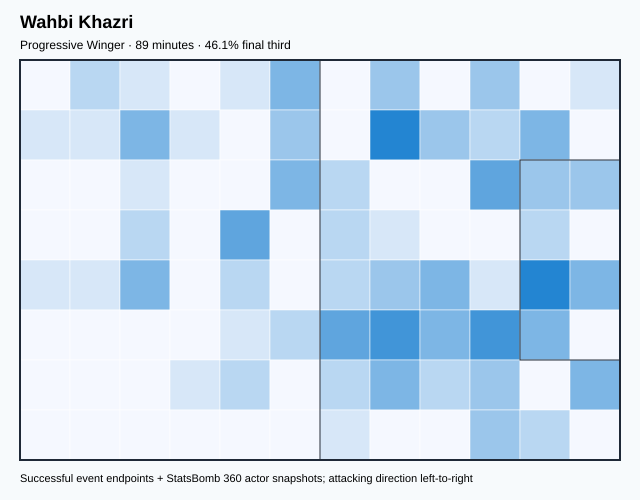

## Physical profile

| Metric | Score |
|---|---:|
| Aerial dominance | 0.000 |
| Pressing intensity per 90 | 10.16 |
| Recovery index per 90 | 8.13 |

## Top chemistry partners

- Yassine Meriah — synergy 0.259, 89 shared minutes
- Montassar Omar Talbi — synergy 0.247, 89 shared minutes
- Aymen Dahmen — synergy 0.247, 89 shared minutes

## Tactical recommendations

- Use a compact pressing trigger rather than sustained solo pressure.
- Avoid isolating this player in high-volume aerial matchups.
- Use recovery capacity to support higher attacking positions.

_The heatmap combines successful event endpoints with StatsBomb 360 actor
snapshots. StatsBomb 360 is freeze-frame context, not continuous player
tracking. Ratings include eligible outfield players from 45 minutes and
goalkeepers from 90 minutes; ranking status communicates sample reliability._

---

<!-- PLAYER_REPORT 2: 3557_starter_report.md -->

# Naïm Sliti — Starter Report

- Team: Tunisia (TUN)
- Position: Right Wing
- Functional role: Progressive Winger
- VAEP offense per 90: 0.3876
- VAEP defense per 90: 0.0026
- VAEP total per 90: 0.3902
- VAEP per touch: 0.00332
- Spatial xT per 90: 0.0930
- Final-third spatial share: 50.4%
- Unified final player rating: 0.1850
- Team rank: #4

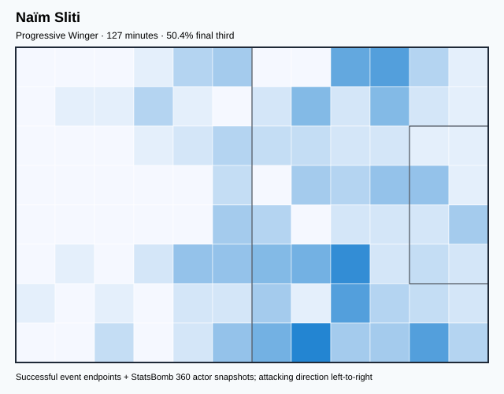

## Physical profile

| Metric | Score |
|---|---:|
| Aerial dominance | 0.500 |
| Pressing intensity per 90 | 14.15 |
| Recovery index per 90 | 4.95 |

## Top chemistry partners

- Ali Abdi — synergy 0.315, 127 shared minutes
- Montassar Omar Talbi — synergy 0.301, 127 shared minutes
- Aymen Dahmen — synergy 0.291, 127 shared minutes

## Tactical recommendations

- Lead the first pressing trigger and protect the inside passing lane.
- Use recovery capacity to support higher attacking positions.

_The heatmap combines successful event endpoints with StatsBomb 360 actor
snapshots. StatsBomb 360 is freeze-frame context, not continuous player
tracking. Ratings include eligible outfield players from 45 minutes and
goalkeepers from 90 minutes; ranking status communicates sample reliability._

---

<!-- PLAYER_REPORT 3: 3767_starter_report.md -->

# Ellyes Joris Skhiri — Starter Report

- Team: Tunisia (TUN)
- Position: Right Defensive Midfield
- Functional role: Box-to-Box / Engine Midfielder
- VAEP offense per 90: 0.0326
- VAEP defense per 90: -0.0114
- VAEP total per 90: 0.0212
- VAEP per touch: 0.00021
- Spatial xT per 90: 0.0157
- Final-third spatial share: 11.3%
- Unified final player rating: 0.0185
- Team rank: #13

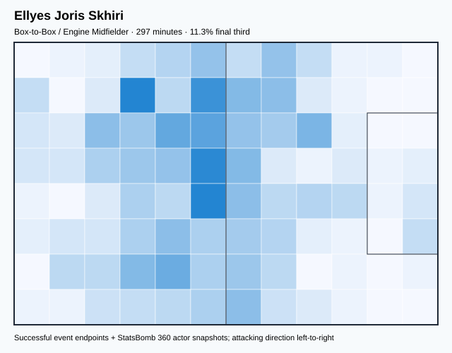

## Physical profile

| Metric | Score |
|---|---:|
| Aerial dominance | 0.667 |
| Pressing intensity per 90 | 19.42 |
| Recovery index per 90 | 6.37 |

## Top chemistry partners

- Montassar Omar Talbi — synergy 0.655, 297 shared minutes
- Yassine Meriah — synergy 0.636, 297 shared minutes
- Aymen Dahmen — synergy 0.611, 297 shared minutes

## Tactical recommendations

- Lead the first pressing trigger and protect the inside passing lane.
- Target this player on direct restarts and back-post deliveries.
- Use recovery capacity to support higher attacking positions.

_The heatmap combines successful event endpoints with StatsBomb 360 actor
snapshots. StatsBomb 360 is freeze-frame context, not continuous player
tracking. Ratings include eligible outfield players from 45 minutes and
goalkeepers from 90 minutes; ranking status communicates sample reliability._

---

<!-- PLAYER_REPORT 4: 5647_starter_report.md -->

# Ali Maâloul — Starter Report

- Team: Tunisia (TUN)
- Position: Left Wing Back
- Functional role: Attacking Wingback
- VAEP offense per 90: 0.0649
- VAEP defense per 90: -0.0045
- VAEP total per 90: 0.0604
- VAEP per touch: 0.00054
- Spatial xT per 90: 0.1257
- Final-third spatial share: 38.5%
- Unified final player rating: 0.0540
- Team rank: #9

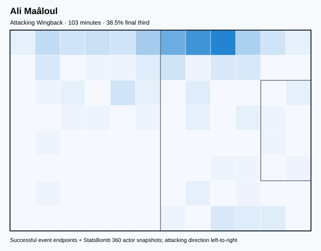

## Physical profile

| Metric | Score |
|---|---:|
| Aerial dominance | 0.000 |
| Pressing intensity per 90 | 9.64 |
| Recovery index per 90 | 1.75 |

## Top chemistry partners

- Ellyes Joris Skhiri — synergy 0.307, 103 shared minutes
- Montassar Omar Talbi — synergy 0.287, 103 shared minutes
- Aymen Dahmen — synergy 0.286, 103 shared minutes

## Tactical recommendations

- Use a compact pressing trigger rather than sustained solo pressure.
- Avoid isolating this player in high-volume aerial matchups.
- Pair with a faster recovery defender after aggressive rotations.

_The heatmap combines successful event endpoints with StatsBomb 360 actor
snapshots. StatsBomb 360 is freeze-frame context, not continuous player
tracking. Ratings include eligible outfield players from 45 minutes and
goalkeepers from 90 minutes; ranking status communicates sample reliability._

---

<!-- PLAYER_REPORT 5: 5650_starter_report.md -->

# Ferjani Sassi — Starter Report

- Team: Tunisia (TUN)
- Position: Right Defensive Midfield
- Functional role: Holding Anchor
- VAEP offense per 90: 0.0163
- VAEP defense per 90: -0.0037
- VAEP total per 90: 0.0127
- VAEP per touch: 0.00009
- Spatial xT per 90: 0.0605
- Final-third spatial share: 17.6%
- Unified final player rating: 0.0213
- Team rank: #12

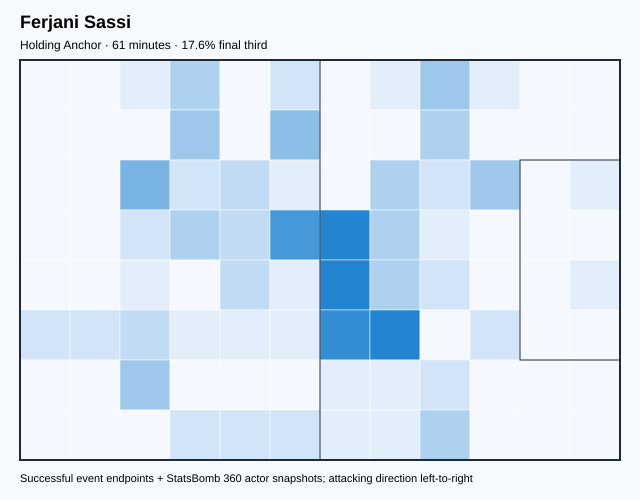

## Physical profile

| Metric | Score |
|---|---:|
| Aerial dominance | 1.000 |
| Pressing intensity per 90 | 20.62 |
| Recovery index per 90 | 7.36 |

## Top chemistry partners

- Ellyes Joris Skhiri — synergy 0.194, 61 shared minutes
- Ali Abdi — synergy 0.192, 61 shared minutes
- Montassar Omar Talbi — synergy 0.190, 61 shared minutes

## Tactical recommendations

- Lead the first pressing trigger and protect the inside passing lane.
- Target this player on direct restarts and back-post deliveries.
- Use recovery capacity to support higher attacking positions.

_The heatmap combines successful event endpoints with StatsBomb 360 actor
snapshots. StatsBomb 360 is freeze-frame context, not continuous player
tracking. Ratings include eligible outfield players from 45 minutes and
goalkeepers from 90 minutes; ranking status communicates sample reliability._

---

<!-- PLAYER_REPORT 6: 5651_starter_report.md -->

# Yassine Meriah — Starter Report

- Team: Tunisia (TUN)
- Position: Right Center Back
- Functional role: Sweeper CB
- VAEP offense per 90: 0.0137
- VAEP defense per 90: -0.0532
- VAEP total per 90: -0.0395
- VAEP per touch: -0.00030
- Spatial xT per 90: 0.0198
- Final-third spatial share: 6.2%
- Unified final player rating: -0.0118
- Team rank: #17

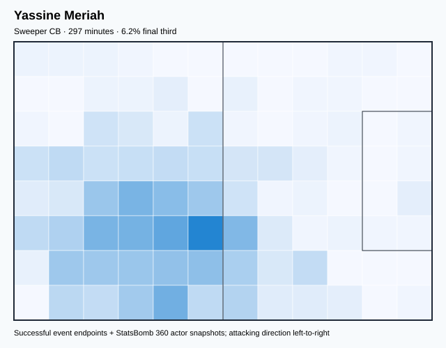

## Physical profile

| Metric | Score |
|---|---:|
| Aerial dominance | 0.556 |
| Pressing intensity per 90 | 9.10 |
| Recovery index per 90 | 4.25 |

## Top chemistry partners

- Montassar Omar Talbi — synergy 0.659, 297 shared minutes
- Aymen Dahmen — synergy 0.656, 297 shared minutes
- Ellyes Joris Skhiri — synergy 0.636, 297 shared minutes

## Tactical recommendations

- Use a compact pressing trigger rather than sustained solo pressure.
- Use recovery capacity to support higher attacking positions.

_The heatmap combines successful event endpoints with StatsBomb 360 actor
snapshots. StatsBomb 360 is freeze-frame context, not continuous player
tracking. Ratings include eligible outfield players from 45 minutes and
goalkeepers from 90 minutes; ranking status communicates sample reliability._

---

<!-- PLAYER_REPORT 7: 5655_starter_report.md -->

# Dylan Daniel Mahmoud Bronn — Starter Report

- Team: Tunisia (TUN)
- Position: Right Center Back
- Functional role: Deep Playmaker
- VAEP offense per 90: 0.0739
- VAEP defense per 90: -0.0086
- VAEP total per 90: 0.0653
- VAEP per touch: 0.00051
- Spatial xT per 90: 0.0172
- Final-third spatial share: 9.6%
- Unified final player rating: 0.0033
- Team rank: #15

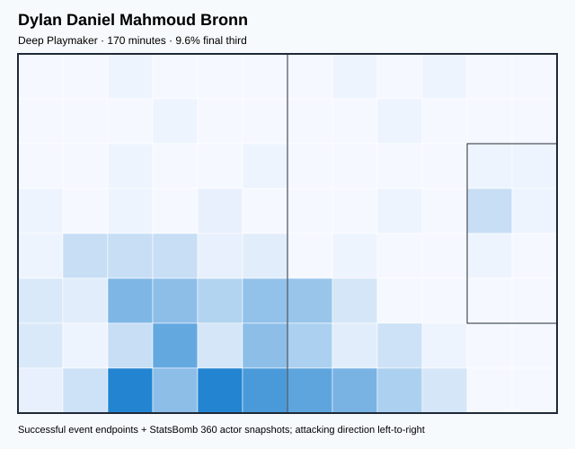

## Physical profile

| Metric | Score |
|---|---:|
| Aerial dominance | 0.429 |
| Pressing intensity per 90 | 6.34 |
| Recovery index per 90 | 4.76 |

## Top chemistry partners

- Yassine Meriah — synergy 0.464, 170 shared minutes
- Montassar Omar Talbi — synergy 0.443, 170 shared minutes
- Aymen Dahmen — synergy 0.443, 170 shared minutes

## Tactical recommendations

- Use a compact pressing trigger rather than sustained solo pressure.
- Use recovery capacity to support higher attacking positions.

_The heatmap combines successful event endpoints with StatsBomb 360 actor
snapshots. StatsBomb 360 is freeze-frame context, not continuous player
tracking. Ratings include eligible outfield players from 45 minutes and
goalkeepers from 90 minutes; ranking status communicates sample reliability._

---

<!-- PLAYER_REPORT 8: 9236_starter_report.md -->

# Mohamed Dräger — Starter Report

- Team: Tunisia (TUN)
- Position: Right Wing Back
- Functional role: Deep Playmaker
- VAEP offense per 90: 0.1959
- VAEP defense per 90: -0.0053
- VAEP total per 90: 0.1907
- VAEP per touch: 0.00195
- Spatial xT per 90: 0.0369
- Final-third spatial share: 27.8%
- Unified final player rating: 0.0649
- Team rank: #7

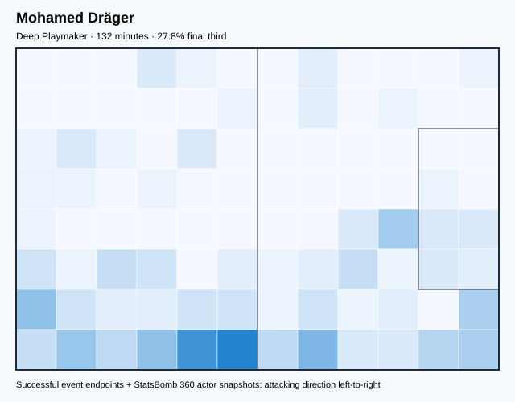

## Physical profile

| Metric | Score |
|---|---:|
| Aerial dominance | 0.333 |
| Pressing intensity per 90 | 15.65 |
| Recovery index per 90 | 2.04 |

## Top chemistry partners

- Ellyes Joris Skhiri — synergy 0.371, 132 shared minutes
- Aïssa Bilal Laïdouni — synergy 0.370, 132 shared minutes
- Yassine Meriah — synergy 0.365, 132 shared minutes

## Tactical recommendations

- Lead the first pressing trigger and protect the inside passing lane.
- Pair with a faster recovery defender after aggressive rotations.

_The heatmap combines successful event endpoints with StatsBomb 360 actor
snapshots. StatsBomb 360 is freeze-frame context, not continuous player
tracking. Ratings include eligible outfield players from 45 minutes and
goalkeepers from 90 minutes; ranking status communicates sample reliability._

---

<!-- PLAYER_REPORT 9: 16352_starter_report.md -->

# Issam Jebali — Starter Report

- Team: Tunisia (TUN)
- Position: Center Forward
- Functional role: Ball-Winner
- VAEP offense per 90: 0.5583
- VAEP defense per 90: 0.0351
- VAEP total per 90: 0.5934
- VAEP per touch: 0.00671
- Spatial xT per 90: 0.0031
- Final-third spatial share: 34.9%
- Unified final player rating: 0.2575
- Team rank: #2

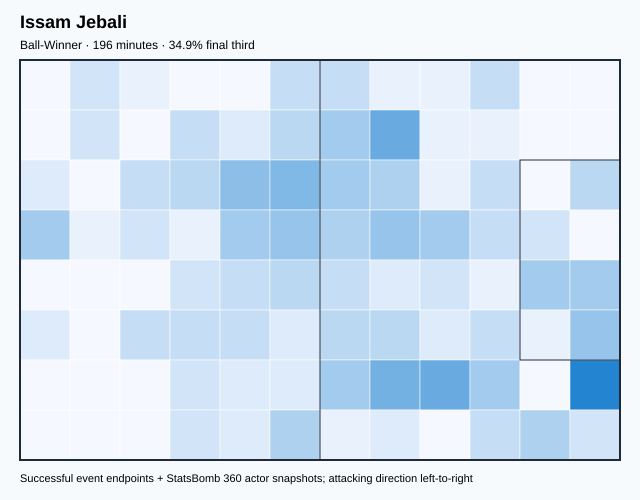

## Physical profile

| Metric | Score |
|---|---:|
| Aerial dominance | 0.118 |
| Pressing intensity per 90 | 16.96 |
| Recovery index per 90 | 3.21 |

## Top chemistry partners

- Ellyes Joris Skhiri — synergy 0.449, 196 shared minutes
- Montassar Omar Talbi — synergy 0.363, 196 shared minutes
- Youssef Msakni — synergy 0.302, 152 shared minutes

## Tactical recommendations

- Lead the first pressing trigger and protect the inside passing lane.
- Avoid isolating this player in high-volume aerial matchups.
- Use recovery capacity to support higher attacking positions.

_The heatmap combines successful event endpoints with StatsBomb 360 actor
snapshots. StatsBomb 360 is freeze-frame context, not continuous player
tracking. Ratings include eligible outfield players from 45 minutes and
goalkeepers from 90 minutes; ranking status communicates sample reliability._

---

<!-- PLAYER_REPORT 10: 23910_starter_report.md -->

# Youssef Msakni — Starter Report

- Team: Tunisia (TUN)
- Position: Left Wing
- Functional role: Progressive Winger
- VAEP offense per 90: 0.4939
- VAEP defense per 90: 0.0890
- VAEP total per 90: 0.5829
- VAEP per touch: 0.00462
- Spatial xT per 90: 0.0835
- Final-third spatial share: 36.3%
- Unified final player rating: 0.2140
- Team rank: #3

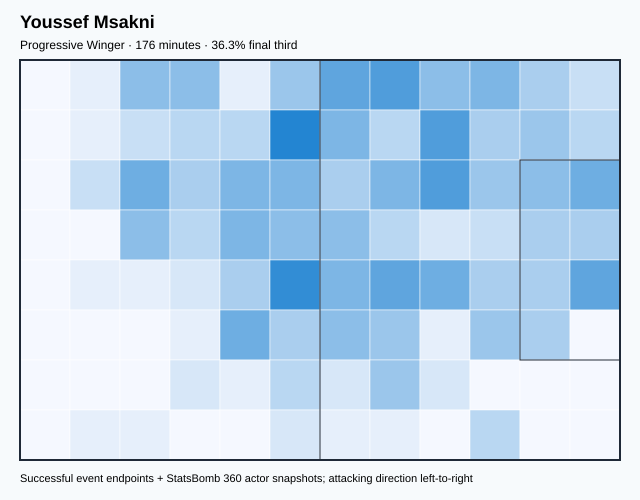

## Physical profile

| Metric | Score |
|---|---:|
| Aerial dominance | 0.357 |
| Pressing intensity per 90 | 11.25 |
| Recovery index per 90 | 4.09 |

## Top chemistry partners

- Ellyes Joris Skhiri — synergy 0.446, 176 shared minutes
- Montassar Omar Talbi — synergy 0.432, 176 shared minutes
- Aïssa Bilal Laïdouni — synergy 0.351, 147 shared minutes

## Tactical recommendations

- Lead the first pressing trigger and protect the inside passing lane.
- Use recovery capacity to support higher attacking positions.

_The heatmap combines successful event endpoints with StatsBomb 360 actor
snapshots. StatsBomb 360 is freeze-frame context, not continuous player
tracking. Ratings include eligible outfield players from 45 minutes and
goalkeepers from 90 minutes; ranking status communicates sample reliability._

---

<!-- PLAYER_REPORT 11: 25582_starter_report.md -->

# Nader Ghandri — Starter Report

- Team: Tunisia (TUN)
- Position: Center Back
- Functional role: Sweeper CB
- VAEP offense per 90: 0.1018
- VAEP defense per 90: -0.0768
- VAEP total per 90: 0.0250
- VAEP per touch: 0.00036
- Spatial xT per 90: 0.0018
- Final-third spatial share: 2.1%
- Unified final player rating: -0.0050
- Team rank: #16

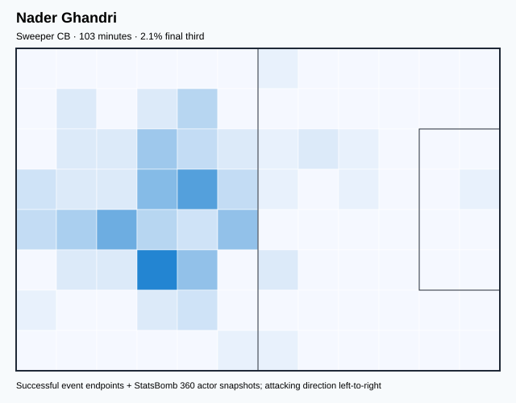

## Physical profile

| Metric | Score |
|---|---:|
| Aerial dominance | 0.600 |
| Pressing intensity per 90 | 2.63 |
| Recovery index per 90 | 1.75 |

## Top chemistry partners

- Montassar Omar Talbi — synergy 0.308, 103 shared minutes
- Yassine Meriah — synergy 0.307, 103 shared minutes
- Aymen Dahmen — synergy 0.296, 103 shared minutes

## Tactical recommendations

- Use a compact pressing trigger rather than sustained solo pressure.
- Target this player on direct restarts and back-post deliveries.
- Pair with a faster recovery defender after aggressive rotations.

_The heatmap combines successful event endpoints with StatsBomb 360 actor
snapshots. StatsBomb 360 is freeze-frame context, not continuous player
tracking. Ratings include eligible outfield players from 45 minutes and
goalkeepers from 90 minutes; ranking status communicates sample reliability._

---

<!-- PLAYER_REPORT 12: 30681_starter_report.md -->

# Ali Abdi — Starter Report

- Team: Tunisia (TUN)
- Position: Left Wing Back
- Functional role: Attacking Wingback
- VAEP offense per 90: 0.1353
- VAEP defense per 90: -0.0369
- VAEP total per 90: 0.0984
- VAEP per touch: 0.00087
- Spatial xT per 90: 0.0513
- Final-third spatial share: 24.9%
- Unified final player rating: 0.0556
- Team rank: #8

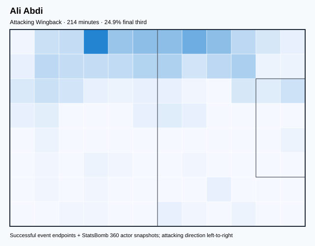

## Physical profile

| Metric | Score |
|---|---:|
| Aerial dominance | 0.650 |
| Pressing intensity per 90 | 13.90 |
| Recovery index per 90 | 5.48 |

## Top chemistry partners

- Montassar Omar Talbi — synergy 0.527, 214 shared minutes
- Ellyes Joris Skhiri — synergy 0.477, 214 shared minutes
- Aymen Dahmen — synergy 0.459, 214 shared minutes

## Tactical recommendations

- Lead the first pressing trigger and protect the inside passing lane.
- Target this player on direct restarts and back-post deliveries.
- Use recovery capacity to support higher attacking positions.

_The heatmap combines successful event endpoints with StatsBomb 360 actor
snapshots. StatsBomb 360 is freeze-frame context, not continuous player
tracking. Ratings include eligible outfield players from 45 minutes and
goalkeepers from 90 minutes; ranking status communicates sample reliability._

---

<!-- PLAYER_REPORT 13: 32450_starter_report.md -->

# Montassar Omar Talbi — Starter Report

- Team: Tunisia (TUN)
- Position: Left Center Back
- Functional role: Sweeper CB
- VAEP offense per 90: 0.0325
- VAEP defense per 90: 0.0147
- VAEP total per 90: 0.0472
- VAEP per touch: 0.00047
- Spatial xT per 90: 0.0186
- Final-third spatial share: 6.9%
- Unified final player rating: 0.0054
- Team rank: #14

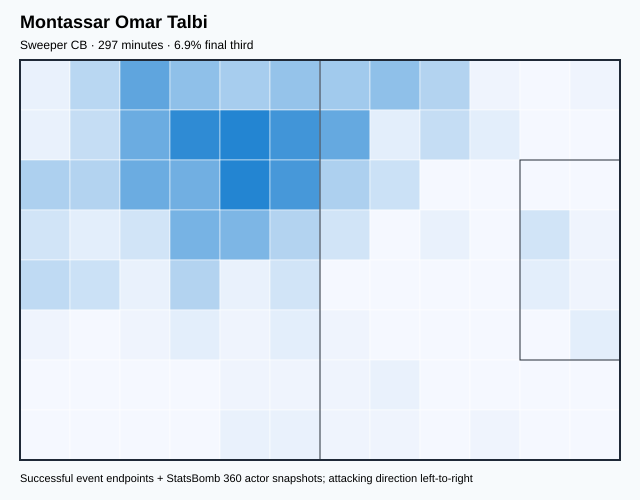

## Physical profile

| Metric | Score |
|---|---:|
| Aerial dominance | 0.571 |
| Pressing intensity per 90 | 8.50 |
| Recovery index per 90 | 3.95 |

## Top chemistry partners

- Yassine Meriah — synergy 0.659, 297 shared minutes
- Ellyes Joris Skhiri — synergy 0.655, 297 shared minutes
- Aymen Dahmen — synergy 0.649, 297 shared minutes

## Tactical recommendations

- Use a compact pressing trigger rather than sustained solo pressure.
- Target this player on direct restarts and back-post deliveries.
- Use recovery capacity to support higher attacking positions.

_The heatmap combines successful event endpoints with StatsBomb 360 actor
snapshots. StatsBomb 360 is freeze-frame context, not continuous player
tracking. Ratings include eligible outfield players from 45 minutes and
goalkeepers from 90 minutes; ranking status communicates sample reliability._

---

<!-- PLAYER_REPORT 14: 35592_starter_report.md -->

# Anis Ben Slimane — Starter Report

- Team: Tunisia (TUN)
- Position: Right Attacking Midfield
- Functional role: Target Forward
- VAEP offense per 90: 0.1556
- VAEP defense per 90: -0.0004
- VAEP total per 90: 0.1552
- VAEP per touch: 0.00149
- Spatial xT per 90: 0.0665
- Final-third spatial share: 40.4%
- Unified final player rating: 0.1553
- Team rank: #6

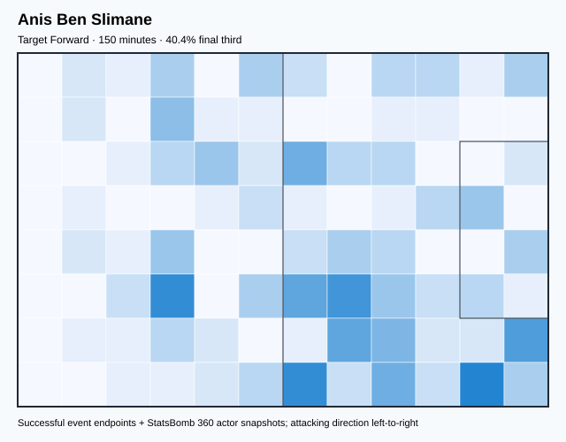

## Physical profile

| Metric | Score |
|---|---:|
| Aerial dominance | 0.556 |
| Pressing intensity per 90 | 13.23 |
| Recovery index per 90 | 3.61 |

## Top chemistry partners

- Aïssa Bilal Laïdouni — synergy 0.376, 150 shared minutes
- Ellyes Joris Skhiri — synergy 0.351, 150 shared minutes
- Montassar Omar Talbi — synergy 0.351, 150 shared minutes

## Tactical recommendations

- Lead the first pressing trigger and protect the inside passing lane.
- Use recovery capacity to support higher attacking positions.

_The heatmap combines successful event endpoints with StatsBomb 360 actor
snapshots. StatsBomb 360 is freeze-frame context, not continuous player
tracking. Ratings include eligible outfield players from 45 minutes and
goalkeepers from 90 minutes; ranking status communicates sample reliability._

---

<!-- PLAYER_REPORT 15: 44955_starter_report.md -->

# Aïssa Bilal Laïdouni — Starter Report

- Team: Tunisia (TUN)
- Position: Left Defensive Midfield
- Functional role: Box-to-Box / Engine Midfielder
- VAEP offense per 90: 0.1477
- VAEP defense per 90: 0.0296
- VAEP total per 90: 0.1773
- VAEP per touch: 0.00147
- Spatial xT per 90: 0.0219
- Final-third spatial share: 21.4%
- Unified final player rating: 0.0478
- Team rank: #11

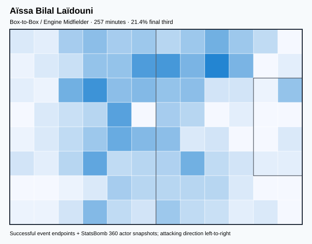

## Physical profile

| Metric | Score |
|---|---:|
| Aerial dominance | 0.500 |
| Pressing intensity per 90 | 14.34 |
| Recovery index per 90 | 8.05 |

## Top chemistry partners

- Yassine Meriah — synergy 0.578, 257 shared minutes
- Ellyes Joris Skhiri — synergy 0.570, 257 shared minutes
- Aymen Dahmen — synergy 0.570, 257 shared minutes

## Tactical recommendations

- Lead the first pressing trigger and protect the inside passing lane.
- Use recovery capacity to support higher attacking positions.

_The heatmap combines successful event endpoints with StatsBomb 360 actor
snapshots. StatsBomb 360 is freeze-frame context, not continuous player
tracking. Ratings include eligible outfield players from 45 minutes and
goalkeepers from 90 minutes; ranking status communicates sample reliability._

---

<!-- PLAYER_REPORT 16: 102816_starter_report.md -->

# Mohamed Ali Ben Romdhane — Starter Report

- Team: Tunisia (TUN)
- Position: Left Attacking Midfield
- Functional role: Wide Creator
- VAEP offense per 90: 0.1912
- VAEP defense per 90: 0.0181
- VAEP total per 90: 0.2093
- VAEP per touch: 0.00235
- Spatial xT per 90: 0.0581
- Final-third spatial share: 30.5%
- Unified final player rating: 0.1682
- Team rank: #5

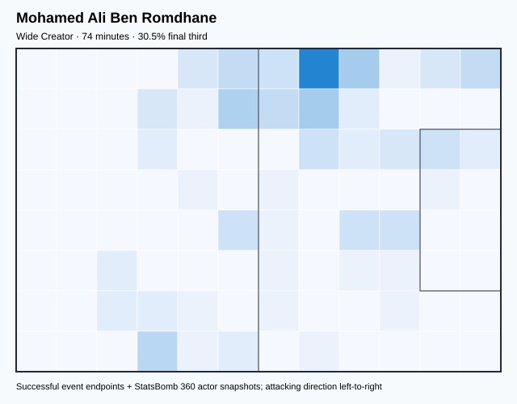

## Physical profile

| Metric | Score |
|---|---:|
| Aerial dominance | 0.000 |
| Pressing intensity per 90 | 14.62 |
| Recovery index per 90 | 8.53 |

## Top chemistry partners

- Ellyes Joris Skhiri — synergy 0.225, 74 shared minutes
- Montassar Omar Talbi — synergy 0.224, 74 shared minutes
- Nader Ghandri — synergy 0.220, 74 shared minutes

## Tactical recommendations

- Lead the first pressing trigger and protect the inside passing lane.
- Avoid isolating this player in high-volume aerial matchups.
- Use recovery capacity to support higher attacking positions.

_The heatmap combines successful event endpoints with StatsBomb 360 actor
snapshots. StatsBomb 360 is freeze-frame context, not continuous player
tracking. Ratings include eligible outfield players from 45 minutes and
goalkeepers from 90 minutes; ranking status communicates sample reliability._

---

<!-- PLAYER_REPORT 17: 105943_starter_report.md -->

# Aymen Dahmen — Starter Report

- Team: Tunisia (TUN)
- Position: Goalkeeper
- Functional role: Goalkeeper
- VAEP offense per 90: -0.0093
- VAEP defense per 90: -0.1028
- VAEP total per 90: -0.1122
- VAEP per touch: -0.00235
- Spatial xT per 90: 0.0006
- Final-third spatial share: 0.0%
- Unified final player rating: -0.0594
- Team rank: #18

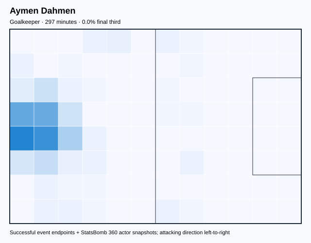

## Physical profile

| Metric | Score |
|---|---:|
| Aerial dominance | 0.000 |
| Pressing intensity per 90 | 0.00 |
| Recovery index per 90 | 2.12 |

## Top chemistry partners

- Yassine Meriah — synergy 0.656, 297 shared minutes
- Montassar Omar Talbi — synergy 0.649, 297 shared minutes
- Ellyes Joris Skhiri — synergy 0.611, 297 shared minutes

## Tactical recommendations

- Use a compact pressing trigger rather than sustained solo pressure.
- Avoid isolating this player in high-volume aerial matchups.
- Pair with a faster recovery defender after aggressive rotations.

_The heatmap combines successful event endpoints with StatsBomb 360 actor
snapshots. StatsBomb 360 is freeze-frame context, not continuous player
tracking. Ratings include eligible outfield players from 45 minutes and
goalkeepers from 90 minutes; ranking status communicates sample reliability._

---

<!-- PLAYER_REPORT 18: 105944_starter_report.md -->

# Wajdi Kechrida — Starter Report

- Team: Tunisia (TUN)
- Position: Right Wing Back
- Functional role: Attacking Wingback
- VAEP offense per 90: 0.1366
- VAEP defense per 90: -0.0679
- VAEP total per 90: 0.0687
- VAEP per touch: 0.00065
- Spatial xT per 90: 0.0597
- Final-third spatial share: 38.6%
- Unified final player rating: 0.0520
- Team rank: #10

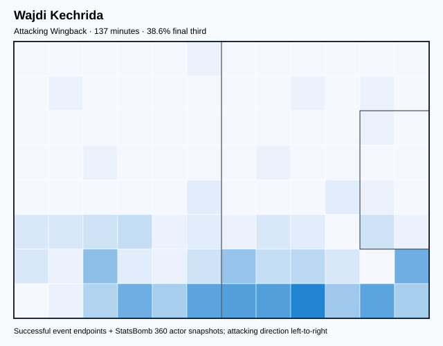

## Physical profile

| Metric | Score |
|---|---:|
| Aerial dominance | 0.333 |
| Pressing intensity per 90 | 6.59 |
| Recovery index per 90 | 3.30 |

## Top chemistry partners

- Yassine Meriah — synergy 0.389, 137 shared minutes
- Aymen Dahmen — synergy 0.364, 137 shared minutes
- Ellyes Joris Skhiri — synergy 0.355, 137 shared minutes

## Tactical recommendations

- Use a compact pressing trigger rather than sustained solo pressure.
- Use recovery capacity to support higher attacking positions.

_The heatmap combines successful event endpoints with StatsBomb 360 actor
snapshots. StatsBomb 360 is freeze-frame context, not continuous player
tracking. Ratings include eligible outfield players from 45 minutes and
goalkeepers from 90 minutes; ranking status communicates sample reliability._
