# URU — V4 Player Evaluation Collection

<!-- V5_CANONICAL_NOTICE -->
> **Historical V4 player-rating packet.** Player ratings, ranks, role-challenger decisions, and rating uncertainty below are superseded by `results/reports/player_rankings.csv`, `results/reports/player_profiles/`, and `results/reports/model_summary.md`. Possession, tactical, and match-bootstrap material remains a historical V4 result.

- Included eligible players: 17
- Rankings use the role-aware, development-gated VAEP/xT/xD model.
- Heatmaps combine successful on-ball endpoints and SB360 actor snapshots.

---

<!-- PLAYER_REPORT 1: 4319_starter_report.md -->

# Edinson Roberto Cavani Gómez — Starter Report

- Team: Uruguay (URU)
- Position: Left Center Forward
- Functional role: Ball-Winner
- VAEP offense per 90: 0.4060
- VAEP defense per 90: 0.0041
- VAEP total per 90: 0.4101
- VAEP per touch: 0.00531
- Spatial xT per 90: 0.0266
- Final-third spatial share: 40.3%
- Unified final player rating: 0.2327
- Team rank: #3

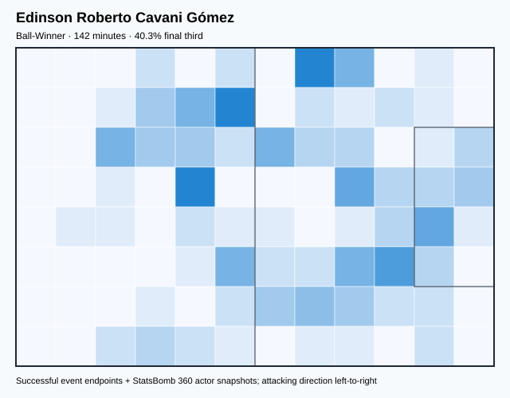

## Physical profile

| Metric | Score |
|---|---:|
| Aerial dominance | 0.200 |
| Pressing intensity per 90 | 10.13 |
| Recovery index per 90 | 2.53 |

## Top chemistry partners

- Mathías Olivera Miramontes — synergy 0.347, 123 shared minutes
- Guillermo Varela Olivera — synergy 0.339, 118 shared minutes
- José María Giménez de Vargas — synergy 0.337, 142 shared minutes

## Tactical recommendations

- Use a compact pressing trigger rather than sustained solo pressure.
- Use recovery capacity to support higher attacking positions.

_The heatmap combines successful event endpoints with StatsBomb 360 actor
snapshots. StatsBomb 360 is freeze-frame context, not continuous player
tracking. Ratings include eligible outfield players from 45 minutes and
goalkeepers from 90 minutes; ranking status communicates sample reliability._

---

<!-- PLAYER_REPORT 2: 5246_starter_report.md -->

# Luis Alberto Suárez Díaz — Starter Report

- Team: Uruguay (URU)
- Position: Right Center Forward
- Functional role: Target Forward
- VAEP offense per 90: 0.7401
- VAEP defense per 90: 0.0047
- VAEP total per 90: 0.7448
- VAEP per touch: 0.00860
- Spatial xT per 90: 0.0150
- Final-third spatial share: 44.1%
- Unified final player rating: 0.2749
- Team rank: #1

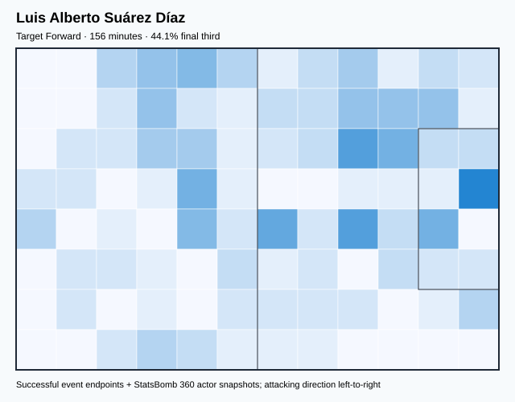

## Physical profile

| Metric | Score |
|---|---:|
| Aerial dominance | 0.500 |
| Pressing intensity per 90 | 8.08 |
| Recovery index per 90 | 1.15 |

## Top chemistry partners

- Sergio Rochet Álvarez — synergy 0.388, 156 shared minutes
- José María Giménez de Vargas — synergy 0.362, 156 shared minutes
- Mathías Olivera Miramontes — synergy 0.355, 141 shared minutes

## Tactical recommendations

- Use a compact pressing trigger rather than sustained solo pressure.
- Pair with a faster recovery defender after aggressive rotations.

_The heatmap combines successful event endpoints with StatsBomb 360 actor
snapshots. StatsBomb 360 is freeze-frame context, not continuous player
tracking. Ratings include eligible outfield players from 45 minutes and
goalkeepers from 90 minutes; ranking status communicates sample reliability._

---

<!-- PLAYER_REPORT 3: 5248_starter_report.md -->

# José Martín Cáceres Silva — Starter Report

- Team: Uruguay (URU)
- Position: Right Back
- Functional role: Deep Playmaker
- VAEP offense per 90: 0.0153
- VAEP defense per 90: -0.0394
- VAEP total per 90: -0.0241
- VAEP per touch: -0.00014
- Spatial xT per 90: 0.0619
- Final-third spatial share: 15.1%
- Unified final player rating: 0.0441
- Team rank: #10

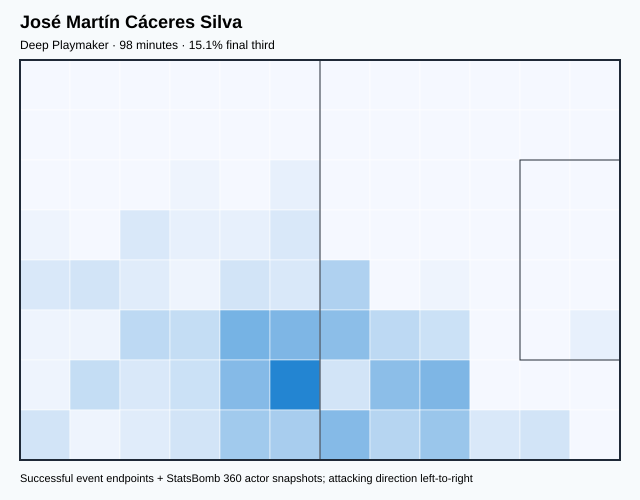

## Physical profile

| Metric | Score |
|---|---:|
| Aerial dominance | 1.000 |
| Pressing intensity per 90 | 11.04 |
| Recovery index per 90 | 2.76 |

## Top chemistry partners

- Diego Roberto Godín Leal — synergy 0.300, 98 shared minutes
- Rodrigo Bentancur Colmán — synergy 0.298, 98 shared minutes
- José María Giménez de Vargas — synergy 0.290, 98 shared minutes

## Tactical recommendations

- Lead the first pressing trigger and protect the inside passing lane.
- Target this player on direct restarts and back-post deliveries.
- Use recovery capacity to support higher attacking positions.

_The heatmap combines successful event endpoints with StatsBomb 360 actor
snapshots. StatsBomb 360 is freeze-frame context, not continuous player
tracking. Ratings include eligible outfield players from 45 minutes and
goalkeepers from 90 minutes; ranking status communicates sample reliability._

---

<!-- PLAYER_REPORT 4: 5249_starter_report.md -->

# Diego Roberto Godín Leal — Starter Report

- Team: Uruguay (URU)
- Position: Right Center Back
- Functional role: Sweeper CB
- VAEP offense per 90: 0.0443
- VAEP defense per 90: -0.0198
- VAEP total per 90: 0.0245
- VAEP per touch: 0.00017
- Spatial xT per 90: 0.0172
- Final-third spatial share: 3.1%
- Unified final player rating: -0.0026
- Team rank: #16

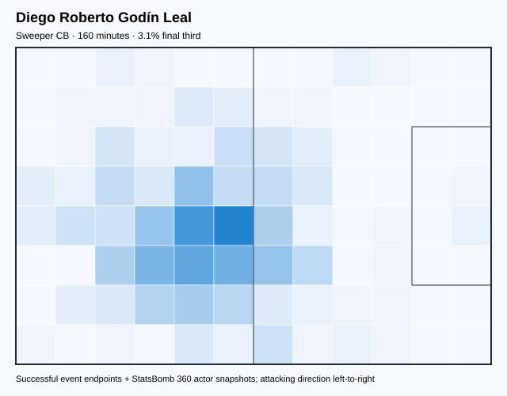

## Physical profile

| Metric | Score |
|---|---:|
| Aerial dominance | 0.769 |
| Pressing intensity per 90 | 5.08 |
| Recovery index per 90 | 1.69 |

## Top chemistry partners

- José María Giménez de Vargas — synergy 0.440, 160 shared minutes
- Rodrigo Bentancur Colmán — synergy 0.437, 160 shared minutes
- Sergio Rochet Álvarez — synergy 0.433, 160 shared minutes

## Tactical recommendations

- Use a compact pressing trigger rather than sustained solo pressure.
- Target this player on direct restarts and back-post deliveries.
- Pair with a faster recovery defender after aggressive rotations.

_The heatmap combines successful event endpoints with StatsBomb 360 actor
snapshots. StatsBomb 360 is freeze-frame context, not continuous player
tracking. Ratings include eligible outfield players from 45 minutes and
goalkeepers from 90 minutes; ranking status communicates sample reliability._

---

<!-- PLAYER_REPORT 5: 5255_starter_report.md -->

# Matías Vecino Falero — Starter Report

- Team: Uruguay (URU)
- Position: Left Center Midfield
- Functional role: Holding Anchor
- VAEP offense per 90: 0.0703
- VAEP defense per 90: -0.0055
- VAEP total per 90: 0.0647
- VAEP per touch: 0.00055
- Spatial xT per 90: 0.0012
- Final-third spatial share: 18.3%
- Unified final player rating: 0.0844
- Team rank: #7

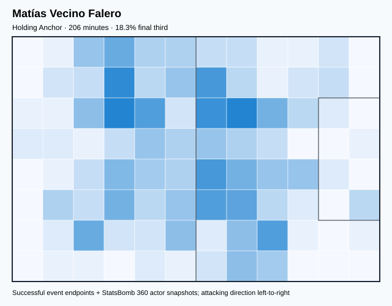

## Physical profile

| Metric | Score |
|---|---:|
| Aerial dominance | 0.375 |
| Pressing intensity per 90 | 20.12 |
| Recovery index per 90 | 4.37 |

## Top chemistry partners

- Mathías Olivera Miramontes — synergy 0.506, 206 shared minutes
- Federico Santiago Valverde Dipetta — synergy 0.505, 206 shared minutes
- Sergio Rochet Álvarez — synergy 0.505, 206 shared minutes

## Tactical recommendations

- Lead the first pressing trigger and protect the inside passing lane.
- Use recovery capacity to support higher attacking positions.

_The heatmap combines successful event endpoints with StatsBomb 360 actor
snapshots. StatsBomb 360 is freeze-frame context, not continuous player
tracking. Ratings include eligible outfield players from 45 minutes and
goalkeepers from 90 minutes; ranking status communicates sample reliability._

---

<!-- PLAYER_REPORT 6: 5258_starter_report.md -->

# Giorgian Daniel De Arrascaeta Benedetti — Starter Report

- Team: Uruguay (URU)
- Position: Left Midfield
- Functional role: Progressive Winger
- VAEP offense per 90: 0.3383
- VAEP defense per 90: 0.0383
- VAEP total per 90: 0.3766
- VAEP per touch: 0.00309
- Spatial xT per 90: 0.0864
- Final-third spatial share: 43.2%
- Unified final player rating: 0.1284
- Team rank: #6

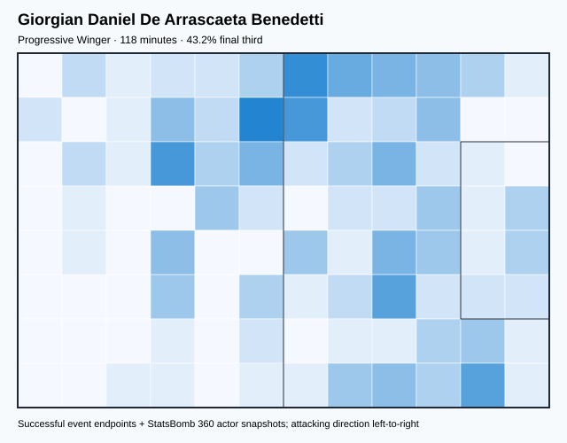

## Physical profile

| Metric | Score |
|---|---:|
| Aerial dominance | 0.200 |
| Pressing intensity per 90 | 22.86 |
| Recovery index per 90 | 3.81 |

## Top chemistry partners

- Federico Santiago Valverde Dipetta — synergy 0.341, 118 shared minutes
- Sebastián Coates Nión — synergy 0.293, 118 shared minutes
- José María Giménez de Vargas — synergy 0.292, 118 shared minutes

## Tactical recommendations

- Lead the first pressing trigger and protect the inside passing lane.
- Use recovery capacity to support higher attacking positions.

_The heatmap combines successful event endpoints with StatsBomb 360 actor
snapshots. StatsBomb 360 is freeze-frame context, not continuous player
tracking. Ratings include eligible outfield players from 45 minutes and
goalkeepers from 90 minutes; ranking status communicates sample reliability._

---

<!-- PLAYER_REPORT 7: 5259_starter_report.md -->

# José María Giménez de Vargas — Starter Report

- Team: Uruguay (URU)
- Position: Right Center Back
- Functional role: Sweeper CB
- VAEP offense per 90: 0.1901
- VAEP defense per 90: -0.0328
- VAEP total per 90: 0.1573
- VAEP per touch: 0.00124
- Spatial xT per 90: 0.0260
- Final-third spatial share: 7.6%
- Unified final player rating: 0.0281
- Team rank: #12

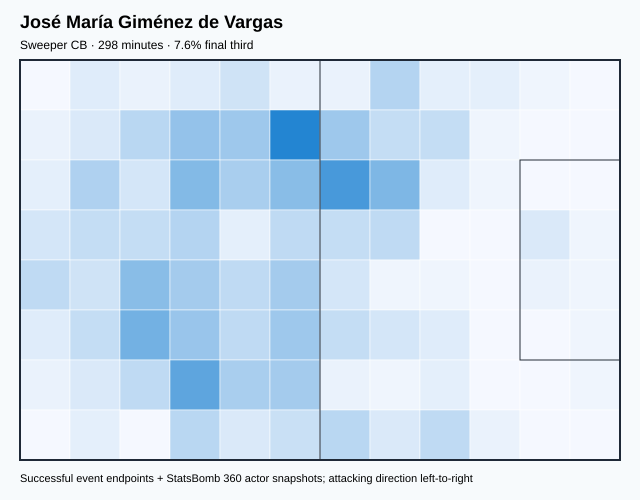

## Physical profile

| Metric | Score |
|---|---:|
| Aerial dominance | 0.846 |
| Pressing intensity per 90 | 9.36 |
| Recovery index per 90 | 1.81 |

## Top chemistry partners

- Sergio Rochet Álvarez — synergy 0.654, 298 shared minutes
- Federico Santiago Valverde Dipetta — synergy 0.635, 298 shared minutes
- Mathías Olivera Miramontes — synergy 0.589, 264 shared minutes

## Tactical recommendations

- Use a compact pressing trigger rather than sustained solo pressure.
- Target this player on direct restarts and back-post deliveries.
- Pair with a faster recovery defender after aggressive rotations.

_The heatmap combines successful event endpoints with StatsBomb 360 actor
snapshots. StatsBomb 360 is freeze-frame context, not continuous player
tracking. Ratings include eligible outfield players from 45 minutes and
goalkeepers from 90 minutes; ranking status communicates sample reliability._

---

<!-- PLAYER_REPORT 8: 5260_starter_report.md -->

# Rodrigo Bentancur Colmán — Starter Report

- Team: Uruguay (URU)
- Position: Left Defensive Midfield
- Functional role: Box-to-Box / Engine Midfielder
- VAEP offense per 90: 0.1805
- VAEP defense per 90: -0.0135
- VAEP total per 90: 0.1670
- VAEP per touch: 0.00100
- Spatial xT per 90: 0.0606
- Final-third spatial share: 17.9%
- Unified final player rating: 0.0469
- Team rank: #9

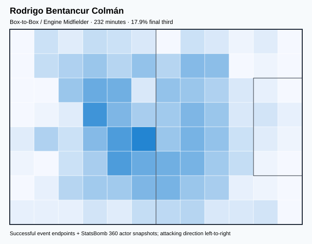

## Physical profile

| Metric | Score |
|---|---:|
| Aerial dominance | 0.727 |
| Pressing intensity per 90 | 19.42 |
| Recovery index per 90 | 6.60 |

## Top chemistry partners

- José María Giménez de Vargas — synergy 0.556, 232 shared minutes
- Sergio Rochet Álvarez — synergy 0.554, 232 shared minutes
- Federico Santiago Valverde Dipetta — synergy 0.507, 232 shared minutes

## Tactical recommendations

- Lead the first pressing trigger and protect the inside passing lane.
- Target this player on direct restarts and back-post deliveries.
- Use recovery capacity to support higher attacking positions.

_The heatmap combines successful event endpoints with StatsBomb 360 actor
snapshots. StatsBomb 360 is freeze-frame context, not continuous player
tracking. Ratings include eligible outfield players from 45 minutes and
goalkeepers from 90 minutes; ranking status communicates sample reliability._

---

<!-- PLAYER_REPORT 9: 5264_starter_report.md -->

# Guillermo Varela Olivera — Starter Report

- Team: Uruguay (URU)
- Position: Right Back
- Functional role: Deep Playmaker
- VAEP offense per 90: 0.0347
- VAEP defense per 90: -0.1642
- VAEP total per 90: -0.1295
- VAEP per touch: -0.00135
- Spatial xT per 90: 0.0376
- Final-third spatial share: 29.1%
- Unified final player rating: 0.0182
- Team rank: #14

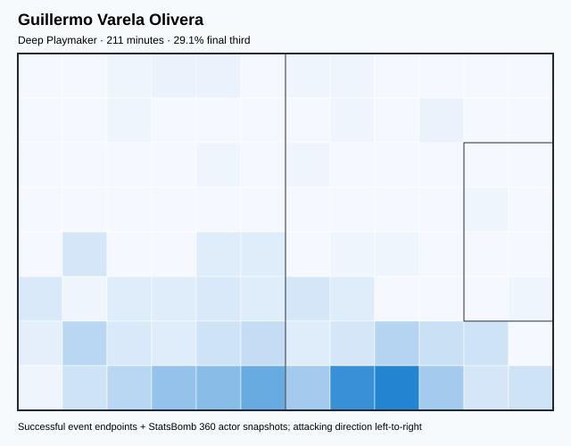

## Physical profile

| Metric | Score |
|---|---:|
| Aerial dominance | 0.750 |
| Pressing intensity per 90 | 8.12 |
| Recovery index per 90 | 0.85 |

## Top chemistry partners

- José María Giménez de Vargas — synergy 0.531, 211 shared minutes
- Federico Santiago Valverde Dipetta — synergy 0.519, 211 shared minutes
- Sergio Rochet Álvarez — synergy 0.503, 211 shared minutes

## Tactical recommendations

- Use a compact pressing trigger rather than sustained solo pressure.
- Target this player on direct restarts and back-post deliveries.
- Pair with a faster recovery defender after aggressive rotations.

_The heatmap combines successful event endpoints with StatsBomb 360 actor
snapshots. StatsBomb 360 is freeze-frame context, not continuous player
tracking. Ratings include eligible outfield players from 45 minutes and
goalkeepers from 90 minutes; ranking status communicates sample reliability._

---

<!-- PLAYER_REPORT 10: 6297_starter_report.md -->

# Maximiliano Gómez González — Starter Report

- Team: Uruguay (URU)
- Position: Left Center Forward
- Functional role: Target Forward / Penalty-Box Anchor
- VAEP offense per 90: 0.3924
- VAEP defense per 90: 0.0536
- VAEP total per 90: 0.4460
- VAEP per touch: 0.01009
- Spatial xT per 90: -0.0365
- Final-third spatial share: 67.4%
- Unified final player rating: 0.2372
- Team rank: #2

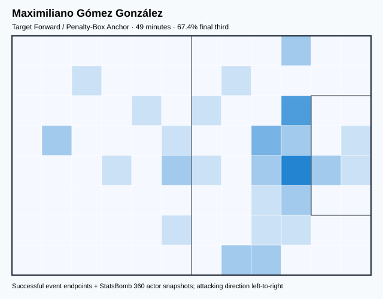

## Physical profile

| Metric | Score |
|---|---:|
| Aerial dominance | 0.667 |
| Pressing intensity per 90 | 7.37 |
| Recovery index per 90 | 1.84 |

## Top chemistry partners

- José María Giménez de Vargas — synergy 0.152, 49 shared minutes
- Sebastián Coates Nión — synergy 0.152, 49 shared minutes
- Sergio Rochet Álvarez — synergy 0.150, 49 shared minutes

## Tactical recommendations

- Use a compact pressing trigger rather than sustained solo pressure.
- Target this player on direct restarts and back-post deliveries.
- Pair with a faster recovery defender after aggressive rotations.

_The heatmap combines successful event endpoints with StatsBomb 360 actor
snapshots. StatsBomb 360 is freeze-frame context, not continuous player
tracking. Ratings include eligible outfield players from 45 minutes and
goalkeepers from 90 minutes; ranking status communicates sample reliability._

---

<!-- PLAYER_REPORT 11: 6300_starter_report.md -->

# Sebastián Coates Nión — Starter Report

- Team: Uruguay (URU)
- Position: Left Center Back
- Functional role: Sweeper CB
- VAEP offense per 90: 0.0762
- VAEP defense per 90: -0.0048
- VAEP total per 90: 0.0714
- VAEP per touch: 0.00071
- Spatial xT per 90: 0.0235
- Final-third spatial share: 6.4%
- Unified final player rating: 0.0062
- Team rank: #15

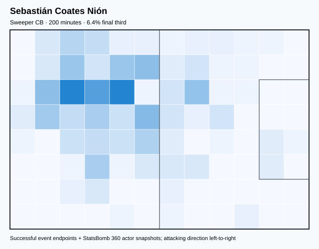

## Physical profile

| Metric | Score |
|---|---:|
| Aerial dominance | 0.889 |
| Pressing intensity per 90 | 2.25 |
| Recovery index per 90 | 3.59 |

## Top chemistry partners

- Federico Santiago Valverde Dipetta — synergy 0.515, 200 shared minutes
- José María Giménez de Vargas — synergy 0.515, 200 shared minutes
- Sergio Rochet Álvarez — synergy 0.502, 200 shared minutes

## Tactical recommendations

- Use a compact pressing trigger rather than sustained solo pressure.
- Target this player on direct restarts and back-post deliveries.
- Use recovery capacity to support higher attacking positions.

_The heatmap combines successful event endpoints with StatsBomb 360 actor
snapshots. StatsBomb 360 is freeze-frame context, not continuous player
tracking. Ratings include eligible outfield players from 45 minutes and
goalkeepers from 90 minutes; ranking status communicates sample reliability._

---

<!-- PLAYER_REPORT 12: 6773_starter_report.md -->

# Federico Santiago Valverde Dipetta — Starter Report

- Team: Uruguay (URU)
- Position: Right Defensive Midfield
- Functional role: Holding Anchor
- VAEP offense per 90: 0.0990
- VAEP defense per 90: -0.0040
- VAEP total per 90: 0.0949
- VAEP per touch: 0.00064
- Spatial xT per 90: 0.0812
- Final-third spatial share: 25.7%
- Unified final player rating: 0.0385
- Team rank: #11

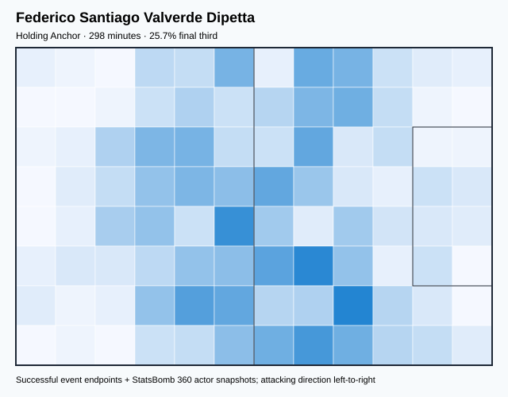

## Physical profile

| Metric | Score |
|---|---:|
| Aerial dominance | 0.625 |
| Pressing intensity per 90 | 13.59 |
| Recovery index per 90 | 4.23 |

## Top chemistry partners

- Sergio Rochet Álvarez — synergy 0.636, 298 shared minutes
- José María Giménez de Vargas — synergy 0.635, 298 shared minutes
- Mathías Olivera Miramontes — synergy 0.580, 264 shared minutes

## Tactical recommendations

- Lead the first pressing trigger and protect the inside passing lane.
- Target this player on direct restarts and back-post deliveries.
- Use recovery capacity to support higher attacking positions.

_The heatmap combines successful event endpoints with StatsBomb 360 actor
snapshots. StatsBomb 360 is freeze-frame context, not continuous player
tracking. Ratings include eligible outfield players from 45 minutes and
goalkeepers from 90 minutes; ranking status communicates sample reliability._

---

<!-- PLAYER_REPORT 13: 7104_starter_report.md -->

# Mathías Olivera Miramontes — Starter Report

- Team: Uruguay (URU)
- Position: Left Back
- Functional role: Wide Creator
- VAEP offense per 90: 0.1288
- VAEP defense per 90: -0.0446
- VAEP total per 90: 0.0842
- VAEP per touch: 0.00078
- Spatial xT per 90: 0.0575
- Final-third spatial share: 33.5%
- Unified final player rating: 0.0537
- Team rank: #8

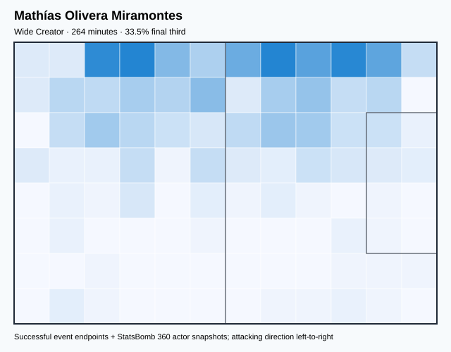

## Physical profile

| Metric | Score |
|---|---:|
| Aerial dominance | 0.667 |
| Pressing intensity per 90 | 16.73 |
| Recovery index per 90 | 4.44 |

## Top chemistry partners

- José María Giménez de Vargas — synergy 0.589, 264 shared minutes
- Federico Santiago Valverde Dipetta — synergy 0.580, 264 shared minutes
- Sergio Rochet Álvarez — synergy 0.563, 264 shared minutes

## Tactical recommendations

- Lead the first pressing trigger and protect the inside passing lane.
- Target this player on direct restarts and back-post deliveries.
- Use recovery capacity to support higher attacking positions.

_The heatmap combines successful event endpoints with StatsBomb 360 actor
snapshots. StatsBomb 360 is freeze-frame context, not continuous player
tracking. Ratings include eligible outfield players from 45 minutes and
goalkeepers from 90 minutes; ranking status communicates sample reliability._

---

<!-- PLAYER_REPORT 14: 28729_starter_report.md -->

# Diego Nicolás De La Cruz Arcosa — Starter Report

- Team: Uruguay (URU)
- Position: Right Defensive Midfield
- Functional role: Ball-Winner
- VAEP offense per 90: 0.1394
- VAEP defense per 90: -0.1150
- VAEP total per 90: 0.0244
- VAEP per touch: 0.00019
- Spatial xT per 90: 0.1182
- Final-third spatial share: 46.4%
- Unified final player rating: 0.0232
- Team rank: #13

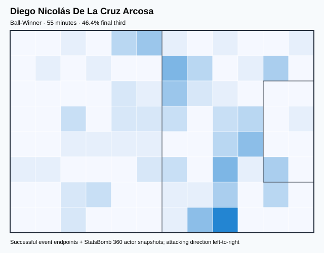

## Physical profile

| Metric | Score |
|---|---:|
| Aerial dominance | 0.000 |
| Pressing intensity per 90 | 23.05 |
| Recovery index per 90 | 4.94 |

## Top chemistry partners

- Federico Santiago Valverde Dipetta — synergy 0.175, 55 shared minutes
- José María Giménez de Vargas — synergy 0.168, 55 shared minutes
- Sergio Rochet Álvarez — synergy 0.166, 55 shared minutes

## Tactical recommendations

- Lead the first pressing trigger and protect the inside passing lane.
- Avoid isolating this player in high-volume aerial matchups.
- Use recovery capacity to support higher attacking positions.

_The heatmap combines successful event endpoints with StatsBomb 360 actor
snapshots. StatsBomb 360 is freeze-frame context, not continuous player
tracking. Ratings include eligible outfield players from 45 minutes and
goalkeepers from 90 minutes; ranking status communicates sample reliability._

---

<!-- PLAYER_REPORT 15: 32478_starter_report.md -->

# Darwin Gabriel Núñez Ribeiro — Starter Report

- Team: Uruguay (URU)
- Position: Left Wing
- Functional role: Target Forward
- VAEP offense per 90: 0.2376
- VAEP defense per 90: 0.0917
- VAEP total per 90: 0.3292
- VAEP per touch: 0.00403
- Spatial xT per 90: 0.0442
- Final-third spatial share: 51.6%
- Unified final player rating: 0.1759
- Team rank: #4

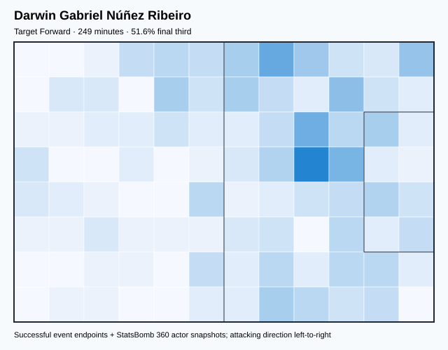

## Physical profile

| Metric | Score |
|---|---:|
| Aerial dominance | 0.375 |
| Pressing intensity per 90 | 11.56 |
| Recovery index per 90 | 1.81 |

## Top chemistry partners

- Federico Santiago Valverde Dipetta — synergy 0.516, 249 shared minutes
- Mathías Olivera Miramontes — synergy 0.491, 230 shared minutes
- Rodrigo Bentancur Colmán — synergy 0.461, 203 shared minutes

## Tactical recommendations

- Lead the first pressing trigger and protect the inside passing lane.
- Pair with a faster recovery defender after aggressive rotations.

_The heatmap combines successful event endpoints with StatsBomb 360 actor
snapshots. StatsBomb 360 is freeze-frame context, not continuous player
tracking. Ratings include eligible outfield players from 45 minutes and
goalkeepers from 90 minutes; ranking status communicates sample reliability._

---

<!-- PLAYER_REPORT 16: 36288_starter_report.md -->

# Facundo Pellistri Rebollo — Starter Report

- Team: Uruguay (URU)
- Position: Right Wing
- Functional role: Ball-Winner
- VAEP offense per 90: 0.2355
- VAEP defense per 90: 0.0107
- VAEP total per 90: 0.2462
- VAEP per touch: 0.00283
- Spatial xT per 90: 0.0811
- Final-third spatial share: 57.5%
- Unified final player rating: 0.1657
- Team rank: #5

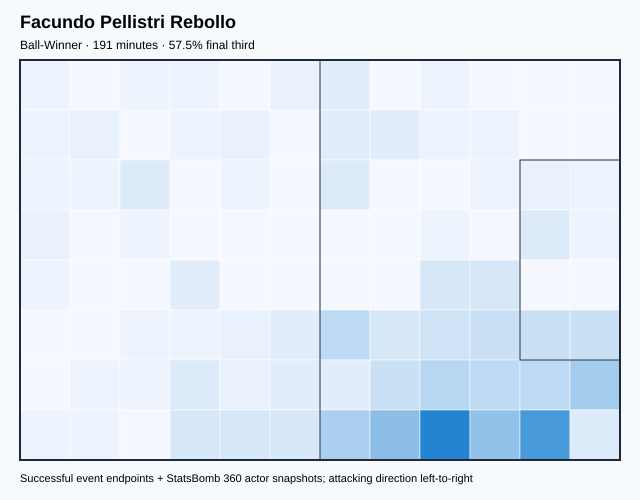

## Physical profile

| Metric | Score |
|---|---:|
| Aerial dominance | 0.100 |
| Pressing intensity per 90 | 14.59 |
| Recovery index per 90 | 2.82 |

## Top chemistry partners

- Mathías Olivera Miramontes — synergy 0.432, 167 shared minutes
- Federico Santiago Valverde Dipetta — synergy 0.417, 191 shared minutes
- Rodrigo Bentancur Colmán — synergy 0.396, 160 shared minutes

## Tactical recommendations

- Lead the first pressing trigger and protect the inside passing lane.
- Avoid isolating this player in high-volume aerial matchups.
- Use recovery capacity to support higher attacking positions.

_The heatmap combines successful event endpoints with StatsBomb 360 actor
snapshots. StatsBomb 360 is freeze-frame context, not continuous player
tracking. Ratings include eligible outfield players from 45 minutes and
goalkeepers from 90 minutes; ranking status communicates sample reliability._

---

<!-- PLAYER_REPORT 17: 36710_starter_report.md -->

# Sergio Rochet Álvarez — Starter Report

- Team: Uruguay (URU)
- Position: Goalkeeper
- Functional role: Goalkeeper
- VAEP offense per 90: -0.0130
- VAEP defense per 90: -0.1142
- VAEP total per 90: -0.1272
- VAEP per touch: -0.00285
- Spatial xT per 90: 0.0070
- Final-third spatial share: 1.3%
- Unified final player rating: -0.0619
- Team rank: #17

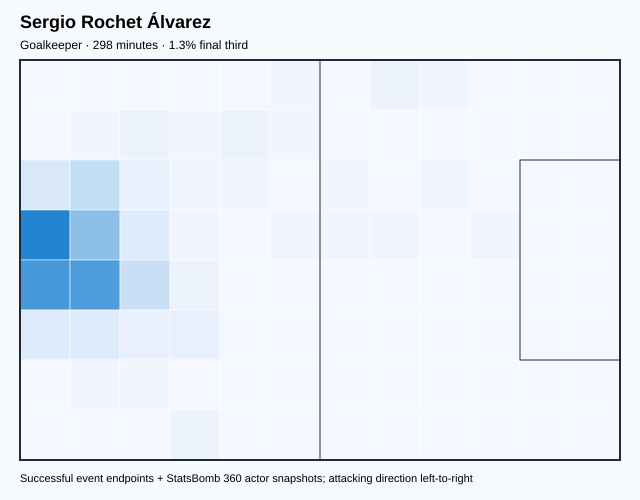

## Physical profile

| Metric | Score |
|---|---:|
| Aerial dominance | 0.000 |
| Pressing intensity per 90 | 0.30 |
| Recovery index per 90 | 3.32 |

## Top chemistry partners

- José María Giménez de Vargas — synergy 0.654, 298 shared minutes
- Federico Santiago Valverde Dipetta — synergy 0.636, 298 shared minutes
- Mathías Olivera Miramontes — synergy 0.563, 264 shared minutes

## Tactical recommendations

- Use a compact pressing trigger rather than sustained solo pressure.
- Avoid isolating this player in high-volume aerial matchups.
- Use recovery capacity to support higher attacking positions.

_The heatmap combines successful event endpoints with StatsBomb 360 actor
snapshots. StatsBomb 360 is freeze-frame context, not continuous player
tracking. Ratings include eligible outfield players from 45 minutes and
goalkeepers from 90 minutes; ranking status communicates sample reliability._
