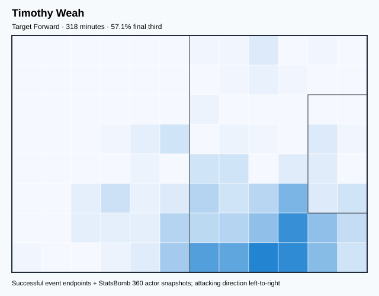
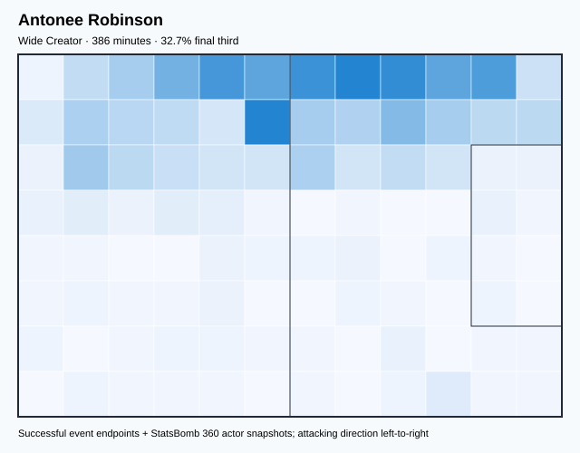
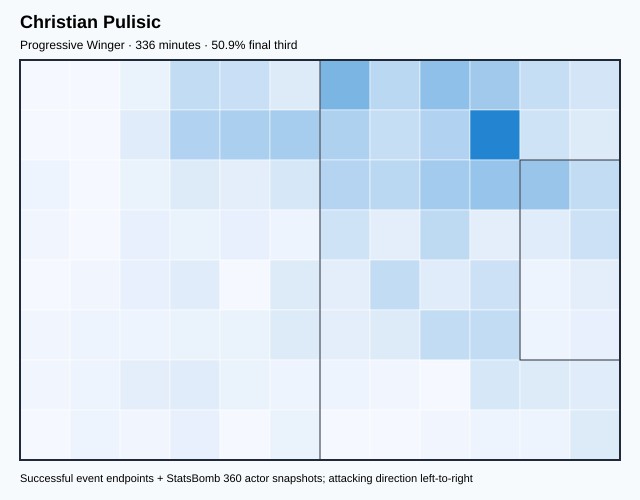
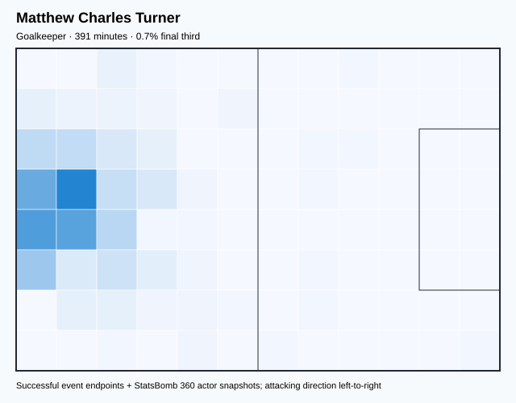
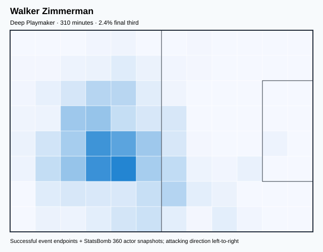
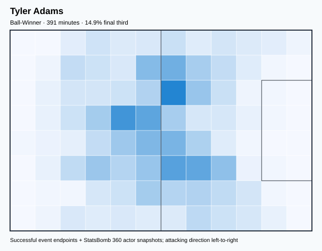
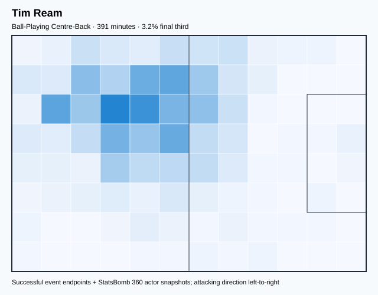
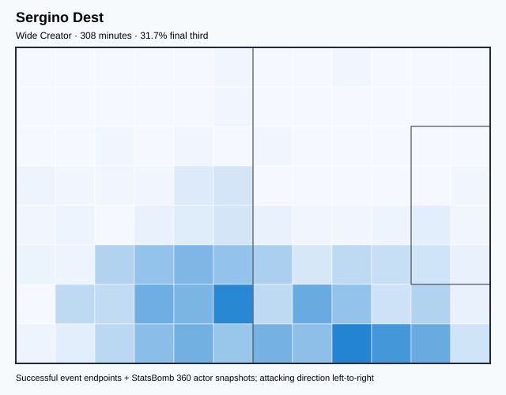
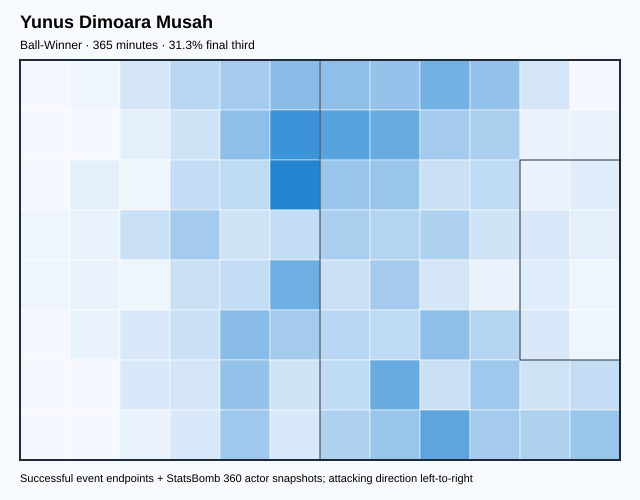

# USA — V4 Player Evaluation Collection

- Included 300+ minute players: 9
- Rankings use one cross-role 360-VAEP plus xT formula.
- Heatmaps combine successful on-ball endpoints and SB360 actor snapshots.

---

<!-- PLAYER_REPORT 1: 3377_starter_report.md -->

# Timothy Weah — Starter Report

- Team: United States (USA)
- Position: Right Wing
- Functional role: Progressive Winger
- VAEP offense per 90: 0.4249
- VAEP defense per 90: 0.0416
- VAEP total per 90: 0.4664
- VAEP per touch: 0.00439
- Spatial xT per 90: 0.0182
- Final-third spatial share: 52.7%
- Unified final player rating: 0.2230
- Team rank: #2

## Physical profile

| Metric | Score |
|---|---:|
| Aerial dominance | 0.200 |
| Pressing intensity per 90 | 7.36 |
| Recovery index per 90 | 3.68 |

## Top chemistry partners

- Tyler Adams — synergy 0.623, 318 shared minutes
- Sergino Dest — synergy 0.592, 299 shared minutes
- Yunus Dimoara Musah — synergy 0.566, 305 shared minutes

## Tactical recommendations

- Use a compact pressing trigger rather than sustained solo pressure.
- Use recovery capacity to support higher attacking positions.

_The heatmap combines successful event endpoints with StatsBomb 360 actor
snapshots. StatsBomb 360 is freeze-frame context, not continuous player
tracking. Scores exclude players below 300 tournament minutes._

---

<!-- PLAYER_REPORT 2: 4614_starter_report.md -->

# Antonee Robinson — Starter Report

- Team: United States (USA)
- Position: Left Back
- Functional role: Wide Creator
- VAEP offense per 90: 0.2210
- VAEP defense per 90: -0.0348
- VAEP total per 90: 0.1862
- VAEP per touch: 0.00126
- Spatial xT per 90: 0.0845
- Final-third spatial share: 32.7%
- Unified final player rating: 0.0958
- Team rank: #4

## Physical profile

| Metric | Score |
|---|---:|
| Aerial dominance | 0.250 |
| Pressing intensity per 90 | 14.45 |
| Recovery index per 90 | 7.22 |

## Top chemistry partners

- Matthew Charles Turner — synergy 0.735, 386 shared minutes
- Tim Ream — synergy 0.728, 386 shared minutes
- Tyler Adams — synergy 0.705, 386 shared minutes

## Tactical recommendations

- Lead the first pressing trigger and protect the inside passing lane.
- Use recovery capacity to support higher attacking positions.

_The heatmap combines successful event endpoints with StatsBomb 360 actor
snapshots. StatsBomb 360 is freeze-frame context, not continuous player
tracking. Scores exclude players below 300 tournament minutes._

---

<!-- PLAYER_REPORT 3: 8246_starter_report.md -->

# Christian Pulisic — Starter Report

- Team: United States (USA)
- Position: Left Wing
- Functional role: Progressive Winger
- VAEP offense per 90: 0.4964
- VAEP defense per 90: 0.0308
- VAEP total per 90: 0.5271
- VAEP per touch: 0.00392
- Spatial xT per 90: 0.1139
- Final-third spatial share: 50.9%
- Unified final player rating: 0.2496
- Team rank: #1

## Physical profile

| Metric | Score |
|---|---:|
| Aerial dominance | 0.400 |
| Pressing intensity per 90 | 11.77 |
| Recovery index per 90 | 4.55 |

## Top chemistry partners

- Tyler Adams — synergy 0.661, 336 shared minutes
- Yunus Dimoara Musah — synergy 0.646, 310 shared minutes
- Antonee Robinson — synergy 0.600, 331 shared minutes

## Tactical recommendations

- Lead the first pressing trigger and protect the inside passing lane.
- Use recovery capacity to support higher attacking positions.

_The heatmap combines successful event endpoints with StatsBomb 360 actor
snapshots. StatsBomb 360 is freeze-frame context, not continuous player
tracking. Scores exclude players below 300 tournament minutes._

---

<!-- PLAYER_REPORT 4: 12352_starter_report.md -->

# Matthew Charles Turner — Starter Report

- Team: United States (USA)
- Position: Goalkeeper
- Functional role: Goalkeeper
- VAEP offense per 90: -0.0272
- VAEP defense per 90: -0.0985
- VAEP total per 90: -0.1257
- VAEP per touch: -0.00203
- Spatial xT per 90: 0.0028
- Final-third spatial share: 1.6%
- Unified final player rating: -0.0581
- Team rank: #9

## Physical profile

| Metric | Score |
|---|---:|
| Aerial dominance | 0.000 |
| Pressing intensity per 90 | 0.00 |
| Recovery index per 90 | 3.91 |

## Top chemistry partners

- Tim Ream — synergy 0.756, 391 shared minutes
- Antonee Robinson — synergy 0.735, 386 shared minutes
- Tyler Adams — synergy 0.733, 391 shared minutes

## Tactical recommendations

- Use a compact pressing trigger rather than sustained solo pressure.
- Avoid isolating this player in high-volume aerial matchups.
- Use recovery capacity to support higher attacking positions.

_The heatmap combines successful event endpoints with StatsBomb 360 actor
snapshots. StatsBomb 360 is freeze-frame context, not continuous player
tracking. Scores exclude players below 300 tournament minutes._

---

<!-- PLAYER_REPORT 5: 12524_starter_report.md -->

# Walker Zimmerman — Starter Report

- Team: United States (USA)
- Position: Right Center Back
- Functional role: Deep Playmaker
- VAEP offense per 90: 0.0069
- VAEP defense per 90: -0.1072
- VAEP total per 90: -0.1002
- VAEP per touch: -0.00056
- Spatial xT per 90: 0.0039
- Final-third spatial share: 3.2%
- Unified final player rating: -0.0293
- Team rank: #8

## Physical profile

| Metric | Score |
|---|---:|
| Aerial dominance | 0.529 |
| Pressing intensity per 90 | 6.39 |
| Recovery index per 90 | 1.74 |

## Top chemistry partners

- Tim Ream — synergy 0.680, 310 shared minutes
- Matthew Charles Turner — synergy 0.674, 310 shared minutes
- Tyler Adams — synergy 0.661, 310 shared minutes

## Tactical recommendations

- Use a compact pressing trigger rather than sustained solo pressure.
- Pair with a faster recovery defender after aggressive rotations.

_The heatmap combines successful event endpoints with StatsBomb 360 actor
snapshots. StatsBomb 360 is freeze-frame context, not continuous player
tracking. Scores exclude players below 300 tournament minutes._

---

<!-- PLAYER_REPORT 6: 12751_starter_report.md -->

# Tyler Adams — Starter Report

- Team: United States (USA)
- Position: Center Defensive Midfield
- Functional role: Ball-Winner
- VAEP offense per 90: 0.0189
- VAEP defense per 90: -0.0499
- VAEP total per 90: -0.0310
- VAEP per touch: -0.00020
- Spatial xT per 90: 0.0347
- Final-third spatial share: 15.7%
- Unified final player rating: 0.0082
- Team rank: #6

## Physical profile

| Metric | Score |
|---|---:|
| Aerial dominance | 0.600 |
| Pressing intensity per 90 | 20.48 |
| Recovery index per 90 | 6.21 |

## Top chemistry partners

- Matthew Charles Turner — synergy 0.733, 391 shared minutes
- Tim Ream — synergy 0.723, 391 shared minutes
- Antonee Robinson — synergy 0.705, 386 shared minutes

## Tactical recommendations

- Lead the first pressing trigger and protect the inside passing lane.
- Target this player on direct restarts and back-post deliveries.
- Use recovery capacity to support higher attacking positions.

_The heatmap combines successful event endpoints with StatsBomb 360 actor
snapshots. StatsBomb 360 is freeze-frame context, not continuous player
tracking. Scores exclude players below 300 tournament minutes._

---

<!-- PLAYER_REPORT 7: 18242_starter_report.md -->

# Tim Ream — Starter Report

- Team: United States (USA)
- Position: Left Center Back
- Functional role: Deep Playmaker
- VAEP offense per 90: 0.0518
- VAEP defense per 90: -0.0529
- VAEP total per 90: -0.0011
- VAEP per touch: -0.00001
- Spatial xT per 90: 0.0030
- Final-third spatial share: 3.2%
- Unified final player rating: -0.0036
- Team rank: #7

## Physical profile

| Metric | Score |
|---|---:|
| Aerial dominance | 0.444 |
| Pressing intensity per 90 | 9.20 |
| Recovery index per 90 | 3.45 |

## Top chemistry partners

- Matthew Charles Turner — synergy 0.756, 391 shared minutes
- Antonee Robinson — synergy 0.728, 386 shared minutes
- Tyler Adams — synergy 0.723, 391 shared minutes

## Tactical recommendations

- Use a compact pressing trigger rather than sustained solo pressure.
- Use recovery capacity to support higher attacking positions.

_The heatmap combines successful event endpoints with StatsBomb 360 actor
snapshots. StatsBomb 360 is freeze-frame context, not continuous player
tracking. Scores exclude players below 300 tournament minutes._

---

<!-- PLAYER_REPORT 8: 21881_starter_report.md -->

# Sergino Dest — Starter Report

- Team: United States (USA)
- Position: Right Back
- Functional role: Box-to-Box Runner
- VAEP offense per 90: 0.1330
- VAEP defense per 90: -0.0305
- VAEP total per 90: 0.1026
- VAEP per touch: 0.00058
- Spatial xT per 90: 0.0985
- Final-third spatial share: 31.2%
- Unified final player rating: 0.0741
- Team rank: #5

## Physical profile

| Metric | Score |
|---|---:|
| Aerial dominance | 0.286 |
| Pressing intensity per 90 | 13.46 |
| Recovery index per 90 | 4.39 |

## Top chemistry partners

- Tyler Adams — synergy 0.672, 308 shared minutes
- Matthew Charles Turner — synergy 0.665, 308 shared minutes
- Yunus Dimoara Musah — synergy 0.632, 308 shared minutes

## Tactical recommendations

- Lead the first pressing trigger and protect the inside passing lane.
- Use recovery capacity to support higher attacking positions.

_The heatmap combines successful event endpoints with StatsBomb 360 actor
snapshots. StatsBomb 360 is freeze-frame context, not continuous player
tracking. Scores exclude players below 300 tournament minutes._

---

<!-- PLAYER_REPORT 9: 38792_starter_report.md -->

# Yunus Dimoara Musah — Starter Report

- Team: United States (USA)
- Position: Right Center Midfield
- Functional role: Ball-Winner
- VAEP offense per 90: 0.1376
- VAEP defense per 90: -0.0195
- VAEP total per 90: 0.1181
- VAEP per touch: 0.00088
- Spatial xT per 90: 0.0460
- Final-third spatial share: 31.3%
- Unified final player rating: 0.1005
- Team rank: #3

## Physical profile

| Metric | Score |
|---|---:|
| Aerial dominance | 0.250 |
| Pressing intensity per 90 | 19.24 |
| Recovery index per 90 | 4.44 |

## Top chemistry partners

- Tim Ream — synergy 0.694, 365 shared minutes
- Tyler Adams — synergy 0.691, 365 shared minutes
- Christian Pulisic — synergy 0.646, 310 shared minutes

## Tactical recommendations

- Lead the first pressing trigger and protect the inside passing lane.
- Use recovery capacity to support higher attacking positions.

_The heatmap combines successful event endpoints with StatsBomb 360 actor
snapshots. StatsBomb 360 is freeze-frame context, not continuous player
tracking. Scores exclude players below 300 tournament minutes._

<!-- PROSPECTIVE_VALIDATION_START -->
## Prospective possession-model validation

**Overall status: `PARTIAL_PASS_ROLLBACK`.** Box-entry prediction passed every discrimination, calibration, and paired match-bootstrap gate. The shot challenger improved numerically but its confidence interval crossed zero, so it was rejected. The combined prospective artifact was not deployed and the stable production state was preserved.

| Target | Status | Baseline ROC-AUC | Challenger ROC-AUC | PR-AUC | Brier | ECE | Paired ROC gain (90% interval) |
|---|---|---:|---:|---:|---:|---:|---:|
| Box entry | **PASSED** | 0.6888 | 0.7268 | 0.6131 | 0.1722 | 0.0309 | +0.0155 [+0.0106, +0.0205] |
| Shot | **REJECTED** | 0.6642 | 0.6841 | 0.2686 | 0.0960 | 0.0118 | +0.0038 [-0.0030, +0.0120] |

_This challenger is isolated from 360-VAEP/xT player ratings, transition risk, retrospective possession models, and tactical clustering. Player and team descriptive metrics therefore remain unchanged._
<!-- PROSPECTIVE_VALIDATION_END -->

<!-- PLAYER_ROLE_VALIDATION_START -->
## Player-role and valuation validation status

**Production state retained.** The probabilistic role matrix and learned valuation were evaluated as challengers but were not promoted because they missed their predeclared statistical gates.

| Component | Decision | Validation evidence |
|---|---|---|
| Probabilistic GMM roles | **REJECTED** | K=9; silhouette 0.3159; median 500-bootstrap ARI 0.6961 vs required 0.70 |
| Learned Ridge valuation | **REJECTED** | OOF Spearman 0.7095 → 0.7150; gain 95% CI [-0.0053, +0.0165] crosses zero |

The active calibrated 360-VAEP model therefore remains unchanged: OOF ROC-AUC 0.948994, PR-AUC 0.084827, Brier 0.001123. Messi remains Argentina rank #1 and Mbappé remains France rank #1; no player-name override was used.
<!-- PLAYER_ROLE_VALIDATION_END -->

<!-- ROLE_AWARE_VALUATION_START -->
## Continuous role-aware valuation A/B test

**Decision: `REJECTED_RETAIN_INCUMBENT`.** The challenger was not promoted. Its Spearman correlation with the incumbent ranking was 0.9854, above the predeclared 0.90 ceiling, so it did not change the overall ordering enough to qualify as the intended systemic correction.

| Benchmark | Incumbent | Challenger diagnostic |
|---|---:|---:|
| Messi global rank | 1 | 1 |
| Mbappé global rank | 2 | 2 |
| Griezmann global rank | 21 | 6 |

The diagnostic Griezmann movement came from creation (0.799), pressing (0.711), and completeness (0.862), with no player-name rule. Nevertheless, all published player/team rankings retain the incumbent 360-VAEP+xT rating.

Foundational model performance remains unchanged: OOF ROC-AUC 0.948994, PR-AUC 0.084827, Brier 0.001123, ECE 0.000336.
<!-- ROLE_AWARE_VALUATION_END -->
