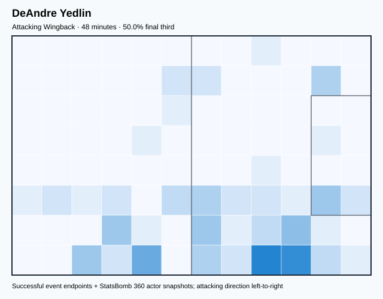
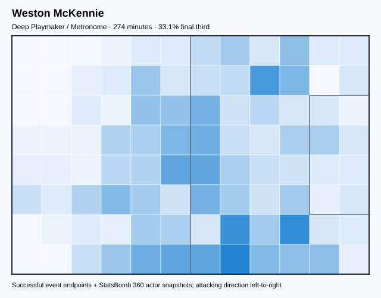
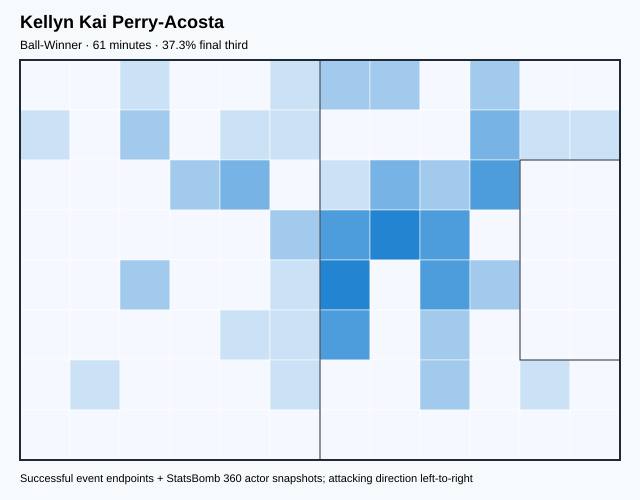
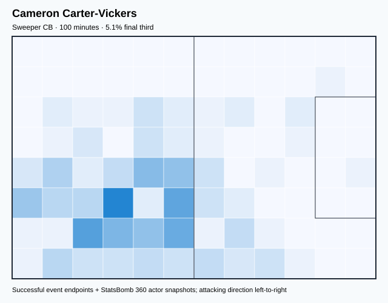
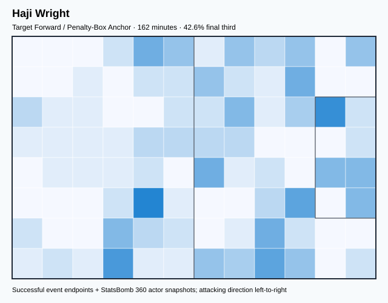
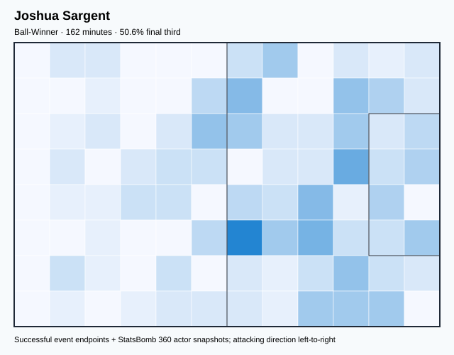
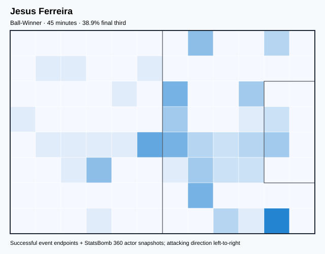
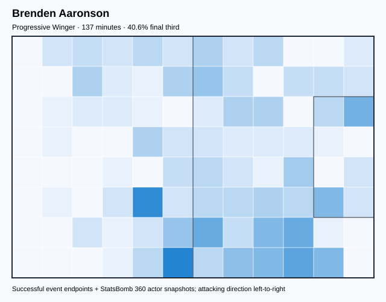
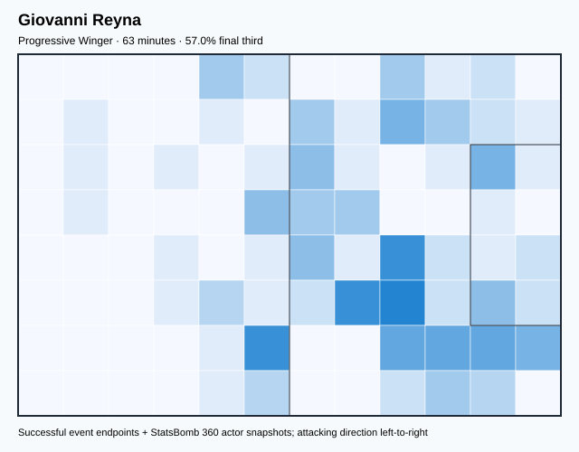

# USA — V4 Player Evaluation Collection

<!-- V5_CANONICAL_NOTICE -->
> **Historical V4 player-rating packet.** Player ratings, ranks, role-challenger decisions, and rating uncertainty below are superseded by `results/reports/player_rankings.csv`, `results/reports/player_profiles/`, and `results/reports/model_summary.md`. Possession, tactical, and match-bootstrap material remains a historical V4 result.

- Included eligible players: 18
- Rankings use the role-aware, development-gated VAEP/xT/xD model.
- Heatmaps combine successful on-ball endpoints and SB360 actor snapshots.

---

<!-- PLAYER_REPORT 1: 3377_starter_report.md -->

# Timothy Weah — Starter Report

- Team: United States (USA)
- Position: Right Wing
- Functional role: Ball-Winner
- VAEP offense per 90: 0.4424
- VAEP defense per 90: 0.0274
- VAEP total per 90: 0.4699
- VAEP per touch: 0.00443
- Spatial xT per 90: 0.0182
- Final-third spatial share: 52.7%
- Unified final player rating: 0.2028
- Team rank: #6

## Physical profile

| Metric | Score |
|---|---:|
| Aerial dominance | 0.200 |
| Pressing intensity per 90 | 7.36 |
| Recovery index per 90 | 3.68 |

## Top chemistry partners

- Tyler Adams — synergy 0.623, 318 shared minutes
- Sergino Dest — synergy 0.592, 299 shared minutes
- Yunus Dimoara Musah — synergy 0.566, 305 shared minutes

## Tactical recommendations

- Use a compact pressing trigger rather than sustained solo pressure.
- Use recovery capacity to support higher attacking positions.

_The heatmap combines successful event endpoints with StatsBomb 360 actor
snapshots. StatsBomb 360 is freeze-frame context, not continuous player
tracking. Ratings include eligible outfield players from 45 minutes and
goalkeepers from 90 minutes; ranking status communicates sample reliability._

---

<!-- PLAYER_REPORT 2: 3658_starter_report.md -->

# DeAndre Yedlin — Starter Report

- Team: United States (USA)
- Position: Right Back
- Functional role: Attacking Wingback
- VAEP offense per 90: 0.1577
- VAEP defense per 90: 0.0068
- VAEP total per 90: 0.1645
- VAEP per touch: 0.00132
- Spatial xT per 90: 0.0300
- Final-third spatial share: 50.0%
- Unified final player rating: 0.0570
- Team rank: #12

## Physical profile

| Metric | Score |
|---|---:|
| Aerial dominance | 1.000 |
| Pressing intensity per 90 | 11.36 |
| Recovery index per 90 | 1.89 |

## Top chemistry partners

- Tyler Adams — synergy 0.155, 48 shared minutes
- Walker Zimmerman — synergy 0.153, 48 shared minutes
- Brenden Aaronson — synergy 0.152, 48 shared minutes

## Tactical recommendations

- Lead the first pressing trigger and protect the inside passing lane.
- Target this player on direct restarts and back-post deliveries.
- Pair with a faster recovery defender after aggressive rotations.

_The heatmap combines successful event endpoints with StatsBomb 360 actor
snapshots. StatsBomb 360 is freeze-frame context, not continuous player
tracking. Ratings include eligible outfield players from 45 minutes and
goalkeepers from 90 minutes; ranking status communicates sample reliability._

---

<!-- PLAYER_REPORT 3: 4614_starter_report.md -->

# Antonee Robinson — Starter Report

- Team: United States (USA)
- Position: Left Back
- Functional role: Attacking Wingback
- VAEP offense per 90: 0.2306
- VAEP defense per 90: -0.0329
- VAEP total per 90: 0.1977
- VAEP per touch: 0.00134
- Spatial xT per 90: 0.0845
- Final-third spatial share: 32.7%
- Unified final player rating: 0.0825
- Team rank: #10

## Physical profile

| Metric | Score |
|---|---:|
| Aerial dominance | 0.250 |
| Pressing intensity per 90 | 14.45 |
| Recovery index per 90 | 7.22 |

## Top chemistry partners

- Matthew Charles Turner — synergy 0.735, 386 shared minutes
- Tim Ream — synergy 0.728, 386 shared minutes
- Tyler Adams — synergy 0.705, 386 shared minutes

## Tactical recommendations

- Lead the first pressing trigger and protect the inside passing lane.
- Use recovery capacity to support higher attacking positions.

_The heatmap combines successful event endpoints with StatsBomb 360 actor
snapshots. StatsBomb 360 is freeze-frame context, not continuous player
tracking. Ratings include eligible outfield players from 45 minutes and
goalkeepers from 90 minutes; ranking status communicates sample reliability._

---

<!-- PLAYER_REPORT 4: 8246_starter_report.md -->

# Christian Pulisic — Starter Report

- Team: United States (USA)
- Position: Left Wing
- Functional role: Progressive Winger
- VAEP offense per 90: 0.5007
- VAEP defense per 90: 0.0284
- VAEP total per 90: 0.5291
- VAEP per touch: 0.00394
- Spatial xT per 90: 0.1139
- Final-third spatial share: 50.9%
- Unified final player rating: 0.2245
- Team rank: #4

## Physical profile

| Metric | Score |
|---|---:|
| Aerial dominance | 0.400 |
| Pressing intensity per 90 | 11.77 |
| Recovery index per 90 | 4.55 |

## Top chemistry partners

- Tyler Adams — synergy 0.661, 336 shared minutes
- Yunus Dimoara Musah — synergy 0.646, 310 shared minutes
- Antonee Robinson — synergy 0.600, 331 shared minutes

## Tactical recommendations

- Lead the first pressing trigger and protect the inside passing lane.
- Use recovery capacity to support higher attacking positions.

_The heatmap combines successful event endpoints with StatsBomb 360 actor
snapshots. StatsBomb 360 is freeze-frame context, not continuous player
tracking. Ratings include eligible outfield players from 45 minutes and
goalkeepers from 90 minutes; ranking status communicates sample reliability._

---

<!-- PLAYER_REPORT 5: 8526_starter_report.md -->

# Weston McKennie — Starter Report

- Team: United States (USA)
- Position: Right Midfield
- Functional role: Deep Playmaker / Metronome
- VAEP offense per 90: 0.2605
- VAEP defense per 90: -0.0374
- VAEP total per 90: 0.2231
- VAEP per touch: 0.00156
- Spatial xT per 90: 0.0723
- Final-third spatial share: 33.1%
- Unified final player rating: 0.1150
- Team rank: #8

## Physical profile

| Metric | Score |
|---|---:|
| Aerial dominance | 0.625 |
| Pressing intensity per 90 | 13.49 |
| Recovery index per 90 | 4.94 |

## Top chemistry partners

- Tyler Adams — synergy 0.617, 274 shared minutes
- Tim Ream — synergy 0.587, 274 shared minutes
- Yunus Dimoara Musah — synergy 0.568, 274 shared minutes

## Tactical recommendations

- Lead the first pressing trigger and protect the inside passing lane.
- Target this player on direct restarts and back-post deliveries.
- Use recovery capacity to support higher attacking positions.

_The heatmap combines successful event endpoints with StatsBomb 360 actor
snapshots. StatsBomb 360 is freeze-frame context, not continuous player
tracking. Ratings include eligible outfield players from 45 minutes and
goalkeepers from 90 minutes; ranking status communicates sample reliability._

---

<!-- PLAYER_REPORT 6: 12352_starter_report.md -->

# Matthew Charles Turner — Starter Report

- Team: United States (USA)
- Position: Goalkeeper
- Functional role: Goalkeeper
- VAEP offense per 90: -0.0332
- VAEP defense per 90: -0.0899
- VAEP total per 90: -0.1232
- VAEP per touch: -0.00199
- Spatial xT per 90: 0.0028
- Final-third spatial share: 1.6%
- Unified final player rating: -0.0614
- Team rank: #18

## Physical profile

| Metric | Score |
|---|---:|
| Aerial dominance | 0.000 |
| Pressing intensity per 90 | 0.00 |
| Recovery index per 90 | 3.91 |

## Top chemistry partners

- Tim Ream — synergy 0.756, 391 shared minutes
- Antonee Robinson — synergy 0.735, 386 shared minutes
- Tyler Adams — synergy 0.733, 391 shared minutes

## Tactical recommendations

- Use a compact pressing trigger rather than sustained solo pressure.
- Avoid isolating this player in high-volume aerial matchups.
- Use recovery capacity to support higher attacking positions.

_The heatmap combines successful event endpoints with StatsBomb 360 actor
snapshots. StatsBomb 360 is freeze-frame context, not continuous player
tracking. Ratings include eligible outfield players from 45 minutes and
goalkeepers from 90 minutes; ranking status communicates sample reliability._

---

<!-- PLAYER_REPORT 7: 12524_starter_report.md -->

# Walker Zimmerman — Starter Report

- Team: United States (USA)
- Position: Right Center Back
- Functional role: Ball-Playing Centre-Back
- VAEP offense per 90: 0.0058
- VAEP defense per 90: -0.0929
- VAEP total per 90: -0.0871
- VAEP per touch: -0.00049
- Spatial xT per 90: 0.0039
- Final-third spatial share: 3.2%
- Unified final player rating: -0.0229
- Team rank: #17

## Physical profile

| Metric | Score |
|---|---:|
| Aerial dominance | 0.529 |
| Pressing intensity per 90 | 6.39 |
| Recovery index per 90 | 1.74 |

## Top chemistry partners

- Tim Ream — synergy 0.680, 310 shared minutes
- Matthew Charles Turner — synergy 0.674, 310 shared minutes
- Tyler Adams — synergy 0.661, 310 shared minutes

## Tactical recommendations

- Use a compact pressing trigger rather than sustained solo pressure.
- Pair with a faster recovery defender after aggressive rotations.

_The heatmap combines successful event endpoints with StatsBomb 360 actor
snapshots. StatsBomb 360 is freeze-frame context, not continuous player
tracking. Ratings include eligible outfield players from 45 minutes and
goalkeepers from 90 minutes; ranking status communicates sample reliability._

---

<!-- PLAYER_REPORT 8: 12751_starter_report.md -->

# Tyler Adams — Starter Report

- Team: United States (USA)
- Position: Center Defensive Midfield
- Functional role: Holding / Controlling Midfielder
- VAEP offense per 90: 0.0188
- VAEP defense per 90: -0.0441
- VAEP total per 90: -0.0253
- VAEP per touch: -0.00016
- Spatial xT per 90: 0.0347
- Final-third spatial share: 15.7%
- Unified final player rating: 0.0089
- Team rank: #14

## Physical profile

| Metric | Score |
|---|---:|
| Aerial dominance | 0.600 |
| Pressing intensity per 90 | 20.48 |
| Recovery index per 90 | 6.21 |

## Top chemistry partners

- Matthew Charles Turner — synergy 0.733, 391 shared minutes
- Tim Ream — synergy 0.723, 391 shared minutes
- Antonee Robinson — synergy 0.705, 386 shared minutes

## Tactical recommendations

- Lead the first pressing trigger and protect the inside passing lane.
- Target this player on direct restarts and back-post deliveries.
- Use recovery capacity to support higher attacking positions.

_The heatmap combines successful event endpoints with StatsBomb 360 actor
snapshots. StatsBomb 360 is freeze-frame context, not continuous player
tracking. Ratings include eligible outfield players from 45 minutes and
goalkeepers from 90 minutes; ranking status communicates sample reliability._

---

<!-- PLAYER_REPORT 9: 13035_starter_report.md -->

# Kellyn Kai Perry-Acosta — Starter Report

- Team: United States (USA)
- Position: Left Defensive Midfield
- Functional role: Ball-Winner
- VAEP offense per 90: 0.0765
- VAEP defense per 90: -0.0136
- VAEP total per 90: 0.0629
- VAEP per touch: 0.00110
- Spatial xT per 90: 0.0177
- Final-third spatial share: 37.3%
- Unified final player rating: 0.0233
- Team rank: #13

## Physical profile

| Metric | Score |
|---|---:|
| Aerial dominance | 1.000 |
| Pressing intensity per 90 | 16.12 |
| Recovery index per 90 | 1.47 |

## Top chemistry partners

- Brenden Aaronson — synergy 0.187, 61 shared minutes
- Matthew Charles Turner — synergy 0.180, 61 shared minutes
- Antonee Robinson — synergy 0.179, 61 shared minutes

## Tactical recommendations

- Lead the first pressing trigger and protect the inside passing lane.
- Target this player on direct restarts and back-post deliveries.
- Pair with a faster recovery defender after aggressive rotations.

_The heatmap combines successful event endpoints with StatsBomb 360 actor
snapshots. StatsBomb 360 is freeze-frame context, not continuous player
tracking. Ratings include eligible outfield players from 45 minutes and
goalkeepers from 90 minutes; ranking status communicates sample reliability._

---

<!-- PLAYER_REPORT 10: 15971_starter_report.md -->

# Cameron Carter-Vickers — Starter Report

- Team: United States (USA)
- Position: Right Center Back
- Functional role: Sweeper CB
- VAEP offense per 90: -0.0213
- VAEP defense per 90: -0.0171
- VAEP total per 90: -0.0384
- VAEP per touch: -0.00031
- Spatial xT per 90: 0.0077
- Final-third spatial share: 5.1%
- Unified final player rating: -0.0107
- Team rank: #16

## Physical profile

| Metric | Score |
|---|---:|
| Aerial dominance | 0.455 |
| Pressing intensity per 90 | 6.31 |
| Recovery index per 90 | 1.80 |

## Top chemistry partners

- Tim Ream — synergy 0.303, 100 shared minutes
- Matthew Charles Turner — synergy 0.298, 100 shared minutes
- Tyler Adams — synergy 0.290, 100 shared minutes

## Tactical recommendations

- Use a compact pressing trigger rather than sustained solo pressure.
- Pair with a faster recovery defender after aggressive rotations.

_The heatmap combines successful event endpoints with StatsBomb 360 actor
snapshots. StatsBomb 360 is freeze-frame context, not continuous player
tracking. Ratings include eligible outfield players from 45 minutes and
goalkeepers from 90 minutes; ranking status communicates sample reliability._

---

<!-- PLAYER_REPORT 11: 18242_starter_report.md -->

# Tim Ream — Starter Report

- Team: United States (USA)
- Position: Left Center Back
- Functional role: Ball-Playing Centre-Back
- VAEP offense per 90: 0.0564
- VAEP defense per 90: -0.0165
- VAEP total per 90: 0.0398
- VAEP per touch: 0.00025
- Spatial xT per 90: 0.0030
- Final-third spatial share: 3.2%
- Unified final player rating: 0.0047
- Team rank: #15

## Physical profile

| Metric | Score |
|---|---:|
| Aerial dominance | 0.444 |
| Pressing intensity per 90 | 9.20 |
| Recovery index per 90 | 3.45 |

## Top chemistry partners

- Matthew Charles Turner — synergy 0.756, 391 shared minutes
- Antonee Robinson — synergy 0.728, 386 shared minutes
- Tyler Adams — synergy 0.723, 391 shared minutes

## Tactical recommendations

- Use a compact pressing trigger rather than sustained solo pressure.
- Use recovery capacity to support higher attacking positions.

_The heatmap combines successful event endpoints with StatsBomb 360 actor
snapshots. StatsBomb 360 is freeze-frame context, not continuous player
tracking. Ratings include eligible outfield players from 45 minutes and
goalkeepers from 90 minutes; ranking status communicates sample reliability._

---

<!-- PLAYER_REPORT 12: 21881_starter_report.md -->

# Sergino Dest — Starter Report

- Team: United States (USA)
- Position: Right Back
- Functional role: Attacking Wingback
- VAEP offense per 90: 0.1442
- VAEP defense per 90: -0.0369
- VAEP total per 90: 0.1073
- VAEP per touch: 0.00060
- Spatial xT per 90: 0.0985
- Final-third spatial share: 31.2%
- Unified final player rating: 0.0617
- Team rank: #11

## Physical profile

| Metric | Score |
|---|---:|
| Aerial dominance | 0.286 |
| Pressing intensity per 90 | 13.46 |
| Recovery index per 90 | 4.39 |

## Top chemistry partners

- Tyler Adams — synergy 0.672, 308 shared minutes
- Matthew Charles Turner — synergy 0.665, 308 shared minutes
- Yunus Dimoara Musah — synergy 0.632, 308 shared minutes

## Tactical recommendations

- Lead the first pressing trigger and protect the inside passing lane.
- Use recovery capacity to support higher attacking positions.

_The heatmap combines successful event endpoints with StatsBomb 360 actor
snapshots. StatsBomb 360 is freeze-frame context, not continuous player
tracking. Ratings include eligible outfield players from 45 minutes and
goalkeepers from 90 minutes; ranking status communicates sample reliability._

---

<!-- PLAYER_REPORT 13: 22008_starter_report.md -->

# Haji Wright — Starter Report

- Team: United States (USA)
- Position: Left Center Forward
- Functional role: Target Forward / Penalty-Box Anchor
- VAEP offense per 90: 0.4382
- VAEP defense per 90: 0.0552
- VAEP total per 90: 0.4934
- VAEP per touch: 0.00672
- Spatial xT per 90: 0.0273
- Final-third spatial share: 42.6%
- Unified final player rating: 0.2431
- Team rank: #2

## Physical profile

| Metric | Score |
|---|---:|
| Aerial dominance | 0.381 |
| Pressing intensity per 90 | 13.90 |
| Recovery index per 90 | 2.78 |

## Top chemistry partners

- Tyler Adams — synergy 0.406, 162 shared minutes
- Tim Ream — synergy 0.399, 162 shared minutes
- Walker Zimmerman — synergy 0.355, 158 shared minutes

## Tactical recommendations

- Lead the first pressing trigger and protect the inside passing lane.
- Use recovery capacity to support higher attacking positions.

_The heatmap combines successful event endpoints with StatsBomb 360 actor
snapshots. StatsBomb 360 is freeze-frame context, not continuous player
tracking. Ratings include eligible outfield players from 45 minutes and
goalkeepers from 90 minutes; ranking status communicates sample reliability._

---

<!-- PLAYER_REPORT 14: 22168_starter_report.md -->

# Joshua Sargent — Starter Report

- Team: United States (USA)
- Position: Center Forward
- Functional role: Ball-Winner
- VAEP offense per 90: 0.5680
- VAEP defense per 90: 0.0170
- VAEP total per 90: 0.5850
- VAEP per touch: 0.00728
- Spatial xT per 90: -0.0037
- Final-third spatial share: 50.6%
- Unified final player rating: 0.2537
- Team rank: #1

## Physical profile

| Metric | Score |
|---|---:|
| Aerial dominance | 0.125 |
| Pressing intensity per 90 | 14.96 |
| Recovery index per 90 | 1.66 |

## Top chemistry partners

- Tyler Adams — synergy 0.433, 162 shared minutes
- Yunus Dimoara Musah — synergy 0.430, 162 shared minutes
- Tim Ream — synergy 0.387, 162 shared minutes

## Tactical recommendations

- Lead the first pressing trigger and protect the inside passing lane.
- Avoid isolating this player in high-volume aerial matchups.
- Pair with a faster recovery defender after aggressive rotations.

_The heatmap combines successful event endpoints with StatsBomb 360 actor
snapshots. StatsBomb 360 is freeze-frame context, not continuous player
tracking. Ratings include eligible outfield players from 45 minutes and
goalkeepers from 90 minutes; ranking status communicates sample reliability._

---

<!-- PLAYER_REPORT 15: 22433_starter_report.md -->

# Jesus Ferreira — Starter Report

- Team: United States (USA)
- Position: Center Forward
- Functional role: Ball-Winner
- VAEP offense per 90: 0.2535
- VAEP defense per 90: 0.0025
- VAEP total per 90: 0.2559
- VAEP per touch: 0.00210
- Spatial xT per 90: -0.0382
- Final-third spatial share: 38.9%
- Unified final player rating: 0.2284
- Team rank: #3

## Physical profile

| Metric | Score |
|---|---:|
| Aerial dominance | 0.000 |
| Pressing intensity per 90 | 14.00 |
| Recovery index per 90 | 4.00 |

## Top chemistry partners

- Timothy Weah — synergy 0.142, 45 shared minutes
- Tim Ream — synergy 0.141, 45 shared minutes
- Sergino Dest — synergy 0.136, 45 shared minutes

## Tactical recommendations

- Lead the first pressing trigger and protect the inside passing lane.
- Avoid isolating this player in high-volume aerial matchups.
- Use recovery capacity to support higher attacking positions.

_The heatmap combines successful event endpoints with StatsBomb 360 actor
snapshots. StatsBomb 360 is freeze-frame context, not continuous player
tracking. Ratings include eligible outfield players from 45 minutes and
goalkeepers from 90 minutes; ranking status communicates sample reliability._

---

<!-- PLAYER_REPORT 16: 24243_starter_report.md -->

# Brenden Aaronson — Starter Report

- Team: United States (USA)
- Position: Left Wing
- Functional role: Progressive Winger
- VAEP offense per 90: 0.6151
- VAEP defense per 90: 0.0469
- VAEP total per 90: 0.6621
- VAEP per touch: 0.00521
- Spatial xT per 90: 0.0633
- Final-third spatial share: 40.6%
- Unified final player rating: 0.2161
- Team rank: #5

## Physical profile

| Metric | Score |
|---|---:|
| Aerial dominance | 0.500 |
| Pressing intensity per 90 | 22.26 |
| Recovery index per 90 | 3.93 |

## Top chemistry partners

- Tyler Adams — synergy 0.373, 137 shared minutes
- Tim Ream — synergy 0.350, 137 shared minutes
- Matthew Charles Turner — synergy 0.320, 137 shared minutes

## Tactical recommendations

- Lead the first pressing trigger and protect the inside passing lane.
- Use recovery capacity to support higher attacking positions.

_The heatmap combines successful event endpoints with StatsBomb 360 actor
snapshots. StatsBomb 360 is freeze-frame context, not continuous player
tracking. Ratings include eligible outfield players from 45 minutes and
goalkeepers from 90 minutes; ranking status communicates sample reliability._

---

<!-- PLAYER_REPORT 17: 34339_starter_report.md -->

# Giovanni Reyna — Starter Report

- Team: United States (USA)
- Position: Right Wing
- Functional role: Progressive Winger
- VAEP offense per 90: 0.3542
- VAEP defense per 90: 0.0152
- VAEP total per 90: 0.3694
- VAEP per touch: 0.00222
- Spatial xT per 90: 0.1480
- Final-third spatial share: 57.0%
- Unified final player rating: 0.1813
- Team rank: #7

## Physical profile

| Metric | Score |
|---|---:|
| Aerial dominance | 1.000 |
| Pressing intensity per 90 | 8.52 |
| Recovery index per 90 | 4.26 |

## Top chemistry partners

- Tyler Adams — synergy 0.202, 63 shared minutes
- Walker Zimmerman — synergy 0.200, 63 shared minutes
- Tim Ream — synergy 0.173, 63 shared minutes

## Tactical recommendations

- Use a compact pressing trigger rather than sustained solo pressure.
- Target this player on direct restarts and back-post deliveries.
- Use recovery capacity to support higher attacking positions.

_The heatmap combines successful event endpoints with StatsBomb 360 actor
snapshots. StatsBomb 360 is freeze-frame context, not continuous player
tracking. Ratings include eligible outfield players from 45 minutes and
goalkeepers from 90 minutes; ranking status communicates sample reliability._

---

<!-- PLAYER_REPORT 18: 38792_starter_report.md -->

# Yunus Dimoara Musah — Starter Report

- Team: United States (USA)
- Position: Right Center Midfield
- Functional role: Box-to-Box / Engine Midfielder
- VAEP offense per 90: 0.1440
- VAEP defense per 90: -0.0261
- VAEP total per 90: 0.1179
- VAEP per touch: 0.00087
- Spatial xT per 90: 0.0460
- Final-third spatial share: 31.3%
- Unified final player rating: 0.0903
- Team rank: #9

## Physical profile

| Metric | Score |
|---|---:|
| Aerial dominance | 0.250 |
| Pressing intensity per 90 | 19.24 |
| Recovery index per 90 | 4.44 |

## Top chemistry partners

- Tim Ream — synergy 0.694, 365 shared minutes
- Tyler Adams — synergy 0.691, 365 shared minutes
- Christian Pulisic — synergy 0.646, 310 shared minutes

## Tactical recommendations

- Lead the first pressing trigger and protect the inside passing lane.
- Use recovery capacity to support higher attacking positions.

_The heatmap combines successful event endpoints with StatsBomb 360 actor
snapshots. StatsBomb 360 is freeze-frame context, not continuous player
tracking. Ratings include eligible outfield players from 45 minutes and
goalkeepers from 90 minutes; ranking status communicates sample reliability._
