# WAL — V4 Player Evaluation Collection

<!-- V5_CANONICAL_NOTICE -->
> **Historical V4 player-rating packet.** Player ratings, ranks, role-challenger decisions, and rating uncertainty below are superseded by `results/reports/player_rankings.csv`, `results/reports/player_profiles/`, and `results/reports/model_summary.md`. Possession, tactical, and match-bootstrap material remains a historical V4 result.

- Included eligible players: 15
- Rankings use the role-aware, development-gated VAEP/xT/xD model.
- Heatmaps combine successful on-ball endpoints and SB360 actor snapshots.

---

<!-- PLAYER_REPORT 1: 3086_starter_report.md -->

# Ben Davies — Starter Report

- Team: Wales (WAL)
- Position: Left Center Back
- Functional role: Wide Creator
- VAEP offense per 90: 0.0491
- VAEP defense per 90: -0.0403
- VAEP total per 90: 0.0088
- VAEP per touch: 0.00007
- Spatial xT per 90: 0.0226
- Final-third spatial share: 8.1%
- Unified final player rating: -0.0025
- Team rank: #11

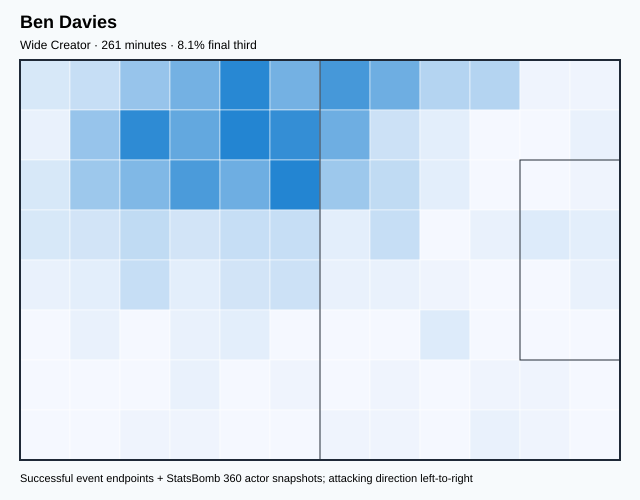

## Physical profile

| Metric | Score |
|---|---:|
| Aerial dominance | 0.733 |
| Pressing intensity per 90 | 9.30 |
| Recovery index per 90 | 6.20 |

## Top chemistry partners

- Joe Rodon — synergy 0.615, 261 shared minutes
- Chris Mepham — synergy 0.598, 261 shared minutes
- Ethan Ampadu — synergy 0.552, 230 shared minutes

## Tactical recommendations

- Use a compact pressing trigger rather than sustained solo pressure.
- Target this player on direct restarts and back-post deliveries.
- Use recovery capacity to support higher attacking positions.

_The heatmap combines successful event endpoints with StatsBomb 360 actor
snapshots. StatsBomb 360 is freeze-frame context, not continuous player
tracking. Ratings include eligible outfield players from 45 minutes and
goalkeepers from 90 minutes; ranking status communicates sample reliability._

---

<!-- PLAYER_REPORT 2: 3488_starter_report.md -->

# Wayne Hennessey — Starter Report

- Team: Wales (WAL)
- Position: Goalkeeper
- Functional role: Goalkeeper
- VAEP offense per 90: -0.0259
- VAEP defense per 90: -0.0947
- VAEP total per 90: -0.1207
- VAEP per touch: -0.00211
- Spatial xT per 90: 0.0031
- Final-third spatial share: 1.4%
- Unified final player rating: -0.0609
- Team rank: #14

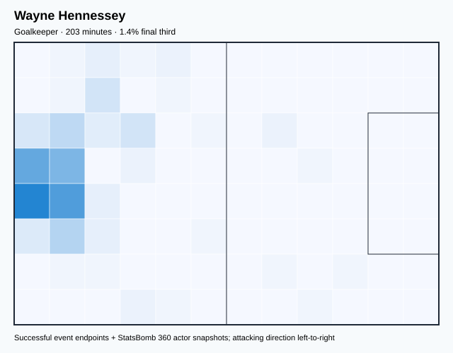

## Physical profile

| Metric | Score |
|---|---:|
| Aerial dominance | 0.000 |
| Pressing intensity per 90 | 0.44 |
| Recovery index per 90 | 5.33 |

## Top chemistry partners

- Joe Rodon — synergy 0.517, 203 shared minutes
- Chris Mepham — synergy 0.510, 203 shared minutes
- Ben Davies — synergy 0.463, 203 shared minutes

## Tactical recommendations

- Use a compact pressing trigger rather than sustained solo pressure.
- Avoid isolating this player in high-volume aerial matchups.
- Use recovery capacity to support higher attacking positions.

_The heatmap combines successful event endpoints with StatsBomb 360 actor
snapshots. StatsBomb 360 is freeze-frame context, not continuous player
tracking. Ratings include eligible outfield players from 45 minutes and
goalkeepers from 90 minutes; ranking status communicates sample reliability._

---

<!-- PLAYER_REPORT 3: 3517_starter_report.md -->

# Aaron Ramsey — Starter Report

- Team: Wales (WAL)
- Position: Right Center Midfield
- Functional role: Ball-Winner
- VAEP offense per 90: 0.2756
- VAEP defense per 90: -0.0131
- VAEP total per 90: 0.2625
- VAEP per touch: 0.00225
- Spatial xT per 90: -0.0034
- Final-third spatial share: 25.5%
- Unified final player rating: 0.1169
- Team rank: #5

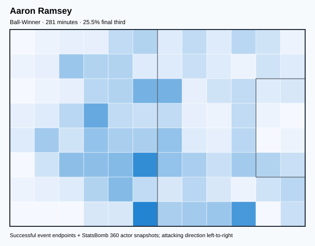

## Physical profile

| Metric | Score |
|---|---:|
| Aerial dominance | 0.250 |
| Pressing intensity per 90 | 18.23 |
| Recovery index per 90 | 4.16 |

## Top chemistry partners

- Chris Mepham — synergy 0.581, 281 shared minutes
- Ethan Ampadu — synergy 0.558, 266 shared minutes
- Joe Rodon — synergy 0.552, 281 shared minutes

## Tactical recommendations

- Lead the first pressing trigger and protect the inside passing lane.
- Use recovery capacity to support higher attacking positions.

_The heatmap combines successful event endpoints with StatsBomb 360 actor
snapshots. StatsBomb 360 is freeze-frame context, not continuous player
tracking. Ratings include eligible outfield players from 45 minutes and
goalkeepers from 90 minutes; ranking status communicates sample reliability._

---

<!-- PLAYER_REPORT 4: 3853_starter_report.md -->

# Kieffer Roberto Francisco Moore — Starter Report

- Team: Wales (WAL)
- Position: Left Center Forward
- Functional role: Target Forward / Penalty-Box Anchor
- VAEP offense per 90: 0.4035
- VAEP defense per 90: 0.0527
- VAEP total per 90: 0.4562
- VAEP per touch: 0.00496
- Spatial xT per 90: -0.0082
- Final-third spatial share: 47.4%
- Unified final player rating: 0.2352
- Team rank: #1

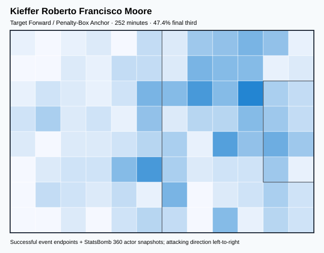

## Physical profile

| Metric | Score |
|---|---:|
| Aerial dominance | 0.545 |
| Pressing intensity per 90 | 21.45 |
| Recovery index per 90 | 1.07 |

## Top chemistry partners

- Joe Rodon — synergy 0.433, 252 shared minutes
- Aaron Ramsey — synergy 0.428, 236 shared minutes
- Neco Williams — synergy 0.377, 171 shared minutes

## Tactical recommendations

- Lead the first pressing trigger and protect the inside passing lane.
- Pair with a faster recovery defender after aggressive rotations.

_The heatmap combines successful event endpoints with StatsBomb 360 actor
snapshots. StatsBomb 360 is freeze-frame context, not continuous player
tracking. Ratings include eligible outfield players from 45 minutes and
goalkeepers from 90 minutes; ranking status communicates sample reliability._

---

<!-- PLAYER_REPORT 5: 4767_starter_report.md -->

# Chris Mepham — Starter Report

- Team: Wales (WAL)
- Position: Right Center Back
- Functional role: Sweeper CB
- VAEP offense per 90: 0.0468
- VAEP defense per 90: -0.0612
- VAEP total per 90: -0.0143
- VAEP per touch: -0.00011
- Spatial xT per 90: 0.0200
- Final-third spatial share: 7.8%
- Unified final player rating: -0.0068
- Team rank: #12

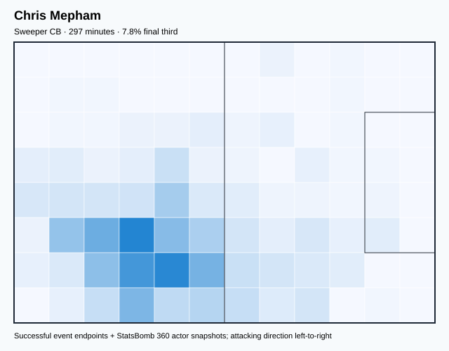

## Physical profile

| Metric | Score |
|---|---:|
| Aerial dominance | 0.889 |
| Pressing intensity per 90 | 10.01 |
| Recovery index per 90 | 2.12 |

## Top chemistry partners

- Joe Rodon — synergy 0.654, 297 shared minutes
- Ben Davies — synergy 0.598, 261 shared minutes
- Ethan Ampadu — synergy 0.591, 266 shared minutes

## Tactical recommendations

- Use a compact pressing trigger rather than sustained solo pressure.
- Target this player on direct restarts and back-post deliveries.
- Pair with a faster recovery defender after aggressive rotations.

_The heatmap combines successful event endpoints with StatsBomb 360 actor
snapshots. StatsBomb 360 is freeze-frame context, not continuous player
tracking. Ratings include eligible outfield players from 45 minutes and
goalkeepers from 90 minutes; ranking status communicates sample reliability._

---

<!-- PLAYER_REPORT 6: 4774_starter_report.md -->

# Connor Roberts — Starter Report

- Team: Wales (WAL)
- Position: Right Wing Back
- Functional role: Deep Playmaker
- VAEP offense per 90: 0.1173
- VAEP defense per 90: -0.0517
- VAEP total per 90: 0.0656
- VAEP per touch: 0.00050
- Spatial xT per 90: 0.0554
- Final-third spatial share: 29.9%
- Unified final player rating: 0.0505
- Team rank: #8

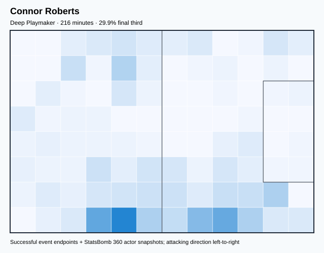

## Physical profile

| Metric | Score |
|---|---:|
| Aerial dominance | 0.000 |
| Pressing intensity per 90 | 6.26 |
| Recovery index per 90 | 2.92 |

## Top chemistry partners

- Chris Mepham — synergy 0.514, 216 shared minutes
- Joe Rodon — synergy 0.495, 216 shared minutes
- Ethan Ampadu — synergy 0.474, 210 shared minutes

## Tactical recommendations

- Use a compact pressing trigger rather than sustained solo pressure.
- Avoid isolating this player in high-volume aerial matchups.
- Use recovery capacity to support higher attacking positions.

_The heatmap combines successful event endpoints with StatsBomb 360 actor
snapshots. StatsBomb 360 is freeze-frame context, not continuous player
tracking. Ratings include eligible outfield players from 45 minutes and
goalkeepers from 90 minutes; ranking status communicates sample reliability._

---

<!-- PLAYER_REPORT 7: 4934_starter_report.md -->

# Ethan Ampadu — Starter Report

- Team: Wales (WAL)
- Position: Center Defensive Midfield
- Functional role: Holding Anchor
- VAEP offense per 90: 0.0092
- VAEP defense per 90: -0.0525
- VAEP total per 90: -0.0433
- VAEP per touch: -0.00035
- Spatial xT per 90: 0.0406
- Final-third spatial share: 17.0%
- Unified final player rating: 0.0086
- Team rank: #10

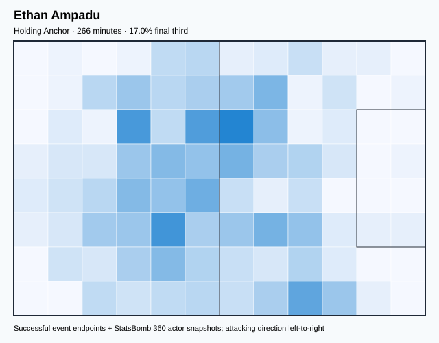

## Physical profile

| Metric | Score |
|---|---:|
| Aerial dominance | 0.333 |
| Pressing intensity per 90 | 10.17 |
| Recovery index per 90 | 4.41 |

## Top chemistry partners

- Joe Rodon — synergy 0.614, 266 shared minutes
- Chris Mepham — synergy 0.591, 266 shared minutes
- Aaron Ramsey — synergy 0.558, 266 shared minutes

## Tactical recommendations

- Use a compact pressing trigger rather than sustained solo pressure.
- Use recovery capacity to support higher attacking positions.

_The heatmap combines successful event endpoints with StatsBomb 360 actor
snapshots. StatsBomb 360 is freeze-frame context, not continuous player
tracking. Ratings include eligible outfield players from 45 minutes and
goalkeepers from 90 minutes; ranking status communicates sample reliability._

---

<!-- PLAYER_REPORT 8: 6399_starter_report.md -->

# Gareth Frank Bale — Starter Report

- Team: Wales (WAL)
- Position: Right Center Forward
- Functional role: Target Forward
- VAEP offense per 90: 0.2135
- VAEP defense per 90: 0.0416
- VAEP total per 90: 0.2551
- VAEP per touch: 0.00355
- Spatial xT per 90: 0.0382
- Final-third spatial share: 37.1%
- Unified final player rating: 0.2026
- Team rank: #2

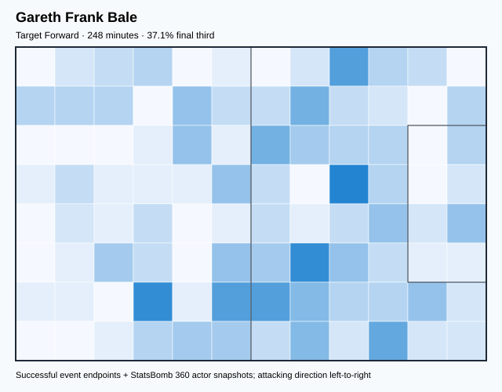

## Physical profile

| Metric | Score |
|---|---:|
| Aerial dominance | 0.333 |
| Pressing intensity per 90 | 6.54 |
| Recovery index per 90 | 1.82 |

## Top chemistry partners

- Chris Mepham — synergy 0.497, 248 shared minutes
- Neco Williams — synergy 0.428, 216 shared minutes
- Aaron Ramsey — synergy 0.426, 232 shared minutes

## Tactical recommendations

- Use a compact pressing trigger rather than sustained solo pressure.
- Pair with a faster recovery defender after aggressive rotations.

_The heatmap combines successful event endpoints with StatsBomb 360 actor
snapshots. StatsBomb 360 is freeze-frame context, not continuous player
tracking. Ratings include eligible outfield players from 45 minutes and
goalkeepers from 90 minutes; ranking status communicates sample reliability._

---

<!-- PLAYER_REPORT 9: 9540_starter_report.md -->

# Harry Wilson — Starter Report

- Team: Wales (WAL)
- Position: Left Center Midfield
- Functional role: Wide Creator
- VAEP offense per 90: 0.1168
- VAEP defense per 90: -0.0302
- VAEP total per 90: 0.0865
- VAEP per touch: 0.00091
- Spatial xT per 90: 0.0567
- Final-third spatial share: 26.0%
- Unified final player rating: 0.0936
- Team rank: #6

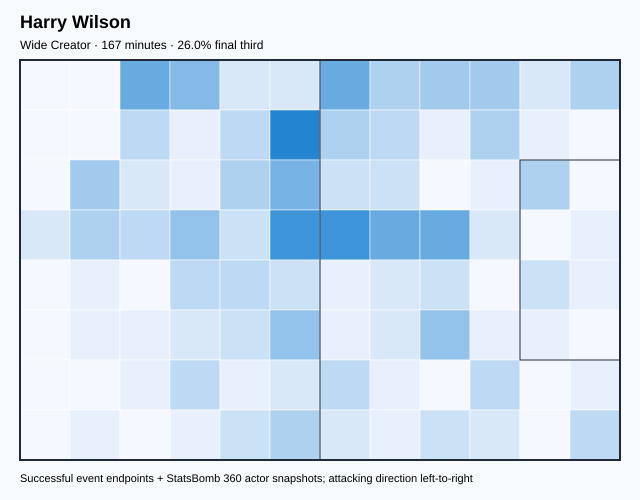

## Physical profile

| Metric | Score |
|---|---:|
| Aerial dominance | 0.667 |
| Pressing intensity per 90 | 9.69 |
| Recovery index per 90 | 2.69 |

## Top chemistry partners

- Joe Rodon — synergy 0.445, 167 shared minutes
- Connor Roberts — synergy 0.445, 167 shared minutes
- Chris Mepham — synergy 0.413, 167 shared minutes

## Tactical recommendations

- Use a compact pressing trigger rather than sustained solo pressure.
- Target this player on direct restarts and back-post deliveries.
- Use recovery capacity to support higher attacking positions.

_The heatmap combines successful event endpoints with StatsBomb 360 actor
snapshots. StatsBomb 360 is freeze-frame context, not continuous player
tracking. Ratings include eligible outfield players from 45 minutes and
goalkeepers from 90 minutes; ranking status communicates sample reliability._

---

<!-- PLAYER_REPORT 10: 9914_starter_report.md -->

# Daniel Ward — Starter Report

- Team: Wales (WAL)
- Position: Goalkeeper
- Functional role: Goalkeeper
- VAEP offense per 90: -0.0277
- VAEP defense per 90: -0.2991
- VAEP total per 90: -0.3268
- VAEP per touch: -0.00509
- Spatial xT per 90: 0.0096
- Final-third spatial share: 1.7%
- Unified final player rating: -0.0811
- Team rank: #15

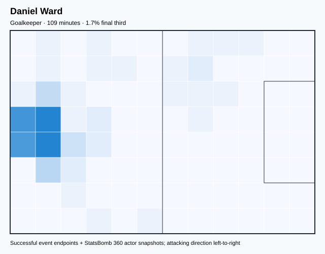

## Physical profile

| Metric | Score |
|---|---:|
| Aerial dominance | 0.000 |
| Pressing intensity per 90 | 0.00 |
| Recovery index per 90 | 2.47 |

## Top chemistry partners

- Chris Mepham — synergy 0.320, 109 shared minutes
- Joe Rodon — synergy 0.320, 109 shared minutes
- Joe Allen — synergy 0.274, 96 shared minutes

## Tactical recommendations

- Use a compact pressing trigger rather than sustained solo pressure.
- Avoid isolating this player in high-volume aerial matchups.
- Pair with a faster recovery defender after aggressive rotations.

_The heatmap combines successful event endpoints with StatsBomb 360 actor
snapshots. StatsBomb 360 is freeze-frame context, not continuous player
tracking. Ratings include eligible outfield players from 45 minutes and
goalkeepers from 90 minutes; ranking status communicates sample reliability._

---

<!-- PLAYER_REPORT 11: 10931_starter_report.md -->

# Joe Allen — Starter Report

- Team: Wales (WAL)
- Position: Right Defensive Midfield
- Functional role: Ball-Winner
- VAEP offense per 90: 0.0169
- VAEP defense per 90: -0.0163
- VAEP total per 90: 0.0005
- VAEP per touch: 0.00001
- Spatial xT per 90: 0.0016
- Final-third spatial share: 14.0%
- Unified final player rating: 0.0177
- Team rank: #9

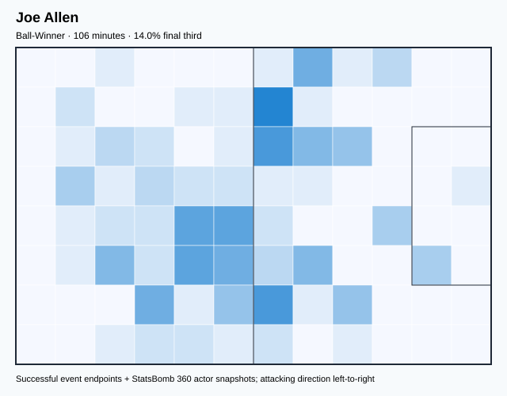

## Physical profile

| Metric | Score |
|---|---:|
| Aerial dominance | 0.000 |
| Pressing intensity per 90 | 10.23 |
| Recovery index per 90 | 5.11 |

## Top chemistry partners

- Joe Rodon — synergy 0.310, 106 shared minutes
- Chris Mepham — synergy 0.297, 106 shared minutes
- Daniel James — synergy 0.293, 102 shared minutes

## Tactical recommendations

- Use a compact pressing trigger rather than sustained solo pressure.
- Avoid isolating this player in high-volume aerial matchups.
- Use recovery capacity to support higher attacking positions.

_The heatmap combines successful event endpoints with StatsBomb 360 actor
snapshots. StatsBomb 360 is freeze-frame context, not continuous player
tracking. Ratings include eligible outfield players from 45 minutes and
goalkeepers from 90 minutes; ranking status communicates sample reliability._

---

<!-- PLAYER_REPORT 12: 11250_starter_report.md -->

# Joe Rodon — Starter Report

- Team: Wales (WAL)
- Position: Center Back
- Functional role: Sweeper CB
- VAEP offense per 90: 0.0072
- VAEP defense per 90: -0.0882
- VAEP total per 90: -0.0809
- VAEP per touch: -0.00063
- Spatial xT per 90: 0.0024
- Final-third spatial share: 1.9%
- Unified final player rating: -0.0215
- Team rank: #13

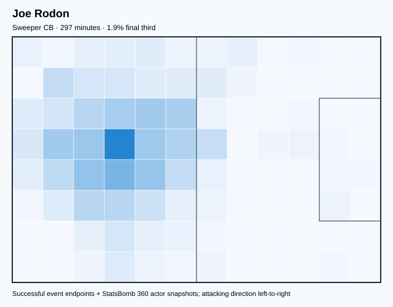

## Physical profile

| Metric | Score |
|---|---:|
| Aerial dominance | 0.538 |
| Pressing intensity per 90 | 7.89 |
| Recovery index per 90 | 1.52 |

## Top chemistry partners

- Chris Mepham — synergy 0.654, 297 shared minutes
- Ben Davies — synergy 0.615, 261 shared minutes
- Ethan Ampadu — synergy 0.614, 266 shared minutes

## Tactical recommendations

- Use a compact pressing trigger rather than sustained solo pressure.
- Pair with a faster recovery defender after aggressive rotations.

_The heatmap combines successful event endpoints with StatsBomb 360 actor
snapshots. StatsBomb 360 is freeze-frame context, not continuous player
tracking. Ratings include eligible outfield players from 45 minutes and
goalkeepers from 90 minutes; ranking status communicates sample reliability._

---

<!-- PLAYER_REPORT 13: 11252_starter_report.md -->

# Daniel James — Starter Report

- Team: Wales (WAL)
- Position: Left Wing
- Functional role: Ball-Winner
- VAEP offense per 90: 0.0608
- VAEP defense per 90: -0.0154
- VAEP total per 90: 0.0454
- VAEP per touch: 0.00063
- Spatial xT per 90: 0.0323
- Final-third spatial share: 25.1%
- Unified final player rating: 0.1368
- Team rank: #4

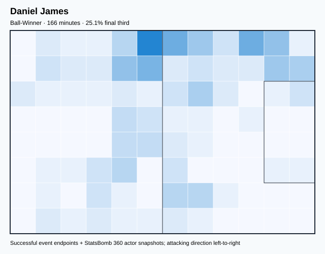

## Physical profile

| Metric | Score |
|---|---:|
| Aerial dominance | 0.000 |
| Pressing intensity per 90 | 12.97 |
| Recovery index per 90 | 2.16 |

## Top chemistry partners

- Aaron Ramsey — synergy 0.370, 151 shared minutes
- Chris Mepham — synergy 0.369, 166 shared minutes
- Joe Rodon — synergy 0.352, 166 shared minutes

## Tactical recommendations

- Lead the first pressing trigger and protect the inside passing lane.
- Avoid isolating this player in high-volume aerial matchups.
- Pair with a faster recovery defender after aggressive rotations.

_The heatmap combines successful event endpoints with StatsBomb 360 actor
snapshots. StatsBomb 360 is freeze-frame context, not continuous player
tracking. Ratings include eligible outfield players from 45 minutes and
goalkeepers from 90 minutes; ranking status communicates sample reliability._

---

<!-- PLAYER_REPORT 14: 29377_starter_report.md -->

# Brennan Johnson — Starter Report

- Team: Wales (WAL)
- Position: Right Wing
- Functional role: Ball-Winner
- VAEP offense per 90: 0.3228
- VAEP defense per 90: 0.1099
- VAEP total per 90: 0.4327
- VAEP per touch: 0.00651
- Spatial xT per 90: 0.0898
- Final-third spatial share: 58.2%
- Unified final player rating: 0.1889
- Team rank: #3

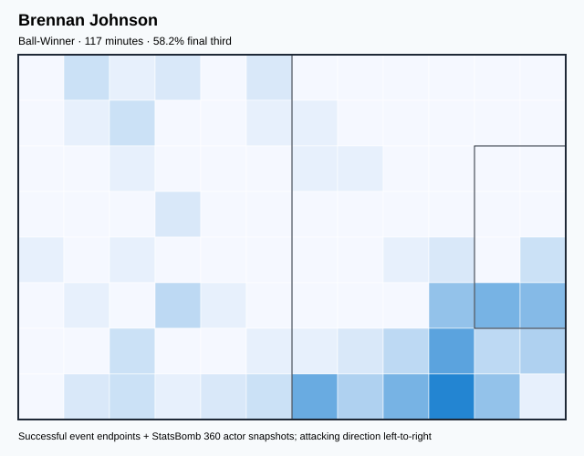

## Physical profile

| Metric | Score |
|---|---:|
| Aerial dominance | 0.000 |
| Pressing intensity per 90 | 9.27 |
| Recovery index per 90 | 5.41 |

## Top chemistry partners

- Chris Mepham — synergy 0.268, 117 shared minutes
- Joe Rodon — synergy 0.258, 117 shared minutes
- Ethan Ampadu — synergy 0.251, 85 shared minutes

## Tactical recommendations

- Use a compact pressing trigger rather than sustained solo pressure.
- Avoid isolating this player in high-volume aerial matchups.
- Use recovery capacity to support higher attacking positions.

_The heatmap combines successful event endpoints with StatsBomb 360 actor
snapshots. StatsBomb 360 is freeze-frame context, not continuous player
tracking. Ratings include eligible outfield players from 45 minutes and
goalkeepers from 90 minutes; ranking status communicates sample reliability._

---

<!-- PLAYER_REPORT 15: 34794_starter_report.md -->

# Neco Williams — Starter Report

- Team: Wales (WAL)
- Position: Left Wing Back
- Functional role: Wide Creator
- VAEP offense per 90: 0.1355
- VAEP defense per 90: -0.0036
- VAEP total per 90: 0.1319
- VAEP per touch: 0.00122
- Spatial xT per 90: 0.0391
- Final-third spatial share: 30.9%
- Unified final player rating: 0.0603
- Team rank: #7

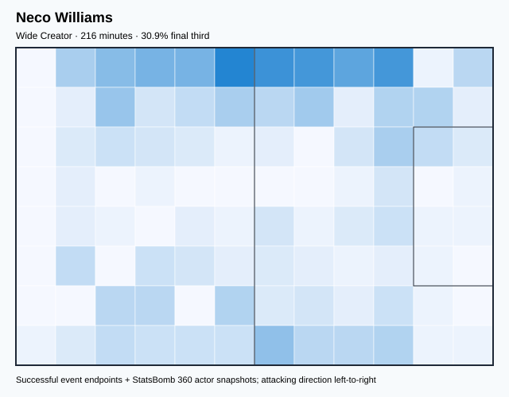

## Physical profile

| Metric | Score |
|---|---:|
| Aerial dominance | 0.600 |
| Pressing intensity per 90 | 14.56 |
| Recovery index per 90 | 7.49 |

## Top chemistry partners

- Chris Mepham — synergy 0.534, 216 shared minutes
- Ben Davies — synergy 0.502, 216 shared minutes
- Joe Rodon — synergy 0.484, 216 shared minutes

## Tactical recommendations

- Lead the first pressing trigger and protect the inside passing lane.
- Target this player on direct restarts and back-post deliveries.
- Use recovery capacity to support higher attacking positions.

_The heatmap combines successful event endpoints with StatsBomb 360 actor
snapshots. StatsBomb 360 is freeze-frame context, not continuous player
tracking. Ratings include eligible outfield players from 45 minutes and
goalkeepers from 90 minutes; ranking status communicates sample reliability._
